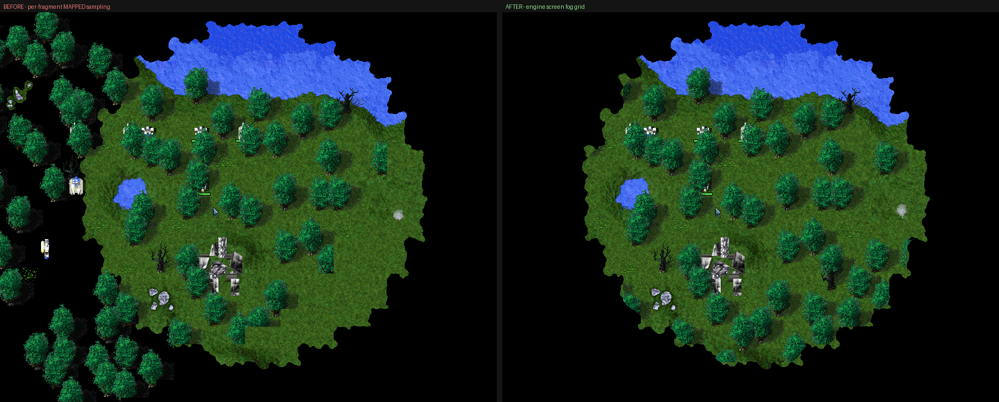

# Features — trees, rocks, splats and wreckage (the feature passes)

*2026-09-02, third session of the day. Reverse-engineered from the pristine exe (Ghidra
decompiles of `0x46A610`, `0x4658E0`, `0x4B7EE0`, `0x4B7F30` and the whole of
`DrawGameScreen 0x468CF0`; `tools/ghidra-scripts/DecompileTAFuncs.java`), verified live
on Two Continents through `tagpu_feat.c`'s gather log, then owned end-to-end
(`tagpu_featown.c`). The RE half extends [Terrain, features & depth](terrain-depth.html)
§3, which mapped the two passes; this page pins the leaf byte-for-byte and describes the
native pass that replaces it. Gate **G13a**.*

## Summary — the six things to know

1. **Every feature pixel in the frame comes from one leaf.** `0x46A610(OFFSCREEN* ctx,
   FeatureStruct* tile, int tileX, int tileY)`, `stdcall`, `ret 0x10`, called from
   exactly three sites, all inside `DrawGameScreen`: the flat pre-pass (`0x469920`
   LOS-gated, `0x46992F` plain) and the deferred row sweep (`0x469ABB`). Detour the leaf
   and the features vanish; nothing else changes.
2. **Flat or tall is a property of the def, and it decides *when*.** `def+0xFA < 10`
   (metal patches, shrubs, scars, smudges) draws in a pre-pass before any unit — pure
   backdrop. Everything taller is deferred (`tile->flags |= 4`) and re-drawn per 16-px
   map row *after* that row's units, which is what makes a tree overdraw the unit
   standing on its row and lose to the unit one row nearer.
3. **The leaf has three bodies**, picked by the tile's wreck flag and the def's mask:
   a 3D wreck through `DrawUnit` on a scratch unit, an animated GAF wreck, or a normal
   feature — shadow then body, each either a plain colour-keyed copy or a 50 % alpha
   blit. Frames are ordinary GAFs; **features carry no depth into anything**.
4. **It is pure draw.** Bodies 2 and 3 write no engine state at all; body 1 writes only
   the draw-side scratch feature-unit `*(main+0x1420F)`. Animation frames are advanced
   by the sim tick, not by the draw — `GAFGetCurrentFramePtrAddr 0x4B7EE0` only indexes
   the sequence table with the frame number it is handed. So owning the leaf is
   invisible to the simulation, and features keep animating while we draw them.
5. **The native pass writes real depth.** `tagpu_feat.c` renders the same frames into
   the native FBO at the row key the painter's order implies — tall bodies at
   `3 + rel*4`, above that row's units at `1 + rel*4` — with depth writes on. That
   replaces the G12a [scene-depth scaffold](native-res-design.html) as the thing that
   hides a unit behind a tree: the occlusion now comes from the depth buffer, and the
   scaffold's stamped silhouettes are no longer needed.
6. **Only defs flagged `+0xFF` bit3 are LOS-gated at all** — and only until the local
   player has seen the tile. Everything else is drawn regardless of fog and then covered
   by the fog overlay, which is why the native pass mirrors the fog rule per fragment
   rather than culling.

---

## 1. The map side — what a feature is

Two arrays, both built by the TNT loader (terrain-depth.md §1):

| Store | Where | Stride | Fields that matter here |
|---|---|---|---|
| `FeatureMap` / `PLOT_MEMORY` | `*(main+0x14287)` | `0x0D` per 16-px tile | `+0x04` u8 tile height · `+0x08` u16 `FeatureDefIndex` (`< 0xFFFB` = a feature's **anchor**; `0xFFFE` = a footprint tile of one) · `+0x0A` u16 wreck-record index · `+0x0C` u8 flags (**bit0** wreckage present, **bit2** deferred-to-the-row-sweep, **bits3..6** the "seen" nibble) |
| `FeatureDef[]` | `*(main+0x1426F)`, count `*(main+0x14253)` | `0x100` | `+0x00` `char Name[0x20]` (**inline, not a pointer**) · `+0x80` description · `+0x94/0x96` i16 footprint in tiles · `+0xAC/0xB0` GAF sequence: static body / shadow · `+0xCC/0xD8` anim state: animating body / shadow · `+0xFA` u8 Height · `+0xFE` u8 mask · `+0xFF` u8 mask-hi |
| Wreck records | `*(main+0x1420B)` | `0x30` | `+0x04` anim state (GAF body) *or* `Object3doStruct*` (3D) · `+0x08/0x0C/0x10` i32 16.16 position · `+0x20/0x24` the turn words body 1 copies · `+0x2F` u8, **bit2 = casts a shadow** |

`def+0xFE` (the mask) [BINARY-VERIFIED]:

| bit | meaning |
|---|---|
| 0 | with tile flags bit0: the wreckage is an **animated GAF**, not a 3DO |
| 1 | the def **animates** — take the anim states at `+0xCC` / `+0xD8` instead of frame 0 of `+0xAC` / `+0xB0` |
| 2 | draw the **body** with the alpha blit instead of a plain copy |
| 3 | draw the **shadow** with the alpha blit |

`def+0xFF` bit3 = this def is LOS-gated (§3).

**Junk defs are real.** A tile can name a def index past `NumFeatureDefs`
(`*(main+0x14253)`, 442 on stock TA), whose `0x100` bytes hold garbage — wild footprints
and invalid sequence pointers. terrain-depth.md's "Corrections" recorded an unclamped
footprint loop hanging the render thread for minutes. The native pass skips any index at
or past the declared count and clamps footprints to `[0, 16]` anyway.

## 2. The two call sites — the flat pre-pass and the row sweep [BINARY-VERIFIED]

Both walk the same rect, and `DrawGameScreen` clamps it to the map before either runs:

```c
nRows = *(main+0x1424F);  r0 = eyeY/16 − 16;   // arithmetic /16, negatives round to 0
if (r0 < 0) { nRows += r0; r0 = 0; }
if (r0 + nRows > mapH − 1) nRows = mapH − r0 − 1;
nCols = *(main+0x1424B);  c0 = eyeX/16 − 10;
if (c0 < 0) { nCols += c0; c0 = 0; }
if (c0 + nCols > mapW − 1) nCols = mapW − c0 − 1;
```

**Flat pre-pass** (after particle layers 0/1/2, before layers 3/4 and every unit):

```c
tile->flags &= ~4;                         // cleared for EVERY tile, every frame
if (tile->defIndex < 0xFFFB) {
    def = FeatureDef + idx*0x100;
    if (def->Height < 10) {
        if (!(def[0xFF] & 8) || ((tile->flags >> 3) & 0xF) == localPlayer
            || FUN_004658E0(player, col, row, def->FootX, def->FootZ, tile->height))
            FUN_0046A610(ctx, tile, col, row);
    } else tile->flags |= 4;               // TALL -> the row sweep
}
```

**Row sweep**, inside the per-row loop, *after* that row's `DrawUnit` calls: the same
gate, entered only for `tile->flags & 4`.

That flag dance is why the native pass detours **the leaf and not the loops**: the
pre-pass still clears bit2 and sets it for tall defs, so the row sweep still sees the
state it expects. We remove pixels, not bookkeeping.

`localPlayer` is `*(main+0x2A43)`; the player struct handed to the LOS helper is
`main + 0x1B63 + localPlayer*0x14B`.

## 3. The LOS helper `0x4658E0` [BINARY-VERIFIED]

`stdcall(PlayerStruct*, short tx, short ty, short footX, short footZ, short height)`,
`ret 0x18`. It samples **two projected footprint corners** and returns true if *either*
passes:

```c
h2 = height >> 1;
corner A = ( (tx*16)          >> 5, (ty*16          − h2) >> 5 )
corner B = ( (tx*16+footX*16) >> 5, (ty*16+footZ*16 − h2) >> 5 )
```

with, per `LosType = *(main+0x14281)`:

- `LosType & 2` (true line of sight) → the player's LOS counter map, `player+0x7C`,
  dims `+0x80`/`+0x84`, non-zero byte = lit;
- otherwise → the MAPPED bitmap `*(main+0x14273)`, u16 per 32-px cell, bit
  `1 << localPlayer`.

Out-of-range corners are *not* visible. Note the gate runs only for defs with `+0xFF`
bit3 — on Two Continents no tree carries it, so in practice almost every feature is
drawn whatever the fog says and the **fog overlay** covers it afterwards.

## 4. The leaf `0x46A610` [BINARY-VERIFIED]

Projection, footprint-centred and height-corrected by the average of the **2×2
anchor-corner tile heights** (the viewport origin is baked in as `(tileX+8)*16` and
`(tileY+2)*16` — the leaf never reads `main+0x37E27`):

```c
worldX = tileX*16 + (def->FootX * 16)/2;
worldZ = tileY*16 + (def->FootZ * 16)/2
         − ((tile[0,0].h + tile[0,1].h + tile[1,0].h + tile[1,1].h) >> 3);
sx = worldX + 128 − eyeX;
sy = worldZ +  32 − eyeY;
```

`tile[0,1]` is `tile + 0x0D` (next column) and `tile[1,*]` is `tile + mapW*0x0D` (next
row); the engine does not bounds-check the map edge, we clamp. Footprints are **signed**
words.

Then the three bodies, with `shadowsOn = *(main+0x37F06) & 0x10` (the `FShadow` option,
see [Shadows & cloaking](shadows-cloak.html)):

```c
if (tile->flags & 1) {                                  /* wreckage on this tile */
    rec = *(main+0x1420B) + tile->wreckIdx*0x30;
    if (!(def[0xFE] & 1)) {                             /* 1. 3D wreckage        */
        scratch = *(main+0x1420F);                      /*    the fake unit      */
        scratch->obj3do   = rec->obj3do;  rec->obj3do->thisUnit = scratch;
        scratch[0x64] = rec[0x20]; scratch[0x68] = rec[0x24];   /* turn          */
        scratch[0x6A/0x6E/0x72] = rec[0x08/0x0C/0x10];          /* 16.16 pos     */
        DrawUnit(ctx, scratch);                         /*    call site 0x46A762 */
        return;
    }
    if ((rec[0x2F] & 4) && shadowsOn)                   /* 2. animated GAF wreck */
        CopyGafToContext(ctx, GAFGetCurrentFramePtrAddr(rec+0x10), sx, sy);
    CopyGafToContext(ctx, GAFGetCurrentFramePtrAddr(rec+0x04), sx, sy);
    return;
}
/* 3. a normal feature — shadow first, then the body */
shad = *(def+0xB0);
if (!(def[0xFE] & 2)) {                                 /* static                */
    if (shad && shadowsOn) blit(GAF_SequenceIndex2Frame(shad, 0), def[0xFE] & 8);
    if (!*(def+0xAC)) return;
    g = GAF_SequenceIndex2Frame(*(def+0xAC), 0);
} else {                                                /* animating             */
    if (shad && shadowsOn) blit(GAFGetCurrentFramePtrAddr(def+0xD8), def[0xFE] & 8);
    if (!*(def+0xAC)) return;                           /* still the STATIC ptr  */
    g = GAFGetCurrentFramePtrAddr(def+0xCC);
}
blit(g, def[0xFE] & 4);          /* alpha -> AlphaCompsteBuf2OFFScreen 0x4B8500, */
                                 /* else CopyGafToContext 0x4B7F90               */
```

Two details worth having in writing, because both would be easy to get wrong from the
prose alone: the **animating** paths still *guard* on the static pointers (`def+0xB0`
for the shadow, `def+0xAC` for the body) while *reading* the anim states, and body 2's
shadow gate is the wreck record's own `+0x2F` bit2, not a def flag.

**The two GAF resolvers are pure reads** [BINARY-VERIFIED]:

```c
GAF_SequenceIndex2Frame(seq, i)      = (0 <= i < seq->n && seq) ? seq[0x28 + i*8] : 0
GAFGetCurrentFramePtrAddr(state)     = state->seq ? state->seq[0x28 + state->frame*8] : 0
```

Neither advances `state->frame` — the sim tick does. That is what makes owning the draw
safe for animated features: they keep animating, we just read the frame the tick chose.

## 5. The native pass — `tagpu_feat.c`

Armed by `tagpu_feat.on`; tokens `log`, `passive`, `noflat`, `notall`, `noshadow`,
`nowreck`. It rides the native pass's frame (`tagpu_native_frame` builds the view: eye,
viewport, palette, LOS/MAPPED textures, the row base) and draws into its FBO **before
the units**, so every unit body is tested against the depth features just wrote.

- **One walk, both passes.** The engine's two loops exist to interleave with the units;
  with a depth buffer that ordering is a *key*, not a sequence, so the module walks the
  clamped sweep rect once and gives every anchor its key by class.
- **Depth keys.** Tall bodies at `3 + rel*4 + 1.5·(col−c0)/nCols`, where `rel = row − r0`
  is the same row base the unit gather uses — above that row's units (`1 + rel*4`),
  below the next row's; the column fraction reproduces the engine's left-to-right paint
  order where two canopies overlap. Flat bodies sit in a narrow band at
  `0.40 + 0.10·scanFraction`, which is **between the particle layers**: the engine draws
  layers 0..2 before the pre-pass and 3..4 after it, so those keys moved to `0.30` and
  `0.60` (they were all `0.5`). Shadows draw at the body's key minus `0.3` (`0.03` for
  flat, whose band is narrow) **with depth writes off** — they are ground decals and
  must never occlude anything.
- **Colour-key discard keeps the depth honest.** A tree writes depth only where it has
  pixels, so a unit shows through the gaps in the canopy exactly as in the engine.
- **Blending is free through the premultiplied FBO.** A 50 %-alpha feature drawn over
  nothing yields `(0.5·rgb, 0.5)`, which the composite resolves as a 50 % blend with the
  engine's terrain underneath — the same thing the engine's ALP table does, without
  needing the terrain in our buffer.
- **Fog** is mirrored per fragment like every other native shader (discard unexplored,
  darken explored-out-of-LOS), and each vertex carries **its own** world position —
  anchor plus the corner's offset — so a tree straddling the fog edge fades across it
  instead of all at once. Getting this wrong (feeding the shader screen coordinates) made
  every feature vanish the moment fog was switched on; it is the one bug this gate had.
- **Frames come from `tagpu_gaf.c`** (below): a 2048² `GL_R8` shelf atlas, 4096 entries,
  raw / TA-RLE / sub-frame lists, sampled `NEAREST` so the texel *is* the palette index.

Log every 60 frames:

```
feat: rect=68x76 anchors=231 flat=38 tall=193 gafwreck=0 3dwreck=1 defs=442
      anim=1 los-skip=0 junk=0 -> body=231 shadow=193 atlas=16
```

with `log` adding the first eight on-screen features per sample (`feat: def=4 "Tree1"
h=40 foot=1x1 mask=D9/B1 tall frame=52x71 hot=(28,70) tile=(169,57) at=(224,45)
enc=79.35`).

### `tagpu_gaf.c` — the shared GAF module

The RLE decoder and the shelf atlas were a private copy inside `tagpu_fx.c`; three
reviews had asked for one copy. They now live in `tagpu_gaf.c` with the frame/sequence
/anim-state layout and the two resolvers, and the atlas is *caller-owned* storage so each
pass keeps its own lifetime — the effects atlas churns as explosion sequences are freed,
the feature atlas fills once per map and stays (16 entries in a forest, ~1000 across a
200v200 battle as the ground fills with scar and smudge defs). `tagpu_detour.c` did the
same for the stub/patch machinery, now shared by `tagpu_fxown.c` and `tagpu_featown.c`.

## 6. Owning the draw — `tagpu_featown.c` [LIVE-VERIFIED]

One byte-matched prologue detour, installed once at DllMain when `tagpu_featown.on`
exists then (tacli auto-creates it at launch when `tagpu_feat.on` is set):

| Site | Prologue | Stub |
|---|---|---|
| `0x46A610` | `8B 4C 24 08 53` = `mov ecx,[esp+8]; push ebx` — five position-independent bytes ending on an instruction boundary | `cmp byte [skip],0; jz stolen; ret 0x10`, else the stolen bytes and `jmp 0x46A615` |

The skip byte is set by each frame the native pass actually gathers — never by the file
alone — and cleared by `passive`, by the file's absence, and by a 90-frame heartbeat
timeout in `tagpu_featown_flush` if the pass stops running, so a GL failure brings the
engine's features back instead of leaving a bare map. An engine-vs-ours A/B is a file
flip on one instance, no relaunch.

**It also requires `native.on=… wrecks`.** Body 1 draws 3D wreckage through `DrawUnit`,
which only the native pass's wreck gather replaces; without it, owning the leaf would
delete every husk on the map. `tagpu_feat.c` checks `tagpu_native_wrecks_armed()` before
setting the skip and says so in its log line when it refuses.

Install line: `featown: ARMED feature@0x46A610=1 (skip follows tagpu_feat.on)`; heartbeat
`FEATOWN skip=1` every 300 frames.

## 7. Verification (2026-09-02, `scenarios/feat-forest.json` on Two Continents)

<figure><figcaption>The gate. LEFT the engine drawing its own units <em>and</em> its own features; RIGHT ours drawing both, same camera, <code>scaffold.on</code> disarmed. The five units parked two tile rows north of a tree row are clipped by the same canopies to the same slivers in both, and the two units one row south stay in front.</figcaption></figure>

- **Gather**: 231 anchors in the sweep rect (38 flat, 193 tall), `Tree1`/`Tree3` at
  height 40 with 52×71 and 47×67 frames, `Shrub3` at height 4 in the flat band, 442
  declared defs, **zero junk and zero LOS skips** on this map; one animating def (a
  geothermal vent) exercises the `+0xCC` anim-state path live.
- **Projection**: logged anchors land on the engine's pixels. In a unit-free band of the
  frame, engine-drawn and ours differ in 6.5–9.4 % of pixels at a mean absolute
  difference of **1.0/255**, and the differing horizontal runs are **1–2 px** (median 1,
  p90 4) — edges, not displaced sprites. A shifted tree would give runs of 30–50 px.
- **Ownership** (negative proof): with the leaf owned, the engine's 8bpp surface contains
  **no feature at all** — no trees, rocks, shrubs or dead trunks, only terrain, the
  nanoframe wireframes, health bars and the UI — while the GL frame carries ours.
- **Occlusion, the exit condition**: verified against the engine's *own* draw rather than
  against a scaffold. Parked units and the walking commander are clipped by the same
  canopies; a unit one row nearer stays in front.
- **Fog: NOT at parity — see §9.** Feeding the shader screen coordinates instead of world
  ones made every feature vanish the moment fog came on (fixed), but the rule the native
  passes share still does not reproduce the engine's overlay: with a small explored area
  our features are drawn over cells the engine paints black.
- **The wrecks guard holds live.** Dropping `wrecks` from `native.on` makes the pass keep
  gathering and counting but **emit nothing** — `FEATOWN skip=0` and `(nothing emitted:
  native.on needs "wrecks" before we can own the leaf)` in the log line — and putting it
  back restores ownership inside the 30-frame re-check. Two things ride on that: owning
  the leaf without the native wreck pass would delete every 3D husk on the map, and
  drawing while the engine still draws would be a double draw with the occlusion this
  pass exists for silently inert.
- **Scrolling**: sweeping the camera across the map (forest → ocean → forest) moves
  anchors 231 → 0 → 197 with no dropped quads and no atlas recycle.
- **Stress**: `200v200` at sim +3 with units, wrecks, features, effects and particles all
  native holds **~60 fps** measured off the 60-frame `feat:` cadence — 61.6 fps with 214
  native units and 236 anchors on screen, 59.6 fps later in the same battle with fog on,
  31 native wrecks and 255 anchors (218 bodies + 173 shadows). The atlas settles at ~1300
  entries as the ground fills with scar and smudge defs and **never recycles**; the first
  cut capped it at 1024 and recycled three times in one battle.
- **Not covered**: the engine's own `+0xFF` bit3 LOS gate never fired on the maps tested
  (`los-skip` is always 0), and the animated-GAF-wreck body was never reached (§8).
- **The shadow difference is the ALP table.** Our feature shadows are a true 50 % RGB
  blend; the engine's is a palette-space remap through `ALP[src·256 + dst]`, which
  quantises to palette entries and therefore dithers. The diff map shows exactly this:
  a speckled crescent on each tree's shadow side, and clean bodies. Same class of
  deviation as the effects pass's LHT flash approximation.

## 8. What this retires, and what is left

**The G12a scene-depth scaffold is no longer the occluder.** It stamped tall-feature
silhouettes into a viewport-sized `R8` buffer that the unit and particle shaders tested
against; features now write the depth buffer directly, so the test is redundant and
`scaffold.on` should stay disarmed. The module and its shader snippet
(`TAGPU_GLSL_SCAF_TEST`) remain available and off — it is still the only way to get the
occlusion when the feature pass itself is off, and its debug overlay tints every tall
feature purple, which is why it must not be armed for capture.

Gaps, honestly:

- **Body 2 (animated GAF wreckage) has never been observed live.** It needs a tile
  carrying wreckage whose def has mask bit0 — and in stock TA all 63 defs with that bit
  are map scenery (trees, rocks, vents, smudges) while every `*_dead` unit wreck has it
  clear, so wreckage always takes body 1. The code is written from the decompile and
  guarded, but it is untested against pixels.
- The engine's LOS gate (`+0xFF` bit3) is implemented but no def on the maps tested
  carries the flag, so `los-skip` has only ever been 0.
- Feature shadows are the RGB approximation described above, not the ALP remap.
- The atlas recycles rather than evicting; a map whose working set exceeds 4096 frames or
  2048² of texels re-decodes everything on the next frame (never mid-frame). A 200v200
  battle reaches roughly a quarter of that.

## 9. The fog gap — closed (G13c, 2026-09-02)

<figure><figcaption>THE BUG, before G13c: LEFT the engine drawing its own features, RIGHT ours, same frame, fog of war on. The engine draws nothing in the unexplored black; we drew trees across it.</figcaption></figure>

Every native pass used to mirror the fog by sampling the two source maps per
fragment: discard where the MAPPED bit is clear, darken where the LOS counter is
zero — the advice in [terrain-depth.md](terrain-depth.html) §6 item 4. **That
advice was wrong**, and this gate reversed it. The engine's overlay is driven
*entirely* by the view-anchored **screen fog grid** behind `*(main+0x1421F)`,
and the source maps do not reproduce it.

**Why it could not work.** Two independent reasons, both now measured:

1. **Half-cell offset.** The grid's corners sit at map-cell *centres*
   (origin `32·col0 + 16`), so a per-cell test is ~16 px out of register — and
   the overlay's shape is a **4-bit corner mask** feathered by 14 edge sprites,
   which a per-cell boolean cannot express at all. Geometry in
   terrain-depth.md §5.2.
2. **The source map disagrees with the drawn frame.** Read in the *same frame*
   at the same cells: MAPPED said explored for cols 80..98 of row 20 while the
   grid — and the screenshot — had only 92..96 lit. That discrepancy is still
   unexplained and is written up in terrain-depth.md §5.2; it is moot for
   rendering, because the grid is by construction what the engine drew.

**The fix.** One shared GLSL snippet (`tagpu_glsl.h`, `TAGPU_GLSL_FOG_*`) used by
all four passes, replacing four copy-pasted blocks and the `uLos`/`uMap` texture
pair with a single `uFogGrid`:

- the grid uploads as an **RG8 texture with no conversion** — its two bytes per
  cell already *are* `r = unexplored corner mask, g = out-of-LOS corner mask`;
- **bilinear coverage over the four corner bits, thresholded at 0.5**, is the 14
  edge shapes (`0xF` → everywhere, `0x3` → exactly the top half, a lone corner →
  its quadrant). We get a clean edge where the engine dithers one — the same
  class of approximation as the LHT flash and the feature shadows;
- the grey darken is the engine's real one: the shade LUT at
  `*(TAProgram+0xCC)` applied to the palette **index** before the palette fetch.
  A plain 0.55 multiply on the resolved colour is visibly too dark on canopies;
- **units and effects hide in grey; terrain, features and wreckage stay** and are
  remapped. This is the rule the passes did not implement at all before.
  `LosType` bit1 needs no flag: the builder only writes the grey mask when it is
  set, so "mapped" mode simply has an all-zero grey byte.

**Measured, `feat-forest` on Two Continents, GL framebuffer, engine-draw vs
ours at the same camera** (`feat.on="log passive"` vs `feat.on=log`):

| mode | lit only in engine's draw | lit only in ours | agreeing |
|---|---|---|---|
| mapping only (`LosType=9`, fog=1) | 48 | 821 | 287 531 |
| true LOS (`LosType=15`, fog=3) | **97** | 186 | 576 990 |

0.05 % of the frame, and what is left is the dithered edge sprites plus unit
health bars that moved between the two captures. The intermediate reading of
19 768 in the true-LOS column is what the 0.55 multiply cost before the shade
LUT went in — worth knowing if the grey ever looks wrong again.

**Verified live**, not just by pixel count: an enemy solar collector standing on
fully-grey ground is **not drawn**, while the flattened building footprint it
stamped into the terrain still shows through the grey — which is exactly TA's
rule that grey shows terrain but not units.

<figure><figcaption>The same camera on <code>feat-forest</code>, our GL framebuffer both times. LEFT the old per-fragment MAPPED rule: a whole forest and two units float on unexplored black. RIGHT the engine's own fog grid: the trees stop on the boundary the engine drew, and the units that stood in the black are gone.</figcaption></figure>

## Appendix — addresses

| VA | What |
|---|---|
| `0x46A610` | **the feature draw leaf**, `stdcall(ctx, tile, tileX, tileY)` `ret 0x10`; exits `0x46A71E` / `0x46A76B` / `0x46A849`; prologue `8B 4C 24 08 53` |
| `0x46A762` | `DrawUnit` call site inside body 1 (the scratch feature-unit) |
| `0x469920` / `0x46992F` | flat pre-pass call sites (LOS-gated / plain) |
| `0x469ABB` | deferred row-sweep call site |
| `0x4658E0` | feature LOS/MAPPED test, `stdcall` ×6 args, `ret 0x18` |
| `0x4B7F30` / `0x4B7EE0` | `GAF_SequenceIndex2Frame` / `GAFGetCurrentFramePtrAddr` — both pure reads |
| `0x4B7F90` / `0x4B8500` | `CopyGafToContext` / `AlphaCompsteBuf2OFFScreen`, `ret 0x10` |
| `main+0x14287` | `FeatureMap` (stride `0x0D`) |
| `main+0x1426F` / `main+0x14253` | `FeatureDef[]` (stride `0x100`) / `NumFeatureDefs` |
| `main+0x1420B` / `main+0x1420F` | wreck records (stride `0x30`) / the scratch feature-unit |
| `main+0x14233` / `main+0x14237` | map W/H in 16-px tiles |
| `main+0x1424B` / `main+0x1424F` | sweep cols / rows |
| `main+0x1431F` / `main+0x14323` | eyeX / eyeY |
| `main+0x14273` / `main+0x14281` | MAPPED bitmap / `LosType` |
| `main+0x2A43` / `main+0x1B63 + id·0x14B` | local player id / PlayerStruct (`+0x7C` LOS map) |
| `main+0x37F06` | gfx options, **bit4 = FShadow** |
| `*(main+0x1421F)` | → `{u16* buf, cols, rows, cells}` screen fog grid; per 32-px view cell 2 bytes = `(unexplored, out-of-LOS)` **4-bit corner masks**, origin `32·col0+16` — the fog source for every native pass (§9) |
| `*(TAProgram+0xCC)` | u8[256] fog shade remap: the grey band's darken, applied to the palette index (§9) |
