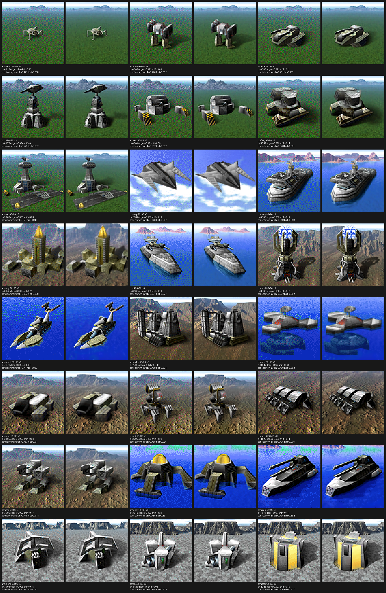
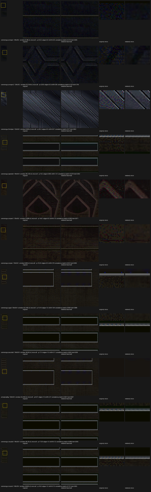
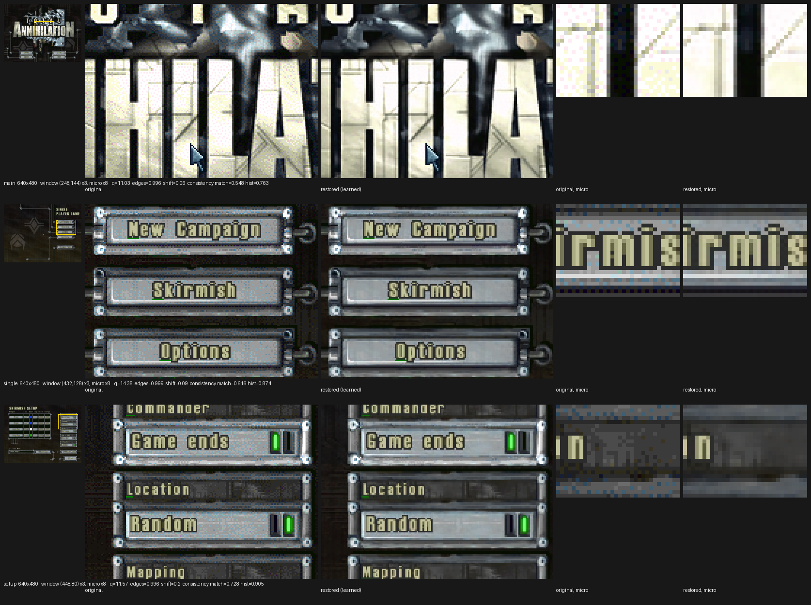
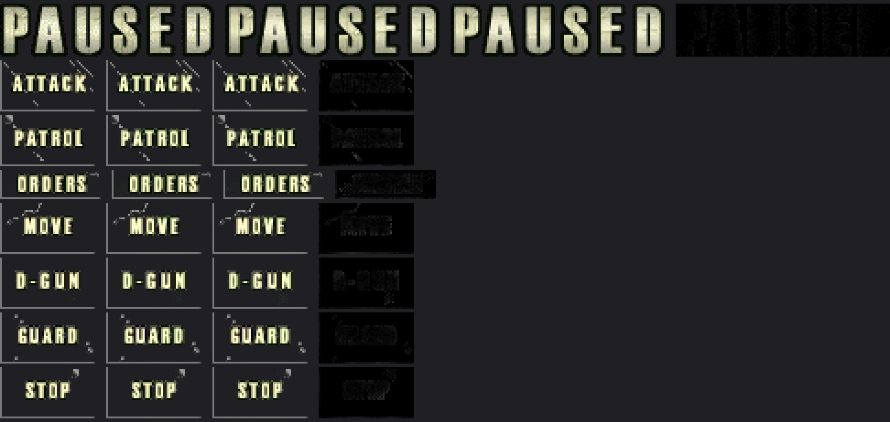

# GL UI renderer — the plan for Phase E

*The engine's software frame is UI only since G13b; this page is the plan for making the UI
ours too — the side panel, the top and bottom bars, the minimap, chat and dialogs in game, and
every screen of the shell outside it — drawn by OpenGL from the engine's own draw calls, with
the same Classic / Classic++ split the world has. It records the decisions of the 2026-09-06
design interview with their reasons, the engine facts they rest on, the module boundary, the
gates with their exits and kill rules, and what a later phase must find intact. G15-0 (§8),
G15a (§9) and G15b (§10) are built and measured — G15b is the twins, drawing the in-game UI and
the shell at 1:1 under Classic — and the three land together. The gadget-tree facts it leans on are on
[GUI gadgets](gui-gadgets.html), the composite on [terrain & depth](terrain-depth.html) §7, and
the restorer on [Classic and Classic++](renderers.html) §4c.*

Evidence tags: **[SOURCE]** = read from the code named; **[VERIFIED]** = read in the
disassembly, with the address; **[MEASURED]** = a live or offline measurement with the numbers;
**[DECIDED]** = a choice made by the project owner, with the date; **[INFERRED]** = a name or
role not yet confirmed; **[OPEN]** = not settled.

---

## 1. What this is, and what it is not

**Phase 1 — the same layout at the same pixel size, drawn by us** [DECIDED 2026-09-06]. Every UI
pixel comes from our GL draw at 1:1. Under Classic the frame is pixel-identical to today's; under
Classic++ the panel art, buttons and unit pictures are restored while text stays a crisp 1-bit
glyph. The engine's 8-bit surface stops being what the player sees and becomes the *oracle* the
gates measure against and the *fallback* that shows anything we missed.

**Phase 2 — the UI scaled** [DECIDED 2026-09-06; **the interview ran 2026-09-08 — §13**, which
settles the eight questions this paragraph deferred and supersedes five decisions below]. At 1080p and above the
128-px side panel and the 32-px bars are drawn at 2× and the world viewport shrinks around them.
The engine's layout constants are fixed pixels (`left=128`, `top=32`, `bottom=H−33`, written once
at `0x4981C9..0x498237` — [resolution](resolution.html) §2), so this means running the engine at a
logical resolution and rendering the world at the device's. Phase 1 must not close that door;
§6 lists what it has to leave intact. The shell is the easy half of phase 2: its layout is
640×480 whatever the window is, so "draw the 640×480 layout into a window-sized twin with smooth
filtering" is a late gate, not a new architecture.

**Not this project**: a redesigned UI; hi-res fonts (§13.4 draws TA's own glyphs, it does not
add a font); regenerating the minimap **from our terrain atlas** — still a candidate, §13.6
regenerates it from the game's own 252-px picture instead.

---

## 2. What the engine does — the facts the design rests on

**One surface, one present.** World and UI land in one 8-bit `OFFSCREEN` (`*(main+0x37E1B)`,
`0x30`-byte header: `+0x00 w`, `+0x04 h`, `+0x08 pitch`, `+0x0C pixel base`, clip rect
`+0x1C..+0x28`) and `FlipOffscreenToPrimary 0x4C63A0` copies it to the DirectDraw primary — from
`DrawGameScreen` at `0x46A3DB` and from 43 other sites, the shell included **[VERIFIED,
[frame composition](frame-composition.html) §5]**. cnc-ddraw uploads the primary as one `GL_R8`
texture and draws it through a palette lookup; every UI pixel on screen today is that quad.

**The GUI is retained, not redrawn** **[VERIFIED 2026-09-06, objdump]**. Every `.GUI` screen owns
a pre-rendered 8-bit surface at `panel+0xBC`; the gadget handlers behind the type dispatcher
`0x4A9176` (table `0x4A962C`) render into *that*. The per-frame GUI draw is
`0x46A303: call 0x4AB170(main+0x519, &ctx, main+0x37E27)`, a thunk into
`0x4AB0B0(GUIMEMSTRUCT*, OFFSCREEN* ctx, RECT* vp)`, `ret 0xC`, which recurses down the GUI
stack (`+0x00 per_active`) bottom-up and, for each screen, blits its surface with
`0x4C6B70(ctx, panel+0xBC, panel.x, panel.y)` **only if** `Active_b (+0x14) == 1` **or** the
panel rect `(+0x13, +0x15, +0x17, +0x19)` overlaps `vp` per `0x4B67D0` [INFERRED name; the call
shape is verified]. A null `vp` takes the dirty test alone. The in-game side panel at
`[0,128,128,352]` does not overlap the viewport `{128,32,W−1,H−33}`, so it is re-blitted only
when something marks it dirty.

**The rest of the in-game HUD is per-frame into the main offscreen** **[VERIFIED,
[UI markers](ui-markers.html) §4 and the `DrawGameScreen` tail]**: the resource text block
(`DrawTextCustomFont 0x4C14F0` and four GAF blits, `~0x468E40..0x4692C0`, string
`"%dK%s %s%s E:%d M:%d"` at `0x50783C`), `DrawChatText 0x464060` at `0x469FCB`,
`DrawPopupF4Dialog 0x4948E0` at `0x469F65`, `DrawPopupButtomDialog 0x4689C0` at `0x469F9F`, the
clock and debug strings, the `LIGHTBAR` slide `0x45FFB0` at `0x46A3C2`, and the debug profiler
bars `0x46B900` ×9 at `0x46A330..0x46A3B8` (gated `main+0x38DD5` — these are **not** the side
panel or the minimap, whatever `ui-markers.md` §4 says; G15a corrects it). The panel art itself
is painted once per mode switch by `0x467D70` at `0x49842A`, the bottom bar anchored to
`ScreenH − 0x20`.

**The minimap** picture is `TED_GENERATED_PIC *(main+0x1426B)`, its rect `main+0x142E7..0x142ED`,
its view box `main+0x142CB` (filled by `0x466B70`, already ours at zoom). **Located by G15a
[VERIFIED 2026-09-07]**: `DrawMinimap 0x466B00(ctx)` at `0x46961F` in DrawGameScreen copies the
composite surface `main+0x142DB` into the frame with `0x4C6B70` and draws the view box with
`0x4BF8C0`; the composite itself (picture plus radar dots) is rebuilt from the sim side by
`0x466DC0`/`0x466C20`, not per frame. It never goes through the GUI surfaces.

**The pixel-writing leaves are known** **[VERIFIED, appendix]**: the GAF blits (`CopyGafToContext
0x4B7F90`, its shaded twin `0x4B8500`, the clipped descriptor blit `0x4B8150`, the tile copy
`0x4C6E70`), the glyph blitter `0x4CCF60` (cdecl, nine arguments, **takes its destination
pointer directly**, no context and no clip — `tagpu_text.c` already calls it), the line, bar
and hollow-rect drawers (`0x4BE950`, `0x4BF6F0`, `0x4BF8C0`, all through the store-only Bresenham
`0x4CC7AB` and the bar worker `0x4CCDEA`), and the surface copy `0x4C6B70` over
`CopyScreenContext 0x4CBBE0`. Surfaces come from `SurfaceCreateNamed 0x4C69F0(tag, w, h)` and go
back through `SurfaceFree 0x4C6AC0` **[VERIFIED 2026-09-07]**; G15a added the descriptor blit
`0x4C6D20`, the textured-triangle stamp `0x4C7580`, the framed box `0x4BF4D0`, the focus rect
`0x4BF7B0` and `SurfaceFill 0x4C6890` to the set, and found `0x4B8150` to be terrain-only
(engine map, "The UI surfaces and their writers").

**The shell is the same gadget system at 640×480**, atom-locked (`0x498025..0x498108`,
`0x491ADC..`) whatever the registry says; the requested mode is applied at game entry and undone
on exit, and each switch is a real `SetDisplayMode` that restarts cnc-ddraw's render thread with
a **new GL context** **[VERIFIED, [resolution](resolution.html) §2; MEASURED, roadmap G12]**.
Under tacli's windowed config the window is literally 640×480 in the menus. Game entry loads
`palettes/guipal` at `0x498109` for the loading screen; `palettes/guipal.pal` ships beside
`palette.pal`; whether the shell fades or swaps palettes has **never been measured** — only that
nothing cycles in play [MEASURED, terrain-depth §7; OPEN here].

**The cursor is in the back buffer only inside the flip.** `0x4C2870` at `0x46A3C7` blits it with
a NULL context — which resolves to the back buffer — and the flip itself draws it into the back
buffer with `0x4C67C0`, copies to the primary, and **restores the background** with `0x4C6B70`
before unlocking **[VERIFIED 2026-09-07, engine map "FlipOffscreenToPrimary"]**; at the flip's
entry the buffer holds no cursor, which is why a diff taken there never sees one. Since G13m it
sits under the true pointer with 0 % of motion frames left behind [MEASURED].

**The engine free-runs.** Its frame loop ran ~83 `DrawGameScreen` passes per presented frame at
1024×768 in the G13d capture (9 300–10 200 blocks per 120 presents) **[MEASURED, ui-markers
§6.2]**. Anything that records per engine frame must expect that ratio.

**The composite today** **[SOURCE `tagpu_native.c` CFS]**: inside the true viewport rect our
fragment is discarded wherever the engine's surface is not the key (index 254); outside it the
engine's frame wins unless we drew a non-empty pixel, which the world passes never do.

---

## 3. Decisions  [DECIDED 2026-09-06 unless noted]

### 3.1 Outcome: phase 1 is parity at 1:1, phase 2 is scale
§1. The one rule phase 1 carries for phase 2: **the UI twin's size is `surface × k`, `k = 1`
now**, ops are recorded in logical (game) coordinates, and nothing in the module assumes
`k == 1`.

> **Superseded 2026-09-08 (§13.2).** The twin stays 1:1 and `k` applies at the *draw*, with a
> device-res sharp layer added beside it — so phase 1's oracle diff keeps working at every `k`
> instead of becoming undefined. The rest of the rule stands: ops are logical, nothing assumes
> `k == 1`.

### 3.2 Mechanism: mirror the primitives into retained GL twins; seed from the surface as fallback
Every engine surface gets a GL twin — the main offscreen, each screen's `+0xBC` surface, the
minimap picture, whatever else the census names. Each pixel-writing leaf gets an **observer**
detour: it records what was drawn and returns to the original, so the engine keeps drawing its
own surface, which stays the oracle. Nothing is suppressed in phase 1.

A surface whose writers are all known is drawn from primitives. One that is not — or one first
seen mid-life, or every one after a GL context change — is **seeded**: its twin's content is a
copy of the engine's own bytes (§3.5). The alternatives were weighed and rejected: uploading the
engine's surfaces whole and restoring them as images (complete on day one, but it feeds text to a
model that has never seen text and makes phase 2 an upscale of a 1997 bitmap), and
re-implementing the gadgets from the live tree (full control, largest effort, and every
load-time rewrite the engine does to slider geometry or synthesised scroll arrows becomes a
divergence to chase).

### 3.3 Composite: the twin wins, the engine's surface is the fallback, `strict` removes it
Three layers, in order: **the UI twin where its coverage is set**, everywhere, viewport included
— that is how mirrored chat, `ARMOPT`, `EXITMENU` and the F4 dialog land over the world at 1:1,
untouched by zoom, which also closes the open note in [GPU status](gpu-status.html) that dialogs
over the viewport "take the transform as though they were world"; **else the engine's surface
where it is not the key** (the cursor, and anything unmirrored); **else our world**. The twin's
**viewport region is transient**: the terrain key fill is the engine's per-frame erase there, so
its mirror is "clear the twin to transparent over the true viewport rect". Outside the viewport
the twin is retained and the engine erases with primitives, which are mirrored like any other
draw.

The fallback is always on for players. A `strict` token in the trigger turns it off and paints
a miss in a sentinel colour, so a screenshot walk *counts* holes instead of hiding them. `strict`
is the harness's mode, never a player's.

### 3.4 Twin format: an index twin always, a colour twin under Classic++
Every mirrored draw writes the **palette index** into an `RG8` twin (index, coverage). Under
Classic++ the GAF sprite ops also write restored colour into an `RGBA8` twin. The composite
resolves the index twin through the **live** palette, exactly as the engine's surface is resolved
today, so `guipal` swaps and any menu fade are correct by construction under Classic. The colour
twin is used only while the live palette still equals the palette its restore snapshotted; when
it moves, that surface falls back to its index twin until the palette settles and the art is
re-restored. A fade shows dithered art for its duration, never wrong colours.

Coverage lives in the second channel rather than in a reserved index: "index 254 is unused" was
measured inside the viewport, not on GAF art.

> **Built, G15e (§14).** As built the colour twin is `COLOR_ATTACHMENT1` of the *same* FBO, so
> one MRT draw writes the index and the colour together; and the "restore snapshotted" palette
> is a real snapshot — `tagpu_rglsl_job_new` copies it into a texture of its own — so the
> validity test is a `memcmp` against the palette the frame is **presented** with, per G15d. The
> re-restore half is built too: 30 still frames and the job is rebuilt against the new palette.

### 3.5 Record on the game thread, replay all at present, seed instead of reconstruct
- **Record.** Each observer appends `(surface, op, args, engine-frame seq)` to a ring. A
  prologue detour on `FlipOffscreenToPrimary 0x4C63A0` appends a **frame marker**, the engine's
  own "this frame is complete" point.
- **Replay all, in order, at our present** — not "the last engine frame only": a panel redraw in
  engine frame 37 of 80 must not be dropped, because the panel twin is retained. *As built
  (G15b, §10)*: all in order, with two refinements the run forced — identical ops within one
  published batch collapse to their last occurrence (the shell redraws every gadget on every
  one of its ~12 000 flips a second), and a pixel op carries its box's bytes as they stand at
  publish time, so it is the final state of that box whatever wrote it.
- **Seed, do not reconstruct.** A twin created for a surface that already exists takes a copy of
  the engine's bytes, made on the game thread at the flip marker where the frame is quiet. The
  same path is the **overflow policy**: a full ring stops recording, marks every surface for
  re-seed, and the next flip re-seeds them. And it is the **re-arm path**: the module toggled
  back on, or a new GL context, re-seeds rather than replaying history.
- **GAF pixels for atlas misses are copied into the ring on first sight**; later blits of the
  same frame carry only the atlas key. The sprite atlases read frame pixels on the render thread
  from the pointer, which the shell's constant pop-and-free would turn into a use-after-free
  here. A full 640×480 background is 300 KB once.
- **Registry.** Surfaces are keyed by object address, pixel base and size, registered from the
  `0x4C69F0` allocator and the GUI surface creation, evicted on free, and lazily registered when
  a primitive names one we have not seen.

### 3.6 Three op kinds; unknown writers are caught by brackets, and counted by the census
Only GAF blits need their **identity** (the frame, for the Classic++ twin and for phase-2
filtering). Everything else only needs its **result**.

- **Sprite op**: a GAF blit with frame key, destination, colour-key and blend flags; replayed
  from the UI atlas (index) and its restored twin (colour).
- **Copy op**: surface to surface (`0x4C6B70`); replayed twin to twin. The GUI panel reaching the
  frame is one of these.
- **Pixel op**: a rect of captured indices with a coverage mask; replayed as a quad into the
  index twin and, palette-resolved, into the colour twin.

Pixel ops come from **brackets**: an observer around a unit of work with a known bounding box
snapshots the box before, lets the engine run, and records the **residual** after. Sprite ops
inside the bracket shadow-write the snapshot on the CPU (the engine's own key-skipping copy), so
the residual is exactly what nothing else explained. Two bracket kinds cover the UI: **per leaf**
(the glyph blitter, box from the font's width table; the line, bar and rect drawers, box from
their arguments) and **per gadget** (the dispatcher `0x4A9176`, box = the gadget rect,
destination = the screen's own surface), which captures every handler's output without knowing
its internals and retires `GUI_BlitToFramebuffer 0x4B0230`, the listbox renderer and the slider
knob as unknowns.

**Text and lines are captured pixels, not re-derived geometry.** G13o and G13p ported markers and
labels as geometry because the world needed them zoom-invariant. The UI is screen-space at 1:1,
so a captured pixel is exact and free, and text stays a crisp index under Classic++ because the
restorer never sees it. In phase 2 captured pixels scale by nearest — for 1-bit text the honest
1997 look at 2× — and a string op that re-renders from a nicer font is the upgrade path, added
later without touching the model.

> **Superseded 2026-09-08 (§13.3, §13.4).** Nearest staggers every 1-px feature at a fractional
> `k`, so the mirror scales by a sharp bilinear that is bit-identical at `k = 1`; and the string
> op is taken, drawing **TA's own glyphs** from `tagpu_text.c`'s atlas rather than a nicer font,
> which §1 excludes.

**The census** is the same machinery pointed at the whole surface: at each flip, diff the surface
against its previous copy and subtract every recorded op's box. What remains is a writer we have
not bracketed, with its exact pixels, per screen. It is G15a's exit and every later gate's
regression.

### 3.7 The cursor stays the engine's in phase 1
It never enters a twin (§2), so it reaches the frame through the fallback, as today. `strict`
exempts its rect (position `[obj+0x1B6/0x1BA]`, size from the sprite record at `+0x1B2`). Owning
it — drawing the sprite at present time from the true pointer and suppressing the four engine
blits — is the **first gate of phase 2**, where a 1× cursor on a 2× UI forces it.

> **Amended 2026-09-08 (§13.5).** Owning it needs no suppression: the layer's cursor branch
> changes from *discard* to *mask the fallback in that rect*, and the engine's blits may keep
> running into a frame nobody sees. The sprite record is a GAF frame header, so its size and
> hotspot are already in hand. Its size stays **1× device pixels at every `k`**.

### 3.8 The minimap is mirrored like everything else
A sprite op if it goes through a GAF blit, a pixel op through the gadget bracket otherwise; dots
and view box are residual pixels. Under Classic++ the picture is restored as one frame if it
arrives with an identity. Regenerating it from our restored terrain atlas is a candidate for
phase 2, where a 252-px picture at 2× may not be enough.

> **Decided 2026-09-08 (§13.6).** Phase 2 regenerates it — base, fog and view box ours, **the
> engine's dots kept**, since which units get a dot is fog/LOS sim logic and re-deriving it wrong
> is a multiplayer cheat. The base is the game's own `TED_GENERATED_PIC` at its native 252 px,
> which the engine halves; the terrain-atlas variant stays a candidate.

### 3.9 Classic++ on UI art: judge offline first, then a name-glob policy
The restorer was trained on ground textures and has never seen a bevel, a button or a
`unitpics` render **[SOURCE `unditherer/LEARNINGS.md`]**. So:

- **G15-0, before any engine code**: extract the shell backgrounds (`bitmaps/*.pcx`), the HUD art
  (`bitmaps/armgui{top,side,bot}tile.pcx` and CORE's), the button and small art (`ARMBUTT`,
  `CORBUTT`, `anims/loadgame.gaf`, `anims/cursors.gaf` as the expected exclusion) and a sample
  of `unitpics/*.pcx`, run `python -m unditherer restore … --preset learned --report
  --consistency` on them offline, and put original beside restored at 3× on one contact sheet
  per class, rows sorted by dither-consistency ascending, plus one whole captured menu screen
  as the cautionary column showing what text becomes if it were not excluded. The owner judges
  per class.
- **Runtime policy**: frame headers carry no name, but `0x4B8D40`/`0x4B8DA0` look sequences up by
  name, so an observer there gives a sequence-to-name registry, and `uirestore=` in
  `tagpu_classicpp.cfg` takes name globs; **the default, ruled 2026-09-08 from G15-0's sheets, is
  `all` minus `cursor*`, `pathicon` and anything under 12×12** (below the 25-px receptive field
  there is nothing to restore). The order buttons are in, despite their baked-in labels (§8).
- **Kill rule**: if bevels and panel grain smear, the exclude list grows until what remains looks
  right, and a UI-aware fine-tune (synthesised bevels and renders in the corpus) is filed as a
  candidate, not started. The Classic half is unaffected.
- The UI job takes priority 4 in the restorer's pool, which today has `MAX_JOBS 4` for
  priorities 0–3 [SOURCE `tagpu_restoreglsl.c`]; G15e raises it.

### 3.10 One module, one trigger, one seam
The UI is a subsystem, not a surface. Family `tagpu_gui_*.c`, contract `tagpu_gui.h`, trigger
`gamedir/tagpu_gui.on` with tokens (`strict` and `off` now — `off` keeps the detours installed
for the next launch while nothing is published or drawn, the live A/B; `scale=`, `nocursor` in
phase 2). §4.

- The detours install once at DLL attach if the trigger exists then, per the arming rule in
  [own the draw](own-the-draw.html), and are safe to leave resident: every one calls the original,
  so with the module off the engine's behaviour is byte-identical to today's.
- The **drawing follows the trigger live**, polled per frame like `tagpu_classicpp.on`: delete
  the file and the composite drops the twin layer that frame; recreate it and the twins re-seed
  at the next flip. Off also stops recording, so an idle module is a few `if`s.
- **Switch matrix**: `gui` off → engine UI whatever Classic++ says; `gui` on, `classicpp` off →
  our Classic UI, pixel-identical; both on → restored art under `uirestore`. The §2.10 Options
  menu of [renderers](renderers.html) later gets an "engine / GL" UI switch that creates or
  deletes the trigger — front end, not store.
- **tacli**: a `gui on|strict|census|off|remove` verb (G15b) and `gui.on` in the default arm
  set of the ta-drive skill, so the pass is armed at launch for anyone using the driver.

### 3.11 Verification: the engine's surface is the oracle
- **The strict walk.** A script under `tools/` drives one instance through a fixed screen
  inventory by gadget name via `tacli ui`, and at each screen takes the engine's surface shot
  and our GL framebuffer shot in Classic under `strict`. Exit per screen is two zeros:
  differing pixels outside the cursor rect, and sentinel-coloured holes. Inventory: the shell
  (`MAINMENU`, `SINGLE`, `SKIRMISH`, `SELMAP`, `LOADGAME`, `PREFS` and its four children,
  `EXITMENU`/`YESORNO` by key) and in game (`ARMMAIN2`, `ARMCOM1` and two more build pages,
  `ARMOPT` by Tab, the F4 dialog, typed chat, Esc's `EXITMENU`), ARM and CORE, at 640×480,
  1024×768 and 1920×1080. The multiplayer provider screens stay out: `SELPROV`'s select crashes
  the engine and has never been exercised live [gui-gadgets §9].
- **The bar is 1024×768; 1080p runs at every gate and its findings are recorded**, and becomes
  the bar in phase 2. At 1080p the engine tiles the top-bar art, the one output of `0x467D70`
  not yet characterised.
- **Classic++**: dump the UI atlas twin like the sprite twins and hold it against the same
  restorer run offline for the same frames with the `featdiff` machinery; the Q2 bar unchanged
  (max 1 level, under 0.01 % of far-band bytes). **Built as `tascene uidiff` and met, §14** —
  the reference is the dump's own cells restored offline rather than a pack, because there is no
  UI pack and no sequence-name registry to match entries by name.
- **Nothing moved elsewhere**: the `tascene ab` parity md5 (the world is untouched); the
  `200v200`, `fx-mix` and parity-fixture frame rates within half a frame; the ring's peak
  occupancy and overflow count logged; G13m's cursor measure re-run once after the composite
  change; and **the parity md5 with `tagpu_gui.on` absent equals main's at every landing** — the
  proof that the seam is one seam.
- **Multiplayer**: the detours are observers on draw leaves and never touch sim state, so the
  standing MP check is a two-instance game that finishes, not a replay byte-diff.

---

## 4. The module

| file | role | when |
|---|---|---|
| `tagpu_gui.h` | the only public contract: install, per-present step, GL reset, and `tagpu_gui_layer()` handing the composite its two textures and one flag | phase 1 |
| `tagpu_gui_surf.c` | the twins, the queue replay, seed, **the UI GAF atlas** (an instance of the shared `TAGPU_GAFATLAS`), the layer draw, the trigger poll, `strict` | phase 1 — **built, G15b** |
| `tagpu_gui_int.h` | the SPSC queue between the two halves: 65 536 ops and a 16 MB arena, private to the family | phase 1 — **built, G15b** |
| `tagpu_gui_hook.c` | the observer detours, the census, the publisher | phase 1 — **built, G15a + G15b** |
| `tagpu_gui_art.c` | the sequence-name registry and the `uirestore` policy — G15e; the atlas the plan put here lives in `tagpu_gui_surf.c` as built, and G15e may split it back out | G15e |
| `tagpu_gui_snap.c` | today's `tagpu_ui.c`, moved in unchanged; its `tagpu_ui.trigger`/`.json` names stay so tacli is untouched | phase 1 |
| `tagpu_gui_cursor.c` | our cursor | phase 2 |
| `tagpu_gui_scale.c` | the scale factor, logical-to-device mapping | phase 2 |
| `tagpu_gui_menu.c` | the §2.10 Options menu, drawn as **a surface of ours in the same registry** with no engine surface behind it, through the same ops | after phase 1 |

Shared infrastructure stays shared and outside the module: `tagpu_gaf.c`, `tagpu_detour.c`,
`tagpu_text.c` (world labels use it too), the restorer job pool. The module never reads world
state; its one outward dependency is the true viewport rect for the transient clear, from
`tagpu_vpwide_true_rect()`, like every other pass. The composite in `tagpu_native.c` calls
`tagpu_gui_layer()` and nothing else.

---

## 5. The gates

One finished unit each; the engine's surface is the oracle throughout.

| gate | builds | exit (measured) | kill / pivot |
|---|---|---|---|
| **G15-0** offline art spike — **done: run 2026-09-07, verdict 2026-09-08, §8** | `tools/undither/uiart.py`, seven contact sheets, the consistency table | **met**: every class passed, order buttons ruled in, default = `all` minus `cursor*`, `pathicon`, under 12×12 | no class passes → Classic++ UI dropped from phase 1, UI-aware fine-tune filed as a candidate; the Classic half unaffected |
| **G15a** census — **done 2026-09-07, §9** | observer detours on every pixel-writing leaf, the flip marker, the whole-surface diff, the allocator/free pair, the walk script (`tools/uiwalk.py`); **no drawing** | writer table in [the engine map](exe-reverse-engineering.html) (leaf, convention, call sites, surfaces written); unexplained pixels under 1 % on every inventory screen or every remaining writer named; the minimap's draw path located; the two stale claims in `ui-markers.md` §4 and `frame-composition.md` §1 corrected | a core screen with a large untraceable writer → that surface is seed-only, the plan proceeds |
| **G15b** twins, in game, Classic — **done 2026-09-07, §10** | the `tagpu_gui_*` module: registry, seed, queue, replay, the three op kinds, the index twin (the colour twin is G15e's), the composite seam, `strict`, trigger, tacli verb, the default arm set, the transient viewport clear | side panel, build pages, top and bottom bars at 1024×768: 0 differing pixels outside the cursor, 0 holes; fps fixtures within half a frame; ring peak and overflows logged; parity md5 unchanged with the trigger absent; 1080p run and recorded | replay cannot hold 60 fps at `200v200` → collapse identical per-frame ops before anything else (**it happened, for a different reason — §10**) |
| **G15c** the rest of the frame — **done 2026-09-07, §11** | chat, the F4 and hold-SPACE box, the option screens over the viewport, the `+clock` and `+bps` strings, the minimap's picture, dots and box, the mode-switch panel painter at 1080p; the `LIGHTBAR` wipe located but not reached (§11); nothing new in the DLL — the walk gained a side switch, nineteen stops, the in-viewport measure and a bracketed shot, plus the CORE fixture | whole in-game inventory clean under `strict`, ARM and CORE, at 1024×768 and 1920×1080: 32 of 32 stops at 0/0/0 in all four runs; dialogs over the viewport exact at 0.5× and 2× | — |
| **G15d** the shell — **done 2026-09-07, §12** | the publisher's stall guard and the render thread's skip-to-reset across the context switch (the storm the first cycle showed: 38 overflows, 39 resets, 705 lost sprites per return), the main offscreen's direct free handled, every reset logged with its reason, the twin resolved through the **presented** palette (gamma-scaled by the engine on its way to DirectDraw, never in `main+0x143A7`), the loading screen captured at its one present, the walk's `--cycles` | shell inventory clean under `strict` at 640×480 on every visit; three entry/exit cycles with twins and atlas back to the same counts, one reset per switch, 0 overflows, 0 lost; the loading screen exact; `+gamma 15` presented right while every `+0x143A7` reader is wrong | — |
| **G15e** Classic++ UI — **done: built 2026-09-08, closed 2026-09-09, §14** | the per-surface colour twin (MRT with the index), the copy carrying both channels, the palette-validity rule with its re-arm, the atlas's restored twin at priority 4, the 12-px restore floor, `norestore`; then `uiwalk.py --restore` and `tascene uidiff` for the diff | **met**: sheets judged by the owner ✓ (2026-09-08, every class passes); fps unchanged ✓ (60.0); a fade shows indexed art, never wrong colour ✓ (`+gamma 15`: 235 entries differ, colour dropped, re-armed, valid again); **Q2 bar against the offline restore of the same cells ✓** — shell and game, 1024×768 and 1920×1080, far band max 1 level on 0.0007–0.0017 % of bytes, 0 unmatched, and the near band bounded tighter than the features' the owner already accepted (§14) | per-class exclusion per G15-0 — **not triggered**: the exclude list is unchanged |

**Landings and reviews** per the house rule: G15b and G15c land separately — G15b is the
composite seam and the module skeleton, which other worktrees will merge under, so it lands
small and early. G15a and G15b review at `high` (new byte patches), G15c and G15d at `high` if
they add patches else `medium`, G15e at `medium` (a new GL object and a shader branch, no
patch), G15-0 skips the review (tools and docs). Each landing's documentation pass adds its
addresses to the engine map and its rows to [GPU status](gpu-status.html) §2, and this page's
gate table gets its status.

**Unlocked, not scheduled here**: the §2.10 Options menu as a surface of ours. Phase 2's cursor,
shell scaling and in-game scaling are now designed and gated — **§13.9**.

---

## 6. What phase 2 must find intact

- ~~The twin is `surface × k` with `k` a parameter~~ — **§13.2: the twin stays 1:1 and the sharp
  layer carries `k`.** Every op is still recorded in logical coordinates, which is what mattered.
- Sprite ops keep the frame identity, so the colour twin can be filtered when scaled; the UI
  atlas can take the unit atlas's `pad/align/mip` (4, 4, 2) without a model change.
- Pixel ops are indices with coverage, scaled by nearest; a string op is an addition, not a
  rewrite.
- The cursor is outside the twins.
- The module reads no world state, so the logical/device split lands in `tagpu_gui_scale.c` and
  the composite, nowhere else.

---

## 7. Open  [OPEN]

- **The minimap's radar arcs are correct by accident, and one plausible change breaks them**
  [VERIFIED 2026-09-08]. `0x4C0070` (the coverage arcs) and `DrawPoint 0x4BEE60` write the
  composite `main+0x142DB` and are **not** in `LEAVES[]` — nothing observes them. Their pixels
  reach the twin anyway, because the rebuild `0x466DC0` copies the base in first
  (`0x4C6B70([0x142DB],[0x142DF],0,0)`) and that copy's source is written only by `0x466C20`'s
  direct byte writes, so `+0x142DF` is never a destination of an observed op, so it is **never
  seeded**, so the copy degrades to a **pixel op whose bytes are the destination's final state at
  publish time** — arcs included (§10, "a pixel op is the final state of its box"). *The
  precondition is that `+0x142DF` never becomes seeded.* Observe anything that writes it, or make
  copy sources seed on demand (the obvious cure for the shell's 300 KB background pixel ops), and
  the base copy becomes a true twin→twin `PK_COPY` — **and the arcs and points vanish from the
  minimap**, in a build whose only change was elsewhere. Note also that the census cannot vouch
  for them: their pixels lie inside the copy's box, so they count as explained either way. Two
  entries in `LEAVES[]` would make the correctness deliberate; until then this is a trap, not a
  bug.
- ~~Whether the shell changes the palette~~ — **G15d**: it does not, and `guipal` is the GUI's
  *logical* palette (256 entries matched into `main+0xDCB`), never the live table; the corpus's
  "menu fades" are the campaign glamour screen's (`0x41DA60`, `0x41DFC0`, `0x41E270`), which no
  skirmish reaches. What *does* differ is the screen's palette: the engine scales every palette
  it sets by the Gamma option on the way to DirectDraw and never scales `+0x143A7` — the twin
  follows the presented one since G15d; **the world passes still read `+0x143A7` and are wrong
  by the factor at any Gamma but 12** (engine map, "The palette the screen is presented with").
- **The fork keeps the game-sized window on the second return to the shell** (G15d, MEASURED at
  1920×1080: the first return gives a 640×480 window, the second and third a 1912×1040 client
  with the 640×480 shell scaled into it) — cnc-ddraw's `WM_SIZE` → `dd_SetDisplayMode(0,0,0,0)`
  path against the engine's `SetWindowPos(640,480)` at `0x491AFB`, not the layer (which draws
  through the same viewport transform as the engine's frame). Those stops are reported "not
  1:1" and not measured. Whose, and why only from the second time, is open.
- The publisher's cadence is the census's 5 ms, three times the present rate in game, and every
  batch re-reads the box bytes of every non-sprite op (~150 KB): a cadence tied to the present
  would cut the arena traffic threefold and the stall guard's high-water marks with it.
- ~~Where the minimap picture and radar dots are drawn~~ — **G15a**: `DrawMinimap 0x466B00`
  at `0x46961F`, a copy of `main+0x142DB` plus the view box; the dots are drawn into that
  composite by `0x466DC0` from the sim side (engine map, "The minimap, located").
- ~~The `OFFSCREEN` free routine~~ — **G15a**: `0x4C6AC0`; the GUI's surfaces come from
  `0x4C69F0` with the screen's name as tag, plus a `"SAVE UNDER"` snapshot each.
- ~~What `GUI_BlitToFramebuffer 0x4B0230` and the `id 10` handler `0x4A4C90` do~~ — **G15a**:
  read (engine map, the handler table); both draw through observed leaves.
- **Two engine surfaces are written by a path no leaf observes** — the startup
  `"OFFSCREEN" 640×480`, still written in game at in-game screen builds (rows 226–479, up to
  185 942 bytes), and `"FLIPSURFACE" 128×352`, filled whole when `PREFS` opens. Neither is
  presented; whatever reaches the frame from them goes through an observed copy, so the twin
  layer treats a copy from a dirty source as a pixel op (§3.6). The writer of each is still
  to be named.
- The top-bar art at 1920×1080 (tiled by `0x467D70`): fine at 1024×768, uncharacterised wider
  — though G15b's 1080p walk found it drawn pixel-exact by the twin, so whatever the tiler does
  is a plain GAF blit the sprite op reproduces.
- `scenarios/tascene-parity.json` is static only at its own 1024×768: at 1920×1080 a geo-vent
  smoke puff is in view (§10), so a whole-frame md5 there is meaningless and every 1080p parity
  measure has to name the puff's box. A 1080p-static fixture, or an exclusion in `tascene ab`,
  is owed to whichever gate first needs a bare number at 1080p.
- Whether the shell draws anything outside the gadget dispatcher besides the loading screen and
  Smacker frames (which reach the frame through the fallback and are excluded from `strict`).

---

## Appendix — addresses this plan names

All already in [the engine map](exe-reverse-engineering.html) or the pages cited, with the status
they carry there; G15a adds the new ones.

| VA | name | status |
|---|---|---|
| `0x46A303` | `DrawGameScreen`'s call into the GUI draw, `0x4AB170(main+0x519, &ctx, main+0x37E27)` | VERIFIED 2026-09-06 |
| `0x4AB170` | GUI draw thunk `(GUIInfo*, OFFSCREEN*, RECT*)`, `ret 0xC`; loads `gi+0x18` | VERIFIED 2026-09-06 |
| `0x4AB0B0` | per-screen draw: recurse `+0x00`, blit `panel+0xBC` via `0x4C6B70` when `+0x14 == 1` or `0x4B67D0(&rect, vp)` | VERIFIED 2026-09-06 |
| `0x4B67D0` | rect-overlap test | [INFERRED] name, call shape verified |
| `0x4C6B70` | surface→surface blit `stdcall(dst, src, x, y)`, `ret 0x10`, over `0x4CBBE0` | VERIFIED (ui-markers §6.4 session) |
| `0x4CBBE0` | `CopyScreenContext`, raw 8bpp clipped rect copy | VERIFIED |
| `0x4C63A0` | `FlipOffscreenToPrimary`, 44 callers | VERIFIED |
| `0x4C69F0` | `SurfaceCreateNamed(tag, w, h)`, `ret 0xC`; pixels inline at `+0x30`; the tag names the surface | VERIFIED |
| `0x4C6AC0` | `SurfaceFree(surface)`, `ret 4` | VERIFIED 2026-09-07 |
| `0x4C6890` | `SurfaceFill(surface, colour)`, `ret 8` | VERIFIED 2026-09-07 |
| `0x4C5E70` | `GetContext(out)`: NULL-context path, arm 1 = `*(globals+0xBC)` | VERIFIED 2026-09-07 |
| `*(0x51FBD0)+0xBC` / `+0xDC` | the system back buffer every flip presents / its valid flag | VERIFIED 2026-09-07 |
| `0x4C7580` | textured-triangle stamp `(ctx, src, xy[6], uv[6])` | VERIFIED; args MEASURED 2026-09-07 |
| `0x4C6D20` | descriptor blit `(ctx, desc, src, dst)`, `ret 0x10` | VERIFIED 2026-09-07 |
| `0x4BF4D0` | framed box `(ctx, RECT*, colour)`, `ret 0xC` — the F4 popup's border | VERIFIED 2026-09-07 |
| `0x4BF7B0` | the focus rectangle, `(ctx, RECT*, colour)` | VERIFIED 2026-09-07 |
| `0x4A81E0` | `GUI_StageUpdateDraw(gi, flags)`, `ret 8`; flags `1` build, `2` teardown, `0x40` redraw | VERIFIED 2026-09-07 |
| `0x466B00` | `DrawMinimap(ctx)`, `ret 4`, one caller `0x46961F` | VERIFIED 2026-09-07 |
| `0x4A9176` / `0x4A962C` | gadget type switch / 13-entry table | VERIFIED (gui-gadgets §3) |
| `0x4A5F40`, `0x4A1B40`, `0x4A4D70`, `0x4A3EF0`, `0x4A56B0`, `0x4A4980`, `0x4B0230`, `0x4A4660` | the per-type handlers, `ret 8` (`0x4B0230` and `0x4A4C90` `ret 0xC`), all drawing into `[panel+0xBC]` | VERIFIED 2026-09-07 |
| `0x4A4C90` | `id 10` handler `(gi, idx, flags)`: two lines | VERIFIED 2026-09-07 |
| `0x4A5E50` | the `id 12` handler (the type table's entry 11; `gui-gadgets.md` said `0x4A5F40`) | VERIFIED 2026-09-07 |
| `0x4B7F90` | `CopyGafToContext stdcall(OFFSCREEN*, GAFFrame*, x, y)` | VERIFIED |
| `0x4B8500` | `AlphaCompsteBuf2OFFScreen`, the shaded variant | VERIFIED |
| `0x4B8150` | clipped GAF-descriptor blit, raw/RLE | VERIFIED |
| `0x4C6E70` | unclipped 32×32 tile copy | VERIFIED |
| `0x4B8D40` / `0x4B8DA0` | GAF sequence lookup by name | VERIFIED |
| `0x4CCF60` | glyph blitter, cdecl 9 args, destination pointer, no clip | VERIFIED (G13p) |
| `0x4C14F0` / `0x4C1420` / `0x4C13A0` | `DrawTextCustomFont` / `SetFont` / `SetTextColors` | VERIFIED |
| `0x4BE950` / `0x4BF6F0` / `0x4BF8C0` | `DrawLine` / `DrawBar` / `DrawTranspRectangle` → `0x4CC7AB`, `0x4CCDEA` | VERIFIED |
| `0x467D70` | HUD panel painter, called at `0x49842A` after a mode switch | VERIFIED (resolution §3) |
| `0x466B70` | minimap view box → `main+0x142CB` | VERIFIED |
| `0x4C2870`, `0x4C67C0` | cursor blits: end of `DrawGameScreen` (`0x46A3C7`), and twice inside the flip | VERIFIED |
| `0x4981C9..0x498237` | the viewport rect writer: `left=128`, `top=32`, `right=W−1`, `bottom=H−33` | VERIFIED |
| `0x498025..0x498108`, `0x491ADC` | the shell forced to 640×480 | VERIFIED |
| `0x498109` | `palettes/guipal` loaded at game entry | VERIFIED |
| `main+0x37E1B` / `main+0x37E27` | the main `OFFSCREEN` / the viewport rect | VERIFIED |
| `main+0x519`, `+0x531` | `GUIInfo`, `TheActive_GUIMEM` | VERIFIED |
| `main+0x1426B` | `TED_GENERATED_PIC`, the minimap picture | CORPUS name, address used by `tagpu_zoom.c` |
| `main+0x143A7` / `main+0xDCB` | the live RGB palette / the 16-entry GUI colour LUT | VERIFIED |
| `main+0x3907F..0x3908B` | `Palette`/`currentPalette`/`desiredPalette`/`FadeTable` | CORPUS; "menu fades" [INFERRED] |

---

## 8. G15-0 — the offline art spike  [MEASURED 2026-09-07]

`tools/undither/uiart.py` pulls the UI art out of the archives with no game running, restores
it with the shipped `full` model through the unditherer CLI (`--preset learned --report
--consistency`), and lays original beside restored on one contact sheet per class, worst
dither-consistency first. 224 frames in seven classes; the sheets are in
`assets/shots/uiart/`, the per-frame numbers in `uiart-report.json` beside them. **The owner's
verdict came 2026-09-08: every class passes, the order buttons included** (below). What
follows is the run, the reading it produced, and the ruling.

Two facts the run established before it restored anything:

- **The shell runs on `palette.pal`, not `guipal.pal`.** Every shell PCX carries a palette that
  differs from `palette.pal` in 4–32 reserved entries and from `guipal.pal` in 254–256, and
  `guipal.pal` differs from `palette.pal` in 254 of 256 entries. So `guipal` is the loading
  screen's palette (loaded at `0x498109`), and a GAF frame drawn in the shell resolves through
  the same palette as in the game — which is what §3.4's index twin assumed **[MEASURED]**.
- **The six `bitmaps/*gui*tile.pcx` files are not the panel art.** Each is a 640×480 canvas that
  is 98.6 % one fill index around a single 129×33 strip — the piece `0x467D70` tiles along a
  bar. The side panel proper is `ARMPAN`/`CORPAN` in `anims/commongui.gaf` (128×352), and each
  screen's buttons are in `anims/<screen>.gaf` (118 of 188 screens have one; `MAINMENU`'s
  buttons are in `oldmain.gaf`). The spike marks a PCX sheet's fill as its colour key so the
  restorer inpaints it, as the game's GLSL path inpaints keyed texels; fed as content it produced
  a halo along every panel edge, which is the first run's lesson and not a property of the art.

| class | what | frames | q median | shift median | consistency match min / median | hist median |
|---|---|---|---|---|---|---|
| bg | shell backgrounds, dialogs, sprite sheets (`bitmaps/*.pcx` ≥ 320 wide) | 73 | 2.9 | 0.20 | 0.438 / 0.684 | 0.885 |
| gaf | `commongui.gaf` panels and order buttons, the shell and in-game screens' `anims/<screen>.gaf` | 92 | 33.3 | 1.18 | 0.313 / 0.626 | 0.779 |
| unitpics | a sample of `unitpics/*.pcx` (24 of 282) | 24 | 40.2 | 0.11 | 0.422 / 0.701 | 0.891 |
| hud | the six bar strips, cropped | 6 | 20.9 | 0.07 | 0.302 / 0.451 | 0.733 |
| small | `bitmaps/*.pcx` under 320 wide (logos, `gamesettings`) | 6 | 5.8 | 0.90 | 0.374 / 0.631 | 0.792 |
| cursors | `anims/cursors.gaf`, the expected exclusion | 20 | 11.0 | 1.47 | 0.331 / 0.462 | 0.594 |
| screens | three captured 640×480 menu surfaces, text included — the cautionary column | 3 | 11.6 | 0.09 | 0.548 / 0.616 | 0.874 |

`q` is the unditherer's measured dither amplitude (0 = it found no dither), `shift` the mean
colour shift in levels, `match` the fraction of pixels that land back on their source index
when the output is Floyd–Steinberg re-quantised, `hist` the histogram overlap. The scores are
not comparable across classes: a flat-colour logo re-dithers to itself (high match, nothing
restored), a 10×20 cursor cannot (low match, nothing to restore either). They rank frames
*within* a class for the sheet; the sheet is the evidence.

<figure style="margin:0"><figcaption><code>unitpics</code>, original left, restored right, 3×. The model's home ground — a rendered model on dithered terrain — and it shows: the terrain dither and the sky banding resolve, the model's edges hold (edge retention 0.99–1.0 on every frame), mean shift 0.08–0.43 levels.</figcaption></figure>

<figure style="margin:0"><figcaption><code>ARMPAN</code>, <code>ARMPAN2</code>, <code>FRONTPAN</code>, <code>CORPAN</code> and the option panels: the busiest 96×96 window at 3×, then a 24×18 micro crop at 8×. The dark panel grain — a two-index dither in the original — becomes a smooth dark surface; the bevel lines, grooves and <code>FRONTPAN</code>'s diagonal stripes survive at full contrast.</figcaption></figure>

<figure style="margin:0"><figcaption>The cautionary column: whole captured menus, text included. The button faces come out clean; the glyphs come out softened, the dark outline bleeding a fraction of a pixel into the light stroke (the micro crops). This is why §3.6 keeps text as captured indices the restorer never sees.</figcaption></figure>

The other sheets: [`uiart-bg.webp`](assets/shots/uiart/uiart-bg.webp) (the twelve lowest-scoring
backgrounds, a 160×120 window at 3×), [`uiart-gaf.webp`](assets/shots/uiart/uiart-gaf.webp) (the
60 lowest-scoring GAF frames whole, 3×), [`uiart-hud.webp`](assets/shots/uiart/uiart-hud.webp),
[`uiart-small.webp`](assets/shots/uiart/uiart-small.webp),
[`uiart-cursors.webp`](assets/shots/uiart/uiart-cursors.webp).

**The reading, and the owner's ruling on it [DECIDED 2026-09-08]:**

- **`unitpics` and the panels pass on sight.** The build icons are exactly what the model was
  trained on; the panels lose their grain and keep their geometry.
- **The order buttons (`ATTACK`, `PATROL`, `REPAIR`…) were the one judgement call, and they are
  RULED IN [DECIDED 2026-09-08]** — the rounding is accepted, no name-glob exclusion. Their labels
  are baked into the GAF frame, not drawn as text, so they *are* fed to the model. On the sheet
  the metal face smooths and the letters stay legible with slightly rounded corners (mean shift
  2.5–3.7 levels, the highest in the class). Whether that softening is acceptable, or those
  frames join the exclude list by name, is the owner's call; both are one glob.
- **Cursors change little and gain nothing** — hard-edged 10–33 px sprites under a 25-px
  receptive field; `cursormove` shifts 4.1 levels for no visible reason to. Excluded as planned.
- **Backgrounds are mixed by kind, not by quality**: painted scenes (`mission02win`, the water)
  and the metal title art restore cleanly; the flat logos (`armbkg`, `corebkg`) barely change;
  the sprite sheets (`grommets`, `loadbar`, `stagebuttons`) are keyed fill around small pieces
  and are judged through the pieces, which look like the GAF buttons above.
- **Text softens** (the `screens` column): confirmed, and already designed out.

**The default for `uirestore` [DECIDED 2026-09-08]**: `all` minus `cursor*`, `pathicon` and
anything under 12×12. The order-button sequences are **not** excluded — the owner ruled the label
rounding acceptable on the sheet. The two exclusions that remain are **not** aesthetic judgements
and survive the "they all look good" verdict on purpose: below the model's 25-px receptive field
there is nothing to restore, so the work produces approximately its input, and one cursor frame
(`cursormove`) shifts 4.1 levels with nothing visible to show for it — a change with no benefit is
an unforced risk, not a win. Keeping cursors indexed also keeps them byte-identical to the
engine's, which §13.5 wants when the cursor becomes ours at a fixed 1× device size. Nothing in the
run argues for dropping the Classic++ half: the kill rule of §3.9 is not triggered.

**What the ruling does not cover.** The spike restored frames *in isolation*. The halo the game's
GLSL path produces at a keyed edge (§4c's near band, 0.41 levels on features) had never been
measured on UI frames, and panels and buttons are full of keyed edges — so this ruling was left
open to that evidence. **Measured at G15e, 2026-09-09 (§14): it did not grow.**

**What the spike did not do.** It restored frames in isolation, as the game will; it did not
measure the halo the *game* path produces at a keyed edge (§4c's near band, 0.41 levels on
features) on UI frames. **G15e's `tascene uidiff` did, 2026-09-09, and the exclude list stays
as ruled: the game's near band on UI art is bounded tighter than the features' (§14).** The `oldmain.gaf` dissolve
frames (`intro`, `multi`, `exit`) are noise by design and score low for it; they are animation,
not art, and the default policy treats them like any frame.

---

## 9. G15a — the census  [MEASURED 2026-09-07]

**Built** (`tagpu_gui_hook.c`, `tagpu_gui_leaves.h`, `tagpu_gui.h`; `tagpu_detour_observe`
and stub chaining in the shared detour code; `tools/uiwalk.py`): an observer detour on every
function that writes UI pixels — the GAF blits `0x4B7F90`/`0x4B8500`/`0x4B8310`, the descriptor
blit `0x4C6D20`, the textured-triangle stamp `0x4C7580`, the glyph blitter `0x4CCF60`, the line,
bar, hollow-rect, focus-rect and framed-box drawers, `SurfaceFill`, the surface copy
`0x4C6B70`, the allocator (its return hijacked) and the free, `GUI_StageUpdateDraw` as an event —
and on the flip. At every flip, throttled to one census per 5 ms, the presented surface is
diffed against its copy, every recorded op's box is subtracted, and inside the world viewport a
changed pixel that is now the key is the terrain skip's erase; what is left is a writer nobody
named. Every surface an op has named is diffed the same way, seeded at its allocation so a
screen's *build* is diffed and not adopted. Nothing is drawn; the engine's behaviour is
byte-identical with the module armed (every observer calls the original).

**The result: 0 unexplained of 3 710 035 changed pixels on the presented surface across the
inventory** — `MAINMENU`, `SINGLE`, `SKIRMISH`, `SELMAP`, `STARTOPT`, `VISUALS` and back, then
`ARMMAIN2`, `ARMCOM1` and its second page, `ARMOPT`, `PREFS`, `VISUALRT`, the chat (`TALK`), the
F4 popup — at 1024×768 with every world pass armed (`tools/uiwalk.py --inst g15a`). A shell
transition changes the whole 640×480 and is explained by tens of thousands of GAF blits plus a
few thousand lines, rects and copies; an in-game screen build by hundreds to a few thousand.

**What it found, in the order the residuals fell:**

1. **The flip presents `*(globals+0xBC)`**, not `main+0x37E1B` (the same object in game, a
   different one in the shell), and a NULL context draws there too — the first census diffed
   the wrong surface in the shell and every shell change was "unexplained".
2. **Inside the viewport only the key is the erase.** Subtracting the whole viewport hid the
   in-game dialogs, which are drawn over the world: `ARMOPT`, `PREFS`, `VISUALRT`, `TALK`.
3. **The option screens' wide dark backdrop is textured triangles.** `PREFS` left a 149×351
   block with slanted edges right of the 128-px panel; `0x4C7580` takes three screen vertices
   and three texture coordinates, and 13–37 of them per build paint that backdrop.
4. **The F4 popup's border is `0x4BF4D0`**, a three-fill framed box no note named.
5. **The shell flips ~5 000 times a second**, so the census is throttled and its log reports
   window totals rather than single censuses (a changed-but-explained census between two
   quiet ones was invisible until it did).
6. **The startup splash is drawn before the first flip**, so the game thread has to be taken at
   DllMain rather than at the first flip.

**What stays outside the leaves, all of it off the presented surface** (engine map, "What the
census measured"): the PCX backgrounds decoded into their own surfaces by the loader (read only
as copy sources); the `SAVEMOUSE` buffers, written through `0x4CBBE0` directly by cursor code;
and two engine scratch surfaces — the startup `"OFFSCREEN" 640×480`, still written in game at
screen builds, and `"FLIPSURFACE" 128×352`, filled when `PREFS` opens — whose writers are
[OPEN] and whose content only reaches the frame through an observed copy. For the twin layer
this means one rule: **a copy op whose source has no twin, or whose source changed by no
observed op, is replayed as a pixel op from the source's bytes** (§3.5's seed, applied to a
source).

**Two things the gate corrected along the way**: `tacli shot` had been silently broken in game
since the window-title landing (the title's `:` and `|` made an illegal PNG filename;
`screenshot.c` sanitises it now), and three wiki claims — the profiler bars called "side panel /
minimap" in `ui-markers.md` §4, the minimap row of `frame-composition.md` §1, and `id 12`'s
handler in `gui-gadgets.md` §3.

**Cost, measured on the game thread**: one 1024×768 diff (768 KB compare, the changed rows
copied) per census at ≤200 censuses a second; the parity fixture's frame rate did not move
(the walk ran at the fixture's usual 59–60 fps with `native terr feat fx sfx mark order zoom`
armed). The op ring (65 536 entries) never overflowed (`dropped=0` throughout).

**Exit**: the writer table is in the engine map, unexplained is 0 % on every inventory screen,
the minimap's draw path is located, and the three corrections are made. **Not done here**:
1920×1080 (the census is resolution-independent by construction, but the run is owed at every
gate); the census in the multiplayer lobby screens, out of the inventory by decision.

---

## 10. G15b — the twins, in game, Classic  [MEASURED 2026-09-07]

**Built.** The second half of the module, on the render thread, and the publisher that feeds
it: `tagpu_gui_int.h` (the queue), `tagpu_gui_surf.c` (twins, atlas, replay, the layer),
the publisher in `tagpu_gui_hook.c`, `tagpu_gaf_atlas_put`/`_find` in the shared GAF code,
two lines in `tagpu_overlay.c` (the seam and the GL reset), `tacli gui`, and
`tools/uiwalk.py --layer`, the strict walk of §3.11. Nothing is patched beyond G15a's
observers; with the trigger absent the DLL's frame is main's byte for byte (below).

### How it works as built

The census ring of §3.6 is the record. **Inside the flip observer, at the census cadence (at
most one publish per 5 ms), the ring since the last publish becomes queue ops** — the queue is
a lock-free single-producer, single-consumer ring of 65 536 ops with a 16 MB byte arena, the
only thing the two threads share:

| ring op | published as | carries |
|---|---|---|
| a surface first seen since the last reset | **seed** | the surface's bytes, whole, read now |
| `0x4B7F90` of a frame ≤ 512 px, no sub-frames | **sprite** | the frame identity `(header, pixel pointer)`, the destination, the colour key; on first sight the frame's pixels, decoded on the game thread |
| `0x4C6B70` from a twinned source | **copy** | source, box, source top-left |
| a flip after which `terrown`'s fill sequence advanced | **clear** | the true viewport rect |
| everything else — text, lines, rects, fills, the descriptor blit, the textured triangles, the shaded and sub-frame GAF variants, a copy from an untwinned source | **pixels** | the box's bytes **as they stand at publish time** |

Three things the run settled, none of them in the plan:

- **A pixel op is the final state of its box, not the op's own output.** Reading the bytes at
  publish time — the frame is complete, the flip is running — makes the twin converge on the
  engine's surface whatever order the writers ran in, and retires the CPU shadow-write of §3.6
  for the non-sprite ops: the residual is simply the bytes.
- **Sprite pixels cross the thread boundary in the op** (§3.5 said so, and it bit at once):
  the shell frees a popped screen's art while the render thread is still behind, so the atlas
  is fed from the arena by `tagpu_gaf_atlas_put`, never from the frame pointer.
- **The shell redraws every gadget on every flip** — ~41 ops at ~12 000 flips a second on
  `MAINMENU`, the same with the layer on or off — and every one of those redraws is identical.
  Unthrottled that flooded the queue into a reseed storm (10 000 resets in two minutes); the
  gate's kill rule ("collapse identical per-frame ops") was needed on day one, for the shell,
  not for `200v200`. Within one published batch, identical ops keep only their last
  occurrence, which is the one whose position in the order matters; a replayed op is
  idempotent, so the final state is unchanged. After it: resets 1 in the shell, overflows 0.

On the render thread, inside `tagpu_overlay_draw` right after `tagpu_native_frame`: poll the
trigger (500 ms), drain (up to 20 000 ops a present — a burst is many engine flips), draw.
Every seeded surface has a **twin**: an `RG8` texture its size (R = the palette index, G =
coverage) behind an FBO, 1:1, `NEAREST`. Sprites are quads from a `TAGPU_GAFATLAS` of UI
frames (2048², `pad 0 align 0 mip 0`, the key discarded per fragment), copies are quads
sampling the source twin at an offset, seeds and pixels are `glTexSubImage2D`, clears are
scissored `glClear`s to coverage 0. **The seam is one draw**: the presented surface's twin over
the whole frame into the overlay's target, blending and depth off, `discard` where coverage is
0 — the native composite's key rule beneath is untouched, so the engine's pixels remain the
fallback everywhere a twin has nothing, which is §3.3's three layers without a third texture
in the composite. The index resolves through the live palette (`main+0x143A7`, re-uploaded on
change). The cursor's rect (the mouse object's sprite record and last-drawn position) is left
to the engine's frame and exempted from `strict`; it was a 10×20 diff over the panel until it
was. Excluded at the source, on the return address: the unit composite blit, the cursor code,
the flip's own blits ([engine map](exe-reverse-engineering.html), "What the twin layer
excludes, tests and reads").

**Fresh starts**: the trigger reappearing, a GL context change, a queue or arena overflow, a
sprite whose bytes never arrived, a copy from an untwinned source — all raise one flag, the
next publish sends a reset and re-seeds every surface from the engine's bytes. Three per launch
is the normal count (the arm, the shell→game context switch, the game's mode switch).

### What the walk found

The strict walk was the gate's instrument and it found the one real bug: `op_add()` returned
early on a fully clipped box or a NULL surface **without clearing "the op just recorded"**, so
the caller then wrote its frame identity — or a copy's source and offset — into the *previous*
op. Symptom at both resolutions: the last letter of `ARMOPT`'s "Exit" label missing in the
twin (67 px, a glyph whose frame had become the fully clipped blit that followed it), and at
1920×1080, after `ARMOPT` closed, the whole side panel wrong (43 602 px: the `SAVE UNDER`
restore copy carrying the next clipped copy's source offset). One line fixed both.

### Measured

`tools/uiwalk.py --layer` (`strict`, every world pass armed), the engine's surface against our
GL frame at every stop, differing pixels outside the world viewport in game with the cursor
rect excluded, and magenta holes:

| stop | 1024×768 | 1920×1080 |
|---|---|---|
| `MAINMENU` (4 visits) | 183–192 / 0 | 184–188 / 0 |
| `SINGLE`, `SKIRMISH`, `SELMAP`, `STARTOPT`, `VISUALS`, and back (9 stops) | 0 / 0 | 0 / 0 |
| `ARMMAIN2`, `ARMCOM1`, `ARMCOM2`, back | 0 / 0 | 0 / 0 |
| `ARMOPT`, `PREFS`, `VISUALRT`, back, back | 0 / 0 | 0 / 0 |
| chat, F4, F4 closed | 0 / 0 | 0 / 0 |

`MAINMENU`'s differing pixels are its sparkle animation between the two shots — single
scattered pixels in the sky, none on a gadget (the diff image is in the walk's output);
GL-against-GL a second apart on a static screen differs by 0–1 px. Resets 3 per run, overflows
0, `lost` 0, the atlas at 123 of 4 096 entries after the whole inventory, twins 2–10 live.

**Parity with the trigger absent, and with the layer on.** The parity fixture at 1024×768
(`scenarios/tascene-parity.json`, every world pass armed, the eye pinned), `glshot` md5:

| build | `tagpu_gui.on` | md5 |
|---|---|---|
| main (`2b83b12`) | — | `568cc55c4301ab88f166282f969e18b9` |
| this branch | absent | `568cc55c4301ab88f166282f969e18b9` |
| this branch | present, layer on (fallback mode) | `568cc55c4301ab88f166282f969e18b9` |

The third row is the gate's real proof: with the layer drawing the panel, the bars and the
resource text, the presented frame is main's byte for byte.

**At 1920×1080 the same fixture is not static**, so a whole-frame md5 is not a measure there:
the wider view brings a geothermal vent's smoke into frame at screen `(1523..1563, 420..459)`
(world x ≈ 3292, off-screen at 1024×768), and main's DLL differs from *itself* across two
launches by 606 px, all inside that puff. So the 1080p test is a pixel diff with that box
named — every pair differs **only inside it**:

| pair (1920×1080, `glshot` ~10 s after load) | differing px | outside the smoke box |
|---|---|---|
| main, launch 1 vs launch 2 | 606 | 0 |
| main vs this branch, trigger absent | 482 | 0 |
| this branch, trigger absent vs layer on | 503 | 0 |
| main vs layer on | 689 | 0 |
| main, the same launch 5 s apart | 358 | 1 (at the cursor, `(960,540)`) |

A future 1080p md5 wants a fixture with the eye a few hundred world units left of this one,
or the puff's box excluded; neither is done here.

**Frame rates**, from the arrival cadence of the overlay's roster line (every 30 presented
frames, timed from outside the process — the one meter that works for main's DLL too), 40
intervals each, the fixture fresh after `scenario load`, the same three other instances idle
in the background for every row:

| fixture | resolution | main (`2b83b12`) | this branch, trigger absent | layer on | armed, `off` |
|---|---|---|---|---|---|
| `tascene-parity` | 1024×768 | 60.00 | 60.00 | 60.00 | 60.00 |
| `200v200` | 1024×768 | 59.81 | — | 59.81 | 59.85 |
| `fx-mix` | 1024×768 | 60.00 | — | 59.99 | 59.99 |
| `tascene-parity` | 1920×1080 | 60.01 | 60.00 | 59.99 | 60.00 |
| `200v200` | 1920×1080 | 59.78 | — | 59.77 | 59.86 |
| `fx-mix` | 1920×1080 | 60.00 | — | 59.99 | 60.00 |

Within 0.1 fps of main everywhere, at both resolutions — the layer's cost is below the
meter's resolution at the 60 fps cap. (The 1080p walk's own heartbeat had read 28 fps while
the two walks ran concurrently beside three other instances; on a lone instance it is 60.)
The heartbeat's queue figures on the parity fixture at 1024×768 after 20 s: 2 twins, 14
seeds, 154 575 sprites, 2 002 copies, 20 729 pixel ops, 328 547 clears, 24 atlas entries,
0 lost, 0 overflows.

### After the review

Two Opus reviewers at `high` on the landing diff, fourteen findings between them, eleven
distinct; acted on eight, all re-verified against the code or the disassembly first:

- **`census_surface` could write past the mask** when a surface was freed and another
  allocated over the same bytes with a smaller size inside one 5 ms window — the ring still
  held the old surface's boxes. `SurfaceFree` now zeroes the ring's ops on the freed base and
  the subtract loop clamps to the surface as it is now. (Both reviewers; the one real memory
  bug.)
- **A publish that hit a box no longer inside its surface stopped the batch silently**, leaving
  the twin stale until something unrelated redrew; it now raises the reseed flag like every
  other early exit. A surface re-registered at a new size also re-makes its twin.
- **Dedup versus a copy**: an earlier duplicate of a write is now dropped only when no
  `0x4C6B70` reading its surface lies between the two, or one follows the survivor (the copy
  then reads the final state either way). The engine's per-flip order — redraws, then the copy,
  then the flip — never produced the unsafe shape, but nothing enforced it. The first fix tried
  was a per-surface epoch bumped by every copy: it re-created the reseed storm (2 749 resets in
  one walk), because the shell copies its panel to the frame on every flip, so every flip's
  identical redraws became distinct — the rule above keeps them collapsing.
- **The glyph observer measured past `'\n'`**, where `0x4CCF60` stops (`0x4CCFA0`); the
  engine map said so and the code did not.
- **The sprite identity was two addresses** the shell reuses after freeing a popped screen's
  art; it now carries a hash of the plane's first bytes, read at publish time under the same
  guard as the first-sight decode.
- **The observer stubs did not preserve EFLAGS** around `before` and `after`; no engine caller
  of the observed functions reads flags after the call (checked at every `call 0x4C69F0` and
  `call 0x4C63A0`), but "byte-identical" now holds for the flags too.
- **`tacli gui <name>` created a gamedir on a bare query**; only a state change does now.
- **GL bindings** are dropped after the drain whether or not the layer drew.

Rejected or accepted as designed: a `ret` to 0 if an observer's return hijack is ever
unpaired (only an exception unwind through the flip or the allocator does that, after which the
engine's own handler exits); the byte arena stranding `[aTail, end)` after a wrap until the
consumer catches up (a spurious reseed at worst, the ring's design). Corrected in the notes:
the flip `0x4C63A0` has three exits, not one (`0x4C6669`, `0x4C668F`, `0x4C67BA`), and a
`0x4CBBE0` at `0x4C6769` the table had missed. The fixes were verified by re-running the
1024×768 walk and the parity fixture with the layer on (below the walk tables' numbers stand;
the smoke test's frame differs from the reference by the one cursor pixel main itself flickers).

### Not closed here

- The shell is measured clean at every stop but its entry/exit cycles (twin and atlas counts
  flat across three context switches, the loading screen, the palette) are G15d's; the
  whole-inventory run on CORE and the dialogs over the viewport at 0.5× and 2× were G15c's (§11, done).
- A **clear is published per engine flip** the fill sequence advanced on, and the engine
  free-runs its flip — in a batch of *n* flips only the last clear can matter for the final
  state, so *n−1* of them are wasted scissored clears of the viewport. Cheap at 1024×768;
  see the 1080p row above for whether it is cheap there.
- `tagpu_gui_snap.c` (the gadget snapshot behind `tacli ui`) was moved into the family by G15a
  unchanged; `tagpu_gui_art.c` does not exist yet — the atlas lives in `tagpu_gui_surf.c` (§4).

## 11. G15c — the rest of the in-game frame  [MEASURED 2026-09-07]

**Built: nothing in the DLL.** G15b's layer already carried every writer of the in-game frame;
what G15c owed was to *reach* them and measure. So the landing is the instrument and the
fixture: `tools/uiwalk.py` gained a side switch, twenty more in-game stops, a measure inside the
viewport, and a bracketed shot; `scenarios/tascene-parity-core.json` is the parity fixture with
the sides swapped (CORE human, a `CORCOM` on the anchor, an `ARMSOLAR` as the spare). The
engine facts the stops needed — what gates each HUD extra and what it draws — are in the
[engine map](exe-reverse-engineering.html), "The frame's HUD extras".

### The measure, extended

G15b compared the engine's surface with our frame **outside** the world viewport only, the
world being ours. Inside it the engine still draws the dialogs, the chat, the popups and the
clock over `terrown`'s key fill, and `strict` already defines what counts there: a pixel whose
index is not the key. The walk now applies the same rule — `tacli shot` writes an 8-bit
palette PNG, so the raw index is there to read — and reports, per stop, the non-key pixels the
engine put inside the viewport and how many of them differ from ours. Three things the run
taught about measuring, none about drawing:

- **The cursor rect was never excluded.** `cursor_rect()` parsed `tacli peek`'s lines with a
  prefix the command does not print, returned `None`, and G15b's zeros stood only because the
  pointer sat inside the masked viewport. Read properly (`*0x51FBD0+0x1B6/+0x1BA`, the record
  at `+0x1B2`), padded 8 px because the sprite animates and its record changes frame between
  two shots, it removes the 1-pixel flicker at the screen centre that main itself shows.
- **The clock ticks between the shots.** `+clock` prints the sim tick as h:m:s; the surface and
  the GL frame are a second apart, so the seconds digit differed on every run. The stop is
  taken with the in-game menu open: `ARMOPT` pauses the sim and the clock with it.
- **The engine's frame moves on its own** — a chat line expiring and the log scrolling up, a
  walking unit's minimap dot, the cursor's animation — and a single surface shot cannot tell
  that from a layer error. Every in-game GL shot is now **bracketed** by a surface shot before
  and one after: the diff is taken against the closer one, and the engine's own change between
  the two is its own column. A layer error differs from *both*.

`ARMOPT` turned out not to be "over the viewport" at all: its record is `xpos=0 ypos=128 128×352`,
the side panel's rect, and it pauses the game with `PAUSED` in the middle of the world. The
dialogs that do lie over the world are `PREFS`, `VISUALRT`, the F4 box, the chat and the HUD
strings; the walk zooms those. It opens each at 1× and then writes `tagpu_zoom.txt` for 0.5×
and 2× — at zoom ≠ 1 a click on a dialog inside the viewport is bent by the transform (the
ta-drive skill), and the pixels do not care in which order the two happened. The live zoom is
read back from `mark.on=log`'s periodic line, the file lever logging nothing.

### The stops

After G15b's thirteen (the side's `MAIN2`, `COM1`, `COM2`, back, `ARMOPT`, `PREFS`, `VISUALRT`,
back, back, chat, F4, F4 closed):

| stop | exercises | engine pixels inside the viewport (1024×768) |
|---|---|---|
| `clock` / `clock-off` | `+clock` typed in chat, the menu open (paused) | `Game Time : h:mm:ss` at (130, 723), the `PAUSED` label |
| `bps` / `bps-off` | `+bps` typed | `Receive - … K/s` / `Send - … K/s` at (129, screenH−95) |
| `space-popup` / `-up` | SPACE held with the pointer on the commander (`0x4689C0`) | the Kills/Losses box — F4's twin, 21 382 px both ways |
| `ARMOPT@0.5`, `@2` | the menu (the side panel's rect) with the world at 0.5× and 2× | `PAUSED` |
| `PREFS@1`, `@0.5`, `@2`, back | the options screen over the world at three zooms | ~55 000 px |
| `F4@0.5`, `@2`, `chat@2`, close | the popup and a chat line over the zoomed world | ~21 000 / ~800 px |
| `move`, `move-stop` | the commander ordered across the map and stopped | none (the unit and its bars are ours); the minimap's dot moves ~8 px between the first and last stop |
| `scroll-box` | the eye released, one second of edge scroll, parked | none; the minimap's view box moves a box-width |

### Measured

`tools/uiwalk.py --layer --game-only` (`strict`, every world pass armed, `mark.on=log`), four
runs, each a lone instance, 32 in-game stops each — G15b's thirteen and the nineteen above:

| run | stops fully clean (0 outside / 0 inside / 0 holes) | twins ≤ | atlas ≤ | resets | overflows | fps (heartbeat) |
|---|---|---|---|---|---|---|
| ARM, 1024×768 | **32 of 32** | 10 | 130 | 3 | 0 | 60.0 |
| CORE, 1024×768 | **32 of 32** | 10 | 132 | 3 | 0 | 59.9–60.0 |
| ARM, 1920×1080 | **32 of 32** | 10 | 130 | 3 | 0 | 59.6–60.0 |
| CORE, 1920×1080 | **32 of 32** | 10 | 132 | 3 | 0 | 59.6–60.0 |

"Inside" is every non-key pixel the engine put in the viewport, and there were plenty to compare:
`PAUSED` 2 443–2 750 px (4 133–4 160 with the clock), `PREFS` and `VISUALRT` 54 600–55 700, the F4 and
SPACE box 21 187, the chat 811 (22 352 with the box open at 2×), the `+bps` lines with their chat
echo 1 337. Every one of them matched byte for byte at 1×, 0.5× and 2×; the zoom column read
back 0.5 / 2.0 / 1.0 at the stops that set it. **The bracket earned its place once per run**: at
`clock-off` the chat log scrolled between the shots (846–847 px of the engine's own change) and
the GL frame matched the later surface exactly; every other stop's engine self-change was 0. The
minimap's dot moved 8 px between the first stop and the last (40 px differing between those two
engine shots, all in the minimap) and the view box a box-width after the scroll (52 px), and
both stops were exact against our frame.

**The census, re-run on CORE at 1024×768** (`tools/uiwalk.py --game-only --side core`, no
layer): **1 717 044 pixels changed on the presented surface across the 32 stops, 0 unexplained**.
The residual lines it logged on *other* surfaces were the two known ones — the startup
`OFFSCREEN` 640×480 written whole at in-game screen builds (§7, still open) and a 128×352
buffer the size of the menu's rect, written whole when it opens (its `SAVE UNDER` snapshot
[INFERRED]) — neither presented, both reaching the frame only through observed copies.

**Nothing changed in the DLL, so the trigger-absent parity of §10 stands unmeasured here**: the
binary is G15b's, byte for byte (`git diff main...HEAD -- tagpu` is empty).

### Not closed here

- The `LIGHTBAR` wipe (`0x45FFB0`) is measured through the census and its end state, not
  frame by frame: its opener (`0x460160`) is not
  reached by anything the skirmish inventory does. The census over the menu's opening recorded
  no stamp op at all (`gaf 22 644, line 2 060, rect 1 765, copy 297` in that window; the wipe
  stamps through `0x4C7580`, the census's `scale`), so **Tab does not play it**; its five callers
  sit in the mission-start flow (`0x427459`, `0x427906`) and behind screens named `Options`,
  `Menu` and `SETTINGS` (`0x44444D`, `0x4776D8`) — the multiplayer `TABMENU.GUI`'s buttons by
  their names [INFERRED]. Both leaves it writes through are observed, so the twin will follow
  it when it does run; a frame-by-frame capture of it is owed by whichever gate first reaches a
  campaign start or the multiplayer Tab menu (G15d's context switches are the nearest).
- The status icons at `0x46A107..0x46A1CB` and `0x46A2A8` (`main+0x38A51` bits 0 and 1,
  `main+0x3923B` bits 5 and 6) and the profiler bars (`main+0x38DD5`) were not exercised — no
  play-time control was found that sets them; the debug line at `0x469FD5` is unreachable in
  play (engine map). All of them draw through observed leaves.
- G15b's open items stand: a clear published per engine flip (*n−1* wasted per batch, free at
  60 fps), the 1080p parity fixture not static (the geo-vent puff), `MAX_SURF 24` /
  `MAX_TWINS 32` never approached (twins peak at 10 in the inventory, the atlas at 132 of 4 096).
- The shell's context-switch cycles are G15d's; Classic++ art G15e's.

## 12. G15d — the shell across the context switch, the loading screen, the palette  [MEASURED 2026-09-07]

**Built.** Four things in the DLL, none of them a patch: the publisher stops publishing while
the render thread is dead or crawling, the render thread steps over the stale queue after a
context change, the main offscreen's direct free is handled, and the twin resolves through the
palette the engine's frame is *presented* with. Plus `tools/uiwalk.py --cycles N` — the exit
dialogs, the return, the shell inventory again, the loading screen at its one present, the
fixture re-applied, `+gamma` — and a heartbeat that names every reset. The engine facts are in
the [engine map](exe-reverse-engineering.html), "The palette the screen is presented with, the
way out of a game, and the loading screen".

### What the first cycle showed

`tacli`'s `EXIT → MAINMENU → CHOICE1` from a running game, three times in one process, on
G15c's DLL: every return to the shell cost **38 overflows, 39 resets and 705 lost sprites**,
the same three numbers each time, and every start of the next game 2 more resets. Twins and
atlas came back to the same figures (the atlas is emptied by the context change anyway), so
the gate's literal exit held while the layer thrashed through every switch. Three mechanisms,
read from the code and then from the reset reasons once they were logged:

- **The consumer dies, or crawls.** cnc-ddraw stops its render thread inside every
  `SetDisplayMode` and starts a new one on a new GL context; on the way out of a game the old
  thread's last presents come hundreds of milliseconds apart while the game thread is in the
  exit path (`0x491AA0..`), and the shell is already flipping ~5 000 times a second. The
  publisher kept publishing into a queue nobody drained — and it publishes a lot: a batch every
  5 ms carrying the box bytes of every non-sprite op (~150 KB in game: the minimap copy, the
  bars, the strings), so the 16 MB arena is **half a second** of backlog. Then the overflow
  policy reset and re-seeded into the full arena at every cadence: `arena-full` 24 times in
  120 ms, with 3 643 ops queued. A time rule alone never fired, because the tail *was* creeping.
- **The stale queue was replayed into a fresh context.** The render thread's `glreset` emptied
  the twins and the atlas, then drained ops published before the producer knew: every sprite
  among them, whose bytes had been sent long ago, was `lost` — 705, deterministic, the shell's
  first batches — and each raised `reseed` again.
- **The main offscreen is freed to the heap, not through `SurfaceFree`** (`MEM_Free` at
  `0x491AB8` and at `0x49838C`), and the next `"OFFSCREEN"` may land on the same base (a
  same-base size change) or on another. In the first case the ring still held 1024-wide boxes
  against a 640-wide surface — one `box-outside-surface` overflow per switch; in the second the
  dead entry stayed registered — the census walked it and **crashed** on the first return
  (an access violation at the old base, once the heap had returned the block), and one of the
  24 surface slots leaked per cycle.

### How it works as built

- **The stall guard** (`consumer_stalled()`, game thread, at every publish): the batch is dropped
  — nothing queued, no counter but `stalls=` moves, once per episode — when the tail has not
  moved for 250 ms with work queued, *or* when the backlog is past half the arena or a quarter
  of the ring; publishing resumes, with one reseed (`stall-over`), once the queue is empty or
  the backlog under the low-water marks. A long render hitch (the terrain atlas at a map's first
  frame, a screenshot) counts as a stall and costs one reseed, which is the cheap side.
- **Skip to reset** (render thread): after `tagpu_gui_glreset` the drain takes the arena bytes of
  every op and applies none until the producer's `RESET` arrives (`skipped=`).
- **The offscreen's identity**: a surface created with the tag `"OFFSCREEN"` (`0x5091D4`, the
  five sites) retires every other entry so tagged — the engine has one at a time — and a
  same-base size change forgets the ring's boxes on that base. The census also probes a
  surface's first and last row before diffing it and drops one that is unmapped.
- **Every reset is logged with its reason** under `log` (`gui: reset #n: <why> (queued= arena=
  surfaces=)`), and the heartbeat gained `stalls= skipped= palchg= paldiff=n@i palsrc=`.
- **The palette.** Every palette the engine sets goes through `0x4BA200`, which keeps the
  entries in the graphics globals and hands DirectDraw `min(255, entry × gamma)` with the gamma
  from the Gamma option (`SetGamma 0x4BA590`, `0.5 + Gamma/24`; 1.0 at the code default 12, and
  whatever the one shared registry `Gamma` currently says — 1.125 and 1.0 have both been read;
  §15) — and
  never scales `main+0x143A7`. The engine's own pixels beneath the twin are shown by cnc-ddraw
  through the palette its `SetEntries` received, so that is what the twin resolves through now:
  the primary's palette object in this DLL, read under the fork's lock, the engine's table the
  fallback until a primary exists. `+gamma N` in chat (`0x417290`) sets the factor to N/10 from
  any skirmish, which is how the walk proves it. `guipal`, loaded at game entry, turned out to
  be the GUI's *logical* palette (256 entries nearest-matched into `main+0xDCB`), and the
  "menu fades" of the corpus are the campaign glamour screen's palette stepper, which nothing a
  skirmish does reaches — whatever runs it, each step is a `SetEntries` the twin's palette
  texture is re-uploaded from at the next present.
- **The loading screen is presented once.** Game entry paints `loadgame2bg` (`0x4288D0`, not the
  palette init the resolution page called it) and flips; nothing presents again until the map
  is loaded and the mode switches — a shot asked for during the load blocks until the game's
  first frame. So the walk arms both capture triggers *before* clicking `Start`, and the fork's
  surface-shot trigger is now polled every present like the GL one (it was every eighth, and
  that frame is one). The world is then waited for after the mode switch, because the overlay's
  `units:` line keeps reporting the dead game's array from the shell.

### Measured

`tools/uiwalk.py --layer --cycles 3` (`strict`, every world pass armed), a lone ARM instance at
1024×768: the shell inventory, 32 in-game stops, then three game→shell→game cycles — the exit
dialogs, the whole shell inventory again, the loading screen, the fixture re-applied, the side's
screens, `+gamma`. **120 stops, every one clean**: 0 differing outside the viewport, 0 inside it
(every non-key engine pixel matched), 0 holes — except the shell's `MAINMENU` and its two
`-back` returns, whose 179–192 differing pixels are the sparkle animation between the two shots,
as in G15b. Across the run: **`overflows` 0, `lost` 0, `resets` 10** (2 per launch + 1 per the 8
context switches three cycles make), each logged with its reason — every one after the first two
is `stall-over`; **`stalls` 9**, one per switch. Twins and the atlas returned to the same figures
each cycle (the atlas is emptied by the context change regardless). The `stall-over` guard cost
one reseed per switch where G15c's DLL cost **38 `arena-full` overflows, 39 resets and 705 lost
sprites** — the storm the first cycle exposed, gone.

| what | 1024×768, 3 cycles |
|---|---|
| stops clean (0 out / 0 in / 0 holes) | **120 of 120** (bar the sparkle skew on 3 shell stops) |
| the loading screen, each cycle | 0 differing, 0 holes, engine surface = GL frame at 640×480 |
| `+gamma 15` (in game) | 235 palette entries differ from `main+0x143A7` (first at index 1), and the twin still matches the engine's frame **0 / 0**; `+gamma 10` puts it back to 0 |
| `overflows` / `lost` / `resets` / `stalls` | 0 / 0 / 10 (all but 2 `stall-over`) / 9 |

**The census, over one full cycle** (`--game-only --screens-only --cycles 1`, no layer):
**9 498 973 pixels changed on the presented surface across 38 stops, 0 unexplained** — the
loading screen among them (1 638 444 changed, 0 unexplained, over its 9 flips before the mode
switch). The residuals on *other* surfaces were the known ones (the startup `OFFSCREEN` written
whole, the `SAVE UNDER` snapshots) plus, once, the line the fix added: `surface … is unmapped —
freed behind the observer, dropped`, where the census retired the game's freed offscreen instead
of faulting on it.

**The palette proof.** `paldiff=n@i` in the heartbeat is the number of entries where the palette
the engine presents with differs from `main+0x143A7`, and the first: **0 in game at the default
Gamma, at most 1 (index 9) in the shell, 235 (from index 1) after `+gamma 15`** — and at every
one the twin's own frame matched the engine's exactly, because both go through the presented
palette. A pass reading `+0x143A7` would be wrong by those 235 entries; that is the open item
below.

**At 1920×1080, the same walk (game inventory + 3 cycles), a lone instance: 88 of 88 stops
clean**, loading screen exact each cycle, `+gamma 15` = 235@1 each cycle, `overflows` 0,
`lost` 0, `resets` 8, `stalls` 7. Two caveats, both run down:

- **The holes are a concurrent-load artifact.** A first 1080p pass run *beside two other
  instances* painted magenta at two stops — `YESORNO#1` (39 800 px) and `ARMOPT#3` (9 734 px),
  the just-opened dialog — where a stall was in flight and the `glshot` caught the twin a frame
  behind its reseed; `selfdiff` 0, so the engine's own frame had not moved. Alone, every one of
  those stops is 0/0/0 (above). And it is a `strict`-only artifact: with the fallback on (a
  player), a twin a frame behind shows the engine's own pixels, never magenta.
- **One isolated pass lost its instance at the *third* in-process map load** (no `ErrorLog`, so
  not a TA fault — the process exited). It did not reproduce: the 1024×768 run does three full
  cycles, the loaded 1080p run did three, and this lone 1080p run on the landing DLL did three,
  none dying. While chasing it a real bug was found and fixed — `surf_drop_offscreens` took a
  `SURF*` that `surf_drop`'s swap-remove can move, so it now keys on the base — which is the DLL
  these numbers are from; whether that was the cause is unproven, since the death never recurred
  to test against.

### Not closed here

- **The world passes read `main+0x143A7` — CLOSED 2026-09-09.** The resolution moved out
  of this module into `tagpu_pal.c` and every pass that turns an index into a colour takes the
  presented palette from there, this layer included; the world has exactly one palette texture
  (`tagpu_native.c`'s `s_palTex`, passed on as `uPal`), so the Classic half was that one upload.
  Measured engine-against-ours on the terrain at `+gamma 15`: 583 010 differing pixels of the
  viewport before, 19 419 after — and those 19 419 are the engine's own tree sprites, the same
  set that differs at the default Gamma. [GPU status](gpu-status.html) §2.3f has the design, the
  Classic++ repaint that keeps the baked twins honest, and the residuals.
- **The fork keeps the game-sized window from the second return to the shell** (§7): at
  1920×1080 the first return gives a 640×480 window and the next two a 1912×1040 client with the
  shell scaled into it; those stops are reported "not 1:1" and not measured. The layer draws
  through the same viewport transform as the engine's frame, so what the player sees is
  consistent — but blurry, and it is cnc-ddraw's window policy that changed, not ours.
- The shell's `SOUND` screen is still not reached (the button is not named `SOUND`/`SOUNDS`);
  the walk reports it and moves on, as it did in G15b.
- The `LIGHTBAR` wipe and the glamour fade are reached by the campaign flow only; neither is
  captured frame by frame. The fade's every step is a `SetEntries` the layer follows by
  construction, and its code is now read (engine map).
- The publisher's 5 ms cadence, three times the present rate in game, and the per-flip clear:
  §7.

---

## 13. Phase 2 — the UI scaled  [DECIDED 2026-09-08]

*The second interview, held 2026-09-08 against the built phase 1. It settles the eight questions
§1 deferred and supersedes five decisions of §3 taken when phase 2 was still a sketch. Phase 1 is
untouched by all of it: every decision below is either additive or applies only at `k ≠ 1`.*

### 13.1 Mechanism: the engine runs at a logical resolution, everything of ours at the device's

**M1** [DECIDED]. The engine is given `window / k` as its screen; our world pass and our UI both
render at the device resolution; `k` is free, not restricted to integers.

The alternatives were weighed and rejected. Patching the layout constants at
`0x4981C9..0x498237` so the engine believes the panel is `128 × k` wide leaves every gadget's hit
rect at 1× — the engine's own UI pixels then land in the *wrong place*, not merely soft, and
`strict` stops meaning anything. Bending the pointer per screen region instead leaves us owning
hit-testing for a tree the engine rewrites at load time.

**M1 costs nothing in input, because the fork already does it** [VERIFIED 2026-09-08, `wndproc.c`
`912`, `dd.c:1000`]: every mouse message is already scaled by
`mouse.unscale_x = game_width / render.viewport.width` and clipped to the letterboxed viewport.
With the engine at 1280×720 in a 1920×1080 window the pointer is already divided by 1.5 before
the engine sees it, so gadget rects, the minimap click rect at `main+0x142BB`, the input firewall
and `vpwide`'s zoom bending all stay in one consistent logical space and **none of them are
touched**. The world half is the existing 2× supersample generalised from 2 to `k` with the
resolve-down dropped [SOURCE `tagpu_native.c:2411`, `tagpu_ss.off`].

**What it relaxes.** [native-res design](native-res-design.html) §0 forbids "an invented internal
resolution … never a mixed-resolution hack". That constraint was written at Phase D start, when
the engine's frame *was* the picture and the question was whether to draw units at a resolution
the player had not asked for. It no longer describes this situation: every visible pixel is ours
at the device resolution, and the engine's frame is the oracle and the fallback, never the
picture. The relaxation is to the engine's internal grid alone, and it is recorded there too.

### 13.2 The 1× mirror stays; a device-res sharp layer is added beside it

**Supersedes §3.1 and §6's "the UI twin's size is `surface × k`"** [DECIDED]. The index twin
stays exactly what phase 1 built — 1:1 with the engine's surface, same ops, same seeds, same
census. Beside it sits an additive **sharp layer**: one device-res RGBA texture carrying only
what we can genuinely draw better at scale — restored art, string ops, our cursor, our minimap.

Composite order, top down: **the sharp layer where it has coverage → the 1× mirror scaled by k →
the engine's surface**.

> **Amended 2026-09-08, before any code: the sharp layer is not one texture.** Restored art is
> drawn into surfaces that have no screen position at draw time — the side panel is painted into
> `panel+0xBC` once and *copied* to the frame when dirty, and we replay that as a twin→twin
> `PK_COPY`. Colour that lived only in a screen-space layer would have nowhere to be written and
> nothing to travel through. So the sharp layer is **two things**: a **colour channel on every
> twin** (§3.4's per-surface RGBA twin, which was right about this, with copies carrying both
> channels), and a **screen-space device-res layer** for what is drawn at present time from live
> state — the cursor (§13.5), and string ops if they are rendered late rather than into their
> surface's colour twin. The composite order above is unchanged, and so is every other property
> in this section. Three properties follow, and they are the reason for the choice:

- **Phase 1's verification survives as phase 2's regression.** The mirror is still bit-comparable
  against the engine's own surface at 1:1, so the `strict` walk's 120 stops and the parity md5 go
  on meaning what they meant, instead of being replaced by a weaker regime invented for scale.
- **A gap in the sharp layer is soft, never a hole** — it falls through to the mirror, which is
  exact.
- The two hard problems decouple: getting text right no longer risks the panel's exactness.

A `surface × k` twin was the alternative (sharpest, one texture, no new compositing rule) and it
loses all three: every captured op becomes a nearest blow-up, and no diff against the engine is
defined at `k ≠ 1`.

### 13.3 The mirror scales by sharp bilinear, and must be identity at k = 1

**Supersedes §3.6's "in phase 2 captured pixels scale by nearest"** [DECIDED]. Nearest at a
fractional `k` staggers every 1-px feature — a bevel alternates one and two device pixels along
its length, and the eye reads the pattern. The filter is therefore a 4-tap with a ramp one device
pixel wide: flat inside a texel, steep across its boundary.

It has to run **after** the palette lookup: the twin's R channel is an index and interpolating
indices is meaningless. Coverage (G) is thresholded exactly as the fog grid's corner bits already
are [SOURCE `tagpu_glsl.h`, "bilinear coverage over the four corner bits, thresholded at 0.5"].

**The gate exit is that at `k = 1` the ramp is exactly one source texel wide, so every output
pixel samples a texel centre and the frame is bit-identical to today's `texelFetch`** — the
parity md5 must not move. That property is what makes 13.2's claim true rather than hoped.

Second-order: because we composite all three layers ourselves at device resolution, the fork's
own `GL_NEAREST` frame upscale [SOURCE `render_ogl.c:764`] is bypassed at `k ≠ 1`. There is only
ever one scaler in the picture, and it is ours.

### 13.4 Text becomes a string op — TA's own glyphs, drawn by us

**R1** [DECIDED], the sixth op kind §3.6 anticipated. `PK_STRING` carries the string, the font
object, the fg/bg colours and the destination instead of a box of captured bytes; the render
thread stamps glyphs from the coverage atlas `tagpu_text.c` already builds from TA's own 1-bit
font — the module G13p proved on the world's `ShowRanges` labels and group digits.

What it requires: the observer must read the string, `GFX_FONT 0x204` and `GFX_FG 0x208` (written
by `SetFont 0x4C1420` / `SetTextColors 0x4C13A0`) rather than only measuring; the string bytes
must be copied into the arena **on the game thread**, for the reason sprite pixels are; and the
engine's measure loop must be reproduced exactly, because `0x4CCF60` does no clipping at all —
`tagpu_text.c` already replicates it character for character.

What it does **not** do is make text sharper. A 1× glyph carries 1× information however it is
drawn; the gains are that a glyph's edge no longer drags in the panel art it was blitted onto,
that text composites correctly over restored Classic++ art, and that the arena carries ~40 bytes
where it carried ~968. A synthesised higher-resolution glyph (an SDF fit to the same letterforms)
would be genuinely crisper and is **not** taken here: at TA's 8–10 px cap height it rounds
corners, and it is the only rung that invents letterform information. It waits on a look at R1 at
`k = 1.5`, not on an argument.

**The exit that keeps this honest: at `k = 1` the string op must reproduce the engine's own
glyphs bit for bit.** If our stamp and the engine's blit disagree by a pixel, the walk says so.

### 13.5 The cursor is ours, at a fixed 1× device size

**Supersedes §3.7's "suppressing the four engine blits"** [DECIDED]. It is drawn in the sharp
layer from live state on the render thread at present time — no queue op is needed, because
everything required is already read every frame: `cursor_rect()` takes the position from the
graphics globals and the size from the sprite record at `+0x1B2`, whose layout the engine map
already carries from the disassembly — **size at `+0`/`+2` zero-extended, hotspot at `+4`/`+6`
sign-extended, so a hotspot may be negative** — which is the same shape as a GAF frame header
(`GF_W/GF_H/GF_HX/GF_HY` in `tagpu_gui_leaves.h`). `+0x1B6`/`+0x1BA` is the position it was last
*drawn* at, i.e. already hotspot-corrected.

Suppression is unnecessary: the engine's blits may keep running into a frame nobody sees, and the
layer's cursor branch simply changes from *discard* (let the engine's show through, phase 1) to
*mask the fallback in that rect*. Drawing from the true device pointer also puts it ahead of the
engine's last-drawn position, which is what G13m spent a gate achieving.

> **Implementation note, established 2026-09-09 before any G17c code.** Three facts decide the
> shape, and the last one is not what §13.5 assumes:
>
> 1. **The pixels are reachable with no observer change.** The cursor's blits never become ops —
>    everything drawn while `s_inFlip` is excluded (`tagpu_gui_leaves.h`), and the cursor is drawn
>    inside the flip with its background restored before it returns. But the sprite record at
>    `*(globals+0x1B2)` **is a GAF frame header**: size at `+0`/`+2`, hotspot at `+4`/`+6`, the
>    colour key at `+0x08` and **the pixel pointer at `+0x10`**. So the render thread can read the
>    frame directly, cache it as an R8 texture keyed by the frame pointer, and draw it into the
>    sharp layer — exactly the "no queue op is needed" §13.5 predicts.
> 2. **The true device pointer is now available.** `mouse_client_to_game` (G17b) is the one place
>    a client-area point is converted, so recording the client point there gives the pointer
>    *before* quantisation to the engine's logical grid — which is what putting our cursor ahead
>    of the engine's last-drawn position needs.
> 3. **"Mask the fallback in that rect" is not enough, and it is not the UI layer's to do.** The
>    engine's cursor reaches the screen through the **fork's own engine-frame draw**, beneath
>    everything of ours. Over the panel the twin covers it once the layer stops discarding. Over
>    the world it does not: the world composite discards wherever the engine's surface is not the
>    terrain key, and the cursor's pixels are not the key, so they survive underneath. Removing
>    the second cursor therefore means **exempting the cursor rect in the WORLD composite**
>    (`tagpu_native.c`, which already carries a `uVp` rect and a key test) as well as dropping the
>    discard in the UI layer. G17c spans both modules; a version that only draws ours would ship
>    two cursors over the world.

**Its size is 1× device pixels at every `k`** — the convention every scaled desktop UI follows,
and it is always crisp. The accepted cost is a small pointer against a 3× UI at 4K, where TA's
cursors carry gameplay meaning (build, reclaim, attack); a `cursorscale=` knob defaulting to 1 is
the escape, not a change of default.

### 13.6 The minimap is regenerated — rendering ours, visibility the engine's

[DECIDED]. Two halves, and the split between them is the point.

**Ours:** the base picture, the fog, the view box. The base comes from the TNT's own
`TED_GENERATED_PIC`, which is **252×252 (or 252×256)** [SOURCE [file formats](file-formats.html),
`PTRminimap`] while `BuildMinimapSurface 0x466780` fits it into a 126-px box — the engine throws
half of what it has away, so drawing it at its native size is a free 2× with no new data path and
no colour drift. The frame is snapshotted at map load, because the loader frees it at `0x483DF3`
/ `0x483E0B`. Fog comes
from the corner-mask grid we already hold as an RG8 texture for every world pass. The view box is
already ours at zoom [SOURCE `tagpu_zoom.c:557`].

**The engine's:** the dots. They are already sprite ops on `main+0x142DB` and their positions
derive from map coordinates, so replaying them at ×2 into our 252-px target is exact and free.
**This is a rule, not a preference: which units appear on the minimap is fog- and LOS-dependent
sim logic.** Re-deriving it does not fail by rendering badly, it fails by showing enemy positions
the player is not entitled to — a cheat, and in multiplayer *the* cheat. Base, fog and view box
are presentation of data the player already has; dots are not.

Rendering the base from our restored terrain atlas instead was weighed: unlimited at any `k` and
Classic++-restored, but the TNT's picture is a *conversion* of the map rather than the terrain, so
our minimap would no longer match the engine's colours and the oracle would be gone on exactly the
surface where we see least (13.8). It stays what §1 and §3.8 called it — a candidate — and S1
builds everything it would reuse.

> **Implementation note, established 2026-09-09 before any G17e code**, the way §13.5's was.
> Four facts, and the last two change the gate's shape:
>
> 1. **There is exactly one place to snapshot the picture, and it is not the loader.**
>    `BuildMinimapSurface 0x466780` has **one caller, `0x4669B0`** — the minimap set-up, which
>    calls it and then creates `+0x142DB` (tag `0x507518`) and `+0x142DF` (tag `0x507508`) at
>    `+0x142EB × +0x142ED` — and **`0x4669B0` has one caller, `0x4919C3`** [VERIFIED 2026-09-09 by
>    an `E8`/`E9` scan of `.text`]. `0x466780` consumes `main+0x1426B` at `0x46684F`, so at its
>    ENTRY the picture is alive by construction. An observer detour there needs to know nothing
>    about the loader's structure, and the loader's own free at `0x483DF3`/`0x483E0B` sits in a
>    function that never calls `0x466780` at all.
> 2. **The picture is a GAF frame**, built at `0x483900..0x483936` — so `tagpu_gaf_frame_sane` and
>    `tagpu_gaf_decode` read it, exactly as G17c reads the cursor's record. No new decoder.
> 3. **It goes in the SHARP LAYER, not a twin.** The engine's minimap reaches the frame as a copy
>    of the 126-px `+0x142DB` into the game offscreen, so a twin can only ever hold 126 px there.
>    A 252-px base has nowhere to live except the device-res layer §13.2 already lists it in —
>    which is G17c's plumbing, positioned at the minimap's screen rect times `k`.
> 4. **§13.6's fog source does not exist** [MEASURED 2026-09-09, and it is the finding that
>    decides the gate]. "Fog comes from the corner-mask grid we already hold as an RG8 texture for
>    every world pass" — that grid is built around the **eye** and covers the **viewport**:
>    `29x23` cells against a `336x400` map on Two Continents (`tagpu_native.c`'s fog block, and
>    the `terr:` log line says both numbers). It has nothing to say about the rest of the map.
>    The engine's own minimap fog is a different pass over different data — `0x466C20` shades
>    `+0x142E3` into `+0x142DF` **per player**, reading the player id at `main+0x2A43`.
>
>    **And the consequence is not cosmetic.** The TNT picture is the whole map with nothing
>    hidden, so a base drawn without fog shows the player terrain they have never explored. That
>    is a cheat of exactly the class §13.6 refuses for the dots — and it means §13.10's recorded
>    pivot, "keep the engine's fog as a pixel op and **ship the base alone**", is not available
>    either: there is no shipping the base alone. Either the fog is solved or the minimap stays
>    the engine's.
> 4b. **How the fog is done instead** [DECIDED by the owner 2026-09-09, MEASURED the same day].
>    Not by re-deriving visibility — that is what §13.6 forbids for the dots — but by **masking
>    against the engine's own two bases**: `+0x142DF` (the base *with* its fog shading) against
>    `+0x142E3` (the same base without). Where they agree the engine is showing true terrain and
>    our sharper copy of that terrain is safe; where they differ its own pixel is used verbatim.
>    The visibility decision therefore stays entirely the engine's.
>
>    **The test is over a 3×3 neighbourhood, and that is the safety argument, not a nicety.** The
>    shade is a LUT into a dark-grey ramp, so a pixel already in that ramp maps to itself; a
>    single-texel test would then let four of *our* sub-texels through, taken from the unfogged
>    picture and possibly bright. Requiring the whole neighbourhood to agree costs a one-texel band
>    of the engine's own resolution around every fog edge. (This decision record said "**cannot**
>    leak"; §19 corrects that to what the argument actually buys — no unit, arc or point can leak,
>    and terrain is measured rather than proven.)
>
>    **Measured on a 99.6 % fogged map** (`scenario load --mapping 0`; the mapped fixture reads
>    `fog=0/13356` and tests nothing):
>
>    | | reading |
>    |---|---|
>    | engine texels hidden | **13 301 of 13 356** |
>    | our minimap vs the engine's, in the box | **2 pixels of 13 356** |
>    | where those two are | inside the engine's own lit region — its 67 lit pixels span (32,7)-(68,125), the two are (64,122) and (64,123) |
>
>    The property is **bounded, not hoped**: our base can only be used where the pair agrees across
>    3×3, so the pixels that can differ are at most the unfogged texels (55 here) times `k²`. Two
>    is inside that bound, and `fog=` reports the bound every frame.
> 5. **The dots must be REPLAYED, and the arcs need two new leaves.** The unit dots are
>    `0x4B7F90` blits and already observed, so they arrive as sprite ops on `+0x142DB` and can be
>    replayed at ×2. The coverage arcs `0x4C0070` and `DrawPoint 0x4BEE60` are **not** leaves (§7):
>    today their pixels reach the twin only because the base copy degrades to a pixel op carrying
>    the destination's final bytes. A regenerated base does not carry them at all, so G17e must
>    observe those two — which is also the fix §7 asks for, and is safe because neither writes
>    `+0x142DF`, the surface whose staying-unseeded the trap depends on.

### 13.7 The window never resizes, and k chooses itself

**The window** [DECIDED]. The player picks a size once; entering a game and returning to the
shell never changes it.

> **Corrected 2026-09-09, during G17b:** the byte patch this section and §13.9 name is **not
> needed**. The engine's `SetWindowPos(640, 480)` at `0x491AFB` passes `uFlags = SWP_NOZORDER`
> alone, and the fork's IAT hook `fake_SetWindowPos` already returns TRUE without calling through
> for any call on `g_ddraw.hwnd` that does not carry all of `SWP_NOSIZE|SWP_NOMOVE|SWP_NOZORDER`
> — so it has been a no-op since the fork existed ([resolution](resolution.html) §3.1c). What
> actually resizes the window is `NewTAScreen(640, 480)` reaching the fork's own
> `dd_SetDisplayMode`, which recomputes the client from `g_config.window_rect` and maxes it
> against the new mode. **The window policy is a fork change, not an engine patch**, which takes
> the only new byte patch out of phase 2. The shell is atom-locked at 640×480 whatever we do, so it is letterboxed
into whatever the window is at `k = min(winW/640, winH/480)`. This makes G15d's open oddity —
"the first return gives a 640×480 window and the next two a 1912×1040 client with the shell
scaled into it" (§12) — **the wanted behaviour, universally**: it is the *first* return that is
wrong, and the fix is to stop the engine's `SetWindowPos(640, 480)` at `0x491AFB` from shrinking
a window the player chose.

**k** [DECIDED]: automatic, `clamp(winW / 1280, 1, 3)`, with a cfg key for the stubborn. No
settings surface, so nothing waits on the Options menu of [renderers](renderers.html) §2.10.

**A consequence that is not cosmetic and must be checked, not assumed:** because the logical
resolution is `window / k`, it lands near 1280×720 on every monitor, so **every player sees the
same amount of world**. Today a 4K player sees far more map than one at 640×480. Equalising that
is defensible and probably desirable, but it changes what a player sees in a competitive game and
belongs under the standing multiplayer rule rather than under a rendering gate. The 1280 baseline
is itself a guess that wants a look on three monitors.

### 13.8 What phase 2 leaves alone, and why

- **Nothing is ever suppressed. It cannot be**: a pixel op reads the engine's finished surface at
  publish time [SOURCE `tagpu_gui_hook.c:318`], so the mirror is built out of the engine's own
  pixels and the engine must keep drawing the whole UI forever. Suppression could only ever apply
  to ops we replace by identity, and buys nothing — the engine's draw is already free at 60 fps.
- **The fallback survives scale.** At `k ≠ 1` a miss is the engine's own pixel through the same
  filter: soft, and exactly in place. `strict` remains the harness's mode only.
- **The blit variants stay captured pixels by design.** The shaded and sub-frame GAF blits, the
  descriptor blit, the textured triangles and GAF frames past `TAGPU_GAF_DECMAX` never need real
  replay paths: the mirror carries them exactly and the sharp layer is additive. That is a
  property of 13.2, not a debt. The only thing that would change it is Classic++ wanting their
  art restored, which is G15e's question.
- **Classic++ needs no new answer.** Everything in the UI is 1× information — the restorer removes
  dithering, it does not invent resolution — so at any `k` the UI reads as one coherent surface
  cleanly scaled rather than a mix of crisp and soft. The deliberate exception is 13.5's cursor.
  True 2× *art* would be a super-resolution model, which is a different model.

### 13.9 The gates

| gate | builds | exit (measured) | kill / pivot |
|---|---|---|---|
| **G17a** the seam — **done 2026-09-09, §15** | the sharp-bilinear filter, the sharp layer's texture and the composite order; `k` plumbed everywhere but forced to 1 | the parity md5 equals main's and the 120-stop `strict` walk is unchanged, with the filter in the path | the filter is not bit-identical at `k = 1` → stop; nothing downstream is safe until it is |
| **G17b** `k ≠ 1` live | automatic `k`, the logical mode, the world pass at device resolution, the window policy | a walk at `k = 1.5` and `k = 2`: every stop renders; **clicks land on the right gadget at every stop** (a click test, not a pixel test); no resize across three entry/exit cycles; the 1× mirror still diffs exact at `k = 1` in the same run | hit-testing drifts → M1 is wrong and the phase stops, since 13.1 is what makes the rest free |
| **G17c** the cursor — **done 2026-09-09, §17** | ours in the sharp layer from live state, the fallback masked in its rect **and the rect counted as key in the world composite**, `cursorscale=` | crisp at `k = 1.5` and 3, under the true pointer; G13m's motion-frame measure re-run | — |
| **G17d** the string op — **done 2026-09-09, §18** | `PK_STRING`, the observer's string/font/colour capture, **a per-font glyph cache** and the stamp into the twin | text clean at `k ≠ 1` **and bit-identical to the engine's glyphs at `k = 1`**; arena bytes per batch down | our stamp and the engine's blit disagree → the measure loop is wrong; fix it rather than accept a near miss |
| **G17e** the minimap — **done 2026-09-09, §19** | the 252-px base snapshotted at load, ~~our fog from the corner-mask grid~~ **the engine's own fog, dots, arcs and points by masking `+0x142DB`/`+0x142DF` against `+0x142E3`**, our view box | sharp at `k`; dot positions within a pixel of the engine's; **no unit visible that the engine does not show** | the fog rules disagree (13.10) → ~~ship the base alone~~ **not available: an unfogged base reveals the map (§19)** |

Reviews per the house rule: G17a and G17b at `high` (a new byte patch at `0x491AFB`, and the
composite seam), G17c/d/e at `medium` unless they add a patch.

### 13.10 Open after this interview

- **The minimap's unobserved writers (§7).** `0x4C0070` and `0x4BEE60` are correct only because
  the base copy ahead of them degrades to a pixel op read at publish time; seeding copy sources
  would break them. **G17e must account for the arcs deliberately**, since a base we regenerate
  ourselves no longer carries them for free.
- Whether the engine's minimap fog (`0x466C20`, direct byte writes nothing observes) uses the same
  rule as the corner-mask grid our passes sample. G17e claims parity and has not earned it yet.
- `clamp(winW / 1280, 1, 3)`'s baseline: a guess, wanting a look on three monitors.
- The multiplayer consequence of a constant logical field of view (13.7).
- An SDF or supersampled glyph atlas (13.4), deferred behind a look at R1 at `k = 1.5`.

---

## 14. G15e — Classic++ UI: colour per surface  [MEASURED 2026-09-08]

**Built.** `tagpu_gui_surf.c` gains a colour twin per surface and the palette rule; the two
shared pieces are `MAX_JOBS` 4 → 6 in `tagpu_restoreglsl.c` (priorities 0–3 are terrain,
features, effects and 3DO units, so the UI's 4 had no slot) and `restoreMinEdge` on
`TAGPU_GAFATLAS`, honoured in `restore_enqueue`, which every other atlas leaves at 0. No engine
patch, and **no new engine address** — the whole landing is GL-side over machinery G14e and
G15b already built.

### How it works as built

- **Colour is per surface, `COLOR_ATTACHMENT1` of the twin's own FBO.** The sprite and copy
  programs became MRT: one draw writes `oIdx` (index, coverage) and `oCol` (restored colour,
  alpha 1 where there is one) together, so the two can never disagree about a texel. The colour
  texture is made lazily by the first op that has colour to put in it, and an FBO that comes back
  incomplete is torn back down to one attachment rather than left to swallow the index draws too.
- **§13.2's amendment is why, and the build confirms it.** A copy carries both channels, because
  the panel is painted into `panel+0xBC` once and blitted to the frame later — restored art
  reaches the screen through `PK_COPY` or not at all. A copy from a source with *no* colour twin
  writes zero, which invalidates the destination over the box: a copy from indexed art means
  indexed art. Seeds and pixel ops carry indices only and drop the colour of their box.
- **The layer chooses per texel** — restored where alpha is 1, the live palette everywhere else —
  so a surface only half restored is never half *wrong*.
- **The palette-validity rule (§3.4), in full.** `tagpu_rglsl_job_new` snapshots the palette into
  a texture of its own, so restored colour is a function of the palette that was live when the
  job was made. Every frame that is `memcmp`'d against the palette the frame is **presented**
  with (G15d's, not `main+0x143A7`). While they differ the colour twins are ignored; once the
  palette has held still for 30 frames the job is freed and rebuilt against the new one and every
  colour twin is invalidated, so the art returns restored as the engine redraws it.
- **The floor and the lever.** `restoreMinEdge = 12` keeps the restore queue off frames below the
  model's receptive field — G15-0's verdict, "nothing under 12×12". `norestore` in
  `tagpu_gui.on` is the A/B: the layer without Classic++ art, so the UI half can be toggled live
  without touching the world's restorer.
- **The UI steps the restorer when nothing else does** [the landing review found this]. The only
  other caller of `tagpu_rglsl_step` is the native pass, and it returns early when there is no
  unit array — **in the shell, and in game with the world passes disarmed**. The UI atlas is the
  one atlas that exists there, so without this its queue is never drained: every sprite would
  read alpha 0 from an unpainted twin and the UI would stay indexed for ever, silently and with
  nothing in the log to say why. `tagpu_rglsl_calls()` (a call count, new) compared across
  presents says whether the native pass stepped this frame; when it did, the UI does nothing, so
  the 12 ms budget is sliced once either way.

### Measured

Two Continents, `scenarios/tascene-parity.json`, 1024×768, every pass armed plus `classicpp.on`,
a lone instance:

| what | reading |
|---|---|
| the job exists (the pool raise) | `restoreglsl: gui: lazy restore armed (2048x2048 twin …)` |
| the arm | `gui: Classic++ UI armed — … priority 4, nothing under 12x12` |
| heartbeat | `cpp=1 col=13/3 colvalid=1 rgb=40` |
| queue health | `overflows=0 lost=0 resets=2 stalls=1` — G15b/G15d's norms, unmoved |
| **frame rate with it on** | **`fps=60.0`** |
| **restored vs `norestore`, same DLL, same frame** | **37 435 of the 45 056 px of the in-game menu's panel rect differ; 40 079 whole frame** |
| the palette rule, via `+gamma 15` | `paldiff=235@1` — G15d's own figure — colour dropped, **`rearms=1`**, the colour twins invalidated, `colvalid=1` again against the new palette |
| **the shell** (640×480 `MAINMENU`, after the review's step fix) | **7 963 px differ** against `norestore` — before the fix the shell could not restore at all, structurally |
| in game, re-measured after the five fixes | 40 063 px / 37 415 in the panel rect, `fps=60.0` — unmoved |

**The first A/B differed by 0 pixels, and that is the finding.** In a running game the panel is
*seeded* at the mode switch, and colour reaches a twin only through a sprite op — so the atlas
then holds nothing but the small HUD icons: **25 entries, none larger than 10×12**, every one of
them under the floor by design (`tagpu_restore_gui.idx`). Opening `ARMOPT` draws real UI art as
sprite ops, the atlas goes to 44 entries, and the panel restores. So **on entering a game the
panel is indexed until something repaints it** — a mode switch, a build page, the menu.

### After the review

One Opus reviewer at `medium` on the landing diff, five findings, **all five verified against the
code and all five acted on**:

- **The restorer never stepped where the native pass returns early** — the shell, and in game with
  the world passes off. This was the real one: the shell's UI could not restore at all, and the
  module's own comment offered the shell as the *good* case. Fixed above; the shell measurement in
  the table is the proof, and it is a number that did not exist before the fix.
- **`upload_palette()` ran twice per frame** — once in `tagpu_gui_present` before `restore_step`
  decided `s_colValid`, and again inside `draw_layer` after a drain thousands of ops long. If the
  game thread set a new palette in between, the frame drew restored texels resolved through the
  palette their restore snapshotted beside indexed texels resolved through a newer one — exactly
  the "wrong art" §3.4 exists to prevent. The second call is gone; one upload per frame, and it is
  the one `s_colValid` was decided against.
- **The re-arm line printed `s_ntwins`**, the total twin count, where it claimed to report the
  colour twins invalidated — and this page quoted that number as a measurement. It counts them now,
  and says "N of M twins had colour".
- **`unbind_all` left texture unit 3 bound**, against its own stated invariant, once the layer
  started binding the colour twin there. No consumer reads unit 3 unbound today; fixed as hygiene.
- **The heartbeat buffer was still too small**: 194 bytes of literal plus 27 conversions is ~491
  worst case against 420, and `_snprintf` does not terminate what it truncates. 640, and
  terminated explicitly.

The reviewer separately verified clean, and these are worth recording because they are the
properties the landing rests on: the indexed path is untouched with `classicpp` off or `norestore`
set; `MAX_JOBS` 4 → 6 has no bitmask or baked bound behind it; `restoreMinEdge`'s 0 default is a
true no-op and `restore_enqueue` is the only enqueue path; the copy-from-untwinned-source
invalidation works in both the C and the GLSL; and `clear_dest` really does clear the atlas twin to
alpha 0, so a sub-12-px frame falls back to indexed rather than to garbage.

### The Q2 diff  [MEASURED 2026-09-09]

The gate's last exit, and the measurement G15-0 could not make: it restored UI frames *in
isolation*, and what had never been measured on UI art is the halo the **game's** GLSL path
leaves at a keyed edge (§4c of [renderers](renderers.html): the near band, 0.41 levels on
features), which panels and buttons are made of.

**How it is measured.** `uiwalk.py --restore` arms `gui.on=log`, `classicpp.on` and
`restoredump.on` and walks the inventory so the UI atlas fills with what every screen draws;
`tascene uidiff` then holds the dumped twin to the same restorer run **offline on the dump's
own cells** and applies §4c's two-band bar. There is no UI pack to reference and no
sequence-name registry to match entries by name (§4's `tagpu_gui_art.c` still does not exist),
so the reference is built out of the dump itself — every entry's index plane cut from the
`.r8` and restored through the cached wrapper `tascene build --undither` uses. Coverage is
therefore total: **0 unmatched entries** in every run below, not "the ones some corpus happens
to carry".

Two things the walk had to learn first, both of which would have made the diff meaningless:

- **The atlas does not survive the shell → game switch** (`gui: atlas reset`), so the shell's
  panels and buttons are gone from it by the first in-game frame. The dump is taken **once per
  phase**, and the shell and the game are two separate diffs.
- **The presented palette is not `palette.pal`, and the dump does not carry it** — below.

| run | entries | diffed | under the 12-px floor | far band (bar: max 1 level, < 0.01 % of bytes) | near band (reported) |
|---|---|---|---|---|---|
| shell 640×480 (walked at 1024×768) | 136 | 34 | 102 | **PASS** max 1, 7 / 404 640 bytes (0.0017 %) | max 3, mean 0.371, 671 / 1 905 (35.2 %) |
| game 1024×768 | 149 | 59 | 90 | **PASS** max 1, 8 / 1 160 154 (0.0007 %) | max 8, mean 0.435, 8 587 / 26 787 (32.1 %) |
| shell, from the 1920×1080 walk | 136 | 34 | 102 | **PASS** max 1, 7 / 404 640 (0.0017 %) | max 3, mean 0.371, 671 / 1 905 (35.2 %) |
| game 1920×1080 | 127 | 58 | 69 | **PASS** max 1, 8 / 1 111 353 (0.0007 %) | max 8, mean 0.458, 7 885 / 23 715 (33.3 %) |

Alpha is right on every opaque texel of all four runs (531 162 of them in the 1024×768 pair
alone), the replicated border is an exact copy of the edge everywhere (0 of 71 168 in game, 0 of
30 944 in the shell), and nothing is unmatched. **1080p changes nothing measurable**, which is what the atlas holding native-size GAF
frames predicts.

**The near band is no worse than the features' — the comparison that decides the policy.** The
owner accepted the feature twin's near band by eye (§4c: 27 % of its bytes differ, mean 0.41
levels, max 23, one outline at the silhouette). The UI's is **32.1 % of bytes, mean 0.435, max
8** — a wider fraction of a much smaller band, a hair higher mean, and a distinctly *shorter*
tail: 92.1 % of the in-game band within 1 level, 99.7 % within 4, nothing over 8, against the
features' ~100 bytes over 8 and one at 23. In the shell it is tighter still (98.2 % within 1,
nothing over 3).

<figure style="margin:0"><figcaption>The eight worst in-game frames by differing bytes, 3×: indexed, ours, the offline restore, and the difference amplified ×8. They are <code>PAUSED</code> and the order buttons — <strong>the one class §8 called a judgement call and ruled in</strong> — and ours and the reference are indistinguishable; the difference is a faint outline at the glyph edges and nothing else.</figcaption></figure>

**So the `uirestore` exclude list does not grow.** §8 left that open on purpose ("the exclude
list may still grow at G15e, on that evidence rather than on the sheets'"). The evidence is in:
the game's path is inside the Q2 bar everywhere the model can reach, and its halo is bounded
tighter than the one already accepted. The default stays `all` minus `cursor*`, `pathicon` and
anything under 12×12.

**The palette the twin resolves through, and the correction it forces.** `0x4BA200` hands
DirectDraw `min(255, entry × gamma)` with `gamma = 0.5 + Gamma/24` from the registry `Gamma`,
which the engine defaults to 12 — a factor of 1.0 — when the value is absent. **It is not
absent here: the template wine prefix every instance hardlink-clones carries `Gamma = 0x0f`**
(`tools/tacli` `clone_prefix`, `cp -al`; the value is in `wineprefix/user.reg` and in all six
instances checked 2026-09-09, and `tacli` itself never writes it). So **every instance of this
project presents at 1.125**, the scale **truncates** (all 256 entries reproduce as
`min(255, (int)(e × 1.125))`, only 86 of them with rounding), and the presented palette differs
from the archives' `palette.pal` in **235 of 256 entries — in the shell and in game alike**.

That corrects a recorded measurement: `paldiff=235` is the *ordinary* heartbeat reading here,
not the `+gamma 15` reading [the engine map](exe-reverse-engineering.html) and the ta-drive
skill took it for ("0 in game, one — index 9 — in the shell"). Index 9 is still real: in the
shell it is the one entry that differs *beyond* the gamma scale, which is what §12 traced. Where
the 15 came from is not established, and changing it would move every measurement
ever taken against that prefix, so it is recorded rather than reset. **§15 corrects the
"template" half of this**: there is one `Gamma`, shared by the template and every instance
through a single inode, wine rewrites it at launch, and it now reads 12.

Consequently `uiwalk --restore` writes the presented palette beside each dump
(`<phase>-tagpu_restore_gui.pal`, read out of a `tacli shot`'s 8-bit PNG, which carries what
`ddp_SetEntries` stored) and `uidiff` picks it up. Against `palette.pal` instead, every restored
byte reads as an error.

**The one real finding: a tileability flag decided against the wrong palette.** `tagpu_gaf.c`
sets `e->wrap = tagpu_rglsl_tileable(pixels, w, h, a->pal, e->ck)` **once**, when the frame is
first atlased, and never revisits it. In the 1024×768 shell run one entry of 34 — the 96×20
metal bar sitting at the atlas origin, i.e. the first frame atlased after the last reset —
carried `wrap=1` where the settled palette gives `lr = 95.2` against a threshold of 12, i.e.
emphatically not tileable. Restored
`--wrap auto` it came out **10 levels off over 1 000 of its 1 920 texels**; restored `--wrap
yes` it is **byte-identical to the twin**. The flag was decided against a palette that was still
uniform (a fade, or the frames before the first `upload_palette`), and it does not reproduce —
the 1920×1080 run of the same screens has none. `uidiff` therefore restores each cell with the
flag the dump carries and *counts* the disagreements, because they are a fact about the DLL, not
about the diff. **Not fixed here**: the fix is to recompute `wrap` when the atlas is re-armed
against a new palette (`tagpu_gaf_atlas_restore` already re-enqueues every entry), which is a
DLL change with its own review.

### Not closed here

- **The world passes were on `main+0x143A7`, and at a gamma of 1.125 that is 11 % dark.**
  Terrain, features, effects and the 3DO/unit atlas all restored and drew through the engine's
  unscaled table while the engine's own pixels reached the screen scaled (above). **Measured
  2026-09-09**: in a Classic frame with the world passes drawing, 14 896 of a 17 049-pixel
  viewport sample are exact `palette.pal` colours against 244 presented-palette ones (the two
  palettes share only 8 of 256, so the test separates cleanly). The UI layer was the one surface
  that followed the presented palette, and the seam between a world drawn one way and a UI drawn
  the other is what this named. **CLOSED — see the decision below: the world moved onto the
  presented palette in G16 (`tagpu_pal.c`, gpu-status §2.3f).**

  **DECIDED 2026-09-09 by the owner, put to them as the one question G17a waited on: the world
  stays on `main+0x143A7`. The lab is the reference.** The alternative — moving the world onto
  the presented palette so the two agree at the viewport edge — was weighed and rejected *for
  now* on its cost: it moves every measurement ever taken and breaks `tascene ab` until the
  browser lab is taught the same scale, which is a second landing, not a line.

  **SUPERSEDED 2026-09-09 by the owner, on the G16 landing. The world resolves through the
  presented palette** (`tagpu_pal.c`, gpu-status §2.3f). Two things the original question did not
  have in front of it:

  * **It was put on a premise that turned out to be false.** It was framed as a *constant* ~11 %
    seam, "on every instance this project has ever measured". §15 above has the measurement:
    there is one shared, mutable `Gamma` for the template and all 58 instances, it now reads 12,
    and an instance launched under it presents `paldiff=0` — no seam at all.
  * **So the cost it was rejected on is currently zero.** At `Gamma` 12 the factor is exactly
    1.0 and `min(255, entry × 1.0)` is the engine's own table: the two palettes are bit-identical,
    `paldiff=0` on this branch's DLL and on `main`'s alike. No recorded Classic++ number moves and
    `tascene ab` is unaffected *at that value* — while at any other value the change removes a
    real seam rather than creating one.

  **What the reversal costs, stated rather than hidden:** the lab is still built on
  `palette.pal`, so at any `Gamma` but 12 the world no longer matches what `tascene ab` parity
  measures, and teaching the browser lab the same scale remains the second landing it always was.
  The policy is now "the world draws what the player is shown"; `paldiff=` in the heartbeat is
  how far that is from the lab's reference on any given run, and it must be read rather than
  assumed. `tagpu_order.c`'s `seq_ink` and the tileability threshold deliberately stay on the
  engine's unscaled table — the first because its walk is on the game thread, the second because
  tileability is a property of the ART (`tagpu_pal_engine()`).
- **Seeded art stays indexed** until redrawn (above). Restoring a seed directly — the surface is
  an indexed image and the restorer restores indexed images — is the obvious candidate and is
  not taken here.
- **The `uirestore` name globs and the sequence-name registry are not built.** Cursors are
  excluded *structurally* — the cursor's blits are excluded at the source, so its frames never
  enter the UI atlas at all — and the 12-px floor covers the rest of the ruled default; only
  `pathicon` by name is unreached. `tagpu_gui_art.c` (§4) still does not exist.
- **The phase-1 `strict` walk is not a valid regression while this is on.** It compares our frame
  against the engine's **indexed** surface, so every restored pixel reads as a difference. Run it
  with `classicpp` off; the restored half's own check is `uiwalk.py --restore` + `tascene uidiff`
  (above), which is a different mode of the same walk for exactly that reason.
- The heartbeat's line outgrew its 260-byte buffer when these counters were added and silently
  truncated `fps=`; it went to 640 (**768 since G17a**, §15). A counter added to that line
  without widening it again will do the same thing.

---

## 15. G17a — the seam  [MEASURED 2026-09-09]

**Built.** The composite becomes the three layers §13.2 specifies, and nothing else moves. The
whole landing is inside `tagpu_gui_surf.c` and its contract header: **no engine patch, no new
engine address, and not one byte read from the engine that the module did not already read.**

### How it works as built

- **The mirror is untouched.** Same twins, same ops, same seeds, same census, same colour rule.
  That is the point of §13.2 and it is what keeps phase 1's `strict` walk a valid regression into
  phase 2 instead of being replaced by something weaker invented for scale.
- **The ramp (§13.3) is a 4-tap in the layer's fragment shader**, `tap()` and two `mix`es. It runs
  **after** the palette lookup, because interpolating indices is meaningless — each tap resolves
  to a colour first (the restored texel where the colour twin has one, the live palette
  otherwise: §3.4's per-texel rule, unchanged), and only then are the four blended.
- **Each tap is premultiplied by its own coverage, and the blend is divided by the sum.** An
  uncovered texel therefore contributes *nothing* rather than dragging index 0 in from a box the
  viewport's key fill erased. Coverage is thresholded at 0.5 after the blend, exactly as the fog
  grid's corner bits already are. Getting this wrong is invisible at `k = 1` and would have shown
  up as a dark fringe along every panel edge the moment G17b raised `k`.
- **The ramp is one device pixel wide**: `w = clamp((frac - 0.5) x k + 0.5, 0, 1)`. At `k = 1`
  that is one *source* texel, so every fragment lands on a texel centre, `w` is 0 or 1, the blend
  collapses to a single tap and the divide is by 1.
  **It is a numerical argument, not a structural one, and the landing review was right to say
  so.** An earlier draft of this page claimed the identity "does not depend on the interpolator
  handing back exactly `x + 0.5`". It does depend on it, mildly: a `frac` of `1 - e` puts weight
  `e` on the *neighbouring* texel, so the output is `C(i) + e·(C(i-1) - C(i))` and equals
  `texelFetch` only after the 8-bit quantisation. The margin is what makes it safe — fp32
  interpolation over a span of at most 1 024 keeps `e` below ~1e-4, i.e. under 0.03 of an 8-bit
  step — and the measurement below is the proof, not the algebra. **A later gate that raises the
  twin's size by orders of magnitude must re-take the parity reading rather than cite this line.**
  **At *integer* `k` the weights are exactly 0 or 1** and the ramp is precisely nearest; that is
  measured below, and it means `k = 2` is *not* a test of the blend.
- **`k` is read off the frame, not configured**: `f->vp_w / twin->w`, device pixels per twin
  texel, which is §13.1's `k` exactly because the twin is the engine's surface 1:1. Giving the
  *engine* `window / k` is G17b's, and until that lands there is nothing here to force to 1 —
  the frame says what it says. Below 1 (the fork scaling the engine *down*) the ramp is held at
  plain bilinear rather than widened past a texel.
  **`k` is NOT 1 on every phase-1 path, and an earlier draft of this page, the roadmap and
  gpu-status all said it was** [the landing review, CONFIRMED 2026-09-09]. `resizable` defaults
  TRUE (`config.c`, and the shipped `tagpu/release/ddraw.ini` does not turn it off) and
  `maintas` fits the viewport to the client (`dd.c`), so **any window a player drags off the game
  resolution is already at a fractional `k` and already gets this ramp**. Only zooming forces
  `resizable` off (`dd.c:780`). So the ramp is in the field from this landing, not dormant until
  G17b — which is why the `k = 2` reading below was taken rather than deferred.
- **The sharp layer is one `RGBA8` texture the size of the frame's viewport in window pixels** —
  everything of ours at the device's resolution — cleared at every present and composited above
  the mirror wherever its alpha says it has coverage. **Row 0 is the viewport's top row**, and
  nothing flips to make that true: the layer shader indexes it with the same top-down `uv` it
  indexes the twin with, and a scissor box on an FBO addresses the attachment's rows directly. A
  client draws in screen coordinates and never converts.
- **It is empty in G17a, and that is why `sharptest` exists.** Its clients are the cursor (§13.5,
  G17c) and the string op (§13.4, G17d); until one of them lands, an allocated-cleared-sampled
  texture is indistinguishable from dead code by every measurement in the exit. `sharptest` — a
  token in `tagpu_gui.on`, the harness's mode like `strict`, never a player's — fills it with a
  64x64 opaque green square at the viewport's top-left and a **one-device-pixel** white column at
  device *x* = 100. Between them they pin the four properties the gate cannot otherwise see: the
  layer exists at the device resolution, it composites **above** the mirror, alpha is what gates
  it, and which row is the top.
- **A target that comes back incomplete costs sharpness, never a hole.** The layer is additive
  (§13.2), so `sharp_begin` logs and falls back to the mirror alone, which is a complete picture.

### Measured

Two Continents, `scenarios/tascene-parity.json`, 1024x768, the default arm set, `main`'s DLL and
this branch's launched side by side and shot alternately.

**The fixture is two-state, and it is not ours.** Both DLLs produce exactly two frames and no
others; the two differ **by one pixel, at (512, 384)** (measured on the Gamma-15 pair, where it
flips between `(12,12,0)` and `(255,255,255)`). `main` shows the same two states, so a single
whole-frame md5 is no longer the right shape for this fixture and the measurement is *the set of
frames each build produces* — one of which, at Gamma 12, is §10's own recorded value.

| Gamma | `classicpp` | `main` (`3efdf25`) | this branch |
|---|---|---|---|
| 15 | off | `44a19da6…`, `ce22188d…` | **the same two, byte-identical files** |
| 15 | on | `9456cc55…`, `ed7aaec5…` | **the same two** |
| 12 | off | `568cc55c…`, `608cbeaf…` | **the same two** |
| 12 | on | `582c94a4…`, `62bcb9c7…` | **the same two** |

Twice over, then: the identity holds on both sides of the palette change the section below
documents, and `568cc55c4301ab88f166282f969e18b9` at Gamma 12 is **§10's originally recorded
parity md5, reproduced exactly** — which is the strongest form the reading can take, since that
value was measured on `main` at `2b83b12` two days before any of this existed.

The Classic++ rows are worth as much as the Classic ones: the ramp carries the **colour twin**
taps too, so it is the per-texel restored/palette choice of §3.4 going through the new blend, and
it comes out byte for byte.

**A trap that cost a round here: shoot the parity fixture only after it has settled.** A pair
taken minutes after `scenario load` had `main` and this branch differing by 8 720 pixels in a
293x57 block at (138, 52) — the world flat blue on one side and terrain on the other. It is the
frame, not the build: the same two instances, left alone and re-shot, agree byte for byte. Take
the reading twice before believing a difference in the viewport.

**The 120-stop `strict` walk, with the ramp in the path** — `uiwalk.py --layer --cycles 3`,
1024x768, `classicpp` off (§14: it is not a valid regression with Classic++ on), the whole
inventory plus the three game -> shell -> game cycles:

| | reading |
|---|---|
| stops | **117 parity stops + 3 loading screens = 120** |
| differing pixels outside the viewport | **0 on 101 of 117**; the 16 that are not are the `MAINMENU` visits, **179-190**, which is G15b's own sparkle figure (183-192) |
| inside the viewport, on the engine's non-key pixels | `vpdiff=0/N` on **all 59** in-game stops |
| `strict` holes (magenta) | **0 on all 120**, the three loading screens included |
| census | `unexplained=0` on all 117 |
| queue | `overflows=0` and `lost=0` everywhere; `resets=8` and `stalls=7` over three cycles, which is 2 per launch and +1 per context switch, unmoved |
| fps | 59.0-60.2 at every stop but four (`SELMAP` 58.4 / 57.9, `MAINMENU#2` 56.1 — the shell's own sparkle load, and the first `MAINMENU` before the meter has an interval) |
| the engine against itself | `self=0` on 57 of 59; the two that are not are `clock-off` (40 px) and `space-popup` (846 px), both the engine animating between its own two shots |

**So the walk is unchanged**, and the identity claim above is the reason: at `k = 1` the ramp
resolves to the single tap `texelFetch` took before it.

**`sharptest`, and the two bugs it caught** [MEASURED 2026-09-09]. Final reading, 1920x1080: the
green quad is `(0,0)-(63,63)`, 4 096 px, at the viewport's top-left, and the white column is full
height at device *x* = 100 and **exactly one device pixel wide**. It is drawn as *geometry*, not
as a scissored clear, precisely because geometry is what G17c and G17d will use.

Both bugs were in the same place, and neither was reachable by any other measurement in the exit:

1. The first square was scissored at `h - 64`, on the assumption that a scissor box is bottom-up
   like the window's. It came out at the foot of the screen.
2. The landing review then pointed out that the *explanation* written for that fix — "a scissor
   box on an FBO addresses the attachment's rows, unlike the window" — was wrong, and predicted
   the real consequence: a client drawing **geometry** would be mirrored. It was right. The
   vertex shader written to fix it added a flip, and `sharptest`'s quad went to the foot of the
   screen again.

**There is no flip anywhere.** Attachment row 0 is where NDC `y = -1` lands *and* where scissor
`y = 0` is, and the layer shader samples row 0 as the viewport's top row — so a scissor box and a
client's quad agree without help, and a client uses **`QVS`, the twins' own vertex mapping**,
unchanged. That is the rule G17c needs, and it is now proved by the thing that will use it rather
than by the one client kind that never would.

**`k = 2`, and what it does and does not show** [MEASURED 2026-09-09]. Reachable without touching
the code: at 1920x1080 the second game -> shell return leaves a **1280x984 client over the
640x480 shell**, and `maintas` letterboxes a **1280x960** viewport into it — the heartbeat reads
`k=2.000 sharp=1280x960`, so `k` and the sharp layer's size both follow the frame correctly.

| what | reading |
|---|---|
| the frame | renders; 0 magenta (`strict` off, as it must be); the 11-px letterbox bars pure black |
| **every 2x2 device block uniform?** | **307 000 of 307 200 — yes, except 200** |
| where the 200 are | a single 10x20 box at source `(320, 240)` |
| what is at `(320, 240)` | `tacli peek *0x51FBD0+0x1B6/+0x1BA` = **(320, 240)**: the cursor's last-drawn position, and 10x20 is its sprite's size |

So **at integer `k` the ramp is exactly nearest** — the weights fall on 0 and 1 — and every texel
*we* draw is a clean 2x2 block. The only 200 that are not are the ones the layer `discard`s to
the engine's frame in the cursor's rect, which the fork upscales with its own filter on a grid
that is not ours. That is §13.8's fallback, measured: **`k = 2` is a test that the seam holds
together at `k != 1`, and it is NOT a test of the blend.** The blend needs a fractional `k`,
which is G17b's exit and is why §13.9 asks for 1.5 as well as 2.

**The alternating pixel is not explained, and this page does not claim it.** (512, 384) is the
exact centre of a 1024x768 frame and therefore the origin of the cursor rect the layer discards
to the engine's own frame, so *what* is drawn there is the engine's business — but why one pixel
of it alternates while its neighbours do not was not established. It is on `main`'s DLL and this
branch's alike, in Classic and in Classic++, and it is why §10's single md5 no longer describes
this fixture on its own.

The heartbeat carries the two new fields, `k=` and `sharp=`; its buffer went 640 to 768 for them
(205 bytes of literal, 30 conversions, ~519 worst case).

### The Gamma story is wrong, and this is the correction  [MEASURED 2026-09-09]

The landing review checked the sentence this landing's own §14 bullet leaned on, and it does not
hold. G15e recorded, and §14, the roadmap, gpu-status, the engine map and the `ta-drive` skill all
repeated, that "the template wine prefix every instance hardlink-clones carries `Gamma = 0x0f`",
so "every instance of this project presents at 1.125" and "the world is ~11 % darker than the
engine presents its own pixels on every instance this project has ever measured".

**What is actually there:**

| what | reading |
|---|---|
| `wineprefix/user.reg` and all 58 `tagpu/instances/*/prefix/user.reg` | **one inode, 59 hard links** (`tacli`'s `clone_prefix` is `cp -al`) |
| its `Gamma` | **`dword:0000000c` = 12**, i.e. `0.5 + 12/24 = 1.0` — not 15 |
| who writes it | **wine, in place, at launch**: its mtime moved to 07:29:36 when an instance started at 07:28:48 |
| instances launched earlier that day | `paldiff=235@1` (g17a, g17m, g17w) |
| **instances launched after** | **`paldiff=0@-1`** — on this branch's DLL *and* on `main`'s |

So the **mechanism** is right and unchanged — the engine scales every palette it sets by
`0.5 + Gamma/24` on the way to DirectDraw and never scales `main+0x143A7`, and `paldiff` measures
exactly that. What is wrong is treating the *value* as a property of the setup. There is **one**
`Gamma`, shared by the template and every instance through the same inode, and it is whatever TA
last stored. It was 15; it is 12; the world seam that follows from it is 11 % at the one and
**zero at the other**.

**Where 12 came from is not established.** `uiwalk`'s cycle ends with `+gamma 10` — factor 1.0,
i.e. `Gamma = 12` — three times per run, and TA persists its preferences, which is the obvious
suspect. It is *not* proved here, and it is not worth proving by writing to that file: the honest
consequence is that **`Gamma` must be read, not assumed, at the top of any measurement that
depends on it**, and `paldiff=` in the heartbeat already reports it for free.

Every page that carried the old claim is corrected in this landing: §14 twice, the roadmap's G15e
row, gpu-status, the engine map's palette section and the `ta-drive` skill.

### Not closed here

- **A FRACTIONAL `k` is still unexercised.** `k = 2` was reached and is clean, but the ramp is
  exactly nearest there, so nothing above tests the blend. Players reach fractional `k` today by
  resizing the window (above), so this is exposure that exists now and not only after G17b — the
  first *measurement* of it is G17b's `k = 1.5` walk. `uiwalk` cannot take it as it stands:
  `frame_parity` refuses a stop that is not 1:1.
- **The fallback still `discard`s to the fork's own scaler**, and the `k = 2` reading shows
  exactly what that costs: the 200 device pixels that are not a clean 2x2 block are the cursor's
  rect, upscaled by the fork on a grid that is not ours. §13.8 wants the engine's pixel through
  *our* filter at `k != 1`; bypassing the fork's scaler is explicitly G17b's ("there is only ever
  one scaler in the picture, and it is ours"), and doing it here would have meant reproducing the
  fork's frame path exactly for no gain at `k = 1`.
- **The sharp layer costs a full-viewport clear and a texel fetch per fragment while carrying
  nothing.** That is the price of landing the seam before its clients, and it is below the meter
  (`fps=60.0` throughout). It stops being free work the moment G17c lands.
- **The cursor's rect is still discarded *before* the sharp layer is consulted**, which is
  phase 1's behaviour exactly and which **G17c has to reorder**: §13.5 turns that branch from
  *discard* into *mask the fallback in that rect*, and a cursor drawn into the sharp layer while
  the discard still comes first would be invisible in its own rect — a null result that looks
  like a broken draw.
- **1920x1080 on the reference setup is currently sick, and it is not this landing** [MEASURED
  2026-09-09]. The parity fixture at 1920x1080 runs at **27 fps** with the publisher stalling
  about sixteen times per 100 000 drained ops (`resets=113 stalls=112` at `drained=908 511`).
  `main`'s own DLL on the same fixture, same window, minutes apart: **`resets=114 stalls=113
  fps=27.0` at `drained=920 159`** — the same pathology to within a count. So it is pre-existing
  and environmental, and it contradicts §10's recorded 1080p figures (59.99-60.01 fps, three
  builds). The desktop is now 3840x2160 and the client the WM gives a "1920x1080" launch is not
  1920x1080; that is the obvious suspect and it is **not investigated here**. Nothing at
  1024x768 shows it: the 120-stop walk held 59-60 fps with `resets=8 stalls=7`.
- The seeded-art gap (§14, *Not closed here*) is untouched: G17a does not go near
  `tagpu_gui_hook.c` or the seed path, so restoring a seed directly is still its own small
  landing. **Its stated unknown is resolved**: the restorer reads only `.r` from its source
  atlas (`tagpu_restore_glsl.h`, `idxAt` and the OUT pass), so a twin being `RG8` where the job's
  contract says `R8` costs nothing. What is *not* resolved is that `tagpu_rglsl_job_new` clears
  its destination when the job is made, and that priorities 0-4 are taken with `MAX_JOBS` at 6 —
  a job per seeded surface does not fit as the pool stands.

---

## 16. G17b — `k != 1` live  [MEASURED 2026-09-09, IN PROGRESS]

*The gate's exits are met and one decision is still open; this section is written as the work
lands rather than after it, so the numbers are here when the decision is taken.*

### What the gate turned out not to need

- **No byte patch.** §13.7 and §13.9 both name one at `0x491AFB`. The engine's
  `SetWindowPos(640, 480)` there passes `uFlags = SWP_NOZORDER` alone, and the fork's IAT hook
  `fake_SetWindowPos` already returns TRUE without calling through for any call on
  `g_ddraw.hwnd` (with `g_ddraw.ref` set) that does **not carry all three** of
  `SWP_NOSIZE|SWP_NOMOVE|SWP_NOZORDER`; the engine passes `SWP_NOZORDER` alone, so it is
  swallowed — inert since the fork existed ([resolution](resolution.html) §3.1c). *(An earlier
  draft of this line said "missing all of", which inverts the rule and predicts the opposite for
  this very call.)* **Phase 2 adds no new engine patch at all.**
- **No engine change to reach `k != 1`.** cnc-ddraw takes `ddraw.ini`'s `width`/`height` as the
  client and maxes them against the game mode, so `tacli --window WxH` gives `k = window / res`
  with the engine keeping its own screen. That is what every measurement below was taken on.

### What it did need: a click that tests the pointer path

**The kill rule was not measurable when the gate was written.** Every injected event reaches
`tagpu_shield.c`'s `deliver_mouse` in the engine's *own* coordinates and is clamped to
`g_ddraw.width/height`, so `tacli ui click` never touched `mouse.unscale_*` — the one piece of
arithmetic M1 rests on. A walk of those clicks would have passed at any `k`, right or wrong.

The transform a hardware click takes was inline in `wndproc`'s button cases and nowhere else. It
is now `mouse_client_to_game` (`mouse.c`), unchanged including the centre-on-letterbox rule, and
**the harness calls the same function rather than a copy** — a copy could drift from the path a
player's click takes and the test would still pass. `TAGPU_M_DEV`, the tokens `dclick`/`drclick`/
`dmove`, `tacli click --device`, `tacli ui click --device` and `viewport` in the UI snapshot are
the rest of it.

`uiwalk`'s `hit_check` then runs at **every stop of every walk** (one snapshot, no clicking):
each gadget aimed where the *renderer* draws it, put through the *fork's* own inverse, checked
back inside its own rect. The two halves stay independently computed on purpose — inverting the
input transform would make the test agree with itself at any `k`.

### Measured

| run | `k` | stops | gadgets | **misses** | drift | fps |
|---|---|---|---|---|---|---|
| shell + game, `--res 1280x720 --window 1920x1080` | 2.2500 / 1.5000 | 45 | 595 | **0** | 1 px | 58.3-60.0 |
| **+ three entry/exit cycles**, `--res 1024x768 --window 1536x1152` | 2.4000 / 1.5000 | **117** | **1492** | **0** | 1 px | — |

**No resize across the three cycles, and the walk proves it rather than asserting it**: `k` is
`viewport / surface`, the shell's surface is 640 and the game's 1024, and every one of the 117
stops implies a **viewport** exactly 1536 wide — through three full game -> shell -> game
transitions. No crash, and `hit_check` never saw a miss. **It is the viewport, not the client**:
`hit_check` records `k` and discards `vp_x`, so a wider client that letterboxed to the same
viewport would read identically. That is enough for the exit — the exit is about the picture not
jumping — but the stronger claim is not what the data supports [corrected by a landing
reviewer].

**The 1-pixel drift is structural and is why this is a hit test.** The renderer scales by
`vp / surface` and the input unscales by `(surface - 1) / (vp - 1)`, so the two disagree by up to
half a device pixel across the screen; a gadget is tens of pixels wide, so it never leaves a rect.

### The world at the device's resolution

The supersampled buffer was **always** box-resolved back down to the *game* resolution, and the
composite then stretched that into the viewport — so at `k > 1` every extra sample was thrown
away and the world reached the screen at the engine's resolution, upscaled. `ss` now follows
`ceil(k)` (capped at 4) when the viewport is wider than the engine's screen, and the resolve is
skipped so the composite downsamples the supersampled buffer instead of stretching a small one.
At `k = 1` none of it applies — `devres` is 0, `ss` is 2, the resolve runs — so the 1:1
measurements are untouched by construction. `tagpu_devres.off` is the A/B.

**It is OPT-IN, and the selection rects are why.** Both landing reviewers found the same thing
independently: this file's own measured comment records that the driver clamps an aliased GL line
to one pixel, so a line drawn in an `ss`-times buffer is one *supersample* wide — which is
exactly why `selAt1x` draws the rects into the 1x FBO after the box-downsample. Under `devres`
there is no such downsample, so a selection rect would reach the screen at about 0.75 of a device
pixel at `k = 1.5`, thinner and dimmer than the engine's, while everything around it got sharper.
`tagpu_devres.on` is how everything below was measured; **making it the default waits on drawing
the rects as real geometry with a width**, which is its own piece of work. A supersampled target
the driver refuses also stands `devres` down for the session rather than putting a black world on
the screen.

**The measure is replication, not sharpness**, because `s_colTex` is `GL_NEAREST` and the old
path therefore *nearest-upscaled* the resolved frame:

| | adjacent device pixels exactly equal | mid-row run lengths | fps |
|---|---|---|---|
| `devres` off (the old path) | **42.6 %** | 367 of run 1, **353 of run 2** | 60.0 |
| `devres` on | **11.2 %** | 1113 of run 1, 31 of run 3 | 60.0 |

Runs of 1 and 2 in almost equal number are the signature of a 1.5x nearest blow-up. **Mean
|gradient| reads 7.3 % *lower* with `devres` on**, and that is the metric being wrong rather than
the change — a nearest upscale has hard edges, so blockiness scores as detail. Recorded because
the naive reading says the opposite of the truth.

**`ss = 3` measured, because that is the case the review found broken.** The `fv.ss` defect only
bit at `ceil(k) > 2`, and neither walk went there — in-game `k` was 1.5 and the 2.25/2.4 figures
are the shell, which runs no world pass. Engine 640x480 in a 1920x1080 client gives a 1440x1080
viewport, `k = 2.25`, `ss = 3`, and both targets come back
`GL_FRAMEBUFFER_COMPLETE` at 1920x1440:

| at `k = 2.25` | adjacent device pixels exactly equal | distinct colours in the sample | fps |
|---|---|---|---|
| `devres` off | 59.9 % | **761** | 60.0 |
| `devres` on | 29.1 % | **5 504** | 60.0 |

Seven times the distinct colours, which is what rendering 1920x1440 and downsampling should give
against a 2.25x nearest blow-up of 640x480. 0 magenta either way.

### Not closed here

- **Which knob the player turns is still the owner's to decide.** §13.7 says the player picks the
  window and the engine is given `window / k`. Implementing that literally means redirecting the
  eight game-entry reads of the desired mode ([resolution](resolution.html) §3.1b) and never
  writing `main+0x37F1B/1F`, because `REGISTRY_SaveSettings` writes back every option from memory
  from ~30 call sites and would persist our value into the player's registry — the `ScrollSpeed`
  write-back a review caught on G13e. The inverse — the player picks the game resolution and the
  window is `k` times it — is what every measurement above already runs on, needs no engine
  change and leaves the stored mode truthful and network-correct. **The automatic
  `clamp(winW/1280, 1, 3)` policy waits on that answer**, and so does §13.10's multiplayer
  field-of-view consequence.
- **Leaving a game at 1280x720 crashes** in the level teardown, at `k = 1` as well as at 1.5, so
  it is the mode and not the scaling ([resolution](resolution.html) §3.1d). Not diagnosed.
- **`devres` is off by default** until selection rects are drawn as geometry with a real width
  (above). Everything measured here was taken with `tagpu_devres.on`.
- **A device-space click converts at delivery, per message.** `inject_click_at` posts MOVE, DOWN
  and UP separately and each is converted in `deliver_mouse`, so a mode switch landing between
  the DOWN and the UP would unscale them through different viewports. No walk has shown it and
  it needs a switch inside a click, but it is the kind of flake that would look like a bad gadget
  rather than a bad frame [raised by a landing reviewer, not fixed].
- **The `k = 1` regression on the current DLL passes, with one hole worth naming.** 117 stops,
  `k = 1.0000` throughout, **0 hit misses**, and the differing stops are the 16 `MAINMENU` visits
  at 178-190 — the sparkle, in its recorded range. **One stop of the 117 shows `strict` holes**:
  `ARMOPT#2`, 4 619 px in `(169,95)-(636,400)`, where the previous 120-stop walk had none.
  The holes are **text over the world** and the picture says so outright — the flashing `PAUSED`
  and a transient event message ("…re vermin have been exterminated"), rendered as glyphs in the
  magenta mask and nothing else. `differing=0` outside the viewport and `self=0` between the two
  bracketing surface shots, so the engine's frame was stable and ours was a publish behind.
  That stop reads `stalls=5` and sits immediately after a cycle's context switch, which is the
  documented stall-recovery window (`TAGPU_GUI_WHY_STALL`: the producer drops batches while the
  consumer is dead or crawling and re-seeds when it returns) — a shot taken inside that window
  sees exactly this, and it self-corrects. **It is one sample and it is not proven to be that**;
  it is recorded with its evidence rather than explained away, and the re-run is the next thing.
  `hit_check` has been moved to *after* the parity bracket in the same pass, because a snapshot
  round-trip between the census read and the shots moves where they land on the game's timeline
  and the measurement should not carry that.

  **The re-run settles it: the hole did not recur.** A second `--layer --cycles 3` at 1024x768 on
  the same DLL is **117 stops + 3 loading screens, 0 hit misses, 0 `strict` holes anywhere** —
  `ARMOPT#2` included — and exactly the 16 `MAINMENU` sparkle stops differing. So the `k = 1`
  regression is clean, and the single hole was a transient of the kind the stall-recovery window
  produces rather than anything the landing introduced. Two runs, one hole, and it is recorded
  with what it was a picture of.

---

## 17. G17c — the cursor  [MEASURED 2026-09-09]

Phase 2's third gate, and the first real client of the sharp layer G17a built empty. The engine's
cursor is replaced by ours, drawn at **1× device pixels at every `k`** from the true pointer, and
the engine's own is erased from the frame it was blitted into.

### What the gate turned out to need: two modules, not one

§13.5 said the cursor branch "simply changes from *discard* to *mask the fallback in that rect*".
That is the UI layer's half and it is not the whole job, which the groundwork established before
any code was written (§13.5's implementation note, now acted on):

- Over the **panel** the twin covers the engine's cursor as soon as the layer stops discarding
  its rect, exactly as §13.5 predicted.
- Over the **world** it does not. The engine's cursor reaches the screen through the fork's own
  engine-frame draw, beneath everything of ours, and `tagpu_native.c`'s composite discards our
  fragment wherever the engine's surface is not the terrain key — a cursor pixel is not the key,
  so it survives underneath. **The cursor's rect therefore counts as key in the world composite
  too** (`CFS`, `uCurs`). A version that only drew ours would have shipped two cursors over the
  world, and the measurement below is what proves it does not.

Because both modules erase the same rectangle, the state is read **once per frame** —
`tagpu_gui_cursor_frame()`, called from `tagpu_overlay.c` *before* `tagpu_native_frame` — rather
than twice. Two reads of `*(0x51FBD0)+0x1B6/+0x1BA` a pass apart would differ by any mouse move
in between and leave a sliver of the engine's cursor standing.

### How it works as built

- **The pixels need no observer change, and the record is a GAF frame.** The cursor's blits never
  become ops (everything drawn inside the flip is excluded, `tagpu_gui_leaves.h`), but the sprite
  record at `*(0x51FBD0)+0x1B2` is a **GAF frame header** and the engine hands it straight to
  `CopyGafToContext 0x4B7F90` — `mov eax,[ebx+0x1B2]` at `0x4C2960`, pushed at `0x4C297B` behind
  the NULL context. So the render thread reads the frame directly, `tagpu_gaf_atlas_get` decodes
  and uploads it into **the UI atlas we already have**, and it is restored by the same lazy job at
  the same priority — no new pool slot, which matters with `MAX_JOBS` at 6 and priorities 0–4
  taken.
- **`CURS_FS` draws it into the sharp layer**, paired with `QVS` like every other client: the
  atlas index, the colour key discarded so the layer's alpha is exactly the frame's coverage, the
  restored twin where its alpha says it has colour, and the **presented** palette otherwise — not
  `main+0x143A7`. The cursor sits on top of both halves of the frame and one a Gamma step darker
  than the panel under it would show.
- **The position is the true device pointer.** `mouse_client_to_game` (G17b) is the one place a
  client point is converted, so it records it (`mouse_note_client`); `wndproc`'s `WM_MOUSEMOVE`
  records the same point before `x_adjust`. The engine only ever learns a point on its own
  logical grid, so its cursor can only sit on multiples of `k` device pixels. An **injected**
  click has no pointer behind it, so `deliver_mouse` drops the record (`mouse_forget_client`) and
  the draw falls back to the engine's position at the centre of its logical pixel — which is
  where the engine draws, so the harness and the engine never disagree about the gadget.
- **Ownership latches on the atlas.** A shape not yet uploaded is not owned: the sharp pass
  atlases it that frame and the next frame draws it. That costs one frame of the engine's own
  cursor per new shape and never a frame with no cursor at all — the erase is unconditional and
  the draw is not, so getting this backwards is the one thing the gate could have shipped
  invisibly. `warm=` in the heartbeat counts those frames (6 across a whole in-game session: the
  contextual cursor set).
- **`nocursor` and `cursorscale=N`** are tokens in `tagpu_gui.on`. `nocursor` is phase 1's
  behaviour exactly — the A/B, and the escape if the record ever stops being a frame header.
  `cursorscale=` is §13.5's knob, clamped to 0.25–8 rather than trusted.
- **The layer's shader order changed, and that is the rest of G17c.** The sharp layer is now
  tested **before** the cursor rect. G17a had the discard above it, which was harmless while the
  layer was empty and fatal the moment a cursor moved in: the one place a cursor is drawn was the
  one place the shader had already given up. The rect stays exempt from `strict` either way,
  because either way the engine's surface holds cursor pixels the twin has never seen.

### Measured

Two Continents, `scenarios/tascene-parity.json`, the default arm set, Gamma 12 (`paldiff=0`).
The measure is the cursor's **device footprint**: park the pointer far away, shoot, move it to a
known client point, shoot, and take the bounding box of the pixels that changed. It needs no
reference image and it answers both questions at once — how big the art is on screen, and whether
there is one cursor or two.

| | engine mode | ours | the engine's (`nocursor`) |
|---|---|---|---|
| `k = 1.5`, over the **world** | 1024x768 in 1536x1152 | **10x20**, 112 px | 15x30, 252 px |
| `k = 1.5`, over the **panel** | " | **10x20**, 112 px | 15x30, 268 px |
| `k = 3`, the shell | 640x480 in 1920x1440 | **10x20**, 112 px | 30x60, 1 707 px |

The art is 10x20 (`curs=` says so). **Ours is 10x20 device pixels at every `k`** — one device
pixel per art pixel, no filter in the path at all, which is what 13.5 means by crisp and is a
stronger statement than any sharpness ratio. The engine's is that art nearest-blown-up by `k`:
1.5x and 3x per axis, 2.25x and 9x the area.

**And it is one cursor, not two.** If the engine's were still underneath, the changed box would be
the union — the larger one. Over the world it is the smaller one, which is the world composite's
`uCurs` exemption doing its job; over the panel it is the smaller one too, which is the layer's.

**At `k = 1` ours is byte-identical to the engine's.** The parity fixture at 1024x768, `classicpp`
off, six shots each way:

| | frames |
|---|---|
| `gui.on=nocursor` | `568cc55c4301ab88f166282f969e18b9`, `608cbeaf765985b31a3f677e1551578f` |
| `gui.on` (ours drawn, `drawn=240`) | **the same two md5s** |

Those are §15's recorded values for `main`, which are §10's originally recorded parity md5 and its
partner. So the change is inert with `nocursor` — the regression guard — and with our cursor
actually drawn the frame is *still* byte-identical, because at `k = 1` ours is the same art
through the same presented palette at the same position. Comparing the two builds frame by frame,
the only difference anywhere is **one pixel at (512, 384)**, which is the fixture's own two-state
flip §15 already recorded on `main` itself.

**G13m's motion-frame measure, re-run.** G13m's artefact was the engine's sprite left behind at
the unzoomed `u` on 10–11 % of motion frames at 0.25x. Eight `dmove` steps along a diagonal at
zoom **0.263** and `k = 1.5`, one shot each, footprint measured against a parked reference:

| stops | footprint | origin |
|---|---|---|
| **8 of 8** | 10x20, 112 px, every one | **exactly the commanded client point, every one** |

Zero stragglers, and it cannot recur: ours is drawn on the render thread from the client point the
message carried, not from any engine sample that a flip could get ahead of.

**The `k = 1` regression** — `uiwalk.py --layer --cycles 3` at 1024x768, `classicpp` off, with
the cursor ours. The walk already excludes the cursor rect (padded 8 px) from its diff, so what
it measures is the rest of the frame, which is the point: the cursor became ours and nothing else
moved.

| | reading |
|---|---|
| stops | **117 parity stops + 3 loading screens = 120** |
| `strict` holes | **0 on all 120** |
| hit misses | **0 on all 117**, `k = 1.0000`, drift 0 px |
| differing pixels outside the viewport | **0 on 101 of 117**; the 16 that are not are the `MAINMENU` visits, **178-189** |
| inside the viewport, on the engine's non-key pixels | `vpdiff=0/N` on **all 59** in-game stops |
| `overflows` / `lost` | **0 / 0** on all 120 |

The same shape as G17a's run, stop for stop. The one difference worth naming is that the sparkle
band reads **178-189** here against the **179-190** §15 recorded — one pixel lower at the bottom
and one lower at the top, on an animation that is sampled between two shots. It is the same
phenomenon and it is quoted as measured rather than rounded into the earlier band.

### Not closed here

- **The cursor's erase and its draw are latched on different conditions.**
  `tagpu_gui_cursor_frame` owns the cursor on the atlas alone, while the world composite's
  cursor exemption sits inside `uKey >= 0` (`tagpu_native.c`: the terrain is ours and the fill
  has not stalled). Where our own FBO is *empty* and `uKey < 0` the engine's frame shows through
  with its cursor while the sharp layer still draws ours — two cursors over the world. Not
  reachable in the shipped path (the terrain is ours whenever the world composite runs, and over
  the panel the layer's twin covers the engine's cursor either way), and not observed; the fix
  is a decision about which module owns the question, so it is recorded rather than guessed at.
- **The cursor is not restored under Classic++ in practice**, only in principle: `CURS_FS` reads
  the atlas's restored twin where its alpha says so, and cursor frames are above the 12-px restore
  floor, so they queue like any other UI art. Nothing has measured whether the restored cursor is
  *right*; `tascene uidiff` covers the atlas as a whole and does not single it out.
- **`cursorscale=` is implemented and unmeasured.** It is clamped and it scales the quad; no
  reading was taken of what a 2x or 3x cursor looks like against a 3x UI, which is the question
  §13.5 raises and leaves to the owner.
- **The erase is the engine's LAST-DRAWN rect**, `+0x1B6/+0x1BA`, which is stale if the engine
  stops drawing its cursor without moving it. Phase 1's discard already trusted that rect, so this
  is not new, but under G17c a stale rect erases a rectangle of the engine's own in-viewport
  pixels rather than merely deferring to them.
- **Inside the cursor's rect the world composite paints our world over whatever engine UI was
  there** — health bars, a nanoframe, chat — for that frame. Its own cursor had already covered
  those pixels in the frame being composited, so nothing is lost that the player could have seen,
  but the rule is "the rect is key", not "the rect is background".
- §16 said the desired mode has **six** game-entry read sites; [resolution](resolution.html) §3.1b
  established there are **eight** (`0x4983BF/B9` feed `SetWindowPos` only, `0x4983E2/DC` feed
  `NewTAScreen`). Corrected here rather than left standing.

---

## 18. G17d — the string op  [MEASURED 2026-09-09]

§3.6's sixth op kind, finally built. `PK_STRING` carries the string, the font object and
`0x4CCF60`'s three colour bytes; the render thread stamps TA's own glyphs into the twin instead of
publishing the box's captured pixels.

### What the gate needed that §13.4 does not say

**The UI's text is not the marker path's text, and that decides the whole shape.**
`tagpu_text.c`'s atlas is keyed on the whole **string**, which is exactly right for the world's
markers — a dozen range labels and a group digit, a fixed set that never changes. The engine's UI
is the opposite: the metal and energy readouts, the clock, unit counts and build percentages are a
new string every tick, against `MAXSTR 64`. That cache would evict itself several times a second
and rasterise for ever, and it repacks on any font change while the UI switches font many times a
frame.

So G17d adds a **per-font glyph cache** beside it, and that is exact rather than approximate:
`0x4CCF60` advances x by the glyph's own width byte and nothing else — `0x4CCFF7`..`0x4CCFFD` adds
`cl`, the width, to the row-start pointer — so there is no kerning and no pair table, and a run of
per-glyph quads at those offsets **is the arithmetic the blitter does**. Its atlas is separate from
the string one (different lifetimes, different key space, and the marker path is a landed gate that
should not move to make room), and it runs to **0xFF, not 0x7E**: the blitter bounds a character
below (`sub ebx,first; jb` at `0x4CCFAA`) and not above, so a UI string must be reproduced over the
engine's whole range. Each table entry is probed at the index the engine would use rather than the
font's table length being demanded up front, since that length is stated nowhere in the object.

**The three colour arguments are BYTES** [BINARY-VERIFIED 2026-09-09]: `0x4CCFD5`/`0x4CCFD8` take
fg and transparent with `mov al/ah, BYTE PTR`, `0x4CCFDF` takes bg the same way, and `0x4CCFE2` is
`cmp al,ah` — an 8-bit compare. So the op carries them as bytes, and a wider compare than the
engine's is not available to get wrong.

### Into the twin, not the sharp layer

§13.2 leaves this open — "string ops **if** they are rendered late rather than into their surface's
colour twin" — and §13.4 closes it: *a 1× glyph carries 1× information however it is drawn.* A
device-resolution layer buys nothing in sharpness and costs the one thing that matters, because
text drawn at 1× device size beside a 3× panel is unreadable. The gains §13.4 claims are all
properties of stamping into the twin, and all three are real:

- a glyph's edge no longer drags in the art it was blitted onto;
- **restored Classic++ colour survives between the letters** — the stamp writes `oCol = 0` only
  where it writes ink, where publishing the box's bytes invalidated the colour of the whole
  rectangle;
- the arena carries the string.

### Measured

**The 120-stop `strict` walk is the exit**, because it diffs our frame against the engine's own
surface pixel by pixel: a glyph off by one shows. `uiwalk.py --layer --cycles 3`, 1024x768,
`classicpp` off, twice.

| | run 1 | run 2 |
|---|---|---|
| stops | 117 + 3 loading | 117 + 3 loading |
| `strict` holes | 0 on 119, **7 079 on `game-back#3`** | **0 on all 120** |
| hit misses | 0 on all 117 | 0 on all 117 |
| `vpdiff` in game | 0 on 57, **35 on `space-popup`** | **0 on all 59** |
| differing outside the viewport | 0 but the 14 `MAINMENU` stops, 177-192 | 0 but the 16, 178-193 |
| string ops / glyph quads | 20 279 / 146 778 | 20 194 / 148 109 |
| `miss` / `reseed` / atlas resets | **0 / 0 / 0** | **0 / 0 / 0** |

Across both runs the stamp never refused a glyph and never failed to draw a string.

**The two anomalies of run 1, and why neither is the string op.**

- **`space-popup`, `vpdiff=35`.** Reproduced and looked at: the box holds a two-digit counter
  reading **"41", then "40"** — both clean, well-formed glyphs. Our own consecutive GL frames
  differ by 35-42 px in that box, so the residual is exactly one tick of the counter, and
  `vpdiff=35 ≤ self=38`. It also disposes of the one hypothesis worth having: if a
  transparent-background stamp failed to erase the previous digit, the "0" would carry the "1"'s
  stem inside it. It does not. Run 2 reads 0 at the same stop.
- **`game-back#3`, `holes=7079`, `self=0`.** The stall-recovery window after a cycle's context
  switch — the same class §16 recorded once at `ARMOPT#2` and the same resolution: the clean run
  reached that stop having completed one **more** reset (9 against 8). Run 2 reads
  `vpdiff=0 holes=0` at all three `game-back` stops.

**The arena, A/B'd on a fixture where text is actually redrawn** (`+clock` on, so the clock line
re-publishes every tick), 300-frame windows, median of 7:

| | arena bytes per 300 frames | string ops per window |
|---|---|---|
| the string op | **2 035 029** | 999 |
| `nostring` | **3 606 998** | 0 |

**44 % less traffic, ~1 573 bytes saved per text op.** §13.4 estimated ~40 bytes against ~968; the
direction is right and the magnitude larger, because the clock line's box is bigger than the
estimate assumed.

> **A trap this measurement cost one round to find, now written into the code.** `read_tokens()`
> runs **once, from `tagpu_gui_init` at DllMain**, so every token the *hook* owns — `census`,
> `log`, `pgm`, `trace` and `nostring` — must be armed BEFORE the launch. Only the surf module's
> tokens (`strict`, `norestore`, `sharptest`, `nocursor`, `cursorscale=`) follow the file live,
> because only the DRAW can change mid-session: the publisher's shape cannot, or the twins would
> be left holding ops of the other kind. The first A/B armed `nostring` on a running instance,
> which silently did nothing, and duly reported the same run twice.

**At `k = 1.5`** the stamp is unchanged and unaffected — it is twin-side, so `k` is not in its
path at all: `str=16/44, miss=0, reseed=0` at 1024x768 in a 1536x1152 client.

**THE GLYPH ATLAS CAN REPACK IN THE MIDDLE OF A STRING** [landing review, 2026-09-09 — found
before it shipped, not observed in a run]. `twin_string` gathers every glyph's atlas cell in a
first pass and draws them in a second, and `tagpu_text_glyph` restarts the shelves — clearing
every cell — when one runs the atlas out. A glyph that overflows part-way through therefore
invalidates the cells already gathered for the *same* string: its leading characters would sample
0, which is invisible where `bg == tr` and a solid box where it is not, self-healing the next
frame. This is the same hazard the `s_frameFont` latch prevents one level up (a font change
mid-gather), and it is closed the same way: `tagpu_text_glyph_gen()` is read before the gather and
again after it, the gather is retried once if it moved (the atlas is empty at that point, and one
string's distinct glyphs fit), and a second move falls through to the box's own bytes.
`repack=` in the heartbeat counts the retries and should read 0.

### Not closed here

- **A static in-game frame publishes its text once.** `str=` froze at 22 ops on the parity fixture
  until the clock was turned on, because the panel's labels are drawn once and then deduped. The
  arena saving above is per redraw and is therefore a shell and HUD figure, not a steady-state
  in-game one.
- **`0x4CCF60` does no clipping and our stamp does.** A string running off the surface writes into
  the next row in the engine and is clipped by the FBO for us. Phase 1's captured box already
  differed there, so this is not new, and no walk has produced one.
- **A zero-width glyph is refused rather than reproduced.** The engine's per-row counter is a
  do-while, so `cl == 0` wraps to 255 and smears 256 columns; the cache declines instead. That is
  a deliberate divergence on a corrupt font, and no stock font has one.
- The glyph atlas holds 8 fonts and resets wholesale when a ninth appears. Two fonts were seen
  across a whole 120-stop walk, so the cap is not close, and the reset costs a re-rasterise rather
  than a wrong glyph.

---

## 19. G17e — the minimap  [MEASURED 2026-09-09]

Phase 2's last gate. The base is drawn from the TNT's own 252×252 picture instead of the 126-px
box the engine fits it into; the fog, the unit dots, the radar arcs and `DrawPoint`'s points all
come back from the engine's own pixels; the view box is ours, drawn last.

### What the gate turned out to need, and what it turned out not to

**§13.6's fog source does not exist** [MEASURED, and it is the finding that shaped everything
else]. "Fog comes from the corner-mask grid we already hold as an RG8 texture for every world
pass" — that grid is built around the **eye** and covers the **viewport**: `29×23` cells against a
`336×400` map on Two Continents. It has nothing to say about the rest of the minimap. The engine's
own minimap fog is a different pass over different data (`0x466C20` shades `+0x142E3` into
`+0x142DF` per player, reading the player id at `main+0x2A43`).

And the consequence is not cosmetic. The TNT picture is the whole map with **nothing hidden**, so
a base drawn without fog shows the player terrain they have never explored — a cheat of exactly
the class §13.6 refuses for the dots. That also disposes of §13.10's recorded pivot, "keep the
engine's fog as a pixel op and ship the base alone": there is no shipping the base alone.

**The answer the owner chose** (2026-09-09) keeps the visibility decision entirely the engine's,
which is §13.6's own rule for the dots applied to the fog: **mask against the engine's two bases**
— `+0x142DF` (with its fog shading) against `+0x142E3` (without). Where they agree the engine is
showing true terrain and our sharper copy of that terrain is safe; where they differ its own pixel
is used verbatim.

> **The test is over a 3×3 neighbourhood, and that is the safety argument rather than a nicety.**
> The shade is a LUT into a dark-grey ramp, so a pixel already in that ramp maps to itself; a
> single-texel test would then let four of *our* sub-texels through, taken from the unfogged
> picture and possibly bright. Requiring the whole neighbourhood to agree costs a one-texel band
> of the engine's own resolution around every fog edge.
>
> **The bound it buys is not "cannot leak"** [landing review, 2026-09-09]. The test is at the
> engine's 126-px resolution and our base is the 252-px picture, so a texel whose whole 3×3
> neighbourhood is fog-invariant can still contain a sub-texel the engine's nearest downsample
> never picked. What it bounds is terrain detail only — never a unit, an arc or a point, all of
> which come from the composite verbatim — and the measured figure is 2 differing pixels of
> 13 356 on a 99.6 % fogged map, both inside the engine's own lit region. Say "has not leaked in
> the measured fixture, and cannot leak a unit", not "cannot leak".

**And the same comparison carries the dots, the arcs and the points.** `+0x142DB`, the composite,
is the fog base plus all three, so it differs from `+0x142DF` exactly where one of them landed —
one test for all of them, from the engine's own pixels. **That retired the dot replay this gate
started with.** The replay worked: measured against the engine it was four pixels out, and all
four were the view box drawn in the wrong order. But it could only ever carry the *dots* —
`0x4C0070` and `0x4BEE60` are not observed leaves (§7) and each would have needed its own
rasteriser reproduced exactly. One mechanism that carries all three beats two that do not, so the
accumulator, the op-side counters and the `mmdots` token were removed rather than left as a second
path. **§7's trap therefore does not need fixing for this gate**: we never observe those two.

### How it works as built

- **The picture is snapshotted where it is alive.** `BuildMinimapSurface 0x466780` has one caller
  (`0x4669B0`, whose own caller is `0x4919C3`), consumes `main+0x1426B` at `0x46684F`, and the
  loader frees the picture at `0x483DF3`/`0x483E0B` in a function that calls neither — so an
  observer at `0x466780`'s entry sees it by construction. It is a GAF frame, so the existing
  decoder reads it. **It does not run on the game thread**, which is why the first build of the
  observer logged nothing at all; the guard is deliberately absent for that one handler.
- **It lives in the sharp layer**, because the engine's minimap reaches the frame as a copy of the
  126-px composite and a twin can therefore never hold more than 126 px there.
- **The base is sampled as COLOUR, not as an index.** At `1 < k < 2` the box is smaller than the
  picture, so the draw is a downsample and wants a filter — and interpolating palette indices is
  meaningless (§13.3's rule, just as true here). The picture is uploaded already resolved through
  the presented palette, `MIN` linear and `MAG` nearest, re-resolved once per map load and once
  per palette change. The resolution is `tagpu_pal.h`'s, shared with every world pass — its
  `tagpu_pal_serial()` is the bake's invalidation key, because that serial is bumped on exactly
  the 1024-byte change this cache has to notice. Before any palette is resolvable
  (`tagpu_pal_live()` is `NULL`) the bake retries the next frame rather than drawing.
- **The view box is drawn last**, because that is where the engine puts it (`0x466B44` copies,
  `0x466B5E` draws). Four one-*game*-pixel edges, so it keeps the weight the engine gives it
  instead of thinning to a device pixel as `k` grows. **Its colour is a palette index, not an
  RGB** — the byte at `main+0xDD9`, zero-extended into the `DrawTranspRectangle` call at
  `0x466B50` [VERIFIED 2026-09-09, engine map] — so it resolves through the same presented
  palette as the base, and with no palette resolvable the box is skipped rather than drawn in a
  wrong colour.
- **Ours at `k > 1`, the engine's at `k = 1`.** Not timidity — arithmetic. See below.

### Measured

**The `k = 1` rule is a measurement, not a precaution.** At `k = 1` the box is 106×126 *device*
pixels, so drawing it from a 252×252 source throws three quarters of the picture away and lands on
a nearest downsample where the engine used its own stretch:

| in the box at `k = 1` | distinct colours |
|---|---|
| the engine's | **36** |
| ours (forced on with `mmbase`) | **30** |

Ours is *worse* there, as well as 7 232 px away from the oracle every phase-1 measurement is taken
against. So the minimap is ours at `k > 1` and the engine's at `k = 1` — the same shape as G17a's
"at `k = 1` the ramp is exactly the identity".

**Sharp at `k`**, distinct colours in the box:

| `k` | the engine's | ours |
|---|---|---|
| 1.5 | 532 | **2 084** |
| 1.875 | 2 238 | **3 208** |

Ours filters a 252-px source into the box; the engine ramps a 126-px source up to it. Ours has
strictly more source than destination, the engine's strictly less.

> **A metric trap worth naming, because it inverts.** Horizontal replication at `k = 1.5` reads
> **59.2 % for ours against 50.4 % for the engine's**, which looks like the wrong answer. It is
> not detail: the engine's low replication is the sharp-bilinear ramp perturbing every pixel of a
> poorer source. Replication measures flatness, and palette-exact regions *are* flat. The same
> family of trap as the mean-gradient metric §16 records.

**Nothing the engine shows is hidden, and nothing it hides is shown.** On a 99.6 % fogged map
(`scenario load --mapping 0`; the mapped fixture reads `fog=0/13356` and tests nothing):

| | reading |
|---|---|
| engine texels hidden | **13 301 of 13 356** |
| our minimap vs the engine's, in the box | **2 pixels of 13 356** |
| where those two are | inside the engine's own lit region — its 67 lit pixels span (32,7)-(68,125), the two are (64,122) and (64,123) |
| dot and view-box colours | identical counts both ways (8 + 8 + 26 px) |

The property is **bounded, not hoped**: our base can only be used where the pair agrees across
3×3, so the pixels that can differ are at most the unfogged texels (55 here) times `k²`. Two is
inside that bound, and `fog=` reports the bound every frame.

On the fully mapped fixture, ours differs from the engine's in 7 232 px — our base is a different
resample — with **zero** of them involving a dot or view-box pixel.

**The `k = 1` regression** — `uiwalk.py --layer --cycles 3` at 1024×768, `classicpp` off, with
G17c, G17d and G17e all in the DLL:

| | reading |
|---|---|
| stops | **117** |
| `strict` holes | **0 on all** |
| hit misses | **0 on all**, `k = 1.0000` |
| inside the viewport | `vpdiff=0` on **all 59** in-game stops |
| differing outside the viewport | 0 but the 16 `MAINMENU` stops, **173-195** |

The sparkle band has now been sampled five times across the phase — 179-190, 178-189, 177-192,
178-193, 173-195 — and it widens with the sample count, as a stochastic animation caught between
two shots should. It is one phenomenon and the range is quoted as measured each time rather than
pinned to the first reading.

**The engine's pair is validated on every field the walk uses** [landing review, 2026-09-09].
`+0x142DF`, `+0x142E3` and `+0x142DB` are 8bpp offscreens read as four ints — `w, h, pitch,
base` — on the render thread while the game thread may be rewriting them. Dimensions were
cross-checked between the three and bounded to 512, and the bases probed; the three **pitches**
were not, and the walk is `base + yy * pitch` for `yy` up to 511, so a wild or negative pitch out
of a half-freed surface would read past the surface every frame. They are now bounded the same
way (a row cannot be shorter than the surface is wide, and these are at most 512 px), and a
refusal counts in `noeng=`.

### Not closed here

- **The one-texel safety band is the engine's resolution.** Around every fog edge, a 3×3
  disagreement forces the engine's own 126-px pixel, so the boundary between explored and
  unexplored is drawn at the engine's resolution while the interior is ours. Correct and
  conservative; not measured for how visible it is at `k = 3`.
- **The mask is not PROVEN leak-free for terrain**, only measured. The 3×3 test is at 126 px and
  the base it admits is 252 px, so a fog-invariant neighbourhood can still carry a sub-texel the
  engine never sampled. Units, arcs and points cannot leak — they come from the composite
  verbatim — and the fixture reads 2 of 13 356. A proof would need the test at the base's own
  resolution, which the engine's pair does not have.
- **`k = 3` itself is unmeasured for the minimap.** 1.5 and 1.875 are; a 3072-wide client was not
  reachable on the reference setup and `--res 640x480` does not take (§16's registry-inode note).
- **The dots are the engine's pixels at 126 px**, not its art replayed at `k`. §13.6 imagined a
  ×2 replay into a 252-px target; the composite mask makes that moot for correctness, and the
  dots are 4×4 sprites whose art carries no more detail than the composite already has.
- **`+0x142E3` and `+0x142DF` are read on the render thread while the game thread may be
  rewriting them** — the same standing as the fork's own surface upload. The worst a torn read
  does is put one frame's fog against another's.

---

## 20. The key is not UI — the cyan squares  [MEASURED 2026-09-09, FIXED 2026-09-10]

Reported from play: in a 500 v 500 fight at zoom < 1 with the whole army selected, solid cyan
squares flash inside the world viewport for an instant. Measured off the player's own frame:
**~42-45 px, axis-aligned, fill 0.71 with a square hole, one at 0.95 nearly solid**, with a
smaller rotated green rect inside, RGB(0,255,255) exactly — **palette index 254, the terrain
key, and the only cyan entry in the live palette.**

### The chain, every link verified in source

1. The engine's `DrawUnitSelectBoxRect 0x46A530` draws each rect as **four `DrawLine 0x4BE950`
   calls** (`ui-markers.md` §1).
2. `0x4BE950` is an observed leaf (`tagpu_gui_leaves.h`), and `before_line` records the op box as
   the **axis-aligned BOUNDING BOX of the line**, gated on nothing but `s_inFlip` and the game
   thread. The world viewport is *not* excluded.
3. `publish()` has no `OP_LINE` case, so it falls through to `as_pixels:` -> `PK_PIXELS` +
   `pub_surface_bytes`, a plain `memcpy` of that box out of the live engine surface. Inside the
   viewport that surface **is** `tagpu_terrown`'s key fill.
4. `twin_upload` stamps `s_rg[2*i+1] = 255` — coverage on **every** byte of the box, key included.
5. `LAY_FS`'s `tap()` gated on coverage alone. The only `uKey` compare in that shader was inside
   the `uStrict` harness branch, which the shipped build never arms. So a covered 254 resolved
   through the palette to bright cyan and was emitted **opaque, over the world composite**.

The composite one layer down has exactly this rule already ("THE KEY FILL MUST NEVER REACH THE
SCREEN, NOT EVEN A FRACTION OF IT", `tagpu_native.c` `CFS`) and the census has it too
(`tagpu_gui_hook.c`, "a changed pixel that is now the key is that erase") — but the census only
runs under `census`. The layer that actually paints had it nowhere.

### Why it looked the way it did

- **Shape.** Four bounding boxes of the four edges of a *rotated* square. Near 45° they tile the
  square **solid**; at intermediate facings they leave a rectangular **hole**; near 0°/90° they
  degenerate to a thin outline. The measured spread (0.71, and one at 0.95) is that.
- **The green inside it.** Not ours — the ENGINE's own rect lines, index 233, captured into the
  twin *with* the key because they are inside the same bounding boxes.
- **Size, and why it does not scale with zoom.** The engine projects at the unzoomed 1× position
  and the twin is 1:1 with its surface at `k = 1`, so the square is ~40-45 **device** px at any
  world zoom, while our own rect goes through the zoom transform and is smaller.
- **One frame.** `publish()` emits the viewport `PK_CLEAR` per flip, but **the last flip of a
  batch gets none**, so only a hand-back landing on that flip survives to be presented.

### The trigger was a race, not the vertex budget

The arm block inside `tagpu_native_frame()` re-read its lever every 30 frames by setting
`s_armed = 0`, doing a **file
read**, and setting it back. `tagpu_native_owns_unit()` opens `if (s_armed != 1) return 0;` and is
called **from the game thread** by `tagpu_markown.c`'s `mark_selbox`. So twice a second, for the
length of a file read, every selected unit read as "not ours", markown stopped suppressing, and
the engine drew its own rects into the key-filled viewport.

The evidence that settled it, against two plausible wrong answers:

- The hit frames fell on a **strict 30-frame lattice** (30/60/90/120/150/180/240 apart; the +1s
  are 60 fps capture against a 59.8 fps game). Explosions are not periodic at 2 Hz.
- **`crowd-static` — 256 units, no orders, no combat, `0 wreck(s)`, `reread=0`** — reproduced it
  at a **higher** rate (19/2700 = 0.70 %) than the fight (15/3600 = 0.42 %). That killed both the
  explosion theory and the vertex-budget theory.
- **`SELHANDBACK` was 0 in every run**, so the `s_selComplete` hand-back was not involved at all.

### The two fixes

- **`tagpu_gui_surf.c`, `tap()`** — a covered texel whose index is the key, inside the true
  viewport, returns coverage 0: "no UI here", which is what the twin's readers already mean by it.
  A new `uVpKey` uniform carries the key only while `tagpu_terrown_filled()` says the viewport
  really is our fill, so with the terrain pass off — where the engine's own art fills the viewport
  and 254 would be a real colour — the rule is inert. `uKey` is left alone for `strict`.
  This is the **bound**: it closes the whole class, not just `OP_LINE`. Every other op kind that
  falls through to `as_pixels` (`OP_BAR`, `OP_RECT`, `OP_FRAME`, `OP_GAF*`, `OP_SCALE`, an
  untwinned `OP_COPY`) leaked the same way whenever its box overlapped the fill.
- **`tagpu_native.c`, the arm block** — the state is computed into locals and published in **one
  store**; `s_armed` is never transiently zero. `s_type` is the other half of the same answer and
  is written only when it has actually changed, and only then is the pass disarmed across the
  write — a lever change a human is making, not something the shipped configuration does twice a
  second.

### The gate

**`mark.on=noselbox` is the forcing lever for this whole class** — it sets `g_selbox = 0` so
`mark_selbox` never suppresses and the engine draws every rect every frame, which turns a
0.4-%-of-frames artifact into a deterministic one. Before: **12 of 12 sampled frames cyan**, 110
000-135 000 px each. After (2026-09-10, 273 units selected at 0.42×, `markown: engine selection
rects restored` confirmed in the log): **0 of 20 frames, with ~39 000 green px per frame** — the
engine drawing throughout, so "no cyan" is not "nothing was drawn".

### Not closed here

- The natural, unforced rate was not re-measured after the fix; the forced gate is far harsher and
  is the evidence offered. Catching a 0.4 % artifact needs the 60 fps video method
  (`ffmpeg -f x11grab -window_id … -qp 0`), not `glshot` sampling at ~1 Hz.
- `tagpu_render3do.c`'s shade-LUT fallback searches `for (c = 2; c <= 254; c++)`, so **254 is a
  legal output** and a unit face could still render cyan through the world composite, which makes
  it opaque. Untouched here, and untested — the engine's own `PALETTE.SHD` is uploaded unfiltered
  too.
- Whether any effect or unit GAF art contains index 254 was never measured; only tile art and the
  panel/minimap/chat/build art were.

---

## 21. Windows: the GDI fallback, and the stale mirror over the intro  [MEASURED 2026-09-10]

Both of these were found on the **first run of a shipped build on a real Windows driver**
(AMD Radeon R9 290X, driver `26.20.12028.2`, Windows 10 19045) and neither can reproduce in
this project's own harness. `tacli` runs every instance in a wine prefix, and it skips the
intro movies. That is the finding under the findings: **`renderer=openglcore` had never been
exercised on a Windows ICD, and the shell's first eighteen seconds had never been looked at
at all.**

### 21.1 `openglcore` fell all the way back to GDI, and blamed the driver

The game rendered in software and printed `-WARNING- Using slow software rendering, please
update your graphics card driver (3.3.13559)` across the frame. The version in that string is
read **inside** the core context, which is the proof that the context was created and the
driver was not at fault.

`wglGetProcAddress` returns NULL for the OpenGL 1.1 entry points on Windows; only
extension-level functions come back from it. `opengl_utils.c` already knows this —
`glGetError`, `glGetString`, `glTexImage2D`, `glEnable` are all 1.1 and all fetched with
`real_GetProcAddress(g_oglu_hmodule, …)`. **`glGetIntegerv` was the one 1.1 entry point still
going through `xwglGetProcAddress`**, so on Windows it alone resolved to NULL. Then:

| step | where |
|---|---|
| `oglu_ext_exists()` gates its `glGetStringi` path on `glGetIntegerv && glGetStringi` — NULL skips it | `opengl_utils.c` |
| it falls through to `glGetString(GL_EXTENSIONS)`, not a legal enum in a core profile | same |
| the driver raises `GL_INVALID_ENUM` and leaves it **pending** | the ICD |
| `got_error` folds any pending error, at three sites | `render_ogl.c:120/135/138` |
| `use_opengl = (main_program \|\| bpp==16 \|\| bpp==32) && !got_error` → FALSE | `render_ogl.c:140` |
| `ogl_render_main` hands the game to `gdi_render_main`, `show_driver_warning` set | `render_ogl.c` |

Fixed by fetching it from the module when `wglGetProcAddress` declines it, and by swallowing
any error still pending after the `GL_EXTENSIONS` fallback so it cannot reach `got_error` by
another route. **The fallback is deliberate rather than an unconditional module fetch:** under
Wine `wglGetProcAddress` does return the 1.1 entry points, so the new branch never fires there
and the platform every measurement in this repo was taken on keeps byte-identical behaviour.

### 21.2 The layer painted a stale mirror over the intro movie

With GL restored, the whole startup sequence was black until the main menu — 0.2 mean
luminance, flat, for eighteen seconds.

`draw_layer` does not draw *over* the frame; it **replaces** it with a full-screen quad
composed from the twin of the presented surface (§3.4). The twin is fed by the publisher,
which observes the engine's drawing routines. **The intro Smacker writes the primary surface
directly**, so no op ever reaches that queue: the twin keeps the bytes its seed left there —
black, at coverage 255 — and the layer faithfully paints that stale black over a movie
playing underneath.

The bisect is worth keeping because it names the diagnosis rather than the symptom:

| configuration | result |
|---|---|
| original DLL (GDI) | draws, mean 188 |
| OpenGL, all passes on | **black**, mean 0.2 |
| `tagpu_defaults.off` | draws, mean 189 |
| `native.off` / `terr.off` / `classicpp.off` | still black |
| `tagpu_gui.off` | **draws** |
| `strict` | still black, **not magenta** |

`strict` staying black rather than turning magenta is the whole answer: magenta is the
*uncovered* case, so the twin is **covered**, and what covers it is stale rather than absent.

The layer already had this rule for exactly one case — the cursor rect is left to the engine's
frame because the cursor is blitted onto the primary after everything we observe (§17), so it
exists only there. The movie is the same situation without a known rect, so the test became
general instead of positional: **where the engine has painted by a path we never saw, its
frame is the truth.**

The test is **narrow on purpose**. It fires only where the mirror holds index 0 — the seed
value, *nothing was ever published for this texel* — and the engine has something. A wider
test (any index mismatch) also unblanks the movie and was tried first, but the twin's index
and its restored colour are separate channels, so it discarded restored texels whose index
legitimately differs and dropped that art back to the engine's dithered original, **visibly
de-restoring the ORDERS/BUILD tab row**. The guard is gated on `f->surface_tex`: with no engine
surface to compare against there is nothing to be right about, and the layer behaves as before.

### 21.3 What was measured, and on which platform

| | where | result |
|---|---|---|
| intro luminance, first frames | Windows | **187.3 / 200.0 / 190.1 / 128.0**, against GDI's 187.8/196.6/183.6/130.3 and an all-passes-off GL reference's 187.7/198.9/189.1/128.3. Before: 0.2 flat |
| skirmish, matched interaction history | Windows | UI panel **0.00 %**, whole frame **0.00 %** against an unguarded build |
| static scenario against shipped v0.2 | here, Wine + llvmpipe | side panel, top bar, world, bottom strip, whole frame all **0.00 %** |

**A methodology note worth keeping.** The UI panel legitimately changes ~6 % within one
session as the tab art is republished and undithered, so two captures must share an
interaction history or the diff is meaningless — comparing a short session against a longer one
produced a convincing but entirely false 1.46 % "regression" on the first attempt.

### 21.4 Not covered

A long match with heavy combat; resolutions other than the 1024×768 the Windows skirmish
defaulted to. The intro movie renders washed-out with heavy scanlines, but it does so
identically under plain GDI and with all passes off, so that is pre-existing and unrelated.

