# GPU Renderer Roadmap — Gates & Prototypes

The plan for rendering Total Annihilation's units — and eventually the whole scene — with a real
GPU 3D renderer, while the 1997 simulation runs untouched underneath. Decisions locked 2026-08-31
after a full design interview; every gate is a prototype with an exit demo and a kill/pivot rule.

## Summary

We fork **cnc-ddraw** (MIT, mingw-buildable) as our `ddraw.dll`, add an overlay-injection callback
into its OpenGL present loop, and load a companion DLL that hooks the engine, reads unit state
through the community's verified struct map, suppresses the engine's software unit blits, and draws
real 3D in their place — original 3DO geometry first, enhanced materials next, replacement glTF
models later, and a full GPU scene (terrain + features + units) as the endgame. Proton-first on
the reference setup; the Steam exe is stock 3.1 layout, so the entire researched address corpus applies.

> **Looking for the current state rather than the history?**
> [GPU status, hooks & limits](gpu-status.html) is the one-page view: what is ours today, every
> engine address the stack patches and by what mechanism, the known limits still to fix, and the
> rules the work converged on. It is written from the source, so it cannot drift. This page stays
> the chronological log and the gate definitions.

## Progress log

High-level gate status. Screenshots for review land under `research/site/assets/shots/` and are
linked here as they're captured. Detail is "what the gate proved", not how we got there.

| Gate | Status | Result |
|---|---|---|
| G0 — Build & inert chain | ● done | Our forked `ddraw.dll` (`7.1.0.1 git~279a057`, mingw i686) loads native from the game dir (`WINEDLLOVERRIDES=ddraw=n,b`), attaches to TotalA.exe (crc32 `520700A8`, section `[TotalA]`), brings up **GL 4.6 on the RTX 4070 under wine**, and TA renders normally through it (Cavedog splash + intro cinematic captured). Stock renderer one env-var away. |
| G1 — Overlay proof | ● done | Our GL 3.3-core overlay draws over the live game in the fork's render context — translucent (game shows through), correctly placed in the letterboxed viewport, file-toggleable, no crash at 31 fps. Built into the fork (not a separate DLL). GL-framebuffer capture (`glReadPixels`) added as the review path for overlay content. |
| G2 — State-read proof | ● done | Live skirmish, vs AI: we resolve the game struct, walk the unit array, project each unit through TA's own world→screen formula and draw a GPU marker on it. Confirmed visually — a green marker (own-unit colour) sits exactly on the ARM Commander. Same loop scales to every unit. Menu driven under the locked session by keyboard accelerators (`space`→Single, `s`→Skirmish, `Return`→Start) + mouse-edge scroll. |
| G3 — Static frame map | ● done | One frame's composition fully mapped from the binary ([Frame composition](frame-composition.html)). Key insight: the Lock/Unlock heartbeat is the *present* (`FlipOffscreenToPrimary 0x4C63A0`, called last) — all drawing happens earlier into a software offscreen buffer. Chain: `GameFrame_InGame 0x496790` → `DrawGameScreen 0x468CF0` in painter order (terrain `0x418310` → interleaved feature/unit row sweep → fog `0x420B00` → UI → present). Per-unit path isolated: **`DrawUnit 0x45AC20`(offscreen, unit)** → COB pose-bake `0x45B0A0` → composite blit `0x459200` with per-pixel 8-bit z-merge `0x4B90A0`. Sprite-cache rasteriser found (`0x4586A0`): TA re-rasterises the whole 3DO on every move/animate — not a static per-orientation bake. Hook table frozen, 24 functions decompiled through the new Ghidra project. **Per-unit blits are isolatable** — no pivot needed; G5 stays a single detour at `DrawUnit`. |
| G4 — Runtime confirmation | ● done | In-process tracer (5-byte detours, byte-match guarded) proved it live in a skirmish: **`DrawUnit 0x45AC20` draws the on-screen unit** (all calls via site `0x469A00`; the second call site never fires → no shadow pass), and **blit `0x459200` composites it 1:1** carrying the unit's Object3do + a projected screen position — confirming the `DrawUnit → 0x458810 → 0x459200` chain. New finding: DrawUnit is **LOS/frustum-gated** — `DU=BL≈3250/window, distinct=1` with the commander in view, `0` when it's off-screen or the camera is on the fogged enemy base (our overlay still marks those, reading sim memory). Open-question #1 resolved: `Object3do+0x10` is a **persistent per-unit composite** (stable when idle), so it's the G6 write target. Hook list frozen. |
| G5 — Suppression | ◐ done (observational) | Detour on **`DrawUnit 0x45AC20`** (stdcall/`ret 8`; suppressed path is `pushad→classify→popad→ret 8`, writes nothing) hides one **unit type** by name. Live: ARM Commander suppressed (>277k draws skipped), its **sprite gone** while the map/foliage/features render normally and our overlay still marks it — selective, render-only. Probe confirms the suppressed unit is a **complete live model with intact `pos`/`turn` sim state**. Formal replay-byte-diff needs an unlocked session (clicks don't land under lock), same as G2. |
| G6 — Sprite-cache stepping stone | ● done — real GPU geometry blitted by TA | Full circle, live (2026-08-31). **Read:** `unit+0x9E → Object3do → posed PrimitiveStruct[]` chain binary-confirmed ([Unit → 3DO bridge](unit-3do-bridge.html)). **Write:** composite format + palette RE'd, write-back channel proven with a gradient ([Composite buffer](composite-buffer.html)). **Render:** the gradient is now replaced by a **real GPU render of the engine-posed 3DO** — ~185 triangles from the posed vertex buffers, TA's dimetric projection, per-face colours sampled from the resolved GAF textures, index-exact 8bpp readback into the colour plane — and TA blits *our* commander, visually matching its own sprite ([render3do](gpu-render3do.html), shots below). Remaining Phase B polish: real texture UVs, per-player team-colour frame, own depth plane, all unit types, then own-the-draw (suppress + own repose). |
| G7 — One unit, truly GPU | ● done (composite-level) | Delivered via **own-the-draw** rather than an RGB overlay: the engine keeps pose-sync/AABB/alloc/hotspot/blit, our GL FBO supplies every pixel (index-exact 8bpp + own MRT depth plane). The commander walks, animates and team-colours correctly in the 4-AI skirmish ([own-the-draw](own-the-draw.html)). The "palette lifted to RGB" half of the original exit moves to the native-res gate (G12) — the 8bpp composite is the colour-fidelity ceiling. |
| G8 — Compositing correctness | ● done (composite scope) | By staying inside TA's compositor we inherit occlusion, fog, z-merge, selection UI and water for free — the 4-AI test shows CORE+ARM bases, engine particles and fog coexisting with our pixels. Phase C RE closed the theory gaps: **build-state** is a blit-time effect on the composite driven by `unit+0x104` and the depth plane as height map ([build-state](build-state.html)); **shadows DO exist** — blackened-silhouette alpha blits inside `0x459200`, option-gated ([shadows & cloak](shadows-cloak.html)); **cloak** = 50% blend via the ALP table, enemies never draw it; site `0x469BA3` = the airborne sweep. Live verification of each on our pixels is the remaining work. |
| G9 — All units at speed | ◐ | `all`/`all` renders every visible unit exclusively on GPU (many types at once, +10 sim speed, no crash). Formal 500-unit stress skirmish + 60 fps + MP-safety audit still pending. |
| G10 — Materials & light | ● done (8bpp scope) | **Per-face directional shading shipped** (2026-08-31): per-triangle normals from the posed verts (winding-independent — flipped into the view hemisphere), sun from screen upper-left, brightness = palette-index remap through a 256×32 nearest-match LUT built from the live palette (row 16 = exact identity; reserved indices never emitted). Verified in the 4-AI skirmish on ARM vehicle plant / CORE solar / commander, `tagpu_shade.off` gives in-run A/B ([render3do → shading](gpu-render3do.html), gallery below). Next: build-state visuals, glow-face exemption, AA experiments. |

**Legend:** ● done · ◐ partial · ○ pending · ✕ blocked

### Where the GPU port stands (2026-09-02)

| What the engine used to draw | State | Owned how | Verified how |
|---|---|---|---|
| Units (every complete unit) | ● native RGB, `tagpu_native.c` | `owndraw` detours skip the software rasterisers | same-fight A/B, 200v200 at 60 fps |
| Units under construction (the nanoframe scaffold) | ● native (G13l) | the same pass; a third `owndraw` detour on the blit-time effect `0x458DD0` stops the engine's own copy, and a factory's cargo takes the factory's depth key, approximating the engine's z-merge (level parent/cargo only) | the 5/25/50/75/95/100 % ladder against an unarmed control; a commander-built solar tracked at 0.6/1.0/1.8; a factory's cargo staged inside an ARM lab. **Open:** the wireframe's back edges show through the unbuilt part (the engine hides them with a per-sprite height plane; see [build-state](build-state.html) §7) |
| Terrain in restored true colour (Classic++), since G14e the feature and effect sprites, **since G14g the unit textures**; **lit since G14f** — terrain, units and sprites; **cast shadows since G14i** | ● spike (G14a, 2026-09-04), on the GPU (G14b, 2026-09-04), **as GLSL passes in our own context** (G14c, 2026-09-05), the ONNX stack deleted (G14d, 2026-09-05), **the reveal progressive and the two sprite atlases restored lazily** (G14e, 2026-09-05), **lit by the lab's rule** (G14f, 2026-09-05: the height grid as an R8 texture, the face normal in the unit stream, the ground's lambert per sprite; `tagpu_classicpp.cfg` for `sun`/`unitsun`/`amb`), **the unit atlas restored, padded and mipped** (G14g, 2026-09-05: `tagpu_render3do.c` on `TAGPU_GAFATLAS`, 4-texel pad, 4-aligned, the twin trilinear to level 2 and 4× anisotropic, the unit FS's restored branch), **soft shadows** (G14i, 2026-09-06: `tagpu_shadow.c` — a depth map along `shadowsun` anchored to the map, PCSS-lite read back in the terrain and unit shaders, the hills casting from a static mesh in `tagpu_terr.c`, the replacement meshes casting, the Classic silhouette and slant off under the switch; eight more cfg keys; the context at 3.3 core) | `tagpu_restoreglsl.c` runs the unditherer's full model as fragment passes — `tagpu_restore_glsl.h`'s shaders, `<model>.w32.bin`'s weights — sliced from `tagpu_terr.c`'s gather under a `GL_TIME_ELAPSED` budget of 12 ms per frame, visible tiles first, straight into the terrain pass's RGBA atlas; no worker thread, no runtime, no cache (renderers.md §2.5b); the ONNX Runtime path is gone (G14d). The mechanism and its eleven decisions: [Classic and Classic++](renderers.html) §4c | Two Continents: 5062 tiles in **2.14 s wall at 59.7 fps** (1.49 s of GPU time, 128 frames); the biggest stock map (Lava & Two Hills, 11,561 tiles) in 4.21 s at 59.7 fps; `tagpu_restoredump.on`'s atlas against the lab's fp32 reference: **max 1 level on 179 of 15.5 M bytes (0.0012 %)** — the same 179 bytes the browser bench differs on; the lab bench: 1.15 s GPU, NK=1 1.6× slower, fp16 no faster and 4.65 % of bytes off, tiny 0.1 s |
| Wrecks (3DO husks) | ● native | scratch-unit draw suppressed by the owndraw classifier | A/B on `one-wreck` / `shadow-mix` |
| The model objects of units and wrecks, freed by the game thread while the render thread still reads them (the `200v200` fault at ~95 s) | ● closed (G14h, 2026-09-06) | `tagpu_reclaim.c` defers the engine's own destructor `FreeObjectState 0x45AAA0` behind the render pass's published quiescence and drains on the game thread; the level teardown `0x491B60` is wrapped so the queue is flushed first | seven `200v200` fights of 240–300 s clean where two in three used to fault (five consecutive at 300 s, two on the post-review DLL), an in-process level exit and second game clean; `reclaim:` counters `ovf=0`, `foreign=0`, drained tracking deferred within a frame or two, high-water 3–6; the engine's Classic surface byte-identical with the module on and off outside the top-of-viewport text strip that differs between any two launches |
| Unit shadows, cloak, waterline | ● native, engine rules incl. FBI gates; structure shadows since G13k, by the engine's own raster rules since G14j (every face, flat, no waterline erase); one blend per silhouette pixel since G13n | part of the unit pass; `owndraw all` also flips the blit's two structure-shadow `je`s (`0x4592C6`, `0x45952C`) and the pass emits the slant projection | A/B `shadow-mix`, `waterline` (Anteer Strait), `shadow-struct` diffed against the engine's cached shadow over engine terrain; **aircraft** measured against the engine on `shadow-air` — offset `(+5, (alt−ground)/2)` on four airframes, darkening 0.487 engine vs 0.25 ours before the stencil and 0.44–0.52 after |
| Weapon fire, explosions, debris | ● native (G12e) | `fxown`: two call-site redirects + four leaf detours | A/B `fx-lasers`/`fx-mix`/`fx-rockets`, engine surface empty of effects |
| Smoke, fire, wakes, nanolathe | ● native (G12f) | one detour on the layer walker `0x471F90` | A/B `sfx-strait`, engine surface empty of particles |
| Features (trees, rocks, splats, wreckage) | ● native (G13a) | `featown`: one detour on the leaf `0x46A610` | occlusion parity vs the engine's own draw, engine surface empty of features, `feat-forest` |
| Fog of war *as drawn* | ✅ **at parity** (G13c, 2026-09-02) | one shared rule (`tagpu_glsl.h`) in all four native passes, off the engine's own screen fog grid | done — [Features](features.html) §9 |
| Terrain tiles | ● native (G13b) | `terrown`: one detour on `0x483FA0`, whose skip path key-fills the viewport | 0-px parity vs the engine's own blit, engine surface 99.9 % key, in-process map change |
| Fog overlay | ● native (G13b) | `terrown` detours `0x4848E0` too, replicating only its lazy grid rebuild | 99.06–99.39 % lit-vs-grey agreement with the engine's own overlay |
| **Selection rect**, health bars, order markers, group digits, ShowRanges labels, build cursor, band box | ● native and **nothing captured** (G13d, corrected G13h, cursor re-drawn G13n, order block ported G13o, **text ported G13p**, **rect at the engine's pixels 2026-09-08**) | `markown`: 14 call-site redirects + one detour on `0x46A430`. Health bars, the build cursor and the drag band box are re-drawn from engine state; the order-marker block is a game-thread snapshot drawn as geometry (`tagpu_order.c`); the group digit and the `ShowRanges` labels are TA's own glyphs rasterised into an atlas of ours through `0x4CCF60` (`tagpu_text.c`). Window A and the identity blend LUT are gone | engine surface 99.98 % key with only the cursor left, bar geometry exact (33×3 fill at the engine's x); the build cursor **0-px against the captured path** at 1× and 2.144×, and present in the ring at 0.467× where the capture drew nothing; the order block's node-list diff against the engine clean over **16 650 records / 1 665 blocks**, and at 0.25× four build sites queued in the ring draw where the engine draws none. G13p: the group digit **PIXEL-IDENTICAL to the engine's at 1×** (0 differing pixels, 19 bright each way) and drawn out in the ring at 0.25× where the engine draws nothing at all; the eight `ShowRanges` labels on the engine's own pixels ("weapon1 range" 209 bright against 205). **2026-09-08, the selection rect**: it had been turning the WRONG WAY (the transposed yaw = a rotation by −heading, 2× the heading out — invisible at multiples of 45°), built from the whole model tree where `0x4CB650(…,0)` gives the root piece unioned with the origin, projected with one float expression where the engine truncates each term and halves the height after truncating it, and drawn as a GL line in the 2× supersampled FBO where **the driver clamps aliased line width to 1**, so half a device pixel and about half the engine's colour. All four fixed: 100 % of our box pixels are now exactly the engine's `(83,223,79)` and its own rect differs from ours on **7 px of ~110** on open ground (5–18 on a hillside — a Bresenham step on the other neighbour, or a pixel where ours is correctly hidden behind its unit and the A/B's engine rect is not). `scenarios/selbox-facings.json` / `selbox-slope.json`; checked at 0.5× and 2×, with `ss.off`, and on a unit turning under a move order |
| Chat, dialogs, side panel, minimap, top bar — and the whole shell | ○ engine 8bpp, through the composite key; **planned: Phase E** ([GL UI renderer](gui-renderer.html), decided 2026-09-06) | — | engine-side today: screen-space, correct at 1:1 at any zoom. Phase E mirrors the engine's own UI draws into GL twins of its surfaces, the engine's surface staying the oracle and the fallback |
| Mouse cursor | ● the engine's own, under the pointer (G13e, cured G13m) | `fake_GetCursorPos` answers the TRUE pointer, so the engine blits its sprite where the player is looking; the unzoomed `u` reaches it only through a button message and through the `0x498DA0` mouse→world repair. The composite no longer touches the cursor | 0 % of motion frames left behind at `u` across three runs at 1920×1080 / 0.25× with a real pointer (was 10–11 %); exact at four static positions; box- and click-select in the band, in the ring and at 2× |
| Contextual order cursors | ● restored by patch (G13j), **and the left button given back (G13q)** | `tagpu_patches.c`: six NOPs over the `je` at `0x43E50C`, the `Interface Type == 1` branch inside `0x43E490` — plus 27 bytes at `0x499041`, the left click's own dispatch, which read the very index those NOPs change | at Interface Type 1, commander selected: ground 14 `cursormove`, wreck 11 `cursorreclamate`, own unit 15 `cursorselect`, nothing selected 19 `cursornormal`; sprites read out of the GL framebuffer; unchanged at zoom 1/2/0.5. G13q: at type 1 a left click deselects and only the right one orders, at type 0 the reverse, with own-unit select and the Move button unchanged at both |
| Click → world point | ● transformed (G13e) | `tagpu_zoom.c`: one rewrite at the three doors into the engine's own wndproc, plus `fake_GetCursorPos` | at 0.5× the commander selects at its DRAWN position (394,427) and no longer at its 1× one (212,470); the side panel still clicks 1:1 |
| Minimap view rectangle, scroll rate | ● zoom-aware (G13e) | `0x466B70` ×2 redirected and its rect rescaled by 1/z; `ScrollSpeed` (`main+0x1434D`) driven at base/z | minimap box doubles at 0.5× and quadruples at 0.25×; ScrollSpeed 32 → 64 → 128 → 16 at 2×, and restores |
| The camera's range at zoom > 1 | ● follows the zoom (G13g) | `tagpu_zoom.c`: the eye clamp `0x41C3C0` replaced by a `leaf_call` detour while zoom > 1, widening `[0, map − W]` by `d = (W/2)(1 − 1/z)`, plus a map clamp on the `GetTPosition` inside `0x498DA0` | measured on Two Continents at 1024×768: (−224,−176) at 2×, (−392,−308) at 8×, (10048,12144) at the far corner, all exact; 1× and 0.5× land on the engine's own (0,0)/(9824,11968) |
| The addressable ring at zoom < 1 | ● closed for input (G13f, **opt-in** `vpwide.on`) | `tagpu_vpwide.c`: the engine's own viewport rect widened to the transform's range, with the clip (`0x4C6B10` ×3) and the screen→world origin (`0x498DA0`) redirected and corrected, plus a signed `lParam` unpack in TA's wndproc | at 0.5× a ring click selects the unit under it in all four quadrants and a right-click walks it to the world point clicked; 1× untouched; the captured markers reach the offscreen bound, not the frame edge |
| Atlas cell edges at zoom-out | ● closed (G13i) | every atlas cell carries a 1-texel replicated border (terrain on a 34-texel pitch; GAF frames advance `w+2`/`h+2`), plus `TAGPU_EDGE_NUDGE` — 1/32 game-screen px in the terrain VS, after the zoom scale | the period-8 row anomaly at zoom 0.25 goes 1.92×/2.05× → 1.03–1.13× at every camera phase, `ss=1` and `ss=2`, 1024×768 and 1920×1080; ten zoom levels clean; **1× output bit-identical** to a build without it |

So the engine's software frame is now **UI only** — inside the viewport it is a flat fill of
one palette index, the *key*, with nothing on it but the mouse cursor (G13d took the rest). Everything a player looks at
in the world is ours. That inverts the composite: instead of dropping our empty pixels so the
engine's frame shows through, we drop our pixels wherever the engine's frame is **not** the
key — which is the entry condition for the declared endgame, ortho + smooth zoom.

**Phase 0 is complete** (G0–G2 all green): our forked `ddraw.dll` drives TA on a real GPU, draws our own OpenGL over the live frame, and reads live engine state to mark units in a running game. The foundation for the GPU unit renderer is in place.

**Phase B is structurally complete** (2026-08-31, one session): G6 done with **real textured GPU geometry** (atlas-sampled GAF textures, index-exact 8bpp path, own MRT depth plane, `all`-types mode — [render3do](gpu-render3do.html)), and **own-the-draw proven**: two byte-guarded detours skip TA's software rasterisers (`0x459830`/`0x459C70`) for chosen types while the engine keeps pose/AABB/alloc/hotspot/blit — a forced rebuild leaves the engine plane 100% ColorKey while the on-screen unit is entirely our render ([own-the-draw](own-the-draw.html)). Remaining Phase B verifications, gated on a visible non-P0/moving unit (fog + locked-session clicks): the player→team-frame mapping and a walking-pose render; both landed in the registry-preset 4-AI skirmish (Painted Desert, LoS=Permanent): the white AI's ARMCOM shows the white team badge — `frame[owner]` mapping correct — and the commander was captured mid-stride. **Phase B verified complete.**

**Phase C is underway** (2026-08-31): three static-RE agents run in parallel — build-state/nanoframe internals (`0x459C70`, the rasteriser `mode` arg, the build-progress field), shadows/cloak (`0x4B8500` shade tables, the never-firing second DrawUnit site `0x469BA3`), and terrain/feature depth (`0x418310`, the row sweep, the z-merge destination) to unblock the native-res design (G12). All three RE notes are back ([build-state](build-state.html), [shadows & cloak](shadows-cloak.html), [terrain & depth](terrain-depth.html) — the latter corrects the frame map: real terrain `0x483FA0`, real fog `0x4848E0`, and **no screen depth plane exists**), and the native-res architecture is drafted ([native-res design](native-res-design.html)). Main session shipped G10 shading + 2x supersampled edges same day.

### Awaiting review

**G13q — the left mouse button stopped issuing orders.** Reported from play: *"when I have a
unit selected, right click/left click both issue a move order. I believe that was not the
original game behavior."* It was not: at `Interface Type = 1` — right-mouse orders, the value
`tacli` writes into every instance — a left click on the world deselects, and it was **our own
G13j cursor patch** that turned it into a second order button.

**The index is the state, not the picture.** `0x4992AD` stores the cursor index `0x43E490`
picked into `main+0x2CBE`, and the left click's action `0x498F70` dispatches on that byte at
`0x499027`: `0x0F` selects the unit under the pointer, anything **below `0x11`** is read as "an
action cursor" and issues the order, and the rest deselects when no command button is pressed.
At type 1 the engine's own contextual arm `0x43EB02` returns only 15/17/18/19 — verified by
collecting the returns of all 220 blocks reachable from it — so `< 0x11` never happened and that
compare *was* the type-1 rule. G13j feeds it the classic 14 `cursormove` and the rule collapses.

The fix is 27 bytes for 27 at `0x499041`, deciding the contextual left click on `main+0x37EFA`
and the order byte directly instead of on the index that used to stand in for them. It is
equivalent to stock on a stock cursor state: at type 0 it is the original test unchanged, and at
type 1 the only indexes the engine can leave in `main+0x2CBE` are 15, 17, 18, 19 and the
hourglass 20 — all of which stock deselects. It is armed only when the G13j patch itself took,
and `tagpu_curs.off` still turns off both.

Measured live on `one-unit` / Two Continents, commander selected, before and after: at type 1 a
left click on ground walked the unit to the clicked point and kept it selected (the bug), then
deselected it and moved nothing (`ARMCOM1.GUI` → `ARMMAIN2.GUI`); a right click still walks it;
a left click on the unit still selects it; the Move button followed by a left click still
orders; a left click on a wreck deselects where a right click reclaims. Switched to type 0
through TA's own `SPEEDSRT.GUI` `LEFTCLICK` toggle, the classic scheme is back untouched — left
orders, right deselects — and the contextual cursors stay 14 over ground and 11 over a wreck
throughout.

**What this gate did not close.** The other three ordering readers of `main+0x37EFA`
(`0x499162`, `0x499352`, `0x499567`) were read and documented but not patched, and none of them
consults the cursor index. `0x41D0F0` (the minimap drag's per-message call) and `0x41CD50` are
named by their call sites only. Nothing here changes `tacli`'s `Interface Type = 1`, so every
scripted recipe in the repo still orders with `click --right`. Full path:
[exe-reverse-engineering](exe-reverse-engineering.html) §"The in-game mouse buttons — what a
click actually does".

**G14j — the Classic structure shadow at parity, in the game and in the lab.** Found on
2026-09-06 while answering whether the engine draws the Kbot lab a shadow at all (G14i's "did
not close"), fixed 2026-09-07, landing with G14i. The native pass had drawn the owned slant
(G13k) through the body emitter with the projection swapped in, so it kept the body's material
rules and, in the draw, the silhouette's waterline erase — and the fixture's lab on the shore
(altitude 63, sea level 75, a path-B composite) lost every shadow fragment below model height
12, everything but the nano arms' tops. The engine's raster `0x45A610` has none of that: every
face of every visible+cached piece, flat-filled, integer-snapped, face 0 under the selection
rule, and the sprite blitted as built on both paths — read in full and written up
([exe-reverse-engineering](exe-reverse-engineering.html) §"The slant builders": the cache
refreshed by every composite rebake, the punch-out aligned, bit1 = `cached` with the COB walk
that proves it). `emit_slant` in `tagpu_native.c` follows it; `tagpu_hires_draw.c` exempts a
replacement structure's slant from the erase the same way. **Measured** on `scenarios/shadow-lab.json` with the engine's own
Shadows toggle, stock engine / ours, 200×140 px around each building: Kbot lab **997 / 1094**
(was 515), solar 1228 / 1246, ARM extractor 2406 / 2442, COR extractor 618 / 859, COR wind
2273 / 3169 (drill and rotor phases), commander 1060 / 1098 —
`assets/shots/g14j-slant-toggle.png`. **The lab** (`tascene`) draws the slant for structures
for the first time: `ta3do.script_dontcache` walks Create for `dont-cache` (CORWIN's
`cradle`/`fan`, ARMMEX's `arms`), the pack carries a `units/<name>.slant.bin` caster mesh and
a `slant` instance fact, the viewer projects it the engine's way and blends it in
`silhouettes()`. **Review** (Opus, medium, 2026-09-07, on the merged branch): four findings, three fixed — the Classic++ depth loop had no `dead` skip and could write a dead replacement unit's caster into another unit's entry through a stale index; a failed hills-mesh rebuild left the previous map's mesh bound under the new grid's size; `tagpu_shadow.c`'s header still said eight blocker taps — and one declined: the Classic terrain lane evaluating the lit lane's height derivatives, which the frame rates above already priced at nothing measurable. Every engine claim the reviewer was asked to disassemble held. **In the lab**, measured the same way — its own `unitshadow=0` against `1` on the same pack, eye and fixture: the Kbot lab's rim is the same three strips, 692 px against the game's 1094 and the engine's 997, the crossbar strip 2 px left and 12 rows shorter at the top where the lab's rest-pose body differs from the engine's live one; the solar, the extractors and the wind generator stand in poses the lab does not have (no script animation: the solar closed, the drills and the rotor at rest), so their rims were not compared. **A seam the engine never has**, in the game and the lab alike: the body is drawn from float vertices while the engine snaps its composite and its shadow to whole units alike, so along a body edge that falls on a fractional row the snapped shadow shows as a 1-px line beside it — about a hundred pixels of the Kbot lab's 1094. Snapping the body the engine's way is the fix; it moves every body edge and is not this landing's. No byte patch; no engine address written.

**G14i — Classic++ soft shadows: the lab's depth map in the game, anchored to the map.**
Step 5 of [Classic and Classic++](renderers.html) §5 on 2026-09-06, one landing, every decision
grilled with the owner first and written down before the build (§2.12); no engine address is
patched or newly read — the height byte grid (`main+0x14287`, `+0x04`) the terrain module
already copies, the graphics-option word `main+0x37F06` whose `Shadow` bit the Classic
silhouette already tests, the unit positions the gather already has.

**What it is.** `tagpu_shadow.c`: one depth texture (2048² at zoom ≥ 1, 4096² below,
`DEPTH_COMPONENT24`) drawn once per frame along `shadowsun` from everything with geometry —
the frame's 3DO stream per unit, so each caster's own length rule can scale it (the stream is
untouched at 14 floats: the shadow-space point is derived in the vertex shader from world x,
the projected z and the posed height plus three per-unit uniforms), the replacement meshes
through a depth branch of their own program, and the heightfield as a static indexed mesh
`tagpu_terr.c` builds beside its R8 upload (one vertex per grid point at the point the lab's
terrain vertex depicts, row-major indices, the rows under the light window drawn) — and read
back by the terrain and unit fragment shaders through `taShadowAt` in `tagpu_glsl.h`, the
lab's `LAB_LIGHT` text: the receiver's own texel and 16 Poisson taps find the blocker, a 16-tap
Poisson PCF through a compare sampler, receiver-plane bias with the derivatives taken at the
top of `main()` before any discard. **The lattice is anchored to the map** (§2.7): the texel is
the lab's density at 1× (0.862 units) by octaves, the window moves by whole texels, so a scroll
does not crawl — twelve eye steps re-registered by the known scroll differ by 0.00 levels. The
two samplers live on texture units 12 and 13 and need GL 3.3, so `render_ogl.c` asks for 3.3
core now. Under the switch the Classic silhouette and slant sub-passes are off (an aircraft under
`airshadow=drop` excepted); the map runs when the cfg's `shadows=1` and the engine's own Shadow
option bit agree. Casters are the lab's: every unit and wreck, cloaked or not (a cloaked enemy
never reaches the buffer — it casts exactly for whoever sees it); nanoframes and effects models
do not. The knobs `shadows`, `shadowsun`, `penumbra`, `shadowlen`, `shade`, `terrainshadow`,
`shadowres`, `airshadow` join `tagpu_classicpp.cfg`, live, at the lab's defaults.

**Two things the build changed in the lab's own shader**, in both copies: the blocker search
opens with the receiver's own texel (its eight ring taps sat 12–28 texels out and missed the
commander's head and gun on every frame — the game cast nothing from them while the lab's
lattice happened to land a tap on the body), and it uses all 16 Poisson taps, so the penumbra
width stops depending on which taps the lattice puts on the caster.

**Measured** (parity fixture, eye 2320,720, pointer parked off the anchor, the health bar masked):
against the lab, shadowed-pixel counts **units only 961 / 918 (1.047)**, darker than 0.7×
628 / 615 (1.021); **hard** 796 / 773 (1.030), 629 / 623 (1.010); **hills too** 1442 / 1346
(1.071 — 156 px of lattice haze within 2 %), 632 / 619 (1.021). The caster's numbers are the
lab's to the digit; the dumped map holds the commander in 496 texels against the lab's ~490.
**Classic**: `tascene ab` 747 of 630,784 — the commander's box, the parked pointer, 417 px
within 2 levels along sprite edges; and **against the G14g DLL's own Classic frame** — a second instance launched from the main checkout on the same fixture, eye and pointer — **0 of 630,784 pixels differ**, the whole frame, commander and all. **Frame rates** during the restore: parity
59.4 (G14g 59.6), feat-forest 53.3 (54.2), fx-mix 53.7 (54.0), 200v200 54.1 (53.9).
**Hires**: on `hires-one` the replacement Peewee casts — a core at 0.64 of lit to its right with the map on, gone with it off — beside the 3DO AK's shadow.

**What it did not close.** A replacement mesh does not *receive* (§2.4); the soft edge and the
ridge haze are lattice noise on both sides (§4); the Kbot lab's Classic slant, found mostly
missing here on G14g and G14i alike (959 px of engine shadow, 517 / 515 of ours, the engine's
own Shadows toggle), is **G14j's, landing with this**; the zoom-floor look and `airshadow`'s default
are the owner's, in play; the seabed under water (§2.3) stands as before. Traps met: the
scenario's `center_on` parks the pointer on the anchor and its crosshair covered the shadow's
root in the first captures; a caster log line reset by the startup GL reset logged the boot
screen's commander eight times and the placed one never; the lab's Classic lane compiles
tagpu's shaders and needed an ES precision for `sampler2DShadow` and its two shadow samplers
named to distinct units, or WebGL dropped the terrain draw (0 → 100 % of pixels differing).

**G14h — thread-safe destruction: the engine's model-object frees deferred behind the render
thread's quiescence.** Found measuring G14g, present on the G14f DLL too: `200v200` faulted about
95 s into the fight, two runs in three, at the first instruction of `emit_geom` reading a unit's
or wreck's `Object3do` that the game thread had freed between the gather and the emit. The
investigation (six parallel passes over the binary and the fork, 2026-09-06) settled three things
no read-side guard could get around: the engine frees the object one instruction **before** it
nulls the pointer and well before it clears the alive bit (`0x486D9E → 0x486DA3 → 0x486DCE`), so
the gather's alive gate is no protection; the fault needs the freed page to become unreadable,
which the CRT small-block heap does *inside the free* for blocks ≤ 480 bytes (the one-piece wreck
objects, 88 bytes — the crash's faulting index was a wreck) and wine's heap does for a subheap's
freed tail; and every `Object3do` free in the engine goes through one function, `FreeObjectState
0x45AAA0`. So the fix cooperates with that destructor instead of guarding every read:
`tagpu_reclaim.c` detours its entry to **enqueue** the object; the engine's own null and alive-bit
clear run unchanged, so the sim reads nothing different; the real free runs on the game thread,
from the next call, once the render thread — which brackets its whole overlay pass with a
pass-started / pass-completed pair in `render_ogl.c` — has **published completion** of every pass
that could hold the pointer. Quiescence, never a fixed count: an idle reader passes at once, a
stalled one freezes reclamation and the 1024-entry ring leaks on overflow; there is no
synchronous free and no spin on the hot path. Level teardown `0x491B60` (no stack args, plain
`ret`) is wrapped so the queue is flushed through the real destructor while the composite registry
it walks is still alive, with the reader held off behind a fenced flag. On by default,
`tagpu_reclaim.off` disables; `tagpu_native.c` keeps a belt-and-braces re-read of the record
pointer (wrecks too) before each emit. **Measured** on the crash recipe: `reclaim: ARMED` on both
sites, deferred tracking drained within a frame or two, queue high-water 3 to 6, overflow 0, no
foreign thread ever calling; seven fights clean, five of them consecutive at 300 s, plus an
in-process level exit (the wrap flushed the queue with the reader idle) and a second game. The
control with the module off survived its one run — with the belt-and-braces re-read still compiled
in, so that run measured the narrow-window guard, not the original build. What the roster
timelines could not show: fights differ run to run on the same build, so a per-frame `alive`
comparison is not a determinism test; the replay byte-diff remains the gate for that.
Engine map: the death routine, the destructor and what it frees (the composite frames are *not*
among them — `0x437C90` only unregisters a slot), the builders, the wreck path, the teardown and
its callers, the allocator's locks and the small-block heap's decommit are all in
[Reverse-engineering the exe](exe-reverse-engineering.html) §"The unit-death path". What it did
not close: the composite frame at `obj+0x10` has a separate owner and its lifetime is not yet
classified; the particle sub-vectors and layer arrays are the same hazard class and wait for a
second client of the same primitive; the screen fog grid wants a per-frame snapshot instead —
[Thread-safe destruction](thread-safe-destruction.html) §10.

⚠ **`[2026-09-08]` Two things found since, doing the G16 lifetime work.** **(1) The deferral never
covered the model TEMPLATES.** A `Model3DONode` tree is shared by every unit of a type and is
freed by `0x42DB90` out of the teardown cascade, never through `FreeObjectState` — so
`tagpu_reclaim_level_gen()` now bumps in the teardown's **post** hook and `tagpu_native.c`'s
`s_aabb` / `s_sbox` / `s_pmap`, which nothing had ever dropped, key on it. **(2) The teardown wrap
FREEZES THE GAME on quit-to-menu.** `Tab → EXIT → MAINMENU → CHOICE1` hangs with the module armed
(2 runs) and completes cleanly with `tagpu_reclaim.off` (2 runs). It reproduces on the build
immediately before the generation was added, so it is not that change's doing — but note this
entry's own evidence above records an in-process level exit working on 2026-09-06, so whether the
route differed or something has changed since is **not established**. On by default; a player who
surrenders a game hits it. Not root-caused, and the first thing to fix in this area —
[thread-safe destruction](thread-safe-destruction.html) §6a, §6b.

**G14g — Classic++ unit atlas: the unit textures restored, padded, aligned and mipped.**
Step 2's last piece of [Classic and Classic++](renderers.html) §5 on 2026-09-05, one landing; no
engine address is patched or newly read (the frames come from the decoded GAF memory the atlas
already read, the palette from `main+0x143A7` as the sprite atlases take it).

**One atlas implementation.** `tagpu_render3do.c`'s private shelf atlas — 1024², 256 entries, a
1-texel *gap* that was whatever the previous upload left, no twin, no recycle (a 257th frame drew
flat for the rest of the session) — is a `TAGPU_GAFATLAS` now, the object the feature and
effects passes already draw from, so the unit textures get the same lazy restore for free: a
twin the restorer paints from a queue every miss feeds (priority 3, after the terrain, features
and effects), recycled when full (2048² and 2048 entries; the recycle runs at the start of the
native pass's frame or of a blit-path render, never between an emit and its draw), forgotten on
a context loss, dumped under `tagpu_restoredump.on` as `tagpu_restore_unit.{r8,rgba,idx}`. The
atlas gained the layout §2.5 decided for units — `pad`, `align` and `mip` on the struct, 4, 4
and 2 for units, 0 (= the 1-texel border of G13i) for the sprites: every frame's cell carries a
4-texel replicated border and is 4-aligned in origin and size, so a mip texel at level ≤ 2 that
touches a frame is made only of that frame's own texels — the lab's `UNIT_PAD` rule, layout for
layout. The twin is trilinear (`GL_LINEAR_MIPMAP_LINEAR`, `MAX_LEVEL 2`) and 4× anisotropic
where `GL_TEXTURE_MAX_ANISOTROPY_EXT` takes (tried, the error flag read, the answer logged), and
its two levels are regenerated with `glGenerateMipmap` one frame after every batch the restorer
paints (a painted-frames counter on the job, `tagpu_rglsl_job_painted`), when the twin is made
(an incomplete texture reads opaque black, which the alpha test would take for a restored
texel) and after a recycle (the restorer clears only level 0). The unit FS samples it on texture
unit 8 (6 and 7 are the hires pass's, rebound between the shadow and body draws), takes the
restored colour where the alpha says the texel is painted, the palette's for a flat face, a
nanoframe band or a texel not yet restored, then the lambert and the grey rule; the colour-key
hole stays the index compare. Classic's R8 atlas has the same cells and its UVs still land on
the frame's own texels, edge-mapped as before; compressed frames still draw flat, as they did.

**Measured** (parity fixture, eye 2320,720). **Classic untouched**: `tascene ab` 7,206 of
630,784 on the new DLL and 7,297 on G14f's the same evening (the fading chat, the commander,
the cursor); **the two DLLs' engine shots differ on 2,902 pixels, every one in the chat lines
at the top of the viewport, none near the commander**. **The twin against the lab**: `tascene
unitdiff` on the dumped twin and the pack built `--undither` — **25 of 25 entries found, far
band max 1 level on 2 of 116,736 bytes (0.0017 %), no keyed texels, the 4-texel ring an exact
copy of the edge on all 66,816 bytes**. **Classic++ against G14f's DLL, suns off**: the two
frames differ on **278 pixels, all inside the commander's box** (mean 6.4 levels, max 28: the
restored texels against the indexed ones), byte-identical elsewhere; against the lab the
whole-frame residual is 130,945 (G14f: 130,997, reproduced the same evening) — the sprites'
near band, not the units, as §4 says. **The restore with the unit queue live**: Two Continents
5,062 tiles in **2.28 s at 59.6 fps** (1.52 s GPU), the 25 unit frames in 2 batches two slices
after the terrain; `feat-forest` 54.2 fps, 47 frames at load, and the zoom-out to 0.263 that
revealed more units queued 16 frames restored **within 226 ms**; `200v200` 54.2 fps, 51 frames
at load then bursts of 1 to 16 frames restored within 14–62 ms, 79 entries after three and a
half minutes of the fight. **By eye** at zoom 1 and 0.263 on `feat-forest` and `200v200`: units
and wrecks restored, the minified ones smooth through the mips, no hairline at any frame edge.
**An in-process map change** (Tab → `EXIT` → `MAINMENU` → `CHOICE1`, then Skirmish → Start)
replaces the GL context, so the atlas and its twin are rebuilt from nothing: the new map's
terrain restored in 2.34 s at 59.1 fps and the commanders' 25 frames right after it, the
commander drawn restored. A lab `tascene shot` rendering on the same GPU inflates the game's
restore timing (2.7 s, 1.9 s GPU on the first run); the figures above are from clean runs.

**What it did not close.** **`200v200` crashes about 95 s into the fight, on G14f's DLL and on
this one alike** (once each in three runs; the third survived 208 s): an access violation at
`emit_geom`'s first read in `tagpu_native.c` — the unit's 3DO object, read with a range check
only at gather time (`ptr_ok`, `tagpu_native.c` ~1657) and dereferenced at emit time, freed by
the game thread in between; the same sixteen bytes at EIP in both reports, a different unit and
a different data address each time. It predates this landing and is recorded in
[GPU status](gpu-status.html) §3.2, with the crash file's one trap (TA appends to
`ErrorLog.txt`; `tacli crash` shows the first report).

**Acted on from the review** (Opus, medium, 3 findings, 3 acted on, none rejected): the
cell's alignment slack was unwritten and the docs said it was never sampled — at level 2 a
frame whose width or height is 3 mod 4 samples a quarter of its far-edge weight from the
level-2 texel over the slack (a sixteenth of darkening; no such texture seen, the lab's pack
has the same gap) — so the upload now fills the whole cell with the edge and the OUT pass
paints the twin's slack too (`padR`/`padB` on the restorer's frame); the mipped twin was
sampled after five `discard`s, where implicit derivatives are not guaranteed, so it is sampled
before the colour-key test now; and a bilinear sample beside a keyed texel is premultiplied by
its coverage (the twin is `(0,0,0,0)` there), so the shader divides by the alpha — the lab's
shader does not and draws a one-texel dark ring at a keyed edge, a documented divergence
(§4c). Verified by running it: Classic's engine shot differs from the measured DLL's only in
the chat lines (`tascene ab` 7,071); the Classic++ suns-off frame differs from the measured one
on **2 pixels by one level**, both inside the commander (the division's rounding), the lab
residual count unchanged at 130,945; `unitdiff` 25 of 25 as before; the restore 2.46 s at
58.8 fps. Compressed
unit frames (none seen) still draw flat, unverified against the engine. The whole-frame
residual against the lab stays where §4 leaves it. Shadows (§5 step 5) and the menu (§2.10)
are where they were; the 3.2-core context is unchanged (`glGenerateMipmap` is 3.0).

**G14f — Classic++ lighting: the terrain from the height grid, the units from the face
normal, the sprites from the ground.** Steps 3 and 4 of [Classic and Classic++](renderers.html)
§5 on 2026-09-05, one landing; no engine address is patched, and the one newly read whole is
the `FeatureStruct` grid at `main+0x14287` (the height byte of every cell, once per map, by
`tagpu_terr.c`; `tagpu_feat.c` already read it per anchor).

**One rule.** The lab's `LAB_LIGHT` is `tagpu_glsl.h`'s `TAGPU_GLSL_LIGHT_FN`: an
ambient-floored lambert divided by what level ground receives, so level is exactly 1.0 and
the sun only modulates by the tilt from level — the art is already lit. The suns and the
floor come from `tagpu_classicpp.c`, which now owns the switch (`tagpu_classicpp.on`, moved
out of the restorer) and its knobs: `tagpu_classicpp.cfg`, `key=value` tokens, re-read on
mtime change on the same twice-a-second poll — `sun=AZ,EL` or `sun=off`, `unitsun=AZ,EL`,
`amb=A`, defaults the lab's (`324.5,53.1`, `215.5,53.1`, `0.35`). `sun=off` is amb 1: the
rule is exactly 1.0 with no branch, so with the restore settled and no grey fog band in view
it reproduces G14e's Classic++ pixels byte for byte outside the units, which it draws
unshaded, as the lab does. (A texel not yet restored inside the explored-but-unseen band is
the one place they differ: G14e remapped its *index* through the fog LUT there, the
Classic++ branch now applies §2.6's RGB mean to it — the rule, not a slip.)

**Terrain.** `tagpu_terr.c` builds one R8 texture per map from the height byte of every cell
when it builds the atlas (unit 5; it joins the reset protocol), and the fragment shader takes
the lab's normal — central differences over 32 world units — at the four grid points of the
16-px cell under the fragment and interpolates them exactly as the lab's two triangles per
cell do. Per fragment rather than per vertex because the lab's vertices are four sub-quads
per tile: 4× the terrain stream and 29 MB a frame at the zoom floor for the same field. Under
the switch the branch takes the restored colour where the reveal has painted it and the
palette's elsewhere (so the reveal goes lit-indexed to lit-restored), multiplies the lambert,
then the RGB grey rule (§2.6); Classic's path is untouched below it.

**Units.** `NVST` 11 → 14: the outward face normal the shade row is already quantised from,
unit length, in map space (3DO z flipped), flat per face, at attribute 6 — from the native
pass's own `emit_node`; the wireframe, the selection rects, degenerate faces and pieces the
engine draws unshaded carry the level normal, so they take exactly 1.0 as the neutral row is
the identity (the lab lights every face; the game honours the piece's shade flag). The FS
skips the LUT row under the switch and multiplies the lambert on the palette colour, nanoframe
band colours included (§2.11), then the RGB grey rule. §2.11's fifteenth float, the world
height, waits for the shadow pass, its only reader.

**Sprites.** `FVST` 9 → 10: the ground's lambert at the anchor, the lab's `lambertAt`, from
the four central-difference neighbours of the anchor cell, computed on the CPU by the same
function that computes the level divisor so a flat anchor is exactly `x/x`; the feature FS
multiplies it in its Classic++ branch, shadows and bodies alike. Effects are unlit — the lab
has none.

**Measured** (parity fixture, eye 2320,720; the lab pack built `--undither`, shot
`lane=classicpp&shadows=0`): **level ground exactly 1.0** — with the feature pass passive, 0
of 162,828 flat terrain pixels moved between sun on and off, 194,535 of 432,156 sloped ones
did; two runs of the lit frame agree on every pixel outside the fading chat and the
commander. **Against the lab**: of the 55,469 pixels the sun changes in the game, 6 differ
from the lab by more than one level, none by more than three
([the ridge, game / lab / ×8](assets/shots/classicpp-light-ridge-game-lab.png)). **Classic
untouched**: `tascene ab` with the switch off 7,602 of 630,784 (the fading chat, the units,
the cursor — the terrain and features bit-exact; 7,298 on G14e's run, the chat at another
age); G14e's own Classic++ frame is byte-identical to the new DLL's at `sun=off` outside the
chat and the commander (restore settled, LOS permanent — see the qualifier above). **Frame rates during the restore**: parity 59.7, `feat-forest` 54.3,
`fx-mix` 54.0, `200v200` 54.0 (179 units on screen) — G14e's figures; `200v200` a minute in
(255 units, 50 wrecks, the vertex cap hit) logs 6 sixty-frame lines in 30 s on every
combination of the two DLLs and the switch, so that is the scenario. **By eye**: `feat-forest`
at zoom 1 and 0.25 — relief on the ridges, trees in their slope's light, no cell edges
([two-continents](assets/shots/classicpp-light-two-continents.png)); Metal Heck (art lit
from the engine's azimuth) barely changes; Coast to Coast's land is fine and its **sea is
not judged** — the lit seabed shows as dark patches under open water
([coast-to-coast](assets/shots/classicpp-light-coast-to-coast.png)), §2.3's decision made
visible on a map with a sloped seabed. The restorer's "1 GL error(s) were pending before
slice 2 (not ours)" line is in G14e's log too: pre-existing, not isolated.

**Acted on from the review** (Opus, medium, 4 findings, 4 real): the height texture was
built inside the atlas's identity-gated path, so a failed build was never retried and a
later map's failure left the previous map's texture live with a zero `uHDim` (an undefined
`clamp`) — it is now keyed on its own inputs, retried every 60 frames, and the lambert is
gated on a valid size while the restored colour and the grey rule stay; the feature VBO now
orphans to the frame's size rather than its 7.9 MB staging arrays; the `sun=off` claim
above carries its qualifier. Verified by running it: the fixed DLL's lit and `sun=off`
frames are byte-identical to the measured ones outside the fading chat, and an in-process
map change (Tab → `EXIT` → `MAINMENU` → `CHOICE1`, then Skirmish → Start) gave a new tile
set and a new grid pointer, the height grid re-uploaded on the new identity, the restore
done at 59.6 fps.

**What it did not close.** The seabed question above; the whole-frame Classic++ residual
against the lab with the suns off (130,997 pixels, one and two levels, attributed to the
sprites' near band and the units' restored-against-indexed texels but not isolated — §4);
the unit atlas (pad, align, mips, the unit shader's restored branch) is unblocked and next;
shadows (§5 step 5) and the menu (§2.10) are where they were; the 3.2-core context is
unchanged, nothing here needs 3.3.

**G14e — the progressive reveal, and the feature and effects atlases restored lazily.** Two
units of [Classic and Classic++](renderers.html) §4c on 2026-09-05, one landing. No engine
address is touched; `tagpu_feat.c`/`tagpu_fx.c` now read the live palette (`main+0x143A7`) for
the restorer as the terrain pass already did.

**The reveal (Q6).** The restored atlas's alpha is the per-cell flag: the restorer clears its
destination to 0 and its out pass writes alpha 1 over every cell it paints, so the terrain shader
samples the restored colour where the alpha says so and draws indexed elsewhere — no flag texture,
no upload; `uRestored` means "a restore is running or done". Tiles are ranked from the *centre* of
the gathered rect, so the reveal radiates from the middle of the screen. **Measured**: Two
Continents at map load, the first batch in slice 4; Lava & Two Hills with the switch flipped
mid-play, the viewport 68 % restored 0.94 s after arming, 98 % at 1.25 s, complete at 1.9 s, the
whole 11,561-tile set in 4.6 s at 58.6 fps; `restorediff` unchanged at 179 bytes.

**The sprites (§4b Option 4).** `tagpu_restoreglsl.c` is a pool of jobs sharing one set of GL
objects and one per-frame budget, stepped once per frame by `tagpu_native.c` between the gathers
and the renders; the job with a batch in flight keeps it, otherwise the lowest priority number
runs (terrain 0, features 1, effects 2). Each `TAGPU_GAFATLAS` carries an RGBA8 twin and a queue
that every miss feeds; the sprite shaders sample the twin where its alpha is 1 and stay on the
index elsewhere, the colour-key test unchanged; a recycle clears the twin, a context loss forgets
everything, arming the switch mid-play queues what the atlas holds. Batches hold frames of one
size class on the smallest square slot grid that fits them (the terrain's two classes come out as
before). Keyed texels are inpainted by the FILL pass's nearest-ring mean within the model's depth
(the stand-in for the reference's TELEA) and written `(0,0,0,0)` by the OUT pass. **Lab first**:
`tascene restore` now restores the pack's feature atlas too — 51 keyed non-square frames, 4
batches, 20 ms of GPU — and diffs it in two bands: opaque texels beyond the model's depth of any
key **exact (max 0)**; the near band mean 0.41 levels, 92 % within 1, judged by eye
(`assets/shots/restore-features-nearband.png`). **In the game**: Two Continents at map load with
both queues live, the terrain in **141 frames = 2.37 s at 59.4 fps** (1.56 s of GPU), the 24
feature and 10 effect frames drained two slices after it, 143 frames from the first queued; the feature twin dumped under `tagpu_restoredump.on`
and matched to the pack by `tascene featdiff`: 24 of 24 found, far band exact, the near band the
lab's profile. `feat-forest` and `fx-mix` by eye at zoom 1 and 0.25: fire, smoke, explosions,
trees and wrecks restored, no hairlines; `fx-mix` grew the feature atlas to 1,298 entries as the
forest burned, each restored two or three frames after its first draw. Activations are freed
after 3 s idle (98–128 MB), the two twins (16 MB each) stay for the map. **Classic is untouched**:
`tascene ab` on the parity scenario with the switch off differs from the lab on 7,298 of 630,784
viewport pixels, all of them the applier's chat lines, the two units and the cursor — the same
ritual measured 75,672 on 2026-09-03 — and the three restored branches sit behind `uRestored`,
which is 0 with the switch off.

**What it did not close.** The near-key band's bar, proposed here, was approved by the owner on
2026-09-05 after the landing (renderers §4c); the effects twin has no lab reference; the unit atlas (pad, align, mips, the unit shader's
branch) waits for the unit-shading worktree; the 54 fps the terrain restore held on the busy
scenarios (59 on the parity fixture) is measured, not explained; a frame drawn indexed for the
frame or two before its restore lands is the design, and while the terrain job runs at map load
every feature waits behind it (146 frames on Two Continents).

**G14d — the ONNX stack is deleted.** Landing 3 of [Classic and Classic++](renderers.html) §4c
(Q7), the same day as G14c: `tagpu_restore.c`/`.h` (the ONNX Runtime job, its DirectML provider,
the `tagpu_cache/` reader and writer, `tagpu_restorecpu.on`), `tagpu/ddraw/inc/onnxruntime_c_api.h`,
`tools/fetch_onnxruntime.sh`, and in `tacli` the vkd3d-proton search, the `d3d12,d3d12core=n,b`
override and the runtime-file linking; `tagpu_terr.c` lost its ONNX branch, `upload_rgb` and the
`tagpu_restoreonnx.on` fork; `tagpu_classicpp_on()` moved into `tagpu_restoreglsl.c`. The
untracked runtime files in the template game directory (`onnxruntime.dll`, `full.onnx`,
`DirectML.dll`, the d3d12 pair, their licences) were removed too; instance game directories keep
dangling links to them, which nothing opens. One engine, one code path: what §2.5 measured is
history (`fab2247` has the last tree with it), and the +160 MiB, the session build and the
"which D3D12" question are gone with it. Verified by running it: the same parity scenario
restores Two Continents in 2.0 s at 59.8 fps on the tree without the module.

**G14c — the restorer is fragment shaders in our own context.** Landing 2 of the three that
[Classic and Classic++](renderers.html) §4c decided on 2026-09-05: the unditherer's 12×64 residual
CNN as GLSL passes in the game's GL context, replacing ONNX Runtime, DirectML and vkd3d-proton
(landing 3 deletes them). No engine address is touched; the module reads what the terrain pass
already reads.

**What it does.** `tagpu_restoreglsl.c` is the driver, `tagpu_restore_glsl.h` the one copy of
the shader text (the browser lab compiles the same bytes under `#version 300 es`), and
`<model>.w32.bin` — `unditherer export-weights` — the model laid out as the conv pass indexes
it: one std140 block of `mat4` per output channel-tile, bound as a uniform range per draw.
Activations live four channels per layer of two ping-pong `GL_TEXTURE_2D_ARRAY`s; a conv draw
writes NK layers through NK colour attachments, and NK is chosen per device from
`MAX_UNIFORM_BLOCK_SIZE` (4 on the 4070). Every slot has a rect and a tap outside it reads 0 at
every layer — the zero padding the model was trained with, and the reason "pad the input and run
unmasked" is wrong (layer 2 would read layer 1's `relu(bias)` gutter). A tile whose opposite edges
agree within 12 levels is wrap-padded by the fill pass and centre-cropped by the out pass, the
rule `tagpu_restore.c` fed ONNX. The out pass renders into `tagpu_terr.c`'s RGBA atlas in its own
34-pitch bordered layout, so `upload_rgb` and the CPU copy are gone from this path; the R8 atlas
the terrain pass built is the source. **Sliced**: `restore_step()` calls the module once per frame
from the gather, and each call issues draws until the previous slice's `GL_TIME_ELAPSED` says the
budget (12 ms) is spent — `ARB_timer_query` is checked for by name because the context is 3.2 and
a query on an unsupported target would never signal; without it the slice is a fixed draw count.
Batches go out **visible tiles first**: each tile is ranked by its Chebyshev distance in cells from
the last gathered rect, one pass over the tile map at job start. One flip at the end (Q6 — made
progressive and centre-out by G14e).
`tagpu_restoreglsl.on` carries the knobs (`tiny`, `fp16`, `nk=`, `budget=`, `log`);
`tagpu_restoredump.on` writes the finished atlas once as raw RGBA — the module's only disk write —
and `tascene restorediff` holds it to the pack. (`tagpu_restoreonnx.on`, the same-map A/B against
the ONNX path, existed for this landing only; G14d removed both.)

**Measured, in the running game (RTX 4070, Wine 9, 1024×768, `tacli scenario load`):**
Two Continents, 5062 tiles (400 wrap-padded), 80 batches, 3760 draws: **128 frames = 2.14 s wall
at 59.7 fps, 1.49 s of GPU time** at the 12 ms budget (191 frames / 3.19 s at 8 ms, the same GPU
time). Lava & Two Hills, the biggest stock map at 11,561 tiles (467 wrap-padded, atlas
2176×6154): 182 batches, 8554 draws, **251 frames = 4.21 s at 59.7 fps, 3.0 s of GPU time**.
Tiny model (`restoreglsl.on=tiny`): Two Continents in **16 frames = 0.25 s** (0.14 s GPU), the biggest map in 30 frames = 0.48 s (0.31 s GPU) — 8–9× cheaper than full in the game, and the by-eye A/B the plan reserved for the human is only needed if full's 4.2 s on the biggest maps is judged too long. The Q1 bound (full model, Two Continents, ≤ 3 s, sliced, with the
game rendering) is met. **Correctness in the game**: the dumped atlas against the pack's strict-fp32
reference is max 1 level on **179 of 15,550,464 interior bytes (0.0012 %)**, the guard ring a copy of
the edge in all 5062 cells — the identical count the browser bench reports, so the DLL and the lab
agree byte for byte with each other. The first restore of every launch is abandoned by the GL
reset the game does at startup and restarted, as the ONNX path's was (G14b's review found that);
the second is the one measured. VRAM during the restore: 98 MB of activations plus the 1.5 MB
weight block, freed at the end; the RGBA atlas (23.7 MB on Two Continents, 54 MB on the biggest
map) is the only thing that stays.

**What this landing did not close.** ~~Features and units are still indexed under Classic++~~ —
features and effects restore lazily since G14e (§4b Option 4 on this engine, the rect mask per
slot as planned); units remain. ~~The **progressive reveal** (Q6) is now triggered by its own
number~~ — done in G14e, centre-out. A GL context reset mid-restore restarts the job rather than
resuming it (the scratch died with the context; the result had not been written). The wall time
is frame-bound — 12 ms of a 16.7 ms frame — so a machine without vsync would finish in the GPU
time alone; nothing was measured on any adapter but the 4070.
**G13n — the build footprint survives zooming out.** Reported from play: *"select a building
to build (click a metal extractor on the commander build menu) and zoom out, and the green
selection rectangle disappears; queueing with shift-click looks like it has the same
problem."* Both halves are one bound, and it is lower than anyone had written down.

**The cause.** The build cursor and the drag band box are one double-outlined rectangle drawn
after the fog overlay (`0x469EC5`/`0x469F1E`), and G13d took them by *capture* — the engine
draws into a buffer of ours and we replay it through the zoom. A capture can only ever reach
as far as the engine's own drawer will write, and `DrawTranspRectangle`'s line writer
`0x4CC7AB` opens by calling `0x4CC650`, which reads the context's **width and height** at
`ctx+0x00`/`ctx+0x04` and rejects a line wholly outside `[0,w)×[0,h)` — *below* the clip rect
at `+0x1C..+0x28` that `vpwide` widens. The offscreen is screen-sized; the rect is projected
at the coordinates `vpwide` made addressable. At zoom < 1 the two disagree and the whole
rectangle is dropped. Measured on 1024×768 at 0.467×: pointer at screen (880,400) gives the
engine mouse point (1228,418), `main+0x2CC3` is 14, the six rect globals are populated, and
not one pixel is drawn. The live band was screen `[307,785]×[205,563]` out of a 896×704
viewport — most of the frame had no footprint at all.

**The fix is to stop capturing it.** The rectangle is six world globals, one gate and one flat
GUI colour, so `tagpu_mark.c` derives it the way it already derives health bars, and the two
engine calls are skipped outright instead of captured (`tagpu_markown_set_cursor`, the same
shape as the selection-rect lever). Window B is retired: no key fill, no upload, and no
1024×768 `memset` on each of the ~83 captures a presented frame used to make while a cursor
or a drag was live. `nocursor` in `tagpu_mark.on` restores the engine's own for an A/B.

**Verified by A/B on one live frame, not by reading it.** Against the captured path, pixel
diff of the whole frame: **0 differing pixels** at 1× and at 2.144× outside the animated
minimap and cursor sprite — for the green footprint, the blocked-red one (`main+0x2CC6` bit 6
clear) and the white/black band box. At 0.467× the same positions that drew nothing now draw:
screen (880,400) with engine point (1228,418), and (170,250) with engine point **(−294,97)**,
scissored correctly at the viewport's left edge. The band box drawn across the ring is whole,
where the capture showed a truncated top edge and no left edge at all.

**What this gate did not close** — and **G13o now does.** The *other* capture window — order
markers, group digits and the queued build-site rect `0x438C00` — had the same bound, which
is the second half of the report. Also corrected in passing: `ui-markers.md` said
`DrawTranspRectangle` drew "two edges through the transparent line variant" — there is no
variant; top and right reach `0x4CC7AB` directly and bottom and left go through
`DrawLine 0x4BE950`, which makes the same two calls.

**G13o — the order markers survive zooming out.** The second half of G13n's report: *"queueing
with shift-click looks like it has the same problem."* It did, and for the same reason — the
engine's rasterisers clip to the OFFSCREEN's own width and height (`ctx+0x00`/`ctx+0x04`, read
by `0x4CC650` *below* the clip rect `vpwide` widens), the offscreen is screen-sized, and at
zoom < 1 every marker whose engine position leaves that surface is thrown away before our
capture buffer sees it. Reproduced at 0.467×: a mex queued inside the central band shows its
site rect, one queued out in the ring shows nothing.

**The fix is the same one, at ten times the size: stop capturing, port it.** `tagpu_order.c`
re-derives the whole of `ui-markers.md` §3 — the driver's three selection rules at `0x48CC30`,
the walker's capability-mask dispatch and `pos` chaining at `0x439B30`, and all five leaf
drawers — and `tagpu_mark.c` draws it as geometry. The engine's driver call at `0x469BFC` is
skipped.

**The walk is on the GAME THREAD, and that is the design.** The order list is a linked list
whose nodes the sim frees (`unit+0x5C`, next `node+0x4A`), unlike the unit array, which is
stable storage a render thread may read at any time: a present-thread walk can follow a
pointer into a recycled block (still mapped, still readable, now someone else's data —
`IsBadReadPtr` does not catch that), into a cycle, or into a freed page. So the stub at
`0x469BFC` snapshots into an arena and the present thread only ever walks that. Two arenas,
the published index stored last, only ever replaced — and, because the block republishes ~83×
per presented frame while building a frame's geometry does not outrun that, the gather takes a
private `memcpy` of the records in use first. That was not theoretical: a seven-record arena
was measured being lapped part way through, dropping three markers from the frame.

**One sim-side write is reproduced deliberately**, on the game thread at the instant the
engine did it: the target sprite's last-seen cache (`node+0x32/0x34`, flag `0x200000`).
Dropping it would leak a target's live position once it left LOS.

**Native resolution from the start**, and that was the human's call over "faithful first,
crisp later": real arcs at a segment count chosen for the zoom, one SCREEN pixel of line width
at any zoom, a round dot where `pathicon` put one and a crosshair on the engine's own frame
phase where `cursor_ary` put one — both in the ink read out of the GAF frame that would have
been blitted, the brightest index making up a twentieth of it rather than the most common one,
which is the dark outline and drew every dot in (11,11,0). Same spacing, same phase, same
colours. Unit-anchored markers ride `tagpu_native_unit_pos()`, the sub-pixel interpolated
sample the unit pass already keeps, or a crisp circle would step against a body that slides.

**The gate is a node-list diff, because a pixel diff is unavailable by construction.**
`order.on=trace` runs both sides in one pass: our snapshot logs its node list, and four more
call-site redirects inside the walker log the engine's. **16 650 records over 1 665 complete
blocks, 10 distinct nodes, both driver flags and four distinct capability masks — zero
disagreements** on the node set, the dispatched mask bits, the flag or the chained `pos`,
including the newly established rule that `pos` is restored before bits 0..3 and *not* before
bit 4. Then the visual pass on 1024×768: at **1×** ours and the engine's put the site rects on
the same corners in the same colours and the dots on the same points at the same spacing; at
**0.25×** with four sites queued out in the ring, the engine draws none of them and no route
at all while ours draws every one; at **2×** hairlines, not magnified 1997 pixels.

**Corrected in passing:** `ui-markers.md` said the build rect's ten-tick animation *grows* an
inner rect. It sweeps the four edges **inward**, and the clamp is unsigned, so a negative age
reads as finished rather than as not-started.

**What this gate did not close** — and **G13p now does.** `ShowRanges`' text LABELS (the
circles were there), the group digit at `0x469CF9`, and window A's remaining life for that
digit.

**G13p — the text, and the end of the capture.** The last engine-drawn world-anchored pixels
in the frame were two strings, and their bound turned out to be worse than the line drawers':
`DrawTextCustomFont 0x4C14F0` does not clip a string, it **rejects** it — `0x4C6AE0` copies the
context's clip rect and `0x4B6750` is a full-containment test, so a box that does not fit
inside it is not drawn at all. A digit or a label in the outer ring at zoom < 1 therefore
vanished rather than stopping short.

**No font was reverse-engineered, because the blitter underneath takes its destination
directly.** `0x4CCF60(base, pitch, font, str, x, y, fg, bg, transparent)` is cdecl with nine
arguments and no context, no clip rect and no bound of any kind — `0x4C14F0` fills its first
two from its own OFFSCREEN's `+0x0C` and `+0x08`. Point it at a buffer of ours and TA
rasterises its own glyphs into it. Called with `(255, 0, 0)` the store `if (colour !=
transparent)` keeps only the set bits, which makes the result a **1-bit coverage mask** rather
than a coloured sprite: the atlas is colour-free, so one raster per string serves it in any
colour and a colour change costs nothing. Each distinct
string lands once in a shelf-packed 512×256 atlas (`tagpu_text.c`).

**The font and colour are latched on the GAME thread, at hook 8.** `SetFont 0x4C1420` runs many
times a frame, so a present-thread read of `[globals+0x204]` gets the side panel's font as often
as the game's; a full-image scan puts every `0x4C1420` and `0x4C13A0` call site outside the
window between hook 8 and `0x469CF9`, so one latch holds for the whole block.

**Constant SCREEN size, snapped to the device grid.** A bitmap glyph magnified with the zoom is
the 1997 art this pass exists to stop, so the quad is sized by `1/zoom` like the waypoint
crosshair — and it is snapped by pre-image, because the vertex shader applies the zoom: take
the post-zoom position, round it onto the `1/ss` grid, hand back the point that transforms to
it. Without that the anchor arrives fractional from `project()` and each 1-px stroke smears
across two device pixels — **66 pure-white pixels in "build distance" against the engine's 183,
209 against 205 once snapped** (1×, ss=2).

**The gates, live on `shadow-struct` at 1024×768:** the group digit is **pixel-identical to the
engine's at 1×** — 0 differing pixels in a 45×30 box, 19 bright pixels each way, against the
engine's own under `mark.on=nodigits`; at **0.25×** ours draws it at screen x=850 (1× projection
1672) where the engine, bounded to the `[432,688]` band its screen-sized offscreen leaves
addressable, draws nothing; the **eight `ShowRanges` labels** land on the engine's own pixels;
at **2×** the text holds one screen size while the circles thin to hairlines. `order.on=trace`
still logs both node lists in agreement and `mark.on=nocursor` still opens the post-fog capture.

**Window A is retired**, and with it the 64 KB identity blend LUT and its scoped pointer swap:
nothing of the engine's lands in a buffer of ours any more, so the waypoint star composites
against the engine's own frame exactly as stock does. Hook 8 and hook 9 stay redirected — they
bracket the order arena's block and hook 8 does the font latch.

**Corrected in passing, and it was a real defect:** G13o drew every RANGE circle 11 % flat.
`DrawRangeCircle 0x438EA0` hands the same `radius<<16` to both `TurnXLookup` and
`TurnZLookup`; the 0.89 at `0x4FD2C0` belongs to the TARGET circle `0x4399F0`, which
multiplies only its y radius by it. Also corrected: `exe-reverse-engineering.md` called
`font+0x00` a "baseline offset" — it is the glyph ROW COUNT, and `font+0x02` is the signed row
offset it was confused with; and the group digit's squad tag is tested as a **DWORD**
(`mov ecx,[edi+0xac]; test ecx,ecx`) before being used as a byte.

**What this gate does not close.** Nothing world-anchored is left engine-drawn. The mouse
cursor sprite is still the engine's, and correctly so — it is screen-space and right at 1:1 at
any zoom.

**G14b — the restorer runs on the GPU.** The owner's question about G14a: why is the model on
the CPU? Because the pinned ONNX Runtime package is CPU-only and its CUDA provider is x64. The
answer is Microsoft's **DirectML** flavour, which *does* ship a win-x86 runtime, and which
`tagpu_restore.c` now appends when its export is present — falling back to the CPU provider
on any refusal, which is what a runtime without it, a machine without a suitable D3D12, and
`tagpu_restorecpu.on` all produce. Ordinary DLL-load discipline throughout; no engine address
is touched and no sim state is read or written.

**Under Wine that needed vkd3d-proton.** Wine 9's built-in `vkd3d` builds the D3D12 device on
the RTX 4070 and then refuses DirectML: `ID3D12Device5::EnumerateMetaCommands` is a stub, so
the provider append returns `E_NOTIMPL`, and `CheckFeatureSupport` answers shader model 5.1 to
DirectML's 6.6 ask. vkd3d-proton's 32-bit `d3d12.dll`/`d3d12core.dll` host it, and `tacli`
finds them itself: **Steam's own Proton first** (every Proton ships a 32-bit build at
`files/lib/wine/vkd3d-proton/i386-windows`, so a machine with Proton needs no download), then
the hash-pinned 3.0.1 copy beside the runtime, with `TA_VKD3D_PROTON` overriding both. It sets
`WINEDLLOVERRIDES=d3d12,d3d12core=n,b` for an instance that has the pair and leaves it off for
one that does not — which keeps wine's built-in and puts the restorer on the CPU. Preloading
them by full path from our own thread is not a substitute — Wine keys modules by path. On real
Windows the system D3D12 hosts DirectML directly.

**A bug the review found, and what it did to these numbers.** `tagpu_terr.c` kept a
set-identity check meant to preserve a restore across a GL context reset, but `glreset` and
`init_gl` both cleared the very fields it compared, so the check could never match: the reset
the game does at startup — every launch — threw the restore away and started a second one. The
fix is to let the identity survive (zeroing `s_atlasTex` is what forces the atlas rebuild, and
it already did). Confirmed by the log: one `terrain gen 1 started` per launch now, where every
previous run showed `gen 1` abandoned and `gen 2` doing the work. **This invalidated the
headline measurement**, because the number recorded was that second generation, running after
the map was live; with one generation the work overlaps map load.

**Measured, Two Continents, in the running game, cold and single-generation:** 5062 tiles in 80
batches, **1.83–1.84 s on DirectML against 20,777 ms on four CPU threads — 11×**. Standalone,
model alone, the per-batch gap is 34–37× at 32×32 and 41–42× at the wrap-padded 56×56, and
those rates predict 0.55 s / 19.4 s for this batch mix — the CPU lands within 7 % of its
prediction, DirectML at 3.3× its own. That gap is measured and **not explained**; the plausible
cause, that DirectML's per-batch submission is CPU-side work now competing with map load, is
`[INFERRED]` and untested. It costs a one-time **1.0–1.9 s session build**, depending on the vkd3d-proton build (21 ms
on the CPU) — which made a cached map cost more to reach the runtime than to read its atlas,
so the job now reads the cache *before* loading any runtime and a restored map builds no
session at all. The pre-warm idea is worth more, not less. **Correctness**: restoring the map
on each provider and diffing the two cache files, **61 of 20,733,952 bytes differ, every one by
exactly 1 level** — fp32 rounding, so a cache written by either provider is valid for the other.
A 15-minute 200v200 match ran with the D3D12 device resident beside our GL context: alive, no
GL or restore errors in 13,514 log lines. **Cost: +160 MiB of VRAM** while the session lives
(160 MiB GL-only against 320 with DirectML), which a cached map does not pay at all — it never
loads the runtime. `assets`: none.

**G14a — the Classic++ restorer runs inside the game.** The first engine step of the
Classic++ port ([Classic and Classic++ renderers](renderers.html) §2.5), built as a spike to
answer one question: can Microsoft's ONNX Runtime run the unditherer's full model inside
TotalA.exe under Wine, at map load, without touching the game. It can.

**What it does.** `tagpu_restore.c` loads `onnxruntime.dll` (1.20.1, x86) lazily from a worker
thread of its own, copies the tile set and the live palette into the job, runs the model over
the tiles in batches of 64 by input shape (56×56 wrap-padded for the 400 tiles whose opposite
edges agree within 12 levels, plain 32×32 for the rest — the Python path's own gates), caches
the RGBA under `gamedir/tagpu_cache/terr_<crc32>_<count>.rgba`, and `tagpu_terr.c` uploads a
second atlas in the same cell layout and samples it when `tagpu_classicpp.on` exists. Restored
texels take the new `TAGPU_GLSL_FOG_GREY_RGB` grey band. Classic's own path is untouched: the
parity baselines re-shot after the shader change are byte-identical.

**Measured, Two Continents, 1024×768, in the running game:** runtime load 11–13 ms, env and
session 23–25 ms, first restore 22.6 s at 4 intra-op threads (off both the game and the render
thread; the terrain draws indexed meanwhile and switches when the atlas lands), 29–33 ms from
the cache on every later load. A 200v200 match ran on it for 15 minutes with the runtime resident: alive throughout, no GL
error and no restore line after the load. `assets`: none yet; the on/off pair was inspected live (grass loses its dither,
everything else identical).

**Two corrections the spike forced.** (1) **1.20.1, not 1.22.1.** The 1.21.0 and 1.22.1 x86
builds call `std::_Throw_Cpp_error`, which Wine 9.0's built-in `msvcp140` lacks; standalone
they abort, inside the game the worker never returns from `CreateEnv` with no fault and no
log line — the stub's exception passes the fork's filter. So the fetch script pins 1.20.1 by
hash ([field notes](field-notes.html) G1 gotchas). (2) **The "no runtime LoadLibrary" rule was
a confounded experiment**: the G1 crash it rests on was a NULL `glGetIntegerv`, and a 10 MB
runtime loaded from our own thread ran a whole match. The surviving rules: your own thread,
never DllMain or mid-present, and `real_LoadLibraryA` so the fork's `hook=4` hook does not
re-scan the new module tree.

**What this gate did not close.** Features and units are still indexed under Classic++ — the
same job restores them next, and they carry colour keys, so the inpaint stand-in arrives with
them. The first restore is visible for 22 s as indexed terrain; a pre-warm or a loading hook
would hide it. `tacli arm` on a not-yet-created instance failed on the gamedir and was fixed in
passing. The GL context request is still 3.2 while the shaders are 330 (renderers §3).

**G13n — aircraft shadows, and the two things measuring them found.** No bug report; the
aircraft prototype `renderers.md` §2.2 had been waiting for. The engine's rule for a flying unit
was already written down from disassembly and is now measured in play
([shadows & cloak](shadows-cloak.html) §4b): the shadow is the plane's own silhouette, `+5 px`
in x and **`(altitude − ground) / 2` px straight DOWN** — it sits on the ground under the plane
and separates downward as altitude grows, rather than leaning up-right the way a parallel light
would put it. Four airframes matched the prediction to the pixel; the blend is one 50 % pass
(median 0.487 of the bare ground); it darkens ground units and trees, not just terrain; over
water it lands on the seabed, unclipped and *further* below the plane, because a lower receiver
draws lower.

**The measurement needed two fixes before it could be made at all.**

*The scenario applier's orders had never worked.* `ORDERS_NewMainOrder2Unit` takes three 16.16
dwords in `{x, altitude, depth}` — the same convention `CreateUnit` takes — and we passed whole
world units in `{x, depth, altitude}`, so `1900 >> 16 == 0` and **every ordered unit in every
fixture set off for the map origin**. The read-back probe that had "settled" the convention was
a tautology: the order constructor `0x43A0C0` copies the caller's dwords verbatim, so
`passed == stored` tests the plumbing and not the units. What settles it is the duplicate-order
tolerance at `0x43B006` — `±0x100000`, which is `±16.0` in 16.16, one map cell — and the same
block compares components 0 and 2 and never 1, which fixes the ORDER as well as the scale.
Consequence worth carrying: `200v200` and the `warlordex-*` fixtures never had their `attack`
orders land where the file says, and any conclusion about *where* those fights happened should
be re-read.

*Our silhouette shadow was twice as dark as the engine's.* It re-used the body's 3-D geometry
with depth writes off and the shader blended 50 % **per fragment**, so every surface the view ray
crossed darkened the ground again. Aircraft made it unmissable — from above a plane is a
two-sided shell over its whole area — and ours read 0.25 where the engine reads 0.49, bimodal at
0.25/0.50 with a 0.125 tail. Both FBOs now carry a stencil and each silhouette is marked with
colour writes off and then blended with the op that zeroes the mark, so a pixel is darkened once
however many surfaces cover it, while two *different* units' shadows still stack as the engine's
separate blits do. The four Peewees on the fixture are bit-identical before and after — they were
already one layer — and the Commander moved by 175 px.

**The lab got the same shadow, and aircraft.** `tascene`'s Classic lane claimed the engine's
shadow rules and drew none at all; it now draws the silhouette under the same stencil scheme,
gated off the FBI (`BMcode`, then `noshadow`/`canhover`/`floater`) read at build time. Units
carry an altitude — the FBI's `CruiseAlt` — so §2.2's question could finally be looked at:
at the 40° shadow sun a Thunder's shadow lands 211 px right and 91 px *up* of it and two of five
went off the frame. `airshadow=` now picks `len` (shadowlen's rule extended to the altitude),
`physical` or `drop`. Fixture `scenarios/tascene-air.json`; the Classic baselines were re-shot,
and `unitshadow=0` reproduces both old md5s byte for byte, which is the proof that the shadow is
the only thing that moved.

**What this gate did not close.** The map edge was never tested, in the game or the lab. No still
was caught with a shadow lying across a fireball — the layering rests on the call order in
`DrawGameScreen` (re-verified by disassembly) and on `0x4B8500` having no depth test, not on a
photograph. **Structures still cast no shadow in the lab** — the engine gives them the cached
slant projection and that lane does not draw it. Our aircraft *bodies* read noticeably whiter
than the engine's; not investigated. And the `airshadow` default is provisional: §2.2's rule is
that the viewer decides, and the viewer has now shown it but nobody has chosen.

**G13m — the cursor stopped skipping to the side bar, and the engine got its own mouse point
back.** Reported from play: *"with a unit selected, zoomed fully out, sweep the mouse right to
left — the cursor skips from mid-screen to the UI side bar."* Reproduced on a private Xvfb with a
real pointer: 10–11 % of motion frames showed the cursor left behind.

**The cause was that the engine was being told a lie it also drew with.** At zoom `z != 1`
`fake_GetCursorPos` answered the *unzoomed* `u`, because the engine's screen→world arithmetic is
1:1 and needs that number. But the engine draws its cursor sprite from that same poll, so the
sprite landed at `u` and the composite had to move it back under the pointer — a job the
composite cannot do exactly, because the surface texture it samples is only replaced when the
game flipped, the engine draws its cursor several times per flip, and any residual mismatch is
multiplied by `1/z`. When it exceeds the 64 px box the composite moves, the sprite is neither
covered at `u` nor painted at `s`, so it stays at `u` — crossing the frame at `1/z` times the
pointer's speed and into the side panel. That is the report, exactly.

**The first commit was a mitigation and is written up as one.** It recorded the `(s, u)` pair at
the poll instead of re-deriving `u` from a second, later sample of a moving pointer taken on the
render thread. 11/10/11 % → 6/7/0 %. It could go no further.

**The cure is to stop moving the sprite: tell the engine the truth, and put `u` back at the one
place the world point is computed.** `fake_GetCursorPos` answers `s` now, at every zoom, so the
engine blits its own cursor under the pointer with no pairing, no latch and no skew. `u` reaches
the engine in exactly two places — a **button** message's `lParam` (queued on the engine's event
ring, where the position of the press is the one thing a later sample cannot reconstruct), and
`vpw_mouse_world()`, our redirect of `0x498DA0`, which recomputes it from one `g_ddraw.cursor`
sample and writes it into `main+0x2C76` as well as the stack copy it is handed — `GetUnitAtMouse
0x48CD80` and the routing test at `0x469DE1` read the field, not the copy.

**A MOVE message must not be rewritten, and that is the half that took a measurement to find.**
TA's window procedure does not queue a move: it copies the record into `[obj+0x196]`, which is
*also* a position the cursor is drawn at — `0x4C67C0`, in the surface present path, blits the
sprite from that record without polling. With the poll answering `s` and the move still carrying
`u`, whichever ran last decided where the sprite appeared, and the sprite tracked `u` across the
frame again. The transform is now applied to button messages only.

**Two open items closed with it.** The **widened hover** was being clobbered every frame:
`main+0x2C76` followed the poll, so the wide `u` the window message correctly delivered was
thrown away and hover, the cursor-shape choice and build placement all named the 1× world point
in the ring — vpwide's whole purpose, half defeated. Measured now at 1920×1080 / 0.25×: a
commander whose 1× screen position is (956,480) sits at screen (699,525), `main+0x2C76` reads
(−276,480) and the hovered-unit field reads unit 2. And the **right-edge scroll at zoom > 1**
([gpu-status](gpu-status.html) §2.3c), which failed because TA's scroll poll tests
`x == screenW − 1` against a contracted `u`: all four edges now scroll at 1×, 0.25× **and** 2×
(at 2×, eye 2856 → 3928 to the right).

Most of the mitigation is reverted with it — the seqlock, the pair recorder, the poll filter, the
latch at the surface upload — along with the composite's cursor branch, its two uniforms and
`CURSOR_PAD`. **The composite no longer knows the cursor exists.**

Verified: 0 %, 0 %, 0 % of motion frames left behind across three runs (120–128 motion frames
each); the sprite exactly under the pointer at four static positions; screen space byte-identical
at 1×, 0.25× and 2× over the minimap, the side panel and below the bottom bar; box select and
click-select both picking the commander in the band at 0.25×, in the ring at 0.25×, and at 2×;
and `zoom.on` without `vpwide.on` arming the repair alone, with the viewport rect left at
(128 … 1919).

**Open:** in the ring the engine's own build-placement footprint is not drawn at all — it is
projected to a `u` off the surface and clipped, so `markown` has nothing to capture. Before this
it was drawn in the wrong place from a wrong cell; the cell is right now and the preview is
absent. Closing it means drawing the footprint ourselves, which is what
[ui-markers](ui-markers.html) §6.1 already says about everything outside the 1× viewport.

**G13l — the thing being built stopped sliding across the map.** Reported from play: *"when a
unit is being built and you zoom in or out the unit being built will move across the screen …
units built by factories or buildings built by commanders."*

**A nanoframe was the last world thing still on the engine's composite path.** Everything the
engine draws inside the viewport arrives at the **unzoomed** projection — the composite scales
OUR fragments and passes its frame through 1:1 — so a half-built solar stayed at its 1× pixels
while the world moved under it, ending up beside the commander lathing it. The same mechanism as
G13h's waypoint star and G13k's structure shadows, one layer further in, and the last of them:
`tagpu_native_owns_unit()` returned 0 while `Nanoframe > 0`, on purpose, from G12b.

**It was not even the engine's look any more.** With `owndraw all` the rasterise is skipped for
every unit, so the blit-time effect `0x458DD0` recoloured an empty composite and stamped its
**wireframe alone** — a bare skeleton at every build percentage, where TA shows a skeleton, then
a solid fill, then the texture.

**The fix owns it.** Ownership no longer stops at `Nanoframe > 0`; the recolour is three per-unit
uniforms in the unit shader (engine `0x458D30` semantics: erase / band / fill by the composite
depth byte) and the wireframe (`0x458FA0`) a second line range per unit, biased one notch nearer
than the skin it traces. An **erased fragment discards** — see the gap below. The stage table and the two oscillators moved into one
shared function, `tagpu_r3d_nano_state()`, which the composite path calls too. A third `owndraw`
detour, on `0x458DD0` itself (6 stolen bytes, `xor eax,eax; ret 8` — the callee's own early-out),
stops the engine stamping its copy at the 1× position.

**A unit in a factory belongs to the factory's sprite.** The first cut sorted it as its own
sprite and it vanished under the lab — reported from play the same session. The engine never
sorts it at all: the blit's cargo loop z-merges the cargo composite INTO the factory's scratch
per pixel (`0x4B90A0`, the two height planes offset by the position delta), while a separate
sprite lands on its own tile row — measured one 16-unit row apart on an ARM lab building a
Hammer, four whole depth keys behind it. The gather now walks `unit+0x8A`/`+0x8E` and hands
every chain member the parent's row and band. That **approximates** the merge rather than porting
it: `0x4B90A0` compares a *height* biased by the world height delta, our `md` is model-local, and
the two agree only while parent and cargo are level — which every factory pad is. The carry
relationship this rests on, and the separate question of what happens when the factory *releases*
the unit, are on [factories](factory-build.html).

**And a unit under construction casts no shadow**, which ours had to learn or the erased body
showed our slant projection through as a black silhouette. Measured against the stock renderer on
one solar at one spot with only the build state varying: over the pixels the completed unit
darkens by half, the lobe reads 1.00 of bare terrain at 25 % built, 0.87 at 89 %, 0.70 at 95 % and
0.48 complete. We draw none of it while `Nanoframe != 0` — right to 89 %, conservative after.

**What this gate did not close.** The **wireframe's back edges show through the unbuilt part of
the model**, where the engine's do not. The engine hides them against the composite's own height
plane, which keeps the whole model's heights even where the colour was erased; that plane is per
sprite, ours is the one shared GL depth buffer. Writing depth from an erased fragment bought the
hidden-line removal and cost an invisible occluder — nearly the whole model for the first fifth
of a build, taking a factory's own far wall against the unit on its pad, plus the nanolathe
spray, later-indexed units and hires bodies. The erased fragment now discards; getting the back
edges back needs a stencil pass per nanoframe. **The new look has not yet been confirmed by eye
in a running game.** Still open from before: the mechanism by which the engine drops a
nanoframe's shadow, the last few per cent where it has something and we draw nothing, and
replacement (glTF) meshes under construction, which draw unstaged.

**Verified live at 1024×768** against an unarmed control instance on the same scenario: the
5/25/50/75/95/100 % ladder reproduces the engine's own progression and its pulse; a
commander-built solar tracks the zoom at 0.6/1.0/1.8; a Hammer inside an ARM lab is gathered,
staged and animated where the transform puts the lab.

**Two corrections the gate forced.** `unit+0x110 & 0x20000000` is the **structure** bit, not
"under construction" (measured: complete mobile clear, complete building set, building under
construction set) — so `0x459C70` is the *structure* Gouraud rasteriser, and the only state that
means under construction is `Nanoframe` at `+0x104`. And the `0xA0..0xAF` ramp the scaffold
animates over is **green** in the live palette, not blue as [build-state](build-state.html) said.

**What this gate did not close.** The shadow's last few per cent: the engine has *something*
there and we have nothing, and the fixture that measured it back-dates a completed unit rather
than lathing one, so the tail wants a real build watched through it. A replacement (glTF) mesh
under construction draws unstaged —
the hires pass has no build-state uniforms, though its wireframe still comes off the 3DO tree.
Why the engine's own shadow branch draws nothing for a nanoframe is unresolved: it has no
nanoframe test and does blit `Object3do+0x14`, so the answer is in what that sprite holds while
the composite is thrown away every progress pulse.

**G13k — buildings stopped casting teal.** Reported from play, zoomed out on Two Continents:
*"enemy units have strange shadows, kind of a dark green … metal extractors casting strange
shadows."* Every structure — own or enemy, extractor, solar, wind generator — had a solid
`(0,128,128)` silhouette beside it.

**It was the one shadow the engine still drew.** Completed mobile units get a silhouette shadow
built from their composite, which the wipe empties, so that one was already ours; structures
(state bit `0x20000000`) take a different branch of the blit `0x459200` — a slant projection
cached at `Object3do+0x14`, built from the posed prims, which survives the wipe. It is blitted
through the ALP blend `0x4B8500`, and inside the key-filled viewport the blend's destination
is palette 254's cyan: cyan halved is exactly that teal, no longer the key, so it composited
opaque. And because it lives in the engine's frame it sat at the 1× position whatever the zoom,
which is why zoomed out it looked like a shadow that had wandered off. At 1× it covered the
building. The same mechanism as the waypoint star of G13h, one layer down.

**The fix owns it.** `owndraw all` flips the `je` that enters the structure branch in each path
(`0x4592C6`, `0x45952C`, `74`→`EB`) so a building takes the completed branch, whose blank
composite blits nothing; the native pass emits the engine's slant projection `(x + y/4,
−z − y/4)` from the live posed prims, only pieces carrying prim flag bit1 as `0x45A610` does,
5 px right, 50 % black, under the Shadow option bit alone. Diffed against the engine's own
cached shadow over engine terrain at the same frame position (`shadow-struct`: ARM solar and
extractor, CORE extractor and wind generator): what remains is the rotating pieces at other
animation phases and a ≤5 px strip along each body's right edge — the engine's body punch-out,
not replicated. The wind generator was the tell: our first pass cast its whole rotor and mast,
the engine casts neither, and the reason is the bit1 test at `0x45A655`. Zero teal pixels at
1× and at 0.785×, and zero over the AI's base while it was expanding.

**What this gate did not close.** The punch-out strip; replacement-mesh structures cast every
piece; a nanoframe casts nothing until complete. Bit1's meaning is inferred, not proven. Full
site table: [exe-reverse-engineering](exe-reverse-engineering.html) §"The unit blit's shadow
branches".

**G13j — selecting a unit gives the move cursor again.** Reported from play: *"when we select a
unit, the move cursor should appear, instead we get the regular cursor. Similar issue for
reclaim."*

**It was not the renderer.** A stock instance with nothing armed and one with the full stack
(`native owndraw terr feat fx sfx mark zoom`) return **identical** cursor indices on every
probe — ground, own unit, wreck, minimap, side panel, with and without a selection. What
differs is a registry value: `tacli` writes `Interface Type = 1` (right-mouse orders) into every
instance because it is the only type that accepts posted clicks, and TA's own default — the key
absent — is 0.

TA picks the pointer sprite in `0x43E490`, and that function's order-1 case — the *contextual*
cursor, no command button pressed — opens `cmp dword [main+0x37EFA],1 ; je 0x43EB02`. The
branch it takes can only ever return `cursorselect`, `cursorred`, `cursorgrn` or `cursornormal`.
Measured on stock TA with a commander selected: ground **19 `cursornormal`** and wreck **18
`cursorgrn`** at Interface Type 1, against **14 `cursormove`** and **11 `cursorreclamate`** at
Interface Type 0.

The fix is six NOPs over that `je`, so the contextual case always takes the classic branch — it
re-dispatches to the attack (order 3) and reclaim (order 12) cases and reaches move through
`0x43EDB6`. It is safe to be this blunt because **`0x43E490` has exactly one caller and its
address appears nowhere in the image as a literal**: the compare governs the sprite and cannot
reach ordering, which lives at four other readers of `main+0x37EFA` (`0x499046`, `0x499162`,
`0x499352`, `0x499567`). Verified by right-clicking a move order through after the patch.
`tagpu_curs.off` opts out, read once at attach like every byte patch.

*[CORRECTED 2026-09-07 by G13q: the sentence above is wrong, and it shipped a bug for four
days. The compare governs the sprite, but the index it picks is stored in `main+0x2CBE` and the
left click reads that byte to decide what to do — `0x499046` is one of those four readers and
sits behind the index test. So the patch did reach ordering: from G13j until G13q a **left**
click at Interface Type 1 issued a move order instead of deselecting.]*

**What this gate did not close.** The **explicit** order-button cursors (Move, Attack, Patrol,
Reclaim, Guard) were never affected — their order bytes reach their cases without consulting
`main+0x37EFA`, and they were measured correct at Interface Type 1 before the patch. Nothing
here touches `tacli`'s `Interface Type = 1`; ordering stays on the right mouse button, which is
what every scripted recipe in the repo depends on. Index **0** of `cursor_ary` is written by
nothing in the loader and was not chased. `0x48CD80`, the unit-under-cursor lookup, is known
only by its call site and its field's behaviour — not disassembled. And `main+0x2CC6` bit 0
("pointer is on the minimap") is disassembly only; the live reads confirmed bits 1 and 2.

Full chain, the `cursor_ary` index → GAF table and the globals:
[exe-reverse-engineering](exe-reverse-engineering.html) §"The cursor chain — mapped by us".

**G13i — the interior cracks, and a note that said they were impossible.** Reported from
play: *"at max zoom out there are a lot of crack artifacts — black line on the right side of all
the map features like trees, and blue-ish or sometimes black lines on all sides of map tiles,
most often top/bottom."* Both are one bug. Quads are emitted on integer game-pixel boundaries, so
at zoom 0.25 a quad's far edge lands exactly on a fragment centre; the rasteriser hands that
fragment to the upper/left quad, its `u`/`v` interpolates to exactly `u1`/`v1`, and `GL_NEAREST`
resolves that to the first texel of the **next atlas cell** — tile index +64 for terrain (an
unrelated tile, blue over forest because Two Continents' tile set is mostly water) and the shelf
packer's never-written gutter for a sprite (index 0 = black, and not the frame's colour key, so
it survived the key test). It fires on the **parity of the camera**: one world pixel of eye
movement turns it on or off, which is exactly the "not always present" in the report.

Two halves, two fixes. A **1-texel replicated border on all four sides** of every atlas cell
stops the sample leaving the cell — and is what a filtered sampler will need when these atlases
stop being `GL_NEAREST`, which is why it is four-sided and not two. But padding alone is not
enough under `GL_NEAREST`: the fragment then repeats the cell's last row, which is out of phase
with the cadence the rest of the 4×-minified tile is sampled on, and TA's tile art is dithered,
so it is still a line — measured, 1.92× → 1.86×, i.e. no help at all. So the geometry moves too,
by 1/32 of a screen pixel, applied after the zoom scale so it is the same sub-pixel distance
everywhere; a coincident fragment centre then falls inside the *following* quad and samples the
texel it is standing on.

**The expensive part was a note.** [terrain & depth](terrain-depth.html) §7.1 asserted that atlas
bleed was impossible because "interpolated `u` stays inside `[u0, u1)` for any fragment centre
inside the quad" — and a fragment centre can land exactly **on** the far edge, which is the one
value that interval excludes. That sentence ruled tile seams out of the hunt, and 350+ frames
were swept for a key leak that was never there; the detector, `min(r,b) − g`, was measuring the
key's tint and this defect never touches the key. §7.1 now carries the correction and §7.6 the
mechanism. A seam that is periodic in screen space wants a periodic detector: score each row
against its own two neighbours and group by `y mod (32·z)`.

**G13h — the order overlay stopped flickering, and the waypoint star stopped being teal.**
Both reported from play, both in `markown`, and both older than the gate that shipped them.

*The flicker.* `mark_hook8` cleared the published marker layer on the way into every capture
and only republished it at hook 9. That hole is open for the length of one capture — and the
engine runs that block far more often than we present, because with the stack armed everything
else in its frame is skipped and ours is the slow half. **Measured on a live skirmish at
1024×768: 9 300–10 200 hook-8 blocks per 120 presented frames, ~80 per frame the player sees.**
The GL thread reads the publication on cnc-ddraw's render thread, which leaves the primary
surface's critical section long before `tagpu_overlay_draw`, so it landed in that hole **13
times in 120 presents** — roughly every eighth frame had no order markers. Deciding "nothing
this frame" *before* the capture and leaving the last publication standing otherwise took it to
**0 in 840**. The second buffer already existed for exactly this; what was missing was the rule
that a publication is only ever *replaced*, never emptied and refilled. Two buffers turn out to
be enough, and that was measured rather than assumed (0 in ~50 000 publications for the case
where the writer reclaims the slot the reader still holds) — it rests on the upload finishing
inside two of the engine's blocks, so it is the number to re-take if the layer ever grows much
faster than the block does.

*The star.* The pulsing sprite at a waypoint is the one alpha-composited marker: `0x439740`
goes through `AlphaCompsteBuf2OFFScreen 0x4B8500`, which reads the destination pixel and looks
the pair up in `tab[(src<<8)|dst]`. Stock TA's destination is the terrain, so the star reads
olive over grass; since G13b ours has been the fill key, so it blended with palette 254's
bright cyan and looked washed out. **17.6 % of the sprite's box was on the cyan ramp; it is
0 % now.** The fix is an identity LUT — every pair answering `src` — which turns that one
composite into a copy, and the replay then draws it **opaque**: a deliberate departure from
stock's blend, chosen over re-blending against our own scene, which would now be a shader
change rather than another capture change.

Three things this gate is worth remembering for:

- **`markown.h` had already predicted the star bug and dismissed it** — "what they see
  underneath is the fill key, which is exactly what they already read out of the engine's frame
  today". True of what the primitive READS, wrong about what it WRITES. Both that comment and
  `ui-markers.md` are corrected in place rather than deleted; the wrong inference is the useful
  part.
- **The blend LUT pointer is not a hook point.** `[globals+0xC0]` owns a 64 KB heap buffer:
  `0x4BA5C0` allocates it, `0x4BA5F0` frees it from the graphics teardown, `0x4BAAD0` refills
  64 KB *through* it. The first revision installed the swap at hook 8 and restored it at hook 9,
  reasoning that a global can safely be put back a frame late — and the review caught that. It
  cannot: `0x469C03 je 0x469D38` skips hook 9 whenever `drawUnits == 0` (TA's own movie
  recorder, `0x495E88`, is the one caller that passes 0), and the star is drawn *before* that
  branch, so an abandoned frame would leave our pointer to be clobbered or cross-heap-freed.
  The swap is now bracketed around the drawer's two call sites — a call that always returns.
- **What the reviewer had to correct in the prose, twice.** That `0x439740` is "not in a
  function-pointer table" (it is, 19 times in `.rdata`; the field is simply never read in this
  build), and that `DrawTranspRectangle 0x4BF8C0` reads a destination (it does not — it is
  named for its hollow centre, and the band box rendering as a clean white outline instead of
  washing out like the star is the visible proof). Addresses in
  `exe-reverse-engineering.md` §"The blend LUT and the marker composites".

**G13g — the camera's range follows the zoom.** Reported from play: *"when you zoom in and try
to get to the edge of the map it's impossible — the engine pushes your camera back as if you
were still at 1:1 zoom level."* Exactly right. `0x41C3C0` clamps the eye to `[0, map − W]`,
which puts the **1× viewport's** edges on the map's; at zoom `z` the view is still centred on
`eye + W/2` but is only `W/z` wide, so the visible window stopped `W/2 − W/(2z)` short of every
map edge — 224 px at 2×, 392 px at 8× on 1024×768. The range is now the engine's own widened by
exactly that `d`, so the visible window's edges land on the map's at both extremes. Everything
downstream came for free, because the eye *is* the engine's camera: minimap box, "centre on
unit", the minimap click jump, the HotUnits cull, our passes.

Three things made it small rather than a camera rewrite:

- **The widening is the transform's own arithmetic**, about the same centre, so the two cannot
  disagree at the edges — the world at the viewport's left edge is `eye + d`, zero exactly at
  `eye = −d`. Measured to the pixel: (−224,−176) at 2×, (−392,−308) at 8×, (10048,12144) at the
  far corner, (−239,−188) at the wheel's 1.1⁸ = 2.144.
- **The flag keeps 1× byte-identical.** A `leaf_call` detour raised only while a zoomed-*in*
  world is live; clear, the engine's own function runs verbatim *including the two minimap-rect
  redirects inside it*. 1× and 0.5× land on the engine's own (0,0)/(9824,11968).
- **An off-map eye needed a guard, and only one.** For a pointer *outside* the viewport
  `0x498DA0` answers `eye` itself (side panel) or `eye + H − 1` (bottom bar) — the
  `GetGridPosPLOT`→NULL→`GetGridPosFeature` crash `vpwide` already carries a clamp for — so its
  `GetTPosition` call is redirected and the world point clamped. A pointer *inside* needs
  nothing: at `z > 1` the transform maps the viewport into `[L+d, R−d]`, so the world it names
  is `[0, map−1]` at either extreme. Verified by sweeping the panel and both bars at 2× and 8×
  with the eye negative: alive, cell (0,14), no feature. Our terrain pass was already general
  about negative tiles (`tile0=(−10,−7) off-map=346 junk=0`), and the viewport black fraction at
  the corner is 0.000515.

`apply_eye_range()` re-applies the same bounds once a frame, because the engine clamps only when
*it* moves the camera — without it a zoom-out at a map edge left the eye parked off-map until the
next scroll — **and it must clamp the scroll target `main+0x14327`/`+0x1432B` with it.** The
review caught that one: the correction has no caller to copy the eye into the target afterwards,
and the stepper `0x41CA30` acts on any disagreement — `0x41CB5F` sets the camera-moved bit and
`0x41CB6B` clears `main+0x14281` bit 3, the fog grid's own is-current flag, then halves the
distance and hands it to the no-longer-widened engine clamp, which puts it straight back. That is
a permanent per-frame fog-grid rebuild after any zoom-out from a map edge, on exactly the path
`97e518f` had to guard against a crash. The replacement clamp deliberately does *not* write the
target: three of its callers are inside that stepper, and doing so would stop the camera arriving.

`tagpu_zoomedge.off` is the live off switch and puts the eye back on the 1× range.
`tacli eye`'s own clamp was the same bug in the scripted path and now shares the range.

**Known gap, and it is the scroll target that draws the line.** Three sites compute that target
and clamp it *inline* against `[0, map − W]` without ever calling `0x41C3C0` — `0x41C4C0` (smooth
`SetCamera`), `0x41C7F7` (smooth centre-on) and `0x41CAF7` (per-frame camera **follow**). The
stepper walks the eye to that target and our wider clamp leaves it there, so **those paths still
stop `d` short of a map edge**: track a unit into a corner at 4× and the camera stops where 1×
would. Nothing fights and nothing churns — the eye arrives at a target inside our range and both
stop. Closing it means widening three inline clamps in the middle of the camera module, which is
a bigger patch than this one.

**G13f — the ring at zoom < 1 is a play mode (opt-in, `vpwide.on`).** G13e's honest answer
to the ring was to *drop* the click; this addresses the ring instead. `tagpu_vpwide.c` widens
the engine's own viewport rect — `main+0x37E27..0x37E33`, never W/H — to exactly the range the
zoom transform produces, so the routing test, `GetUnitAtMouse` and the **HotUnits cull** all
follow the view. Verified at 0.5× on `feat-forest`: a ring click selects the unit under it in
all four quadrants (`ARMCOM1.GUI` vs `ARMMAIN2.GUI`) and a right-click into the ring walks it
to the world point clicked.

Three things had to be true for that to work, and two of them were not obvious:

- **`0x498DA0` uses L and T as the screen→world ORIGIN**, not as a bound
  (`world = eye + clamp(pos, L, R) − L`). Measured: moving L 128→0 and T 32→0 shifts the map
  cell under the cursor by exactly (+8, +2) cells. Its one call site is redirected and the
  conversion redone with the true origin and the wide clamp.
- **TA's own window procedure zero-extends the mouse `lParam`** — `AND 0xffff` / `SHR 0x10` at
  all three arms of its `0x200..0x206` jump table, the `LOWORD`/`HIWORD` idiom. A client x of
  −20 arrived as 65516 and the event was lost, so hover worked and clicks did not, for exactly
  `x < 0` or `y < 0` — half the ring. The byte patch is `GET_X_LPARAM`, and for any position a
  real mouse can report it is bit-for-bit identical.
- **The offscreen's clip rect comes from the same field** through `0x4C6B10`, which is a bare
  four-dword store with no clamping, so those three call sites are redirected and clamped to the
  surface. Otherwise a wide rect would license any engine drawer still running inside the
  viewport to write outside its allocation.

A third, found by the code review and reproduced in the frame: **the engine can NAME more than
it can DRAW ON.** Widening the addressable rect also moved where the engine put its cursor, and
in the ring that is the side panel or off the surface — at 0.5× with the pointer at screen
(320,400) there was no cursor at the pointer and a ghost one on the build panel. The cursor poll
was given its own transform that kept G13e's ring identity while the messages carried the widened
`u`; **G13m removed that split entirely** by giving the poll the true pointer and moving the
transform to the mouse→world conversion. The same ambiguity — engine coordinates `[0,128)` reached both by a ring pointer and by a
pointer on the panel — is why the `0x498DA0` stub settles "world or UI?" from the true pointer
position rather than from the coordinate it is handed.

And the lesson the survey did not predict: **the engine is not defensive about inputs its own
eye clamp made impossible.** An edge scroll at 0.5× took an access violation at `0x421E64`
reading `[NULL+8]` — the widened clamp reaches world points the 1× viewport never could,
`GetGridPosPLOT` returns NULL outside the plot grid, and `GetGridPosFeature` dereferences it.
Every widened value now has to be brought back into range before it is handed to engine code.

The marker half is **improved, not closed**: the capture reaches the engine's screen-sized
offscreen instead of the 1× viewport, and beyond that the engine cannot draw at a negative
position into a screen-sized buffer ([UI markers](ui-markers.html) §6.1).

**G13e — zoom is finished: the click, the cursor, the minimap and the scroll rate.**
G13d made everything the player *looks* at ours and scaling as one thing; what was left
was that everything the player *does* was still 1:1, so at any zoom ≠ 1 every click
landed on the wrong world point and the engine's cursor sat visibly away from the
pointer. All four halves are now closed, and the whole of it hangs off one small module,
`tagpu_zoom.c`, which owns the transform `u = (s - c)/z + c` and is the only place that
knows it.

- **The click.** The transform is applied at the three doors into the engine's own
  window procedure (`wndproc.c` ×2, the shield's `to_game`) and at `fake_GetCursorPos`
  — never at the many places that *write* `g_ddraw.cursor`, because cnc-ddraw's
  PeekMessage rewriter and its wndproc both normalise the same event and a transform at
  a write site would be applied twice. `g_ddraw.cursor` keeps the TRUE pointer position;
  only what leaves for the engine is unzoomed. Outside the world viewport it is the
  identity, so the side panel, minimap and top bar stay 1:1 — verified by clicking their
  gadgets at 0.5× and 2×. *(**G13m narrowed both doors**: `fake_GetCursorPos` answers the
  true pointer now, and only BUTTON messages are rewritten — a move must not be, because
  the engine draws its cursor from where a move lands.)*
- **The cursor** — see [terrain & depth](terrain-depth.html) §7.7. Moved in the
  composite, not captured: the cursor is the one thing in the frame the G13d capture
  trick cannot reach, because it is blitted with a NULL context. *(**Superseded by
  G13m**: the engine draws it under the pointer itself and the composite does nothing.)*
- **The display-only ring, and the honest answer to it.** The engine can only name
  screen positions inside its own viewport (measured: a click outside does nothing at
  all). At zoom < 1 the view shows more world than the 1× viewport has room to name, so
  the outer ring is *display-only* — the same boundary the captured marker layers stop
  at. There the transform returns the pointer unchanged, which keeps hover, edge scroll
  and the cursor working exactly as at 1×, and the **button event is dropped whole** —
  the virtual key state as well as the message, because the engine polls that too.
  A click in the ring leaves the selection alone instead of selecting whatever happened
  to be at the 1× position. **G13f closes this for input** (below); the drop is what
  still happens with `vpwide.on` absent, and it stays the safe fallback.
- **The minimap view rectangle and the scroll rate**, both zoom-aware, both by letting
  the engine do the work and adjusting the result.

**G13d — the world-space UI markers, and zoom-out fills the frame.** The last engine pixels
inside the viewport anchored to a *world* position, and therefore the last thing between us
and a free view zoom: a marker the engine draws is a marker frozen at the unzoomed
projection — invisible at 1×, a ghost at anything else. `tagpu_markown.c` + `tagpu_mark.c`
take them with **two different mechanisms**, because they split cleanly in two
([UI markers](ui-markers.html) §6, and the new "third rule" in
[own the draw](own-the-draw.html)).

**Health bars are re-drawn**, and `DrawHealthBars 0x46A430` is detoured away. They cannot be
captured: the engine's loop walks **HotUnits, culled to the unzoomed viewport**, so a
captured bar layer would stop at the 1× rect and leave the outer ring of a zoomed-out view
bare. Ours walks the unit array with the zoom's effective rect. §2.1's arithmetic is
reproduced exactly — the *unsigned* `(Health<<5)/maxHP`, the `maxHP/3` thirds, `DrawBar`'s
inclusive edges — and verified in the frame: a full-health fill is **33 × 3 px at exactly
the engine's x** (bar at `x-0x10` for a unit whose roster screen x is 266). It also exposed
a live bug it had been hiding: `tagpu_native.c`'s native selection rect emitted palette
index **10** where the engine emits `gui[0xA]` = **233**, drawing the box in a dark colour
that nobody had seen because the engine was still painting its own green one over it.

**Everything else is captured and replayed.** The order-marker pass is five drawers over the
order list with a growing build rect, a marching dot phase, an LOS cache and `ShowRanges`
text labels; re-deriving it is a lot of arithmetic to get subtly wrong. Instead the engine
draws it into a scratch 8bpp buffer of ours — the `OFFSCREEN` is a **stack local**, so its
pixel base is one pointer to redirect — and we upload that buffer and draw it as a quad
through the same zoom transform the world uses. Parity is exact by construction, text
included. **Two windows because fog divides them**: hook 8 `0x469BD7` → hook 9 `0x469D2C`
(order markers + group digits, fog-darkened like the engine's) and the two
`DrawTranspRectangle 0x4BF8C0` calls (build cursor + band box, never darkened). Six
call-site redirects, no collision with `fxown`/`terrown` because the stubs *call*
`0x471F90` and `0x4BF8C0`. The selection rect's own two sites are redirected through a
**per-unit** `tagpu_native_owns_unit` test, so a unit the native pass does not own keeps
the engine's.

**Verified:** engine surface **99.98 % key with only the mouse cursor left** (112 px of
630 784) — chat, dialogs, panel and minimap are screen-space and stay; `prefog=captured`
with SHIFT held and the route dots, target sprite and selection box all in our frame;
`postfog=captured` on a drag band box; bar fills exactly halve (33 px → 16 px) at 0.5×
with every marker still over its unit.

**And the zoom gathers are finished.** `tagpu_feat.c` was the last pass still sizing itself
from the engine's viewport; it now uses the effective rect like the others, and the terrain
budget went from a **bail** (which hands the draw back and flashes — the one behaviour that
looks like a bug) to a **clamp**: `tagpu_terr_clamp_span()` trims the rect to what `MAXCELL`
can draw before any pass reads it, so every gather agrees on one centred rect and extreme
zoom-out degrades to an honest black margin instead of a flash. Measured black fraction
inside the viewport: **0.0019 at 1×, 0.0003 at 0.5×, 0.0002 at 0.35×** — the zoom-out
margin the G13b probe filmed is gone.

**Gaps, both deliberate.** The *captured* layers are clipped to the 1× viewport (the
engine's drawers clip to the OFFSCREEN rect), so at zoom < 1 order markers and group digits
stop at the unzoomed edge while the world carries on — health bars, the always-on markers,
do not have this limit. And **input under zoom is still 1:1**: making clicks land needs
either owning the engine's cursor draw or accepting a cursor that visibly detaches from the
pointer, which is its own gate.

**G13b — terrain, native, and the composite inverts.** The last layer the engine painted in
the world. The drawing half is small — `0x483FA0` is a grid blit of pre-rendered 32×32 tiles
and nothing else, so ours is one R8 atlas built once per map (2048×2560 for Two Continents'
5062 tiles) and one quad per visible cell at a depth key under every other band — and it lands
at **exact parity**: zero differing pixels against the engine's own blit in every terrain-only
band, at arbitrary sub-tile scroll.

The gate was the compositing model. Terrain covers the whole viewport, so "draw our FBO over
the engine's frame and discard where we are empty" would hide everything the engine still
paints inside it. In place of the terrain blit our detour **fills the viewport with one
palette index**, so every other index there is by construction an engine overlay, and the
composite discards *our* fragment at those pixels instead — health bars, wireframes, chat,
the build cursor and dialogs come through untouched, and the engine's offscreen still gets
cleared (that repaint is why it never needed clearing). The fog overlay is suppressed with the
terrain, since its shade remap would rewrite the key and we have reproduced it since G13c —
with its **lazy grid rebuild replicated**, because our own fog rule reads that grid. Detail,
the key choice, and the full verification table: [terrain & depth](terrain-depth.html) §7.

An inverted composite has failure modes an overlay does not, and they are worth knowing
before the next full-coverage layer: our terrain is opaque, so **emitting it without owning
the draw hides every engine overlay while still looking right** (the pass now refuses to
emit when its patch was not armed at launch, and says so); **disarming is the mirror of
arming** and needs the GL pass to keep drawing for exactly one more frame, because the
engine's already-drawn frame is still the key fill; and a screen the game thread draws
without ever reaching `0x483FA0` needs a stall timeout or the key test would black it out.
The key test is scoped to the viewport rect, and inside it a pixel neither side painted is
drawn black — so a bail degrades to black, never to raw key colour. Six ownership flips,
zero key pixels on screen. **INCOMPLETE, corrected 2026-09-03:** that rule caught only
*entirely* empty pixels; a **part-covered** one was still blended over the engine's frame
and so carried `(1 - c.a)` of the key, which drew a cyan hairline along the map boundary
at 29 of 151 zoom levels. "Zero key pixels" could not see it — a blend never equals the
key. Inside the fill our fragment is now composited over black outright
([terrain & depth](terrain-depth.html) §7.6). The gate also fixed a latent G13c bug it made fatal: `fogMode`
bit 0 was `LosType & 1`, the *mapping* option, so true-LOS-without-mapping (`LosType = 14`)
skipped the fog rule entirely — invisible while the engine drew its own overlay, a missing
grey band once we suppress it.

Gaps, honestly: health bars, nanoframe wireframes, the build cursor, chat and dialogs are
still the engine's — they come through the key, which is also exactly the machinery needed
to take them. Suppressing `0x4848E0` means the engine no longer shade-remaps its *own*
overlays under the grey band, visible only if one were ever drawn on out-of-LOS ground
(it is not). And the fog edge stays a clean threshold where the engine dithers 14 GAF
sprites — the same deliberate approximation as G13c.

<figure style="margin:0">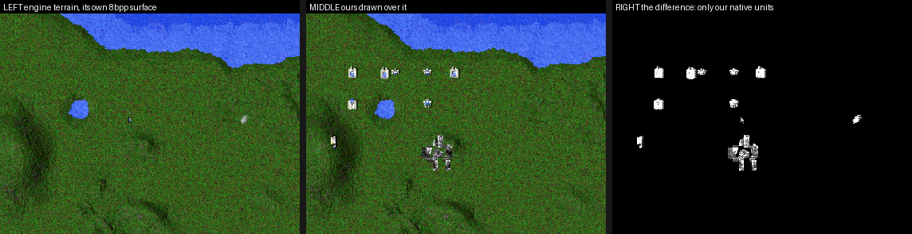<figcaption>Parity. LEFT the engine's own terrain on its 8bpp surface, MIDDLE ours drawn over it in the same frame, RIGHT the difference — only our native units. Every terrain-only band differs by zero pixels, at sub-tile scroll offsets up to (25,31).</figcaption></figure>
<figure style="margin:0">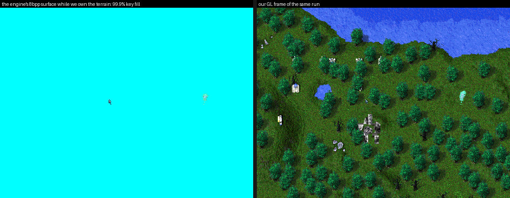<figcaption>Ownership and the inverted composite. LEFT the engine's 8bpp surface while we own the draw — 99.9 % one palette index, the key. RIGHT our GL frame of the same run.</figcaption></figure>
<figure style="margin:0">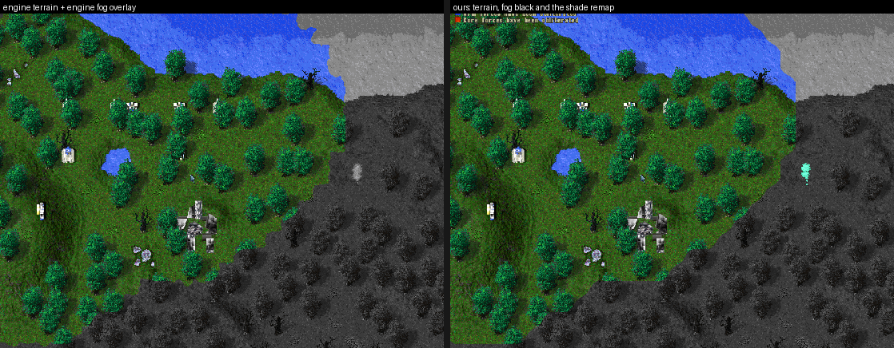<figcaption>Fog with the engine's <code>0x4848E0</code> suppressed and ours in its place: 99 % of the viewport agrees on lit-vs-grey, and the disagreement is the 2–4 px band where the engine dithers its edge sprites and we threshold cleanly.</figcaption></figure>

**G13a — features, native.** Trees, rocks, metal patches, splats and wreckage leave the
engine's frame, and they take the depth buffer with them: a tall feature now writes depth at
the row key the engine's painter's sweep implies, so a unit standing behind a tree is clipped
by the tree instead of by the G12a scaffold's stamped silhouette. One detour on one leaf
(`0x46A610`) owns all of it. Full RE and verification: [Features](features.html).

<figure style="margin:0">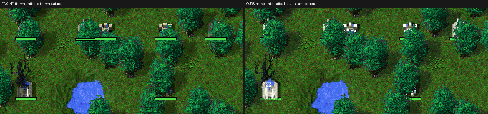<figcaption>The gate, checked against the engine's own draw rather than against a scaffold: LEFT the engine drawing its own units <em>and</em> its own features, RIGHT ours drawing both with <code>scaffold.on</code> disarmed. The five units parked two tile rows behind a tree row are clipped to the same slivers by the same canopies, and the two units one row in front stay visible.</figcaption></figure>
<figure style="margin:0">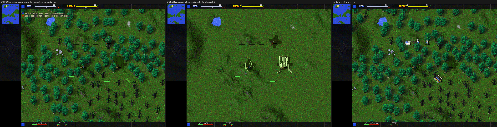<figcaption>Ownership: the engine's 8bpp surface with its own features (left), the same surface while we own the leaf — not one tree, rock or shrub left (middle) — and our GL frame of that run (right).</figcaption></figure>
<figure style="margin:0">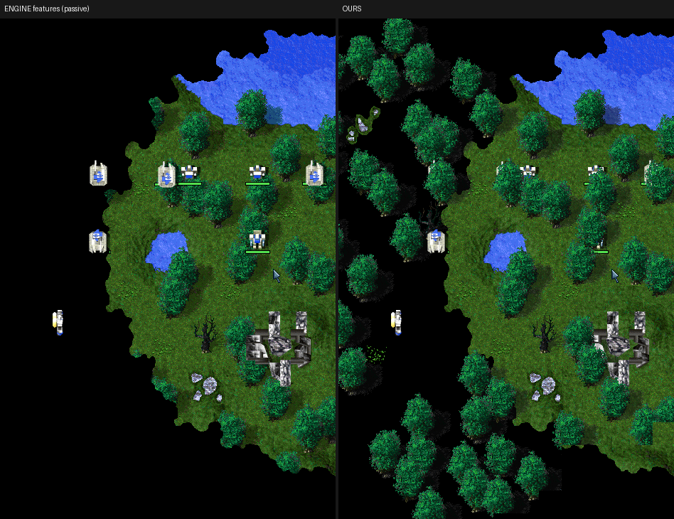<figcaption>G13a's honest gap, <strong>since closed by G13c</strong> — kept because it is what put the corner-mask grid on the trail. The engine (left) draws nothing in unexplored black; we (right) drew trees across it. Both source maps read "visible" at cells the engine paints black; the overlay turned out to be driven by a corner-mask grid instead, which the native passes now sample ([Features](features.html) §9).</figcaption></figure>
<figure style="margin:0">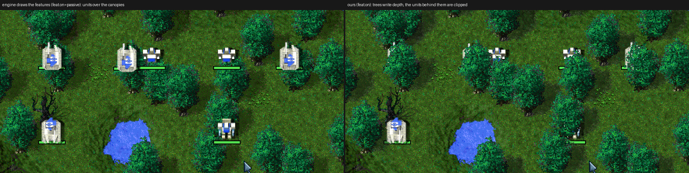<figcaption>The same fight seconds apart at 2×: <code>feat.on=passive</code> (engine's features, our units floating over every canopy) and <code>feat.on</code> (ours, writing depth).</figcaption></figure>

**G12f — the particle sfx, native.** Smoke, fire, wake foam and the nanolathe spray leave the
engine: the ten "plugin-layer hook" sites of `DrawGameScreen` turned out to be the particle
layers, drawn by one walker at ten depths, and one detour owns them all. Same fight, engine
(top row) vs ours (bottom row), the 8bpp surface in the right column. Detail in
[Effects](effects.html) §7.

<figure style="margin:0">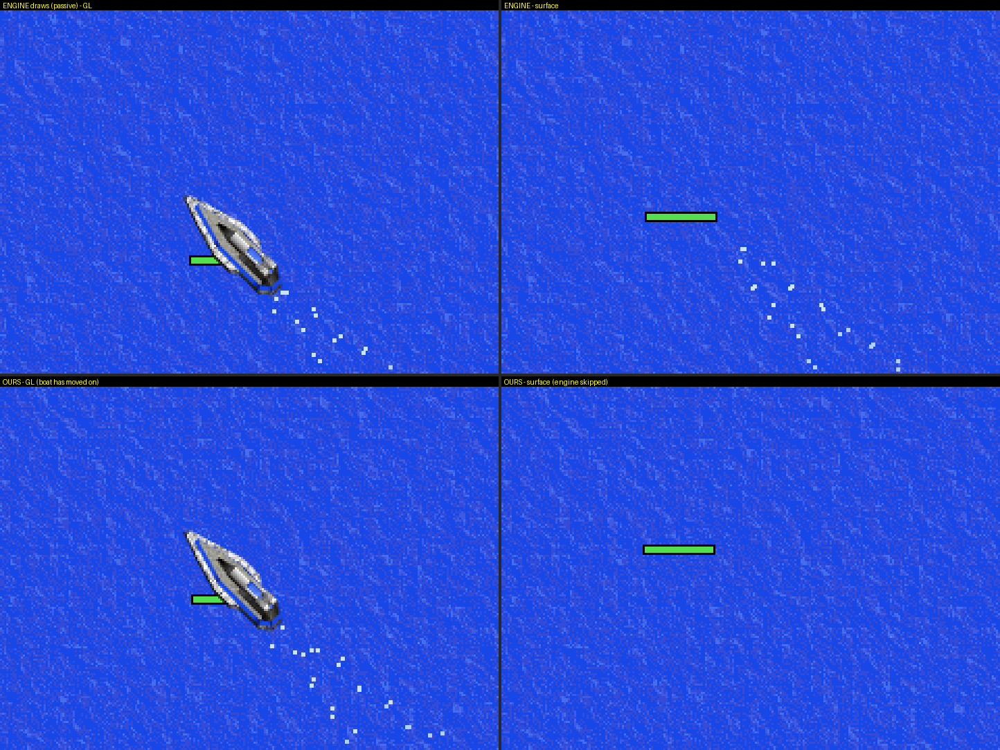<figcaption>A Skeeter's wake on Anteer Strait: the engine's 2×2 foam dots (top) and ours (bottom, the boat has sailed on); the engine surface loses the dots the moment we own layer 2</figcaption></figure>
<figure style="margin:0">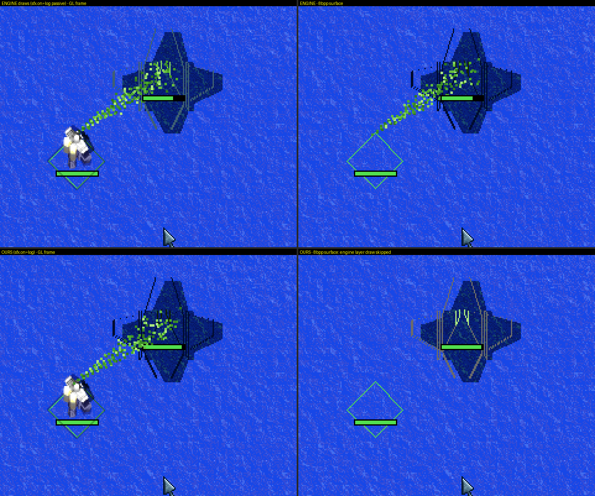<figcaption>The commander finishing a nanoframe: the same green nano spray from the nano piece to the site (layer 6, over ground units); the engine surface shows only the frame while we draw</figcaption></figure>
<figure style="margin:0">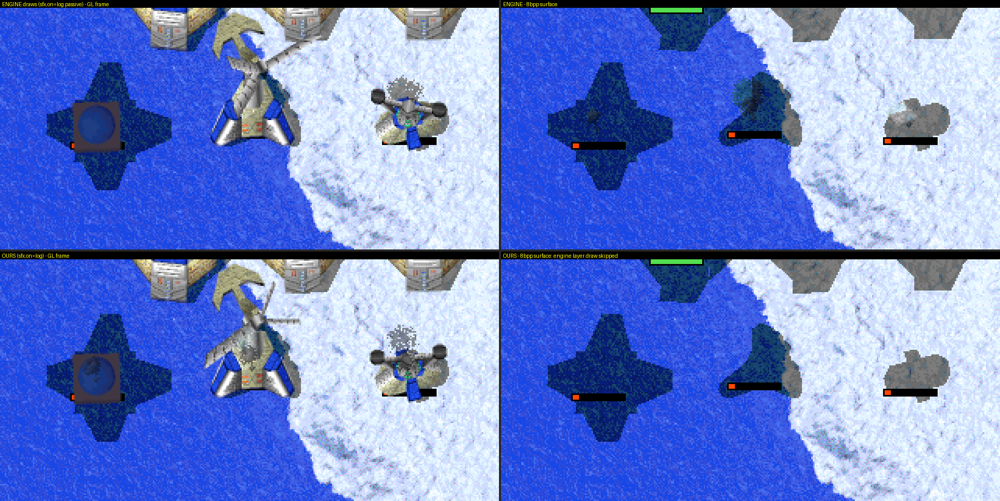<figcaption>Damage smoke over three badly damaged structures (layer 9, over everything): the same sequence frames at the same anchors, 50 % alpha in both</figcaption></figure>
<figure style="margin:0">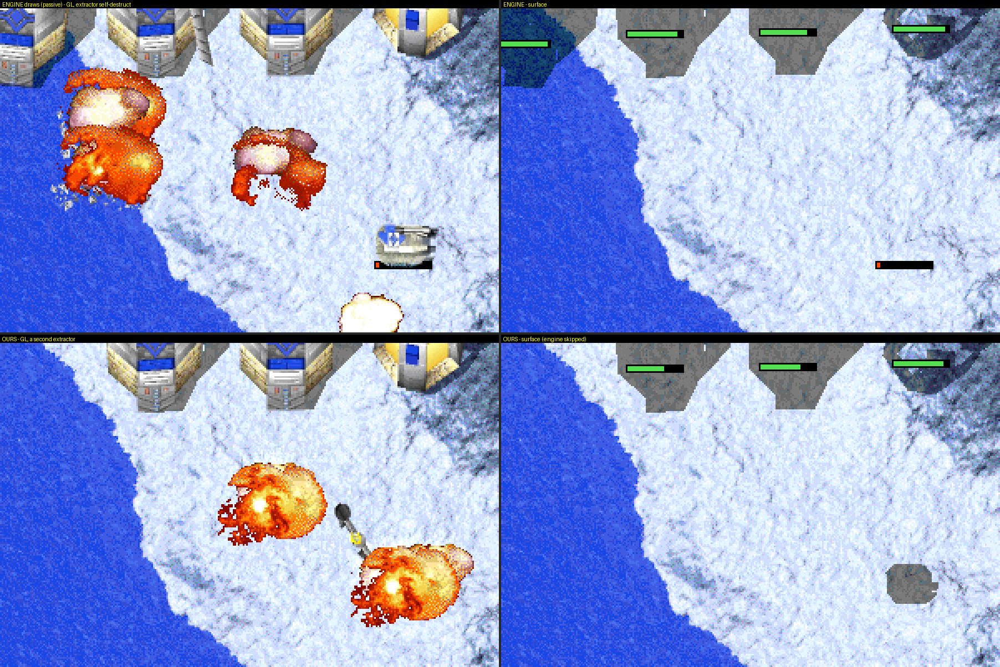<figcaption>Two extractors self-destructed, one under the engine's draw and one under ours: the burning debris (the pink-white flare sprites among the fireballs, layer 9) and the explosion pass's fireballs — the engine surface under ours carries neither</figcaption></figure>

**G12e — the effects pass, native.** Weapon fire, explosions and debris leave the engine:
same fight, engine-drawn (left) vs ours (right); the engine's 8bpp surface shows no effects
while ours draw. Detail in [Effects](effects.html).

<figure style="margin:0">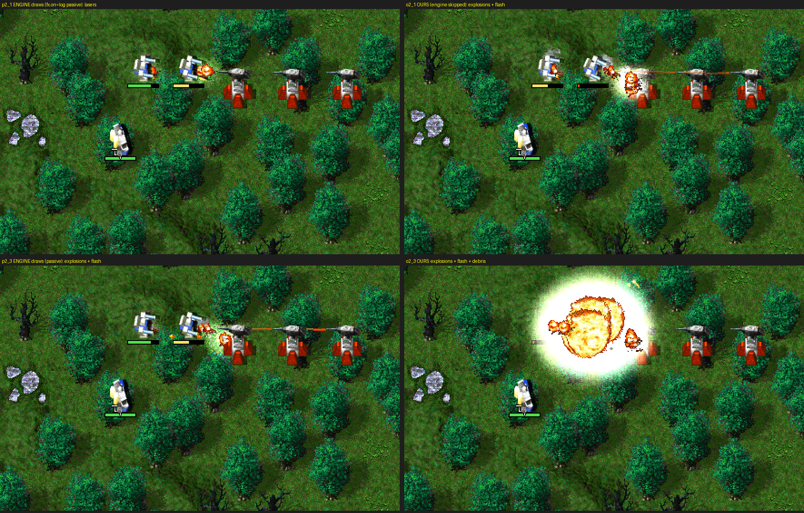<figcaption>Laser duel on Two Continents (2026-09-02): ENGINE draws (left, `fx.on=log passive`) vs OURS (right, engine skipped) — LLT lasers as lines, EMG bolts, explosion sprites, the LHT light flash (additive over a premultiplied FBO), flying debris</figcaption></figure>
<figure style="margin:0">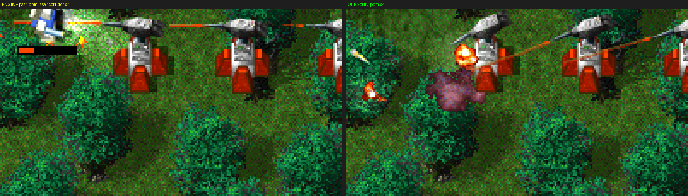<figcaption>The laser corridor at 4×: the same three palette colours in both (147,23,0 / 255,71,0 / 167,27,0), one game pixel wide</figcaption></figure>
<figure style="margin:0">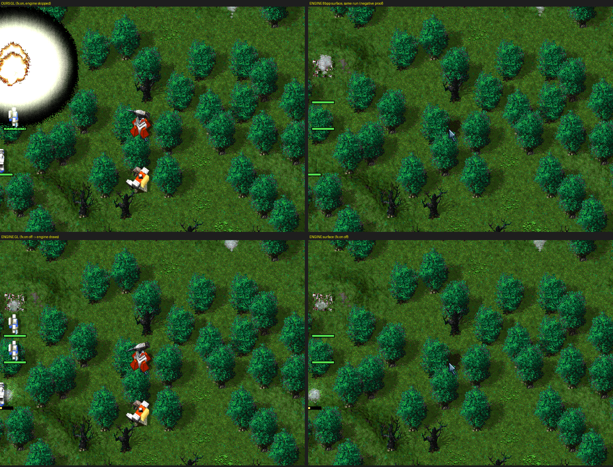<figcaption>Ownership: OURS GL (top-left) with the engine surface of the same run empty of effects (top-right); flipping `fx.on` off restores the engine's draw within 30 frames (bottom row)</figcaption></figure>
<figure style="margin:0">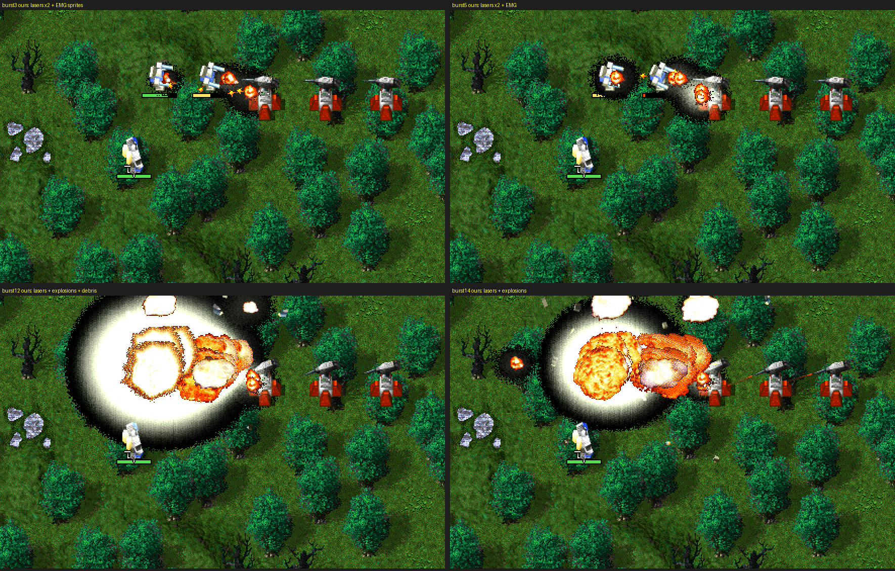<figcaption>Our sprites over the fight: EMG bolts and two-colour lasers (top), a Peewee's death — explosion sequences, flashes and 3DO debris pieces (bottom)</figcaption></figure>

**G12c — the whole base, native.** Token `all`: every complete unit on screen leaves the
8bpp path. The engine frame keeps only terrain, features and UI (note the dark footprint
clearings and the untouched metal patches); every unit pixel in the GL frame is ours —
RGB, team colours, shadows, scaffold-occluded by trees, clipped to the viewport.

<figure style="margin:0"><figcaption>Marker-verified pair at a CORE base — ENGINE (left, no units) vs GL (right, all native)</figcaption></figure>
<figure style="margin:0"><figcaption>Wind generators + floating metal maker native in the forest; a still-building windgen correctly remains engine-side (left panel, east edge)</figcaption></figure>

**G12b — the first truly native unit.** The commander leaves the 8bpp composite entirely:
RGB at game resolution, depth-tested per fragment against the G12a scaffold, own shadow.
Left pair: composite vs native, live A/B toggle. Right pair: the white AI's commander
WALKING BEHIND A TREE — its lower silhouette clipped by the canopy (scaffold discard),
while the engine frame shows no commander at all (its composite is wiped; every visible
pixel of that unit is ours).

<figure style="margin:0"><figcaption>A/B toggle: 8bpp composite path (left) vs the native RGB pass (right) — same engine-authentic colours + our shadow</figcaption></figure>
<figure style="margin:0"><figcaption>2× supersampled native FBO (left) vs raw 1× (right) — box-filtered silhouette edges, game-res look preserved (NEAREST composite)</figcaption></figure>
<figure style="margin:0"><figcaption>Native selection rect (left, ours + engine health bar) vs the engine's own rect (right) — same-second A/B at the same eye. *[CORRECTED 2026-09-08: it rotated with the body yaw but in the OPPOSITE sense — the transposed matrix — which this shot's facing could not show.]*</figcaption></figure>
<figure style="margin:0"><figcaption>G12d replacement slot: the engine's 3DO solar through our native pass (left) vs a hot-reloaded smooth-dome OBJ (right) — same anchor, same shade/palette pipeline, geometry the 1997 rasteriser cannot draw</figcaption></figure>
<figure style="margin:0"><figcaption>The native pass at 1024×768 (resolution live test): full colour, 2×SS edges, fog — zero hardcoded dims anywhere</figcaption></figure>
<figure style="margin:0">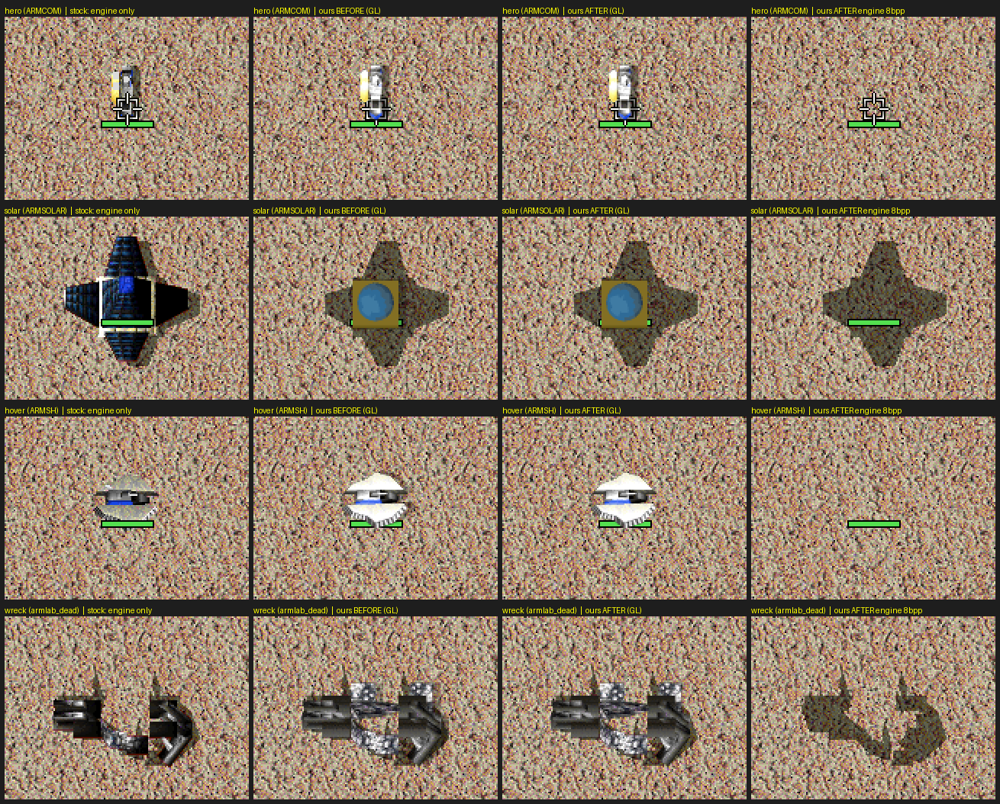<figcaption>Shadow ownership (2026-09-02), rows = commander / solar / hovercraft / wreck, columns = stock engine-only, ours before, ours after, ours engine-8bpp: the engine's cached slant shadow survives the composite wipe for structures and wrecks, so ours is drawn only for mobile units; the hovercraft no longer gets a shadow the engine never draws</figcaption></figure>
<figure style="margin:0">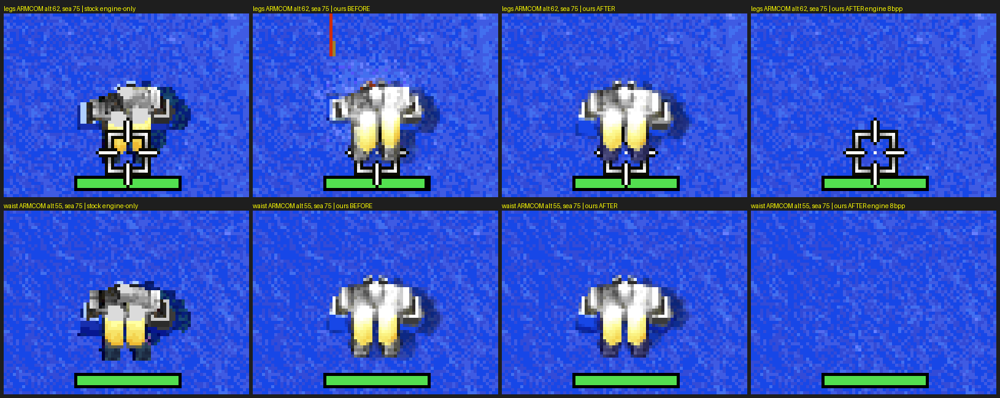<figcaption>Waterline (2026-09-02), Anteer Strait, commanders 13 and 20 elevation units under sea level: stock engine, ours before, ours after, ours engine-8bpp — submerged shins/feet tinted navy and the shadow cut at the water line, as the engine does; erase for unseen enemies and digger clipping follow the same threshold</figcaption></figure>
<figure style="margin:0"><figcaption>Smooth-zoom prototype at 2×: native units scale about the view centre; terrain/UI stay 1× (full zoom = G13)</figcaption></figure>
<figure style="margin:0"><figcaption>The native commander behind a tree: fragments discarded against the scaffold, canopy outline exact</figcaption></figure>

**G12a EXIT — occlusion prediction vs the engine.** One second apart (the second vehicle
plant legitimately finishes its build between the frames): the engine draws the tree over the
Solar Collector's lower-left corner; the scaffold tints exactly that region and the log
predicted `occl=10% (294/2704 px)` for that building. Depth keys, silhouettes and the
painter's-order tie-breaks all confirmed against live engine behaviour. **G12a done.**

<figure style="margin:0"><figcaption>ENGINE (left) vs GL+scaffold (right): the tree over the solar's corner is the predicted occluder</figcaption></figure>

**G12a — the depth scaffold, live on Two Continents.** Same view, seconds apart: the engine
frame vs the GL frame with the scaffold's debug tint. Every tall feature (tree, def Height=40)
is stamped from its GAF silhouette at its painter's-row depth — violet = far rows, red = near
rows; flat rocks, shadows and terrain stay untinted (far plane). This buffer is what native
unit fragments will depth-test against in G12b.

<figure style="margin:0"><figcaption>Two Continents forest — ENGINE (left) vs GL + scaffold tint (right); the scaffold predicted the white AI commander 26% tree-occluded moments earlier</figcaption></figure>

**Phase C flagship — a full build, marker-verified.** One ARM solar collector from first
scaffold to completion, engine and ours interleaved seconds apart on the same build (phase
markers logged against screenshot mtimes — no labeling guesswork). Stage progression matches
column for column; mid-build colour differences are the scaffold's ~2Hz palette-ramp shimmer
sampled at different wave phases, and the dark under-slab in both rows is the engine's cached
nanoframe shadow. **Build-state verified end-to-end — the stage table is exact.**

<figure style="margin:0"><figcaption>ARM solar build, 8 moments across ~112s — ENGINE (top) vs OURS (bottom)</figcaption></figure>

**Phase C — engine vs ours, side by side.** Same unit, same frame, seconds apart (owndraw
disarmed for the reference shot — the engine re-rasterises nanoframes every frame, so it
wins the composite back instantly). More panels land here as the filmstrip capture runs.

<figure style="margin:0"><figcaption>Marker-verified pair: completed CORE vehicle plant with a vehicle building INSIDE the bay — the cargo z-merge path carries our scaffold (right, crisp wireframe) exactly where the engine shows its speckle nanoframe (left)</figcaption></figure>
<figure style="margin:0"><figcaption>Completed CORMEX — engine's flat fills (left) vs our per-face SHD shading + supersampled edges (right)</figcaption></figure>
<figure style="margin:0"><figcaption>Under construction, reveal stage — engine (left) vs our in-shader scaffold (right)</figcaption></figure>
<figure style="margin:0"><figcaption>Early stage — the "engine solid mass" turned out to be the cached nanoframe SHADOW (drawn at every stage), present in both renderers; the filmstrip below settled it</figcaption></figure>

**Phase C — build-state scaffold in GL (engine formulas, our pixels).** The engine's
blit-time nanoframe effect does not fire on our written pixels, so the renderer now stages
it itself from `unit+0x104` ([build-state](build-state.html)): height-threshold reveal,
palette-ramp scaffold colours, per-face wireframe (depth-tested hidden lines).

<figure style="margin:0;flex:1;min-width:180px"><figcaption>Ours mid-build: revealed texture + wireframe scaffold (ramp is green on this palette), engine shadow + nano spray coexist</figcaption></figure>
<figure style="margin:0;flex:1;min-width:180px"><figcaption>Engine reference, early stage: solid ramp silhouette (our A/B stages draw wireframe only — known tuning gap)</figcaption></figure>
<figure style="margin:0;flex:1;min-width:180px"><figcaption>Clean handoff to the finished model — now shaded via TA's own SHD table (engine-authentic colours)</figcaption></figure>

**Phase C — per-face directional shading (G10 first delivery) — for review.** Same unit, same
frame, shading toggled live: left-facing walls catch the sun, right-facing walls fall into
shade; palette-exact throughout (the LUT can only emit palette colours).

<figure style="margin:0;flex:1;min-width:200px"><figcaption>ARM vehicle plant, shading ON — left sloped walls highlighted, inner right walls darkened</figcaption></figure>
<figure style="margin:0;flex:1;min-width:200px"><figcaption>Shading OFF — flat, the Phase B look</figcaption></figure>

<figure style="margin:0;flex:1;min-width:200px"><figcaption>CORE solar ON — the flat-grey wedges split into distinct lit/shaded faces</figcaption></figure>
<figure style="margin:0;flex:1;min-width:200px"><figcaption>OFF — wedges identical grey</figcaption></figure>
<figure style="margin:0;flex:1;min-width:200px"><figcaption>Commander ON — bright torso top, darkened flanks</figcaption></figure>

**Phase B — real GPU 3DO geometry through TA's compositor — for sign-off.** The G6 gradient
is history: the ARM Commander on screen below is **our OpenGL render** of its engine-posed 3DO
(posed vertex buffers → triangulated faces → FBO with TA's dimetric projection → per-face colours
sampled from the resolved GAF textures → index-exact 8bpp readback), written into the per-unit
composite and blitted by TA itself. Centre: ours in-game. Right: engine's own sprite (G4 shot,
with old overlay markers) vs ours — blue shoulder pads, grey torso, gold legs, gun arms all line
up. Details & the new `Model3DOFace` texture-field semantics: [render3do](gpu-render3do.html).

<figure style="margin:0;flex:1;min-width:260px"><figcaption>Our GPU render of the posed 3DO, blitted by TA's compositor</figcaption></figure>
<figure style="margin:0;flex:2;min-width:320px"><figcaption>Engine's own sprite (left, with G4-era markers) vs our render (right)</figcaption></figure>

**Many-unit test (4-player AI skirmish, Painted Desert, permanent LOS, `all`/`all` armed —
engine rasterisers fully detoured, every visible sprite below is our GPU render):**

<figure style="margin:0;flex:2;min-width:320px"><figcaption>CORE AI base — extractors, energy structures, red team trim: 6 units/frame, all ours</figcaption></figure>
<figure style="margin:0;flex:2;min-width:320px"><figcaption>ARM AI base — X-shaped metal extractors + storage</figcaption></figure>
<figure style="margin:0;flex:1;min-width:200px"><figcaption>Zoom — ARM storage, glow faces lit</figcaption></figure>
<figure style="margin:0;flex:1;min-width:200px"><figcaption>Team colour proven: the white AI's commander mid-build — <code>frame[owner]</code> picks the right badge (white here, blue on ours, red trim on CORE), green nano-spray = engine particles co-existing</figcaption></figure>

**G6 — write-back into TA's compositor — signed-off mechanism.** We reverse-engineered the per-unit
composite buffer (`GAFFrame` at `Object3do+0x10`) and TA's live palette, then wrote our own content
into that buffer in the correct 8bpp format — and **TA's own compositor blitted it onto the frame**.
Below, the ARM Commander's sprite is replaced by our animated diagonal gradient (raw palette indices,
mapped through TA's palette), hotspot-anchored at the unit's screen position, with our overlay markers
on top. This closes the integration question for the whole renderer: arbitrary pixels can be injected
into TA's software compositor. Next step is swapping the gradient for a real GPU-rendered 3DO.
Details: [Composite buffer → Write-back proven live](composite-buffer.html).

<figure style="margin:0;flex:1;min-width:260px"><figcaption>Our content in TA's composite buffer — blitted by TA's own compositor</figcaption></figure>
<figure style="margin:0;flex:2;min-width:320px"><figcaption>Whole scene — the commander replaced by our injected pixels</figcaption></figure>

**G5 — selective render suppression — for sign-off.** A detour on `DrawUnit 0x45AC20` hides one
**unit type** by name (`armcom`) while leaving everything else untouched. Left: the ARM Commander
at the exact spot [G4](frame-composition.html) showed its full sprite — now **gone**, only our green
marker over bare ground, while terrain, trees and metal patches render normally (selective,
render-only). Right: the whole scene — a complete map with the commander's sprite absent at centre.
The suppressed unit stays a complete live model in memory (`pos`/`turn` intact, COB pieces present),
so the simulation is untouched; the formal replay-byte-diff awaits an unlocked session (clicks can't
land under the locked desktop, as at G2). Details: [Frame composition → Suppression](frame-composition.html).

<figure style="margin:0;flex:1;min-width:260px"><figcaption>Commander suppressed — sprite gone, our marker remains (cf. G4)</figcaption></figure>
<figure style="margin:0;flex:2;min-width:320px"><figcaption>Whole scene renders — only the armcom is invisible</figcaption></figure>

**G4 — runtime hook confirmation — for sign-off.** An in-process tracer detoured the two
candidate draw sites live. With the ARM Commander in view (below, game-rendered sprite under our
green + yellow markers), `DrawUnit 0x45AC20` and the composite blit `0x459200` fire **in lockstep,
~3250 times per 60-frame window, for exactly the one on-screen unit** — proving "function X draws
unit N". Point the camera at the fogged CORE base instead (second shot: only our red memory-read
markers, black un-rendered terrain) and both hooks drop to **zero** — DrawUnit is line-of-sight
gated. Details + frozen hook list in [Frame composition → Runtime confirmation](frame-composition.html).

<figure style="margin:0;flex:1;min-width:280px"><figcaption>Commander in view — DrawUnit/blit fire 3250×/window (distinct=1)</figcaption></figure>
<figure style="margin:0;flex:1;min-width:280px"><figcaption>Fogged enemy units — overlay marks them (red), engine draws nothing, DU=BL=0</figcaption></figure>

**Phase A — unit→3DO bridge live proof — for sign-off.** Every yellow micro-marker below is one
piece of the ARM Commander's 3DO model — head, arms, torso, thighs, legs — read from the engine's
posed `PrimitiveStruct` origins in live memory and projected with the engine's own per-vertex rule
(`sx=+x, sy=−z−y/2`) on top of the unit's sprite. This is the full
`unit+0x9E → Object3do → posed piece tree` chain working end-to-end in a running skirmish; the same
probe logged all 15 piece names, transforms and posed vertex buffers
([Unit → 3DO bridge](unit-3do-bridge.html) has the log + offset tables).

<figure style="margin:0;flex:2;min-width:320px"><figcaption>Live skirmish — yellow piece-origin markers + green unit marker on the ARM Commander</figcaption></figure>
<figure style="margin:0;flex:1;min-width:200px"><figcaption>Zoom: one marker per visible 3DO piece, engine-projected</figcaption></figure>

**G3 — frame-composition map — for sign-off.** Static-analysis gate; the deliverable is the
[Frame composition (G3)](frame-composition.html) wiki note itself (annotated call graph, hook-candidate
table, pivot assessment), cross-checked in Ghidra with the imported corpus symbols.

**G2 — unit markers on live units — for sign-off.** In a running skirmish vs the AI, we resolve
TA's game struct, walk the live unit array, and draw a GPU marker on each unit using the engine's own
world→screen projection. Below, the green marker (own-unit colour) is drawn exactly on the ARM
Commander — read from memory, projected, and composited over the real game frame. The same per-frame
loop covers every unit; scrolling the view moves the markers with the world.

<figure style="margin:0;flex:2;min-width:320px"><figcaption>Green marker on the live ARM Commander (Canal Crossing, vs AI)</figcaption></figure>
<figure style="margin:0;flex:1;min-width:200px"><figcaption>Zoom: marker glued to the unit</figcaption></figure>

**G1 — overlay proof — for sign-off.** Our own OpenGL 3.3-core geometry, drawn over the live game
inside the fork's render thread: a translucent cyan triangle (the Cavedog logo shows *through* it —
alpha blending works) and an opaque magenta triangle, both placed within the letterboxed game
viewport. Toggling `tagpu_overlay.off` removes them with no other change. Stable, 31 fps, no crash.
Captured via a new `glReadPixels` path (the surface screenshot can't see GL-drawn content).

<figure style="margin:0;flex:1;min-width:280px"><figcaption>Overlay ON — our GL triangles over the live frame</figcaption></figure>
<figure style="margin:0;flex:1;min-width:280px"><figcaption>Overlay OFF — same frame, toggle file set</figcaption></figure>

**G0 — inert chain — for sign-off.** TA boots and renders through our locally-built forked
`ddraw.dll` on the real GPU (GL 4.6 / RTX 4070) under wine, with the stock path one env-var away.
Captured headless via our surface-screenshot trigger while the desktop was locked.

_The "FPS: 30 | Time: 0.16 ms" overlay is cnc-ddraw's own DEBUG-build frame counter, confirming the
image came from the game surface, not an X grab. Intro cinematic frame also captured
(`assets/shots/g0-intro-cinematic.png`)._

## Decisions locked

| Question | Decision |
|---|---|
| Presentation layer | Fork cnc-ddraw; add overlay callback before `SwapBuffers` in `render_ogl.c` |
| Runtime | Proton-first (Steam appid 298030); system wine 9.0 for fast iteration; Windows sanity-check late |
| Ecosystem position | Standalone stack — no dependence on TADR binaries; vendor their knowledge (MIT, attributed) |
| GPU API | OpenGL 3.3+ core, shared context, render in cnc-ddraw's render thread |
| Hook depth | Blit-level replacement, staged through a sprite-cache stepping stone |
| Endgame | **Full scene takeover** — GPU terrain, features, units; ortho camera + smooth zoom |
| Camera until then | Pixel-exact match of the engine's fixed ortho view |
| RE tooling | Ghidra (corpus imported as labels) + x32dbg under wine + `WINEDEBUG` tracing |
| Guardrails | Hooks are read-only over sim state; MP-safety checked at each gate; stock renderer always one toggle away |
| Phase 1 bar | Full skirmish, **all** units GPU-rendered, 60 fps, compositing good enough to leave on |
| Phase 2 content | Enhance original assets first; glTF exemplar pipeline second |

## Ground truth about the target

- The Steam exe (1,178,624 bytes) is **stock 3.1 layout** with one same-length import rename
  (`WINMM.dll` → `WIN32.dll`, feeding Steam's `audiere.dll` music shim). `DDRAW.dll` descriptor,
  section table, `teleporter` tag and `InitInternalCommand` all verified at corpus addresses. [VERIFIED]
- Pristine `TotalA.exe` + md5 manifest of all 80 install files preserved in `pristine/`. We never
  modify files in the Steam dir; we only *add* DLLs, and Steam Verify is the second safety net.
- TA has **no Direct3D**. Units are 3D models software-rasterised into cached 8-bit sprites (one per
  orientation) with a per-unit 8-bit z-buffer, composited into a palettised DirectDraw surface.
  "Intercepting unit draw calls" therefore means hooking engine internals, not an API boundary.
- The state we need is already mapped in TADR's `tamem.h` (Ghidra-verified): `Model3DONode` (the
  in-memory 3DO tree — fixed-point vertices, faces, GAF texture pointers, piece names) and
  `PrimitiveStruct` (the per-unit runtime piece tree COB scripts animate: `XPos/YPos/ZPos`,
  `XTurn/ZTurn/YTurn`, visibility, hierarchy). **Posing a GPU model = walking this tree.** [VERIFIED]
- Unit enumeration is a solved copy-paste: TADR's megamap iterates
  `TAmainStruct_Ptr->BeginUnitsArray_p .. EndOfUnitsArray_p` every frame and draws overlays —
  the exact read-only pattern we need, plus its hook sites bracket the engine's frame composition.
- Stock TA has **no zoom** — world→screen is scroll offset + fixed ortho. That makes pixel-exact
  matching in Phases A–B much easier than it sounds.

## What each researched project contributes

| Source | What we take |
|---|---|
| cnc-ddraw | The entire presentation layer — palette shader, windowing, edge cases; our fork point |
| TADR megamap | Unit-array iteration, world→screen math, overlay drawing, frame-composition hook sites |
| TADR `tamem.h` | ~1,980 lines of verified structs — `UnitStruct`, `Model3DONode`, `PrimitiveStruct` |
| TADR `tafunctions.h` | Typed wrappers to call engine functions at fixed addresses |
| TADR address corpus | ~470 annotated addresses → bulk-imported as Ghidra labels |
| totala-re | 391 radare2-annotated functions → cross-imported into Ghidra |
| Patch Loader | `VirtualProtect` patching idiom; later: hex-edit-free Windows distribution via `dplayx` slot |
| petool | Only if we ever need to grow the exe itself (unlikely — we live DLL-side) |
| d3d8to9 | The vendored-translator pattern and wine-first debugging workflow, proven once already |
| TA Forever | A distribution channel if this ever ships to players |

## Phase 0 — Foothold & instrumentation

**G0 — Build & inert chain.** Fork cnc-ddraw into our repo; cross-compile `ddraw.dll` with
mingw-w64; install to the game dir; launch options `WINEDLLOVERRIDES="ddraw=n,b" %command%`.
*Exit:* game plays normally through our locally-built DLL, our build stamp in its log.
*Kill/pivot:* none — this is table stakes; if Proton refuses the override, fall back to system wine.

**G1 — Overlay proof.** Add the callback API to the fork; companion `tagpu.dll` draws a translucent
triangle + frame-time readout over the game, GL 3.3 core, in the render thread. Ini toggle.
*Exit:* overlay over a live skirmish at 60 fps, toggleable, no flicker across menus/movies.
*Retires:* context sharing, render-thread timing, the toggle discipline.

**G2 — State-read proof (the megamap dividend).** `tagpu.dll` resolves `TAmainStruct`, walks the
unit array, projects positions world→screen, draws a GPU marker glued to every unit while scrolling.
*Exit:* markers track hundreds of units through a full AI skirmish with zero crashes.
*Retires:* struct offsets on the Steam exe, camera/scroll math, per-frame read safety.

## Phase A — Own the unit pipeline (RE-heavy)

**G3 — Static map of a frame.** Ghidra project on the pristine exe; bulk-import corpus labels;
name the frame pipeline: sprite-cache build (3DO rasteriser), per-unit composite/blit, z-composite,
feature/terrain order, fog application, shadow drawing. *Exit:* a wiki note documenting the
annotated call graph of one rendered frame, with candidate hook addresses.

**G4 — Runtime confirmation.** In-process tracer in `tagpu.dll` (hit-order logging per candidate),
x32dbg under wine for the stubborn ones. *Exit:* log proving "function X draws unit N at (x,y)"
matches observed pixels; hook-site list frozen.
*Kill/pivot:* if unit pixels turn out to be drawn interleaved with terrain/features in one pass
(no isolatable per-unit composite), pivot the suppression strategy to sprite-cache substitution
(G6 becomes the permanent mechanism for Phase B, at native resolution, and we revisit).

**G5 — Suppression.** Detour the per-unit composite for one unit type; units become invisible but
remain selectable and simulated. *Exit:* 30-minute AI skirmish, stable, and the sim provably
untouched (replay/di identical, savegame byte-compare clean).

**G6 — Sprite-cache stepping stone.** For one unit type, render our GPU version of the in-memory
`Model3DONode` tree, posed from `PrimitiveStruct`, offscreen at native sprite size; read back,
palettise, write into the engine's sprite cache; the engine composites as normal.
*Exit:* A/B flip between stock and ours looks near-identical.
*Retires:* geometry decode (16.16 fixed-point), GAF texture decode, piece-tree posing — with the
engine still handling every compositing concern. *Timebox:* if cache internals fight back for more
than a week, downgrade to a side-by-side debug window (same proof, less invasive) and move on.

## Phase B — Blit-level GPU units

**G7 — One unit, truly GPU.** Suppress its blit; overlay pass draws the mesh at the exact engine
projection, posed live, palette lifted to RGB. *Exit:* the unit walks, aims, fires and dies
GPU-rendered, ≤1 px drift vs stock in A/B.

**G8 — Compositing correctness.** The hard gate: occlusion vs buildings/features, fog of war,
cloak, selection circles and health bars (drawn after units — ordering!), nanolathe effects,
water. Strategy options ranked: reuse engine z-buffer reads → stencil; else draw-order emulation.
*Exit:* curated test-scene checklist passes at "you'd leave it on" quality.

**G9 — All units at speed.** Instancing, GAF→atlas cache, cache-bypass complete; 500-unit stress
skirmish. MP-safety audit (all hooks read-only, timing perturbation bounded). *Exit = Phase 1 bar:*
full skirmish vs AI, every unit and building GPU-rendered, 60 fps, toggle away from stock.

## Phase C — Enhance the originals

**G10 — Materials & light.** Per-pixel lighting, auto-smoothed normals, true-colour palette lift,
team colour as a material channel, honest translucency, a real shadow pass. Every one of ~230 units
improves at once, zero art authoring. *Exit:* side-by-side gallery; each feature toggleable.

**G11 — Replacement pipeline.** glTF convention (piece names mirror the 3DO tree, rigid pieces,
pivots at piece origins), loader + hot reload, ONE hand-authored exemplar unit driven by live COB
state. *Exit:* the exemplar in-game; mass content explicitly out of scope — the pipeline is the product.

## Phase D — Native-resolution scene pass (started 2026-08-31)

Architecture: [native-res design](native-res-design.html), **revised for the resolution
constraint** — the GL scene pass renders at the game's REQUESTED resolution (raise it via
TA's own video options / registry, never a mixed-res hack); nothing hardcodes 640×480 — the
viewport rect `main+0x37E27..` and view dims are read live every frame.

Two static-RE agents landed at phase start (proven pattern):
- [Resolution plumbing](resolution.html) — persistence is registry-only
  (`DisplaymodeWidth/Height`, loaded UNCLAMPED, defaults 640/480), no command-line switch;
  viewport rect writer `0x4981C9..` inside game-entry `0x497F40`: **left=128 and top=32 are
  constants**, right=W−1, bottom=H−33; mode list = `EnumDisplayModes` filtered to bpp==8,
  ≥640×480, ≤100 entries — our fork serves that list, so custom modes are one enum away.
- [UI markers](ui-markers.html) — only the **selection rect** is interleaved with unit draws
  (must be re-drawn by the native pass: rotated model-XZ-bbox, 4 DrawLines, GUI colour 0xA);
  health bars, group digits, order/build markers all draw AFTER both unit sweeps (survive our
  overdraw); build-cursor draws after fog.

| Gate | Status | Evidence |
|---|---|---|
| G12a — depth scaffold proof | ● done | `tagpu_scaffold.c` live (armed by `tagpu_scaffold.on`): per-frame viewport-sized scaffold from engine data, sweep rect/dims match the engine formulas at runtime (44×58 @640×480, vp (128,32) read live), GAF silhouettes (raw+RLE decode) stamped at row-key depth, colour debug overlay + per-unit occlusion-prediction log. Empirical detour: **Painted Desert has NO tall features** (census: all real defs Height≤5) — preset skirmish moved to **Two Continents** (defs 4–16 = trees, h=40, ~4200 anchors). Live there: 47–63 tree silhouettes stamped/frame, zero fallbacks, and the first live prediction — `ARMCOM occl=26%` behind a tree. EXIT MET: live prediction `CORSOLAR occl=10% (294/2704 px)` matches the engine frame — the tree overdraws exactly that corner of the building (panel below). Bonus fixes shipped same session: movers/builders no longer flicker (per-unit pixel cache repainted synchronously inside the owndraw detour — `repaint≈100% miss=0`), spinner dropout killed by a 16-variant box cache with max-coverage hotspot-aligned fallback (CORMEX verified clean over 1200 frames at **60 fps** — 30 fps capture aliases one-present dropouts invisibly, the key debugging lesson; recipe in the repo `ta-capture` skill). The fork's `_DEBUG` FPS OSD (GDI text stamped into the 8bpp surface, beating against the engine redraw) was the flickering FPS counter — now opt-in via `tagpu_fpsosd.on`. Known accepted gap (user-approved skip): fast-swinging pieces can clip at the composite AABB edge — dies with G12c. |
| G12b — one unit truly native | ◐ core done (2026-09-01) | `tagpu_native.c`: commanders render as RGB into a game-resolution FBO composited over the frame — engine-posed geometry in live viewport coords, shared atlas + engine SHD rows lifted through the live palette (cycling-safe), REAL per-fragment occlusion vs the G12a scaffold (VERIFIED: the white AI commander walks behind a tree and its silhouette is clipped by the canopy — panel below), own 50%-black offset shadow (engine rules), true-alpha cloak path, per-fragment LOS/MAPPED fog sampling (code live; visual test needs a true-LOS skirmish), native team colours. Ownership handoff: under-construction units stay on the composite path until complete; owned units' composites are wiped (engine blits nothing — A/B toggles live via `tagpu_native.on`). **2026-09-01 late-night close-out:** SELECTION RECT native (flat model-XZ AABB from a cached whole-3DO-tree walk, rotated by body yaw, GUI colour 0xA, GL_LINES just under the unit's depth — rotates with a walking commander exactly like the engine's; A/B panel below). True-LOS skirmish LIVE (`SkirmishLineOfSight`/`SkirmishMapping` REG_DWORDs — the guessed `LineOfSight` REG_SZ name was wrong): fogMode=3, per-fragment unexplored-discard + out-of-LOS darkening in the shader, own units verified against the gradual-reveal edge. **That per-fragment source-map rule was later found to be wrong outright and replaced in G13c** — the enemy-straddling-the-boundary case is settled there (an enemy structure on grey ground is not drawn), so nothing remains here. |
| G12c — all units + 3D wrecks | ◐ core done (2026-09-01) | `tagpu_native.on` token `all`: every COMPLETE unit renders natively (buildings, mexes, windgens, floating makers — team colours, shadows, tree occlusion all correct; panels below); under-construction units hand over at completion; airborne units get the nearest depth band with ground-anchored shadows; native pass clipped to the live viewport rect (engine parity — without it units overdraw the HUD). Anchor parity vs composite: (−0.44, +0.11) game px. **2026-09-01 late-night close-out:** (a) 2× SUPERSAMPLING live for the native FBO (render at 2×, exact box downsample via LINEAR quad into the 1× FBO, NEAREST composite keeps the game-res look; visibly antialiased silhouettes, panel below; `tagpu_ss.off` kill switch). (b) NATIVE WRECK PASS CODE LIVE (`tagpu_native.on` token `wrecks`): sweep-rect FeatureStruct walk (flags bit0 + FeatureMask bit0 clear → record `*(main+0x1420B)`+idx*0x30) emits husks at feature depth 3+rel·4; the owndraw classifier now recognises the scratch fake-unit (`*(main+0x1420F)`+0x9E == obj3do mid-draw) and wipes-instead-of-restores while armed — this ALSO fixes a latent bug where `all` would have skipped a fresh husk's first rasterise with nothing cached (invisible corpse). **VERDICT CORRECTED (2026-09-02): unit & building wrecks ARE 3DO models.** The night-2 claim that "all corpses are GAF wreckage sprites" was WRONG — it read the counter, not the data. Ground truth (feature catalogue + engine draw path + a live spawned `armlab_dead`): all 371 `*_dead`/`*_heap` corpse defs have `FeatureMask` (+0xFE) **bit0 CLEAR**, and `0x46A610` sends bit0-clear features down the scratch-fake-unit → `DrawUnit 0x45AC20` **3D composite path** (bit0-SET is the GAF path). `armlab_dead`: `objects3d` (+0x98) is a valid 3DO pointer, `SeqName` (+0xAC) NULL; its live wreck record holds a real `Object3doStruct` (+0x04, NumParts=1, posed). The bit0-SET GAF features are reclaimable scenery/foliage — rocks, trees, **burnt/dead trees** (`Tree1Dead`… = foliage, not unit husks), scars, smudges, ore, map dressing. The night-2 counter read 0 for two reasons, both now fixed/known: (i) the wreck-gather read the wreck record's `+0x08/0x0C/0x10` positions as whole world units, but they are **16.16 fixed-point** → every wreck projected ~1700<<16 px off-screen and was culled (nu=0). Fixed (`>>16`); now `native: 1 wreck(s) 486 verts`. (ii) `tagpu_owndraw_init` installs its rasteriser detours ONLY if `tagpu_owndraw.on` exists at DllMain (no per-frame re-arm), so arming owndraw AFTER launch never suppressed the engine — the pass was never actually exercised. Arm owndraw + native BEFORE launch (`--restart` preserves `*.on` triggers). **3D-WRECK A/B PRODUCED (2026-09-02):** `armlab_dead` on Painted Desert renders GPU-side matching the engine silhouette; the 8bpp engine frame with our pass armed shows no wreck body (only the cached shadow) = every wreck pixel is ours. (c) army stress: measured escalating 23→31→35 native units, 9 372→15 969 verts, 60.0 fps THROUGHOUT at 1024×768 with ss=2 (2048×1536 internal FBO) at live AI bases/battles; vertex budget projects ~100 units ≈ 45 600 verts, inside the 49 152 cap. Open: factory-cargo layering (accepted). Shadow ownership SETTLED 2026-09-02 (panel above; shadows-cloak.md): no double shadows — the engine keeps its cached slant shadow on structures/wrecks, we draw the composite-derived silhouette for mobile units only, FBI noshadow/canhover/floater honoured; factory-built units verified to clear the structure bit. Waterline/digger clipping implemented (tint own, erase unseen enemy, cut shadows; panel above). |
| G12d — freedoms | ◐ sub-pixel done (2026-09-01) | **SUB-PIXEL MOTION VERIFIED at present rate**, and better than planned: the engine already stores 16.16 fixed-point positions (unit+0x6A/6E/72 — the roster "shorts" at +0x6C/70/74 are just their high words; spotted via DrawUnitSelectBoxRect's operands in ui-markers). The native pass reads the true fractions and interpolates between the last two sim samples per unit slot (distance-snap guards slot reuse; `tagpu_subpix.off` kill switch). Numeric filmstrip via `tagpu_spxlog.on` (60 Hz anchor log): subpix ON advances ~0.33 px EVERY present frame (e.g. 393.345→393.944→394.542 across one 1.2 px sim step); OFF shows the raw 30 Hz staircase (460.019, 460.019, 460.814, 460.814 — one step every second frame). **Night 2:** HI-RES REPLACEMENT SLOT PROVEN — `gamedir/hires/<UnitName>.obj` (v/f/c subset, palette-index colours) renders INSTEAD of the 3DO: engine anchor + body yaw + our LUT/palette shade pipeline, hot reload on mtime (~2 s iteration loop). A smooth 210-tri hemispherical dome replaced the solar collector — visible curvature shading the 1997 rasteriser cannot do (panel below). Feeds G11 directly (the loader slot + anchoring exist; G11 adds glTF + per-piece COB pose). Palette lesson: flat colours go through the SHD LUT — only indices with sane ramps work (GUI colours render black); swatch-strip test mesh maps the palette in one capture. SMOOTH-ZOOM PROTOTYPE demoed at 2×: native units scale about the view centre (uZoom in the VS + inverse transform for the scaffold lookup), terrain/UI stay 1× — honest verdict: reads as a floating-units demo, exactly as predicted; full zoom needs G13 terrain. Remaining freedom: cloak polish (needs a cloakable unit) — tracked with the rest in [GPU status, hooks & limits](gpu-status.html) §3. |
| G12e — effects pass (weapon fire, explosions, debris) | ● done (2026-09-02) | The engine's two effects passes are reverse-engineered ([Effects](effects.html)) and replaced: `tagpu_fx.c` gathers `ProjectileStruct[]` / `ExplosionStruct[]` / the debris particle slots and draws lasers and lightning as lines, rockets/missiles/shells and debris as 3DO models through the native geometry path, sprite weapons, flares, explosions and the LHT light flash as sprites from a private RLE-decoding GAF atlas — at the engine's depth band (above every ground row, below aircraft), LOS-gated per projectile like the engine. `tagpu_fxown.c` owns the draw: two call-site redirects + four leaf detours, the skip following `tagpu_fx.on` live; tacli auto-arms it at launch. Verified same-fight (`passive` token = engine draws while we log): laser colours palette-identical, EMG sprites, rockets with thrust flames, explosion sprites + flashes, flying debris; the engine surface shows no effects while ours draw. Not reproduced: the rendertype-2 refraction ball; smoke/fire/wake particles stay engine-side (hook-vector sfx — next gate). |
| G12f — particle sfx (smoke, fire, wakes, nanolathe) | ● done (2026-09-02) | The ten `0x471F90(ctx, n)` sites in `DrawGameScreen` — filed in terrain-depth.md as "plugin-layer hooks, empty in stock play" — are the particle sfx: pooled 76-byte objects in ten *layer* vectors at `*(main+0x38D77)`, each layer drawn at a fixed depth of the frame (2 = wake foam under everything, 4 = feature smoke, 5 = rocket-trail puffs, 6 = nanolathe spray, 7 = bubbles, 9 = impact/damage smoke and fire over everything), the layer being the emitter's argument ([Effects](effects.html) §7). `tagpu_sfx.c` walks the layers, classifies each object by vtable (Smoke1/Smoke2/fire/flare = alpha sequence sprites; wake/nano = 2×2 `DrawBar` dots) and emits through the effects buckets with per-layer depth keys derived from the frame's row count; `tagpu_fxown.c` owns the draw with one more byte-matched prologue detour on the walker (`ret 8`), its own skip byte following `tagpu_sfx.on` live. Verified same-fight on `scenarios/sfx-strait.json` (Anteer Strait): wake dots, nano spray, damage smoke and burning debris identical engine vs ours, the engine surface clean while owned; 200v200 at sim +3 with every pass live holds ~60 fps (28 sixty-frame log lines in 30 s, 217 native units and ~230 particle sprites on screen). Fixture lessons (UI repair order, metal storage, boat pathing) in the ta-drive skill. |
| G13a — features native (trees, rocks, splats, wreckage) | ● done (2026-09-02) | The last colour-keyed sprites in the 8bpp frame besides the terrain. One leaf draws every feature pixel — `0x46A610(ctx, tile, tileX, tileY)`, `stdcall` `ret 0x10`, three call sites, three bodies (3D wreck via `DrawUnit` on the scratch feature-unit, animated GAF wreck, normal feature: shadow then body, static frame 0 or the anim state, plain copy or 50 % alpha per mask bits 2/3) — and its decompile settled the two open questions the handoff carried: the leaf mutates nothing the sim reads (bodies 2 and 3 write nothing at all; body 1 only the draw-side scratch unit) and `GAFGetCurrentFramePtrAddr` is a pure read, so animation is driven by the tick and survives ownership ([Features](features.html)). `tagpu_feat.c` walks the engine's own clamped sweep rect and draws the same frames **with depth writes on** at the row key the painter's order implies (tall bodies `3 + rel*4` above that row's units at `1 + rel*4`, flat ones in a band between the particle layers the engine draws around the pre-pass, shadows a notch below with depth writes off); `tagpu_featown.c` owns the draw with one 5-byte prologue detour, gated on `native.on` carrying `wrecks` because body 1 draws husks through `DrawUnit`. **This retires the G12a scaffold as the occluder**: occlusion was verified against the engine's own draw (engine units + engine features vs ours, `scaffold.on` disarmed) and matches unit for unit; the engine surface is empty of features while owned; fog, map scrolling a 200v200 stress at ~60 fps and map scrolling all clean. Two shared modules fell out, closing three old review follow-ups: `tagpu_gaf.c` (the RLE decoder + shelf atlas, was a private copy in `tagpu_fx.c`) and `tagpu_detour.c` (the stub/patch machinery, now shared by `fxown` and `featown`). Gaps: **fog was not at parity** — the rule all four native passes shared drew over cells the engine paints black, which this pass was simply the first to make obvious; it predated G13a and got its own gate, **G13c below, which closed it** ([Features](features.html) §9); the animated-GAF-wreck body is unreachable with stock content (every `*_dead` def takes the 3D path); feature shadows are a true 50 % RGB blend where the engine does a palette-space ALP remap, so they dither differently. |
| G13b — terrain native, and the composite inverts | ● done (2026-09-02, reviewed) | The last engine-drawn world layer. `tagpu_terr.c` reproduces `0x483FA0` — a grid blit and nothing else: one `GL_R8` atlas of 32×32 cells, 64 per row, **built once per map** (`LoadMap` builds `TILE_SET` and nothing changes it; 2048×2560 for Two Continents' 5062 tiles, and a `GL_TEXTURE_2D_ARRAY` is not viable against the usual 2048-layer cap — G13h later put the cells on a 34-texel pitch with a replicated border, 2176×2720), one quad per visible cell at depth key `0.10` — under the flat-feature band and the low particle layers, i.e. the frame's implicit far plane. Water does not animate at all — the "palette cycling" this entry used to claim was measured false on 2026-09-05 ([terrain & depth](terrain-depth.html) §7); the per-frame palette re-upload stays as insurance, not as a mechanism. The engine's truncating `sar 5` and its `ceil` column count are reproduced deliberately, with a comment saying so. **Parity is exact**: 0 differing pixels against the engine's own blit in every terrain-only band, at `frac=(0,0)`, `(6,8)` and `(25,31)`. **The gate was the compositing model, and it inverts.** Terrain covers the whole viewport, so the old rule ("discard our empty pixels, let the engine's frame show") would hide health bars, nanoframe wireframes, the build cursor, chat and dialogs. `tagpu_terrown.c` therefore does not just skip `0x483FA0` — its skip path (a new `tagpu_detour_leaf_call`, nine stolen bytes) **fills the viewport rect of the engine's offscreen with one palette index, the KEY**, which also restores the clear that the terrain repaint used to provide; the composite then discards *our* fragment wherever the engine's frame is not the key, reading it straight out of cnc-ddraw's own `R8` index texture with `texelFetch` (`TAGPU_FRAME.surface_tex`). The key is **254**, not a guess: the engine's GUI colour table at `main+0xDCB` uses `0xFD` and `0xFF` and leaves `0xFE` in the gap. The **fog overlay `0x4848E0` is suppressed with the terrain** (its shade remap would rewrite the key into grey blobs, and we have reproduced it since G13c) **with its lazy grid rebuild replicated exactly**, because our own fog rule samples that grid. Terrain is the bottom layer now, so it paints the fog's solid black rather than discarding (`TAGPU_GLSL_FOG_TERRAIN`). Verified: engine surface **99.3–99.98 % key** with no terrain left; engine chat, `PAUSED`, selection boxes, the build panel and the cursor all survive inside the viewport; fog **99.06–99.39 %** lit-vs-grey agreement (99.48 % of pixels identical at a fully-fogged corner, mean abs 0.32/255) with only the dithered edge differing; in-process map change rebuilds the atlas (5062 → 7051 tiles); map corners clean with `off-map=0`; `terr.on=off` and the 90-frame watchdog both restore the engine's terrain *and* fog; 200v200 with everything native at **59.7 fps**. It also fixed a G13c gate bug it made fatal: `fogMode` bit0 was `LosType & 1`, the **mapping** option, so true-LOS-without-mapping (`LosType=14`) skipped the fog rule entirely — invisible while the engine drew its own overlay, a missing grey band once we suppress it. Review closed the three failure modes an inverted composite has and an overlay does not (emitting without owning; the disarm frame; a screen that never calls `0x483FA0`) — all written up with their symptoms in §7.6, along with the one review finding that was **wrong** and must not be "fixed" later. [terrain & depth](terrain-depth.html) §7. |
| G13c — fog of war at parity | ● done (2026-09-02) | **Reverses [terrain & depth](terrain-depth.html) §6 item 4.** All four native passes mirrored fog by sampling the LOS/MAPPED source maps per fragment; that advice was wrong and the gate proved it. The engine's overlay `0x4848E0` is driven entirely by the view-anchored corner-mask grid `0x4843C0` builds behind `*(main+0x1421F)`, and the source maps cannot reproduce it: the lattice is offset **half a cell** (a grid corner sits at a map cell's *centre*, `origin = 32·col0 + 16`), its shape is a **4-bit corner mask** feathered by 14 GAF edge sprites that a per-cell boolean cannot express, and — read in the *same frame* at the same cells — MAPPED reported explored across a band the engine paints solid black (that last discrepancy is still unexplained, written up in terrain-depth §5.2; it is moot for rendering because the grid is by construction what the engine drew). The fix is one shared rule in `tagpu_glsl.h` replacing four copy-pasted blocks and the `uLos`/`uMap` pair with a single `uFogGrid`: the grid uploads as an **RG8 texture with no conversion** (its two bytes per cell already *are* the unexplored and out-of-LOS masks), and **bilinear coverage over the four corner bits thresholded at 0.5** reproduces the 14 edge shapes — `0xF` → everywhere, `0x3` → exactly the top half, a lone corner → its quadrant — clean where the engine dithers. The grey darken is the engine's own shade LUT `*(TAProgram+0xCC)` applied to the palette **index** before the palette fetch (a multiply on the resolved colour costs 19,768 mismatched px — visibly too dark on canopies). **Units and effects hide in grey while terrain, features and wreckage stay and are remapped** — the rule the passes did not implement at all before. MEASURED, `feat-forest` on Two Continents, GL framebuffer, engine draw vs ours at the same camera: mapping-only 48 px lit only in the engine's / 821 only in ours / 287,531 agreeing; true LOS **97 / 186 / 576,990** (0.05 %). Verified live that an enemy solar collector on fully-grey ground is **not drawn** while the flattened building footprint it stamped into the terrain still shows — TA's own "grey shows terrain but not units". Panel and method: [Features](features.html) §9. |
| Resolution track | ● done (2026-09-01 night 2) | LIVE AT 1024×768: registry `DisplaymodeWidth/Height` (REG_DWORD 1024/768) → the game runs the mode; every live read matched the RE formulas exactly — vp=(128,32), view=896×704 (=W−128, H−64), sweep=68×76, native FBO 1024×768 (ss=2 ⇒ 2048×1536 internally); UI lays out fine (top-bar art tiles on the right — acceptable); clicks/camera/build all worked with ZERO tool recalibration (the in-process driver computes from live vp/game dims by construction; only capture-crop scale changes: 2.8125 vs 4.5). THE REAL PAYOFF: the first in-game mode switch ever exercised exposed that `dd_SetDisplayMode` restarts the render thread with a NEW GL CONTEXT — all our cached GL ids die silently (stale-FBO bind → our pass cleared the real backbuffer black). Fixed with context-change detection (wglGetCurrentContext each frame) + per-module glreset (state, texture dims, AND the CPU-side atlas/LUT upload caches — forgetting those left everything sampling black). Mode switches are now robust — a G13 prerequisite banked early. |
| The pose race — the one-frame rest-pose pop | ● done (2026-09-08) | **Reported from play as a zoom bug; zoom is only the magnifier.** A walking commander was drawn, for exactly one presented frame, in its **unrotated rest orientation** and then snapped back — ~1400 changed pixels at 2× zoom, three frames of a 62-second walk; the event *rate* is the same at 1× and 2× and zoom multiplies each event's size about fourfold. Diagnosed to the engine's repose: `DrawUnit 0x45AC20` (and the COB's `0x45AB10`) rewrite every posed vertex buffer `prim+0x22` **in place, on the game thread, in two stages** — `rep movs` of the node's rest vertices back over the whole piece tree (`0x45ACDD`, `0x45B030`; a third repose, for cargo, at `0x45ADA5..0x45AE47`), then the compose that puts the piece turns and the body turn into them (`0x45B0A0` → `0x45B150`, one vertex at a time). The native pass gathers on the **render thread** and reads that buffer live, and nothing else in the engine ever writes rest vertices there — so a frame that draws the unit at rest is a frame that read between the two stages. `Object3do+0x08` brackets the window exactly (set before the reset, cleared only after the compose, and the rewrite is entered only when it is non-zero), so `emit_geom`/`emit_slant` read it either side of each piece's vertex copy and re-emit the unit from the **pose fields** whenever it was set. **Measured**: an in-DLL oracle (`tagpu_posewatch.on`) caught buffers 34.00, 38.63, 34.16, 33.03, 32.96, 32.82, 32.69, 32.00, 25.23, 23.18 and 22.24 model units away from what the fields describe, i.e. the model's own size — **every one of them with the dirty flag set on both sides of the read**, which is the property the guard depends on. The fallback is not a change of its own: forced for every unit (`tagpu_poserecon.on`) it renders **0 differing pixels of 1920×1080** against the engine-buffer path, and the oracle reads `0.00` in every window with no trip. **Regression on the walk fixture** (one ARMCOM, static camera, zoom 2×, 62 s, the transient detector over the world band only): frames over 500 changed pixels **3 → 0** and over 1000 **2 → 0**, in three runs out of three, worst frame 1403 px → 475/492/294 px; the `>350` band is unchanged because it is the walk itself. 60.0 fps before and after. The window is microseconds wide and opens ~30 times a second, so reproducing it needs **scheduling pressure, not a longer run** — the game pinned to one core with spinners on the same core, which is what a loaded machine does to a player. [gpu-status](gpu-status.html) §2.9, [engine map](exe-reverse-engineering.html) "The repose, and the window it leaves open". |
| G16 — 3DO units pose on the GPU, like the replacement meshes already do | ◐ **in build (2026-09-08)** — [GPU posing](gpu-posing.html). **Gate 0 settled**, **Gate A passed**, the level generation (step 3) and the **per-type geometry bake (step 4)** landed; the posed shader and the gates that follow it are not started. **Gate A** ran `posewatch`'s oracle over a 69-unit ARM+CORE screen inventory (`scenarios/pose-inventory.json`, plus a naval half on Anteer Strait) covering all eight classes and both extremes of stock geometry: **`norecon` 0 across 82 types, all 27142 watch lines `dirty=1/1` and none `dirty=0/0`, and the 36-piece and 304-face models at `errmax 0.00`** — nothing reconstructs wrong, so the GPU path can be built on the reconstruction. It also found that a handful of **structures never get composed at all** and sit at their rest vertices for the whole session (gpu-status §2.9, engine map "The repose"). **Step 4** is `tagpu_posebake.c` behind `tagpu_posebake.on`: one geometry buffer per type carrying body/slant/wire as three ranges, a material stream per (type, owner, **atlas generation** — a counter added to `TAGPU_GAFATLAS`, since every recycle moves every UV), the piece tree's topology cached per type, the 64-piece cap gone (`TAGPU_PBMAXPIECE` 256), and a `check` token that holds the bake to the emitters it will replace — **0 mismatches** on the body vertex count and on the accumulated rest offsets over the whole inventory, `anom=0`, `refused=0`. Nothing draws from the buffers yet. | **The native unit pass streams posed geometry every frame; `tagpu_hires_draw.c` next to it does not, and has not needed to since it was written.** The replacement-mesh path keeps one static VBO per model with a piece id per vertex (`layout(location=3) in float aPiece`), holds one 4×3 per piece in `uniform vec4 uPiece[…*3]`, and transforms position *and* normal in the vertex shader; `hires_pose` fills that from `pose_accum` — from the engine's pose FIELDS. It therefore **never reads `prim+0x22` at all, and the pose race cannot happen to a replacement model.** G16 is that architecture for 3DOs: rest vertices and the whole face topology baked into a per-type static VBO (UVs, colour-key flag, the fan mapping of an n-gon's corners onto a quad's UVs, the selection-primitive face skip, the quad rule), the per-piece matrices uploaded per unit, and everything the 14-float vertex carries today derived in the shader — screen x/y, the depth key `encBase + clamp((2y−z)/256, ±1.8)`, the world x/z the fog samples, the model height the waterline clips on, and the shade row from the rest normal through the same matrix (the transforms are rigid, so a baked normal transforms exactly). **What it buys:** the race gone *by construction* rather than by detection — no window, no threshold, no counter (gpu-status §2.9); per-unit per-frame CPU down from transforming 176 vertices and rebuilding 555 stream vertices to reading 276 bytes and building 15 matrices; the geometry no longer re-uploaded each frame; and **one renderer instead of two**, with `TAGPU_HUNIT` and the pass's own `NU` no longer duplicating per-unit state. **What makes it a gate and not a patch:** `emit_node` is where the parity rules live, not a transform loop; `emit_slant` reproduces the engine's *integer* snapping (`v[0]>>16`, `q = yi>>2`) and that is where G14j won byte-exact structure-shadow parity; the payoff needs instancing and the poses in a UBO/SSBO rather than uniforms (one draw per *type*, per-instance anchor, fog word, cloak alpha, waterline, nano state, team colour, depth key), which is a change to how the pass submits work; and it retires the only oracle we have for the reconstruction — the engine's own buffer. *[CORRECTED 2026-09-08: that used to read "on exactly the models where the two disagree … 4.1 / 7.0 / 48.4 / 77.2 world units … attributed to the buffer lagging the fields". **They do not disagree.** Gate 0 measured the residual to be the checker's own omitted bank and pitch, and it is 0 on every class once all three body words are folded.]*. It does **not** touch the anchor: the unit's 16.16 position is read with no interlock either way. **The plan is now written down in full** — [GPU posing for 3DOs](gpu-posing.html): what moves (all four readers of `prim+0x22`, not just the body emitter), where the pose is read (the render thread, from the fields, under the existing `tagpu_reclaim` bracket — the guarded surface gets *smaller*, since `prim+0x22` is a second allocation freed at `0x45AAB2` before the object itself), how the per-type bake is cached and invalidated (a level generation owned by `tagpu_reclaim`'s `0x491B60` hook, which `s_aabb`/`s_sbox`/`s_pmap` adopt too — they are keyed by raw node pointers today and never dropped), and that there is **one renderer**: no per-unit fallback and no per-unit refusal, degrading inside a unit (a piece whose parent link does not resolve stays at rest, as `hires_pose` already does) rather than dropping it. **Two findings changed the shape of this row.** First, *instancing is not the entry price*: the pass already issues one `glDrawArrays` per unit with per-unit uniforms, so a per-type static buffer plus a pose UBO drops into the loop it has. Second, **the exit criteria below were not attainable as first written** — see the new cell. | **Gate 0 — SETTLED 2026-09-08, and it did not block.** The 4.1 / 7.0 / 48.4 / 77.2 world-unit residuals were `tacob pose-check` passing `body=(0, yaw, 0)` and `pose_dump` applying `U_YAW` alone, while the compose folds all three cached body words at `0x45B0DB`; the two agreed *because they shared the omission*. Recovering the missing pitch and roll from each fixture's own base piece takes **all eight classes to exactly 0**, and a live capture with the fixed dump reads `err=0.00` on every piece of the tank and the bomber (5.45 and 77.19 before). Two by-products: the **cached** triple is not always the live one (bomber, 157° of heading apart — and the geometry follows the cached one, which `recon_begin` already folds), and `hires_pose` has the bug the oracle had, posing replacement meshes without the terrain's tilt. **Gate A — PASSED 2026-09-08** on `scenarios/pose-inventory.json`: `norecon` 0 across 82 types, all 27142 `posewatch` lines `dirty=1/1` and none `dirty=0/0`, the 36-piece and 304-face extremes at `errmax 0.00`, and no ship or submarine flagged on the naval half. Remaining: **B** the CPU reconstruction vs the GPU port in pixels on a **paused** scene (`tagpu_poserecon.on` renders the same pose through the old path, so the diff isolates the port) — bar single-digit pixels, each a single-pixel edge flip, characterised; **C** the 62 s walk protocol, frames >500 px → 0 and >1000 px → 0 with 1× as the control; **D** the G14j structure-shadow fixtures at a **stated tolerance**. "0 differing pixels" is *not* reachable and the old criterion is withdrawn: `0x4B7173` stores each rotated pair back with a bare `fistp` — round-to-nearest into 16.16 — at every axis and every level of the tree, so the engine's posed vertices are quantised per level while a float32 shader rounds once; `emit_slant`'s `>>16` floor turns those 1–2 LSB into a whole screen unit. Plus a **200-unit frame-time measurement** before and after, and `tagpu_posewatch.on`'s `err=` retired with the CPU emitters in the **last** commit on the branch — they are Gate B's oracle until then.

## Phase D wrap-up & the road beyond (PROPOSAL, 2026-09-01 — for review)

With G12a/b/c landing, the native pass owns every complete unit's pixels. Proposed order of
what remains, cheapest-win-first; each row is a discussable unit of work:

| # | Work | Why now / exit |
|---|---|---|
| 1 | **G12c close-out**: native wreck rendering (wreck records `*(main+0x1420B)`, opportunistic once a war leaves 3D husks), army-scale stress (fps + vertex budget at 100+ on-screen units, sim +10), 2× supersampled edges for the native FBO (visual parity with the composite path's SS) | full skirmish, no 8bpp unit pixels, 60 fps |
| 2 | **G12b leftovers**: ~~fog A/B on a LineOfSight=true skirmish~~ (**done, G13c** — `LineOfSight` cycle stage 1 gives `LosType=15`/`fogMode=3`; the A/B is in [Features](features.html) §9); selection rect + health-bar reorder decisions (needs clicks → unlocked session) | native unit darkens at a fog edge exactly where the engine's 32-px cells would |
| 3 | **Resolution live test** (the constraint's payoff): registry `DisplaymodeWidth/Height` → e.g. 1024×768 from our fork's mode list → verify viewport rect/native pass/scaffold at the new mode; recalibrate session tooling; empirically check the flagged HUD-art risks | the same skirmish, playable at a higher requested resolution, all passes correct |
| 4 | **G12d freedoms**: sub-pixel motion (render-side interpolation of integer engine positions), true-alpha cloak polish, first **hi-res model experiment** (feeds G11's glTF pipeline), smooth-zoom prototype on the ortho transform | one visibly-better-than-1997 clip per freedom |
| 5 | **G11 — replacement pipeline**: glTF convention + loader + ONE exemplar unit driven by live COB state | the exemplar in-game |
| 6 | **G13 — full scene takeover**: ~~features → GL sprites~~ (done, G13a — and they write the depth the scaffold used to fake), ~~terrain tiles → GL~~ (done, G13b — TNT tile atlas, and the composite inverted with it), ~~projectiles/explosions native~~ (done, G12e), ~~particle sfx native~~ (done, G12f), ~~fog native~~ (done, G13b — the overlay is suppressed and ours replaces it), ~~health bars / order markers / build cursor~~ (done, G13d — re-drawn and captured-and-replayed), ~~free zoom~~ (done, G13e — the world, the click, the cursor, the minimap box and the scroll rate all scale together); UI/minimap stayed engine-side by design until 2026-09-06 — now [Phase E](gui-renderer.html) | ✅ engine software frame = UI only, and the zoom it was the entry condition for is finished |
| 7 | **Cross-cutting, ongoing**: MP-safety formal replay byte-diff (unlocked session), packaging/distribution story (drop-in ddraw.dll + config), TADR-chain coexistence check | — |
| 8 | **tacob — BOS/COB editor** ([design](tacob-design.md), grilled 2026-09-07): a stdlib-only Python compiler/decompiler/VM/director plus an HTML editor-viewer on the `ta3do` glTF; BOS is the truth; the extended weapon slots are first-class. Five landings — CLI compiler (gate: every stock COB round-trips byte-identical), a `tagpu_cobtrace.on` hook (engine change, reviewed), headless VM replaying nine class scenarios against posedump + cobtrace traces, the page, a pywebview/PyInstaller folder needing no Python | ◐ **landing 1 built 2026-09-07**: `tools/tacob` compiles, decompiles and dumps; 278 of 278 stock COBs round-trip byte-identical as whole files; 26 offline tests. **Landing 2 built 2026-09-07**: `tagpu_cobtrace.c` — five read-only, byte-matched hooks inside the COB engine (allocator, runner, RETURN, signal kill, the rand draw) write S/R/X/K/D lines stamped with the sim tick; posedump's header now stamps `tick=`/`idx=`; nine class scenarios (`scenarios/cob-*.json`), the runner `tools/cobtrace_fixtures.py`, fixtures + per-class table in `research/notes/evidence/cobtrace/`; the engine map gained the COB engine (object, records, entry points with callers, the opcode dispatch, the effect-handler vtable slots). **Gaps**: the engine's asks for scripts a unit lacks are not traced (only `-1` reaches the allocator); which engine function issued an `E` start is not recorded; no stock fixture exercises the refusal (`X`) path; a fighter fixture with an armed opponent ends at ~10 s in the engine's own `ORDERS_CreateObject` fault (`0x43A164`, a null target's position — reproduced with the oracle off), so the shipped one flies against an unarmed transport; the effect handlers are located but their constant tables unread. **Landing 3 built 2026-09-07**: the COB virtual machine and the director in `tools/tacob` (`run`, `fit-world`) — the eight `0xA4` records, the allocator, the runner's wake tests, every opcode's stack effect and the animation stepper, all read out of the retail binary; `tacob run --all` replays all nine fixtures and each output file is **byte-identical** to the log the game wrote (4272 lines), with every piece of the eight usable posedumps matching on `move=`, `turn=` and `HIDDEN`. The engine map gained the piece animation array's 19-dword layout, the stepper `0x4B1C00`, the exact MOVE/TURN/SPIN arithmetic, a table of every by-name start with its entry and `runNow` flag, where each lands in the per-unit frame, the opcodes retail TA does *not* implement (`play-sound`, `map-command`; `%` is `/`), and `0x45AF1B` — a piece with fewer than three vertices starts invisible. **Gaps**: the replay is *given* three things per start (which engine entry issued it, where in the frame, and the `rand` results) plus `HEALTH` for the tank, so the tank's `D`-line ticks are an input; the eighteen unmodelled `get` ids have no engine behind them; the effect handlers' constant tables are still unread. **Landing 4 built 2026-09-07**: `tools/tacob serve` (the five endpoints the page polls, a recorded timeline, a live director that *generates* the engine's by-name starts through the call-site table) and `tools/tacob-edit.html` (CodeMirror 6 + three.js on the `ta3do` glTF, posing nodes by name, the eight-record strip, unit-state / weapon-slot / event / console / trace tabs); seven lints; the "add weapon N" template in the only body shape that fired evenly; `tacob open` / `lint` / `pack --install` / `pose-check`; 63 offline tests. The engine map gained **`get` and `set`** — `0x480770`'s twenty-entry jump table with every id's arithmetic, and `0x480B20`, which has a case for **six** ids and silently drops the other fourteen — the **piece transform** (`0x43DEF0` through `0x4B6CC0`: the rotation order is `Ry·Rx·Rz`, the axis operands are plain X/Y/Z, `MOVE` is a delta added before the rotation), the fact that **the 3DO loader negates X and Z**, and `rand`'s Park-Miller recurrence. `tacob pose-check --all` rebuilds the eight fixtures' posed vertices and diffs them against the engine's own vertex buffer: **exactly 0 on every class** once all three body words are folded *[CORRECTED 2026-09-08 — this read "exactly 0 on four of them, and on the fast movers the same residual `tagpu_native.c` reports on the same dump line"; that agreement was a shared omission, not corroboration. The nine tracked fixtures predate the dump's `body=` field, so the command still reports the old residuals for them under a `legacy: yaw only` tag: the 0 is measured by recovering the triple from each fixture's own base piece, and live on a fresh capture]*. Gate driven by hand: ARMPW opened, `Create` edited to hide its torso, rebuilt, restarted, packed and installed, and the game drew it without a torso (232 of 2912 pixels in its own box, against 0 with the override removed). **Gaps**: the director's *generated* events have no oracle; the map is flat, so `GROUND_HEIGHT` is one number; the effect handlers' constant tables are still unread; no FBI editing. **Landing 5 built 2026-09-07** — the Windows folder that needs no Python: `tools/tacob_app.py` + `tools/tacob.spec` (PyInstaller **onedir**; `tacob`, `ta3do`, `hpipack.py` and both pages ship as *data*, found through `sys._MEIPASS`), `tools/tacob-build.py` (`vendor` · `verify` · `wine-setup` · `build` · `check`) which installs a Windows Python into a Wine prefix of its own and builds there — no remote, no CI — a `gui` subcommand whose launcher picks pywebview only when **WebView2** is actually installed (pywebview otherwise falls back to MSHTML, which has no ES modules) and the default browser otherwise, `tools/tacob-setup.html` (the first-run game-folder picker, served at `/` on the editor's own port until a folder is chosen), and the user-vs-shipped path split (`%APPDATA%\tacob` for projects and config; `/projects/` stays the checkout's). The page's JavaScript is fetched pinned and checksummed into gitignored `tools/vendor/` (manifest `tools/tacob-vendor.json` tracked) and the **server** rewrites the import map, so one page works online from a checkout and offline from the folder. **Gate**: `dist/tacob/` (172 files, 29.7 MB) run inside a Wine prefix proved to hold no `python*.exe` — it decompiled ARMPW from the archives and stepped the VM 30 ticks, and headless Chrome **with every host but loopback unresolvable** drew the editor: CodeMirror alive, the model on a canvas, the eight-record strip filled. **Gaps**: the pywebview window itself is unexercised (Wine has neither WebView2 nor .NET, so the gate ran the browser fallback); the folder is unsigned and has no installer; the picker offers a short fixed list of candidate folders, not a search. Landing 6 (Scriptor as oracle) waits on the binary turning up |

**G13 — Full-frame ownership.** The engine's software frame becomes data only (GUI/minimap still
sampled from it); we draw terrain, features, units and effects; ortho + free zoom; assess
coexistence with the TADR chain for a distributable build. *"GUI/minimap still sampled from it"
was the design until 2026-09-06; Phase E below and [GL UI renderer](gui-renderer.html) take
the UI too.*

## Phase E — the UI, ours (planned 2026-09-06)

Design: [GL UI renderer](gui-renderer.html) — decided in one interview on 2026-09-06; the spike,
the census and the twins (G15-0, G15a, G15b) are built and measured, and land together. The engine's own UI draws are **mirrored** into GL twins of its surfaces
(the main offscreen, each `.GUI` screen's cached surface at `panel+0xBC`, the minimap picture)
by observer detours on the pixel-writing leaves; the engine keeps drawing its own surface, which
stays the **oracle** every gate diffs against and the **fallback** for anything unmirrored. Only
GAF blits are recorded by identity; text, lines and every gadget handler's output are captured
as the residual pixels of a bracket, so no font or Bresenham is ported. An index twin resolves
through the live palette (Classic, fades correct by construction); a colour twin from the
restored UI atlas rides beside it under Classic++. One module, `tagpu_gui_*`, one trigger,
`tagpu_gui.on`, one seam into the composite. **Phase 1 is parity at 1:1; phase 2 (scale, the
cursor, the shell scaled to the window) had its own interview on 2026-09-08 —
[§13](gui-renderer.html), the G17 gates below.**

| Gate | Status | Exit |
|---|---|---|
| G15-0 — offline art spike: the restorer on shell backgrounds, HUD art, buttons, `unitpics`, cursors; contact sheets + dither-consistency | ● run 2026-09-07 ([§8](gui-renderer.html)): 224 frames, seven sheets; `unitpics` and the panels pass on sight, cursors gain nothing, baked-in button labels soften slightly, text softens (designed out). **● VERDICT 2026-09-08: every class passes, the order buttons ruled IN** (the baked-in label rounding accepted); default `uirestore` = `all` minus `cursor*`, `pathicon` and anything under 12×12 — the two exclusions kept for want of anything to restore below the 25-px receptive field, not for looks. ~~The halo at keyed edges in the game path is still unmeasured on UI frames and may grow the list at G15e.~~ **Measured 2026-09-09 by G15e's Q2 diff: it did not grow** — the game path's near band on UI art is bounded tighter than the feature twin's the owner already accepted ([§14](gui-renderer.html)). | **met** — the per-class verdict and the default exclude list, both written down ([§8](gui-renderer.html)) |
| G15a — the census: observer detours on every pixel-writing leaf, the flip marker, the whole-surface diff; no drawing | ● **done 2026-09-07**, landed with G15b: `tagpu_gui_hook.c` + `tagpu_gui_leaves.h`, 17 observed sites, `tools/uiwalk.py`; **0 unexplained of 3 710 035 changed pixels** on the presented surface across the shell and in-game inventory at 1024×768; the minimap located (`0x466B00` at `0x46961F`), the option screens' wide backdrop found to be textured triangles (`0x4C7580`), the retained-GUI build sequence read; three wiki claims corrected | writer table in the engine map; unexplained pixels < 1 % on every inventory screen or every writer named; the minimap's draw path located |
| G15b — the twins, in game, Classic: the module, the queue, seed, the three op kinds, the composite seam, `strict`, tacli | ● **done 2026-09-07** ([§10](gui-renderer.html)): `tagpu_gui_surf.c` + `tagpu_gui_int.h` + the publisher in `tagpu_gui_hook.c`, `tacli gui`, `uiwalk --layer`; **0 differing px outside the viewport and 0 holes on every in-game stop at 1024×768 and at 1920×1080**, the shell the same but `MAINMENU`'s sparkle skew; resets 3, overflows 0, atlas 123/4096; one real bug found by the walk (a fully clipped blit clobbered the previous op's identity — the last glyph of `ARMOPT`'s Exit label and the whole panel after it) and fixed; frame rates and the trigger-absent parity md5 in §10. **Not closed here**: the shell is measured but its context-switch cycles are G15d's; the minimap, `LIGHTBAR` and the HUD text are exact already but the whole-inventory ARM+CORE run is G15c's | side panel, build pages, top and bottom bars at 1024×768 under `strict`: 0 differing px outside the cursor, 0 holes; fps fixtures within half a frame; parity md5 unchanged with the trigger absent |
| G15c — the rest of the in-game frame: chat, dialogs, the option screens over the viewport, HUD text, minimap, `LIGHTBAR`, the panel painter | ● **done 2026-09-07** ([§11](gui-renderer.html)): nothing new in the DLL — `tools/uiwalk.py` gained `--side core`, nineteen in-game stops (`+clock`, `+bps`, the hold-SPACE box, the menu / `PREFS` / F4 / chat over the world at 0.5× and 2×, a walking commander, an edge scroll), the in-viewport measure (every non-key engine pixel) and a bracketed shot, plus `scenarios/tascene-parity-core.json`; **ARM and CORE at 1024×768 and 1920×1080: 32 of 32 stops at 0 differing outside / 0 inside / 0 holes in all four runs**; the census on CORE 1 717 044 changed px, 0 unexplained. Learned: `ARMOPT` is the side panel's rect (it pauses the game, `PAUSED` over the world), the SPACE popup is F4's box held, the `LIGHTBAR` wipe is not reached by a skirmish (mission start / the multiplayer Tab menu), the clock ticks and the chat log scrolls between two shots. **Not closed**: the wipe frame by frame, the status icons and profiler bars (no play-time control found), the per-flip clear, the 1080p puff | the whole in-game inventory clean under `strict`, ARM and CORE; dialogs over the viewport verified at 0.5× and 2× |
| G15d — the shell across the 640×480 context switch, the loading screen, the palette measured | ● **done 2026-09-07** ([§12](gui-renderer.html)): the publisher's stall guard (the render thread dies inside every `SetDisplayMode` and crawls on the way out of a game — the storm the first cycle showed was 38 overflows, 39 resets, 705 lost sprites per return), the render thread's skip-to-reset after a context change, the main offscreen's direct `MEM_Free` handled (it crashed the census, and leaked a slot, when a re-created `"OFFSCREEN"` landed elsewhere), every reset logged with a reason, and the twin resolved through the **presented** palette — the engine gamma-scales every palette on the way to DirectDraw and never scales `main+0x143A7`, so the world passes are wrong at Gamma ≠ 12 (open); no byte patch. **Not closed**: that world-pass palette bug; cnc-ddraw keeps the game-sized window from the second 1080p return (those shell stops not 1:1) | shell inventory clean under `strict` at 640×480; three entry/exit cycles with twin and atlas counts flat |
| G15e — Classic++ UI: the UI atlas's restored twin, the palette-validity rule, `uirestore` | ✓ **done 2026-09-09** ([§14](gui-renderer.html)): colour is a **per-surface** `RGBA8` twin at `COLOR_ATTACHMENT1` of the same FBO, written by the same MRT draw as the index; copies carry both channels (which is the whole reason it is per surface — the panel is painted into `panel+0xBC` and blitted later); seeds and pixel ops drop the colour of their box; the layer picks per texel. The **palette-validity rule is built in full**, re-arm included. Shared: `MAX_JOBS` 4 → 6 (prios 0–3 taken) and `restoreMinEdge` on the atlas for the 12-px floor. No engine patch, no new address. **Measured**: `fps=60.0` with it on, `overflows=0 lost=0 resets=2` unmoved, restored vs `norestore` **37 435 of 45 056 px** of the menu's panel rect, and `+gamma 15` → `paldiff=235@1`, colour dropped, one re-arm, valid again. **The Q2 diff closed it 2026-09-09**, built as `uiwalk.py --restore` (fills the atlas, dumps once per phase because the atlas does not survive the shell → game switch, and records the presented palette beside it) and `tools/tascene uidiff` (holds the twin to the same restorer run offline on the dump's own cells — there is no UI pack and no sequence-name registry, so matching is by content and coverage is total). Shell and game, 1024×768 and 1920×1080: **far band max 1 level on 0.0007–0.0017 % of bytes, 0 unmatched, alpha right on all 531 162 opaque texels, the border exact**, and the near band **tighter than the feature twin's the owner already accepted** (32.1 % of bytes, mean 0.435, max 8, nothing over 8 — against 27 %, 0.41, max 23) — so **the `uirestore` exclude list does not grow**. Two findings recorded rather than fixed: `e->wrap` is decided once at first atlasing and a frame first seen under a uniform palette keeps a flag the settled one would not produce; and the template wine prefix carries **`Gamma = 15`**, so the presented palette is `min(255, (int)(e × 1.125))` on every instance here, `paldiff=235` is the ordinary reading, and every pass still on `main+0x143A7` draws the world ~11 % darker than the engine presents its own. **Still not closed**: seeded art stays indexed until redrawn (on entering a game the panel is seeded, so it is indexed until a repaint); the name globs / sequence-name registry; and the `strict` walk is not a regression while this is on — it diffs against the engine's *indexed* surface, which is why `--restore` is its own walk mode | Q2 bar against the offline restore of the same cells ✓; sheets judged by the owner ✓; fps unchanged ✓ |

**A trap the phase-2 interview turned up, 2026-09-08:** the radar coverage arcs `0x4C0070` and
`DrawPoint 0x4BEE60` write the minimap composite `main+0x142DB` and are **not** observed leaves.
They render correctly only because the base copy ahead of them reads an unseeded source and so
publishes as a pixel op carrying the destination's final bytes. **Seeding copy sources on demand
— the obvious cure for the shell's 300 KB background pixel ops — would make them disappear.**
Two entries in the leaf table would make it deliberate ([GL UI renderer](gui-renderer.html) §7).

### Phase 2 — the UI scaled (designed 2026-09-08)

*Gated **G17a–e**: `G16` is the 3DO GPU-posing gate above, claimed the same day.*

Design: [GL UI renderer](gui-renderer.html) §13, ten decisions from one interview against the
built phase 1. **M1**: the engine runs at `window / k` and everything of ours renders at the
device resolution, so hit-testing, the gadget rects and the input firewall stay in one logical
space and need no changes — the fork already unscales the pointer by `game_width /
viewport.width`. The 1× index twin is **kept unchanged** as the oracle-diffable mirror and a
device-res **sharp layer** is added beside it for what we can draw better at scale (restored art,
strings, the cursor, the minimap); the mirror scales by a sharp bilinear that must be
bit-identical at `k = 1`, which is what keeps phase 1's 120-stop walk and parity md5 working as
phase 2's regression. Text becomes a **string op** drawing TA's own glyphs; the cursor becomes
ours at a fixed 1× device size; the minimap is regenerated from the game's own 252-px picture
with **the engine's dots kept**, because which units get a dot is fog/LOS sim logic. `k` is
automatic (`clamp(winW/1280, 1, 3)`), and the window never resizes across game entry and exit.
Nothing is ever suppressed — a pixel op reads the engine's finished surface, so the engine keeps
drawing the whole UI forever and the fallback survives scale, soft but in place.

| Gate | Status | Exit |
|---|---|---|
| G17a — the seam: the sharp-bilinear filter, the sharp layer's texture and composite order, `k` plumbed but forced to 1 | ○ planned | the parity md5 equals main's and the 120-stop `strict` walk is unchanged **with the filter in the path**; not bit-identical at `k = 1` stops the phase |
| G17b — `k ≠ 1` live: automatic `k`, the logical mode, the world pass at device resolution, the window policy (a patch at `0x491AFB`) | ○ planned | a walk at `k = 1.5` and 2 — every stop renders, **clicks land on the right gadget**, no resize across three entry/exit cycles, and the 1× mirror still diffs exact at `k = 1` in the same run |
| G17c — the cursor: ours in the sharp layer from live state, the fallback masked in its rect, `cursorscale=` | ○ planned | crisp at `k = 1.5` and 3, under the true pointer; G13m's motion-frame measure re-run |
| G17d — the string op: `PK_STRING`, the observer's string/font/colour capture, the atlas draw | ○ planned | text clean at `k ≠ 1` **and bit-identical to the engine's glyphs at `k = 1`**; arena bytes per batch down |
| G17e — the minimap: the 252-px base snapshotted at load, our fog from the corner-mask grid, the engine's dots replayed ×2, our view box | ○ planned | sharp at `k`; dot positions within a pixel of the engine's; **no unit visible that the engine does not show** |

**Open after the interview** (§13.10): the phase-1 radar hole above; whether the engine's minimap
fog rule matches the corner-mask grid our passes sample; the `1280` baseline in `k`'s formula; the
multiplayer consequence of a constant logical field of view (every player then sees the same
amount of world, where today a 4K player sees far more); and an SDF glyph atlas, deferred behind a
look at the string op at `k = 1.5`.

## Shipping — the build people can download (2026-09-08)

Until the game has an options menu for the new modes ([renderers](renderers.html) §2.10 is the
design), the shipped DLL turns the play set on by itself, and the build comes off GitHub rather
than a desk.

| Gate | Status | Exit |
|---|---|---|
| S1 — the play defaults: every play pass on with no arm file, a `.off` file per pass, `tagpu_defaults.off` for the table, tacli's instances opted out | ● **done 2026-09-08** ([gpu-status](gpu-status.html) §2.8): `tagpu_opt.c`, seventeen readers routed through it, the `*own` halves paired with their pass; measured with no arm file (all seventeen `ARMED`, Classic++ restoring at 58.5 fps), a live `classicpp.off` (424 380 px back to Classic), and `--no-defaults` (only `curs`/`reclaim`/`shield` armed) | the menu of §2.10 retires the table |
| S2 — the GitHub build: `ddraw.dll` from Actions on every push to `main`, the release folder (DLL, `ddraw.ini`, the restorer weights, `README.txt`) as the run's artifact and as a release on a `v*` tag | ◐ written 2026-09-08 (`.github/workflows/build.yml`, `tagpu/release/`): the packager and the folder proven locally; **the first run on GitHub waits for the push** | a green run on `main`; a `v0.1` tag with the zip under Releases |
| S3 — native Windows: the shipped zip on a real Windows, real driver, once per release | ○ the `_local` test VM (KVM, the Ryzen iGPU over VFIO) is being built; nothing measured yet | every pass `ARMED` and a Classic++ frame from a Windows 11 guest on the iGPU |

## Standing rules

- **Preservation:** nothing in the Steam dir is ever modified — only added. `pristine/manifest.md5`
  is the tripwire; Steam Verify is the restore.
- **Documentation:** every RE finding lands in this wiki as it's made, with addresses, so the work
  compounds the way the community corpus did.
- **Honesty about provenance:** vendored knowledge (TADR, totala-re) stays attributed, MIT terms kept.
