# GPU Renderer Roadmap — Gates & Prototypes

The plan for rendering Total Annihilation's units — and eventually the whole scene — with a real
GPU 3D renderer, while the 1997 simulation runs untouched underneath. Decisions locked 2026-08-31
after a full design interview; every gate is a prototype with an exit demo and a kill/pivot rule.

## Summary

We fork **cnc-ddraw** (MIT, mingw-buildable) as our `ddraw.dll`, add an overlay-injection callback
into its OpenGL present loop, and load a companion DLL that hooks the engine, reads unit state
through the community's verified struct map, suppresses the engine's software unit blits, and draws
real 3D in their place — original 3DO geometry first, enhanced materials next, replacement glTF
models later, and a full GPU scene (terrain + features + units) as the endgame. Proton-first on
the reference setup; the Steam exe is stock 3.1 layout, so the entire researched address corpus applies.

> **Looking for the current state rather than the history?**
> [GPU status, hooks & limits](gpu-status.html) is the one-page view: what is ours today, every
> engine address the stack patches and by what mechanism, the known limits still to fix, and the
> rules the work converged on. It is written from the source, so it cannot drift. This page stays
> the chronological log and the gate definitions.

## Progress log

High-level gate status. Screenshots for review land under `research/site/assets/shots/` and are
linked here as they're captured. Detail is "what the gate proved", not how we got there.

| Gate | Status | Result |
|---|---|---|
| G0 — Build & inert chain | ● done | Our forked `ddraw.dll` (`7.1.0.1 git~279a057`, mingw i686) loads native from the game dir (`WINEDLLOVERRIDES=ddraw=n,b`), attaches to TotalA.exe (crc32 `520700A8`, section `[TotalA]`), brings up **GL 4.6 on the RTX 4070 under wine**, and TA renders normally through it (Cavedog splash + intro cinematic captured). Stock renderer one env-var away. |
| G1 — Overlay proof | ● done | Our GL 3.3-core overlay draws over the live game in the fork's render context — translucent (game shows through), correctly placed in the letterboxed viewport, file-toggleable, no crash at 31 fps. Built into the fork (not a separate DLL). GL-framebuffer capture (`glReadPixels`) added as the review path for overlay content. |
| G2 — State-read proof | ● done | Live skirmish, vs AI: we resolve the game struct, walk the unit array, project each unit through TA's own world→screen formula and draw a GPU marker on it. Confirmed visually — a green marker (own-unit colour) sits exactly on the ARM Commander. Same loop scales to every unit. Menu driven under the locked session by keyboard accelerators (`space`→Single, `s`→Skirmish, `Return`→Start) + mouse-edge scroll. |
| G3 — Static frame map | ● done | One frame's composition fully mapped from the binary ([Frame composition](frame-composition.html)). Key insight: the Lock/Unlock heartbeat is the *present* (`FlipOffscreenToPrimary 0x4C63A0`, called last) — all drawing happens earlier into a software offscreen buffer. Chain: `GameFrame_InGame 0x496790` → `DrawGameScreen 0x468CF0` in painter order (terrain `0x418310` → interleaved feature/unit row sweep → fog `0x420B00` → UI → present). Per-unit path isolated: **`DrawUnit 0x45AC20`(offscreen, unit)** → COB pose-bake `0x45B0A0` → composite blit `0x459200` with per-pixel 8-bit z-merge `0x4B90A0`. Sprite-cache rasteriser found (`0x4586A0`): TA re-rasterises the whole 3DO on every move/animate — not a static per-orientation bake. Hook table frozen, 24 functions decompiled through the new Ghidra project. **Per-unit blits are isolatable** — no pivot needed; G5 stays a single detour at `DrawUnit`. |
| G4 — Runtime confirmation | ● done | In-process tracer (5-byte detours, byte-match guarded) proved it live in a skirmish: **`DrawUnit 0x45AC20` draws the on-screen unit** (all calls via site `0x469A00`; the second call site never fires → no shadow pass), and **blit `0x459200` composites it 1:1** carrying the unit's Object3do + a projected screen position — confirming the `DrawUnit → 0x458810 → 0x459200` chain. New finding: DrawUnit is **LOS/frustum-gated** — `DU=BL≈3250/window, distinct=1` with the commander in view, `0` when it's off-screen or the camera is on the fogged enemy base (our overlay still marks those, reading sim memory). Open-question #1 resolved: `Object3do+0x10` is a **persistent per-unit composite** (stable when idle), so it's the G6 write target. Hook list frozen. |
| G5 — Suppression | ◐ done (observational) | Detour on **`DrawUnit 0x45AC20`** (stdcall/`ret 8`; suppressed path is `pushad→classify→popad→ret 8`, writes nothing) hides one **unit type** by name. Live: ARM Commander suppressed (>277k draws skipped), its **sprite gone** while the map/foliage/features render normally and our overlay still marks it — selective, render-only. Probe confirms the suppressed unit is a **complete live model with intact `pos`/`turn` sim state**. Formal replay-byte-diff needs an unlocked session (clicks don't land under lock), same as G2. |
| G6 — Sprite-cache stepping stone | ● done — real GPU geometry blitted by TA | Full circle, live (2026-08-31). **Read:** `unit+0x9E → Object3do → posed PrimitiveStruct[]` chain binary-confirmed ([Unit → 3DO bridge](unit-3do-bridge.html)). **Write:** composite format + palette RE'd, write-back channel proven with a gradient ([Composite buffer](composite-buffer.html)). **Render:** the gradient is now replaced by a **real GPU render of the engine-posed 3DO** — ~185 triangles from the posed vertex buffers, TA's dimetric projection, per-face colours sampled from the resolved GAF textures, index-exact 8bpp readback into the colour plane — and TA blits *our* commander, visually matching its own sprite ([render3do](gpu-render3do.html), shots below). Remaining Phase B polish: real texture UVs, per-player team-colour frame, own depth plane, all unit types, then own-the-draw (suppress + own repose). |
| G7 — One unit, truly GPU | ● done (composite-level) | Delivered via **own-the-draw** rather than an RGB overlay: the engine keeps pose-sync/AABB/alloc/hotspot/blit, our GL FBO supplies every pixel (index-exact 8bpp + own MRT depth plane). The commander walks, animates and team-colours correctly in the 4-AI skirmish ([own-the-draw](own-the-draw.html)). The "palette lifted to RGB" half of the original exit moves to the native-res gate (G12) — the 8bpp composite is the colour-fidelity ceiling. |
| G8 — Compositing correctness | ● done (composite scope) | By staying inside TA's compositor we inherit occlusion, fog, z-merge, selection UI and water for free — the 4-AI test shows CORE+ARM bases, engine particles and fog coexisting with our pixels. Phase C RE closed the theory gaps: **build-state** is a blit-time effect on the composite driven by `unit+0x104` and the depth plane as height map ([build-state](build-state.html)); **shadows DO exist** — blackened-silhouette alpha blits inside `0x459200`, option-gated ([shadows & cloak](shadows-cloak.html)); **cloak** = 50% blend via the ALP table, enemies never draw it; site `0x469BA3` = the airborne sweep. Live verification of each on our pixels is the remaining work. |
| G9 — All units at speed | ◐ | `all`/`all` renders every visible unit exclusively on GPU (many types at once, +10 sim speed, no crash). Formal 500-unit stress skirmish + 60 fps + MP-safety audit still pending. |
| G10 — Materials & light | ● done (8bpp scope) | **Per-face directional shading shipped** (2026-08-31): per-triangle normals from the posed verts (winding-independent — flipped into the view hemisphere), sun from screen upper-left, brightness = palette-index remap through a 256×32 nearest-match LUT built from the live palette (row 16 = exact identity; reserved indices never emitted). Verified in the 4-AI skirmish on ARM vehicle plant / CORE solar / commander, `tagpu_shade.off` gives in-run A/B ([render3do → shading](gpu-render3do.html), gallery below). Next: build-state visuals, glow-face exemption, AA experiments. |

**Legend:** ● done · ◐ partial · ○ pending · ✕ blocked

### Where the GPU port stands (2026-09-02)

| What the engine used to draw | State | Owned how | Verified how |
|---|---|---|---|
| Units (every complete unit) | ● native RGB, `tagpu_native.c` | `owndraw` detours skip the software rasterisers | same-fight A/B, 200v200 at 60 fps |
| Units under construction (the nanoframe scaffold) | ● native (G13l); on the Vulkan lane, recolour and wire both drawn since 2026-09-23 | the same pass, owning every nanoframe unconditionally (it declined them without the `owndraw` detour until 2026-09-23, which after the clean cut made every unit under construction invisible); the wire is a `LINE_LIST` pipeline in `tagpu_vk_unit.c` at the target's line width; the optional `owndraw` detour on `0x458DD0` stops the engine's own copy, and a factory's cargo takes the factory's depth key, approximating the engine's z-merge (level parent/cargo only) | the 5/25/50/75/95/100 % ladder against an unarmed control; a commander-built solar tracked at 0.6/1.0/1.8; a factory's cargo staged inside an ARM lab. **Open:** the wireframe's back edges show through the unbuilt part (the engine hides them with a per-sprite height plane; see [build-state](build-state.html) §7) |
| Terrain in restored true colour (Classic++), since G14e the feature and effect sprites, **since G14g the unit textures**; **lit since G14f** — terrain, units and sprites; **cast shadows since G14i** | ● spike (G14a, 2026-09-04), on the GPU (G14b, 2026-09-04), **as GLSL passes in our own context** (G14c, 2026-09-05), the ONNX stack deleted (G14d, 2026-09-05), **the reveal progressive and the two sprite atlases restored lazily** (G14e, 2026-09-05), **lit by the lab's rule** (G14f, 2026-09-05: the height grid as an R8 texture, the face normal in the unit stream, the ground's lambert per sprite; `tagpu_classicpp.cfg` for `sun`/`unitsun`/`amb`), **the unit atlas restored, padded and mipped** (G14g, 2026-09-05: `tagpu_render3do.c` on `TAGPU_GAFATLAS`, 4-texel pad, 4-aligned, the twin trilinear to level 2 and 4× anisotropic, the unit FS's restored branch), **soft shadows** (G14i, 2026-09-06: `tagpu_shadow.c` — a depth map along `shadowsun` anchored to the map, PCSS-lite read back in the terrain and unit shaders, the hills casting from a static mesh in `tagpu_terr.c`, the replacement meshes casting, the Classic silhouette and slant off under the switch; eight more cfg keys; the context at 3.3 core) | `tagpu_restoreglsl.c` runs the unditherer's full model as fragment passes — `tagpu_restore_glsl.h`'s shaders, `<model>.w32.bin`'s weights — sliced from `tagpu_terr.c`'s gather under a `GL_TIME_ELAPSED` budget of 12 ms per frame, visible tiles first, straight into the terrain pass's RGBA atlas; no worker thread, no runtime, no cache (renderers.md §2.5b); the ONNX Runtime path is gone (G14d). The mechanism and its eleven decisions: [Classic and Classic++](renderers.html) §4c | Two Continents: 5062 tiles in **2.14 s wall at 59.7 fps** (1.49 s of GPU time, 128 frames); the biggest stock map (Lava & Two Hills, 11,561 tiles) in 4.21 s at 59.7 fps; `tagpu_restoredump.on`'s atlas against the lab's fp32 reference: **max 1 level on 179 of 15.5 M bytes (0.0012 %)** — the same 179 bytes the browser bench differs on; the lab bench: 1.15 s GPU, NK=1 1.6× slower, fp16 no faster and 4.65 % of bytes off, tiny 0.1 s |
| Wrecks (3DO husks) | ● native | scratch-unit draw suppressed by the owndraw classifier | A/B on `one-wreck` / `shadow-mix` |
| The model objects of units and wrecks, freed by the game thread while the render thread still reads them (the `200v200` fault at ~95 s) | ● closed (G14h, 2026-09-06) | `tagpu_reclaim.c` defers the engine's own destructor `FreeObjectState 0x45AAA0` behind the render pass's published quiescence and drains on the game thread; the level teardown `0x491B60` is wrapped so the queue is flushed first. **Extended 2026-09-09** to the per-LEVEL model templates: `0x42DB90`'s two `MEM_Free` call sites (`0x42DC01`, `0x42DCB6`) are redirected onto the same ring, which is what stops the pre hook's one-second timeout from being a safety argument — it now only decides when the memory comes back ([thread-safe destruction](thread-safe-destruction.html) §6c) | seven `200v200` fights of 240–300 s clean where two in three used to fault (five consecutive at 300 s, two on the post-review DLL), an in-process level exit and second game clean — **re-measured 2026-09-09** under the play defaults, two full level cycles in one process with 279 template blocks deferred and released per teardown (`tmpl=279/0/0`, then `558/0/0`, `ovf=0`, ring high-water 279 of 4096) and the template caches dropping and refilling either side of each one; `reclaim:` counters `ovf=0`, `foreign=0`, drained tracking deferred within a frame or two, high-water 3–6; the engine's Classic surface byte-identical with the module on and off outside the top-of-viewport text strip that differs between any two launches |
| Unit shadows, cloak, waterline | ● native, engine rules incl. FBI gates; structure shadows since G13k, the completed-unit silhouette suppressed at its own emit sites from 2026-09-13 to 2026-09-23 (the blank-composite clause G13k leaned on held only while the classifier skipped; the wipe's gate became the constant 0 with the GL strip and its three patches are gone), by the engine's own raster rules since G14j (every face, flat, no waterline erase); one blend per silhouette pixel since G13n | part of the unit pass; `owndraw all` also takes over the blit's two structure-shadow branches (detoured at `0x4592BF`, `0x459522`, gated per draw since landing 10b), leaves the silhouette's emit sites `0x459338` / `0x45958C` / `0x4594DB` their engine bytes, and the pass emits the slant projection | A/B `shadow-mix`, `waterline` (Anteer Strait), `shadow-struct` diffed against the engine's cached shadow over engine terrain; **aircraft** measured against the engine on `shadow-air` — offset `(+5, (alt−ground)/2)` on four airframes, darkening 0.487 engine vs 0.25 ours before the stencil and 0.44–0.52 after |
| Weapon fire, explosions, debris | ● native (G12e) | `fxown`: two call-site redirects + four leaf detours | A/B `fx-lasers`/`fx-mix`/`fx-rockets`, engine surface empty of effects |
| Smoke, fire, wakes, nanolathe | ● native (G12f) | one detour on the layer walker `0x471F90` | A/B `sfx-strait`, engine surface empty of particles |
| Features (trees, rocks, splats, wreckage) | ● native (G13a) | `featown`: one detour on the leaf `0x46A610` | occlusion parity vs the engine's own draw, engine surface empty of features, `feat-forest` |
| Fog of war *as drawn* | ✅ **at parity** (G13c, 2026-09-02), **spans the zoomed-out view (G13r, 2026-09-09), no longer flashes on the first frame of a zoom-out (G13s, 2026-09-10), and is sized from the screen rather than from a constant (G13t, 2026-09-10)** | one shared rule (`tagpu_glsl.h`) in all four native passes, off the engine's own screen fog grid — which spans the 1× viewport only, so at zoom < 1 `tagpu_fogwide.c` replicates `0x4843C0` over a window sized for the whole zoom range and hands that to the passes instead | G13c: [Features](features.html) §9. G13r: the replication **byte-identical to the engine's builder** over the engine's own window (0 differing of 720 cells at 1024×768 and of 1972 at 1920×1080), **0 differing pixels** on/off at zoom 1, and an enemy building that was drawn in full colour through the smear now hidden — [terrain & depth](terrain-depth.html) §8. G13s: the one-frame flash at the start of a zoom-out, **6 of 1801 frames unmapped and 7 of 1561 mapped before, 0 and 0 after**, `bare=0` throughout — §8a |
| Terrain tiles | ● native (G13b) | `terrown`: one detour on `0x483FA0`, whose skip path key-fills the viewport | 0-px parity vs the engine's own blit, engine surface 99.9 % key, in-process map change |
| Fog overlay | ● native (G13b) | `terrown` detours `0x4848E0` too, replicating only its lazy grid rebuild | 99.06–99.39 % lit-vs-grey agreement with the engine's own overlay |
| **Selection rect**, health bars, order markers, group digits, ShowRanges labels, build cursor, band box | ● native and **nothing captured** (G13d, corrected G13h, cursor re-drawn G13n, order block ported G13o, **text ported G13p**, **rect at the engine's pixels 2026-09-08**), and **still drawing after the clean cut — but only because `markown` went back on the defaults** (`7a933a0`; it is the sole caller of `tagpu_order_snapshot` and of `tagpu_packet_pub_font_snapshot`, so it is a producer and not only a suppressor, and for one commit without it none of this row drew at all) | `markown`: 14 call-site redirects + one detour on `0x46A430`. **This is the one `*own` lever left on the play defaults, and the one hole left in the golden source: while these draw, the engine's own are skipped — `tagpu_mark.on=passive` hands them back.** Health bars, the build cursor and the drag band box are re-drawn from engine state; the order-marker block is a game-thread snapshot drawn as geometry (`tagpu_order.c`); the group digit and the `ShowRanges` labels are TA's own glyphs rasterised into an atlas of ours through `0x4CCF60` (`tagpu_text.c`). Window A and the identity blend LUT are gone | engine surface 99.98 % key with only the cursor left, bar geometry exact (33×3 fill at the engine's x); the build cursor **0-px against the captured path** at 1× and 2.144×, and present in the ring at 0.467× where the capture drew nothing; the order block's node-list diff against the engine clean over **16 650 records / 1 665 blocks**, and at 0.25× four build sites queued in the ring draw where the engine draws none. G13p: the group digit **PIXEL-IDENTICAL to the engine's at 1×** (0 differing pixels, 19 bright each way) and drawn out in the ring at 0.25× where the engine draws nothing at all; the eight `ShowRanges` labels on the engine's own pixels ("weapon1 range" 209 bright against 205). **2026-09-08, the selection rect**: it had been turning the WRONG WAY (the transposed yaw = a rotation by −heading, 2× the heading out — invisible at multiples of 45°), built from the whole model tree where `0x4CB650(…,0)` gives the root piece unioned with the origin, projected with one float expression where the engine truncates each term and halves the height after truncating it, and drawn as a GL line in the 2× supersampled FBO where **the driver clamps aliased line width to 1**, so half a device pixel and about half the engine's colour. All four fixed: 100 % of our box pixels are now exactly the engine's `(83,223,79)` and its own rect differs from ours on **7 px of ~110** on open ground (5–18 on a hillside — a Bresenham step on the other neighbour, or a pixel where ours is correctly hidden behind its unit and the A/B's engine rect is not). `scenarios/selbox-facings.json` / `selbox-slope.json`; checked at 0.5× and 2×, with `ss.off`, and on a unit turning under a move order |
| **The build ghost** — a translucent model at the placement cursor and at every queued build site, in the model's own colours | ● **LANDED on local main 2026-09-12** (`7868446`, plus the review fixes), not pushed | `tagpu_native.c`: extra posed body draws at the ghost's alpha over the squares exactly as the mark and order passes draw them. All the data rides the frame packet — `TAGPU_PK_BUILD`, copied out of the order pass's own game-thread snapshot (the one the squares draw from, so the two cannot drift), and `build_unit_id` from `main+0x2CC4` (verified live: 78 = ARMMEX). No new hook, no engine write and no shader change — a rest pose (per-piece translation by the bake's `restOff`) and the existing `uAlpha` blend; the bake is keyed apart from the units' (`ghost` on the cache entry, the 2026-09-12 leak). Armed by `tagpu_ghost.on`, **a play default since 2026-09-14** (`needs tagpu_native.on` in `tagpu_opt.c`; `tagpu_ghost.off` turns it off) (gpu-status §2.23) | in game (play defaults): the mex ghost at the cursor, **centred on its square**, and at queued sites, diffed against `ghost.on=off` and found only at the ghost's own footprint; a placed mex renders pixel-identical with the ghost armed and disarmed; `posed=2/361tri` with no `q=` false positive while ghosts drew; `nobake=0 trunc=0`. The xhigh review's findings are acted on (`tagpu_order_copy_builds` gated on the lever so a disarm takes the queue ghosts with the squares, the pass's prerequisites checked and said aloud, fx's texture rebinds undone by the pass itself, depth writes off so two ghosts blend, a widest-zoom cull, the square's own rect bound and altitude halving, a refused piece-walk rather than a halved model, and the packet table validated) — gpu-status §2.23 carries the two of them the environment would not let a picture settle |
| Chat, dialogs, side panel, minimap, top bar — and the whole shell | ✖ **NOTHING DRAWS THEM as of 2026-09-20.** The clean cut deleted the UI layer entire (gpu-status §2.81) — this row records what it did while it existed, G15b through phase 2 (2026-09-09, [GL UI renderer](gui-renderer.html), G17a–e). The op stream it was built from is still captured, so the UI returns as a pass of ours | G15a–e, G17a–e | Phase E mirrors the engine's own UI draws into GL twins of its surfaces and draws the twins over the world composite; the engine's surface keeps drawing and stays the oracle and the fallback (`strict` removes it, for the harness only). Phase 2 scales it: the mirror through a sharp-bilinear ramp, a device-resolution sharp layer above it, and **the cursor ours since G17c** — 1× device pixels at every `k`, from the true pointer — and since 2026-09-13 **the only cursor drawn**: the engine's own draw is suppressed at both of its sites while ours is on screen (gui-renderer §24), which is what closed §17's pulse-and-lag residual rather than bounding the rect around it — and **the text ours since G17d**, stamped from TA's own glyphs into the twin. **the minimap ours since G17e** at `k > 1` — the TNT's 252-px base with the engine's own fog, dots, arcs and points masked back in |
| Mouse cursor | ✖ **NO CURSOR REACHES THE SCREEN as of 2026-09-20**, and the engine's own blit is **un-skipped** — `tagpu_cursown.c` and its four patches are deleted with the composite they served (gpu-status §2.81), so the engine draws its sprite into the reference frame again and nothing draws one into ours. This row records G17c (ours, 1× device pixels at every `k`, from the true pointer) and the 2026-09-14 skip while they existed | `fake_GetCursorPos` still answers the TRUE pointer, so the engine blits its sprite where the player is looking — into the golden source, which is now the only place it lands. The unzoomed `u` reaches it through a button message and through the `0x498DA0` mouse→world repair. **The four skipped sites, for whoever restores a cursor pass:** the `call 0x4B7F90` inside `0x4C67C0`, `0x4C25E0`, `0x4C2870` and `0x4C24B0` — the functions themselves were never patched, so their position writes and background saves always ran. The erase rect the old scheme needed was taken inside `DrawGameScreen` and so could never cover a sprite the engine blits afterwards | 0 % of motion frames left behind at `u` across three runs at 1920×1080 / 0.25× with a real pointer (was 10–11 %); exact at four static positions; box- and click-select in the band, in the ring and at 2× |
| Contextual order cursors | ● restored by patch (G13j), **and the left button given back (G13q)** | `tagpu_patches.c`: six NOPs over the `je` at `0x43E50C`, the `Interface Type == 1` branch inside `0x43E490` — plus 27 bytes at `0x499041`, the left click's own dispatch, which read the very index those NOPs change | at Interface Type 1, commander selected: ground 14 `cursormove`, wreck 11 `cursorreclamate`, own unit 15 `cursorselect`, nothing selected 19 `cursornormal`; sprites read out of the GL framebuffer; unchanged at zoom 1/2/0.5. G13q: at type 1 a left click deselects and only the right one orders, at type 0 the reverse, with own-unit select and the Move button unchanged at both |
| Click → world point | ● transformed (G13e), **options/exit/preferences screens remain 1:1 since 2026-09-14** | `tagpu_zoom.c`: one rewrite at the three doors into the engine's own wndproc, plus the mouse→world repair; the shared transform reads `main+0x37EBE` bit 0 before its geometric viewport gate so that specific GUI stack owns input while the zoomed world continues underneath | at 0.5× the commander selects at its DRAWN position (394,427) and no longer at its 1× one (212,470); the side panel still clicks 1:1. At 0.25× and 8×, `EXIT`, `MAINMENU`, `EXITGAME`, both confirmation choices and preferences `OK` land on their reported gadgets; Resume clears the ownership bit and restores world input. **Gap:** `SHARE.GUI` uses bit 6 and remains unfixed under zoom |
| The wheel zooms to the CURSOR, not the screen centre | ● **G13t, 2026-09-10** | `tagpu_zoom.c`: no engine patch and no lever. The transform is a similarity about the viewport centre, so the only free variable is the eye — stepped by `d = (a − c)(1/z_prev − 1/z_now)` inside `read_lever()`, before the pass reads it, with the scroll target moved with it and the sub-pixel remainder carried. Gated on the wheel (the file lever stays centre-anchored), on no camera hold, and on `terrown` owning the fog draw — the last because the fog grid is view-anchored and only there is its rebuild ours to ask for rather than a bit we would have to race the engine to clear | Δeye exact on all five cases at 1920×1080 (control at the viewport centre **(0,0)**, off-centre in and out, and the eye going **negative** at a map corner); in-then-out returns the eye exactly; at a map edge the clamp holds eye and target together with no churn. The feature read out of the engine's own hover state `main+0x2CBA`: pointer on an ARMPW, +6 notches, **still unit 17** anchored against unit **68** centre-anchored. Fog: `bare=0` and `differ=0` throughout, and a 60 fps frame scan whose worst anchored excursion (33 396 px) is **smaller than the eye-fixed control's** (45 431) — [gpu-status](gpu-status.html) §2.3e |
| A zoom that takes the camera releases the unit follow | ● **G13u, 2026-09-10** | `tagpu_zoom.c` + `tagpu_terrown.c`: with the camera following a unit (Ctrl+C, or the cycle-through-units keys) the stepper `0x41CA10` recomputes the scroll target from that unit **every** frame, so G13t's delta was eased straight back out and the zoom read as pinned to the unit. The engine releases the follow whenever its own scroll actually moves the eye (`0x41D091`…`0x41D0AA`); a gesture now asks for the same. **The three stores are the GAME thread's** — `anchor_step()` publishes a level and `terr_fogtick` services it — because `main` is randomly misaligned per launch (`0x41D920`), so a cross-thread store into a slot the stepper *dereferences* would tear in ~4.7 % of launches. The residual is kept whole while the request is outstanding, so the displacement still telescopes exactly | Matched pair, same gesture: request removed, eye `(5127,7609)` → `(5125,7609)` — cancelled, follow still set; as landed → `(4977,7511)`, the predicted `(−150.4,−100.3)` to the pixel, follow released. The reverse gesture lands `(+150,+100)` likewise. Control at the viewport centre moves the eye by nothing and leaves the follow **intact**. **Gap named:** the level can go stale if `terrown` stops owning the fog between the request and the next tick — one follow released a moment late, cosmetic and self-correcting — [gpu-status](gpu-status.html) §2.3e |
| Every render-thread read of engine memory, replaced by one copy the game thread publishes | ◐ **landings 1, 2, 3 and 4 of 5, 2026-09-12** ([frame packet exchange](frame-packet-exchange.html), [GPU status](gpu-status.html) §2.16–§2.22). **Landing 4 — everything per-frame that was left:** the effects and the ten particle layers (4a), both fog grids (4b) and the GL UI's render half (4c). **Every one of the cross-thread audit's nine sites is now closed**, including the particle heap — the one row no fence ever covered, because a layer's `{begin,end}` pair and every object's sub-particle vector are `std::vector`s the game thread grows mid-play. It closed by moving the walk, not by deferring anything. `tagpu_fogwide` lost its whole hand-over (three buffers, a critical section, a retire ring behind `tagpu_reclaim`'s fence, `bare=`/`ret=`/`held=`/`strand=`, the dimension cap) and **nothing of ours runs on the loader thread any more** — the GL UI's minimap observer went once the disassembly showed `main+0x1426B` is alive for the whole level and not only inside `BuildMinimapSurface`. The allow-list is **33 files**, from 36. **Five** reviewers at `high` — four on the landing, a fifth on the fix diff, because three of the first eleven fixes had added a new cross-thread word — found **fourteen** defects and every one was fixed before it landed (a fifteenth was rejected with its reason recorded); the documentation ones included the sentence that licensed the effects gather's per-tick cache (the engine's own explosion DRAW emits particles, so the layers are NOT constant within a tick) and the lifetime of an explosion's anim states (per-LEVEL, from `main+0x1AB8F`, not the session `"fx"` bank). Not closed: the teardown's one-second timeout, which is landing 5, and the per-LEVEL ASSET class under `tagpu_reclaim`'s fence, which is the `?` row after it. Two cursor consequences were named rather than left to be found: ~~**on a shell frame the cursor is the engine's own again** (the publisher only publishes from the in-play gate)~~ — **CLOSED 2026-09-13, landing 6**: the shell has its own channel, observed on the flip's cursor draw `0x4C67C0` (the flip itself is unobservable a second time, its observer hijacks the return), publishing a header-only `in_game = 0` packet with the new `cursor_live` field (deleted 2026-09-23: `cur_rec` alone carries the cursor now). Gated on **two** tests, `s_retDepth == 0` **and** `!s_levelOpen` — the first is NOT the exact complement of the in-play gate, as this row claimed until the 2026-09-14 review: `DrawGameScreen` has FOUR callers (`0x495C76`, `0x495E66`, `0x4962C2`, `0x4969CD`), three of which return somewhere other than the in-play `0x4969D2` — e.g. `0x495E66` returns to `0x495E6B`, so a screenshot draw is in-play with `s_retDepth` at 0, and `!s_levelOpen` is what keeps the two publishers from sharing a frame — and the in-play publisher now **forces** its first packet of a level so the shell channel can never delay the world's first frame by one. Measured: main menu `curs=1,10x20,drawn=…`, cursor zone 0 px between layer on and off; **in play the channel publishes nothing** (`owned +0` over 5 s and 12 110 cursor-draw entries); `overrun` +1 per level. The other — **the exempt rect can be one animation step behind the engine's blit** — the engine's cursors pulse one pixel per side per step, so the 120-stop `strict` walk reads 4 magenta pixels at two of forty-five in-game stops against 0 on landing 3's DLL, every other measured column identical across the two walks. Of the two, the shell channel is built (landing 6, above); what remains is the second, which wants the cursor table's animation extent published as a bound — a bound, not a margin. **Landing 3 — the world:** the units, their pieces, the 3D wrecks and the feature anchors of the widest zoom rect cross in the packet, and **the cross-thread audit's one open hazard closes with them** — no render-thread file walks the unit array or dereferences an `Object3do`, so the unsynchronised `begin`/`end` pair it could not fence is simply not read. The publisher's walk runs to the engine's own slot count instead. Nine files converted or deleted: the unit pass and its whole pose path, the scaffold, the marker pass, the roster log, the order markers' render half (every unit pointer in a record became an array slot the game-thread snapshot resolved), the feature anchors, and the lerp — whose 3.4 MB arena and pointer hash are gone, the two held packets being its history and the producer's own tick stamps its clock. The acquire holds three slots so that pair always spans two distinct ticks. Deleted rather than converted: the opt-in write-back, which stored into engine memory from the render thread. The allow-list is 36 files, four of them re-classed from `to-convert:3` to `fenced`. **Landing 2 — the view and the commands:** the packet's `vp`, `eye`, `vp_addr`, `pal` and `gamma` are the view every pass draws from (native, scaffold, the GL UI's layer, the marker gate, the palette module), `TAGPU_FXVIEW` lost its engine pointer, and every render-thread store into engine memory is a command record the game thread applies at the top of the in-play draw — the zoom level (range, rect, `ScrollSpeed`), the anchor's delta as a cumulative sum consumed once, the hold, the follow release — with the packet's `cmd_ack_*` reconciling the render thread's predicted eye. The fog request/ack handshake, the follow-release request, vpwide's W/H repair and the anchoring gate on terrown are gone. **Measured**: the four zoom gestures exact and every round trip back to the pixel; the hover oracle holds unit 1 through ±9 notches; the follow release exact (58,−28) with `main+0x142F3` zeroed; the minimap rect, the viewport rect and `ScrollSpeed` identical to landing 1's DLL at 1.0/0.5/2.0; `vpwh=0` over 1 877 427 in-play draws; the protocol re-run 21 427 taken frames `viol=0` on both exchanges, publish p50/p99 2 µs in play; two levels in one process. **Landing 3's review** (two reviewers at `high`) found eight real defects and all eight were fixed before it landed; three would have shipped silently. The two that matter beyond this landing are now rules: **a per-map array BASE must never be copied into the packet** — the teardown frees each and then nulls it, and that null is what refuses the walk — and **the level generation is the publisher's own**, because `tagpu_reclaim`'s moves only when reclaim is armed and every guard keyed on it was inert otherwise. Not closed: effects (4a), the fog grid (4b) and the GL UI's render half (4c) still read engine memory on the render thread, and the per-LEVEL assets — the model templates, the FeatureDef and wreck records, the GAF banks — stay under `tagpu_reclaim`'s fence by design until the asset channel | `tagpu_packet.c`: a wait-free four-slot mailbox — one aligned cell, two ACQ_REL exchanges, head before the fill and tail after, slots reserved once and committed as they grow, nothing ever freed. `tagpu_packet_pub.c`: one observer on `DrawGameScreen 0x468CF0` chained after the menu's, acting only on the in-play return address `0x4969D2`, publishing post-flip when the renderer has taken the last packet; the out-of-game packet from the teardown post hook; the loader thread's identity logged at `0x497C70`. The marker text's font travels as glyph bytes (hook 8 copies the 95 printable glyphs; `tagpu_text.c` rasterises from the copy with no engine pointer and no `IsBadReadPtr`). The build rule `tools/thread-split-check.sh` (default-deny, 42 files listed at landing 1, 40 after landing 2, each with class and argument, only shrinks) is a prerequisite of the DLL. **After landing 2 the packet IS the view every pass draws from** (the status column); units are landing 3, effects/fog/the GL UI's render half 4a–c, the cascade's frees 5 | **Protocol**: 10 205 taken frames under `check`+`stress`+`poison`, `viol=0 pviol=0 crcbad=0`, 639 181 publishes, head_seq monotone. **Cost**: publish p50/p99 2 µs; in-play draws/s armed 816 (running) / 842 (menu open) vs 798 / 777 with `tagpu_packet.off` — not slower; `tps` 60.0 at speed 20. **Levels**: two games in one process, the `in_game=0` packet at the teardown, the loader thread entering with the flag word at `0x0001` and leaving at `0x0003` before the level's first in-play packet, `viol=0` across. **Rule**: a planted address in `tagpu_fps.c` fails `make`. **Text**: the group digit and the `ShowRanges` labels 0 pixels different from the previous DLL (`one-unit`, zero noise floor). Not closed: no world pass reads the packet; the string op's font pointer (4c) |
| Minimap view rectangle, scroll rate | ● zoom-aware (G13e) | `0x466B70` ×2 redirected and its rect rescaled by 1/z; `ScrollSpeed` (`main+0x1434D`) driven at base/z | minimap box doubles at 0.5× and quadruples at 0.25×; ScrollSpeed 32 → 64 → 128 → 16 at 2×, and restores |
| The camera's range at zoom > 1 | ● follows the zoom (G13g) | `tagpu_zoom.c`: the eye clamp `0x41C3C0` replaced by a `leaf_call` detour while zoom > 1, widening `[0, map − W]` by `d = (W/2)(1 − 1/z)`, plus a map clamp on the `GetTPosition` inside `0x498DA0` | measured on Two Continents at 1024×768: (−224,−176) at 2×, (−392,−308) at 8×, (10048,12144) at the far corner, all exact; 1× and 0.5× land on the engine's own (0,0)/(9824,11968) |
| The addressable ring at zoom < 1 | ● closed for input (G13f, `vpwide.on`, on by the play defaults since 2026-09-08) | `tagpu_vpwide.c`: the engine's own viewport rect widened to the transform's range, with the clip (`0x4C6B10` ×3) and the screen→world origin (`0x498DA0`) redirected and corrected, plus a signed `lParam` unpack in TA's wndproc. **The clip guard clamps to the TRUE VIEWPORT as well as the allocation since 2026-09-09** — stock's own bound there, and the one that stops a widened rect licensing an engine drawer to mark the side panel permanently | at 0.5× a ring click selects the unit under it in all four quadrants and a right-click walks it to the world point clicked; 1× untouched; the captured markers reach the offscreen bound, not the frame edge. Clip guard: `scenarios/500v500.json` with the whole army selected at 0.42×, 5768 stray panel pixels → **31** (the minimap's view rect) with the hand-back frames unchanged |
| Atlas cell edges at zoom-out | ● closed (G13i) | every atlas cell carries a 1-texel replicated border (terrain on a 34-texel pitch; GAF frames advance `w+2`/`h+2`), plus `TAGPU_EDGE_NUDGE` — 1/32 game-screen px in the terrain VS, after the zoom scale | the period-8 row anomaly at zoom 0.25 goes 1.92×/2.05× → 1.03–1.13× at every camera phase, `ss=1` and `ss=2`, 1024×768 and 1920×1080; ten zoom levels clean; **1× output bit-identical** to a build without it |

So the engine's software frame is now **UI only** — inside the viewport it is a flat fill of
one palette index, the *key*, with nothing on it but the mouse cursor (G13d took the rest). Everything a player looks at
in the world is ours. That inverts the composite: instead of dropping our empty pixels so the
engine's frame shows through, we drop our pixels wherever the engine's frame is **not** the
key — which is the entry condition for the declared endgame, ortho + smooth zoom.

**Phase 0 is complete** (G0–G2 all green): our forked `ddraw.dll` drives TA on a real GPU, draws our own OpenGL over the live frame, and reads live engine state to mark units in a running game. The foundation for the GPU unit renderer is in place.

**Phase B is structurally complete** (2026-08-31, one session): G6 done with **real textured GPU geometry** (atlas-sampled GAF textures, index-exact 8bpp path, own MRT depth plane, `all`-types mode — [render3do](gpu-render3do.html)), and **own-the-draw proven**: two byte-guarded detours skip TA's software rasterisers (`0x459830`/`0x459C70`) for chosen types while the engine keeps pose/AABB/alloc/hotspot/blit — a forced rebuild leaves the engine plane 100% ColorKey while the on-screen unit is entirely our render ([own-the-draw](own-the-draw.html)). Remaining Phase B verifications, gated on a visible non-P0/moving unit (fog + locked-session clicks): the player→team-frame mapping and a walking-pose render; both landed in the registry-preset 4-AI skirmish (Painted Desert, LoS=Permanent): the white AI's ARMCOM shows the white team badge — `frame[owner]` mapping correct — and the commander was captured mid-stride. **Phase B verified complete.**

**Phase C is underway** (2026-08-31): three static-RE agents run in parallel — build-state/nanoframe internals (`0x459C70`, the rasteriser `mode` arg, the build-progress field), shadows/cloak (`0x4B8500` shade tables, the never-firing second DrawUnit site `0x469BA3`), and terrain/feature depth (`0x418310`, the row sweep, the z-merge destination) to unblock the native-res design (G12). All three RE notes are back ([build-state](build-state.html), [shadows & cloak](shadows-cloak.html), [terrain & depth](terrain-depth.html) — the latter corrects the frame map: real terrain `0x483FA0`, real fog `0x4848E0`, and **no screen depth plane exists**), and the native-res architecture is drafted ([native-res design](native-res-design.html)). Main session shipped G10 shading + 2x supersampled edges same day.

### Awaiting review

**The zoom-out budget is the screen — part of the map stopped drawing at 4K.** Reported from
play: *"I see an issue in the map Town & Country when in 4k fullscreen, if you zoom out, part
of the map don't draw on the edges."* It is ours, and it is the `MAXCELL` clamp two paragraphs
of this file called an honest trade. Two fixed pixel counts stood between the view and the
world, and a 3840×2160 viewport (3712×2096) walks past both:

- `tagpu_native.c` capped the effective rect at **8192 px** per axis. At the 0.25× floor that
  viewport asks for **14912**, so the rect lost 45 % of its width before anything else looked
  at it.
- `tagpu_terr.c`'s staging held **32768 cells**, sized for 1024×768 and 1920×1080.
  `tagpu_terr_clamp_span()` then shrank the rect again, proportionally, to fit.

MEASURED on Town & Country at 3840×2160, zoom 0.25: the pass drew a **5591 × 5591** world rect
where the view showed **14912 × 8448** — 37 % of the width and 66 % of the height, the rest an
even black margin on all four sides. The trim starts biting at about **0.5×** on that screen,
which is ordinary zoom-out and not the "extreme" the old note assumed. At 1920×1080 the floor
asks for 29868 cells against the 32768, which is why it had never been seen.

**Neither number is a number any more.** The rect is bounded by `vw / TAGPU_ZOOM_MIN + 64` —
this frame's own viewport at the zoom floor, which is the widest rect any zoom can ask for by
construction — and the terrain staging is *reserved* from that same expression, once, when the
viewport changes. `tagpu_terr_clamp_span()` survives as the guard on the gather's bail (a bail
hands the draw back and flashes, which is the one failure that reads as a bug) and now fires
only if the reservation is refused. `tagpu_native.c`'s viewport sanity bound went 4096 → 16384
and the engine fog grid's 256 → 1024, both of which were screen limits wearing a validation's
clothes: at **5120×2880 the old build refused the native pass outright**.

**Affording it cost a data structure, not a compromise.** A cell was six vertices of six floats
— 144 bytes — so a 4K zoom-out would have needed 17.9 MB of staging and as much uploaded every
frame. The quad is now **instanced**: one static six-corner buffer, and per cell four shorts
(its column and row in the gather's grid, its tile's column and row in the atlas) that the
vertex shader turns back into the same positions, UVs and world coordinates. Every term is an
integer far below 2²⁴, so the floats are bit-identical to the ones the CPU used to write —
**0 differing pixels at 1×**, old build against new, on a deliberately static frame (two
consecutive captures of the same build also differ by 0, so the oracle is real). At zoom < 1
the two builds differ by 288/4155/2382 px at 0.5/0.35/0.25× — and the **same build across a
restart** differs by 114/4118/2393, so that is the stack's own run-to-run variance (the feature
atlas fills in view order), not the change. The reservation is the screen and nothing else:
**83 KB at 1024×768, 423 KB at 2560×1440, 972 KB at 3840×2160, 1746 KB at 5120×2880**, each
read off the `terr: staging` line, against a 4.50 MiB fixed array that could not have covered
4K at all.

**Measured after, in the same place:** 3840×2160 draws `zoomvp=14912x8448` at 0.25× (was
5591×5591), `10669x6052` at 0.35×, `7488x4256` at 0.5×, and `3712x2096` at 1× unchanged.
5120×2880 at 0.25× draws `zoomvp=20032x11328` and emits **72900 cells — every cell of the map
at once**. Before/after captures at 2560×1440 are the picture: `zoomvp` 6768×4598 with a black
frame around the map, against 9792×5568 filling the viewport edge to edge.

**A second resolution-dependent failure fell out of checking the first, and the fog-of-war
landing on `main` had found it from the other side the same day.** The engine's fog grid arrives
as a descriptor at `main+0x1421F` — `{buf, cols, rows, cells}` — and `tagpu_native.c` would only
believe it when `cells == cols * rows`. `fogMode` is assigned inside that test, so a mismatch
does not degrade the fog, it deletes it. MEASURED here with `tacli peek`: at 3840×2160 the grid
is **118 × 68** and `cells` is **8024**, exactly the product; at 2560×1440 it is **78 × 45** and
`cells` is **3512** against a product of **3510**. A/B on one instance, same map, same settings,
`--los 2 --mapping 0`: `native: fog=0 … foglut=0` before, `fog=1 … foglut=1` after — **at that
resolution our renderer was painting no fog of war at all.** This branch relaxed the test to
`cells >= cols*rows` and said the extra two were not traced; `main` **traced them** — `0x483C84`
rounds the count up to a multiple of 8 before allocating (`add 7, and ~7`) — and tests that
exact relation, which is what survived the merge. What this branch kept is the `cols`/`rows`
sanity bound, **256 → 1024**: at one cell per 32 px of viewport plus two, 256 is a viewport
8128 px wide, so the bound was a screen limit standing in front of the real test.

**And the gap this entry used to name as open is closed, by `main`.** `tagpu_fogwide.c`
replicates the engine's builder over a window the whole zoom range fits in and replaces the
engine's grid outright while a zoom-out is live. It was written against two constants this
branch removed, though — its `FOGW_MAXDIM` was derived from "the native pass refuses a viewport
over 4096 and clamps the effective span to 8192" and it repeated both — so merged verbatim it
would have declined outright at 5120×2880 and, at 3840×2160, covered a 10240-px core of a
14912-px view with the border cell smeared over the rest: the defect it exists to remove, at the
resolution that reported it. The merge reconciles them (gate 16384, no span clamp, `FOGW_MAXDIM`
1024 against windows of 485/645/965 cells at 4K/5K/8K), and keeps the three buffers allocated
once — fogwide publishes a pointer into `s_pub` to the render thread, so a buffer grown under a
zoom change would be a use-after-free.

**The GAF sprite atlas was the next thing a full-map view outgrew — and the packer, not the
page, was the problem.** At 3840×2160 / 0.25× on Town & Country the feature atlas reported
`atlas-fail=455`, a different 3.7 % of the feature quads missing each frame. It looked like a
capacity question. It was not: the map's 123 feature types resolve to **229 GAF frames** whose
cells total **48 % of one 2048 square**. The shelf packer placed only 197 of them, because it
is fed in map order and a 320-tall tree opens a shelf that a row of 12-tall rocks then sits in
— 86 % of the page consumed, 52 % of that air. Then the atlas latched `full` and
`tagpu_feat_gather` reset it whole on the next frame, which restored the *same* order into the
*same* geometry and filled again immediately: **37,140 resets in one 4K session** (generation
37,143 over ~48,600 frames), each re-decoding ~200 frames from RLE, re-uploading them to
produce a byte-identical layout, and clearing the Classic++ restore queue — so the feature
twin could never converge while zoomed out.

Closed 2026-09-10 by **repacking instead of resetting**. A reset is the one moment the packer
has perfect information: it has just observed the exact working set, and `atlas_reset` never
cleared `ents`. `tagpu_gaf.c`'s `atlas_repack` re-lays the surviving entries **tallest cell
first** (a counting sort over the cell height — no comparator, no allocation, it runs inside a
frame) and *reserves* the rects rather than filling them: we keep no decoded pixels and GL 3.3
core has no `glCopyImageSubData`, so each frame re-decodes into its new rect on its next
`atlas_get`. That is the work one old reset did, done once. MEASURED on the same scenario,
resolution and zoom, only the DLL differing: `atlas=204 DROPPED(atlas-fail=455)` → **`atlas=234`
with no DROPPED line at all**, `feat: atlas reset` **37,140 → 0**, and exactly **one** repack for
the session (`205 frames re-laid tallest-first, 50% of the 2048 square, generation 4`). Every
other field on the pass's line — anchors, flat/tall, body, shadow — is unchanged, so the gather
is identical and only the atlas's behaviour moved. Sorting is worth more than a cleverer packer
here: a skyline bottom-left packer gets the span to 53 % against tallest-first's 58 %, four
times the code for room the page does not need.

**What a second page would cost, and why there isn't one.** `repackWall` latches when a repack
cannot beat its predecessor, and past it the atlas *holds* its layout instead of dropping it —
the log then names a second page as the only thing left that adds room. Nothing has reached it:
of the four 2048-square atlases only the feature one has ever filled (`fx` 168 entries and no
resets, `unit` none, `gui` two re-arms), its high-water mark is 231 entries against a 4096-entry
`max`, and after the repack **42 % of the page is untouched**. A map would need roughly four
times Town & Country's feature variety to be tight. That is worth knowing because multipage is
not a local change: a sprite's UV is `(u, v)` into one bound texture, so it means either
`sampler2DArray` plus a layer index in every consumer's vertex format (`tagpu_feat.c`'s two
buckets, `tagpu_fx.c`, and `tagpu_posebake.c`, which *bakes* UVs into a stream keyed on
`atlasGen`) with `glTexStorage3D` fixing the layer count at creation, or a draw per page with
the page as a third sort key — and each page carries its own Classic++ twin, 4.2 MB of `GL_R8`
plus 16.8 MB of RGBA8 and a second restorer job in the same queue. [Features](features.html) §5
carries the branch and the residual it leaves (a recycled frame address with an identical pixel
pointer and size can draw old art; the per-frame reset used to scrub that by accident).

**What this did not close.** Past about **7680×4320** the wide fog window clamps again, centred,
and the outer ring returns to the border-cell smear. The **unit** pass's `MAXU`/`MAXNV` are
unchanged and are now the first budgets a very wide view will meet — the feature pass's
`MAXBV_BODY`/`MAXBV_SHAD` are gone, replaced in this same landing by buckets that grow
(`BV_BODY_0`, `feat_room`, a 16 MB ceiling). And the **frame cost of a full 4K zoom-out was not measured on real
hardware**: the reference setup's GL is only reachable through the live desktop, and the
verification above ran on a virtual display under llvmpipe, where a frame rate means nothing.

**The health bar wobbled against the unit under it.** Reported from play: *"when moving the
commander, I can see the health bar wobble around… not sure if that's stock TA or not?"* It is
not — stock TA cannot show it. Everything anchored to a unit in our build takes the unit pass's
interpolated sub-pixel anchor (the body, the selection rect, the unit-anchored order markers),
but `tagpu_mark.c`'s bar and group-digit gather read the engine's integer world shorts
directly. That pinned the bar to the **sim** rate while the body glided at **present** rate, so
the two slid apart by up to a whole sim step of motion, multiplied by the zoom on screen.
Fixed 2026-09-09 by routing the gather through `tagpu_native_unit_pos()` — the body's own
anchor — for units the unit pass owns, and keeping the engine's own integer arithmetic for the
ones it does not, so the bar always sits on whoever drew the body. (That second branch was
added by the landing review: the accessor never reports "no sample", it returns the raw
fraction, so the integer path had been unreachable and every engine-drawn unit carried a bar up
to a pixel off its body.) Bar-against-body separation, exact via `tagpu_spxlog.on` on a walking
commander at 1920x1080: **1.68 px peak-to-peak → 1.00 px at 1x** at TA's normal speed, **2.95 → 1.00** at
`gamespeed` 20, and `zoom` times that on screen. The old error was proportional to how far a
unit moves per sim step, so it grew with unit speed and game speed.

**Then the fix itself left a second, larger artifact at high zoom — the same day, from the
same file.** Reported from play again: *"the health bar goes up by a few pixel and down by a
few pixel when walking diagonally… extremely visible at max zoom in."* The first fix took the
body's anchor and **floored** it, on the argument that the selection rect floors the same
anchor and the two should agree. They did agree — with each other, in the frame's PRE-zoom
units, which is the wrong grid: the vertex shader scales this pass by `zoom`, so one unit of
quantisation there is **`zoom` displayed pixels**. At 1x it is at the measurement floor and
every 1x oracle passed it clean; at 4x the bar stood still and then teleported 4 px, and at
`ZOOM_MAX` 8. The selection rect never showed it because it does not floor in those units at
all — `tagpu_native.c` snaps its corners *forward through the zoom*, floors there and comes
back, and the glyph atlas has done the same since G15. `tagpu_mark.c` now shares that rule as
`snap_device()`, so the bar, the group digit and the text all step **1/ss of a displayed pixel
at every zoom**, a bound that does not grow with the zoom. Measured at 4x, bar-vs-body in
displayed px: shorts **6.56 p2p** → floored **4.00** (exactly `zoom`) → snapped **0.49**.

**The instrument missed it, and that is the lesson.** The 1x legs passed, and at 4x the shipped
criterion — the bar's alternation against the selection box — moved only 2.79 → 2.27, because
the box is a rotated outline whose own centroid breathes ~11 px at that zoom. The statistic that
catches it is **the bar against itself**: a unit walks at constant speed, so a tracking bar has
a second difference near zero and a bar quantised on a grid of `q` px stands still and then
teleports `q`. Before: still on **60.9 %** of frames, every step exactly 0 / 4.00 / 8.00 px and
nothing between, |2nd diff| p99 **4.00 px**. After: still on 2.3 %, a continuous 1.1–3.2 px
spread, p99 **1.00 px**. Both are now in `tools/barwobble_detect.py`, with
`scenarios/bar-wobble-4x.json` as a tracked fixture — a defect worth `zoom` pixels needs a leg
at a zoom. Details and the full table: [gpu-status](gpu-status.html) §2.2.

**The reference setup was running at double game speed.** Found while measuring the above:
`gamespeed` was **20**, not TA's normal 10. It lives in `user.reg`, which the template prefix
and all 58 instance prefixes share as **one inode** — the same trap already documented for
`Gamma` — so one session pressing `+` leaves every later launch of every instance at that
speed, and a running instance writes its own copy back at exit. Set back to 10 on 2026-09-09.
It multiplies the tick rate (`main+0x38A47`: 30/s at 10, 60/s at 20) while the picture still
changes 30 times a second, so the in-game clock (`tick ÷ 30`) was reading **2× real time**.
Read it before trusting any measurement that is a rate, a duration, or a distance per second:
[exe-reverse-engineering](exe-reverse-engineering.html) §"The engine's rates".

**G13q — the left mouse button stopped issuing orders.** Reported from play: *"when I have a
unit selected, right click/left click both issue a move order. I believe that was not the
original game behavior."* It was not: at `Interface Type = 1` — right-mouse orders, the value
`tacli` writes into every instance — a left click on the world deselects, and it was **our own
G13j cursor patch** that turned it into a second order button.

**The index is the state, not the picture.** `0x4992AD` stores the cursor index `0x43E490`
picked into `main+0x2CBE`, and the left click's action `0x498F70` dispatches on that byte at
`0x499027`: `0x0F` selects the unit under the pointer, anything **below `0x11`** is read as "an
action cursor" and issues the order, and the rest deselects when no command button is pressed.
At type 1 the engine's own contextual arm `0x43EB02` returns only 15/17/18/19 — verified by
collecting the returns of all 220 blocks reachable from it — so `< 0x11` never happened and that
compare *was* the type-1 rule. G13j feeds it the classic 14 `cursormove` and the rule collapses.

The fix is 27 bytes for 27 at `0x499041`, deciding the contextual left click on `main+0x37EFA`
and the order byte directly instead of on the index that used to stand in for them. It is
equivalent to stock on a stock cursor state: at type 0 it is the original test unchanged, and at
type 1 the only indexes the engine can leave in `main+0x2CBE` are 15, 17, 18, 19 and the
hourglass 20 — all of which stock deselects. It is armed only when the G13j patch itself took,
and `tagpu_curs.off` still turns off both.

Measured live on `one-unit` / Two Continents, commander selected, before and after: at type 1 a
left click on ground walked the unit to the clicked point and kept it selected (the bug), then
deselected it and moved nothing (`ARMCOM1.GUI` → `ARMMAIN2.GUI`); a right click still walks it;
a left click on the unit still selects it; the Move button followed by a left click still
orders; a left click on a wreck deselects where a right click reclaims. Switched to type 0
through TA's own `SPEEDSRT.GUI` `LEFTCLICK` toggle, the classic scheme is back untouched — left
orders, right deselects — and the contextual cursors stay 14 over ground and 11 over a wreck
throughout.

**What this gate did not close.** The other three ordering readers of `main+0x37EFA`
(`0x499162`, `0x499352`, `0x499567`) were read and documented but not patched, and none of them
consults the cursor index. `0x41D0F0` (the minimap drag's per-message call) and `0x41CD50` are
named by their call sites only. Nothing here changes `tacli`'s `Interface Type = 1`, so every
scripted recipe in the repo still orders with `click --right`. Full path:
[exe-reverse-engineering](exe-reverse-engineering.html) §"The in-game mouse buttons — what a
click actually does".

**G13r — the fog of war stopped at the edge of the 1x viewport, and at 1920x1080 it never drew
at all.** Reported from play: *"when the fog of war (los = true) is on the gray LOS fog does not
work correctly when zooming out. It doesn't cover the whole screen."* Two separate defects, both
on the surface G13c built, and both settled 2026-09-09.

**The reported one.** Every native pass samples the engine's own screen fog grid, and that grid
is sized at MAP LOAD from the viewport (`0x483BB8`: `cols = viewW/32 + 2 or 3`) and re-anchored
at the eye by the builder itself. It therefore spans the 1x viewport and about two cells more,
for ever. At zoom < 1 the passes draw a rect `vw/z` across; everything past the grid falls off
the lattice, `taFog`'s `clamp` returns the border cell, and the ring outside is painted with a
**smear of the last row and column** — the grey bands the report describes, and, on an unmapped
map, undiscovered ground drawn in full colour. **It leaks information, it is not cosmetic:** the
same sample gates units and effects on the CPU, so an enemy CORE Solar Collector on ground with
no LOS drew in full colour at 0.35x on `feat-forest`, and is hidden with the fix.

Neither half of the engine's grid can be moved — the size is a map-load allocation and the origin
is recomputed inside `0x4843C0` from `main+0x1431F`, which the render thread reads for the whole
world's position, so lying to the builder about it is a race with the camera. **`tagpu_fogwide.c`
replicates the builder instead**, over a window sized for `tagpu_zoom_min()` (the widest view the
levers reach — not the level in force, which the game thread can only see one frame late), on the
**game thread** from `terr_fogtick`, where the LOS and MAPPED allocations are the engine's own to
read. Three buffers swapped under a critical section carry it to the render thread, so neither
side can be writing the one the other is reading. **The replication is byte-identical to the
engine's**: under `tagpu_fogwide_check.on` it rebuilds over the engine's *own* window and
compares — **0 differing of 720 cells (30x24 at 1024x768, 357 non-zero) and of 1972 (58x34 at
1920x1080, 1555 non-zero)**. Inert at zoom >= 1 (**0 differing pixels** on/off at 1x at both
resolutions, sim paused), 86-98 us per rebuild for a 36,260-cell window with one game on the box
(109-246 us with six running -- it scales with contention, so the load belongs with the number)
and only on ticks where the engine's grid was invalidated or the window moved,
`tagpu_fogwide.off` to turn it off live.

**The one found on the way.** `tagpu_native.c` validated the engine's grid struct with
`cells == cols * rows`. `cells` is the **allocation**, which the builder rounds up to a multiple
of 8 (`0x483C84`), so the test passes at 1024x768 (30x24 = 720) and **fails at 1920x1080** (58x34
= 1972 against an allocated 1976) — and failing there sets `fogMode` 0, which is not a degraded
fog but **no fog whatever**: no black over unexplored ground, no grey band, the whole map drawn
lit at every zoom. Anyone playing at 1080p had never seen fog of war. Now `cells ==
((cols*rows + 7) & ~7)`, the engine's own arithmetic.

Two departures from `0x4843C0` are deliberate, and both are needed only because our window is
larger than any the engine can build: the border completions use the **derived** straddling entry
rather than the engine's literal row 0 / `rows-2` (identical in every window the engine can
produce, which is why the oracle still reads 0), and `fogw_edge_fill` replicates the edge entry
outward over entries that lie wholly off the map — without it a tree on the high north shore,
whose *projected* position lands past the shoreline while its anchor is on the map, drew in full
colour above a fogged map. Full read of the builder, its allocation and the completion indices:
[exe-reverse-engineering](exe-reverse-engineering.html) §"The screen fog grid";
[terrain & depth](terrain-depth.html) §8.

**G13t — the fog grid is sized from the screen, and the two constants that had to agree are one.**
Built 2026-09-10, off a gap G13s recorded rather than closed. The wide grid was a fixed
1024×1024 square — three 2 MB blocks in **every** session, 29× what 1920×1080 needs and 72× what
1024×768 does, and still short past a 7680×4320 screen — while `tagpu_fog_at` bounded the same
dimensions at a separately typed **512**. Past a 4057-px-wide screen the CPU-side gate would have
refused the very grid `tagpu_fogwide` built for it, and a refusal there returns `0`, which every
caller reads as *nothing is hidden here*: correct black terrain with the enemy's units, wrecks and
explosions drawn on top of it.

The size now comes from the window the screen asks for, taken at the **worst eye residue** —
`cols` otherwise oscillates by one cell with the camera's phase and the buffer would reallocate
every 32 world pixels of scroll. What is left moves only when the video mode does. Growing it is a
lifetime problem and not an allocation one, because `tagpu_fogwide_get` hands the render thread the
pointer in `s_hold` and that thread reads it **with no lock for the whole of its frame**: the set
therefore grows whole, under the critical section, and the three old blocks go back through
`tagpu_reclaim`'s quiescence fence — stamped after the store that unreachabled them, freed on a
later tick once the reader has completed every pass that could still hold one. Two supporting
changes were not optional: `tagpu_fogwide_get` now takes its outputs *inside* the section (a grow
replaces all three pointers, so a read after the leave could pair the new block with the old set's
descriptor — a grid read at the wrong stride), and `tagpu_reclaim` exports the fence as
`pass_stamp`/`pass_passed` with the footgun stated in the header: both counters start at 0 and stay
there when the install did not happen, so "has this stamp been passed" answers **true** from the
first call and a caller that does not check `armed()` first gets an immediate unfenced free. (The export is gone since 2026-09-23: `fogw_retire` was its only caller and left with the frame packet's landing 4b.)

MEASURED on `200v200` / Two Continents: **133×109 and 84 KB for the set at 1024×768, 245×148 and
212 KB at 1920×1080**, both exactly the predicted window, against 6144 KB before; build 134–178 µs
mean at 30 rebuilds/s; `bare=0`, no `fog_alarm`, no `ErrorLog`. The grow path was exercised with a
temporary probe (removed) — six forced capacity steps to 996×810 across ~90 s of zoom churn, every
retired block poisoned and its slot re-allocated and poisoned again before release — `ret=18/18`
freed, `held=0`, `strand=0`. **The untested path is the real trigger**: a session that goes
game → shell → game at a different resolution. Said here rather than written up as covered.
[Sizing the wide fog grid](fog-grid-sizing.html) is the whole reasoning, including the four options
weighed and why 6.2 was chosen over the page's own recommendation.

**G13s — the first frame of a zoom-out outran the grid it needed, and the sampler said "no fog".**
Reported from play: *"in map town and country, if you move the camera to the bottom left corner
at max zoom in level with LOS=true or unmapped view and zoom out quickly, the fog or unmapped
blackness will fail on one row on the bottom/left when zooming out. It will be very brief."*
Reproduced and fixed 2026-09-10, on the surface G13r built.

**The repro is a video, not a screenshot.** One frame in a gesture is unfindable with `glshot`
(about one sample a second against 60 fps), so the window was recorded losslessly with
`ffmpeg -f x11grab -window_id … -framerate 60 -c:v libx264rgb -qp 0` and every frame scanned for
green-dominant pixels — the criterion that separates lit grass from the grey band. With the
camera **scrolled** (never written: a written eye leaves the engine's own grid stale, and the
lit circle it then paints over an enemy base is an artifact of the driving, not of the game) into
Town & Country's bottom-left corner: **6 failure frames of 1801 unmapped over seven wheel
gestures, 7 of 1561 mapped + true LOS over six**, each one frame, each 0.08-0.22 s after the
gesture, each a band of fully lit ground along the bottom and right of the fogged area at exactly
the engine grid's extent.

**Two faults, and only both together made it visible.** The producer was gated on the live zoom
level — `tagpu_fogwide_tick` withdrew the published grid whenever `tagpu_zoom_level() >= 1.0f` —
but that level is published by the RENDER thread, which is also the thread that decides,
mid-frame, to draw the first zoomed-out frame of a gesture, so on that frame the pass asked for a
grid the game thread had had no tick to build. And the fallback failed **open**: the last column
of any grid never has its right corners written (the map cell that would supply them is past the
builder's loop), so `taFog`'s clamp to `uFogDim - 0.001` landed every sample past the grid on
corners nobody wrote — coverage 0, *no fog*, rather than the smear the ring is meant to degrade
to.

**The fix is a producer that cannot be late and a sampler that fails closed.** The wide grid is
built **every tick** and the consumer picks per frame off the level it is actually drawing with;
`taFog` clamps to `uFogDim - 1.0`, one whole cell short, so a sample past any grid replicates its
last complete entry exactly as `fogw_edge_fill` already does off the map. The new **`bare=`**
counter on the fogwide heartbeat is the instrument and must read 0 — it counts render frames that
asked for a wide grid and were refused, i.e. zoomed frames drawn over the engine's 1x grid:
`bare=1 rebuilds=1/300` per gesture before (the old per-300-tick line), **0 throughout** after. **After: 0 failure frames of
1800 unmapped (max 32 green px) and 0 of 1561 mapped (max 0)**, with the replication oracle still
`differ=0` over 1972 of 1972 cells.

**Parity and cost.** On `crowd-static`, every pass armed, at zoom 1.0 / 0.5 / 0.25, the **outer
64-px ring of the world viewport — the only region the clamp can reach — differs by 0 pixels** in
every pair, cross-build and same-build alike; the interior differs by as much within one build as
across the two (that fixture is static in position, not in pose).

**What building at every zoom costs, measured after the landing review pushed back on a first,
too-flattering figure.** The rebuild is triggered by the engine's is-current bit, which every LOS
stamp clears as well as every scroll — so the rate is the SIM TICK rate whenever *anything* moves,
not the camera's. On `200v200`, 400 units fighting, **camera still, zoom 1.0: 760 rebuilds in
25.0 s = 30.4/s** at 145 us, i.e. **~4.4 ms of game-thread time per second**, doubling at
`gamespeed` 20 — plus **6 MB of heap in every session**, since the buffers are now allocated on the
first in-game tick rather than the first zoom-out. Bounded by the tick rate, not by the unit
count, and the price of the grid being ready before the frame that needs it.

Three things the landing corrected on the way: the heartbeat is emitted per five seconds of **wall
time** and carries the rate (per 300 *ticks* was both incomparable between runs — a tick is a
`DrawGameScreen` call, 330/s on `crowd-static` and 3200-4900 on a sparse skirmish while both
present 58-60 fps — and, once the producer stopped bailing at zoom >= 1, 11-16 log writes a second
on the game thread); the off lever is polled on the **game** thread, not the render thread as the
note said; and `bare=` does not count the two deliberate refusals (`tagpu_fogwide.off` and an
uninitialised module), which nothing would ever clear.
[terrain & depth](terrain-depth.html) §8a; [engine map](exe-reverse-engineering.html) §"The screen
fog grid" and §"The engine's rates".

**G14j — the Classic structure shadow at parity, in the game and in the lab.** Found on
2026-09-06 while answering whether the engine draws the Kbot lab a shadow at all (G14i's "did
not close"), fixed 2026-09-07, landing with G14i. The native pass had drawn the owned slant
(G13k) through the body emitter with the projection swapped in, so it kept the body's material
rules and, in the draw, the silhouette's waterline erase — and the fixture's lab on the shore
(altitude 63, sea level 75, a path-B composite) lost every shadow fragment below model height
12, everything but the nano arms' tops. The engine's raster `0x45A610` has none of that: every
face of every visible+cached piece, flat-filled, integer-snapped, face 0 under the selection
rule, and the sprite blitted as built on both paths — read in full and written up
([exe-reverse-engineering](exe-reverse-engineering.html) §"The slant builders": the cache
refreshed by every composite rebake, the punch-out aligned, bit1 = `cached` with the COB walk
that proves it). `emit_slant` in `tagpu_native.c` follows it; `tagpu_hires_draw.c` exempts a
replacement structure's slant from the erase the same way. **Measured** on `scenarios/shadow-lab.json` with the engine's own
Shadows toggle, stock engine / ours, 200×140 px around each building: Kbot lab **997 / 1094**
(was 515), solar 1228 / 1246, ARM extractor 2406 / 2442, COR extractor 618 / 859, COR wind
2273 / 3169 (drill and rotor phases), commander 1060 / 1098 —
`assets/shots/g14j-slant-toggle.png`. **The lab** (`tascene`) draws the slant for structures
for the first time: `ta3do.script_dontcache` walks Create for `dont-cache` (CORWIN's
`cradle`/`fan`, ARMMEX's `arms`), the pack carries a `units/<name>.slant.bin` caster mesh and
a `slant` instance fact, the viewer projects it the engine's way and blends it in
`silhouettes()`. **Review** (medium, 2026-09-07, on the merged branch): four findings, three fixed — the Classic++ depth loop had no `dead` skip and could write a dead replacement unit's caster into another unit's entry through a stale index; a failed hills-mesh rebuild left the previous map's mesh bound under the new grid's size; `tagpu_shadow.c`'s header still said eight blocker taps — and one declined: the Classic terrain lane evaluating the lit lane's height derivatives, which the frame rates above already priced at nothing measurable. Every engine claim the reviewer was asked to disassemble held. **In the lab**, measured the same way — its own `unitshadow=0` against `1` on the same pack, eye and fixture: the Kbot lab's rim is the same three strips, 692 px against the game's 1094 and the engine's 997, the crossbar strip 2 px left and 12 rows shorter at the top where the lab's rest-pose body differs from the engine's live one; the solar, the extractors and the wind generator stand in poses the lab does not have (no script animation: the solar closed, the drills and the rotor at rest), so their rims were not compared. **A seam the engine never has**, in the game and the lab alike: the body is drawn from float vertices while the engine snaps its composite and its shadow to whole units alike, so along a body edge that falls on a fractional row the snapped shadow shows as a 1-px line beside it — about a hundred pixels of the Kbot lab's 1094. Snapping the body the engine's way is the fix; it moves every body edge and is not this landing's. No byte patch; no engine address written.

**G14i — Classic++ soft shadows: the lab's depth map in the game, anchored to the map.**
Step 5 of [Classic and Classic++](renderers.html) §5 on 2026-09-06, one landing, every decision
grilled with the owner first and written down before the build (§2.12); no engine address is
patched or newly read — the height byte grid (`main+0x14287`, `+0x04`) the terrain module
already copies, the graphics-option word `main+0x37F06` whose `Shadow` bit the Classic
silhouette already tests, the unit positions the gather already has.

**What it is.** `tagpu_shadow.c`: one depth texture (2048² at zoom ≥ 1, 4096² below,
`DEPTH_COMPONENT24`) drawn once per frame along `shadowsun` from everything with geometry —
the frame's 3DO stream per unit, so each caster's own length rule can scale it (the stream is
untouched at 14 floats: the shadow-space point is derived in the vertex shader from world x,
the projected z and the posed height plus three per-unit uniforms), the replacement meshes
through a depth branch of their own program, and the heightfield as a static indexed mesh
`tagpu_terr.c` builds beside its R8 upload (one vertex per grid point at the point the lab's
terrain vertex depicts, row-major indices, the rows under the light window drawn) — and read
back by the terrain and unit fragment shaders through `taShadowAt` in `tagpu_glsl.h`, the
lab's `LAB_LIGHT` text: the receiver's own texel and 16 Poisson taps find the blocker, a 16-tap
Poisson PCF through a compare sampler, receiver-plane bias with the derivatives taken at the
top of `main()` before any discard. **The lattice is anchored to the map** (§2.7): the texel is
the lab's density at 1× (0.862 units) by octaves, the window moves by whole texels, so a scroll
does not crawl — twelve eye steps re-registered by the known scroll differ by 0.00 levels. The
two samplers live on texture units 12 and 13 and need GL 3.3, so `render_ogl.c` asks for 3.3
core now. Under the switch the Classic silhouette and slant sub-passes are off (an aircraft under
`airshadow=drop` excepted); the map runs when the cfg's `shadows=1` and the engine's own Shadow
option bit agree. Casters are the lab's: every unit and wreck, cloaked or not (a cloaked enemy
never reaches the buffer — it casts exactly for whoever sees it); nanoframes and effects models
do not. The knobs `shadows`, `shadowsun`, `penumbra`, `shadowlen`, `shade`, `terrainshadow`,
`shadowres`, `airshadow` join `tagpu_classicpp.cfg`, live, at the lab's defaults.

**Two things the build changed in the lab's own shader**, in both copies: the blocker search
opens with the receiver's own texel (its eight ring taps sat 12–28 texels out and missed the
commander's head and gun on every frame — the game cast nothing from them while the lab's
lattice happened to land a tap on the body), and it uses all 16 Poisson taps, so the penumbra
width stops depending on which taps the lattice puts on the caster.

**Measured** (parity fixture, eye 2320,720, pointer parked off the anchor, the health bar masked):
against the lab, shadowed-pixel counts **units only 961 / 918 (1.047)**, darker than 0.7×
628 / 615 (1.021); **hard** 796 / 773 (1.030), 629 / 623 (1.010); **hills too** 1442 / 1346
(1.071 — 156 px of lattice haze within 2 %), 632 / 619 (1.021). The caster's numbers are the
lab's to the digit; the dumped map holds the commander in 496 texels against the lab's ~490.
**Classic**: `tascene ab` 747 of 630,784 — the commander's box, the parked pointer, 417 px
within 2 levels along sprite edges; and **against the G14g DLL's own Classic frame** — a second instance launched from the main checkout on the same fixture, eye and pointer — **0 of 630,784 pixels differ**, the whole frame, commander and all. **Frame rates** during the restore: parity
59.4 (G14g 59.6), feat-forest 53.3 (54.2), fx-mix 53.7 (54.0), 200v200 54.1 (53.9).
**Hires**: on `hires-one` the replacement Peewee casts — a core at 0.64 of lit to its right with the map on, gone with it off — beside the 3DO AK's shadow.

**What it did not close.** A replacement mesh does not *receive* (§2.4); the soft edge and the
ridge haze are lattice noise on both sides (§4); the Kbot lab's Classic slant, found mostly
missing here on G14g and G14i alike (959 px of engine shadow, 517 / 515 of ours, the engine's
own Shadows toggle), is **G14j's, landing with this**; the zoom-floor look and `airshadow`'s default
are the owner's, in play; the seabed under water (§2.3) stands as before. Traps met: the
scenario's `center_on` parks the pointer on the anchor and its crosshair covered the shadow's
root in the first captures; a caster log line reset by the startup GL reset logged the boot
screen's commander eight times and the placed one never; the lab's Classic lane compiles
tagpu's shaders and needed an ES precision for `sampler2DShadow` and its two shadow samplers
named to distinct units, or WebGL dropped the terrain draw (0 → 100 % of pixels differing).

**G14h — thread-safe destruction: the engine's model-object frees deferred behind the render
thread's quiescence.** Found measuring G14g, present on the G14f DLL too: `200v200` faulted about
95 s into the fight, two runs in three, at the first instruction of `emit_geom` reading a unit's
or wreck's `Object3do` that the game thread had freed between the gather and the emit. The
investigation (six parallel passes over the binary and the fork, 2026-09-06) settled three things
no read-side guard could get around: the engine frees the object one instruction **before** it
nulls the pointer and well before it clears the alive bit (`0x486D9E → 0x486DA3 → 0x486DCE`), so
the gather's alive gate is no protection; the fault needs the freed page to become unreadable,
which the CRT small-block heap does *inside the free* for blocks ≤ 480 bytes (the one-piece wreck
objects, 88 bytes — the crash's faulting index was a wreck) and wine's heap does for a subheap's
freed tail; and every `Object3do` free in the engine goes through one function, `FreeObjectState
0x45AAA0`. So the fix cooperates with that destructor instead of guarding every read:
`tagpu_reclaim.c` detours its entry to **enqueue** the object; the engine's own null and alive-bit
clear run unchanged, so the sim reads nothing different; the real free runs on the game thread,
from the next call, once the render thread — which brackets its whole overlay pass with a
pass-started / pass-completed pair in `render_ogl.c` — has **published completion** of every pass
that could hold the pointer. Quiescence, never a fixed count: an idle reader passes at once, a
stalled one freezes reclamation and the 1024-entry ring leaks on overflow; there is no
synchronous free and no spin on the hot path. Level teardown `0x491B60` (no stack args, plain
`ret`) is wrapped so the queue is flushed through the real destructor while the composite registry
it walks is still alive, with the reader held off behind a fenced flag. On by default,
`tagpu_reclaim.off` disables; `tagpu_native.c` keeps a belt-and-braces re-read of the record
pointer (wrecks too) before each emit. **Measured** on the crash recipe: `reclaim: ARMED` on both
sites, deferred tracking drained within a frame or two, queue high-water 3 to 6, overflow 0, no
foreign thread ever calling; seven fights clean, five of them consecutive at 300 s, plus an
in-process level exit (the wrap flushed the queue with the reader idle) and a second game. The
control with the module off survived its one run — with the belt-and-braces re-read still compiled
in, so that run measured the narrow-window guard, not the original build. What the roster
timelines could not show: fights differ run to run on the same build, so a per-frame `alive`
comparison is not a determinism test; the replay byte-diff remains the gate for that.
Engine map: the death routine, the destructor and what it frees (the composite frames are *not*
among them — `0x437C90` only unregisters a slot), the builders, the wreck path, the teardown and
its callers, the allocator's locks and the small-block heap's decommit are all in
[Reverse-engineering the exe](exe-reverse-engineering.html) §"The unit-death path". What it did
not close: the composite frame at `obj+0x10` has a separate owner and its lifetime is not yet
classified; the particle sub-vectors and layer arrays are the same hazard class and wait for a
second client of the same primitive; the screen fog grid wants a per-frame snapshot instead —
[Thread-safe destruction](thread-safe-destruction.html) §10.

⚠ **`[2026-09-08]` Two things found since, doing the G16 lifetime work.** **(1) The deferral never
covered the model TEMPLATES.** A `Model3DONode` tree is shared by every unit of a type and is
freed by `0x42DB90` out of the teardown cascade, never through `FreeObjectState` — so
`tagpu_reclaim_level_gen()` now bumps in the teardown's **post** hook and `tagpu_native.c`'s
`s_aabb` / `s_sbox` / `s_pmap`, which nothing had ever dropped, key on it. **(2) The teardown wrap
FREEZES THE GAME on quit-to-menu.** `Tab → EXIT → MAINMENU → CHOICE1` hangs with the module armed
(2 runs) and completes cleanly with `tagpu_reclaim.off` (2 runs). It reproduces on the build
immediately before the generation was added, so it is not that change's doing — but note this
entry's own evidence above records an in-process level exit working on 2026-09-06, so whether the
route differed or something has changed since is **not established**. On by default; a player who
surrenders a game hits it. Not root-caused, and the first thing to fix in this area —
[thread-safe destruction](thread-safe-destruction.html) §6a, §6b.

**G14g — Classic++ unit atlas: the unit textures restored, padded, aligned and mipped.**
Step 2's last piece of [Classic and Classic++](renderers.html) §5 on 2026-09-05, one landing; no
engine address is patched or newly read (the frames come from the decoded GAF memory the atlas
already read, the palette from `main+0x143A7` as the sprite atlases take it).

**One atlas implementation.** `tagpu_render3do.c`'s private shelf atlas — 1024², 256 entries, a
1-texel *gap* that was whatever the previous upload left, no twin, no recycle (a 257th frame drew
flat for the rest of the session) — is a `TAGPU_GAFATLAS` now, the object the feature and
effects passes already draw from, so the unit textures get the same lazy restore for free: a
twin the restorer paints from a queue every miss feeds (priority 3, after the terrain, features
and effects), recycled when full (2048² and 2048 entries; the recycle runs at the start of the
native pass's frame or of a blit-path render, never between an emit and its draw), forgotten on
a context loss, dumped under `tagpu_restoredump.on` as `tagpu_restore_unit.{r8,rgba,idx}`. The
atlas gained the layout §2.5 decided for units — `pad`, `align` and `mip` on the struct, 4, 4
and 2 for units, 0 (= the 1-texel border of G13i) for the sprites: every frame's cell carries a
4-texel replicated border and is 4-aligned in origin and size, so a mip texel at level ≤ 2 that
touches a frame is made only of that frame's own texels — the lab's `UNIT_PAD` rule, layout for
layout. The twin is trilinear (`GL_LINEAR_MIPMAP_LINEAR`, `MAX_LEVEL 2`) and 4× anisotropic
where `GL_TEXTURE_MAX_ANISOTROPY_EXT` takes (tried, the error flag read, the answer logged), and
its two levels are regenerated with `glGenerateMipmap` one frame after every batch the restorer
paints (a painted-frames counter on the job, `tagpu_rglsl_job_painted`), when the twin is made
(an incomplete texture reads opaque black, which the alpha test would take for a restored
texel) and after a recycle (the restorer clears only level 0). The unit FS samples it on texture
unit 8 (6 and 7 are the hires pass's, rebound between the shadow and body draws), takes the
restored colour where the alpha says the texel is painted, the palette's for a flat face, a
nanoframe band or a texel not yet restored, then the lambert and the grey rule; the colour-key
hole stays the index compare. Classic's R8 atlas has the same cells and its UVs still land on
the frame's own texels, edge-mapped as before; compressed frames still draw flat, as they did.

**Measured** (parity fixture, eye 2320,720). **Classic untouched**: `tascene ab` 7,206 of
630,784 on the new DLL and 7,297 on G14f's the same evening (the fading chat, the commander,
the cursor); **the two DLLs' engine shots differ on 2,902 pixels, every one in the chat lines
at the top of the viewport, none near the commander**. **The twin against the lab**: `tascene
unitdiff` on the dumped twin and the pack built `--undither` — **25 of 25 entries found, far
band max 1 level on 2 of 116,736 bytes (0.0017 %), no keyed texels, the 4-texel ring an exact
copy of the edge on all 66,816 bytes**. **Classic++ against G14f's DLL, suns off**: the two
frames differ on **278 pixels, all inside the commander's box** (mean 6.4 levels, max 28: the
restored texels against the indexed ones), byte-identical elsewhere; against the lab the
whole-frame residual is 130,945 (G14f: 130,997, reproduced the same evening) — the sprites'
near band, not the units, as §4 says. **The restore with the unit queue live**: Two Continents
5,062 tiles in **2.28 s at 59.6 fps** (1.52 s GPU), the 25 unit frames in 2 batches two slices
after the terrain; `feat-forest` 54.2 fps, 47 frames at load, and the zoom-out to 0.263 that
revealed more units queued 16 frames restored **within 226 ms**; `200v200` 54.2 fps, 51 frames
at load then bursts of 1 to 16 frames restored within 14–62 ms, 79 entries after three and a
half minutes of the fight. **By eye** at zoom 1 and 0.263 on `feat-forest` and `200v200`: units
and wrecks restored, the minified ones smooth through the mips, no hairline at any frame edge.
**An in-process map change** (Tab → `EXIT` → `MAINMENU` → `CHOICE1`, then Skirmish → Start)
replaces the GL context, so the atlas and its twin are rebuilt from nothing: the new map's
terrain restored in 2.34 s at 59.1 fps and the commanders' 25 frames right after it, the
commander drawn restored. A lab `tascene shot` rendering on the same GPU inflates the game's
restore timing (2.7 s, 1.9 s GPU on the first run); the figures above are from clean runs.

**What it did not close.** **`200v200` crashes about 95 s into the fight, on G14f's DLL and on
this one alike** (once each in three runs; the third survived 208 s): an access violation at
`emit_geom`'s first read in `tagpu_native.c` — the unit's 3DO object, read with a range check
only at gather time (`ptr_ok`, `tagpu_native.c` ~1657) and dereferenced at emit time, freed by
the game thread in between; the same sixteen bytes at EIP in both reports, a different unit and
a different data address each time. It predates this landing and is recorded in
[GPU status](gpu-status.html) §3.2, with the crash file's one trap (TA appends to
`ErrorLog.txt`; `tacli crash` shows the first report).

**Acted on from the review** (medium, 3 findings, 3 acted on, none rejected): the
cell's alignment slack was unwritten and the docs said it was never sampled — at level 2 a
frame whose width or height is 3 mod 4 samples a quarter of its far-edge weight from the
level-2 texel over the slack (a sixteenth of darkening; no such texture seen, the lab's pack
has the same gap) — so the upload now fills the whole cell with the edge and the OUT pass
paints the twin's slack too (`padR`/`padB` on the restorer's frame); the mipped twin was
sampled after five `discard`s, where implicit derivatives are not guaranteed, so it is sampled
before the colour-key test now; and a bilinear sample beside a keyed texel is premultiplied by
its coverage (the twin is `(0,0,0,0)` there), so the shader divides by the alpha — the lab's
shader does not and draws a one-texel dark ring at a keyed edge, a documented divergence
(§4c). Verified by running it: Classic's engine shot differs from the measured DLL's only in
the chat lines (`tascene ab` 7,071); the Classic++ suns-off frame differs from the measured one
on **2 pixels by one level**, both inside the commander (the division's rounding), the lab
residual count unchanged at 130,945; `unitdiff` 25 of 25 as before; the restore 2.46 s at
58.8 fps. Compressed
unit frames (none seen) still draw flat, unverified against the engine. The whole-frame
residual against the lab stays where §4 leaves it. Shadows (§5 step 5) and the menu (§2.10)
are where they were; the 3.2-core context is unchanged (`glGenerateMipmap` is 3.0).

**G14f — Classic++ lighting: the terrain from the height grid, the units from the face
normal, the sprites from the ground.** Steps 3 and 4 of [Classic and Classic++](renderers.html)
§5 on 2026-09-05, one landing; no engine address is patched, and the one newly read whole is
the `FeatureStruct` grid at `main+0x14287` (the height byte of every cell, once per map, by
`tagpu_terr.c`; `tagpu_feat.c` already read it per anchor).

**One rule.** The lab's `LAB_LIGHT` is `tagpu_glsl.h`'s `TAGPU_GLSL_LIGHT_FN`: an
ambient-floored lambert divided by what level ground receives, so level is exactly 1.0 and
the sun only modulates by the tilt from level — the art is already lit. The suns and the
floor come from `tagpu_classicpp.c`, which now owns the switch (`tagpu_classicpp.on`, moved
out of the restorer) and its knobs: `tagpu_classicpp.cfg`, `key=value` tokens, re-read on
mtime change on the same twice-a-second poll — `sun=AZ,EL` or `sun=off`, `unitsun=AZ,EL`,
`amb=A`, defaults the lab's (`324.5,53.1`, `215.5,53.1`, `0.35`). `sun=off` is amb 1: the
rule is exactly 1.0 with no branch, so with the restore settled and no grey fog band in view
it reproduces G14e's Classic++ pixels byte for byte outside the units, which it draws
unshaded, as the lab does. (A texel not yet restored inside the explored-but-unseen band is
the one place they differ: G14e remapped its *index* through the fog LUT there, the
Classic++ branch now applies §2.6's RGB mean to it — the rule, not a slip.)

**Terrain.** `tagpu_terr.c` builds one R8 texture per map from the height byte of every cell
when it builds the atlas (unit 5; it joins the reset protocol), and the fragment shader takes
the lab's normal — central differences over 32 world units — at the four grid points of the
16-px cell under the fragment and interpolates them exactly as the lab's two triangles per
cell do. Per fragment rather than per vertex because the lab's vertices are four sub-quads
per tile: 4× the terrain stream and 29 MB a frame at the zoom floor for the same field. Under
the switch the branch takes the restored colour where the reveal has painted it and the
palette's elsewhere (so the reveal goes lit-indexed to lit-restored), multiplies the lambert,
then the RGB grey rule (§2.6); Classic's path is untouched below it.

**Units.** `NVST` 11 → 14: the outward face normal the shade row is already quantised from,
unit length, in map space (3DO z flipped), flat per face, at attribute 6 — from the native
pass's own `emit_node`; the wireframe, the selection rects, degenerate faces and pieces the
engine draws unshaded carry the level normal, so they take exactly 1.0 as the neutral row is
the identity (the lab lights every face; the game honours the piece's shade flag). The FS
skips the LUT row under the switch and multiplies the lambert on the palette colour, nanoframe
band colours included (§2.11), then the RGB grey rule. §2.11's fifteenth float, the world
height, waits for the shadow pass, its only reader.

**Sprites.** `FVST` 9 → 10: the ground's lambert at the anchor, the lab's `lambertAt`, from
the four central-difference neighbours of the anchor cell, computed on the CPU by the same
function that computes the level divisor so a flat anchor is exactly `x/x`; the feature FS
multiplies it in its Classic++ branch, shadows and bodies alike. Effects are unlit — the lab
has none.

**Measured** (parity fixture, eye 2320,720; the lab pack built `--undither`, shot
`lane=classicpp&shadows=0`): **level ground exactly 1.0** — with the feature pass passive, 0
of 162,828 flat terrain pixels moved between sun on and off, 194,535 of 432,156 sloped ones
did; two runs of the lit frame agree on every pixel outside the fading chat and the
commander. **Against the lab**: of the 55,469 pixels the sun changes in the game, 6 differ
from the lab by more than one level, none by more than three
([the ridge, game / lab / ×8](assets/shots/classicpp-light-ridge-game-lab.png)). **Classic
untouched**: `tascene ab` with the switch off 7,602 of 630,784 (the fading chat, the units,
the cursor — the terrain and features bit-exact; 7,298 on G14e's run, the chat at another
age); G14e's own Classic++ frame is byte-identical to the new DLL's at `sun=off` outside the
chat and the commander (restore settled, LOS permanent — see the qualifier above). **Frame rates during the restore**: parity 59.7, `feat-forest` 54.3,
`fx-mix` 54.0, `200v200` 54.0 (179 units on screen) — G14e's figures; `200v200` a minute in
(255 units, 50 wrecks, the vertex cap hit) logs 6 sixty-frame lines in 30 s on every
combination of the two DLLs and the switch, so that is the scenario. **By eye**: `feat-forest`
at zoom 1 and 0.25 — relief on the ridges, trees in their slope's light, no cell edges
([two-continents](assets/shots/classicpp-light-two-continents.png)); Metal Heck (art lit
from the engine's azimuth) barely changes; Coast to Coast's land is fine and its **sea is
not judged** — the lit seabed shows as dark patches under open water
([coast-to-coast](assets/shots/classicpp-light-coast-to-coast.png)), §2.3's decision made
visible on a map with a sloped seabed. The restorer's "1 GL error(s) were pending before
slice 2 (not ours)" line is in G14e's log too: pre-existing, not isolated.

**Acted on from the review** (medium, 4 findings, 4 real): the height texture was
built inside the atlas's identity-gated path, so a failed build was never retried and a
later map's failure left the previous map's texture live with a zero `uHDim` (an undefined
`clamp`) — it is now keyed on its own inputs, retried every 60 frames, and the lambert is
gated on a valid size while the restored colour and the grey rule stay; the feature VBO now
orphans to the frame's size rather than its 7.9 MB staging arrays; the `sun=off` claim
above carries its qualifier. Verified by running it: the fixed DLL's lit and `sun=off`
frames are byte-identical to the measured ones outside the fading chat, and an in-process
map change (Tab → `EXIT` → `MAINMENU` → `CHOICE1`, then Skirmish → Start) gave a new tile
set and a new grid pointer, the height grid re-uploaded on the new identity, the restore
done at 59.6 fps.

**What it did not close.** The seabed question above; the whole-frame Classic++ residual
against the lab with the suns off (130,997 pixels, one and two levels, attributed to the
sprites' near band and the units' restored-against-indexed texels but not isolated — §4);
the unit atlas (pad, align, mips, the unit shader's restored branch) is unblocked and next;
shadows (§5 step 5) and the menu (§2.10) are where they were; the 3.2-core context is
unchanged, nothing here needs 3.3.

**G14e — the progressive reveal, and the feature and effects atlases restored lazily.** Two
units of [Classic and Classic++](renderers.html) §4c on 2026-09-05, one landing. No engine
address is touched; `tagpu_feat.c`/`tagpu_fx.c` now read the live palette (`main+0x143A7`) for
the restorer as the terrain pass already did.

**The reveal (Q6).** The restored atlas's alpha is the per-cell flag: the restorer clears its
destination to 0 and its out pass writes alpha 1 over every cell it paints, so the terrain shader
samples the restored colour where the alpha says so and draws indexed elsewhere — no flag texture,
no upload; `uRestored` means "a restore is running or done". Tiles are ranked from the *centre* of
the gathered rect, so the reveal radiates from the middle of the screen. **Measured**: Two
Continents at map load, the first batch in slice 4; Lava & Two Hills with the switch flipped
mid-play, the viewport 68 % restored 0.94 s after arming, 98 % at 1.25 s, complete at 1.9 s, the
whole 11,561-tile set in 4.6 s at 58.6 fps; `restorediff` unchanged at 179 bytes.

**The sprites (§4b Option 4).** `tagpu_restoreglsl.c` is a pool of jobs sharing one set of GL
objects and one per-frame budget, stepped once per frame by `tagpu_native.c` between the gathers
and the renders; the job with a batch in flight keeps it, otherwise the lowest priority number
runs (terrain 0, features 1, effects 2). Each `TAGPU_GAFATLAS` carries an RGBA8 twin and a queue
that every miss feeds; the sprite shaders sample the twin where its alpha is 1 and stay on the
index elsewhere, the colour-key test unchanged; a recycle clears the twin, a context loss forgets
everything, arming the switch mid-play queues what the atlas holds. Batches hold frames of one
size class on the smallest square slot grid that fits them (the terrain's two classes come out as
before). Keyed texels are inpainted by the FILL pass's nearest-ring mean within the model's depth
(the stand-in for the reference's TELEA) and written `(0,0,0,0)` by the OUT pass. **Lab first**:
`tascene restore` now restores the pack's feature atlas too — 51 keyed non-square frames, 4
batches, 20 ms of GPU — and diffs it in two bands: opaque texels beyond the model's depth of any
key **exact (max 0)**; the near band mean 0.41 levels, 92 % within 1, judged by eye
(`assets/shots/restore-features-nearband.png`). **In the game**: Two Continents at map load with
both queues live, the terrain in **141 frames = 2.37 s at 59.4 fps** (1.56 s of GPU), the 24
feature and 10 effect frames drained two slices after it, 143 frames from the first queued; the feature twin dumped under `tagpu_restoredump.on`
and matched to the pack by `tascene featdiff`: 24 of 24 found, far band exact, the near band the
lab's profile. `feat-forest` and `fx-mix` by eye at zoom 1 and 0.25: fire, smoke, explosions,
trees and wrecks restored, no hairlines; `fx-mix` grew the feature atlas to 1,298 entries as the
forest burned, each restored two or three frames after its first draw. Activations are freed
after 3 s idle (98–128 MB), the two twins (16 MB each) stay for the map. **Classic is untouched**:
`tascene ab` on the parity scenario with the switch off differs from the lab on 7,298 of 630,784
viewport pixels, all of them the applier's chat lines, the two units and the cursor — the same
ritual measured 75,672 on 2026-09-03 — and the three restored branches sit behind `uRestored`,
which is 0 with the switch off.

**What it did not close.** The near-key band's bar, proposed here, was approved by the owner on
2026-09-05 after the landing (renderers §4c); the effects twin has no lab reference; the unit atlas (pad, align, mips, the unit shader's
branch) waits for the unit-shading worktree; the 54 fps the terrain restore held on the busy
scenarios (59 on the parity fixture) is measured, not explained; a frame drawn indexed for the
frame or two before its restore lands is the design, and while the terrain job runs at map load
every feature waits behind it (146 frames on Two Continents).

**G14d — the ONNX stack is deleted.** Landing 3 of [Classic and Classic++](renderers.html) §4c
(Q7), the same day as G14c: `tagpu_restore.c`/`.h` (the ONNX Runtime job, its DirectML provider,
the `tagpu_cache/` reader and writer, `tagpu_restorecpu.on`), `tagpu/ddraw/inc/onnxruntime_c_api.h`,
`tools/fetch_onnxruntime.sh`, and in `tacli` the vkd3d-proton search, the `d3d12,d3d12core=n,b`
override and the runtime-file linking; `tagpu_terr.c` lost its ONNX branch, `upload_rgb` and the
`tagpu_restoreonnx.on` fork; `tagpu_classicpp_on()` moved into `tagpu_restoreglsl.c`. The
untracked runtime files in the template game directory (`onnxruntime.dll`, `full.onnx`,
`DirectML.dll`, the d3d12 pair, their licences) were removed too; instance game directories keep
dangling links to them, which nothing opens. One engine, one code path: what §2.5 measured is
history (`fab2247` has the last tree with it), and the +160 MiB, the session build and the
"which D3D12" question are gone with it. Verified by running it: the same parity scenario
restores Two Continents in 2.0 s at 59.8 fps on the tree without the module.

**G14c — the restorer is fragment shaders in our own context.** Landing 2 of the three that
[Classic and Classic++](renderers.html) §4c decided on 2026-09-05: the unditherer's 12×64 residual
CNN as GLSL passes in the game's GL context, replacing ONNX Runtime, DirectML and vkd3d-proton
(landing 3 deletes them). No engine address is touched; the module reads what the terrain pass
already reads.

**What it does.** `tagpu_restoreglsl.c` is the driver, `tagpu_restore_glsl.h` the one copy of
the shader text (the browser lab compiles the same bytes under `#version 300 es`), and
`<model>.w32.bin` — `unditherer export-weights` — the model laid out as the conv pass indexes
it: one std140 block of `mat4` per output channel-tile, bound as a uniform range per draw.
Activations live four channels per layer of two ping-pong `GL_TEXTURE_2D_ARRAY`s; a conv draw
writes NK layers through NK colour attachments, and NK is chosen per device from
`MAX_UNIFORM_BLOCK_SIZE` (4 on the 4070). Every slot has a rect and a tap outside it reads 0 at
every layer — the zero padding the model was trained with, and the reason "pad the input and run
unmasked" is wrong (layer 2 would read layer 1's `relu(bias)` gutter). A tile whose opposite edges
agree within 12 levels is wrap-padded by the fill pass and centre-cropped by the out pass, the
rule `tagpu_restore.c` fed ONNX. The out pass renders into `tagpu_terr.c`'s RGBA atlas in its own
34-pitch bordered layout, so `upload_rgb` and the CPU copy are gone from this path; the R8 atlas
the terrain pass built is the source. **Sliced**: `restore_step()` calls the module once per frame
from the gather, and each call issues draws until the previous slice's `GL_TIME_ELAPSED` says the
budget (12 ms) is spent — `ARB_timer_query` is checked for by name because the context is 3.2 and
a query on an unsupported target would never signal; without it the slice is a fixed draw count.
Batches go out **visible tiles first**: each tile is ranked by its Chebyshev distance in cells from
the last gathered rect, one pass over the tile map at job start. One flip at the end (Q6 — made
progressive and centre-out by G14e).
`tagpu_restoreglsl.on` carries the knobs (`tiny`, `fp16`, `nk=`, `budget=`, `log`);
`tagpu_restoredump.on` writes the finished atlas once as raw RGBA — the module's only disk write —
and `tascene restorediff` holds it to the pack. (`tagpu_restoreonnx.on`, the same-map A/B against
the ONNX path, existed for this landing only; G14d removed both.)

**Measured, in the running game (RTX 4070, Wine 9, 1024×768, `tacli scenario load`):**
Two Continents, 5062 tiles (400 wrap-padded), 80 batches, 3760 draws: **128 frames = 2.14 s wall
at 59.7 fps, 1.49 s of GPU time** at the 12 ms budget (191 frames / 3.19 s at 8 ms, the same GPU
time). Lava & Two Hills, the biggest stock map at 11,561 tiles (467 wrap-padded, atlas
2176×6154): 182 batches, 8554 draws, **251 frames = 4.21 s at 59.7 fps, 3.0 s of GPU time**.
Tiny model (`restoreglsl.on=tiny`): Two Continents in **16 frames = 0.25 s** (0.14 s GPU), the biggest map in 30 frames = 0.48 s (0.31 s GPU) — 8–9× cheaper than full in the game, and the by-eye A/B the plan reserved for the human is only needed if full's 4.2 s on the biggest maps is judged too long. The Q1 bound (full model, Two Continents, ≤ 3 s, sliced, with the
game rendering) is met. **Correctness in the game**: the dumped atlas against the pack's strict-fp32
reference is max 1 level on **179 of 15,550,464 interior bytes (0.0012 %)**, the guard ring a copy of
the edge in all 5062 cells — the identical count the browser bench reports, so the DLL and the lab
agree byte for byte with each other. The first restore of every launch is abandoned by the GL
reset the game does at startup and restarted, as the ONNX path's was (G14b's review found that);
the second is the one measured. VRAM during the restore: 98 MB of activations plus the 1.5 MB
weight block, freed at the end; the RGBA atlas (23.7 MB on Two Continents, 54 MB on the biggest
map) is the only thing that stays.

**What this landing did not close.** ~~Features and units are still indexed under Classic++~~ —
features and effects restore lazily since G14e (§4b Option 4 on this engine, the rect mask per
slot as planned); units remain. ~~The **progressive reveal** (Q6) is now triggered by its own
number~~ — done in G14e, centre-out. A GL context reset mid-restore restarts the job rather than
resuming it (the scratch died with the context; the result had not been written). The wall time
is frame-bound — 12 ms of a 16.7 ms frame — so a machine without vsync would finish in the GPU
time alone; nothing was measured on any adapter but the 4070.
**G13n — the build footprint survives zooming out.** Reported from play: *"select a building
to build (click a metal extractor on the commander build menu) and zoom out, and the green
selection rectangle disappears; queueing with shift-click looks like it has the same
problem."* Both halves are one bound, and it is lower than anyone had written down.

**The cause.** The build cursor and the drag band box are one double-outlined rectangle drawn
after the fog overlay (`0x469EC5`/`0x469F1E`), and G13d took them by *capture* — the engine
draws into a buffer of ours and we replay it through the zoom. A capture can only ever reach
as far as the engine's own drawer will write, and `DrawTranspRectangle`'s line writer
`0x4CC7AB` opens by calling `0x4CC650`, which reads the context's **width and height** at
`ctx+0x00`/`ctx+0x04` and rejects a line wholly outside `[0,w)×[0,h)` — *below* the clip rect
at `+0x1C..+0x28` that `vpwide` widens. The offscreen is screen-sized; the rect is projected
at the coordinates `vpwide` made addressable. At zoom < 1 the two disagree and the whole
rectangle is dropped. Measured on 1024×768 at 0.467×: pointer at screen (880,400) gives the
engine mouse point (1228,418), `main+0x2CC3` is 14, the six rect globals are populated, and
not one pixel is drawn. The live band was screen `[307,785]×[205,563]` out of a 896×704
viewport — most of the frame had no footprint at all.

**The fix is to stop capturing it.** The rectangle is six world globals, one gate and one flat
GUI colour, so `tagpu_mark.c` derives it the way it already derives health bars, and the two
engine calls are skipped outright instead of captured (`tagpu_markown_set_cursor`, the same
shape as the selection-rect lever). Window B is retired: no key fill, no upload, and no
1024×768 `memset` on each of the ~83 captures a presented frame used to make while a cursor
or a drag was live. `nocursor` in `tagpu_mark.on` restores the engine's own for an A/B.

**Verified by A/B on one live frame, not by reading it.** Against the captured path, pixel
diff of the whole frame: **0 differing pixels** at 1× and at 2.144× outside the animated
minimap and cursor sprite — for the green footprint, the blocked-red one (`main+0x2CC6` bit 6
clear) and the white/black band box. At 0.467× the same positions that drew nothing now draw:
screen (880,400) with engine point (1228,418), and (170,250) with engine point **(−294,97)**,
scissored correctly at the viewport's left edge. The band box drawn across the ring is whole,
where the capture showed a truncated top edge and no left edge at all.

**What this gate did not close** — and **G13o now does.** The *other* capture window — order
markers, group digits and the queued build-site rect `0x438C00` — had the same bound, which
is the second half of the report. Also corrected in passing: `ui-markers.md` said
`DrawTranspRectangle` drew "two edges through the transparent line variant" — there is no
variant; top and right reach `0x4CC7AB` directly and bottom and left go through
`DrawLine 0x4BE950`, which makes the same two calls.

**G13o — the order markers survive zooming out.** The second half of G13n's report: *"queueing
with shift-click looks like it has the same problem."* It did, and for the same reason — the
engine's rasterisers clip to the OFFSCREEN's own width and height (`ctx+0x00`/`ctx+0x04`, read
by `0x4CC650` *below* the clip rect `vpwide` widens), the offscreen is screen-sized, and at
zoom < 1 every marker whose engine position leaves that surface is thrown away before our
capture buffer sees it. Reproduced at 0.467×: a mex queued inside the central band shows its
site rect, one queued out in the ring shows nothing.

**The fix is the same one, at ten times the size: stop capturing, port it.** `tagpu_order.c`
re-derives the whole of `ui-markers.md` §3 — the driver's three selection rules at `0x48CC30`,
the walker's capability-mask dispatch and `pos` chaining at `0x439B30`, and all five leaf
drawers — and `tagpu_mark.c` draws it as geometry. The engine's driver call at `0x469BFC` is
skipped.

**The walk is on the GAME THREAD, and that is the design.** The order list is a linked list
whose nodes the sim frees (`unit+0x5C`, next `node+0x4A`), unlike the unit array, which is
stable storage a render thread may read at any time: a present-thread walk can follow a
pointer into a recycled block (still mapped, still readable, now someone else's data —
`IsBadReadPtr` does not catch that), into a cycle, or into a freed page. So the stub at
`0x469BFC` snapshots into an arena and the present thread only ever walks that. Two arenas,
the published index stored last, only ever replaced — and, because the block republishes ~83×
per presented frame while building a frame's geometry does not outrun that, the gather takes a
private `memcpy` of the records in use first. That was not theoretical: a seven-record arena
was measured being lapped part way through, dropping three markers from the frame.

**One sim-side write is reproduced deliberately**, on the game thread at the instant the
engine did it: the target sprite's last-seen cache (`node+0x32/0x34`, flag `0x200000`).
Dropping it would leak a target's live position once it left LOS.

**Native resolution from the start**, and that was the human's call over "faithful first,
crisp later": real arcs at a segment count chosen for the zoom, one SCREEN pixel of line width
at any zoom, a round dot where `pathicon` put one and a crosshair on the engine's own frame
phase where `cursor_ary` put one — both in the ink read out of the GAF frame that would have
been blitted, the brightest index making up a twentieth of it rather than the most common one,
which is the dark outline and drew every dot in (11,11,0). Same spacing, same phase, same
colours. Unit-anchored markers ride `tagpu_native_unit_pos()`, the sub-pixel interpolated
sample the unit pass already keeps, or a crisp circle would step against a body that slides.

**The gate is a node-list diff, because a pixel diff is unavailable by construction.**
`order.on=trace` runs both sides in one pass: our snapshot logs its node list, and four more
call-site redirects inside the walker log the engine's. **16 650 records over 1 665 complete
blocks, 10 distinct nodes, both driver flags and four distinct capability masks — zero
disagreements** on the node set, the dispatched mask bits, the flag or the chained `pos`,
including the newly established rule that `pos` is restored before bits 0..3 and *not* before
bit 4. Then the visual pass on 1024×768: at **1×** ours and the engine's put the site rects on
the same corners in the same colours and the dots on the same points at the same spacing; at
**0.25×** with four sites queued out in the ring, the engine draws none of them and no route
at all while ours draws every one; at **2×** hairlines, not magnified 1997 pixels.

**Corrected in passing:** `ui-markers.md` said the build rect's ten-tick animation *grows* an
inner rect. It sweeps the four edges **inward**, and the clamp is unsigned, so a negative age
reads as finished rather than as not-started.

**What this gate did not close** — and **G13p now does.** `ShowRanges`' text LABELS (the
circles were there), the group digit at `0x469CF9`, and window A's remaining life for that
digit.

**G13p — the text, and the end of the capture.** The last engine-drawn world-anchored pixels
in the frame were two strings, and their bound turned out to be worse than the line drawers':
`DrawTextCustomFont 0x4C14F0` does not clip a string, it **rejects** it — `0x4C6AE0` copies the
context's clip rect and `0x4B6750` is a full-containment test, so a box that does not fit
inside it is not drawn at all. A digit or a label in the outer ring at zoom < 1 therefore
vanished rather than stopping short.

**No font was reverse-engineered, because the blitter underneath takes its destination
directly.** `0x4CCF60(base, pitch, font, str, x, y, fg, bg, transparent)` is cdecl with nine
arguments and no context, no clip rect and no bound of any kind — `0x4C14F0` fills its first
two from its own OFFSCREEN's `+0x0C` and `+0x08`. Point it at a buffer of ours and TA
rasterises its own glyphs into it. Called with `(255, 0, 0)` the store `if (colour !=
transparent)` keeps only the set bits, which makes the result a **1-bit coverage mask** rather
than a coloured sprite: the atlas is colour-free, so one raster per string serves it in any
colour and a colour change costs nothing. Each distinct
string lands once in a shelf-packed 512×256 atlas (`tagpu_text.c`).

**The font and colour are latched on the GAME thread, at hook 8.** `SetFont 0x4C1420` runs many
times a frame, so a present-thread read of `[globals+0x204]` gets the side panel's font as often
as the game's; a full-image scan puts every `0x4C1420` and `0x4C13A0` call site outside the
window between hook 8 and `0x469CF9`, so one latch holds for the whole block.

**Constant SCREEN size, snapped to the device grid.** A bitmap glyph magnified with the zoom is
the 1997 art this pass exists to stop, so the quad is sized by `1/zoom` like the waypoint
crosshair — and it is snapped by pre-image, because the vertex shader applies the zoom: take
the post-zoom position, round it onto the `1/ss` grid, hand back the point that transforms to
it. Without that the anchor arrives fractional from `project()` and each 1-px stroke smears
across two device pixels — **66 pure-white pixels in "build distance" against the engine's 183,
209 against 205 once snapped** (1×, ss=2).

**The gates, live on `shadow-struct` at 1024×768:** the group digit is **pixel-identical to the
engine's at 1×** — 0 differing pixels in a 45×30 box, 19 bright pixels each way, against the
engine's own under `mark.on=nodigits`; at **0.25×** ours draws it at screen x=850 (1× projection
1672) where the engine, bounded to the `[432,688]` band its screen-sized offscreen leaves
addressable, draws nothing; the **eight `ShowRanges` labels** land on the engine's own pixels;
at **2×** the text holds one screen size while the circles thin to hairlines. `order.on=trace`
still logs both node lists in agreement and `mark.on=nocursor` still opens the post-fog capture.

**Window A is retired**, and with it the 64 KB identity blend LUT and its scoped pointer swap:
nothing of the engine's lands in a buffer of ours any more, so the waypoint star composites
against the engine's own frame exactly as stock does. Hook 8 and hook 9 stay redirected — they
bracket the order arena's block and hook 8 does the font latch.

**Corrected in passing, and it was a real defect:** G13o drew every RANGE circle 11 % flat.
`DrawRangeCircle 0x438EA0` hands the same `radius<<16` to both `TurnXLookup` and
`TurnZLookup`; the 0.89 at `0x4FD2C0` belongs to the TARGET circle `0x4399F0`, which
multiplies only its y radius by it. Also corrected: `exe-reverse-engineering.md` called
`font+0x00` a "baseline offset" — it is the glyph ROW COUNT, and `font+0x02` is the signed row
offset it was confused with; and the group digit's squad tag is tested as a **DWORD**
(`mov ecx,[edi+0xac]; test ecx,ecx`) before being used as a byte.

**What this gate does not close.** Nothing world-anchored is left engine-drawn. The mouse
cursor sprite is still the engine's, and correctly so — it is screen-space and right at 1:1 at
any zoom.

**G14b — the restorer runs on the GPU.** The owner's question about G14a: why is the model on
the CPU? Because the pinned ONNX Runtime package is CPU-only and its CUDA provider is x64. The
answer is Microsoft's **DirectML** flavour, which *does* ship a win-x86 runtime, and which
`tagpu_restore.c` now appends when its export is present — falling back to the CPU provider
on any refusal, which is what a runtime without it, a machine without a suitable D3D12, and
`tagpu_restorecpu.on` all produce. Ordinary DLL-load discipline throughout; no engine address
is touched and no sim state is read or written.

**Under Wine that needed vkd3d-proton.** Wine 9's built-in `vkd3d` builds the D3D12 device on
the RTX 4070 and then refuses DirectML: `ID3D12Device5::EnumerateMetaCommands` is a stub, so
the provider append returns `E_NOTIMPL`, and `CheckFeatureSupport` answers shader model 5.1 to
DirectML's 6.6 ask. vkd3d-proton's 32-bit `d3d12.dll`/`d3d12core.dll` host it, and `tacli`
finds them itself: **Steam's own Proton first** (every Proton ships a 32-bit build at
`files/lib/wine/vkd3d-proton/i386-windows`, so a machine with Proton needs no download), then
the hash-pinned 3.0.1 copy beside the runtime, with `TA_VKD3D_PROTON` overriding both. It sets
`WINEDLLOVERRIDES=d3d12,d3d12core=n,b` for an instance that has the pair and leaves it off for
one that does not — which keeps wine's built-in and puts the restorer on the CPU. Preloading
them by full path from our own thread is not a substitute — Wine keys modules by path. On real
Windows the system D3D12 hosts DirectML directly.

**A bug the review found, and what it did to these numbers.** `tagpu_terr.c` kept a
set-identity check meant to preserve a restore across a GL context reset, but `glreset` and
`init_gl` both cleared the very fields it compared, so the check could never match: the reset
the game does at startup — every launch — threw the restore away and started a second one. The
fix is to let the identity survive (zeroing `s_atlasTex` is what forces the atlas rebuild, and
it already did). Confirmed by the log: one `terrain gen 1 started` per launch now, where every
previous run showed `gen 1` abandoned and `gen 2` doing the work. **This invalidated the
headline measurement**, because the number recorded was that second generation, running after
the map was live; with one generation the work overlaps map load.

**Measured, Two Continents, in the running game, cold and single-generation:** 5062 tiles in 80
batches, **1.83–1.84 s on DirectML against 20,777 ms on four CPU threads — 11×**. Standalone,
model alone, the per-batch gap is 34–37× at 32×32 and 41–42× at the wrap-padded 56×56, and
those rates predict 0.55 s / 19.4 s for this batch mix — the CPU lands within 7 % of its
prediction, DirectML at 3.3× its own. That gap is measured and **not explained**; the plausible
cause, that DirectML's per-batch submission is CPU-side work now competing with map load, is
`[INFERRED]` and untested. It costs a one-time **1.0–1.9 s session build**, depending on the vkd3d-proton build (21 ms
on the CPU) — which made a cached map cost more to reach the runtime than to read its atlas,
so the job now reads the cache *before* loading any runtime and a restored map builds no
session at all. The pre-warm idea is worth more, not less. **Correctness**: restoring the map
on each provider and diffing the two cache files, **61 of 20,733,952 bytes differ, every one by
exactly 1 level** — fp32 rounding, so a cache written by either provider is valid for the other.
A 15-minute 200v200 match ran with the D3D12 device resident beside our GL context: alive, no
GL or restore errors in 13,514 log lines. **Cost: +160 MiB of VRAM** while the session lives
(160 MiB GL-only against 320 with DirectML), which a cached map does not pay at all — it never
loads the runtime. `assets`: none.

**G14a — the Classic++ restorer runs inside the game.** The first engine step of the
Classic++ port ([Classic and Classic++ renderers](renderers.html) §2.5), built as a spike to
answer one question: can Microsoft's ONNX Runtime run the unditherer's full model inside
TotalA.exe under Wine, at map load, without touching the game. It can.

**What it does.** `tagpu_restore.c` loads `onnxruntime.dll` (1.20.1, x86) lazily from a worker
thread of its own, copies the tile set and the live palette into the job, runs the model over
the tiles in batches of 64 by input shape (56×56 wrap-padded for the 400 tiles whose opposite
edges agree within 12 levels, plain 32×32 for the rest — the Python path's own gates), caches
the RGBA under `gamedir/tagpu_cache/terr_<crc32>_<count>.rgba`, and `tagpu_terr.c` uploads a
second atlas in the same cell layout and samples it when `tagpu_classicpp.on` exists. Restored
texels take the new `TAGPU_GLSL_FOG_GREY_RGB` grey band. Classic's own path is untouched: the
parity baselines re-shot after the shader change are byte-identical.

**Measured, Two Continents, 1024×768, in the running game:** runtime load 11–13 ms, env and
session 23–25 ms, first restore 22.6 s at 4 intra-op threads (off both the game and the render
thread; the terrain draws indexed meanwhile and switches when the atlas lands), 29–33 ms from
the cache on every later load. A 200v200 match ran on it for 15 minutes with the runtime resident: alive throughout, no GL
error and no restore line after the load. `assets`: none yet; the on/off pair was inspected live (grass loses its dither,
everything else identical).

**Two corrections the spike forced.** (1) **1.20.1, not 1.22.1.** The 1.21.0 and 1.22.1 x86
builds call `std::_Throw_Cpp_error`, which Wine 9.0's built-in `msvcp140` lacks; standalone
they abort, inside the game the worker never returns from `CreateEnv` with no fault and no
log line — the stub's exception passes the fork's filter. So the fetch script pins 1.20.1 by
hash ([field notes](field-notes.html) G1 gotchas). (2) **The "no runtime LoadLibrary" rule was
a confounded experiment**: the G1 crash it rests on was a NULL `glGetIntegerv`, and a 10 MB
runtime loaded from our own thread ran a whole match. The surviving rules: your own thread,
never DllMain or mid-present, and `real_LoadLibraryA` so the fork's `hook=4` hook does not
re-scan the new module tree.

**What this gate did not close.** Features and units are still indexed under Classic++ — the
same job restores them next, and they carry colour keys, so the inpaint stand-in arrives with
them. The first restore is visible for 22 s as indexed terrain; a pre-warm or a loading hook
would hide it. `tacli arm` on a not-yet-created instance failed on the gamedir and was fixed in
passing. The GL context request is still 3.2 while the shaders are 330 (renderers §3).

**G13n — aircraft shadows, and the two things measuring them found.** No bug report; the
aircraft prototype `renderers.md` §2.2 had been waiting for. The engine's rule for a flying unit
was already written down from disassembly and is now measured in play
([shadows & cloak](shadows-cloak.html) §4b): the shadow is the plane's own silhouette, `+5 px`
in x and **`(altitude − ground) / 2` px straight DOWN** — it sits on the ground under the plane
and separates downward as altitude grows, rather than leaning up-right the way a parallel light
would put it. Four airframes matched the prediction to the pixel; the blend is one 50 % pass
(median 0.487 of the bare ground); it darkens ground units and trees, not just terrain; over
water it lands on the seabed, unclipped and *further* below the plane, because a lower receiver
draws lower.

**The measurement needed two fixes before it could be made at all.**

*The scenario applier's orders had never worked.* `ORDERS_NewMainOrder2Unit` takes three 16.16
dwords in `{x, altitude, depth}` — the same convention `CreateUnit` takes — and we passed whole
world units in `{x, depth, altitude}`, so `1900 >> 16 == 0` and **every ordered unit in every
fixture set off for the map origin**. The read-back probe that had "settled" the convention was
a tautology: the order constructor `0x43A0C0` copies the caller's dwords verbatim, so
`passed == stored` tests the plumbing and not the units. What settles it is the duplicate-order
tolerance at `0x43B006` — `±0x100000`, which is `±16.0` in 16.16, one map cell — and the same
block compares components 0 and 2 and never 1, which fixes the ORDER as well as the scale.
Consequence worth carrying: `200v200` and the `warlordex-*` fixtures never had their `attack`
orders land where the file says, and any conclusion about *where* those fights happened should
be re-read.

*Our silhouette shadow was twice as dark as the engine's.* It re-used the body's 3-D geometry
with depth writes off and the shader blended 50 % **per fragment**, so every surface the view ray
crossed darkened the ground again. Aircraft made it unmissable — from above a plane is a
two-sided shell over its whole area — and ours read 0.25 where the engine reads 0.49, bimodal at
0.25/0.50 with a 0.125 tail. Both FBOs now carry a stencil and each silhouette is marked with
colour writes off and then blended with the op that zeroes the mark, so a pixel is darkened once
however many surfaces cover it, while two *different* units' shadows still stack as the engine's
separate blits do. The four Peewees on the fixture are bit-identical before and after — they were
already one layer — and the Commander moved by 175 px.

**The lab got the same shadow, and aircraft.** `tascene`'s Classic lane claimed the engine's
shadow rules and drew none at all; it now draws the silhouette under the same stencil scheme,
gated off the FBI (`BMcode`, then `noshadow`/`canhover`/`floater`) read at build time. Units
carry an altitude — the FBI's `CruiseAlt` — so §2.2's question could finally be looked at:
at the 40° shadow sun a Thunder's shadow lands 211 px right and 91 px *up* of it and two of five
went off the frame. `airshadow=` now picks `len` (shadowlen's rule extended to the altitude),
`physical` or `drop`. Fixture `scenarios/tascene-air.json`; the Classic baselines were re-shot,
and `unitshadow=0` reproduces both old md5s byte for byte, which is the proof that the shadow is
the only thing that moved.

**What this gate did not close.** The map edge was never tested, in the game or the lab. No still
was caught with a shadow lying across a fireball — the layering rests on the call order in
`DrawGameScreen` (re-verified by disassembly) and on `0x4B8500` having no depth test, not on a
photograph. **Structures still cast no shadow in the lab** — the engine gives them the cached
slant projection and that lane does not draw it. Our aircraft *bodies* read noticeably whiter
than the engine's; not investigated. And the `airshadow` default is provisional: §2.2's rule is
that the viewer decides, and the viewer has now shown it but nobody has chosen.

**G13m — the cursor stopped skipping to the side bar, and the engine got its own mouse point
back.** Reported from play: *"with a unit selected, zoomed fully out, sweep the mouse right to
left — the cursor skips from mid-screen to the UI side bar."* Reproduced on a private Xvfb with a
real pointer: 10–11 % of motion frames showed the cursor left behind.

**The cause was that the engine was being told a lie it also drew with.** At zoom `z != 1`
`fake_GetCursorPos` answered the *unzoomed* `u`, because the engine's screen→world arithmetic is
1:1 and needs that number. But the engine draws its cursor sprite from that same poll, so the
sprite landed at `u` and the composite had to move it back under the pointer — a job the
composite cannot do exactly, because the surface texture it samples is only replaced when the
game flipped, the engine draws its cursor several times per flip, and any residual mismatch is
multiplied by `1/z`. When it exceeds the 64 px box the composite moves, the sprite is neither
covered at `u` nor painted at `s`, so it stays at `u` — crossing the frame at `1/z` times the
pointer's speed and into the side panel. That is the report, exactly.

**The first commit was a mitigation and is written up as one.** It recorded the `(s, u)` pair at
the poll instead of re-deriving `u` from a second, later sample of a moving pointer taken on the
render thread. 11/10/11 % → 6/7/0 %. It could go no further.

**The cure is to stop moving the sprite: tell the engine the truth, and put `u` back at the one
place the world point is computed.** `fake_GetCursorPos` answers `s` now, at every zoom, so the
engine blits its own cursor under the pointer with no pairing, no latch and no skew. `u` reaches
the engine in exactly two places — a **button** message's `lParam` (queued on the engine's event
ring, where the position of the press is the one thing a later sample cannot reconstruct), and
`vpw_mouse_world()`, our redirect of `0x498DA0`, which recomputes it from one `g_ddraw.cursor`
sample and writes it into `main+0x2C76` as well as the stack copy it is handed — `GetUnitAtMouse
0x48CD80` and the routing test at `0x469DE1` read the field, not the copy.

**A MOVE message must not be rewritten, and that is the half that took a measurement to find.**
TA's window procedure does not queue a move: it copies the record into `[obj+0x196]`, which is
*also* a position the cursor is drawn at — `0x4C67C0`, in the surface present path, blits the
sprite from that record without polling. With the poll answering `s` and the move still carrying
`u`, whichever ran last decided where the sprite appeared, and the sprite tracked `u` across the
frame again. The transform is now applied to button messages only.

**Two open items closed with it.** The **widened hover** was being clobbered every frame:
`main+0x2C76` followed the poll, so the wide `u` the window message correctly delivered was
thrown away and hover, the cursor-shape choice and build placement all named the 1× world point
in the ring — vpwide's whole purpose, half defeated. Measured now at 1920×1080 / 0.25×: a
commander whose 1× screen position is (956,480) sits at screen (699,525), `main+0x2C76` reads
(−276,480) and the hovered-unit field reads unit 2. And the **right-edge scroll at zoom > 1**
([gpu-status](gpu-status.html) §2.3c), which failed because TA's scroll poll tests
`x == screenW − 1` against a contracted `u`: all four edges now scroll at 1×, 0.25× **and** 2×
(at 2×, eye 2856 → 3928 to the right).

Most of the mitigation is reverted with it — the seqlock, the pair recorder, the poll filter, the
latch at the surface upload — along with the composite's cursor branch, its two uniforms and
`CURSOR_PAD`. **The composite no longer knows the cursor exists.**

Verified: 0 %, 0 %, 0 % of motion frames left behind across three runs (120–128 motion frames
each); the sprite exactly under the pointer at four static positions; screen space byte-identical
at 1×, 0.25× and 2× over the minimap, the side panel and below the bottom bar; box select and
click-select both picking the commander in the band at 0.25×, in the ring at 0.25×, and at 2×;
and `zoom.on` without `vpwide.on` arming the repair alone, with the viewport rect left at
(128 … 1919).

**Open:** in the ring the engine's own build-placement footprint is not drawn at all — it is
projected to a `u` off the surface and clipped, so `markown` has nothing to capture. Before this
it was drawn in the wrong place from a wrong cell; the cell is right now and the preview is
absent. Closing it means drawing the footprint ourselves, which is what
[ui-markers](ui-markers.html) §6.1 already says about everything outside the 1× viewport.

**G13l — the thing being built stopped sliding across the map.** Reported from play: *"when a
unit is being built and you zoom in or out the unit being built will move across the screen …
units built by factories or buildings built by commanders."*

**A nanoframe was the last world thing still on the engine's composite path.** Everything the
engine draws inside the viewport arrives at the **unzoomed** projection — the composite scales
OUR fragments and passes its frame through 1:1 — so a half-built solar stayed at its 1× pixels
while the world moved under it, ending up beside the commander lathing it. The same mechanism as
G13h's waypoint star and G13k's structure shadows, one layer further in, and the last of them:
`tagpu_native_owns_unit()` returned 0 while `Nanoframe > 0`, on purpose, from G12b.

**It was not even the engine's look any more.** With `owndraw all` the rasterise is skipped for
every unit, so the blit-time effect `0x458DD0` recoloured an empty composite and stamped its
**wireframe alone** — a bare skeleton at every build percentage, where TA shows a skeleton, then
a solid fill, then the texture.

**The fix owns it.** Ownership no longer stops at `Nanoframe > 0`; the recolour is three per-unit
uniforms in the unit shader (engine `0x458D30` semantics: erase / band / fill by the composite
depth byte) and the wireframe (`0x458FA0`) a second line range per unit, biased one notch nearer
than the skin it traces. An **erased fragment discards** — see the gap below. The stage table and the two oscillators moved into one
shared function, `tagpu_r3d_nano_state()`, which the composite path calls too. A third `owndraw`
detour, on `0x458DD0` itself (6 stolen bytes, `xor eax,eax; ret 8` — the callee's own early-out),
stops the engine stamping its copy at the 1× position.

**A unit in a factory belongs to the factory's sprite.** The first cut sorted it as its own
sprite and it vanished under the lab — reported from play the same session. The engine never
sorts it at all: the blit's cargo loop z-merges the cargo composite INTO the factory's scratch
per pixel (`0x4B90A0`, the two height planes offset by the position delta), while a separate
sprite lands on its own tile row — measured one 16-unit row apart on an ARM lab building a
Hammer, four whole depth keys behind it. The gather now walks `unit+0x8A`/`+0x8E` and hands
every chain member the parent's row and band. That **approximates** the merge rather than porting
it: `0x4B90A0` compares a *height* biased by the world height delta, our `md` is model-local, and
the two agree only while parent and cargo are level — which every factory pad is. The carry
relationship this rests on, and the separate question of what happens when the factory *releases*
the unit, are on [factories](factory-build.html).

**And a unit under construction casts no shadow**, which ours had to learn or the erased body
showed our slant projection through as a black silhouette. Measured against the stock renderer on
one solar at one spot with only the build state varying: over the pixels the completed unit
darkens by half, the lobe reads 1.00 of bare terrain at 25 % built, 0.87 at 89 %, 0.70 at 95 % and
0.48 complete. We draw none of it while `Nanoframe != 0` — right to 89 %, conservative after.

**What this gate did not close.** The **wireframe's back edges show through the unbuilt part of
the model**, where the engine's do not. The engine hides them against the composite's own height
plane, which keeps the whole model's heights even where the colour was erased; that plane is per
sprite, ours is the one shared GL depth buffer. Writing depth from an erased fragment bought the
hidden-line removal and cost an invisible occluder — nearly the whole model for the first fifth
of a build, taking a factory's own far wall against the unit on its pad, plus the nanolathe
spray, later-indexed units and hires bodies. The erased fragment now discards; getting the back
edges back needs a stencil pass per nanoframe. **The new look has not yet been confirmed by eye
in a running game.** Still open from before: the mechanism by which the engine drops a
nanoframe's shadow, the last few per cent where it has something and we draw nothing, and
replacement (glTF) meshes under construction, which draw unstaged.

**Verified live at 1024×768** against an unarmed control instance on the same scenario: the
5/25/50/75/95/100 % ladder reproduces the engine's own progression and its pulse; a
commander-built solar tracks the zoom at 0.6/1.0/1.8; a Hammer inside an ARM lab is gathered,
staged and animated where the transform puts the lab.

**Two corrections the gate forced.** `unit+0x110 & 0x20000000` is the **structure** bit, not
"under construction" (measured: complete mobile clear, complete building set, building under
construction set) — so `0x459C70` is the *structure* Gouraud rasteriser, and the only state that
means under construction is `Nanoframe` at `+0x104`. And the `0xA0..0xAF` ramp the scaffold
animates over is **green** in the live palette, not blue as [build-state](build-state.html) said.

**What this gate did not close.** The shadow's last few per cent: the engine has *something*
there and we have nothing, and the fixture that measured it back-dates a completed unit rather
than lathing one, so the tail wants a real build watched through it. A replacement (glTF) mesh
under construction draws unstaged —
the hires pass has no build-state uniforms, though its wireframe still comes off the 3DO tree.
Why the engine's own shadow branch draws nothing for a nanoframe is unresolved: it has no
nanoframe test and does blit `Object3do+0x14`, so the answer is in what that sprite holds while
the composite is thrown away every progress pulse.

**G13k — buildings stopped casting teal.** Reported from play, zoomed out on Two Continents:
*"enemy units have strange shadows, kind of a dark green … metal extractors casting strange
shadows."* Every structure — own or enemy, extractor, solar, wind generator — had a solid
`(0,128,128)` silhouette beside it.

**It was the one shadow the engine still drew.** Completed mobile units get a silhouette shadow
built from their composite, which the wipe empties, so that one was already ours; structures
(state bit `0x20000000`) take a different branch of the blit `0x459200` — a slant projection
cached at `Object3do+0x14`, built from the posed prims, which survives the wipe. It is blitted
through the ALP blend `0x4B8500`, and inside the key-filled viewport the blend's destination
is palette 254's cyan: cyan halved is exactly that teal, no longer the key, so it composited
opaque. And because it lives in the engine's frame it sat at the 1× position whatever the zoom,
which is why zoomed out it looked like a shadow that had wandered off. At 1× it covered the
building. The same mechanism as the waypoint star of G13h, one layer down.

**The fix owns it.** `owndraw all` takes over the branch that enters the structure path in each
path (detoured from `0x4592BF` and `0x459522`, over the `test` and the `je` after it) so a
building takes the completed branch, whose blank composite blits nothing; the native pass emits the engine's slant projection `(x + y/4,
−z − y/4)` from the live posed prims, only pieces carrying prim flag bit1 as `0x45A610` does,
5 px right, 50 % black, under the Shadow option bit alone. Diffed against the engine's own
cached shadow over engine terrain at the same frame position (`shadow-struct`: ARM solar and
extractor, CORE extractor and wind generator): what remains is the rotating pieces at other
animation phases and a ≤5 px strip along each body's right edge — the engine's body punch-out,
not replicated. The wind generator was the tell: our first pass cast its whole rotor and mast,
the engine casts neither, and the reason is the bit1 test at `0x45A655`. Zero teal pixels at
1× and at 0.785×, and zero over the AI's base while it was expanding.

**What this gate did not close.** The punch-out strip; replacement-mesh structures cast every
piece; a nanoframe casts nothing until complete. Bit1's meaning is inferred, not proven. Full
site table: [exe-reverse-engineering](exe-reverse-engineering.html) §"The unit blit's shadow
branches".

**G13l follow-on — the commander cast teal too, and the composite's emptiness was not the
reason.** Reported from play 2026-09-13: *"entering a map, the commander has a blue silhouette on
top of it; it stops as soon as the commander moves and never comes back."* 557 px of solid
`(0,128,128)` sitting on the unit's own body — the same colour, from the same place, as G13k.

**G13k's fix relied on a composite that is empty, and it is not empty on every frame.** Under
`owndraw all` a completed unit takes the COMPLETED branch and `0x45A470` blackens the unit's own
composite into the scratch, so a blank composite blits nothing — but that clause is the whole
guarantee and nothing enforced it at the shadow. Instrumented: **none of 7047 wipes in a 60-frame
window found the plane already empty**, and the plane held 557 bytes of palette indices (not the
zeros a blackened shadow leaves) while reading 0 NON-Key bytes immediately after the wipe's own
`memset`. So
the engine was building a real silhouette on the frames the classifier skipped the rasterise, and
the one it built at map entry — while the posed program is down and the engine is the only
renderer — stayed until the unit's pose changed, which is the report to the letter: it goes on
the first step and never returns.

*This detour is gone since 2026-09-23: `tagpu_posedraw_live()` had become the constant 0, so it
only replayed the call, and the three sites keep the engine's bytes. What follows is its record.*

**What was done.** A fourth `owndraw` detour on the three emit sites (`0x459338` path A,
`0x45958C` path B, `0x4594DB` path B's digger branch): the stub replays `call 0x45A470` and
empties the composite first when the unit is the native pass's **and** `tagpu_posedraw_live()` —
the classifier's own question, because with our pass down the composite is also the BODY's source
(`0x459373`) and emptying it would take the unit with the shadow — **and it asks the wrecks
question too**: the classifier recognises a husk by the scratch feature-unit and leaves it to the
engine unless `tagpu_native_wrecks_armed()`, and the wipe now asks the same thing, so its
predicate is the classifier's answer rather than a separate one. A/B'd on `one-wreck` with
`native.on` = `all` and no `wrecks` token: disabling the clause in a test build changed nothing —
the husk rendered either way, so the unit predicate does not answer yes to a husk there. The
clause is kept for the invariant, not for that measurement. The wipe is adjacent to the read
inside one call, so whatever repaints the plane in between the classifier's wipes cannot run
between those two instructions. **Measured**: one 129-frame `glshot` burst over a map entry — no
`(0,128,128)` pixel in any frame, against 557 in nearly every in-play frame before the change;
0 in every frame while moving; the commander renders as it should.

**Not closed, and stated as open.** *What* repaints the composite plane between wipes is not
settled — the detour removes the dependency rather than answering it, and the engine map says so
in those words. While `tagpu_posedraw_live()` is false the engine keeps its own shadow, so the
window's frames can still carry a teal one; the burst found none, and those frames are composited
before our surface is up, so the engine's frame is not the one on screen. And the gate reads a
render-thread word with no fence, exactly as the classifier's does — a stale `1` across a context
loss fires the wipe while the pass draws nothing, leaving the unit with neither body nor shadow
for those frames. The review named that exposure; it is the classifier's own and this adds a
second reader of the same word, not a new window. Sites and register
lifetimes: [exe-reverse-engineering](exe-reverse-engineering.html) §"The completed-unit shadow's
three emit sites"; hook row in [GPU status](gpu-status.html) §2.1.

**G13j — selecting a unit gives the move cursor again.** Reported from play: *"when we select a
unit, the move cursor should appear, instead we get the regular cursor. Similar issue for
reclaim."*

**It was not the renderer.** A stock instance with nothing armed and one with the full stack
(`native owndraw terr feat fx sfx mark zoom`) return **identical** cursor indices on every
probe — ground, own unit, wreck, minimap, side panel, with and without a selection. What
differs is a registry value: `tacli` writes `Interface Type = 1` (right-mouse orders) into every
instance because it is the only type that accepts posted clicks, and TA's own default — the key
absent — is 0.

TA picks the pointer sprite in `0x43E490`, and that function's order-1 case — the *contextual*
cursor, no command button pressed — opens `cmp dword [main+0x37EFA],1 ; je 0x43EB02`. The
branch it takes can only ever return `cursorselect`, `cursorred`, `cursorgrn` or `cursornormal`.
Measured on stock TA with a commander selected: ground **19 `cursornormal`** and wreck **18
`cursorgrn`** at Interface Type 1, against **14 `cursormove`** and **11 `cursorreclamate`** at
Interface Type 0.

The fix is six NOPs over that `je`, so the contextual case always takes the classic branch — it
re-dispatches to the attack (order 3) and reclaim (order 12) cases and reaches move through
`0x43EDB6`. It is safe to be this blunt because **`0x43E490` has exactly one caller and its
address appears nowhere in the image as a literal**: the compare governs the sprite and cannot
reach ordering, which lives at four other readers of `main+0x37EFA` (`0x499046`, `0x499162`,
`0x499352`, `0x499567`). Verified by right-clicking a move order through after the patch.
`tagpu_curs.off` opts out, read once at attach like every byte patch.

*[CORRECTED 2026-09-07 by G13q: the sentence above is wrong, and it shipped a bug for four
days. The compare governs the sprite, but the index it picks is stored in `main+0x2CBE` and the
left click reads that byte to decide what to do — `0x499046` is one of those four readers and
sits behind the index test. So the patch did reach ordering: from G13j until G13q a **left**
click at Interface Type 1 issued a move order instead of deselecting.]*

**What this gate did not close.** The **explicit** order-button cursors (Move, Attack, Patrol,
Reclaim, Guard) were never affected — their order bytes reach their cases without consulting
`main+0x37EFA`, and they were measured correct at Interface Type 1 before the patch. Nothing
here touches `tacli`'s `Interface Type = 1`; ordering stays on the right mouse button, which is
what every scripted recipe in the repo depends on. Index **0** of `cursor_ary` is written by
nothing in the loader and was not chased. `0x48CD80`, the unit-under-cursor lookup, is known
only by its call site and its field's behaviour — not disassembled. And `main+0x2CC6` bit 0
("pointer is on the minimap") is disassembly only; the live reads confirmed bits 1 and 2.

Full chain, the `cursor_ary` index → GAF table and the globals:
[exe-reverse-engineering](exe-reverse-engineering.html) §"The cursor chain — mapped by us".

**G13i — the interior cracks, and a note that said they were impossible.** Reported from
play: *"at max zoom out there are a lot of crack artifacts — black line on the right side of all
the map features like trees, and blue-ish or sometimes black lines on all sides of map tiles,
most often top/bottom."* Both are one bug. Quads are emitted on integer game-pixel boundaries, so
at zoom 0.25 a quad's far edge lands exactly on a fragment centre; the rasteriser hands that
fragment to the upper/left quad, its `u`/`v` interpolates to exactly `u1`/`v1`, and `GL_NEAREST`
resolves that to the first texel of the **next atlas cell** — tile index +64 for terrain (an
unrelated tile, blue over forest because Two Continents' tile set is mostly water) and the shelf
packer's never-written gutter for a sprite (index 0 = black, and not the frame's colour key, so
it survived the key test). It fires on the **parity of the camera**: one world pixel of eye
movement turns it on or off, which is exactly the "not always present" in the report.

Two halves, two fixes. A **1-texel replicated border on all four sides** of every atlas cell
stops the sample leaving the cell — and is what a filtered sampler will need when these atlases
stop being `GL_NEAREST`, which is why it is four-sided and not two. But padding alone is not
enough under `GL_NEAREST`: the fragment then repeats the cell's last row, which is out of phase
with the cadence the rest of the 4×-minified tile is sampled on, and TA's tile art is dithered,
so it is still a line — measured, 1.92× → 1.86×, i.e. no help at all. So the geometry moves too,
by 1/32 of a screen pixel, applied after the zoom scale so it is the same sub-pixel distance
everywhere; a coincident fragment centre then falls inside the *following* quad and samples the
texel it is standing on.

**The expensive part was a note.** [terrain & depth](terrain-depth.html) §7.1 asserted that atlas
bleed was impossible because "interpolated `u` stays inside `[u0, u1)` for any fragment centre
inside the quad" — and a fragment centre can land exactly **on** the far edge, which is the one
value that interval excludes. That sentence ruled tile seams out of the hunt, and 350+ frames
were swept for a key leak that was never there; the detector, `min(r,b) − g`, was measuring the
key's tint and this defect never touches the key. §7.1 now carries the correction and §7.6 the
mechanism. A seam that is periodic in screen space wants a periodic detector: score each row
against its own two neighbours and group by `y mod (32·z)`.

**G13h — the order overlay stopped flickering, and the waypoint star stopped being teal.**
Both reported from play, both in `markown`, and both older than the gate that shipped them.

*The flicker.* `mark_hook8` cleared the published marker layer on the way into every capture
and only republished it at hook 9. That hole is open for the length of one capture — and the
engine runs that block far more often than we present, because with the stack armed everything
else in its frame is skipped and ours is the slow half. **Measured on a live skirmish at
1024×768: 9 300–10 200 hook-8 blocks per 120 presented frames, ~80 per frame the player sees.**
The GL thread reads the publication on cnc-ddraw's render thread, which leaves the primary
surface's critical section long before `tagpu_overlay_draw`, so it landed in that hole **13
times in 120 presents** — roughly every eighth frame had no order markers. Deciding "nothing
this frame" *before* the capture and leaving the last publication standing otherwise took it to
**0 in 840**. The second buffer already existed for exactly this; what was missing was the rule
that a publication is only ever *replaced*, never emptied and refilled. Two buffers turn out to
be enough, and that was measured rather than assumed (0 in ~50 000 publications for the case
where the writer reclaims the slot the reader still holds) — it rests on the upload finishing
inside two of the engine's blocks, so it is the number to re-take if the layer ever grows much
faster than the block does.

*The star.* The pulsing sprite at a waypoint is the one alpha-composited marker: `0x439740`
goes through `AlphaCompsteBuf2OFFScreen 0x4B8500`, which reads the destination pixel and looks
the pair up in `tab[(src<<8)|dst]`. Stock TA's destination is the terrain, so the star reads
olive over grass; since G13b ours has been the fill key, so it blended with palette 254's
bright cyan and looked washed out. **17.6 % of the sprite's box was on the cyan ramp; it is
0 % now.** The fix is an identity LUT — every pair answering `src` — which turns that one
composite into a copy, and the replay then draws it **opaque**: a deliberate departure from
stock's blend, chosen over re-blending against our own scene, which would now be a shader
change rather than another capture change.

Three things this gate is worth remembering for:

- **`markown.h` had already predicted the star bug and dismissed it** — "what they see
  underneath is the fill key, which is exactly what they already read out of the engine's frame
  today". True of what the primitive READS, wrong about what it WRITES. Both that comment and
  `ui-markers.md` are corrected in place rather than deleted; the wrong inference is the useful
  part.
- **The blend LUT pointer is not a hook point.** `[globals+0xC0]` owns a 64 KB heap buffer:
  `0x4BA5C0` allocates it, `0x4BA5F0` frees it from the graphics teardown, `0x4BAAD0` refills
  64 KB *through* it. The first revision installed the swap at hook 8 and restored it at hook 9,
  reasoning that a global can safely be put back a frame late — and the review caught that. It
  cannot: `0x469C03 je 0x469D38` skips hook 9 whenever `drawUnits == 0` (TA's own movie
  recorder, `0x495E88`, is the one caller that passes 0), and the star is drawn *before* that
  branch, so an abandoned frame would leave our pointer to be clobbered or cross-heap-freed.
  The swap is now bracketed around the drawer's two call sites — a call that always returns.
- **What the reviewer had to correct in the prose, twice.** That `0x439740` is "not in a
  function-pointer table" (it is, 19 times in `.rdata`; the field is simply never read in this
  build), and that `DrawTranspRectangle 0x4BF8C0` reads a destination (it does not — it is
  named for its hollow centre, and the band box rendering as a clean white outline instead of
  washing out like the star is the visible proof). Addresses in
  `exe-reverse-engineering.md` §"The blend LUT and the marker composites".

**G13g — the camera's range follows the zoom.** Reported from play: *"when you zoom in and try
to get to the edge of the map it's impossible — the engine pushes your camera back as if you
were still at 1:1 zoom level."* Exactly right. `0x41C3C0` clamps the eye to `[0, map − W]`,
which puts the **1× viewport's** edges on the map's; at zoom `z` the view is still centred on
`eye + W/2` but is only `W/z` wide, so the visible window stopped `W/2 − W/(2z)` short of every
map edge — 224 px at 2×, 392 px at 8× on 1024×768. The range is now the engine's own widened by
exactly that `d`, so the visible window's edges land on the map's at both extremes. Everything
downstream came for free, because the eye *is* the engine's camera: minimap box, "centre on
unit", the minimap click jump, the HotUnits cull, our passes.

Three things made it small rather than a camera rewrite:

- **The widening is the transform's own arithmetic**, about the same centre, so the two cannot
  disagree at the edges — the world at the viewport's left edge is `eye + d`, zero exactly at
  `eye = −d`. Measured to the pixel: (−224,−176) at 2×, (−392,−308) at 8×, (10048,12144) at the
  far corner, (−239,−188) at the wheel's 1.1⁸ = 2.144.
- **The flag keeps 1× byte-identical.** A `leaf_call` detour raised only while a zoomed-*in*
  world is live; clear, the engine's own function runs verbatim *including the two minimap-rect
  redirects inside it*. 1× and 0.5× land on the engine's own (0,0)/(9824,11968).
- **An off-map eye needed a guard, and only one.** For a pointer *outside* the viewport
  `0x498DA0` answers `eye` itself (side panel) or `eye + H − 1` (bottom bar) — the
  `GetGridPosPLOT`→NULL→`GetGridPosFeature` crash `vpwide` already carries a clamp for — so its
  `GetTPosition` call is redirected and the world point clamped. A pointer *inside* needs
  nothing: at `z > 1` the transform maps the viewport into `[L+d, R−d]`, so the world it names
  is `[0, map−1]` at either extreme. Verified by sweeping the panel and both bars at 2× and 8×
  with the eye negative: alive, cell (0,14), no feature. Our terrain pass was already general
  about negative tiles (`tile0=(−10,−7) off-map=346 junk=0`), and the viewport black fraction at
  the corner is 0.000515.

`apply_eye_range()` re-applies the same bounds once a frame, because the engine clamps only when
*it* moves the camera — without it a zoom-out at a map edge left the eye parked off-map until the
next scroll — **and it must clamp the scroll target `main+0x14327`/`+0x1432B` with it.** The
review caught that one: the correction has no caller to copy the eye into the target afterwards,
and the stepper `0x41CA10` acts on any disagreement — `0x41CB5F` sets the camera-moved bit and
`0x41CB6B` clears `main+0x14281` bit 3, the fog grid's own is-current flag, then halves the
distance and hands it to the no-longer-widened engine clamp, which puts it straight back. That is
a permanent per-frame fog-grid rebuild after any zoom-out from a map edge, on exactly the path
`97e518f` had to guard against a crash. The replacement clamp deliberately does *not* write the
target: three of its callers are inside that stepper, and doing so would stop the camera arriving.

`tagpu_zoomedge.off` was the live off switch and put the eye back on the 1× range.
`tacli eye`'s own clamp was the same bug in the scripted path and shared the range.

**Known gap, and it is the scroll target that draws the line.** Three sites compute that target
and clamp it *inline* against `[0, map − W]` without ever calling `0x41C3C0` — `0x41C4C0` (smooth
`SetCamera`), `0x41C7F7` (smooth centre-on) and `0x41CAF7` (per-frame camera **follow**). The
stepper walks the eye to that target and our wider clamp leaves it there, so **those paths still
stop `d` short of a map edge**: track a unit into a corner at 4× and the camera stops where 1×
would. Nothing fights and nothing churns — the eye arrives at a target inside our range and both
stop. Closing it means widening three inline clamps in the middle of the camera module, which is
a bigger patch than this one.

*G20a (2026-09-23) replaced this whole range with BAR's centre clamp and deleted
`tagpu_zoomedge.off`. It closed the gap by replacing the three reachable inline target clamps —
`0x41C7F7` is a target store inside centre-on-point `0x41C7C0`, centre-on-object `0x41C8E0` has
one of its own, and the follow's is the third; `SetCamera`'s smooth arm is unreachable, since every
caller passes `smooth = 0` ([GPU status](gpu-status.html) §2.3c).*

**G13f — the ring at zoom < 1 is a play mode (opt-in, `vpwide.on`).** G13e's honest answer
to the ring was to *drop* the click; this addresses the ring instead. `tagpu_vpwide.c` widens
the engine's own viewport rect — `main+0x37E27..0x37E33`, never W/H — to exactly the range the
zoom transform produces, so the routing test, `GetUnitAtMouse` and the **HotUnits cull** all
follow the view. Verified at 0.5× on `feat-forest`: a ring click selects the unit under it in
all four quadrants (`ARMCOM1.GUI` vs `ARMMAIN2.GUI`) and a right-click into the ring walks it
to the world point clicked.

Three things had to be true for that to work, and two of them were not obvious:

- **`0x498DA0` uses L and T as the screen→world ORIGIN**, not as a bound
  (`world = eye + clamp(pos, L, R) − L`). Measured: moving L 128→0 and T 32→0 shifts the map
  cell under the cursor by exactly (+8, +2) cells. Its one call site is redirected and the
  conversion redone with the true origin and the wide clamp.
- **TA's own window procedure zero-extends the mouse `lParam`** — `AND 0xffff` / `SHR 0x10` at
  all three arms of its `0x200..0x206` jump table, the `LOWORD`/`HIWORD` idiom. A client x of
  −20 arrived as 65516 and the event was lost, so hover worked and clicks did not, for exactly
  `x < 0` or `y < 0` — half the ring. The byte patch is `GET_X_LPARAM`, and for any position a
  real mouse can report it is bit-for-bit identical.
- **The offscreen's clip rect comes from the same field** through `0x4C6B10`, which is a bare
  four-dword store with no clamping, so those three call sites are redirected and clamped to the
  surface. Otherwise a wide rect would license any engine drawer still running inside the
  viewport to write outside its allocation.

A third, found by the code review and reproduced in the frame: **the engine can NAME more than
it can DRAW ON.** Widening the addressable rect also moved where the engine put its cursor, and
in the ring that is the side panel or off the surface — at 0.5× with the pointer at screen
(320,400) there was no cursor at the pointer and a ghost one on the build panel. The cursor poll
was given its own transform that kept G13e's ring identity while the messages carried the widened
`u`; **G13m removed that split entirely** by giving the poll the true pointer and moving the
transform to the mouse→world conversion. The same ambiguity — engine coordinates `[0,128)` reached both by a ring pointer and by a
pointer on the panel — is why the `0x498DA0` stub settles "world or UI?" from the true pointer
position rather than from the coordinate it is handed.

And the lesson the survey did not predict: **the engine is not defensive about inputs its own
eye clamp made impossible.** An edge scroll at 0.5× took an access violation at `0x421E64`
reading `[NULL+8]` — the widened clamp reaches world points the 1× viewport never could,
`GetGridPosPLOT` returns NULL outside the plot grid, and `GetGridPosFeature` dereferences it.
Every widened value now has to be brought back into range before it is handed to engine code.

The marker half is **improved, not closed**: the capture reaches the engine's screen-sized
offscreen instead of the 1× viewport, and beyond that the engine cannot draw at a negative
position into a screen-sized buffer ([UI markers](ui-markers.html) §6.1).

**G13e — zoom is finished: the click, the cursor, the minimap and the scroll rate.**
G13d made everything the player *looks* at ours and scaling as one thing; what was left
was that everything the player *does* was still 1:1, so at any zoom ≠ 1 every click
landed on the wrong world point and the engine's cursor sat visibly away from the
pointer. All four halves are now closed, and the whole of it hangs off one small module,
`tagpu_zoom.c`, which owns the transform `u = (s - c)/z + c` and is the only place that
knows it.

- **The click.** The transform is applied at the three doors into the engine's own
  window procedure (`wndproc.c` ×2, the shield's `to_game`) and at `fake_GetCursorPos`
  — never at the many places that *write* `g_ddraw.cursor`, because cnc-ddraw's
  PeekMessage rewriter and its wndproc both normalise the same event and a transform at
  a write site would be applied twice. `g_ddraw.cursor` keeps the TRUE pointer position;
  only what leaves for the engine is unzoomed. Outside the world viewport it is the
  identity, so the side panel, minimap and top bar stay 1:1 — verified by clicking their
  gadgets at 0.5× and 2×. *(**G13m narrowed both doors**: `fake_GetCursorPos` answers the
  true pointer now, and only BUTTON messages are rewritten — a move must not be, because
  the engine draws its cursor from where a move lands.)*
  Built-in in-game GUI screens are a second screen-space case even though they cover the
  viewport: `main+0x37EBE` bit 0 stays set across `ARMOPT`, `EXITMENU`, `YESORNO` and the
  preferences screens, so the shared transform is now the identity while that bit is set.
  Measured at 0.25× and 8× through both exit confirmations and preferences; Resume
  clears the bit before world input resumes. This does not cover every modal: `SHARE.GUI`
  sets bit 6 of the same word and remains a known zoom-input gap.
- **The cursor** — see [terrain & depth](terrain-depth.html) §7.7. Moved in the
  composite, not captured: the cursor is the one thing in the frame the G13d capture
  trick cannot reach, because it is blitted with a NULL context. *(**Superseded by
  G13m**: the engine draws it under the pointer itself and the composite does nothing.)*
- **The display-only ring, and the honest answer to it.** The engine can only name
  screen positions inside its own viewport (measured: a click outside does nothing at
  all). At zoom < 1 the view shows more world than the 1× viewport has room to name, so
  the outer ring is *display-only* — the same boundary the captured marker layers stop
  at. There the transform returns the pointer unchanged, which keeps hover, edge scroll
  and the cursor working exactly as at 1×, and the **button event is dropped whole** —
  the virtual key state as well as the message, because the engine polls that too.
  A click in the ring leaves the selection alone instead of selecting whatever happened
  to be at the 1× position. **G13f closes this for input** (below); the drop is what
  still happens with `vpwide.on` absent, and it stays the safe fallback.
- **The minimap view rectangle and the scroll rate**, both zoom-aware, both by letting
  the engine do the work and adjusting the result.

**G13d — the world-space UI markers, and zoom-out fills the frame.** The last engine pixels
inside the viewport anchored to a *world* position, and therefore the last thing between us
and a free view zoom: a marker the engine draws is a marker frozen at the unzoomed
projection — invisible at 1×, a ghost at anything else. `tagpu_markown.c` + `tagpu_mark.c`
take them with **two different mechanisms**, because they split cleanly in two
([UI markers](ui-markers.html) §6, and the new "third rule" in
[own the draw](own-the-draw.html)).

**Health bars are re-drawn**, and `DrawHealthBars 0x46A430` is detoured away. They cannot be
captured: the engine's loop walks **HotUnits, culled to the unzoomed viewport**, so a
captured bar layer would stop at the 1× rect and leave the outer ring of a zoomed-out view
bare. Ours walks the unit array with the zoom's effective rect. §2.1's arithmetic is
reproduced exactly — the *unsigned* `(Health<<5)/maxHP`, the `maxHP/3` thirds, `DrawBar`'s
inclusive edges — and verified in the frame: a full-health fill is **33 × 3 px at exactly
the engine's x** (bar at `x-0x10` for a unit whose roster screen x is 266). It also exposed
a live bug it had been hiding: `tagpu_native.c`'s native selection rect emitted palette
index **10** where the engine emits `gui[0xA]` = **233**, drawing the box in a dark colour
that nobody had seen because the engine was still painting its own green one over it.

**Everything else is captured and replayed.** The order-marker pass is five drawers over the
order list with a growing build rect, a marching dot phase, an LOS cache and `ShowRanges`
text labels; re-deriving it is a lot of arithmetic to get subtly wrong. Instead the engine
draws it into a scratch 8bpp buffer of ours — the `OFFSCREEN` is a **stack local**, so its
pixel base is one pointer to redirect — and we upload that buffer and draw it as a quad
through the same zoom transform the world uses. Parity is exact by construction, text
included. **Two windows because fog divides them**: hook 8 `0x469BD7` → hook 9 `0x469D2C`
(order markers + group digits, fog-darkened like the engine's) and the two
`DrawTranspRectangle 0x4BF8C0` calls (build cursor + band box, never darkened). Six
call-site redirects, no collision with `fxown`/`terrown` because the stubs *call*
`0x471F90` and `0x4BF8C0`. The selection rect's own two sites are redirected through a
**per-unit** `tagpu_native_owns_unit` test, so a unit the native pass does not own keeps
the engine's.

**Verified:** engine surface **99.98 % key with only the mouse cursor left** (112 px of
630 784) — chat, dialogs, panel and minimap are screen-space and stay; `prefog=captured`
with SHIFT held and the route dots, target sprite and selection box all in our frame;
`postfog=captured` on a drag band box; bar fills exactly halve (33 px → 16 px) at 0.5×
with every marker still over its unit.

**And the zoom gathers are finished.** `tagpu_feat.c` was the last pass still sizing itself
from the engine's viewport; it now uses the effective rect like the others, and the terrain
budget went from a **bail** (which hands the draw back and flashes — the one behaviour that
looks like a bug) to a **clamp**: `tagpu_terr_clamp_span()` trims the rect to what the
terrain pass can draw before any pass reads it, so every gather agrees on one centred rect
and a budget that cannot be met degrades to an honest black margin instead of a flash.
Measured black fraction inside the viewport: **0.0019 at 1×, 0.0003 at 0.5×, 0.0002 at
0.35×** — the zoom-out margin the G13b probe filmed is gone.

**[CORRECTED 2026-09-09] The budget those numbers were measured against was a fixed 32768
cells, and it was a resolution in disguise.** Those fractions were measured at 1024×768,
where the trim never fires. It fires on any 4K desktop below about 0.5× — the black margin
stops being "extreme zoom-out" and becomes the ordinary zoom-out a player uses — and the
`8192`-px cap on the effective rect in `tagpu_native.c` cut the width before the cell budget
saw it at all. Both are gone: the budget is now reserved from the LIVE VIEWPORT at the zoom
floor and the trim fires only when that reservation cannot be met. See "The zoom-out budget
is the screen" below.

**Gaps, both deliberate.** The *captured* layers are clipped to the 1× viewport (the
engine's drawers clip to the OFFSCREEN rect), so at zoom < 1 order markers and group digits
stop at the unzoomed edge while the world carries on — health bars, the always-on markers,
do not have this limit. And **input under zoom is still 1:1**: making clicks land needs
either owning the engine's cursor draw or accepting a cursor that visibly detaches from the
pointer, which is its own gate.

**G13b — terrain, native, and the composite inverts.** The last layer the engine painted in
the world. The drawing half is small — `0x483FA0` is a grid blit of pre-rendered 32×32 tiles
and nothing else, so ours is one R8 atlas built once per map (2048×2560 for Two Continents'
5062 tiles) and one quad per visible cell at a depth key under every other band — and it lands
at **exact parity**: zero differing pixels against the engine's own blit in every terrain-only
band, at arbitrary sub-tile scroll.

The gate was the compositing model. Terrain covers the whole viewport, so "draw our FBO over
the engine's frame and discard where we are empty" would hide everything the engine still
paints inside it. In place of the terrain blit our detour **fills the viewport with one
palette index**, so every other index there is by construction an engine overlay, and the
composite discards *our* fragment at those pixels instead — health bars, wireframes, chat,
the build cursor and dialogs come through untouched, and the engine's offscreen still gets
cleared (that repaint is why it never needed clearing). The fog overlay is suppressed with the
terrain, since its shade remap would rewrite the key and we have reproduced it since G13c —
with its **lazy grid rebuild replicated**, because our own fog rule reads that grid. Detail,
the key choice, and the full verification table: [terrain & depth](terrain-depth.html) §7.

An inverted composite has failure modes an overlay does not, and they are worth knowing
before the next full-coverage layer: our terrain is opaque, so **emitting it without owning
the draw hides every engine overlay while still looking right** (the pass now refuses to
emit when its patch was not armed at launch, and says so); **disarming is the mirror of
arming** and needs the GL pass to keep drawing for exactly one more frame, because the
engine's already-drawn frame is still the key fill; and a screen the game thread draws
without ever reaching `0x483FA0` needs a stall timeout or the key test would black it out.
The key test is scoped to the viewport rect, and inside it a pixel neither side painted is
drawn black — so a bail degrades to black, never to raw key colour. Six ownership flips,
zero key pixels on screen. **INCOMPLETE, corrected 2026-09-03:** that rule caught only
*entirely* empty pixels; a **part-covered** one was still blended over the engine's frame
and so carried `(1 - c.a)` of the key, which drew a cyan hairline along the map boundary
at 29 of 151 zoom levels. "Zero key pixels" could not see it — a blend never equals the
key. Inside the fill our fragment is now composited over black outright
([terrain & depth](terrain-depth.html) §7.6). The gate also fixed a latent G13c bug it made fatal: `fogMode`
bit 0 was `LosType & 1`, the *mapping* option, so true-LOS-without-mapping (`LosType = 14`)
skipped the fog rule entirely — invisible while the engine drew its own overlay, a missing
grey band once we suppress it.

Gaps, honestly: health bars, nanoframe wireframes, the build cursor, chat and dialogs are
still the engine's — they come through the key, which is also exactly the machinery needed
to take them. Suppressing `0x4848E0` means the engine no longer shade-remaps its *own*
overlays under the grey band, visible only if one were ever drawn on out-of-LOS ground
(it is not). And the fog edge stays a clean threshold where the engine dithers 14 GAF
sprites — the same deliberate approximation as G13c.

<figure style="margin:0">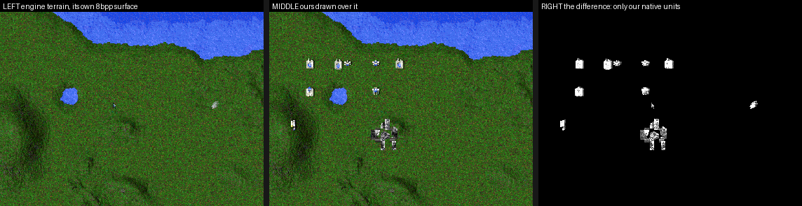<figcaption>Parity. LEFT the engine's own terrain on its 8bpp surface, MIDDLE ours drawn over it in the same frame, RIGHT the difference — only our native units. Every terrain-only band differs by zero pixels, at sub-tile scroll offsets up to (25,31).</figcaption></figure>
<figure style="margin:0">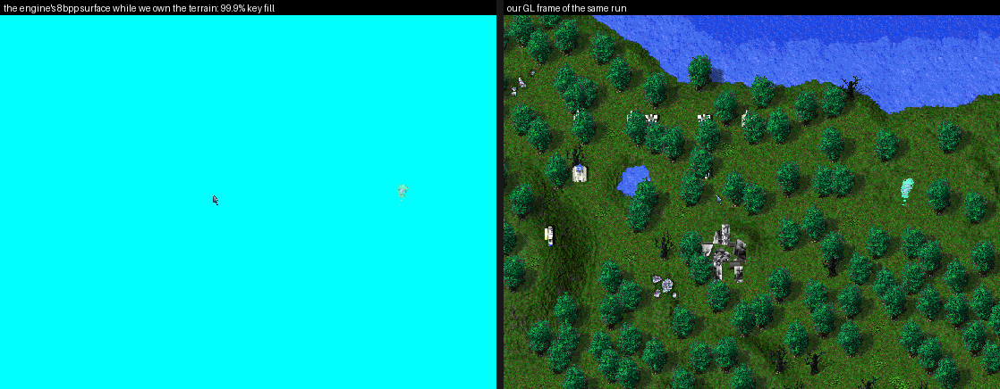<figcaption>Ownership and the inverted composite. LEFT the engine's 8bpp surface while we own the draw — 99.9 % one palette index, the key. RIGHT our GL frame of the same run.</figcaption></figure>
<figure style="margin:0">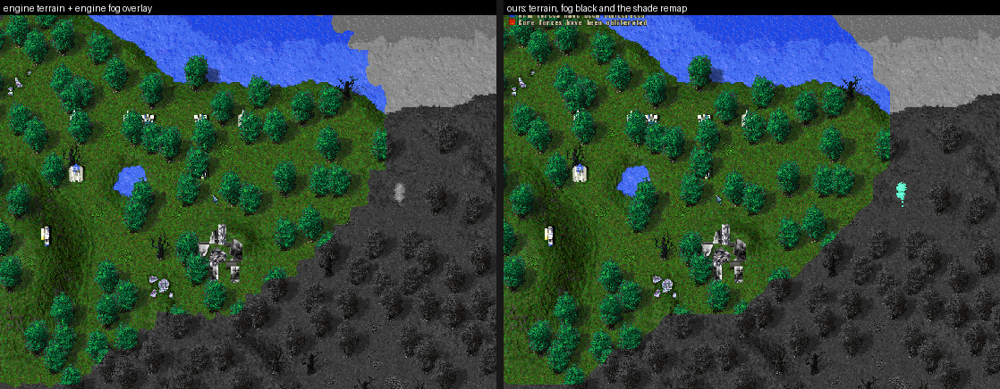<figcaption>Fog with the engine's <code>0x4848E0</code> suppressed and ours in its place: 99 % of the viewport agrees on lit-vs-grey, and the disagreement is the 2–4 px band where the engine dithers its edge sprites and we threshold cleanly.</figcaption></figure>

**G13a — features, native.** Trees, rocks, metal patches, splats and wreckage leave the
engine's frame, and they take the depth buffer with them: a tall feature now writes depth at
the row key the engine's painter's sweep implies, so a unit standing behind a tree is clipped
by the tree instead of by the G12a scaffold's stamped silhouette. One detour on one leaf
(`0x46A610`) owns all of it. Full RE and verification: [Features](features.html).

<figure style="margin:0">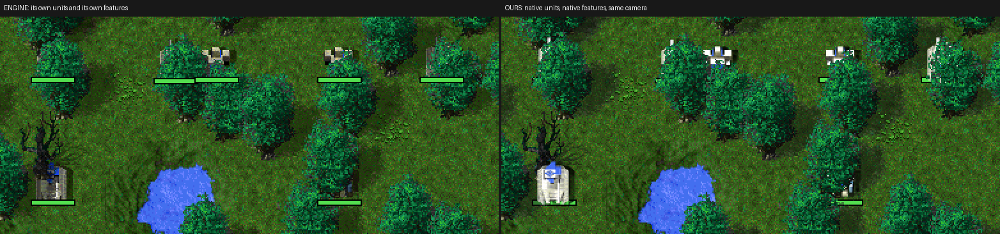<figcaption>The gate, checked against the engine's own draw rather than against a scaffold: LEFT the engine drawing its own units <em>and</em> its own features, RIGHT ours drawing both with <code>scaffold.on</code> disarmed. The five units parked two tile rows behind a tree row are clipped to the same slivers by the same canopies, and the two units one row in front stay visible.</figcaption></figure>
<figure style="margin:0">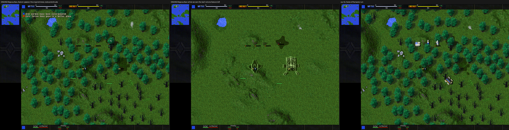<figcaption>Ownership: the engine's 8bpp surface with its own features (left), the same surface while we own the leaf — not one tree, rock or shrub left (middle) — and our GL frame of that run (right).</figcaption></figure>
<figure style="margin:0">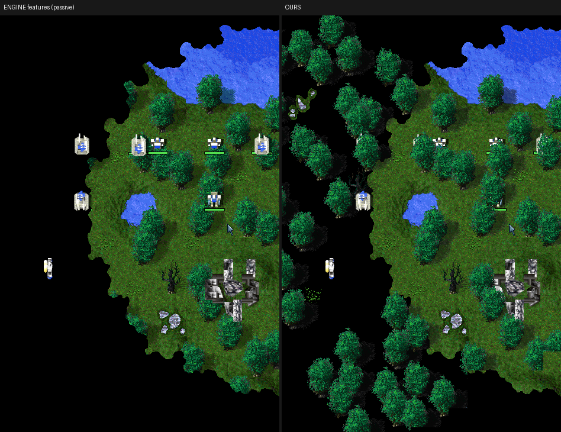<figcaption>G13a's honest gap, <strong>since closed by G13c</strong> — kept because it is what put the corner-mask grid on the trail. The engine (left) draws nothing in unexplored black; we (right) drew trees across it. Both source maps read "visible" at cells the engine paints black; the overlay turned out to be driven by a corner-mask grid instead, which the native passes now sample ([Features](features.html) §9).</figcaption></figure>
<figure style="margin:0">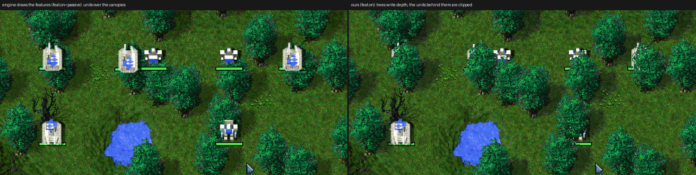<figcaption>The same fight seconds apart at 2×: <code>feat.on=passive</code> (engine's features, our units floating over every canopy) and <code>feat.on</code> (ours, writing depth).</figcaption></figure>

**G12f — the particle sfx, native.** Smoke, fire, wake foam and the nanolathe spray leave the
engine: the ten "plugin-layer hook" sites of `DrawGameScreen` turned out to be the particle
layers, drawn by one walker at ten depths, and one detour owns them all. Same fight, engine
(top row) vs ours (bottom row), the 8bpp surface in the right column. Detail in
[Effects](effects.html) §7.

<figure style="margin:0">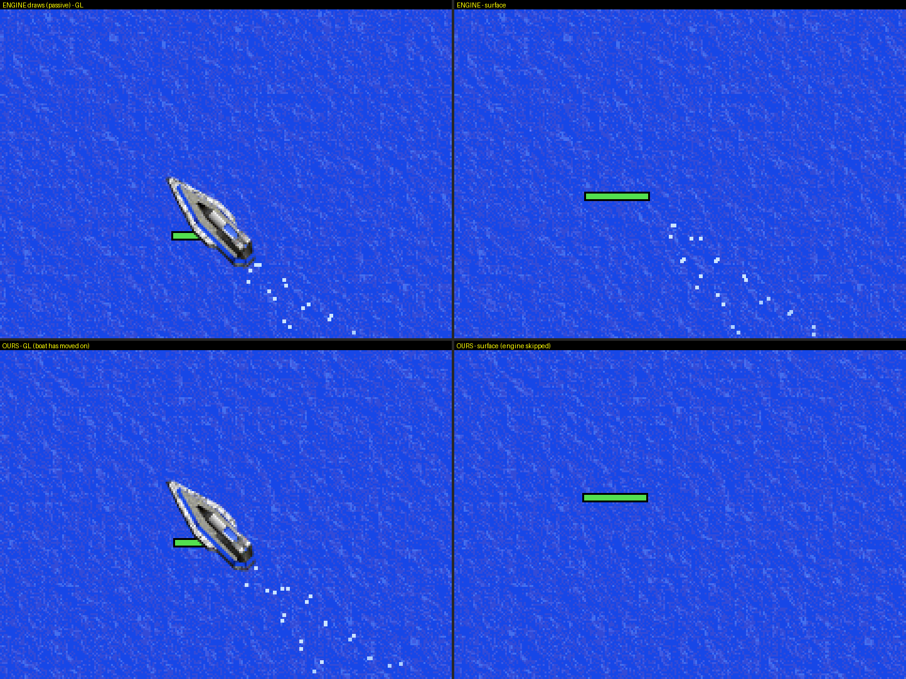<figcaption>A Skeeter's wake on Anteer Strait: the engine's 2×2 foam dots (top) and ours (bottom, the boat has sailed on); the engine surface loses the dots the moment we own layer 2</figcaption></figure>
<figure style="margin:0">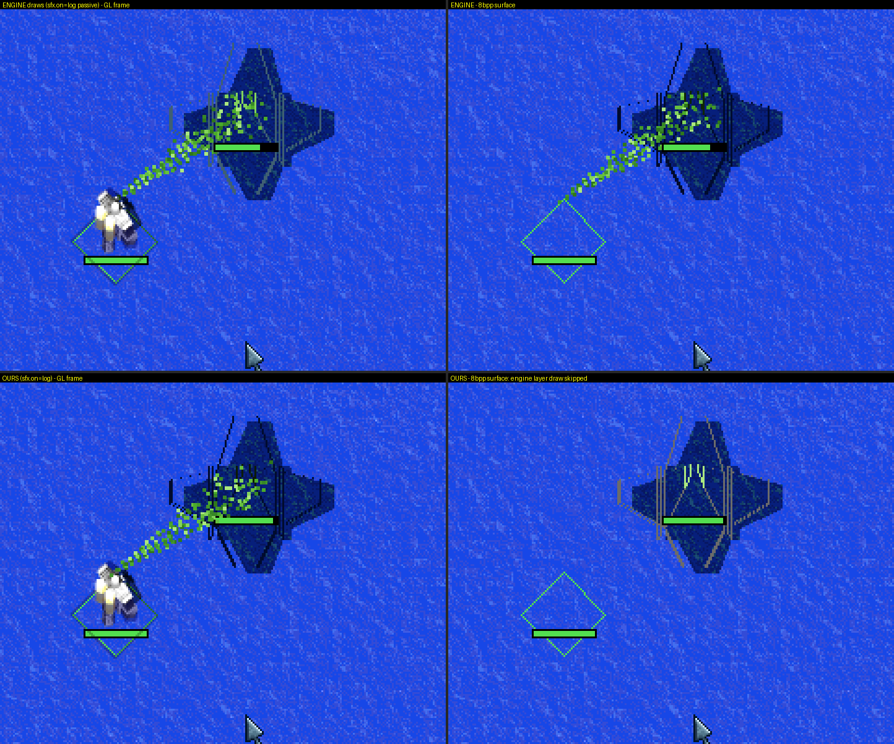<figcaption>The commander finishing a nanoframe: the same green nano spray from the nano piece to the site (layer 6, over ground units); the engine surface shows only the frame while we draw</figcaption></figure>
<figure style="margin:0">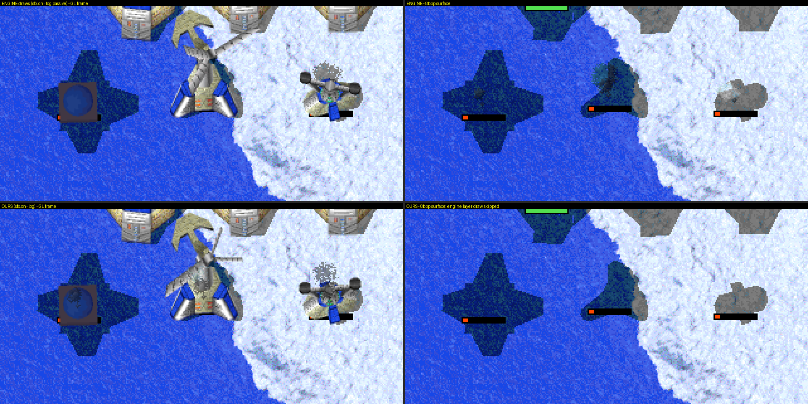<figcaption>Damage smoke over three badly damaged structures (layer 9, over everything): the same sequence frames at the same anchors, 50 % alpha in both</figcaption></figure>
<figure style="margin:0">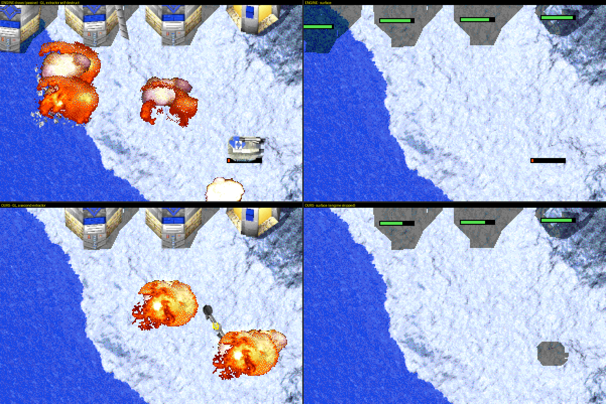<figcaption>Two extractors self-destructed, one under the engine's draw and one under ours: the burning debris (the pink-white flare sprites among the fireballs, layer 9) and the explosion pass's fireballs — the engine surface under ours carries neither</figcaption></figure>

**G12e — the effects pass, native.** Weapon fire, explosions and debris leave the engine:
same fight, engine-drawn (left) vs ours (right); the engine's 8bpp surface shows no effects
while ours draw. Detail in [Effects](effects.html).

<figure style="margin:0">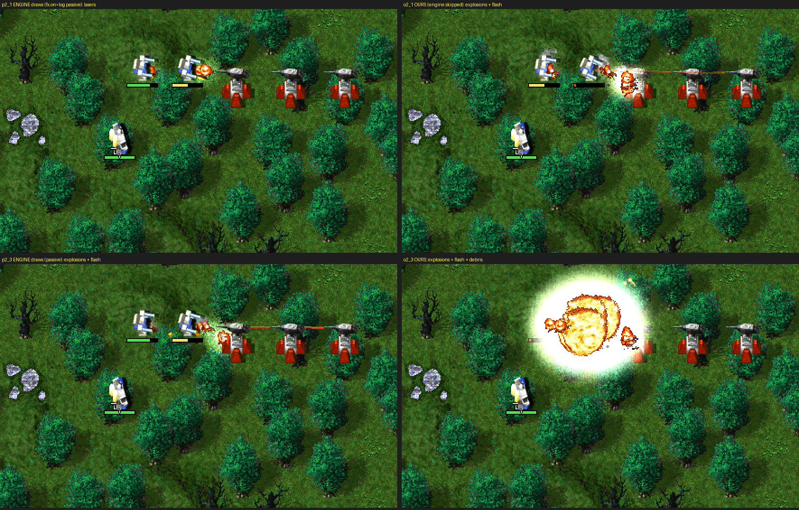<figcaption>Laser duel on Two Continents (2026-09-02): ENGINE draws (left, `fx.on=log passive`) vs OURS (right, engine skipped) — LLT lasers as lines, EMG bolts, explosion sprites, the LHT light flash (additive over a premultiplied FBO), flying debris</figcaption></figure>
<figure style="margin:0">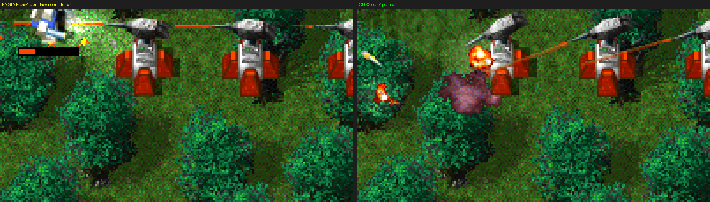<figcaption>The laser corridor at 4×: the same three palette colours in both (147,23,0 / 255,71,0 / 167,27,0), one game pixel wide</figcaption></figure>
<figure style="margin:0">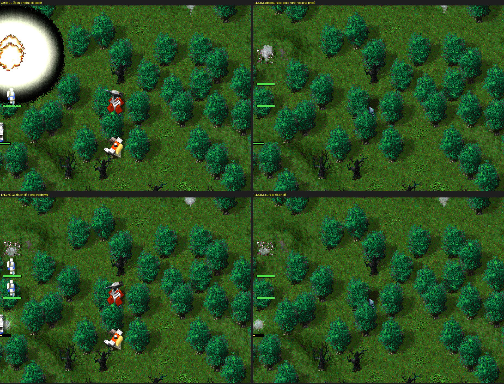<figcaption>Ownership: OURS GL (top-left) with the engine surface of the same run empty of effects (top-right); flipping `fx.on` off restores the engine's draw within 30 frames (bottom row)</figcaption></figure>
<figure style="margin:0">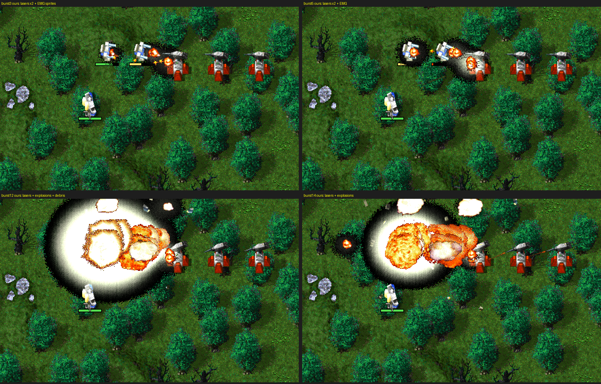<figcaption>Our sprites over the fight: EMG bolts and two-colour lasers (top), a Peewee's death — explosion sequences, flashes and 3DO debris pieces (bottom)</figcaption></figure>

**G12c — the whole base, native.** Token `all`: every complete unit on screen leaves the
8bpp path. The engine frame keeps only terrain, features and UI (note the dark footprint
clearings and the untouched metal patches); every unit pixel in the GL frame is ours —
RGB, team colours, shadows, scaffold-occluded by trees, clipped to the viewport.

<figure style="margin:0"><figcaption>Marker-verified pair at a CORE base — ENGINE (left, no units) vs GL (right, all native)</figcaption></figure>
<figure style="margin:0"><figcaption>Wind generators + floating metal maker native in the forest; a still-building windgen correctly remains engine-side (left panel, east edge)</figcaption></figure>

**G12b — the first truly native unit.** The commander leaves the 8bpp composite entirely:
RGB at game resolution, depth-tested per fragment against the G12a scaffold, own shadow.
Left pair: composite vs native, live A/B toggle. Right pair: the white AI's commander
WALKING BEHIND A TREE — its lower silhouette clipped by the canopy (scaffold discard),
while the engine frame shows no commander at all (its composite is wiped; every visible
pixel of that unit is ours).

<figure style="margin:0"><figcaption>A/B toggle: 8bpp composite path (left) vs the native RGB pass (right) — same engine-authentic colours + our shadow</figcaption></figure>
<figure style="margin:0"><figcaption>2× supersampled native FBO (left) vs raw 1× (right) — box-filtered silhouette edges, game-res look preserved (NEAREST composite)</figcaption></figure>
<figure style="margin:0"><figcaption>Native selection rect (left, ours + engine health bar) vs the engine's own rect (right) — same-second A/B at the same eye. *[CORRECTED 2026-09-08: it rotated with the body yaw but in the OPPOSITE sense — the transposed matrix — which this shot's facing could not show.]*</figcaption></figure>
<figure style="margin:0"><figcaption>G12d replacement slot: the engine's 3DO solar through our native pass (left) vs a hot-reloaded smooth-dome OBJ (right) — same anchor, same shade/palette pipeline, geometry the 1997 rasteriser cannot draw</figcaption></figure>
<figure style="margin:0"><figcaption>The native pass at 1024×768 (resolution live test): full colour, 2×SS edges, fog — zero hardcoded dims anywhere</figcaption></figure>
<figure style="margin:0">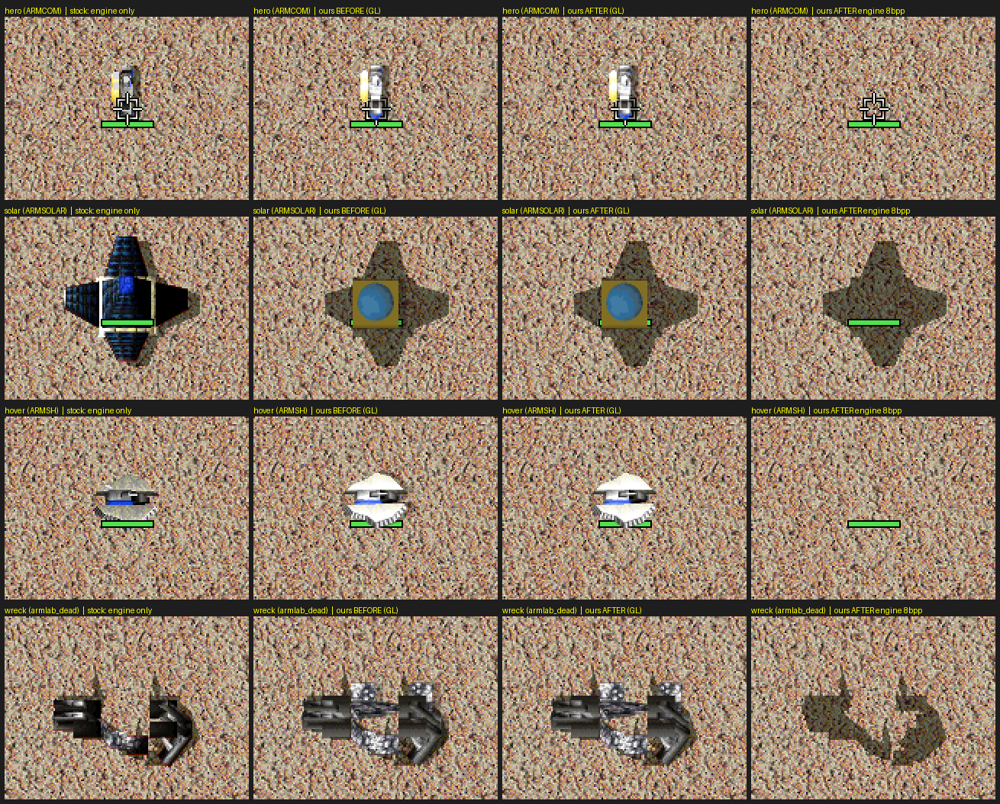<figcaption>Shadow ownership (2026-09-02), rows = commander / solar / hovercraft / wreck, columns = stock engine-only, ours before, ours after, ours engine-8bpp: the engine's cached slant shadow survives the composite wipe for structures and wrecks, so ours is drawn only for mobile units; the hovercraft no longer gets a shadow the engine never draws</figcaption></figure>
<figure style="margin:0">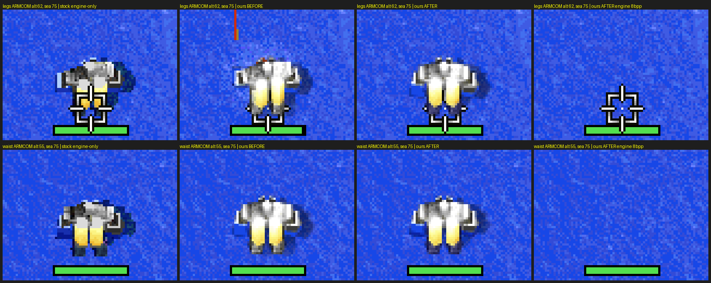<figcaption>Waterline (2026-09-02), Anteer Strait, commanders 13 and 20 elevation units under sea level: stock engine, ours before, ours after, ours engine-8bpp — submerged shins/feet tinted navy and the shadow cut at the water line, as the engine does; erase for unseen enemies and digger clipping follow the same threshold</figcaption></figure>
<figure style="margin:0"><figcaption>Smooth-zoom prototype at 2×: native units scale about the view centre; terrain/UI stay 1× (full zoom = G13)</figcaption></figure>
<figure style="margin:0"><figcaption>The native commander behind a tree: fragments discarded against the scaffold, canopy outline exact</figcaption></figure>

**G12a EXIT — occlusion prediction vs the engine.** One second apart (the second vehicle
plant legitimately finishes its build between the frames): the engine draws the tree over the
Solar Collector's lower-left corner; the scaffold tints exactly that region and the log
predicted `occl=10% (294/2704 px)` for that building. Depth keys, silhouettes and the
painter's-order tie-breaks all confirmed against live engine behaviour. **G12a done.**

<figure style="margin:0"><figcaption>ENGINE (left) vs GL+scaffold (right): the tree over the solar's corner is the predicted occluder</figcaption></figure>

**G12a — the depth scaffold, live on Two Continents.** Same view, seconds apart: the engine
frame vs the GL frame with the scaffold's debug tint. Every tall feature (tree, def Height=40)
is stamped from its GAF silhouette at its painter's-row depth — violet = far rows, red = near
rows; flat rocks, shadows and terrain stay untinted (far plane). This buffer is what native
unit fragments will depth-test against in G12b.

<figure style="margin:0"><figcaption>Two Continents forest — ENGINE (left) vs GL + scaffold tint (right); the scaffold predicted the white AI commander 26% tree-occluded moments earlier</figcaption></figure>

**Phase C flagship — a full build, marker-verified.** One ARM solar collector from first
scaffold to completion, engine and ours interleaved seconds apart on the same build (phase
markers logged against screenshot mtimes — no labeling guesswork). Stage progression matches
column for column; mid-build colour differences are the scaffold's ~2Hz palette-ramp shimmer
sampled at different wave phases, and the dark under-slab in both rows is the engine's cached
nanoframe shadow. **Build-state verified end-to-end — the stage table is exact.**

<figure style="margin:0"><figcaption>ARM solar build, 8 moments across ~112s — ENGINE (top) vs OURS (bottom)</figcaption></figure>

**Phase C — engine vs ours, side by side.** Same unit, same frame, seconds apart (owndraw
disarmed for the reference shot — the engine re-rasterises nanoframes every frame, so it
wins the composite back instantly). More panels land here as the filmstrip capture runs.

<figure style="margin:0"><figcaption>Marker-verified pair: completed CORE vehicle plant with a vehicle building INSIDE the bay — the cargo z-merge path carries our scaffold (right, crisp wireframe) exactly where the engine shows its speckle nanoframe (left)</figcaption></figure>
<figure style="margin:0"><figcaption>Completed CORMEX — engine's flat fills (left) vs our per-face SHD shading + supersampled edges (right)</figcaption></figure>
<figure style="margin:0"><figcaption>Under construction, reveal stage — engine (left) vs our in-shader scaffold (right)</figcaption></figure>
<figure style="margin:0"><figcaption>Early stage — the "engine solid mass" turned out to be the cached nanoframe SHADOW (drawn at every stage), present in both renderers; the filmstrip below settled it</figcaption></figure>

**Phase C — build-state scaffold in GL (engine formulas, our pixels).** The engine's
blit-time nanoframe effect does not fire on our written pixels, so the renderer now stages
it itself from `unit+0x104` ([build-state](build-state.html)): height-threshold reveal,
palette-ramp scaffold colours, per-face wireframe (depth-tested hidden lines).

<figure style="margin:0;flex:1;min-width:180px"><figcaption>Ours mid-build: revealed texture + wireframe scaffold (ramp is green on this palette), engine shadow + nano spray coexist</figcaption></figure>
<figure style="margin:0;flex:1;min-width:180px"><figcaption>Engine reference, early stage: solid ramp silhouette (our A/B stages draw wireframe only — known tuning gap)</figcaption></figure>
<figure style="margin:0;flex:1;min-width:180px"><figcaption>Clean handoff to the finished model — now shaded via TA's own SHD table (engine-authentic colours)</figcaption></figure>

**Phase C — per-face directional shading (G10 first delivery) — for review.** Same unit, same
frame, shading toggled live: left-facing walls catch the sun, right-facing walls fall into
shade; palette-exact throughout (the LUT can only emit palette colours).

<figure style="margin:0;flex:1;min-width:200px"><figcaption>ARM vehicle plant, shading ON — left sloped walls highlighted, inner right walls darkened</figcaption></figure>
<figure style="margin:0;flex:1;min-width:200px"><figcaption>Shading OFF — flat, the Phase B look</figcaption></figure>

<figure style="margin:0;flex:1;min-width:200px"><figcaption>CORE solar ON — the flat-grey wedges split into distinct lit/shaded faces</figcaption></figure>
<figure style="margin:0;flex:1;min-width:200px"><figcaption>OFF — wedges identical grey</figcaption></figure>
<figure style="margin:0;flex:1;min-width:200px"><figcaption>Commander ON — bright torso top, darkened flanks</figcaption></figure>

**Phase B — real GPU 3DO geometry through TA's compositor — for sign-off.** The G6 gradient
is history: the ARM Commander on screen below is **our OpenGL render** of its engine-posed 3DO
(posed vertex buffers → triangulated faces → FBO with TA's dimetric projection → per-face colours
sampled from the resolved GAF textures → index-exact 8bpp readback), written into the per-unit
composite and blitted by TA itself. Centre: ours in-game. Right: engine's own sprite (G4 shot,
with old overlay markers) vs ours — blue shoulder pads, grey torso, gold legs, gun arms all line
up. Details & the new `Model3DOFace` texture-field semantics: [render3do](gpu-render3do.html).

<figure style="margin:0;flex:1;min-width:260px"><figcaption>Our GPU render of the posed 3DO, blitted by TA's compositor</figcaption></figure>
<figure style="margin:0;flex:2;min-width:320px"><figcaption>Engine's own sprite (left, with G4-era markers) vs our render (right)</figcaption></figure>

**Many-unit test (4-player AI skirmish, Painted Desert, permanent LOS, `all`/`all` armed —
engine rasterisers fully detoured, every visible sprite below is our GPU render):**

<figure style="margin:0;flex:2;min-width:320px"><figcaption>CORE AI base — extractors, energy structures, red team trim: 6 units/frame, all ours</figcaption></figure>
<figure style="margin:0;flex:2;min-width:320px"><figcaption>ARM AI base — X-shaped metal extractors + storage</figcaption></figure>
<figure style="margin:0;flex:1;min-width:200px"><figcaption>Zoom — ARM storage, glow faces lit</figcaption></figure>
<figure style="margin:0;flex:1;min-width:200px"><figcaption>Team colour proven: the white AI's commander mid-build — <code>frame[owner]</code> picks the right badge (white here, blue on ours, red trim on CORE), green nano-spray = engine particles co-existing</figcaption></figure>

**G6 — write-back into TA's compositor — signed-off mechanism.** We reverse-engineered the per-unit
composite buffer (`GAFFrame` at `Object3do+0x10`) and TA's live palette, then wrote our own content
into that buffer in the correct 8bpp format — and **TA's own compositor blitted it onto the frame**.
Below, the ARM Commander's sprite is replaced by our animated diagonal gradient (raw palette indices,
mapped through TA's palette), hotspot-anchored at the unit's screen position, with our overlay markers
on top. This closes the integration question for the whole renderer: arbitrary pixels can be injected
into TA's software compositor. Next step is swapping the gradient for a real GPU-rendered 3DO.
Details: [Composite buffer → Write-back proven live](composite-buffer.html).

<figure style="margin:0;flex:1;min-width:260px"><figcaption>Our content in TA's composite buffer — blitted by TA's own compositor</figcaption></figure>
<figure style="margin:0;flex:2;min-width:320px"><figcaption>Whole scene — the commander replaced by our injected pixels</figcaption></figure>

**G5 — selective render suppression — for sign-off.** A detour on `DrawUnit 0x45AC20` hides one
**unit type** by name (`armcom`) while leaving everything else untouched. Left: the ARM Commander
at the exact spot [G4](frame-composition.html) showed its full sprite — now **gone**, only our green
marker over bare ground, while terrain, trees and metal patches render normally (selective,
render-only). Right: the whole scene — a complete map with the commander's sprite absent at centre.
The suppressed unit stays a complete live model in memory (`pos`/`turn` intact, COB pieces present),
so the simulation is untouched; the formal replay-byte-diff awaits an unlocked session (clicks can't
land under the locked desktop, as at G2). Details: [Frame composition → Suppression](frame-composition.html).

<figure style="margin:0;flex:1;min-width:260px"><figcaption>Commander suppressed — sprite gone, our marker remains (cf. G4)</figcaption></figure>
<figure style="margin:0;flex:2;min-width:320px"><figcaption>Whole scene renders — only the armcom is invisible</figcaption></figure>

**G4 — runtime hook confirmation — for sign-off.** An in-process tracer detoured the two
candidate draw sites live. With the ARM Commander in view (below, game-rendered sprite under our
green + yellow markers), `DrawUnit 0x45AC20` and the composite blit `0x459200` fire **in lockstep,
~3250 times per 60-frame window, for exactly the one on-screen unit** — proving "function X draws
unit N". Point the camera at the fogged CORE base instead (second shot: only our red memory-read
markers, black un-rendered terrain) and both hooks drop to **zero** — DrawUnit is line-of-sight
gated. Details + frozen hook list in [Frame composition → Runtime confirmation](frame-composition.html).

<figure style="margin:0;flex:1;min-width:280px"><figcaption>Commander in view — DrawUnit/blit fire 3250×/window (distinct=1)</figcaption></figure>
<figure style="margin:0;flex:1;min-width:280px"><figcaption>Fogged enemy units — overlay marks them (red), engine draws nothing, DU=BL=0</figcaption></figure>

**Phase A — unit→3DO bridge live proof — for sign-off.** Every yellow micro-marker below is one
piece of the ARM Commander's 3DO model — head, arms, torso, thighs, legs — read from the engine's
posed `PrimitiveStruct` origins in live memory and projected with the engine's own per-vertex rule
(`sx=+x, sy=−z−y/2`) on top of the unit's sprite. This is the full
`unit+0x9E → Object3do → posed piece tree` chain working end-to-end in a running skirmish; the same
probe logged all 15 piece names, transforms and posed vertex buffers
([Unit → 3DO bridge](unit-3do-bridge.html) has the log + offset tables).

<figure style="margin:0;flex:2;min-width:320px"><figcaption>Live skirmish — yellow piece-origin markers + green unit marker on the ARM Commander</figcaption></figure>
<figure style="margin:0;flex:1;min-width:200px"><figcaption>Zoom: one marker per visible 3DO piece, engine-projected</figcaption></figure>

**G3 — frame-composition map — for sign-off.** Static-analysis gate; the deliverable is the
[Frame composition (G3)](frame-composition.html) wiki note itself (annotated call graph, hook-candidate
table, pivot assessment), cross-checked in Ghidra with the imported corpus symbols.

**G2 — unit markers on live units — for sign-off.** In a running skirmish vs the AI, we resolve
TA's game struct, walk the live unit array, and draw a GPU marker on each unit using the engine's own
world→screen projection. Below, the green marker (own-unit colour) is drawn exactly on the ARM
Commander — read from memory, projected, and composited over the real game frame. The same per-frame
loop covers every unit; scrolling the view moves the markers with the world.

<figure style="margin:0;flex:2;min-width:320px"><figcaption>Green marker on the live ARM Commander (Canal Crossing, vs AI)</figcaption></figure>
<figure style="margin:0;flex:1;min-width:200px"><figcaption>Zoom: marker glued to the unit</figcaption></figure>

**G1 — overlay proof — for sign-off.** Our own OpenGL 3.3-core geometry, drawn over the live game
inside the fork's render thread: a translucent cyan triangle (the Cavedog logo shows *through* it —
alpha blending works) and an opaque magenta triangle, both placed within the letterboxed game
viewport. Toggling `tagpu_overlay.off` removes them with no other change. Stable, 31 fps, no crash.
Captured via a new `glReadPixels` path (the surface screenshot can't see GL-drawn content).

<figure style="margin:0;flex:1;min-width:280px"><figcaption>Overlay ON — our GL triangles over the live frame</figcaption></figure>
<figure style="margin:0;flex:1;min-width:280px"><figcaption>Overlay OFF — same frame, toggle file set</figcaption></figure>

**G0 — inert chain — for sign-off.** TA boots and renders through our locally-built forked
`ddraw.dll` on the real GPU (GL 4.6 / RTX 4070) under wine, with the stock path one env-var away.
Captured headless via our surface-screenshot trigger while the desktop was locked.

_The "FPS: 30 | Time: 0.16 ms" overlay is cnc-ddraw's own DEBUG-build frame counter, confirming the
image came from the game surface, not an X grab. Intro cinematic frame also captured
(`assets/shots/g0-intro-cinematic.png`)._

## Decisions locked

| Question | Decision |
|---|---|
| Presentation layer | Fork cnc-ddraw; add overlay callback before `SwapBuffers` in `render_ogl.c` |
| Runtime | Proton-first (Steam appid 298030); system wine 9.0 for fast iteration; Windows sanity-check late |
| Ecosystem position | Standalone stack — no dependence on TADR binaries; vendor their knowledge (MIT, attributed) |
| GPU API | OpenGL 3.3+ core, shared context, render in cnc-ddraw's render thread. **Amended 2026-09-15 — a Vulkan backend joins it beside the GL one (Phase G / G19); GL is not removed and stays the default through that phase.** The GL context is 3.3 by choice, not by limit, and most of what it lacks (compute, SSBOs, indirect draw) is a context-version bump — but ray tracing is not available in OpenGL at all, and is gated on 64-bit besides ([field notes](field-notes.html) "Environment & toolchain") |
| Hook depth | Blit-level replacement, staged through a sprite-cache stepping stone |
| Endgame | **Full scene takeover** — GPU terrain, features, units; ortho camera + smooth zoom |
| Camera until then | Pixel-exact match of the engine's fixed ortho view |
| RE tooling | Ghidra (corpus imported as labels) + x32dbg under wine + `WINEDEBUG` tracing |
| Guardrails | Hooks are read-only over sim state; MP-safety checked at each gate; stock renderer always one toggle away |
| Phase 1 bar | Full skirmish, **all** units GPU-rendered, 60 fps, compositing good enough to leave on |
| Phase 2 content | Enhance original assets first; glTF exemplar pipeline second |

## Ground truth about the target

- The Steam exe (1,178,624 bytes) is **stock 3.1 layout** with one same-length import rename
  (`WINMM.dll` → `WIN32.dll`, feeding Steam's `audiere.dll` music shim). `DDRAW.dll` descriptor,
  section table, `teleporter` tag and `InitInternalCommand` all verified at corpus addresses. [VERIFIED]
- Pristine `TotalA.exe` + md5 manifest of all 80 install files preserved in `pristine/`. We never
  modify files in the Steam dir; we only *add* DLLs, and Steam Verify is the second safety net.
- TA has **no Direct3D**. Units are 3D models software-rasterised into cached 8-bit sprites (one per
  orientation) with a per-unit 8-bit z-buffer, composited into a palettised DirectDraw surface.
  "Intercepting unit draw calls" therefore means hooking engine internals, not an API boundary.
- The state we need is already mapped in TADR's `tamem.h` (Ghidra-verified): `Model3DONode` (the
  in-memory 3DO tree — fixed-point vertices, faces, GAF texture pointers, piece names) and
  `PrimitiveStruct` (the per-unit runtime piece tree COB scripts animate: `XPos/YPos/ZPos`,
  `XTurn/ZTurn/YTurn`, visibility, hierarchy). **Posing a GPU model = walking this tree.** [VERIFIED]
- Unit enumeration is a solved copy-paste: TADR's megamap iterates
  `TAmainStruct_Ptr->BeginUnitsArray_p .. EndOfUnitsArray_p` every frame and draws overlays —
  the exact read-only pattern we need, plus its hook sites bracket the engine's frame composition.
- Stock TA has **no zoom** — world→screen is scroll offset + fixed ortho. That makes pixel-exact
  matching in Phases A–B much easier than it sounds.

## What each researched project contributes

| Source | What we take |
|---|---|
| cnc-ddraw | The entire presentation layer — palette shader, windowing, edge cases; our fork point |
| TADR megamap | Unit-array iteration, world→screen math, overlay drawing, frame-composition hook sites |
| TADR `tamem.h` | ~1,980 lines of verified structs — `UnitStruct`, `Model3DONode`, `PrimitiveStruct` |
| TADR `tafunctions.h` | Typed wrappers to call engine functions at fixed addresses |
| TADR address corpus | ~470 annotated addresses → bulk-imported as Ghidra labels |
| totala-re | 391 radare2-annotated functions → cross-imported into Ghidra |
| Patch Loader | `VirtualProtect` patching idiom; later: hex-edit-free Windows distribution via `dplayx` slot |
| petool | Only if we ever need to grow the exe itself (unlikely — we live DLL-side) |
| d3d8to9 | The vendored-translator pattern and wine-first debugging workflow, proven once already |
| TA Forever | A distribution channel if this ever ships to players |

## Phase 0 — Foothold & instrumentation

**G0 — Build & inert chain.** Fork cnc-ddraw into our repo; cross-compile `ddraw.dll` with
mingw-w64; install to the game dir; launch options `WINEDLLOVERRIDES="ddraw=n,b" %command%`.
*Exit:* game plays normally through our locally-built DLL, our build stamp in its log.
*Kill/pivot:* none — this is table stakes; if Proton refuses the override, fall back to system wine.

**G1 — Overlay proof.** Add the callback API to the fork; companion `tagpu.dll` draws a translucent
triangle + frame-time readout over the game, GL 3.3 core, in the render thread. Ini toggle.
*Exit:* overlay over a live skirmish at 60 fps, toggleable, no flicker across menus/movies.
*Retires:* context sharing, render-thread timing, the toggle discipline.

**G2 — State-read proof (the megamap dividend).** `tagpu.dll` resolves `TAmainStruct`, walks the
unit array, projects positions world→screen, draws a GPU marker glued to every unit while scrolling.
*Exit:* markers track hundreds of units through a full AI skirmish with zero crashes.
*Retires:* struct offsets on the Steam exe, camera/scroll math, per-frame read safety.

## Phase A — Own the unit pipeline (RE-heavy)

**G3 — Static map of a frame.** Ghidra project on the pristine exe; bulk-import corpus labels;
name the frame pipeline: sprite-cache build (3DO rasteriser), per-unit composite/blit, z-composite,
feature/terrain order, fog application, shadow drawing. *Exit:* a wiki note documenting the
annotated call graph of one rendered frame, with candidate hook addresses.

**G4 — Runtime confirmation.** In-process tracer in `tagpu.dll` (hit-order logging per candidate),
x32dbg under wine for the stubborn ones. *Exit:* log proving "function X draws unit N at (x,y)"
matches observed pixels; hook-site list frozen.
*Kill/pivot:* if unit pixels turn out to be drawn interleaved with terrain/features in one pass
(no isolatable per-unit composite), pivot the suppression strategy to sprite-cache substitution
(G6 becomes the permanent mechanism for Phase B, at native resolution, and we revisit).

**G5 — Suppression.** Detour the per-unit composite for one unit type; units become invisible but
remain selectable and simulated. *Exit:* 30-minute AI skirmish, stable, and the sim provably
untouched (replay/di identical, savegame byte-compare clean).

**G6 — Sprite-cache stepping stone.** For one unit type, render our GPU version of the in-memory
`Model3DONode` tree, posed from `PrimitiveStruct`, offscreen at native sprite size; read back,
palettise, write into the engine's sprite cache; the engine composites as normal.
*Exit:* A/B flip between stock and ours looks near-identical.
*Retires:* geometry decode (16.16 fixed-point), GAF texture decode, piece-tree posing — with the
engine still handling every compositing concern. *Timebox:* if cache internals fight back for more
than a week, downgrade to a side-by-side debug window (same proof, less invasive) and move on.

## Phase B — Blit-level GPU units

**G7 — One unit, truly GPU.** Suppress its blit; overlay pass draws the mesh at the exact engine
projection, posed live, palette lifted to RGB. *Exit:* the unit walks, aims, fires and dies
GPU-rendered, ≤1 px drift vs stock in A/B.

**G8 — Compositing correctness.** The hard gate: occlusion vs buildings/features, fog of war,
cloak, selection circles and health bars (drawn after units — ordering!), nanolathe effects,
water. Strategy options ranked: reuse engine z-buffer reads → stencil; else draw-order emulation.
*Exit:* curated test-scene checklist passes at "you'd leave it on" quality.

**G9 — All units at speed.** Instancing, GAF→atlas cache, cache-bypass complete; 500-unit stress
skirmish. MP-safety audit (all hooks read-only, timing perturbation bounded). *Exit = Phase 1 bar:*
full skirmish vs AI, every unit and building GPU-rendered, 60 fps, toggle away from stock.

## Phase C — Enhance the originals

**G10 — Materials & light.** Per-pixel lighting, auto-smoothed normals, true-colour palette lift,
team colour as a material channel, honest translucency, a real shadow pass. Every one of ~230 units
improves at once, zero art authoring. *Exit:* side-by-side gallery; each feature toggleable.

**G11 — Replacement pipeline. DISABLED AND THE CODE DELETED 2026-09-19** (landing 11 D3, the owner's ruling: glTF replacement models are disabled and the implementation is TODO and out of scope; it had already been drawing nothing — gpu-status §2.80). Its Vulkan caster half (`tagpu_vk_hires.c`) and the unused `native_c` composite program went on 2026-09-23. Kept below as the design record.
glTF convention (piece names mirror the 3DO tree, rigid pieces,
pivots at piece origins), loader + hot reload, ONE hand-authored exemplar unit driven by live COB
state. *Exit:* the exemplar in-game; mass content explicitly out of scope — the pipeline is the product.

## Phase D — Native-resolution scene pass (started 2026-08-31)

Architecture: [native-res design](native-res-design.html), **revised for the resolution
constraint** — the GL scene pass renders at the game's REQUESTED resolution (raise it via
TA's own video options / registry, never a mixed-res hack); nothing hardcodes 640×480 — the
viewport rect `main+0x37E27..` and view dims are read live every frame.

Two static-RE agents landed at phase start (proven pattern):
- [Resolution plumbing](resolution.html) — persistence is registry-only
  (`DisplaymodeWidth/Height`, loaded UNCLAMPED, defaults 640/480), no command-line switch;
  viewport rect writer `0x4981C9..` inside game-entry `0x497F40`: **left=128 and top=32 are
  constants**, right=W−1, bottom=H−33; mode list = `EnumDisplayModes` filtered to bpp==8,
  ≥640×480, ≤100 entries — our fork serves that list, so custom modes are one enum away.
- [UI markers](ui-markers.html) — only the **selection rect** is interleaved with unit draws
  (must be re-drawn by the native pass: rotated model-XZ-bbox, 4 DrawLines, GUI colour 0xA);
  health bars, group digits, order/build markers all draw AFTER both unit sweeps (survive our
  overdraw); build-cursor draws after fog.

| Gate | Status | Evidence |
|---|---|---|
| G12a — depth scaffold proof | ● done | `tagpu_scaffold.c` live (armed by `tagpu_scaffold.on`): per-frame viewport-sized scaffold from engine data, sweep rect/dims match the engine formulas at runtime (44×58 @640×480, vp (128,32) read live), GAF silhouettes (raw+RLE decode) stamped at row-key depth, colour debug overlay + per-unit occlusion-prediction log. Empirical detour: **Painted Desert has NO tall features** (census: all real defs Height≤5) — preset skirmish moved to **Two Continents** (defs 4–16 = trees, h=40, ~4200 anchors). Live there: 47–63 tree silhouettes stamped/frame, zero fallbacks, and the first live prediction — `ARMCOM occl=26%` behind a tree. EXIT MET: live prediction `CORSOLAR occl=10% (294/2704 px)` matches the engine frame — the tree overdraws exactly that corner of the building (panel below). Bonus fixes shipped same session: movers/builders no longer flicker (per-unit pixel cache repainted synchronously inside the owndraw detour — `repaint≈100% miss=0`), spinner dropout killed by a 16-variant box cache with max-coverage hotspot-aligned fallback (CORMEX verified clean over 1200 frames at **60 fps** — 30 fps capture aliases one-present dropouts invisibly, the key debugging lesson; recipe in the repo `ta-capture` skill). The fork's `_DEBUG` FPS OSD (GDI text stamped into the 8bpp surface, beating against the engine redraw) was the flickering FPS counter — now opt-in via `tagpu_fpsosd.on`. Known accepted gap (user-approved skip): fast-swinging pieces can clip at the composite AABB edge — dies with G12c. |
| G12b — one unit truly native | ◐ core done (2026-09-01) | `tagpu_native.c`: commanders render as RGB into a game-resolution FBO composited over the frame — engine-posed geometry in live viewport coords, shared atlas + engine SHD rows lifted through the live palette (cycling-safe), REAL per-fragment occlusion vs the G12a scaffold (VERIFIED: the white AI commander walks behind a tree and its silhouette is clipped by the canopy — panel below), own 50%-black offset shadow (engine rules), true-alpha cloak path, per-fragment LOS/MAPPED fog sampling (code live; visual test needs a true-LOS skirmish), native team colours. Ownership handoff: under-construction units stay on the composite path until complete; owned units' composites are wiped (engine blits nothing — A/B toggles live via `tagpu_native.on`). **2026-09-01 late-night close-out:** SELECTION RECT native (flat model-XZ AABB from a cached whole-3DO-tree walk, rotated by body yaw, GUI colour 0xA, GL_LINES just under the unit's depth — rotates with a walking commander exactly like the engine's; A/B panel below). True-LOS skirmish LIVE (`SkirmishLineOfSight`/`SkirmishMapping` REG_DWORDs — the guessed `LineOfSight` REG_SZ name was wrong): fogMode=3, per-fragment unexplored-discard + out-of-LOS darkening in the shader, own units verified against the gradual-reveal edge. **That per-fragment source-map rule was later found to be wrong outright and replaced in G13c** — the enemy-straddling-the-boundary case is settled there (an enemy structure on grey ground is not drawn), so nothing remains here. |
| G12c — all units + 3D wrecks | ◐ core done (2026-09-01) | `tagpu_native.on` token `all`: every COMPLETE unit renders natively (buildings, mexes, windgens, floating makers — team colours, shadows, tree occlusion all correct; panels below); under-construction units hand over at completion; airborne units get the nearest depth band with ground-anchored shadows; native pass clipped to the live viewport rect (engine parity — without it units overdraw the HUD). Anchor parity vs composite: (−0.44, +0.11) game px. **2026-09-01 late-night close-out:** (a) 2× SUPERSAMPLING live for the native FBO (render at 2×, exact box downsample via LINEAR quad into the 1× FBO, NEAREST composite keeps the game-res look; visibly antialiased silhouettes, panel below; `tagpu_ss.off` kill switch). (b) NATIVE WRECK PASS CODE LIVE (`tagpu_native.on` token `wrecks`): sweep-rect FeatureStruct walk (flags bit0 + FeatureMask bit0 clear → record `*(main+0x1420B)`+idx*0x30) emits husks at feature depth 3+rel·4; the owndraw classifier now recognises the scratch fake-unit (`*(main+0x1420F)`+0x9E == obj3do mid-draw) and wipes-instead-of-restores while armed — this ALSO fixes a latent bug where `all` would have skipped a fresh husk's first rasterise with nothing cached (invisible corpse). **VERDICT CORRECTED (2026-09-02): unit & building wrecks ARE 3DO models.** The night-2 claim that "all corpses are GAF wreckage sprites" was WRONG — it read the counter, not the data. Ground truth (feature catalogue + engine draw path + a live spawned `armlab_dead`): all 371 `*_dead`/`*_heap` corpse defs have `FeatureMask` (+0xFE) **bit0 CLEAR**, and `0x46A610` sends bit0-clear features down the scratch-fake-unit → `DrawUnit 0x45AC20` **3D composite path** (bit0-SET is the GAF path). `armlab_dead`: `objects3d` (+0x98) is a valid 3DO pointer, `SeqName` (+0xAC) NULL; its live wreck record holds a real `Object3doStruct` (+0x04, NumParts=1, posed). The bit0-SET GAF features are reclaimable scenery/foliage — rocks, trees, **burnt/dead trees** (`Tree1Dead`… = foliage, not unit husks), scars, smudges, ore, map dressing. The night-2 counter read 0 for two reasons, both now fixed/known: (i) the wreck-gather read the wreck record's `+0x08/0x0C/0x10` positions as whole world units, but they are **16.16 fixed-point** → every wreck projected ~1700<<16 px off-screen and was culled (nu=0). Fixed (`>>16`); now `native: 1 wreck(s) 486 verts`. (ii) `tagpu_owndraw_init` installs its rasteriser detours ONLY if `tagpu_owndraw.on` exists at DllMain (no per-frame re-arm), so arming owndraw AFTER launch never suppressed the engine — the pass was never actually exercised. Arm owndraw + native BEFORE launch (`--restart` preserves `*.on` triggers). **3D-WRECK A/B PRODUCED (2026-09-02):** `armlab_dead` on Painted Desert renders GPU-side matching the engine silhouette; the 8bpp engine frame with our pass armed shows no wreck body (only the cached shadow) = every wreck pixel is ours. (c) army stress: measured escalating 23→31→35 native units, 9 372→15 969 verts, 60.0 fps THROUGHOUT at 1024×768 with ss=2 (2048×1536 internal FBO) at live AI bases/battles; vertex budget projects ~100 units ≈ 45 600 verts, inside the 49 152 cap. Open: factory-cargo layering (accepted). Shadow ownership SETTLED 2026-09-02 (panel above; shadows-cloak.md): no double shadows — the engine keeps its cached slant shadow on structures/wrecks, we draw the composite-derived silhouette for mobile units only, FBI noshadow/canhover/floater honoured; factory-built units verified to clear the structure bit. Waterline/digger clipping implemented (tint own, erase unseen enemy, cut shadows; panel above). |
| G12d — freedoms | ◐ sub-pixel done (2026-09-01) | **SUB-PIXEL MOTION VERIFIED at present rate**, and better than planned: the engine already stores 16.16 fixed-point positions (unit+0x6A/6E/72 — the roster "shorts" at +0x6C/70/74 are just their high words; spotted via DrawUnitSelectBoxRect's operands in ui-markers). The native pass reads the true fractions and interpolates between the last two sim samples per unit slot (distance-snap guards slot reuse; `tagpu_subpix.off` kill switch). Numeric filmstrip via `tagpu_spxlog.on` (60 Hz anchor log): subpix ON advances ~0.33 px EVERY present frame (e.g. 393.345→393.944→394.542 across one 1.2 px sim step); OFF shows the raw 30 Hz staircase (460.019, 460.019, 460.814, 460.814 — one step every second frame). **Night 2:** HI-RES REPLACEMENT SLOT PROVEN — `gamedir/hires/<UnitName>.obj` (v/f/c subset, palette-index colours) renders INSTEAD of the 3DO: engine anchor + body yaw + our LUT/palette shade pipeline, hot reload on mtime (~2 s iteration loop). A smooth 210-tri hemispherical dome replaced the solar collector — visible curvature shading the 1997 rasteriser cannot do (panel below). Feeds G11 directly (the loader slot + anchoring exist; G11 adds glTF + per-piece COB pose). Palette lesson: flat colours go through the SHD LUT — only indices with sane ramps work (GUI colours render black); swatch-strip test mesh maps the palette in one capture. SMOOTH-ZOOM PROTOTYPE demoed at 2×: native units scale about the view centre (uZoom in the VS + inverse transform for the scaffold lookup), terrain/UI stay 1× — honest verdict: reads as a floating-units demo, exactly as predicted; full zoom needs G13 terrain. Remaining freedom: cloak polish (needs a cloakable unit) — tracked with the rest in [GPU status, hooks & limits](gpu-status.html) §3. |
| G12e — effects pass (weapon fire, explosions, debris) | ● done (2026-09-02) | The engine's two effects passes are reverse-engineered ([Effects](effects.html)) and replaced: `tagpu_fx.c` gathers `ProjectileStruct[]` / `ExplosionStruct[]` / the debris particle slots and draws lasers and lightning as lines, rockets/missiles/shells and debris as 3DO models through the native geometry path, sprite weapons, flares, explosions and the LHT light flash as sprites from a private RLE-decoding GAF atlas — at the engine's depth band (above every ground row, below aircraft), LOS-gated per projectile like the engine. `tagpu_fxown.c` owns the draw: two call-site redirects + four leaf detours, the skip following `tagpu_fx.on` live; tacli auto-arms it at launch. Verified same-fight (`passive` token = engine draws while we log): laser colours palette-identical, EMG sprites, rockets with thrust flames, explosion sprites + flashes, flying debris; the engine surface shows no effects while ours draw. Not reproduced: the rendertype-2 refraction ball; smoke/fire/wake particles stay engine-side (hook-vector sfx — next gate). |
| G12f — particle sfx (smoke, fire, wakes, nanolathe) | ● done (2026-09-02) | The ten `0x471F90(ctx, n)` sites in `DrawGameScreen` — filed in terrain-depth.md as "plugin-layer hooks, empty in stock play" — are the particle sfx: pooled 76-byte objects in ten *layer* vectors at `*(main+0x38D77)`, each layer drawn at a fixed depth of the frame (2 = wake foam under everything, 4 = feature smoke, 5 = rocket-trail puffs, 6 = nanolathe spray, 7 = bubbles, 9 = impact/damage smoke and fire over everything), the layer being the emitter's argument ([Effects](effects.html) §7). `tagpu_sfx.c` walks the layers, classifies each object by vtable (Smoke1/Smoke2/fire/flare = alpha sequence sprites; wake/nano = 2×2 `DrawBar` dots) and emits through the effects buckets with per-layer depth keys derived from the frame's row count; `tagpu_fxown.c` owns the draw with one more byte-matched prologue detour on the walker (`ret 8`), its own skip byte following `tagpu_sfx.on` live. Verified same-fight on `scenarios/sfx-strait.json` (Anteer Strait): wake dots, nano spray, damage smoke and burning debris identical engine vs ours, the engine surface clean while owned; 200v200 at sim +3 with every pass live holds ~60 fps (28 sixty-frame log lines in 30 s, 217 native units and ~230 particle sprites on screen). Fixture lessons (UI repair order, metal storage, boat pathing) in the ta-drive skill. |
| G13a — features native (trees, rocks, splats, wreckage) | ● done (2026-09-02) | The last colour-keyed sprites in the 8bpp frame besides the terrain. One leaf draws every feature pixel — `0x46A610(ctx, tile, tileX, tileY)`, `stdcall` `ret 0x10`, three call sites, three bodies (3D wreck via `DrawUnit` on the scratch feature-unit, animated GAF wreck, normal feature: shadow then body, static frame 0 or the anim state, plain copy or 50 % alpha per mask bits 2/3) — and its decompile settled the two open questions the handoff carried: the leaf mutates nothing the sim reads (bodies 2 and 3 write nothing at all; body 1 only the draw-side scratch unit) and `GAFGetCurrentFramePtrAddr` is a pure read, so animation is driven by the tick and survives ownership ([Features](features.html)). `tagpu_feat.c` walks the engine's own clamped sweep rect and draws the same frames **with depth writes on** at the row key the painter's order implies (tall bodies `3 + rel*4` above that row's units at `1 + rel*4`, flat ones in a band between the particle layers the engine draws around the pre-pass, shadows a notch below with depth writes off); `tagpu_featown.c` owns the draw with one 5-byte prologue detour, gated on `native.on` carrying `wrecks` because body 1 draws husks through `DrawUnit`. **This retires the G12a scaffold as the occluder**: occlusion was verified against the engine's own draw (engine units + engine features vs ours, `scaffold.on` disarmed) and matches unit for unit; the engine surface is empty of features while owned; fog, map scrolling a 200v200 stress at ~60 fps and map scrolling all clean. Two shared modules fell out, closing three old review follow-ups: `tagpu_gaf.c` (the RLE decoder + shelf atlas, was a private copy in `tagpu_fx.c`) and `tagpu_detour.c` (the stub/patch machinery, now shared by `fxown` and `featown`). Gaps: **fog was not at parity** — the rule all four native passes shared drew over cells the engine paints black, which this pass was simply the first to make obvious; it predated G13a and got its own gate, **G13c below, which closed it** ([Features](features.html) §9); the animated-GAF-wreck body is unreachable with stock content (every `*_dead` def takes the 3D path); feature shadows are a true 50 % RGB blend where the engine does a palette-space ALP remap, so they dither differently. |
| G13b — terrain native, and the composite inverts | ● done (2026-09-02, reviewed) | The last engine-drawn world layer. `tagpu_terr.c` reproduces `0x483FA0` — a grid blit and nothing else: one `GL_R8` atlas of 32×32 cells, 64 per row, **built once per map** (`LoadMap` builds `TILE_SET` and nothing changes it; 2048×2560 for Two Continents' 5062 tiles, and a `GL_TEXTURE_2D_ARRAY` is not viable against the usual 2048-layer cap — G13h later put the cells on a 34-texel pitch with a replicated border, 2176×2720), one quad per visible cell at depth key `0.10` — under the flat-feature band and the low particle layers, i.e. the frame's implicit far plane. Water does not animate at all — the "palette cycling" this entry used to claim was measured false on 2026-09-05 ([terrain & depth](terrain-depth.html) §7); the per-frame palette re-upload stays as insurance, not as a mechanism. The engine's truncating `sar 5` and its `ceil` column count are reproduced deliberately, with a comment saying so. **Parity is exact**: 0 differing pixels against the engine's own blit in every terrain-only band, at `frac=(0,0)`, `(6,8)` and `(25,31)`. **The gate was the compositing model, and it inverts.** Terrain covers the whole viewport, so the old rule ("discard our empty pixels, let the engine's frame show") would hide health bars, nanoframe wireframes, the build cursor, chat and dialogs. `tagpu_terrown.c` therefore does not just skip `0x483FA0` — its skip path (a new `tagpu_detour_leaf_call`, nine stolen bytes) **fills the viewport rect of the engine's offscreen with one palette index, the KEY**, which also restores the clear that the terrain repaint used to provide; the composite then discards *our* fragment wherever the engine's frame is not the key, reading it straight out of cnc-ddraw's own `R8` index texture with `texelFetch` (`TAGPU_FRAME.surface_tex`). The key is **254**, not a guess: the engine's GUI colour table at `main+0xDCB` uses `0xFD` and `0xFF` and leaves `0xFE` in the gap. The **fog overlay `0x4848E0` is suppressed with the terrain** (its shade remap would rewrite the key into grey blobs, and we have reproduced it since G13c) **with its lazy grid rebuild replicated exactly**, because our own fog rule samples that grid. Terrain is the bottom layer now, so it paints the fog's solid black rather than discarding (`TAGPU_GLSL_FOG_TERRAIN`). Verified: engine surface **99.3–99.98 % key** with no terrain left; engine chat, `PAUSED`, selection boxes, the build panel and the cursor all survive inside the viewport; fog **99.06–99.39 %** lit-vs-grey agreement (99.48 % of pixels identical at a fully-fogged corner, mean abs 0.32/255) with only the dithered edge differing; in-process map change rebuilds the atlas (5062 → 7051 tiles); map corners clean with `off-map=0`; `terr.on=off` and the 90-frame watchdog both restore the engine's terrain *and* fog; 200v200 with everything native at **59.7 fps**. It also fixed a G13c gate bug it made fatal: `fogMode` bit0 was `LosType & 1`, the **mapping** option, so true-LOS-without-mapping (`LosType=14`) skipped the fog rule entirely — invisible while the engine drew its own overlay, a missing grey band once we suppress it. Review closed the three failure modes an inverted composite has and an overlay does not (emitting without owning; the disarm frame; a screen that never calls `0x483FA0`) — all written up with their symptoms in §7.6, along with the one review finding that was **wrong** and must not be "fixed" later. [terrain & depth](terrain-depth.html) §7. |
| G13c — fog of war at parity | ● done (2026-09-02) | **Reverses [terrain & depth](terrain-depth.html) §6 item 4.** All four native passes mirrored fog by sampling the LOS/MAPPED source maps per fragment; that advice was wrong and the gate proved it. The engine's overlay `0x4848E0` is driven entirely by the view-anchored corner-mask grid `0x4843C0` builds behind `*(main+0x1421F)`, and the source maps cannot reproduce it: the lattice is offset **half a cell** (a grid corner sits at a map cell's *centre*, `origin = 32·col0 + 16`), its shape is a **4-bit corner mask** feathered by 14 GAF edge sprites that a per-cell boolean cannot express, and — read in the *same frame* at the same cells — MAPPED reported explored across a band the engine paints solid black (that last discrepancy is still unexplained, written up in terrain-depth §5.2; it is moot for rendering because the grid is by construction what the engine drew). The fix is one shared rule in `tagpu_glsl.h` replacing four copy-pasted blocks and the `uLos`/`uMap` pair with a single `uFogGrid`: the grid uploads as an **RG8 texture with no conversion** (its two bytes per cell already *are* the unexplored and out-of-LOS masks), and **bilinear coverage over the four corner bits thresholded at 0.5** reproduces the 14 edge shapes — `0xF` → everywhere, `0x3` → exactly the top half, a lone corner → its quadrant — clean where the engine dithers. The grey darken is the engine's own shade LUT `*(TAProgram+0xCC)` applied to the palette **index** before the palette fetch (a multiply on the resolved colour costs 19,768 mismatched px — visibly too dark on canopies). **Units and effects hide in grey while terrain, features and wreckage stay and are remapped** — the rule the passes did not implement at all before. MEASURED, `feat-forest` on Two Continents, GL framebuffer, engine draw vs ours at the same camera: mapping-only 48 px lit only in the engine's / 821 only in ours / 287,531 agreeing; true LOS **97 / 186 / 576,990** (0.05 %). Verified live that an enemy solar collector on fully-grey ground is **not drawn** while the flattened building footprint it stamped into the terrain still shows — TA's own "grey shows terrain but not units". Panel and method: [Features](features.html) §9. |
| Resolution track | ● done (2026-09-01 night 2) | LIVE AT 1024×768: registry `DisplaymodeWidth/Height` (REG_DWORD 1024/768) → the game runs the mode; every live read matched the RE formulas exactly — vp=(128,32), view=896×704 (=W−128, H−64), sweep=68×76, native FBO 1024×768 (ss=2 ⇒ 2048×1536 internally); UI lays out fine (top-bar art tiles on the right — acceptable); clicks/camera/build all worked with ZERO tool recalibration (the in-process driver computes from live vp/game dims by construction; only capture-crop scale changes: 2.8125 vs 4.5). THE REAL PAYOFF: the first in-game mode switch ever exercised exposed that `dd_SetDisplayMode` restarts the render thread with a NEW GL CONTEXT — all our cached GL ids die silently (stale-FBO bind → our pass cleared the real backbuffer black). Fixed with context-change detection (wglGetCurrentContext each frame) + per-module glreset (state, texture dims, AND the CPU-side atlas/LUT upload caches — forgetting those left everything sampling black). Mode switches are now robust — a G13 prerequisite banked early. |
| The pose race — the one-frame rest-pose pop | ● done (2026-09-08) | **Reported from play as a zoom bug; zoom is only the magnifier.** A walking commander was drawn, for exactly one presented frame, in its **unrotated rest orientation** and then snapped back — ~1400 changed pixels at 2× zoom, three frames of a 62-second walk; the event *rate* is the same at 1× and 2× and zoom multiplies each event's size about fourfold. Diagnosed to the engine's repose: `DrawUnit 0x45AC20` (and the COB's `0x45AB10`) rewrite every posed vertex buffer `prim+0x22` **in place, on the game thread, in two stages** — `rep movs` of the node's rest vertices back over the whole piece tree (`0x45ACDD`, `0x45B030`; a third repose, for cargo, at `0x45ADA5..0x45AE47`), then the compose that puts the piece turns and the body turn into them (`0x45B0A0` → `0x45B150`, one vertex at a time). The native pass gathers on the **render thread** and reads that buffer live, and nothing else in the engine ever writes rest vertices there — so a frame that draws the unit at rest is a frame that read between the two stages. `Object3do+0x08` brackets the window exactly (set before the reset, cleared only after the compose, and the rewrite is entered only when it is non-zero), so `emit_geom`/`emit_slant` read it either side of each piece's vertex copy and re-emit the unit from the **pose fields** whenever it was set. **Measured**: an in-DLL oracle (`tagpu_posewatch.on`) caught buffers 34.00, 38.63, 34.16, 33.03, 32.96, 32.82, 32.69, 32.00, 25.23, 23.18 and 22.24 model units away from what the fields describe, i.e. the model's own size — **every one of them with the dirty flag set on both sides of the read**, which is the property the guard depends on. The fallback is not a change of its own: forced for every unit (`tagpu_poserecon.on`) it renders **0 differing pixels of 1920×1080** against the engine-buffer path *on this fixture*, and the oracle reads `0.00` in every window with no trip. *[QUALIFIED 2026-09-09 by G16 step 6, which ran the same A/B over twelve scenes: it is 0 to 43 px of 786 432, worst on `scenarios/shadow-struct.json`, and it moves run to run with the pose the shot caught. Every differing pixel is an isolated coverage flip, so the conclusion — the fallback is not a visible change — stands; the number is per fixture and was never general.]* **Regression on the walk fixture** (one ARMCOM, static camera, zoom 2×, 62 s, the transient detector over the world band only): frames over 500 changed pixels **3 → 0** and over 1000 **2 → 0**, in three runs out of three, worst frame 1403 px → 475/492/294 px; the `>350` band is unchanged because it is the walk itself. 60.0 fps before and after. The window is microseconds wide and opens ~30 times a second, so reproducing it needs **scheduling pressure, not a longer run** — the game pinned to one core with spinners on the same core, which is what a loaded machine does to a player. [gpu-status](gpu-status.html) §2.9, [engine map](exe-reverse-engineering.html) "The repose, and the window it leaves open". |
| G16 — 3DO units pose on the GPU, like the replacement meshes already do | ● **done (2026-09-09)** — [GPU posing](gpu-posing.html). **Gate 0 settled and Gates A, B, C and D all passed**; every step landed, ending with **step 8, which deleted the CPU emitters**. There is one unit renderer now and **nothing reads `prim+0x22`**, so the pose race has no mechanism rather than a guard. 898 lines out, 294 in. **Gate A** ran `posewatch`'s oracle over a 69-unit ARM+CORE screen inventory (`scenarios/pose-inventory.json`, plus a naval half on Anteer Strait) covering all eight classes and both extremes of stock geometry: **`norecon` 0 across 82 types, all 27142 watch lines `dirty=1/1` and none `dirty=0/0`, and the 36-piece and 304-face models at `errmax 0.00`** — nothing reconstructs wrong, so the GPU path can be built on the reconstruction. It also found that a handful of **structures never get composed at all** and sit at their rest vertices for the whole session (gpu-status §2.9, engine map "The repose"). **Step 4** is `tagpu_posebake.c` behind `tagpu_posebake.on`: one geometry buffer per type carrying body/slant/wire as three ranges, a material stream per (type, owner, **atlas generation** — a counter added to `TAGPU_GAFATLAS`, since every recycle moves every UV), the piece tree's topology cached per type, the 64-piece cap gone (`TAGPU_PBMAXPIECE` 256), and a `check` token that holds the bake to the emitters it will replace — **0 mismatches** on the body vertex count and on the accumulated rest offsets over the whole inventory, `anom=0`, `refused=0`. Nothing draws from the buffers yet. **Step 5** (2026-09-09) is `tagpu_posedraw.c` behind `tagpu_posedraw.on`: a posed TWIN of the native program — its own vertex stage porting `emit_node`, the native pass's **own** fragment stage shared through `tagpu_native_unit_fs()` so the two cannot drift — plus its shadow-depth twin, the Classic silhouette routed through it, the pose in a std140 block whose size is checked against `GL_MAX_UNIFORM_BLOCK_SIZE` rather than assumed, the bake's cached topology finally consumed, and `s_emitTop` taken from each piece's rest AABB through its pose matrix. **Measured paused at 1024x768 ss=2**: `pose-inventory` 27 of 28 units posed with `skip=0` and **2 differing pixels of 786 432** against the CPU emitter (**1** with `poserecon.on` on both sides, which isolates the port); `200v200` at 111 posed units and 12 879 triangles, **0 differing pixels**, with the CPU vertex stream down from **33 279 verts to 132**. Both are single-pixel edge flips — the shape §5 predicts — and neither is the whole-face SHD tell. Bodies only; the CPU emitters stay as Gate B's oracle. **Step 6** (2026-09-09) wires the other two baked ranges — `emit_slant` and `emit_wire` off the CPU — as `uRange` in the posed vertex shader plus two draws: the slant with `0x45A610`'s projection off the snapped posed vertex, its own per-piece rule `(P_FLAGS & 3) == 3` (visible AND `cached`) in a **visibility word** added to the block (now **14 336 bytes**), and `waterT`/`digT` pinned at −1e9 by the pass itself because the structure branch never erases (the G14j fix); the wire as `GL_LINES` one notch nearer with the animated blue as a uniform, reading the same word rather than the all-zero matrix, since a zero-area triangle provably produces no fragments and a zero-LENGTH line is not promised away. **The step that mattered was the 16.16 snap**: the engine holds every posed vertex as three 16.16 integers and every CPU emitter reads them back as `v[i]/65536.0f`, so the shader now rounds onto that grid before anything reads it — which is what makes the slant portable at all (its `>>16` is a FLOOR, so half an LSB is a whole screen unit) and which took the BODY's residual to zero as well, superseding step 5's 2-and-1-pixel readings. **Gate B and Gate D both PASSED**, one build, twelve scenes, paused, 1024x768 `ss=2`: with `poserecon.on` on both sides — the protocol that isolates the port — **0 differing pixels of 786 432 on eleven scenes and 1 on the twelfth**, over four `pose-inventory` stops, `200v200` (128 posed / 13 219 tri), a six-nanoframe wire sweep and all five G14j shadow fixtures. Against the engine's own posed buffer the worst is 43 px (`shadow-struct`, the CORE wind generator's blades) — but that column is the **reconstruction**, not the port: running the CPU emitter against itself reproduces it row for row, and the shipping guard already falls back to the reconstruction on a torn read. It also **moves run to run** (0-6 on the same scene) because a load leaves the animating pieces at whatever angle the tick reached, while the port column reproduced exactly on a second build. Every differing pixel is isolated; none is the whole-face SHD tell. | **The native unit pass streams posed geometry every frame; `tagpu_hires_draw.c` next to it does not, and has not needed to since it was written.** The replacement-mesh path keeps one static VBO per model with a piece id per vertex (`layout(location=3) in float aPiece`), holds one 4×3 per piece in `uniform vec4 uPiece[…*3]`, and transforms position *and* normal in the vertex shader; `hires_pose` fills that from `pose_accum_body` — from the engine's pose FIELDS. It therefore **never reads `prim+0x22` at all, and the pose race cannot happen to a replacement model.** G16 is that architecture for 3DOs: rest vertices and the whole face topology baked into a per-type static VBO (UVs, colour-key flag, the fan mapping of an n-gon's corners onto a quad's UVs, the selection-primitive face skip, the quad rule), the per-piece matrices uploaded per unit, and everything the 14-float vertex carries today derived in the shader — screen x/y, the depth key `encBase + clamp((2y−z)/256, ±1.8)`, the world x/z the fog samples, the model height the waterline clips on, and the shade row from the rest normal through the same matrix (the transforms are rigid, so a baked normal transforms exactly). **What it buys:** the race gone *by construction* rather than by detection — no window, no threshold, no counter (gpu-status §2.9); per-unit per-frame CPU down from transforming 176 vertices and rebuilding 555 stream vertices to reading 276 bytes and building 15 matrices; the geometry no longer re-uploaded each frame; and **one renderer instead of two**, with `TAGPU_HUNIT` and the pass's own `NU` no longer duplicating per-unit state. **What makes it a gate and not a patch:** `emit_node` is where the parity rules live, not a transform loop; `emit_slant` reproduces the engine's *integer* snapping (`v[0]>>16`, `q = yi>>2`) and that is where G14j won byte-exact structure-shadow parity; the payoff needs instancing and the poses in a UBO/SSBO rather than uniforms (one draw per *type*, per-instance anchor, fog word, cloak alpha, waterline, nano state, team colour, depth key), which is a change to how the pass submits work; and it retires the only oracle we have for the reconstruction — the engine's own buffer. *[CORRECTED 2026-09-08: that used to read "on exactly the models where the two disagree … 4.1 / 7.0 / 48.4 / 77.2 world units … attributed to the buffer lagging the fields". **They do not disagree.** Gate 0 measured the residual to be the checker's own omitted bank and pitch, and it is 0 on every class once all three body words are folded.]*. It does **not** touch the anchor: the unit's 16.16 position is read with no interlock either way. **The plan is now written down in full** — [GPU posing for 3DOs](gpu-posing.html): what moves (all four readers of `prim+0x22`, not just the body emitter), where the pose is read (the render thread, from the fields, under the existing `tagpu_reclaim` bracket — the guarded surface gets *smaller*, since `prim+0x22` is a second allocation freed at `0x45AAB2` before the object itself), how the per-type bake is cached and invalidated (a level generation owned by `tagpu_reclaim`'s `0x491B60` hook, which `s_aabb`/`s_sbox`/`s_pmap` adopt too — they are keyed by raw node pointers today and never dropped), and that there is **one renderer**: no per-unit fallback and no per-unit refusal, degrading inside a unit (a piece whose parent link does not resolve stays at rest, as `hires_pose` already does) rather than dropping it. **Two findings changed the shape of this row.** First, *instancing is not the entry price*: the pass already issues one `glDrawArrays` per unit with per-unit uniforms, so a per-type static buffer plus a pose UBO drops into the loop it has. Second, **the exit criteria below were not attainable as first written** — see THE GATES below. **THE GATES.** **Gate 0 — SETTLED 2026-09-08, and it did not block.** The 4.1 / 7.0 / 48.4 / 77.2 world-unit residuals were `tacob pose-check` passing `body=(0, yaw, 0)` and `pose_dump` applying `U_YAW` alone, while the compose folds all three cached body words at `0x45B0DB`; the two agreed *because they shared the omission*. Recovering the missing pitch and roll from each fixture's own base piece takes **all eight classes to exactly 0**, and a live capture with the fixed dump reads `err=0.00` on every piece of the tank and the bomber (5.45 and 77.19 before). Two by-products: the **cached** triple is not always the live one (bomber, 157° of heading apart — and the geometry follows the cached one, which `recon_begin` already folds), and `hires_pose` had the bug the oracle had, posing replacement meshes without the terrain's tilt (**fixed 2026-09-09**: it folds the whole cached triple and the shader no longer turns the result again — measured against the same unit drawn natively on a slope). **Gate A — PASSED 2026-09-08** on `scenarios/pose-inventory.json`: `norecon` 0 across 82 types, all 27142 `posewatch` lines `dirty=1/1` and none `dirty=0/0`, the 36-piece and 304-face extremes at `errmax 0.00`, and no ship or submarine flagged on the naval half. **Gate B — PASSED 2026-09-09** (step 6): the CPU reconstruction against the GPU port, paused, `tagpu_poserecon.on` on both sides so the diff isolates the port — **0 differing pixels of 786 432 on eleven of twelve scenes and 1 on the twelfth**, every one isolated. **Gate D — PASSED 2026-09-09 at a stated tolerance**: on all five G14j structure-shadow fixtures the posed slant is **byte-identical** to the CPU slant for the same pose; against the engine's own posed vertices the tolerance is **43 px of 786 432 (0.0055 %)**, which bounds the RECONSTRUCTION and not the port — the same pixels appear with the posed pass off. **Gate C — PASSED 2026-09-09** (step 7), and it asks something different here than it did for the guard: the posed path never reads `prim+0x22`, so the original window is gone by construction and the reading that matters is `guard=`, **0 for every frame of both gate runs** against a control that refused 22 reads over the same 62 s. Two Continents, one ARMCOM, static camera at eye (1818, 850), zoom 2x, 1920x1080, the transient detector over the world band only, under scheduling pressure — **`> 1000` px is 0 on all four runs** (the artifact measured 1403 px). **The rig was proved to bite rather than assumed**: a fifth run with `posewatch` armed caught the rewrite window **four times** (err 25.60 / 33.42 / 34.16 / 38.63 model units — an ARMCOM is 34) plus one rest-equality catch. ⚠ The `> 500 → 0` half of the bar is recorded as **not discriminating on this fixture**: the walk's own ceiling is 520 px on the guarded path that ships, because the G13 legs were driven by hand and never written down, so the reconstruction of them is more energetic than the original. Every ranked frame was opened and each is a leg swing at the 30 Hz sim rate with the body orientation intact. The fixture and driver now ship, which is the fix for that: `scenarios/walk-gatec.json`, `tools/gatec.sh`, `tools/gatec_detect.py`. "0 differing pixels" is *not* reachable and the old criterion is withdrawn: `0x4B7173` stores each rotated pair back with a bare `fistp` — round-to-nearest into 16.16 — at every axis and every level of the tree, so the engine's posed vertices are quantised per level while a float32 shader rounds once; `emit_slant`'s `>>16` floor turns those 1–2 LSB into a whole screen unit. The **200-unit frame-time measurement** is **OBTAINED 2026-09-09**, taken before step 8 because that commit deletes its "before" half. The obstacle was never the DLL: `tools/tacli` rewrote `maxfps=60` into the instance's `ddraw.ini` at all three launch paths and the DLL read it at attach, so both paths had been reading 58.5 fps because both hit the cap. `--maxfps` is now a sticky launch knob (**`0` is unlimited**; a *negative* value means the display refresh). 200v200 at 1920x1080, sim paused, 281 units and 76 wrecks on screen: the CPU emitters **184.0 / 180.0 fps** against the posed program's **313.0 / 306.9** — **1.70x**, and the CPU side gets that while **truncating** (`49152 verts VERTEX-BUDGET-HIT`), so it is drawing less than the scene asks for and still costing 2.3 ms a frame more. **That truncation is also the visible win**: on the new `scenarios/crowd-static.json` (256 units, one owner, no orders — the large scene that stays identical between runs, so unlike a battle it can be diffed) the CPU emitters leave the bottom rows of the block as **health bars with no models**, because the shared 49 152-vertex stream ran out mid-gather; the posed path draws all 256. **Step 8 also had to answer two questions the deletion could not be written without** — every refusal becoming a degradation with a named invariant (arena full → that unit at rest from one shared identity block; a piece the walk cannot place → that piece at rest; the bake refusing → the one honest drop, now counted as `nobake=`), and what happens when the pass cannot arm at all (`owndraw` no longer skips the engine's unit rasterise until the pass has published that it works — safe by *direction*, since the readiness word is only ever set after the programs link). Both are written up in [GPU posing](gpu-posing.html) §4, **before** the code, and the arena degradation was verified by forcing it: `rest=6900` with the same unit and triangle counts, every unit still drawn. |

## Phase D wrap-up & the road beyond (PROPOSAL, 2026-09-01 — for review)

With G12a/b/c landing, the native pass owns every complete unit's pixels. Proposed order of
what remains, cheapest-win-first; each row is a discussable unit of work:

| # | Work | Why now / exit |
|---|---|---|
| 1 | **G12c close-out**: native wreck rendering (wreck records `*(main+0x1420B)`, opportunistic once a war leaves 3D husks), army-scale stress (fps + vertex budget at 100+ on-screen units, sim +10), 2× supersampled edges for the native FBO (visual parity with the composite path's SS) | full skirmish, no 8bpp unit pixels, 60 fps |
| 2 | **G12b leftovers**: ~~fog A/B on a LineOfSight=true skirmish~~ (**done, G13c** — `LineOfSight` cycle stage 1 gives `LosType=15`/`fogMode=3`; the A/B is in [Features](features.html) §9); selection rect + health-bar reorder decisions (needs clicks → unlocked session) | native unit darkens at a fog edge exactly where the engine's 32-px cells would |
| 3 | **Resolution live test** (the constraint's payoff): registry `DisplaymodeWidth/Height` → e.g. 1024×768 from our fork's mode list → verify viewport rect/native pass/scaffold at the new mode; recalibrate session tooling; empirically check the flagged HUD-art risks | the same skirmish, playable at a higher requested resolution, all passes correct |
| 4 | **G12d freedoms**: sub-pixel motion (render-side interpolation of integer engine positions), true-alpha cloak polish, first **hi-res model experiment** (feeds G11's glTF pipeline), smooth-zoom prototype on the ortho transform | one visibly-better-than-1997 clip per freedom |
| 5 | **G11 — replacement pipeline**: glTF convention + loader + ONE exemplar unit driven by live COB state — **DISABLED, code deleted 11 D3 (owner's ruling: out of scope, TODO)** | the exemplar in-game |
| 6 | **G13 — full scene takeover**: ~~features → GL sprites~~ (done, G13a — and they write the depth the scaffold used to fake), ~~terrain tiles → GL~~ (done, G13b — TNT tile atlas, and the composite inverted with it), ~~projectiles/explosions native~~ (done, G12e), ~~particle sfx native~~ (done, G12f), ~~fog native~~ (done, G13b — the overlay is suppressed and ours replaces it), ~~health bars / order markers / build cursor~~ (done, G13d — re-drawn and captured-and-replayed), ~~free zoom~~ (done, G13e — the world, the click, the cursor, the minimap box and the scroll rate all scale together); UI/minimap stayed engine-side by design until 2026-09-06 — now [Phase E](gui-renderer.html) | ✅ engine software frame = UI only, and the zoom it was the entry condition for is finished |
| 7 | **Cross-cutting, ongoing**: MP-safety formal replay byte-diff (unlocked session), packaging/distribution story (drop-in ddraw.dll + config), TADR-chain coexistence check | — |
| 8 | **tacob — BOS/COB editor** ([design](tacob-design.md), grilled 2026-09-07): a stdlib-only Python compiler/decompiler/VM/director plus an HTML editor-viewer on the `ta3do` glTF; BOS is the truth; the extended weapon slots are first-class. Five landings — CLI compiler (gate: every stock COB round-trips byte-identical), a `tagpu_cobtrace.on` hook (engine change, reviewed), headless VM replaying nine class scenarios against posedump + cobtrace traces, the page, a pywebview/PyInstaller folder needing no Python | ◐ **landing 1 built 2026-09-07**: `tools/tacob` compiles, decompiles and dumps; 278 of 278 stock COBs round-trip byte-identical as whole files; 26 offline tests. **Landing 2 built 2026-09-07**: `tagpu_cobtrace.c` — five read-only, byte-matched hooks inside the COB engine (allocator, runner, RETURN, signal kill, the rand draw) write S/R/X/K/D lines stamped with the sim tick; posedump's header now stamps `tick=`/`idx=`; nine class scenarios (`scenarios/cob-*.json`), the runner `tools/cobtrace_fixtures.py`, fixtures + per-class table in `research/notes/evidence/cobtrace/`; the engine map gained the COB engine (object, records, entry points with callers, the opcode dispatch, the effect-handler vtable slots). **Gaps**: the engine's asks for scripts a unit lacks are not traced (only `-1` reaches the allocator); which engine function issued an `E` start is not recorded; no stock fixture exercises the refusal (`X`) path; a fighter fixture with an armed opponent ends at ~10 s in the engine's own `ORDERS_CreateObject` fault (`0x43A164`, a null target's position — reproduced with the oracle off), so the shipped one flies against an unarmed transport; the effect handlers are located but their constant tables unread. **Landing 3 built 2026-09-07**: the COB virtual machine and the director in `tools/tacob` (`run`, `fit-world`) — the eight `0xA4` records, the allocator, the runner's wake tests, every opcode's stack effect and the animation stepper, all read out of the retail binary; `tacob run --all` replays all nine fixtures and each output file is **byte-identical** to the log the game wrote (4272 lines), with every piece of the eight usable posedumps matching on `move=`, `turn=` and `HIDDEN`. The engine map gained the piece animation array's 19-dword layout, the stepper `0x4B1C00`, the exact MOVE/TURN/SPIN arithmetic, a table of every by-name start with its entry and `runNow` flag, where each lands in the per-unit frame, the opcodes retail TA does *not* implement (`play-sound`, `map-command`; `%` is `/`), and `0x45AF1B` — a piece with fewer than three vertices starts invisible. **Gaps**: the replay is *given* three things per start (which engine entry issued it, where in the frame, and the `rand` results) plus `HEALTH` for the tank, so the tank's `D`-line ticks are an input; the eighteen unmodelled `get` ids have no engine behind them; the effect handlers' constant tables are still unread. **Landing 4 built 2026-09-07**: `tools/tacob serve` (the five endpoints the page polls, a recorded timeline, a live director that *generates* the engine's by-name starts through the call-site table) and `tools/tacob-edit.html` (CodeMirror 6 + three.js on the `ta3do` glTF, posing nodes by name, the eight-record strip, unit-state / weapon-slot / event / console / trace tabs); seven lints; the "add weapon N" template in the only body shape that fired evenly; `tacob open` / `lint` / `pack --install` / `pose-check`; 63 offline tests. The engine map gained **`get` and `set`** — `0x480770`'s twenty-entry jump table with every id's arithmetic, and `0x480B20`, which has a case for **six** ids and silently drops the other fourteen — the **piece transform** (`0x43DEF0` through `0x4B6CC0`: the rotation order is `Ry·Rx·Rz`, the axis operands are plain X/Y/Z, `MOVE` is a delta added before the rotation), the fact that **the 3DO loader negates X and Z**, and `rand`'s Park-Miller recurrence. `tacob pose-check --all` rebuilds the eight fixtures' posed vertices and diffs them against the engine's own vertex buffer: **exactly 0 on every class** once all three body words are folded *[CORRECTED 2026-09-08 — this read "exactly 0 on four of them, and on the fast movers the same residual `tagpu_native.c` reports on the same dump line"; that agreement was a shared omission, not corroboration. The nine tracked fixtures predate the dump's `body=` field, so the command still reports the old residuals for them under a `legacy: yaw only` tag: the 0 is measured by recovering the triple from each fixture's own base piece, and live on a fresh capture]*. Gate driven by hand: ARMPW opened, `Create` edited to hide its torso, rebuilt, restarted, packed and installed, and the game drew it without a torso (232 of 2912 pixels in its own box, against 0 with the override removed). **Gaps**: the director's *generated* events have no oracle; the map is flat, so `GROUND_HEIGHT` is one number; the effect handlers' constant tables are still unread; no FBI editing. **Landing 5 built 2026-09-07** — the Windows folder that needs no Python: `tools/tacob_app.py` + `tools/tacob.spec` (PyInstaller **onedir**; `tacob`, `ta3do`, `hpipack.py` and both pages ship as *data*, found through `sys._MEIPASS`), `tools/tacob-build.py` (`vendor` · `verify` · `wine-setup` · `build` · `check`) which installs a Windows Python into a Wine prefix of its own and builds there — no remote, no CI — a `gui` subcommand whose launcher picks pywebview only when **WebView2** is actually installed (pywebview otherwise falls back to MSHTML, which has no ES modules) and the default browser otherwise, `tools/tacob-setup.html` (the first-run game-folder picker, served at `/` on the editor's own port until a folder is chosen), and the user-vs-shipped path split (`%APPDATA%\tacob` for projects and config; `/projects/` stays the checkout's). The page's JavaScript is fetched pinned and checksummed into gitignored `tools/vendor/` (manifest `tools/tacob-vendor.json` tracked) and the **server** rewrites the import map, so one page works online from a checkout and offline from the folder. **Gate**: `dist/tacob/` (172 files, 29.7 MB) run inside a Wine prefix proved to hold no `python*.exe` — it decompiled ARMPW from the archives and stepped the VM 30 ticks, and headless Chrome **with every host but loopback unresolvable** drew the editor: CodeMirror alive, the model on a canvas, the eight-record strip filled. **Gaps**: the pywebview window itself is unexercised (Wine has neither WebView2 nor .NET, so the gate ran the browser fallback); the folder is unsigned and has no installer; the picker offers a short fixed list of candidate folders, not a search. Landing 6 (Scriptor as oracle) waits on the binary turning up |

**G13 — Full-frame ownership.** The engine's software frame becomes data only (GUI/minimap still
sampled from it); we draw terrain, features, units and effects; ortho + free zoom; assess
coexistence with the TADR chain for a distributable build. *"GUI/minimap still sampled from it"
was the design until 2026-09-06; Phase E below and [GL UI renderer](gui-renderer.html) take
the UI too.*

## Smooth unit movement and animation — option A (2026-09-09)

Design, invariants, gates and everything measured: [smooth motion](smooth-motion.html). It rides on
G16 — `posed_pose` reads the pose as per-piece *fields*, so interpolating it is a blend of two
integer triples rather than a lerp of geometry.

| Gate | Status | Result |
|---|---|---|
| 0 — taste | ● **passed 2026-09-09** | The owner watched stepped against smoothed side by side in the tacob viewer and the smoothed walk looks good. Answering it cost **nine bugs, every one in the instrument** (smooth-motion §7c). **This was a model of the change, not the change**: nobody has yet looked at option A in the game. |
| 1 — coverage (option B) | ● measured | `tools/cob_lookahead.py` over all 278 stock COBs: **74.5 %** of walk resume points resolve offline, **63.5 %** corpus-wide. Every residual blocker on a walk script is an unknown static or local, both of which the game can read, so the runtime rate should be near zero — an inference, not a measurement |
| 2 — parity, lever off | ● **passed 2026-09-09** | New oracle `tagpu_posecrc.on` — `in=` a CRC32 of every byte `posed_pose` reads, `out=` a CRC32 of every byte it writes, **joined on the input** so no tick-for-tick determinism is needed. This tree against **HEAD plus the oracle and nothing else**, lever absent on both: 1513/1511 samples, **385 inputs seen by both runs, 0 producing a different output**, 0 impure within a run. The first attempt FAILED on one sample in 1498 — not an impurity but G16 §2's game-thread race, which the oracle now measures instead of tripping over (`raced=` 0–0.33 %) |
| 3 — cost | ● **measured 2026-09-09** | `scenarios/crowd-static.json` free-running (`--maxfps 0`), paired because a battle diverges and cannot be — all four runs drew `posed=240/32288tri`. **297.5 fps off against 255.0 on = +0.560 ms a frame at 240 posed units**, 2.33 µs a unit, **3.4 % of a 60 fps budget** (14.3 % of *this* frame rate, which is the wrong framing at 3.4 ms a frame). For scale, G16 step 7 bought 2.3 ms by deleting the CPU emitters, so this spends a quarter of that back. **The first attempt was not a measurement**: the two 200v200 samples were taken at different points in the fight, 202 posed units against 136, and 325 vs 565 fps says nothing. ⚠ **That number is the first cut's `double` blend.** The shipped blend is 16.16 fixed point (smooth-motion §7i) and its frame cost is **not re-measured** — the loop's x87 traffic goes from 13 instructions including 4 `fldcw` to zero, established from the compiler, and every off/on pair of an interleaved live A/B came in under 0.560 ms, but they spread 0.068–0.461 ms under load from three other instances, which is not a number |
| 4 — sim untouched | ● **passed 2026-09-09** | `tagpu_cobtrace.on` is the simulation's own fingerprint — every thread start, return, kill and `rand` draw. On the new `scenarios/walk-lerp.json` the walker's trace is **byte-identical with the lever on and off**, and identical to the pre-change build's. Determinism was established first, not assumed: two runs of one build gave **1084 events byte-identical once the tick column is dropped**, a constant +2 offset apart |

**Three engine facts came out of it.** (1) **The sim tick is `3 × GameSpeed` a second and a
skirmish starts at GameSpeed 20 — 60 ticks a second, not 30**; the "30 a second" the `+clock`
cheat implies is the GameSpeed-10 rate ([engine map](exe-reverse-engineering.html) §"The simulation
clock"). (2) The COB `sleep` divisor is a constant 30 (`[[0x51FBD0]+0xE8]`) and does **not** follow
GameSpeed, so a raised speed simply plays every animation faster. (3)
`ORDERS_NewMainOrder2Unit 0x43AFC0` **replaces** the main order rather than queueing it and drops
one within ±16 wu of the standing one, so a scenario's list of move legs collapses to its last —
which is why the new fixture patrols.

**Not shipped, and the taste question is open**: the lever is off by default and absent from
`tagpu_opt.c`'s play-default table, so only the file arms it.

**The blend became fixed point afterwards** (smooth-motion §7i). Not a micro-optimisation and not
about the multiply: this target has no SSE, so every `(int)` of a float costs an x87 control-word
save and restore, and the first cut's two conversions per iteration put **four `fldcw`** — each a
pipeline serialisation — around ten cycles of arithmetic. The weight is now one 16.16 integer
computed once per unit, clamped into `[0, 65535]` rather than argued safe, because the turn
multiply has only 32767 of headroom.

## Phase E — the UI, ours (planned 2026-09-06)

Design: [GL UI renderer](gui-renderer.html) — decided in one interview on 2026-09-06; the spike,
the census and the twins (G15-0, G15a, G15b) are built and measured, and land together. The engine's own UI draws are **mirrored** into GL twins of its surfaces
(the main offscreen, each `.GUI` screen's cached surface at `panel+0xBC`, the minimap picture)
by observer detours on the pixel-writing leaves; the engine keeps drawing its own surface, which
stays the **oracle** every gate diffs against and the **fallback** for anything unmirrored. Only
GAF blits are recorded by identity; text, lines and every gadget handler's output are captured
as the residual pixels of a bracket, so no font or Bresenham is ported. An index twin resolves
through the live palette (Classic, fades correct by construction); a colour twin from the
restored UI atlas rides beside it under Classic++. One module, `tagpu_gui_*`, one trigger,
`tagpu_gui.on`, one seam into the composite. **Phase 1 is parity at 1:1; phase 2 (scale, the
cursor, the shell scaled to the window) had its own interview on 2026-09-08 —
[§13](gui-renderer.html), the G17 gates below.**

| Gate | Status | Exit |
|---|---|---|
| G15-0 — offline art spike: the restorer on shell backgrounds, HUD art, buttons, `unitpics`, cursors; contact sheets + dither-consistency | ● run 2026-09-07 ([§8](gui-renderer.html)): 224 frames, seven sheets; `unitpics` and the panels pass on sight, cursors gain nothing, baked-in button labels soften slightly, text softens (designed out). **● VERDICT 2026-09-08: every class passes, the order buttons ruled IN** (the baked-in label rounding accepted); default `uirestore` = `all` minus `cursor*`, `pathicon` and anything under 12×12 — the two exclusions kept for want of anything to restore below the 25-px receptive field, not for looks. ~~The halo at keyed edges in the game path is still unmeasured on UI frames and may grow the list at G15e.~~ **Measured 2026-09-09 by G15e's Q2 diff: it did not grow** — the game path's near band on UI art is bounded tighter than the feature twin's the owner already accepted ([§14](gui-renderer.html)). | **met** — the per-class verdict and the default exclude list, both written down ([§8](gui-renderer.html)) |
| G15a — the census: observer detours on every pixel-writing leaf, the flip marker, the whole-surface diff; no drawing | ● **done 2026-09-07**, landed with G15b: `tagpu_gui_hook.c` + `tagpu_gui_leaves.h`, 17 observed sites, `tools/uiwalk.py`; **0 unexplained of 3 710 035 changed pixels** on the presented surface across the shell and in-game inventory at 1024×768; the minimap located (`0x466B00` at `0x46961F`), the option screens' wide backdrop found to be textured triangles (`0x4C7580`), the retained-GUI build sequence read; three wiki claims corrected | writer table in the engine map; unexplained pixels < 1 % on every inventory screen or every writer named; the minimap's draw path located |
| G15b — the twins, in game, Classic: the module, the queue, seed, the three op kinds, the composite seam, `strict`, tacli | ● **done 2026-09-07** ([§10](gui-renderer.html)): `tagpu_gui_surf.c` + `tagpu_gui_int.h` + the publisher in `tagpu_gui_hook.c`, `tacli gui`, `uiwalk --layer`; **0 differing px outside the viewport and 0 holes on every in-game stop at 1024×768 and at 1920×1080**, the shell the same but `MAINMENU`'s sparkle skew; resets 3, overflows 0, atlas 123/4096; one real bug found by the walk (a fully clipped blit clobbered the previous op's identity — the last glyph of `ARMOPT`'s Exit label and the whole panel after it) and fixed; frame rates and the trigger-absent parity md5 in §10. **Not closed here**: the shell is measured but its context-switch cycles are G15d's; the minimap, `LIGHTBAR` and the HUD text are exact already but the whole-inventory ARM+CORE run is G15c's | side panel, build pages, top and bottom bars at 1024×768 under `strict`: 0 differing px outside the cursor, 0 holes; fps fixtures within half a frame; parity md5 unchanged with the trigger absent |
| G15c — the rest of the in-game frame: chat, dialogs, the option screens over the viewport, HUD text, minimap, `LIGHTBAR`, the panel painter | ● **done 2026-09-07** ([§11](gui-renderer.html)): nothing new in the DLL — `tools/uiwalk.py` gained `--side core`, nineteen in-game stops (`+clock`, `+bps`, the hold-SPACE box, the menu / `PREFS` / F4 / chat over the world at 0.5× and 2×, a walking commander, an edge scroll), the in-viewport measure (every non-key engine pixel) and a bracketed shot, plus `scenarios/tascene-parity-core.json`; **ARM and CORE at 1024×768 and 1920×1080: 32 of 32 stops at 0 differing outside / 0 inside / 0 holes in all four runs**; the census on CORE 1 717 044 changed px, 0 unexplained. Learned: `ARMOPT` is the side panel's rect (it pauses the game, `PAUSED` over the world), the SPACE popup is F4's box held, the `LIGHTBAR` wipe is not reached by a skirmish (mission start / the multiplayer Tab menu), the clock ticks and the chat log scrolls between two shots. **Not closed**: the wipe frame by frame, the status icons and profiler bars (no play-time control found), the per-flip clear, the 1080p puff | the whole in-game inventory clean under `strict`, ARM and CORE; dialogs over the viewport verified at 0.5× and 2× |
| G15d — the shell across the 640×480 context switch, the loading screen, the palette measured | ● **done 2026-09-07** ([§12](gui-renderer.html)): the publisher's stall guard (the render thread dies inside every `SetDisplayMode` and crawls on the way out of a game — the storm the first cycle showed was 38 overflows, 39 resets, 705 lost sprites per return), the render thread's skip-to-reset after a context change, the main offscreen's direct `MEM_Free` handled (it crashed the census, and leaked a slot, when a re-created `"OFFSCREEN"` landed elsewhere), every reset logged with a reason, and the twin resolved through the **presented** palette — the engine gamma-scales every palette on the way to DirectDraw and never scales `main+0x143A7`, so the world passes are wrong at Gamma ≠ 12 — **that half closed 2026-09-09**, `tagpu_pal.c` ([GPU status](gpu-status.html) §2.3f): 583 010 differing pixels of the terrain viewport at `+gamma 15` before, 19 419 (the engine's own tree sprites, the same set as at Gamma 12) after; no byte patch either side. **Not closed**: cnc-ddraw keeps the game-sized window from the second 1080p return (those shell stops not 1:1) | shell inventory clean under `strict` at 640×480; three entry/exit cycles with twin and atlas counts flat |
| G15e — Classic++ UI: the UI atlas's restored twin, the palette-validity rule, `uirestore` | ✓ **done 2026-09-09** ([§14](gui-renderer.html)): colour is a **per-surface** `RGBA8` twin at `COLOR_ATTACHMENT1` of the same FBO, written by the same MRT draw as the index; copies carry both channels (which is the whole reason it is per surface — the panel is painted into `panel+0xBC` and blitted later); seeds and pixel ops drop the colour of their box; the layer picks per texel. The **palette-validity rule is built in full**, re-arm included. Shared: `MAX_JOBS` 4 → 6 (prios 0–3 taken) and `restoreMinEdge` on the atlas for the 12-px floor. No engine patch, no new address. **Measured**: `fps=60.0` with it on, `overflows=0 lost=0 resets=2` unmoved, restored vs `norestore` **37 435 of 45 056 px** of the menu's panel rect, and `+gamma 15` → `paldiff=235@1`, colour dropped, one re-arm, valid again. **The Q2 diff closed it 2026-09-09**, built as `uiwalk.py --restore` (fills the atlas, dumps once per phase because the atlas does not survive the shell → game switch, and records the presented palette beside it) and `tools/tascene uidiff` (holds the twin to the same restorer run offline on the dump's own cells — there is no UI pack and no sequence-name registry, so matching is by content and coverage is total). Shell and game, 1024×768 and 1920×1080: **far band max 1 level on 0.0007–0.0017 % of bytes, 0 unmatched, alpha right on all 531 162 opaque texels, the border exact**, and the near band **tighter than the feature twin's the owner already accepted** (32.1 % of bytes, mean 0.435, max 8, nothing over 8 — against 27 %, 0.41, max 23) — so **the `uirestore` exclude list does not grow**. Two findings recorded rather than fixed: `e->wrap` is decided once at first atlasing and a frame first seen under a uniform palette keeps a flag the settled one would not produce; and the presented palette was `min(255, (int)(e × 1.125))` on the instances measured, `paldiff=235`, so every pass still on `main+0x143A7` drew the world ~11 % darker than the engine presents its own — **but the attribution to "the template wine prefix carries `Gamma = 15`" is WITHDRAWN by G17a ([§15](gui-renderer.html), measured 2026-09-09): the template and all 58 instance prefixes are one inode, wine rewrites it at launch, it now reads 12, and instances launched under it present `paldiff=0` — no seam at all. The mechanism stands; the value is shared, mutable and must be read rather than assumed.** **The world half closed 2026-09-09**, `tagpu_pal.c` (the G15d row above) — which **supersedes G17a's owner decision** that the world stays on `main+0x143A7` — **SUPERSEDED by the owner on this landing** ([§15](gui-renderer.html) "Not closed here"): the ~11 % seam it was framed on is not a property of the setup, and at `Gamma` 12 the two tables are bit-identical, so no recorded number moves. The residual is that the browser lab is still on `palette.pal`, so at any other `Gamma` the world no longer matches what `tascene ab` parity measures. **Still not closed**: seeded art stays indexed until redrawn (on entering a game the panel is seeded, so it is indexed until a repaint); the name globs / sequence-name registry; and the `strict` walk is not a regression while this is on — it diffs against the engine's *indexed* surface, which is why `--restore` is its own walk mode | Q2 bar against the offline restore of the same cells ✓; sheets judged by the owner ✓; fps unchanged ✓ |

**A trap the phase-2 interview turned up, 2026-09-08:** the radar coverage arcs `0x4C0070` and
`DrawPoint 0x4BEE60` write the minimap composite `main+0x142DB` and are **not** observed leaves.
They render correctly only because the base copy ahead of them reads an unseeded source and so
publishes as a pixel op carrying the destination's final bytes. **Seeding copy sources on demand
— the obvious cure for the shell's 300 KB background pixel ops — would make them disappear.**
Two entries in the leaf table would make it deliberate ([GL UI renderer](gui-renderer.html) §7).

### Phase 2 — the UI scaled (designed 2026-09-08)

*Gated **G17a–e**: `G16` is the 3DO GPU-posing gate above, claimed the same day.*

Design: [GL UI renderer](gui-renderer.html) §13, ten decisions from one interview against the
built phase 1. **M1**: the engine runs at `window / k` and everything of ours renders at the
device resolution, so hit-testing, the gadget rects and the input firewall stay in one logical
space and need no changes — the fork already unscales the pointer by `game_width /
viewport.width`. The 1× index twin is **kept unchanged** as the oracle-diffable mirror and a
device-res **sharp layer** is added beside it for what we can draw better at scale (restored art,
strings, the cursor, the minimap); the mirror scales by a sharp bilinear that must be
bit-identical at `k = 1`, which is what keeps phase 1's 120-stop walk and parity md5 working as
phase 2's regression. Text becomes a **string op** drawing TA's own glyphs; the cursor becomes
ours at a fixed 1× device size; the minimap is regenerated from the game's own 252-px picture
with **the engine's dots kept**, because which units get a dot is fog/LOS sim logic. `k` is
automatic (`clamp(winW/1280, 1, 3)`), and the window never resizes across game entry and exit.
Nothing is ever suppressed — a pixel op reads the engine's finished surface, so the engine keeps
drawing the whole UI forever and the fallback survives scale, soft but in place.

| Gate | Status | Exit |
|---|---|---|
| G17a — the seam: the sharp-bilinear filter, the sharp layer's texture and composite order, `k` plumbed but forced to 1 | ✓ **done 2026-09-09** ([§15](gui-renderer.html)): the composite is the three layers §13.2 specifies and the mirror is untouched. The ramp is a 4-tap **after** the palette lookup (interpolating indices is meaningless), each tap premultiplied by its own coverage so an uncovered texel contributes nothing instead of dragging index 0 in from the key fill, thresholded at 0.5 after the blend. Its width is one device pixel, so at `k = 1` it is one source texel, the blend collapses to a single tap and the frame is what `texelFetch` gave — **a numerical argument with three decades of margin, not a structural one** ([§15](gui-renderer.html) states it properly, after the review corrected an earlier overclaim). `k` is read off the frame (`vp_w / twin_w`); giving the *engine* `window / k` is G17b's, but **`k` is not 1 on every phase-1 path** — `resizable` defaults TRUE and `maintas` fits the viewport to the client, so a player who drags the window is already fractional and already gets this ramp. The sharp layer is one device-res `RGBA8` texture, row 0 the viewport's top, cleared per present and composited above the mirror on alpha — empty until G17c/G17d, so `sharptest` (a harness token like `strict`) fills it with a 64×64 green square top-left and a one-device-pixel white column, which is what makes an empty layer testable. **No engine patch, no new address.** **Measured**: the parity fixture is two-state on `main` too (one pixel, the engine's own cursor at the screen centre), and this branch produces **the same two frames as byte-identical files** — with Classic++ off *and* on, so the colour-twin taps go through the new blend unchanged; the 120-stop `strict` walk is `0 / 0 / 0` at every stop but `MAINMENU`'s sparkle, unmoved; `fps=60.0`; `sharptest` reads `(0,0)–(63,63)` and a 1-px column, drawn as **geometry** so the convention G17c and G17d need is the one proved. It **found two bugs**: the square was first scissored at `h − 64`, and then the shader written after the review flagged the wrong *explanation* added a flip and put it at the foot again — there is no flip, and a client uses `QVS`, the twins' own mapping. **`k = 2` was also reached** (the second shell return at 1920×1080 gives a 1280×984 client over the 640×480 shell): the frame is clean and **every 2×2 device block is uniform except 200, which are the cursor rect the layer discards to the fork's own scaler** — so at integer `k` the ramp is exactly nearest, and `k = 2` is not a test of the blend | the parity md5 equals main's and the 120-stop `strict` walk is unchanged **with the filter in the path**; not bit-identical at `k = 1` stops the phase |
| G17b — `k ≠ 1` live: automatic `k`, the logical mode, the world pass at device resolution, the window policy (~~a patch at `0x491AFB`~~ — **not needed**) | ◐ **exits met 2026-09-09, the `k` policy still open** ([§16](gui-renderer.html)). **No new byte patch**: `0x491AFB`'s `SetWindowPos` passes `SWP_NOZORDER` alone and the fork's `fake_SetWindowPos` has always swallowed it ([resolution](resolution.html) §3.1c); `k ≠ 1` is reached with the fork's own client-size keys (`tacli --window`), no engine change. **The kill rule was unmeasurable as written** — every injected click reached the engine already in its own coordinates and never touched `mouse.unscale_*` — so the transform moved to `mouse_client_to_game`, shared by `wndproc` and a new device-space injection path, and `uiwalk` gained a per-stop hit check. **Measured**: 45 stops at `k` 2.25/1.5 and **117 stops with three entry/exit cycles** at 2.4/1.5, **1492 gadgets, 0 misses**, drift 1 px, no crash, and every stop implies a client width of exactly 1536 — the no-resize exit, from the data. The **world now draws at device resolution** (`ss` follows `ceil(k)`, the resolve to game res dropped): adjacent-pixel replication falls 42.6 % → 11.2 %, fps 60 either way, and `devres` is inert at `k = 1`. **Open**: whether the player turns the window or the game resolution — §13.7 says the window, which needs the eight game-entry reads redirected because `REGISTRY_SaveSettings` would otherwise persist our mode into the player's registry ([resolution](resolution.html) §3.1b) | a walk at `k = 1.5` and 2 — every stop renders, **clicks land on the right gadget**, no resize across three entry/exit cycles, and the 1× mirror still diffs exact at `k = 1` in the same run |
| G17c — the cursor: ours in the sharp layer from live state, the fallback masked in its rect **and the rect counted as key in the world composite**, `nocursor` / `cursorscale=` | ✓ **done 2026-09-09** ([§17](gui-renderer.html)). **It spans two modules, which the groundwork established before any code**: over the panel the twin covers the engine's cursor once the layer stops discarding its rect, but over the world the composite drops our fragment wherever the engine's surface is not the terrain key and a cursor pixel is not the key — so `tagpu_native.c`'s `CFS` counts the cursor rect as key too (`uCurs`). A version that only drew ours would have shipped **two** cursors over the world. The state is read **once** per frame, in `tagpu_gui_cursor_frame()` called before the world pass, because two reads a pass apart would erase different rectangles. **The record at `*(0x51FBD0)+0x1B2` is a whole GAF frame header** — `0x4C2960` loads it and `0x4C297B` pushes it to `CopyGafToContext 0x4B7F90` — so the pixels need no observer at all: the render thread decodes the frame into **the UI atlas we already have**, restored by the same lazy job at the same priority, no new `MAX_JOBS` slot. Position is the **client point** the message carried (`mouse_client_to_game` records it, `wndproc`'s `WM_MOUSEMOVE` too, `deliver_mouse` forgets it for an injected click so the fallback is the engine's own position). Ownership **latches on the atlas**: a shape not yet uploaded is not owned, so a new cursor costs one frame of the engine's own and never a frame with none — the erase is unconditional and the draw is not. The layer's shader now tests the **sharp layer before the cursor rect**; G17a had it the other way, harmless while the layer was empty and fatal the moment a cursor moved in. **No engine patch, no new address, no new engine-state write.** **Measured**: the cursor's device **footprint** (park it, shoot, move it, shoot, take the changed box) is **10x20 device px at `k = 1`, 1.5 and 3** — one device pixel per art pixel, no filter in the path — against the engine's 15x30 at 1.5 and 30x60 at 3; and it is the *smaller* box, which is how one cursor is told from two. At `k = 1` the parity fixture gives **`568cc55c…` and `608cbeaf…`, §15's recorded values for `main`**, both with `nocursor` (the change inert) *and* with ours drawn — ours is byte-identical to the engine's there. **G13m's motion-frame measure re-run**: 8 of 8 steps at zoom 0.263 / `k = 1.5` put the footprint at exactly the commanded client point, against G13m's 10–11 % stragglers. **Not closed**: the restored (Classic++) cursor is wired but unmeasured, and `cursorscale=` is implemented and unmeasured | crisp at `k = 1.5` and 3, under the true pointer ✓; G13m's motion-frame measure re-run ✓ |
| G17d — the string op: `PK_STRING`, the observer's string/font/colour capture, **a per-font glyph cache**, the stamp into the twin | ✓ **done 2026-09-09** ([§18](gui-renderer.html)). **The UI's text is not the marker path's text, and that decided the shape**: `tagpu_text.c`'s atlas is keyed on the whole STRING, right for a dozen fixed range labels and wrong for a clock and a metal readout — a new string every tick against a 64-entry cache that also repacks on any font change. So this adds a per-font GLYPH cache beside it, which is exact rather than approximate: `0x4CCF60` advances x by the glyph's own width byte and nothing else (`0x4CCFF7`..`0x4CCFFD` add `cl` to the row start), so per-glyph quads at those offsets **are** the blitter's arithmetic. It runs to 0xFF, not 0x7E, because the blitter bounds a character below and not above, and probes each table entry at the index the engine would use. **The three colours are BYTES compared 8-bit** (`0x4CCFD5`/`0x4CCFD8`/`0x4CCFDF`, `cmp al,ah` at `0x4CCFE2`) [BINARY-VERIFIED]. **Into the TWIN, not the sharp layer**: §13.2 left that open, §13.4 closes it — a 1× glyph carries 1× information however it is drawn, and a device-resolution string beside a 3× panel is unreadable. The gains are that a glyph's edge no longer drags in the art it was blitted onto, that restored Classic++ colour survives BETWEEN the letters (`oCol` is written only where ink is), and the arena. The string is copied on the GAME THREAD at observe time (the argument is routinely a stack temp); a text op whose string could not be captured falls through to its box's bytes exactly as before; two strings in one box no longer dedup to the later one. **No engine patch, no new address, no new engine-state write.** **Measured**: two 120-stop `strict` walks — the second **0 holes and 0 hit misses on all 120, `vpdiff=0` on all 59 in-game stops** — with **20 194 string ops / 148 109 glyph quads, `miss=0`, `reseed=0`, no atlas reset**. Run 1's two anomalies were both chased and neither is the stamp: `space-popup`'s `vpdiff=35` is one tick of a two-digit counter ("41" then "40", both clean glyphs, and our own consecutive frames differ by 35-42 px in that box), and `game-back#3`'s 7 079 holes are the stall-recovery window §16 already recorded once. **Arena, A/B'd where text is redrawn: 3 606 998 → 2 035 029 bytes per 300 frames, 44 % less, ~1 573 per text op.** **Trap**: `nostring` and every other token the hook owns is read at ATTACH, so arming it on a running instance silently does nothing | text clean at `k ≠ 1` ✓; bit-identical to the engine's glyphs at `k = 1` ✓ (the walk diffs against the engine's own surface); arena bytes per batch down ✓ |
| G17e — the minimap: the 252-px base snapshotted at load, **the engine's own fog, dots, arcs and points by mask**, our view box | ✓ **done 2026-09-09** ([§19](gui-renderer.html)). **§13.6's fog source does not exist**, and that shaped the gate: the corner-mask grid the world passes hold is built around the EYE and covers the viewport — 29×23 cells against a 336×400 map — so it says nothing about the rest of the minimap. And the TNT picture is the whole map with NOTHING HIDDEN, so a base drawn without fog shows the player terrain they have never explored; that also disposes of §13.10's pivot, "ship the base alone", which is not available. **The owner chose masking against the engine's own two bases**: `+0x142DF` (with fog shading) against `+0x142E3` (without) — where they agree our sharper copy is safe, where they differ the engine's pixel is used verbatim, so the visibility decision never leaves the engine. The test is over a **3×3 neighbourhood** and that is the safety argument: the shade is a LUT into a dark-grey ramp, so a pixel already in that ramp maps to itself and a single-texel test would let four of OUR sub-texels through. **The same comparison carries the dots, the arcs and the points** (`+0x142DB` differs from `+0x142DF` exactly where one landed), which retired the dot replay this gate started with — it was measured pixel-exact but could only ever carry the dots, since `0x4C0070` and `0x4BEE60` are not observed leaves. §7's trap therefore needs no fix here. The base is sampled as **colour, not an index** (a downsample wants a filter and interpolating indices is meaningless), and the view box is drawn **last**, as the engine does. **Ours at `k > 1`, the engine's at `k = 1`** — measured, not timid: at `k = 1` the box is 106×126 device px so a 252 source is thrown away, and ours carries **30 distinct colours against the engine's 36**. **Measured**: sharp at `k` — **2 084 distinct colours against 532 at `k = 1.5`**, 3 208 against 2 238 at 1.875 (and a metric trap recorded: replication *inverts* here). Safety — on a **99.6 % fogged map** ours differs from the engine's in **2 pixels of 13 356**, both inside the engine's own lit region, with dot and view-box counts identical; the bound is the unfogged texels × `k²` and `fog=` reports it every frame. The `k = 1` regression is **117 stops, 0 holes, 0 hit misses, `vpdiff=0` on all 59** in-game stops. **No engine patch, no new engine-state write.** **Not closed**: `k = 3` unmeasured for the minimap, and the fog edge is drawn at the engine's resolution | sharp at `k` ✓; dot positions within a pixel ✓ (they ARE the engine's pixels); no unit visible that the engine does not show ✓ |

**Open after the interview** (§13.10): the phase-1 radar hole above; whether the engine's minimap
fog rule matches the corner-mask grid our passes sample; the `1280` baseline in `k`'s formula; the
multiplayer consequence of a constant logical field of view (every player then sees the same
amount of world, where today a 4K player sees far more); and an SDF glyph atlas, deferred behind a
look at the string op at `k = 1.5`.

## Phase F — the render options screen (G18)  [PLANNED 2026-09-09]

The player-facing half of everything Phase D and E built: a **real `.GUI` screen**, drawn by
the engine's own gadget dispatcher with its own GAF art, not a panel the DLL paints.
[renderers](renderers.html) §2.10 is the design and [GUI gadgets](gui-gadgets.html) §10 the
facts it rests on; `tools/ta-guiscreen.html` is the lab that draws it and `tools/guiart.py`
extracts the art (nothing of the game's is tracked). Seven stage buttons, no pages:
Renderer · Undithered assets · Dynamic lighting · Shadows (off/hard/soft) · Shadow quality ·
Supersampling · Mouse-wheel zoom, with Custom derived and everything else demoted to the cfg.

**G18a and G18b are worth doing whether or not the screen is ever built** — they are levers
the cfg and tacli can drive today, and the screen is only their first consumer.

| Gate | Status | Exit |
|---|---|---|
| G18a — split the switch: `assets=` and `light=` in `tagpu_classicpp.cfg`, feeding `uRestored` and a new `uLambert` separately | ● **done 2026-09-09** ([renderers](renderers.html) §2.10) | measured live on `tascene-parity`, 1024×768, cfg rewrites only, no relaunch: **`assets=1 light=1` is 0 px from the pre-change DLL** (`glshot` on two separate launches, and again after cycling every combination and back); `assets=0 light=1` = 8bpp indices lit (630 007 px, mean 14.1 levels); `assets=1 light=0` = restored colour flat (329 618 px, mean 4.6, the level half of the frame untouched); `assets=0 light=0 shadows=0` reproduces **Classic** to 594 px, one unit — the per-face `PALETTE.SHD` shade row belongs to the Classic branch, so a Classic++ unit at `light=0` is unshaded rather than LUT-shaded (**corrected by G18b**: 179 of those 594 px were the missing Classic *shadow*, not the shade row — at `shadows=2` the residual falls to 415 px); `light=0 shadows=0` is **byte-identical to `sun=off`** (0 px), which is what proves the flat lambert is exactly 1.0; and shadows **survive** `light=0` (1800 px). The UI twin of G15e follows `assets=` too: 37 415 of the 45 056-px `ARMOPT` rect, reversible to 0 px |
| G18b — the shadow keys: a third value on `shadows=` for hard, and `sun=off` stops clearing shadows | ● **done 2026-09-09** ([renderers](renderers.html) §2.10, §2.12) | `shadows=` is `0` none / `1` soft / `2` hard, the two never both on. **Hard A/B'd against `classicpp.off` at the same eye** on `shadow-lab`, sim paused: Classic's shadow mask 2144 px, ours 2067, intersection 2006 — **IoU 0.910**, 138 px Classic-only and 61 ours-only, all one-pixel edge slivers, −3.6 % against §2.12's 5 % bar. **`sun=off` IS `light=0` now** — it stops moving `amb` and stops writing `shadows=` (which it used to clear, so the log said `shadows=0` when the cfg said 1): `sun=off shadows=0` is **0 px** from the old `sun=off`, `sun=off shadows=1` is **0 px** from `light=0 shadows=1` and differs from `sun=off shadows=0` by 1800 px — flat light **with** the depth map. Regression, cursor rect excluded: `shadows=1`, `assets=0 light=0 shadows=0` and `light=0 shadows=0` are each **0 px** from the G18a build. `shadows=0` now also drops the `airshadow=drop` aircraft silhouette, and the **level-ground rule holds under a shadow** (300 026 level pixels identical across the lit and flat lanes, 558 of them shadowed) |
| G18c — the art: a six-recess panel frame and an entry point, both drawn, not spliced | ● **done 2026-09-09** (gate ③): `anims/render.gaf` in the DLL-written `.ufo`, one uncompressed 304×212 frame drawn in palette indices 55..63, repainted at load from `frontend.gaf`'s `back*`; the entry point is the DLL-drawn sprocket. `publish-check.py` has nothing to refuse — the archive is a runtime artifact and `*.ufo` is gitignored | **exit met**: the frame loads as an `id=12` background and every gadget lands in a recess at 1024×768 and 1080p; **no blob matches the original manifest** (`publish-check.py`), which a spliced frame would |
| G18d — the screen: `RENDER.GUI`, its gadgets, and the callback that writes the cfg and the trigger files | ● **done 2026-09-09** (gates ① and ②) | **exit met**: every row moves the game inside one poll; Custom appears on touching any row and clears on Renderer; `Shadow quality` greys with `grayedout` when Shadows ≠ Soft; the G15 twins mirror it at 0 diff on the `strict` walk |
| G18e — the way in: how the screen is reached | ● **unblocked 2026-09-09** | a new `.GUI` name CAN be pushed: `GUI_Load 0x4AA8F0` builds a file path from the name, so our DLL is the call site and no stock screen is sacrificed. Push with `0x495207`'s idiom (`main+0x37EA0` + `GUI_Load`, then `+0x08`/`+0x0C`); close by restoring the buffer and letting `UpdateIngameGUI` pop. The trigger is DLL-drawn — no GUI screen owns the top bar. Exit: reached in one click from a running game, the `+clock` seconds still ticking |
| G18f — the FPS readout as a seventh row | ● **done 2026-09-09** ([GPU status](gpu-status.html) §2.14, [renderers](renderers.html) §2.10) | `tagpu_fps.c` draws its own two-triangle pass in game-frame pixels **above** the UI layer, from the eleven fixed atlas strings `"FPS"` and `"0"`..`"9"` — the string atlas keys on the whole string and never frees, so a per-number string would exhaust it in seconds and starve `tagpu_mark`'s digits with it. Not cnc-ddraw's own OSD: that is `_DEBUG`-only, GDI-draws into the 8bpp surface and flickers, and a debug build would move the numbers it exists to report. **First row that is not a rendering option**, so it never sets Renderer to Custom and is never greyed by the Classic lane; it still clears the no-restart rule (render-thread poll, GL objects on first use). `PANEL_H` 212 → 240. Verified in the game on `crowd-static` |
| G18g — HUD scale: the HUD sized inside the player's Screen Size | ● **built 2026-09-11, rebuilt the same day, not a default** ([GUI renderer](gui-renderer.html) §22.4 then **§22.5**). *First build:* the engine **reserves** the space — an observer writes all six ints of its own viewport rect at game entry — and the composite **magnifies** what it drew. **That premise was false and the measurement is the fact worth keeping**: the rect's `L`/`T` are the screen→world origin inside `0x498DA0` and nothing else, while TA's world→screen projection is a `+0x80`/`+0x20` pair of **baked immediates** at every site that performs it, so the world tore in two by `((s−1)·128, (s−1)·32)` — at 1024×768 Auto the engine picked a unit at (512,384) and drew it at (588,403) ([exe map](exe-reverse-engineering.html), *The world→screen projection is NOT derived from the viewport rect*). *Rebuilt:* **nothing is written to engine memory at all** — the observer and the rect write are gone, `tagpu_vpwide.c`'s four constants are back, and the magnified HUD simply covers the outer world. What survived: the pure resolver, the ceiling `H/480` (**exactly 1.0 at 640×480**), the three magnified regions, the pointer map, the per-region sprocket anchoring, and the "UI scale" row live in both display modes with the window multiplier dropped. The setting is **live** now, not game-entry-time. **Measured after the rebuild**: the rect reads the engine's own `128/32/1023/735/896/704`; roster, the hover field `main+0x2CBA` and a click all agree at the drawn position; health bars sit on their tanks; the pointer map is exact in all three HUD regions by a device-space move. **Costs, stated**: ~20 % overdraw at `s = 4.5`, and the first visible world column is `eye + (128s − 128)`, and the map's top-left strip was unreachable. **CLOSED by §22.6 (2026-09-12)**: rather than patch the four engine sites that assume the viewport is the visible window, the viewport is MADE the visible window — write `R`/`B`/`viewW`/`viewH` only, never `L`/`T`, and translate the world by `(128s−128, 32s−32)` in the composite, the pointer map and one `glViewport`. Measured at 4K Auto: a device click at the commander's drawn position selects it and at the unshifted place selects nothing; `eyeY` reaches `mapH − viewH`; Ctrl+C centres vertically exact. The setting is game-entry-time again. **Not closed**: the eye clamp; the loading screen (`glshot` returns the previous frame during a load); injected band-select (fails with the pass off too, so it is `tacli`); `nocursor` at `s > 1`; and whether Auto should be on by default. **Four faults the owner found in play, all fixed and all verified live**: edge scroll ran for ever once the pointer left the window, and the right-edge trigger died with HUD scale (the poll fires on an exact equality with the outermost screen pixel, so the pointer map now sends the outermost DEVICE column to the outermost ENGINE column and `WM_MOUSELEAVE` parks the pointer at the centre); the render menu's drop-down was placed in screen space while the engine reads engine space, and `menu_close` collapsed the GUI stack instead of popping one screen, which is what made the build panel vanish; Ctrl+C missed at high zoom because the stepper's inline clamp `0x41CAF7` knew nothing of zoom's widened range; and the publisher could read a UI surface the engine had freed — **fixed by hanging the surface table's lifetime on `MEM_Free 0x4D85A0`, but NOT reproduced locally** (fifteen alt-enter/exit cycles), so that one is a reasoned fix, not a demonstrated one | `s = 1` bit-identical ✓ (cross-build, per band); what you click is what you see ✓ (measured both ways); clicks land on the magnified widget ✓ |
| G18h — **the settings store**: every value on the Visual screens is ours, in `impure.cfg`, with Classic++ defaults ([renderers](renderers.html) §2.10b) — landing 1, the store and the rows that were already ours | ● **built 2026-09-23** (`tagpu_settings.c`) | one file the menu alone writes; a lever beats it and greys its row; `tagpu_defaults.off` ignores it; a first run renames an old menu's files aside and strips `ddraw.ini`; tacli creates an empty one per instance. Verified on a private Xvfb (the note lists what); the two-monitor Monitor-row click is the one path not run |
| G18i — the store, landing 2: gamma, resolution and the battleroom, Engine shadows folded into Shadows, Shading and Anti-aliasing removed after an A/B, `VISUALRT.GUI` replaced, the front end's row layout fixed | ● **built 2026-09-23** (`tagpu_menu.c`, [renderers](renderers.html) §2.10b) | the store is pushed after the startup registry load and after the stash restore, a later reload keeps memory's values, the sliders record into the store; Shading/AA moved 0 world pixels in the A/B and are pinned on; Shadows drives bits 2–4 and is outside the preset; the in-game Visuals screen is Gamma + Restore + Undo; the two-monitor re-resolution is unverified |
| G18j — the store, landing 3: GPU Auto ranked by type then device-local memory, and a Refresh frame-cap stage | ● **built 2026-09-23** (`tagpu_vk.c` `pick_device`, `utils.c` `util_target_refresh`, [renderers](renderers.html) §2.10b) | `gpu=auto` and `maxfps=refresh` as the defaults |

**G18e is no longer blocked, and the entry-screen problem evaporated with it.** The screen
inventory *is* a string table (gui-gadgets §6), but `GUI_Load 0x4AA8F0` never consults it — it
builds `<prefix at gi+0x9B6><name>.GUI` and opens the file — so a name we invent loads if the
file exists. And nothing has to be hung on `ARMOPT.GUI` at all (it was full at seven, with
`commongui.igopt`'s six recesses all used by `PREFS.GUI`): **no GUI screen owns the top bar**,
every in-game panel being `(0,128) 128×352`, so the trigger is DLL-drawn and needs no host.
*The `OPTBG` gap measurement is therefore no longer needed for anything.*

**G18 lands as a spike in three gates** [DECIDED 2026-09-09]. The three unknowns below are each
cheap to test alone and expensive to debug together, so each gate is its own landing with its
own oracle rather than one ~600-line drop.

| gate | proves | oracle | status |
|---|---|---|---|
| **① it exists** | the DLL writes `impure-patch.ufo`, the engine globs it **in the same launch**, and `RENDER.GUI` pushes over a running game | the screen appears; the sim keeps ticking (TA's own menu stops it) | ● **done 2026-09-09** — `tacli ui` reads `gui RENDER.GUI … under: ARMMAIN2.GUI`, the panel right-aligned at the live resolution; the sim tick `main+0x38A47` ran **1801 → 2057** over four seconds with it open against **2147 → 2147** with `ARMOPT` open; pushes and pops repeatedly |
| **② it responds** | `OnCommand` fires with the index in `UIChange_f`; `0x4A1080` + a repaint visibly advance a stage; **`gi+0xCCA` identified** | a plate moves on click, and the cfg on disk changes | ● **done 2026-09-09** — every click reports the engine's own `stage N → M`; the cfg gains `assets=/light=/shadows=/shadowres=` and the renderer and supersampling rows create and delete their lever files; Custom is derived; `Shadow quality` greys at `Shadows ≠ Soft` and the engine then **refuses the click**. `gi+0xCCA` is the **deferred-repaint flag** — twenty-odd setters, accessors at `0x49FA90`/`0x49FAB0`, one reader at `0x4AA0AF` that clears it and calls `GUI_StageUpdateDraw` with the screen's own flags plus `0x40` |
| **③ it looks right** | six rows, the composed `back*` ground repainted over our drawn frame, the trigger drawn and hit-tested | the panel matches the lab | ● **done 2026-09-09** — six rows on the shell's `back*` nine-slice composed at runtime from the player's install and repainted into `+0x10 PtrFrameBits`; the 28×28 sprocket at `(w−16−28, 2)` opens and closes the menu while a click at (500,400) does neither. **The G15 `strict` walk has not been run against it** — the walk's screen inventory does not know this screen |

**What the landing review changed, and what it left open** (2026-09-09, two reviewers at
`high`, on the post-merge diff). Acted on: `grayedout` now goes through the engine's own
`GUIGADGET_SetGrayed 0x4A1250` instead of a 32-bit field write that cleared bits 1..15 of a u16
and the two bytes after it; the legacy `sun=off` is dropped from the cfg the menu rewrites,
because it forced `light=0` *after* the token loop and made the Dynamic lighting row a silent
no-op; the cfg is written to a temporary and `MoveFileEx`'d over the target, with the write
checked, so a kill or a short write can no longer leave the player's `sun`/`amb`/`penumbra`
gone; a cfg too large for the rewrite buffer is now refused rather than silently truncated; a
press we do not own clears `s_pressed`, so a sprocket press whose release goes elsewhere can no
longer make the *next* unrelated release get swallowed (the G13e failure); the Classic++ preset
no longer forces Supersampling on; `tagpu_menu_owns_point` honours `s_drawTrigger`; and a
failed ground composition latches instead of leaking one `frontend.gaf` per world click.

**Still open, and deliberately not closed here:**

- **The expect-buffer clash.** While the menu is open the tick stamps `RENDER.GUI` into
  `main+0x37EA0` every frame, and `s_saved` is captured once at open. If the engine pushes a
  screen of its own through the same slot (the `0x495207` idiom) it would be popped at the next
  of `UpdateIngameGUI`'s 21 sites, and close would restore a stale name. **This was NOT
  reproduced**: no engine screen turned out to be reachable in-game on the test instance —
  `ESC` opens nothing and `ARMMAIN2.GUI` carries only labels — and the control confirmed that,
  so the probe never tested the path rather than clearing it. A guard was written and then
  *not* landed, because it could not be run. Reproducing it needs a scenario or build in which
  an in-game engine screen can actually be opened.
- **`s_gm` is a raw pointer compared across level teardowns.** A level change with the menu open
  leaves it dangling; if the new level's allocator returns the same address, `on_stack()` would
  agree forever. Same class as the above and untested for the same reason.
- **The `.on`/`.off` pair has an unavoidable window.** Turning Classic++ *off* means deleting
  one file and creating another; with neither present the shipped DLL's default table reports
  the pass **on**, and with both present the `.on` wins — so both orderings have a transient
  wrong read. It is sub-frame and the next 250 ms poll corrects it; closing it properly needs a
  single atomic indicator rather than a pair.
- **The hills caster is no longer built** (2026-09-23): `build_hills` and `tagpu_terr_hills_draw` cost 19 MB per map for a mesh nothing drew, and were removed; a revived terrain caster starts from the height grid `build_height` still mirrors.
- **[DEFAULTED OFF 2026-09-09 — `terrainshadow=0` ships, and the render-options screen has no path to turn it on]** **The `Shadow quality` row made the picture WORSE as it went up** — the one defect a player
  actually meets, found by playing zoomed out and diagnosed 2026-09-09. Soft shadows self-shadow
  flat ground: on open sea with nothing casting, the water darkens up to 50/255 in a 16-world-unit
  lattice (the `build_hills` caster grid), and the acne grows as the map sharpens because the
  bias is scaled to the texel while the error is not — 0.03 std at `Low`, 2.50 at `High`/`Ultra`.
  **It is the TERRAIN caster alone: `terrainshadow=0` takes the shadow term on that water to
  exactly 0.00 and leaves unit shadows untouched**, so there is a complete workaround today and
  the fix belongs to the hills draw, not the shared bias. Full diagnosis in
  [renderers](renderers.html) §2.7b. It is NOT a regression of this landing (2 247 px outside the
  new menu panel differ between the landed build and `bbceeb8`, under the 4 889-px noise floor of
  two runs of the same build) and the fix belongs to the shadow module, so it is not taken here.
  Until it is, `Ultra` is the wrong recommendation.
  **The caster/receiver split is NOT the cause** — that hypothesis was built into the lab as
  `castsplit` on 2026-09-09 and measured at 0.001 std / 780 px, which killed it and saved a
  terrain-pass refactor.
  **The LAB REPRODUCES THIS at full strength** (same day, later): the 8.72 figure came from an
  instance whose cfg carried `penumbra=2.5` where the shipped default is `0.05`, and the lab was
  being run at the default. The penumbra is the amplifier — the PCSS radius is `penumbra × the
  blocker distance`, so a sub-texel bias failure is smeared into a blob. At the game's own 2.5
  the lab gives acne 7.66 / worst 61 of 255 and shows the blocky lattice by eye. **The severity
  at the shipped default is 0.96 std / 58 worst and was never measured in the game — open, and
  it decides how urgent this is.** **NO BIAS CAN FIX THIS, and that is now measured rather than suspected.** Seven candidates
  swept to convergence and costed (`bslack`, `mindist`, `castsmooth`, `pbias`,
  `noff`, `pofac`, plus the constant floor): every one removes the artifact and the terrain-shadow
  feature together at about one for one, and the shared ones spend unit shadows too — `pbias=32`
  takes 90 % of the acne and 91 % of the unit shadows with it. The reason is that a cell's own
  relief IS the terrain shadow, so the false blocker and the true one sit at the same depth scale
  and no threshold separates them. The fix must therefore not compare depths at all: a
  **precomputed horizon / sun-visibility map** (static heightfield, fixed sun, a per-map build
  step already exists beside `build_hills`) or a receiver-side ray-march. Neither attempted.
  `terrainshadow=0` is the same trade every knob makes, taken honestly and for free.
- **`shadowres` outside the four table values** (256, say) is snapped to the nearest row on the
  first click of any row rather than being preserved.
- **The G15 `strict` walk still has not been run against this screen**, and **GUI scale `k ≠ 1`
  is still unexercised** — tacli runs the window 1:1 with the engine surface, and
  `tagpu_devres.on` stayed `devres=0` with supersampling off.

**Gate ① is the one that can invalidate everything downstream** — if a `.ufo` written during
`DLL_PROCESS_ATTACH` is not globbed in the same launch, the install story changes — which is
why it is first and why it is a one-button screen rather than the real one.

**Open (answered):** a `stages=2` button with `texturenumber=0` gets **`stagebuttn1`, the
red/green plate** — read off the built screen, whose Off/On rows show red at stage 0 while its
3- and 4-stage rows are green throughout. What would select `stagebuttn2` is still unmeasured.
And the callback question is settled by construction: ours is `GUIMEMSTRUCT+0x08`, set right
after the load exactly as `0x495219` does, and it writes an in-memory value that the render
thread turns into files at the next present.

## Phase G — the Vulkan backend (G19)  [G19a–G19d DONE 2026-09-15; **G19e COMPLETE 2026-09-15** — the scaffold, the feature, the terrain, the effects, the shadow map and the UNITS; **G19f STARTED 2026-09-16** — eight landings: the UI layer's 1× mirror, the string op, the sharp layer, Classic++, the shell↔game context switch, the frame-time harness, and the two publish-time reads of engine asset memory moved into the observers that see them alive; the picture measured at 0 px throughout; **no lever is left on the pass**]

A second rendering backend beside the GL one, brought up **in the 32-bit DLL where the renderer
already lives**, so that the stack has a Vulkan implementation ready before the question of ray
tracing is decided. The GL renderer stays the default throughout Phase G and is not removed;
the two run side by side behind a lever, because the parity oracles that make each ported pass
verifiable *are* the GL renderer.

**Why now, and why 32-bit** [MEASURED 2026-09-15, [field notes](field-notes.html) "Environment
& toolchain"]. Ray tracing is gated on **bitness**: NVIDIA's 32-bit ICD does not advertise
`VK_KHR_acceleration_structure` / `ray_tracing_pipeline` / `ray_query` /
`deferred_host_operations` under any wine tested, while the same card and driver expose all four
in a 64-bit process. So RT will eventually require the renderer to leave `TotalA.exe` for a
64-bit process — but **everything except RT is reachable at 32-bit today**, and 32-bit is the
*stricter* target: Vulkan's non-dispatchable handles are `uint64_t` at 32-bit and real pointers
at 64-bit, so code that works at 32-bit works at 64-bit unchanged, while the reverse silently
breaks. Writing this backend at 32-bit now makes the eventual move a matter of window ownership
and the packet crossing a process boundary, not a port of the renderer.

**What the probes have already settled** (`tools/vkprobe.c`, and the surface probe of the same
session). From a 32-bit process under Proton 11: the loader reports 1.3, two physical devices
enumerate, the 4070 is flagged `VK_PHYSICAL_DEVICE_TYPE_DISCRETE_GPU` with 247 device
extensions; an instance with `VK_KHR_surface` + `VK_KHR_win32_surface` creates; and
`vkCreateWin32SurfaceKHR` on a real `HWND` returns a surface with a **graphics+present queue
family**, `minImageCount` 3, `supportedUsageFlags` `0x9F` (`TRANSFER_DST` among them, so a
compositing pass can clear or blit straight into a swapchain image) and two surface formats.
**The swapchain and the present are now tested too** [MEASURED 2026-09-15]: a 32-bit process
creates a `VK_PRESENT_MODE_FIFO_KHR` swapchain of 4 `B8G8R8A8_UNORM` images on a real `HWND` and
presents **10 of 10 frames**, clearing through a colour ramp with `vkCmdClearColorImage` — on
Proton 11 **and** on system wine 9.0, and on a *hidden* window, so nothing need appear on screen
to test it. The same source recompiled with `x86_64-w64-mingw32-gcc`, **unmodified**, presents
10 of 10 at 64-bit: the phase's central claim — that code written at 32-bit moves up for free —
is demonstrated rather than argued.

**`VK_PRESENT_MODE_MAILBOX_KHR` is NOT offered on the 4070 under wine** — the surface reports
FIFO, FIFO_RELAXED, IMMEDIATE and FIFO_LATEST_READY only (llvmpipe offers all four, so this is
the driver and not our probe). Frame pacing must not be designed around mailbox triple
buffering; `fps_limiter.c` and the `maxfps` knob remain the mechanism. `tagpu_vk.c` picks
**FIFO when `vsync` is set and IMMEDIATE when it is not**, which is the parity the GL lane gets
from `wglSwapIntervalEXT(g_config.vsync ? 1 : 0)`.

**Where the bring-up runs, and it is not negotiable** [G19a]. `vkCreateInstance` loads the ICD,
so bringing Vulkan up **is** a `LoadLibrary`, and [field notes](field-notes.html)'s rule —
paid for once already by the companion-DLL design — is *load from your own thread, never from
`DllMain` or mid-present, and go through `real_LoadLibraryA`*. So the instance, the device and
the swapchain are built by a worker thread started from the render thread, and the render thread
only presents. The hand-over is a five-state machine (`OFF`/`STARTING`/`READY`/`FAILED`/`ZOMBIE`)
in which the Vulkan objects have exactly one owner at every instant, decided by the state and not
by timing; the publish is an interlocked store after every field is written. A teardown that
cannot wait for its worker goes to `ZOMBIE` and **abandons** the objects rather than freeing them
under a live thread — a leak is recoverable and a free is not, so the one bounded wait in the
file chooses between two safe outcomes and is never the safety argument.

**And the GPU enumeration is NOT gated on the lane** — the picker outlives it (see G19b), so it
runs on every launch whether `tagpu_vk.on` is there or not. `tagpu_vk.off` is the control that
turns the whole module off, enumeration included.

| Gate | Status | Exit |
|---|---|---|
| G19a — **the bring-up**: Vulkan headers vendored into `tagpu/ddraw/inc/` (`v1.3.275`, commit `217e93c6`, 11 headers in `inc/vulkan/` + `inc/vk_video/`, Apache-2.0 with the licence and provenance beside them, `inc/vulkan/README.md`); an instance, a device on the chosen physical device, a swapchain, and a frame cleared to a known colour and presented | ● **done 2026-09-15** (`tagpu_vk.c`/`.h`, `tools/vkcoexist.c`, `tools/vkcoexist-pixels.sh`) | met, and **not on the game's `HWND`** — see the route table below. `tagpu_vk.on` presents magenta over the game window at 640×480, 1024×768 and 1920×1080, the Vulkan window tracking the client rect **exactly** (2 073 600 of 1920×1080 px, bbox identical to `xwininfo`'s client rect), through shell → game → shell. The lever is **two-way**: cleared, the GL frame is back on screen the same second. Address-space cost, in game: peak committed **+5.3 to +6.5 MB**, and the **largest free VA block unchanged at 247.4 MB** — the number that decides whether a 32-bit TA survives a driver in its address space. `tagpu_vk.off` turns the whole module off, enumeration included, and is the control for an A/B against a pre-G19 DLL. **Not covered:** an alt-enter cycle (borderless fullscreen would take over the reference setup's live display) and the `HTTRANSPARENT` click-through with the shield off — both designed, neither measured |
| G19b — **the GPU picker**: `vkEnumeratePhysicalDevices` behind a row in the Window panel (`tagpu_menu.c`), defaulting to the discrete device, persisted in the cfg | ● **done 2026-09-15** | met. `GPU (Vulkan)` in the Window column lists each device by `deviceName`; the default lands on the first `DISCRETE_GPU`; the choice is stored **by name** in `tagpu_vk.cfg` and survives a relaunch (measured: bound llvmpipe on a fresh process); a stored name that is no longer present falls back to the discrete default **and logs that it did**; and the row plates `tagpu_vk_gpu_active()` — the device actually bound — rather than the one requested. The **stated limit is the row's label**: it binds the *Vulkan* device only, and the row is **greyed whenever the Vulkan lane is not armed**, because under GL the GPU is a launcher-level setting (`DRI_PRIME` / `__NV_PRIME_RENDER_OFFLOAD` through `tacli`'s `Instance.env()`, or the per-application driver profile on Windows). Two bounds, both in [gui-gadgets](gui-gadgets.html) 10.2: the list is capped at **eight** devices — a choice, not an engine limit, and the note that said it was one was **corrected by this landing's review** (`0x4A8003` clamps the stage-button art index, so a row past four stages draws the four-bar plate and works; the shipped `UI scale` row has carried six all along) — and a device name is canonicalised and truncated to 31 characters on the way in, because it comes from the driver and lands inside a generated `.GUI` where a pipe and a semicolon are syntax |
| G19c — **the shader pipeline**: the fork's `#version 330 core` shaders translated to SPIR-V | ● **done 2026-09-15** (`tools/spirv-gen.py`, `tools/spirv-check.sh`, `tagpu/ddraw/inc/spirv/`, `tools/glslang-vendor.json`) | met, and **on the kill rule's branch by choice rather than by defeat** — see below. **34 shader sources in 21 programs, not 37**: that number was a `grep -c` and three of its hits are a comment, a comment and an `_snprintf` building a runtime prefix. All 34 compile, to 39 649 SPIR-V words in eleven `uint32_t[]` C headers (546 KB of text, so `.publish-allow` has nothing to refuse). The GLSL source of truth does **not** move: the generator reads the shaders back out of the C string literals through the **C preprocessor** (so `TAGPU_EDGE_NUDGE` expands exactly as the compiler expands it) and applies a mechanical transform, under an invariant checked on every run — strip the global-scope `in`/`out`/`uniform` declarations out of a shader and out of its translation and the two are **byte-identical**, which is 75 % of the source text. **Translation does not run in the build**, and that is the right answer rather than the fallback: the build has four entry points and only two are ours, so a GLSL compiler in it would break `build.cmd` and the MSVC project outright. The generated headers are committed and the build **checks** them — each carries three hashes (the Vulkan GLSL it came from, the WORDS themselves, and the transform's own), and `tools/spirv-check.sh` re-derives all three with the C preprocessor and python3, never glslang, in 2.0 s (verified both ways: one character changed in a shader, and one word changed inside a committed array, each fail the build naming it). The words hash is the landing review's — the gate covered only the input, so a hand-edited or truncated array passed it and passed `-fsyntax-only` too. **Not covered:** the restorer's five shaders, whose GLSL is not fixed at build time (`NK` comes from the device's UBO and MRT limits and changes how many fragment outputs the conv pass declares, `WMAX` from the weights file), so pre-compiling them means enumerating a cross product of a device limit and a data file — **still open, and now G19e's last landing rather than its first**: no world pass ported so far needs the restorer, so nothing has forced it |
| G19d — **one pass, end to end**: the smallest self-contained pass ported and A/B'd against its GL twin | ● **done 2026-09-15** (`tagpu_vk_fps.c`, `tagpu_vk_pass.h`, `tagpu_vk_shot.c`, `tools/vk-ab.py`) | met. `tagpu_fps.c`'s readout, drawn by Vulkan: **0 differing pixels of 786 432 at 1024×768 and 0 of 2 073 600 at 1920×1080** on `selbox-facings` — byte-identical capture files, 89 and 92 ink pixels a side — and 0 again after the lever was cleared and re-armed. **It is not a second implementation**: the vertices come from `tagpu_fps_quads` (the quads the GL lane just drew, handed over exactly once, which is also the freshness rule), the texels from the same 128 KB atlas, the shader from G19c's SPIR-V, so the comparison is of two rasterisers and not of two pieces of arithmetic. The **Y flip is pipeline state** — a negative viewport height (`VK_KHR_maintenance1`, asked for by name; the pass refuses to arm without it) — because flipping geometry mirrors every glyph and flipping the shader would make it disagree with its own oracle. **The oracle is a capture on each side**, since route D means nothing on the GL side can see the Vulkan frame: `tagpu_fps.ab` makes both lanes capture ONE frame over a black field — the same frame, because the flag travels with the vertices rather than being polled twice on two cadences — and `tools/vk-ab.py` refuses two captures of different sizes rather than scaling one. **Constraint 4 measured:** with `tagpu_vk.off`, this DLL's GL frame against `a043b05`'s differs by 46 px of 786 432, all of them the DIGITS of the frame-rate readout. Three synchronisation faults found and fixed: the acquire semaphore was waited on at `COLOR_ATTACHMENT_OUTPUT` only while the frame's first use of the image is a `TRANSFER` clear (found while adding the render pass); and the landing's **two reviewers independently found the same two HIGH defects** — the swapchain images were never created with `TRANSFER_SRC`, so the capture the 0-px claim rests on was undefined behaviour the reference ICD happened to allow, and the capture's one-second fence timeout freed the staging buffer the already-submitted copy writes into, which made a timeout load-bearing. The capture takes no wait at all now: it is completed by the fence the seam already waits on. Full list: [gpu-status](gpu-status.html) §2.27. **Not covered:** no Vulkan validation layer (none is installed in the wine prefixes), so the barriers and stage masks are argued from the specification and a correct picture; no resolution but those two, no device but the 4070, no Windows |
| G19e — **the world passes**: terrain, units, features, effects, shadows | ● **DONE 2026-09-15** (`tagpu_vk_scaffold.c`, `tagpu_abshot.c`, `tagpu_vk_feat.c`, `tagpu_vk_terr.c`, `tagpu_vk_fx.c`, `tagpu_vk_shadow.c`, `tagpu_vk_unit.c`) | each pass 0 px against its GL twin where the pass has an exact oracle (terrain's 0-px parity against the engine's own blit), and within its already-stated bar where it does not (the Classic++ Q2 bars of [renderers](renderers.html) §4c). Ported **one pass per landing**, each with its own A/B, never as one drop. **The scaffold overlay is the first**: 0 differing pixels of 786 432 at 1024×768 and 0 of 2 073 600 at 1920×1080 on `feat-forest`, with 190 247 and 377 020 non-black pixels on *each* side — a quarter of the frame is ink, so it is not two blank frames agreeing — byte-identical capture files, and 0 again after a re-arm and after a full free-and-rebuild of every per-slot resource. **It answers the per-frame upload**, which is why it went first: one image and one staging buffer per FRAME SLOT, so the fence the seam already waits on replaces `vkDeviceWaitIdle` entirely and a viewport change costs a rebuild of the slot we are being handed. 4.8 MB at a 896×704 viewport, 13.9 MB at 1792×1016, and none of it kept on the first frame with nothing to draw. The GL half of the A/B is shared now (`tagpu_abshot.c`) and `tagpu_fps.c` is refactored onto it, **111 lines lighter (501 → 390)**, still 0 px. **Constraint 4 measured: 0 px of 630 784** against `afceba5` with `tagpu_vk.off`. **Not covered:** still no validation layer; no resolution but those two, no device but the 4070, no Windows; and **depth is untouched** — this pass does not test, and the GL/Vulkan depth-range answer the ones that do will need is written down ([gpu-status](gpu-status.html) §2.28) rather than built. **The FEATURE pass is the second** [MEASURED 2026-09-15, [gpu-status](gpu-status.html) §2.29]: trees, rocks, splats and GAF wreckage at **0 differing pixels of 786 432 at 1024×768 and 0 of 2 073 600 at 1920×1080** on `feat-forest`, with **243 538 and 506 936 non-black pixels on *each* side** — byte-identical files, the 1024×768 pair reproducing the same md5 on an independent relaunch, and 0 again after both levers were cleared and re-armed, which frees and rebuilds every object the pass owns. It is **the first pass that depth-tests**, so it is where §2.28's depth answer became code: the seam's render pass carries a depth attachment (one image per swapchain image, `LOAD_OP_CLEAR` at 1.0, **24-bit fixed point or none** because the GL FBO is `DEPTH24_STENCIL8`) and the viewport carries `minDepth 0.5 / maxDepth 1.0`, which is GL's `(z+1)/2` exactly. Shadows and bodies differ only in depth-write, so there are two pipelines off one layout. It also answers **how a second backend gets an atlas's texels** — `tagpu_gaf.c` grows an opt-in CPU mirror written by the same `atlas_paint` that writes the GL texture, correct from the instant it exists because asking for one marks every painted entry for repaint — which is the mechanism every remaining world pass needs. Memory: §2.28's *cheaper* design taken up for the 4 MiB atlas (one image, a write-after-read barrier) and its per-slot one kept for the kilobyte-sized palette, fog LUT and fog grid. **Regressions re-measured on the same binary: the scaffold 0 px with its own 190 247 ink pixels, the readout 0 px** — the depth attachment cost the passes that do not test nothing. **Constraint 4: 0 px of 630 784** against `6ad52e4` with `tagpu_vk.off`, over a cross-launch floor measured at 0. **Not covered** for this one: `ss` 2, Classic++ (its restored atlas has no mirror, so the pass stands down and says so), an in-process map change, and the validation layer still. **The TERRAIN pass is the third** [MEASURED 2026-09-15, [gpu-status](gpu-status.html) §2.30], and it is the one this gate names an exact oracle for: **0 differing pixels of 786 432 at 1024×768 and 0 of 2 073 600 at 1920×1080** on `feat-forest`, with **630 719 and 1 820 568 non-black pixels on *each* side** — the whole world viewport is terrain ink — byte-identical files, and 0 again after both levers were cleared and re-armed. **And 0 of 786 432 on a SECOND MAP** (Anteer Strait, whose atlas is 2176×3774 for 7051 tiles against Two Continents' 2176×2720 for 5062), reached by an **in-process level cycle** rather than a relaunch — which closes the feature pass's own uncovered case. It is the first **instanced** pass (a second `VkVertexInputBindingDescription` at `INSTANCE` rate, and the cell record's four unnormalised `GL_SHORT`s make the format `R16G16B16A16_SSCALED`, asked for rather than assumed), and the first whose shared textures **change size while the lane is up**. That is the lifetime §2.28 named: every slot's samplers are rewritten during **that slot's own** `prepare`, and a replaced image is retired behind a **slot bitmask** whose last bit clears only under that slot's fence, so `pending == 0` means unreferenced by construction rather than by a timer. Its texels need no mirror *mechanism* — both big textures are built whole once per map, so the answer is that `tagpu_terr.c` **keeps** the buffer `glTexImage2D` was handed (6.16 MB on Two Continents, 8.15 MB on Anteer Strait, only while the lane is armed). **Regressions re-measured on the same binary: the features 0 px with their own 243 538 ink pixels, the scaffold 0 px with 190 247, the readout 0 px.** **Constraint 4: 0 of 630 784** against `2ec4735` with `tagpu_vk.off`, over a cross-launch floor measured at 0 **across three launches**. **Not covered** for the terrain pass: `ss` 2, Classic++ and terrain shadows (it refuses a frame needing either surface, both of which lack a CPU mirror), the validation layer still — and **the retire firing**, because the only thing that moves either dimension is a map change and that goes through a shell transition which brings the whole lane down and back up. **THE LANDING REVIEW (2026-09-15) REOPENED ALL THREE PASSES AND THEY WERE REWORKED BEFORE THEY LANDED**: two reviewers independently found that `prepare`'s refusal path tore the pass down *mid-frame*, destroying the pipeline, the pool, the shared images and every slot's buffers while only `fence[slot]` had been waited on — and while the command buffer in hand already named them and was going to be submitted anyway. It fires on the **first** allocation refusal. The fix moves the teardown to the seam, behind a `vkDeviceWaitIdle`, at the top of the next frame; the review also produced a fog-grid lifetime fix (the pointer was into a frame packet, read past `tagpu_packet_frame_end()`), an A/B guard that had been dropped in the `tagpu_abshot.c` extraction, a bound on the cell count, a publish gate, and two documentation claims that were stronger than the code. **EVERY NUMBER IN THIS ROW HAS NOW BEEN RE-MEASURED ON THE REWORKED BINARY (2026-09-15) AND ALL OF THEM REPRODUCED** — the three world A/Bs at both resolutions, Anteer Strait through the in-process cycle, the clear-and-re-arm cycle, the readout, and **constraint 4 at 0 of 630 784 against `afceba5` (`main`, the whole landing) over a cross-launch floor of 0 measured on the landing's own binary twice**; the ink counts are identical to the pre-rework ones and the owed-teardown path never fired. **AND THE REWORK'S OWN REVIEW HAS RUN** (2026-09-15), which `CLAUDE.md` requires because the fix changes the synchronisation *design* rather than patching it — it moves a teardown across a submit boundary and adds a drain point to the seam's frame loop. Two further independent reviewers at `high`, one on correctness and one on synchronisation alone: **8 findings, 8 acted on, 0 rejected** (`landing-review:` note on `b786a0c`), and **both led with the same finding again** — the terrain hand-over could outlive the frame that published it and hand the next `prepare` up to 5.9 MB of mirror that a map change had freed. The fix is a **frame stamp the hand-over carries and the consumer refuses any other frame for**, which is a bound rather than an enumeration of the bail paths, and it is the rule every remaining world pass inherits. Every figure in this row was then re-measured a **third** time, on the binary those fixes produced, and reproduced again ([gpu-status](gpu-status.html) §2.30, "What the RE-review changed"). **Still not covered, and it is the same hole as before:** the owed-teardown path has never fired — it needs the device to refuse a slot its resources — so that drain is argued and reviewed rather than run. **The EFFECTS pass is the fourth** [MEASURED 2026-09-15, [gpu-status](gpu-status.html) §2.31]: weapon fire, explosions, debris and the ten particle layers. **Everything it draws as TRIANGLES is exact — 0 differing pixels of 786 432 on every run, at up to 23 932 non-black pixels a side** (`fx.on=nolines` on `fx-mix`, three runs at 5704 / 4061 / 23 932) — the weapon sprites, the explosion flashes with their additive blending, the debris, all ten particle layers, the palette, the fog and the depth test. It is the **first pass that needs more than one pipeline for one shader**: the twin draws four buckets with one program but three pieces of fixed-function state (a `LINE_LIST` for the lasers and lightning, additive `ONE/ONE` for the flashes, `ONE/ONE_MINUS_SRC_ALPHA` for the rest), and topology and blend are both baked into a `VkPipeline`, so that is three objects off one layout. **AND IT IS THE FIRST PASS WHOSE PARITY IS NOT CLOSED BY CONSTRUCTION, because it is the first that draws LINES.** Two findings, one fixed and one shipped as a stated bar. **Fixed:** Vulkan's default `lineRasterizationMode` drew a **strict superset** of the twin — all 126 of its pixels plus exactly one extra fragment at the END of each segment — because GL's non-antialiased lines follow the diamond-exit rule and the default mode does not; the seam now asks the instance for `VK_KHR_get_physical_device_properties2`, asks the DEVICE for the `bresenhamLines` feature bit through `vkGetPhysicalDeviceFeatures2KHR`, and only then enables `VK_EXT_line_rasterization` — publishing it to passes as `TAGPU_VKPASS::lineok` in the same shape as `flipok`. That took 4 px to 0. (The first version inferred the feature from a `vkCreateDevice` that succeeded, which proves nothing about a `pNext` struct an ICD may ignore; **both** landing reviewers led with it.) **Open, and structural: the Y FLIP and exact line rasterisation are in tension.** A triangle's coverage test is symmetric under reflection, so mirroring the raster grid mirrors the result exactly — which is why every world pass so far reads 0. A line has no inside: it is *walked*, and where it passes exactly halfway between two rows the tie-break rounds toward larger `y` **in the space the rasteriser is working in** — which the negative viewport height has mirrored. So at a tie, and only at a tie, the two lanes pick opposite pixels. Measured: one bolt of 50 columns, **49 of them identical**, one column a row apart. The cost is **one pixel per tied segment** and they add — 2 px for a single-line bolt, 3 for a two-line one, **6 of 786 432 the worst seen**; deterministic for a given geometry, and not a constant. There is no fix inside the current design — pre-mirroring the geometry or flipping in the shader is the one thing the oracle forbids — and **the owner's decision (2026-09-15) is to ship it as a stated bar** rather than refuse line frames. It is the first time this lane claims a bar where an exact oracle does exist, and **the unit pass's wireframe bucket and the hi-res path draw lines too and inherit it**. **Constraint 4: 0 of 630 784** against `main` with `tagpu_vk.off`, on two independent pairs and with every other pairing taken reading 0 as well — once the engine's **blinking `PAUSED` banner** is excluded. That banner is worth ~2 800 px at x 502..636, y 372..400 whenever two captures catch it in opposite phases, and it accounts for **every** differing pixel in every pair measured (§2.31, which also records that the obvious explanation — tick skew — was wrong, and that cropping the region and looking at it is what settled it). **Not covered** for this one: the scaffold test (`uScaf` is `tagpu_vk_scaffold.c`'s own image and this landing shares none — the unit pass and the hi-res path sample the same texture and must answer it once for all three), Classic++, the effects **models** (drawn by the unit pipeline, so the unit pass's to port), `ss` 2 (`glLineWidth(ss)` needs `wideLines`, which the seam does not enable, so a frame with line vertices at `ss != 1` is refused), and the validation layer still. **The SHADOW map is the fifth** [MEASURED 2026-09-15, [gpu-status](gpu-status.html) §2.32], and it is **the first pass that draws into something other than the frame**: it owns an offscreen depth image, a render pass over it and a framebuffer per frame slot, records the whole render pass inside `prepare` — the one hook that runs outside the seam's, and render passes may not nest — and leaves the map in `SHADER_READ_ONLY_OPTIMAL` for the passes that sample it. That closes an uncovered case the terrain pass already had on record: `tagpu_vk_terr.c` refused every `uShadowOn` frame and now samples the map instead. **0 differing pixels of 786 432** on a frame where the map shadows **517 270** of them (`static-terrain`, Classic++ `assets=0 shadows=1 terrainshadow=1 shadowsun=225,8`), with **630 574** non-black pixels each side and reproduced — so the geometry, the stored depth VALUES, the blocker search, the 16-tap Poisson PCF through a bilinear compare sampler and the receiver-plane bias all reproduce the GL twin bit for bit. **The second render target lives in the PASS, not in the seam**, and that is not a breach of standing constraint 3: a render pass and a framebuffer over an image the pass allocated name no window, and the seam still owns the one image that reaches a screen. **It is the pass that needed `VK_EXT_depth_clip_control`** — every world pass so far writes a clip z already in [0, 1], so `minDepth 0.5 / maxDepth 1.0` reproduces GL exactly and the feature pass's note said this extension would be the answer only if a shader were ever found writing a z below 0; the shadow matrix is that shader (`tagpu_shadow.c`'s `mrow` fills [-1, 1] by construction), so under Vulkan's own convention the near half of every caster is clipped away. The seam queries `depthClipControl` through `vkGetPhysicalDeviceFeatures2KHR` — never inferred from a `vkCreateDevice` that succeeded, which is the effects review's rule applied on the first day — publishes it as `TAGPU_VKPASS::zclipok`, and gives it its own rung on the device-creation ladder. **And there is NO Y flip here, which is not an omission**: every other pass flips because its target is PRESENTED, this one is SAMPLED, and clip y = −1 is texel v = 0 under both APIs already — the flip is a property of presentation rather than of Vulkan. One map per FRAME SLOT (a resolution change is then a rebuild of the slot we are handed, under its own fence); the caster MESH is shared and its size is data, so it takes the terrain pass's slot-bitmask retire, with the accounting done first in `prepare` and not inside the bind. **Not covered, and it is the unit pass's:** only the HEIGHTFIELD casts — `tagpu_shadow.c` counts the casters it drew that the hand-over carries no copy of (the native 3DO stream, the posed depth twin, the replacement meshes, and **the heightfield itself when its mirror is missing**, which the landing review found: `tagpu_terr_hills_draw` returns 1 whenever it drew and fills its out-parameter only when there is a mirror, so "drew, no mirror" was byte-identical to "did not draw" and the lane would have reported an EMPTY map as complete) and a non-zero count REFUSES the frame, because a map missing a caster is a different map; measured, one posed caster on screen refuses the map, the terrain pass stands down with it, and both return to 0 px when it leaves view. An EMPTY map is not refused (`terrainshadow` defaults to 0, the GL twin draws nothing either, and the clear at 1.0 IS the map). Also not covered: `ss` 2, Classic++ `assets=1`, the per-slot rebuild when the zoom octave moves the resolution, the caster-mesh retire, the owed teardown, and the validation layer. **Constraint 4: 0 of 630 784** against `main` (`2e552d1`) with `tagpu_vk.off`, on two pairings, over a cross-launch floor measured at 0. **One measurement of the terrain pass changed with this landing and it is a new BAR:** with Classic++ `assets=0` the terrain pass draws a frame it used to refuse, and the **lambert** path reads **1 px of 786 432, one level**, deterministic — `light=0` reads 0, `shadows=0` reads the same 1 px, so it is the lighting arithmetic and not the shadow map. **The UNIT pass is the sixth and last** [MEASURED 2026-09-15, [gpu-status](gpu-status.html) §2.33], and it is **the first that both FEEDS and SAMPLES another pass's target** — it puts the posed casters into §2.32's depth map and then samples the finished map in its own fragment shader, so it has **four hooks** where every pass before it had two and the seam calls three of them at three different points in the frame. **`selbox-facings` reads 0 of 786 432 with the map off and 1 of 786 432 with it on** (4 units, 2125 ink a side; that 1 px survives `light=0` and vanishes with `shadows=0`, so it is the shadow term's own quantisation and not the terrain's lambert), and **`crowd-static` — 240 posed units and 32 288 triangles, sim paused — reads 64 of 786 432 on 208 699 ink a side, 90 of 2 073 600 at 1080p, and 51/59/65 at three camera stops**. **The caster census stopped being a flat refusal and became arithmetic**: the shadow pass subtracts what the unit pass is ready to draw and refuses on what is left, the two counts being comparable by construction with ours only ever SMALLER — measured at 256 casters in the GL map against 240 carried on `crowd-static`, whose 16 ARMPWs take the hi-res path, with the terrain pass standing down alongside and both recovering. **Constraint 4: 0 of 630 784** against `main` (`2e552d1`) with `tagpu_vk.off`, on **six** pairings, over a cross-launch floor of **0** measured on each binary twice. **TAKING THE A/B FOUND TWO THINGS, NEITHER OF THEM A DESIGN CHOICE.** `tagpu_native.c` filled its `TAGPU_FXVIEW` only when one of five gathers was armed and handed that same struct to `tagpu_shadow_begin`, which is gated on none of them — so in exactly the configuration a pass is MEASURED in, the shadow module read uninitialised stack (`zoom` 0.000, a light window of millions of texels, a garbage frame stamp) and the Vulkan shadow pass silently found nothing with no line in the log. And **the unit fragment shader reads `gl_FragCoord`**, whose origin is the LOWER left in GL and the UPPER left in Vulkan — `OriginUpperLeft` being the only mode Vulkan permits — so the negative viewport height every ported pass takes makes the two exact mirrors and the G12a scaffold lookup would cut the wrong fragments; the frame is refused, the three alternatives are written down and rejected in §2.33, and **any later pass whose fragment shader reads `gl_FragCoord` inherits it** (the hi-res path and the effects pass carry the same macro). **The 64 px are a stated bar and were measured rather than asserted**: frozen, each lane is byte-identical to itself and the differing set reproduces; 48 of 55 8-connected clusters are ONE pixel and the largest is three; 58 distinct colour pairs across 64 pixels rules out a per-face term; and a zoom of one run shows a texture ROW boundary picked one row apart — which is **§3.0's own terrain finding in a second lane**, a fragment centre landing exactly on a texel edge. The terrain fixed that with `TAGPU_EDGE_NUDGE`; the unit path has no nudge, and adding one would change the SHIPPED GL renderer to serve the port, which is the owner's call and not this landing's. **Not covered:** the wire, the Classic silhouette and the slant (the same program at `uRange` 2 and 1, drawn outside the window the A/B brackets); the replacement meshes and the native 3DO stream's own unit vertices; the build ghost; Classic++ `assets=1` (the refusal is written and the same shape as the feature pass's, but the restorer never armed the unit twin in this session so it was not exercised); `ss` 2; the owed teardown and the per-type buffer retire; the validation layer still. |
| G19f — **the UI layer and the present**: the G15 twins ported, and the frame presented through Vulkan with the fork's ddraw path intact | ◐ **eight landings built 2026-09-16; the picture measured on each, and landing 6's measurement disproved its own claim — the gate's frame-time clause is still OPEN** (`tagpu_vk_gui.c`, `tagpu_gui_surf.c`'s op mirror) | the `uiwalk` `strict` walk across the full screen inventory at 1024×768 and 1080p, in the shell and in game — **MET 2026-09-16 BY A SUBSTITUTED MEASUREMENT: 52 of 52 stops at 0 px** (shell 640×480 13/13, in game 640×480 13/13, in game 1024×768 13/13, in game 1920×1080 13/13 — it was 39 until the 640×480 walk's in-game half was added, the earlier set having taken that row from a shell-only run, so the resolution the shell actually renders at had no in-game stops at all), through the new `uiwalk --vk`, which arms the lane in its own window with the restore LIVE (`gui.on=mmbase classicpp.on`, no `norestore`) and re-arms the one-shot `tagpu_gui.ab` at every stop. **The substitution is the first thing to say and the clause's wording is not what ran**: `strict` is `uiwalk`'s existing mode and it diffs OUR frame against the ENGINE's own surface, which is not a valid regression with Classic++ on — it is a parity oracle against output Classic++ deliberately does not reproduce — so it cannot ask a question about the Vulkan lane at all. What ran is an **A/B of the two lanes against each other** in one process on one frame, which answers "does Vulkan put the same pixels up as GL" and NOT "are those pixels right"; the GL lane's own correctness against the engine is G15's, measured under `norestore` where that oracle is valid, and inherited here rather than re-established. Its guards matter as much as its figure, and **all three walks are a RE-MEASUREMENT** — a review of the walker after it had first produced a "39 of 39" found two more ways a hole scored as a pass, so the first set was withdrawn and every walk re-run. Four guards, each earned by a run that had already reported a pass: **neither lane wrote** (the first run met a game that had exited a third of the way through — twelve stops where zeros would have claimed twelve passes); **a capture caught mid-write** (the first 1080p run read a 6.2 MB PPM at 5 509 120 bytes); **the settle compared against `--res` rather than the frame** — but the shell runs at 640×480 whatever the game resolution, so a 1024×768 shell walk waited for 2 359 296 bytes against a real 921 615, never settled, and took **all 13 stops on the 40 s timeout**, i.e. by exactly the behaviour the poll replaced (the size now comes from the PPM header); and **both captures blank** — `vk-ab.py` prints `differing px 0 of N` before it decides `diff == 0 and ink_gl == 0` is "BOTH CAPTURES ARE BLANK" and exits 1, and the walker read the count and never the status, so a stop that composited nothing scored 0 px and rendered as a pass. The exit status and the `non-black px` line are both read now and **the ink is a column in the report**: on all 52 rows the GL count and the Vulkan count are the SAME INTEGER (297 477–307 200 of 307 200 in the shell, 93 688–145 437 of 307 200 in game at 640×480, 118 232–174 781 of 786 432 at 1024×768, 175 576–232 125 of 2 073 600 at 1080p), so each 0 px is a diff over a frame that had content. **Not covered by the walk**: it is not `strict`, so both lanes could be wrong together and score 0; a PARTIAL hole common to both lanes still passes, because the ink would be non-zero and the diff 0; the size-settle guard never engaged on the shell walk at all, since 640×480 captures have always completed inside one 0.4 s poll, so it is evidenced by the in-game walks alone; 13 stops per walk is the screens, not every state of them; one map, one side, one scenario; cursor and minimap at their landing-3 levers; the shell↔game context switch clean — the measured crash is closed, the screen-pop window inside it is open and named; **frame time no worse than GL** on the 200v200 fixture at 1920x1080, sim paused, run with `tacli --maxfps 0` — **STILL OPEN.** Landing 6 built the harness and the harness disproved its own first answer: the vk/gl ratio moves **0.010 → 0.886** across 640×480 / 1280×720 / 1920×1080 on one binary and one paused scene, so it is not a property of the lanes at all. Route D runs both lanes in one iteration of `ogl_render`, they contend for the GPU, and the Vulkan bracket's `TOP_OF_PIPE`→`BOTTOM_OF_PIPE` span counts the command buffer WAITING as readily as working (52 µs at 640×480 against 105 ms at 1080p — a factor of 2000 for 6.75× the pixels). Answering this clause needs a method that does not put both lanes on one GPU in one iteration — each lane alone in its own run, or per-pass timing — which is a decision about what the measurement IS. The GL figure to beat is whatever that fixture reads whole-frame; for scale, the GL posed-unit pass alone measures **313.0 / 306.9 fps** there against the CPU emitters' 184.0 / 180.0 — [gpu-status](gpu-status.html). **LANDING 1 — the 1× mirror — is built and measured** [2026-09-16, [gpu-status](gpu-status.html) §2.34]: the twin store, the five texel ops, the sprite and copy quads and the `LAY` composite, replaying the GL lane's own drained op stream through G19c's translation of the same shaders. **0 of 307 200 on the shell at 640×480 (two runs, one pair byte-identical), 0 of 786 432 in game at 1024×768 (two runs), 0 of 2 073 600 at 1920×1080 (one run)** — 306 737 / 748 916 / 1 994 732 non-black pixels a side, and 0 refusals logged. It is the first ported thing that is not a draw over a mesh: the UI is a STATEFUL twin store an op stream mutates, so the hand-over is the op stream itself, copied while it is still alive because `drain()` frees the queue's arena two calls before the Vulkan lane runs. It is also the first pass with SHARED mutable state — a twin cannot be per slot — which one pipeline barrier orders against every earlier frame's reads rather than a fence count. **Two findings, both the port's own and both found by running it**: the refusals returned BEFORE the replay, which would have left the twin store silently behind the GL lane's for the rest of a session (they gate the composite now and the replay always runs); and `s_sharpOn` means "the layer exists" rather than "anything is in it", so the pass stood down on every frame while every counter read zero. **LANDING 2 — THE STRING OP — is built and measured** [2026-09-16, same section]: `STR_FS` on landing 1's twin store, the glyph atlas taken from the CPU array `tagpu_text.c` already keeps, and the per-glyph cells CARRIED from the GL lane because its atlas can repack in the middle of a string. **0 of 786 432 at 1024×768 (two runs) and 0 of 2 073 600 at 1920×1080, with strings ON** — `gui.on=nocursor nominimap norestore`, no `nostring`. It matters more than its size: landing 1 stood the whole pass down on `PK_STRING`, and text is on screen in essentially every in-game frame, so **landing 1 alone composited nothing in real play**. **Its review at `high` returned six defects and not one of them was visible to any measurement**: the glyph atlas was keyed on a REPACK counter rather than a content one, so it uploaded once and every glyph seen afterwards was missing from the Vulkan image permanently (**both reviewers led with this independently** — the sixth such pair on this lane); a repack in the middle of a present invalidated the cells of every string already recorded in it; an abandoned mirror frame was WITHHELD, which the consumer cannot tell from an unarmed lane, so it believed it was level while a frame of ops behind; `behind()`'s "once on the transition" is once per FRAME when the transition repeats, which is the landing-1 reseed storm re-entering through another door and it changes the ORACLE; `DRAW_MAX` stopped bounding a runaway once a draw stopped being one quad; and `SET_MAX` was one descriptor set short. All six acted on and re-measured at 0 px; one reviewer claim was rejected with reasons (`SET_MAX` is a size, not a bound — `tw_drop` deliberately leaves claims standing, so churn can exceed any fixed count, and the by-construction part is that exceeding it degrades predictably). **The RE-REVIEW then found that two of those fixes were themselves wrong**: a lost frame could swallow the one-shot reseed and wedge the pass behind for the session, and the ask cap's refund sat below the composite gate, which an ordinary session never reaches — so every legitimate transition counted against it and four level loads muted the pass. Both fixed, plus three `continue`s that had been diverging silently since landing 1 (an op naming a surface the store never seeded), which the fixture shows were firing at every shell→game transition all along. Re-measured 0 px at both resolutions. **Three of this landing's defects were introduced by the fix for another**, which is why every round was re-reviewed. **LANDING 3 — THE SHARP LAYER — is built and measured**: the cursor at device pixels and the sharp minimap, through `CURS_FS`, `MM_FS` and `SHARP_FS`. **0 of 786 432 at 1024×768 and 0 of 2 073 600 at 1920×1080 with the cursor and the minimap ON** (`gui.on=norestore mmbase`), the cursor drawn on 20 990 frames and the minimap on 10 810, so the counters — not the ink figure — are what say the comparison had content. Its review at `high` returned **eight findings across two reviewers, both leading with the same one independently** (the seventh such pair on this lane): the minimap picture is minified `LINEAR` in GL and was point-sampled here, and **the A/B could not see it** — `MM_FS` samples that picture only where the engine's 3×3 neighbourhood is unfogged, and every fixture available reads 99.2 % fogged, so the figures test the mask and say nothing about the picture. That path is now **correct by construction and unmeasured**, and closing it needs a fixture with an explored map. Also found: the engine's minimap pair was **aliased packet memory** read after `tagpu_packet_frame_end` gave it back (the `poison` lever cannot see that one, because it fires at the give-back), a refusal that still consumed the input it rejected, a handed-over count sizing two allocations before its own validation, an unguarded palette view, and `s_sharpInk` latching for the session. All acted on and re-measured at 0 px. **`norestore` is now the only lever left, and the pass composites in an ordinary session for the first time**: landing 1 stood down on every frame with text on screen and landing 2 on every frame with a cursor, which is every frame of real play. The layer needed NONE of the twins' machinery — it is cleared every present, so it is per-slot state the seam's fence already covers, where a twin had to be shared because it accumulates. What crosses is a short ORDERED LIST of at most 16 resolved quads, because `sharp_cursor` reads the pointer position at DRAW time and re-deriving it in the Vulkan lane would place the cursor where the mouse had moved to since. **LANDING 4 — CLASSIC++ — is built and measured**: the colour twins, the MRT sprite/copy/string programs and the palette-validity rule, which **drops `norestore` and leaves no lever on this pass at all**. That matters because `tagpu_classicpp.on` is in `tagpu_opt.c`'s play-defaults table with `assets=1`, so an ORDINARY session restores the UI atlas and landings 1–3 stood down on every frame of one. **0 of 786 432 at 1024×768 and 0 of 2 073 600 at 1920×1080 with the restore armed and settled** (`gui.on=mmbase`), and `norestore` still reads 0 at both, so landings 1–3 are unregressed. **The non-vacuity check is a third capture rather than a counter** — §2.34 has twice had to correct an argument from ink counts — and it is the GL lane's own picture with and without `norestore`: **68 598 px of 786 432 move at 1024×768 and 220 372 of 2 073 600 at 1080p**, every one of which the Vulkan lane reproduced. **The plan's open question is answered and the answer generalises: it was NOT blocked on the restorer's five shaders.** `SPR_FS` is the only producer of colour here and it samples the UI atlas's restored twin, which the restorer paints on the GPU — but a second backend needs the TEXELS, never their producer, so the restorer goes on running once in the GL context and `tagpu_gaf.c` grows a read-back mirror of its output, keyed on `tagpu_rglsl_job_painted` and read between the restorer's step and the drain whose sprites sample it. A settled session pays nothing for it. No shader was translated either: `SPR_FS`, `CPY_FS` and `STR_FS` already declare `layout(location=1) out` and landings 1–3 ran them against a one-attachment pass, where that write is discarded exactly as `glDrawBuffers(1)` discards it in GL. **AND THE DEFECT THIS LANDING HAD TOOK A SECOND RESOLUTION TO SEE**: the restored atlas above the shelf was undefined device memory where GL's twin is cleared to alpha 0, so `SPR_FS` read it as restored colour wherever a byte cleared 0.5 alpha — **0 of 786 432 at 1024×768 and 166 827 of 2 073 600 at 1080p on the same build, same fixture, same levers**. The run that measured 0 had not restored anything yet, so no sprite took the branch at all; the garbage was always there and only sometimes read, and one resolution taken alone would have called the landing done. **LANDING 5 — THE CONTEXT SWITCH — is built and measured**, and it is the first of the gate's own exit clauses to close. The shell↔game switch crossed in ONE process, both directions, by driving the menus rather than restarting: **0 of 307 200 in the shell at 640×480 with Classic++ armed, 0 of 2 073 600 in game at 1920×1080, and 0 of 307 200 back in the shell after the round trip**. The whole-lane teardown across a switch is correct and not a cost to remove — `render_ogl.c` brings the lane down on the thread that owns it because a mode change invalidates the HWND the Vulkan surface was made on — and it comes back in 173 ms one way and 145 ms the other, taking one fresh start. **AND THE REVERSE CROSSING CRASHED, in the GL publisher, with nothing to do with this port.** Quitting a skirmish to the main menu at 1080p took an access violation and the process then spun; it reproduces with `vk.on` REMOVED, identically, which is what established whose it was. TA's handler blames `TotalA.exe` but that image ends at 0x51FC00 — `/proc/<pid>/maps` puts the faulting page on our own `ddraw.dll`, RVA 0x3BBA1, which disassembles to the ErrorLog's own bytes. `frame_key` in `tagpu_gui_hook.c` guarded the PIXEL pointer and then dereferenced the FRAME HEADER, which it never checked, where every other caller of the GAF resolvers in this tree goes through `tagpu_gaf_frame_sane` first — and the per-level GAF bank had just been freed by the teardown's cascade. **The fix is an ORDERING and not the probe**: a `frame_sane` would have stopped this crash because the page is unmapped, but a freed-but-still-mapped page passes `IsBadReadPtr` and returns garbage, so it is kept as a bound and said not to be the safety argument. The op now carries the level it was OBSERVED in and the publisher refuses to resolve a GAF frame while a teardown is in flight or from a level that has ended — both game-thread signals — every observer that reaches `op_add` gates on `on_game_thread()` and `publish` runs only from `before_flip`, so this is program order rather than visibility. **The GENERATION is what does the work at this site and the closing test is BELT**: this row said "neither is sufficient alone" until the third review pass, which traced all six `call 0x491b60` sites and found that none of them flips from inside the teardown, so the closing test is unreachable from here. The case that is real is the opposite order — at `0x460635` the engine calls the teardown and pops the screen afterwards, flag already down, and those ops are refused because their generation is stale. **AND THE EVIDENCE IS AN A/B AGAINST A MEASURED BASE RATE, NOT A COUNTER** — the fault is intermittent, so on this route every run that does not crash looks like a fix, and this row twice argued from counters that could not support it. The same route five times per arm at 1920×1080 with the **Vulkan lane DOWN** (the configuration the crash was seen in): **neither half in — the landing-4 tip — crashed 4 of 5; the ORDERING ALONE, with `frame_sane` compiled out, 0 of 8; what ships, 0 of 5.** Arm B is what says the fix is the ordering and not the probe. Arm A's four crashes are ONE fault: the same EIP, the same `80 7f 09 00` (`cmp byte ptr [edi+9], 0`, which is `fr[0x09] == 0`) and the same faulting address every time, because the per-level bank returns at a fixed address and only the timing varies. The counter still gives the shape — `gafstale=0` on 30 heartbeats while `sprites=` climbs 9 831 → 534 525, then one step to **215** at the level end and no other value all session; 215/225/0/225/215 across the five — and the run that reads 0 is the control, because a run with nothing straddling the boundary is one that would not have crashed unfixed either, and arm A was clean 1 of 5. **The trap that cost a round: run with the lane UP, arm A reads clean 1 of 1**, because route D's second window changes how the publisher's queue drains. On the strength of that this row had withdrawn the 225 as an artefact of the `s_levelEndBy` defect; **that withdrawal was wrong** and the number reproduces on the corrected predicate. (The first version of this row argued from `lost=` being flat, which cannot support the claim at all: `lost=` is the CONSUMER's atlas miss and a publisher-side refusal emits PK_PIXELS, so it could never move it — and the counter that does say it was added and then never printed, riding a census line an ordinary run does not emit. **Both landing-5 reviewers also found the gate keyed on `tagpu_reclaim`'s level generation, which moves only while reclaim is ARMED** — so `tagpu_reclaim.off`, one file, left it inert while the engine freed the banks exactly as before; it now uses `tagpu_packet_pub`'s, which moves on either provider and whose own header says it is what a game-thread observer latching per-level state should stamp with, and refuses outright when no provider exists.) This closes the one site of the per-LEVEL asset class that the UI publisher owns; **the class itself stays open** and is the frame-packet gate's row. The review swept the rest: most readers are sound behind the level-end packet's `in_game` gate, but two are not and are now named in [gpu-status](gpu-status.html) §2.34 — **the shell's `GUI_Pop 0x4A9660` route**, which frees a popped screen's art from 39 call sites with no flag and no generation and is not a level at all (the "21" this row first carried is `UpdateIngameGUI 0x491D70`'s count, borrowed for the wrong function and caught by the re-review counting them), and **`tagpu_render3do.c`'s unit atlas**, which keys on a texture-frame ADDRESS and is never dropped at a level boundary where fx and feat both call `tagpu_gaf_atlas_forget` for that exact reason. **BOTH ARE CLOSED BY LANDING 7, below.** **Not covered by landings 1–5:** **the gate's own exit condition, of which landing 5 closed one** — the `uiwalk` `strict` walk over the FULL screen inventory at both resolutions in shell and in game and **frame time no worse than GL**, which nothing in Phase G has measured at all (~~the shell↔game context switch~~ is closed **for the crash that was measured** — the teardown cascade, 4 of 5 → 0 of 5. **The SCREEN POP inside that same route is NOT covered by the gate**: `0x460647 call 0x4a9660` runs three instructions after the teardown returns, so the generation has already moved and ops recorded at `0x460637` pass the test; only the `frame_sane` bound stands there, and this row does not get to call a probe a fix. Arm B — bound compiled out, ordering only — ran that route 8 times without faulting, which is evidence those ops do not name popped art on this fixture and is not proof; the shell's own screen-to-screen pops are driven by no fixture here. The by-design fix is a block-keyed forget on the `MEM_Free 0x4D85A0` observer the module already runs, and it needs a block SIZE the observer is not handed — named in [gpu-status](gpu-status.html) §2.34, not built). A part's bar is not the gate's bar: these landings are a handful of fixtures. **LANDING 6 — THE FRAME-TIME HARNESS — is built, and it disproved its own first answer.** `tagpu_ftime.c/.h`, lever `tagpu_ftime.on`, two GPU timestamps per lane per frame, p50/p99 over a 256-frame ring, nothing blocks; timestamps rather than a scoped query because `GL_TIME_ELAPSED` allows only one active per target and `tagpu_restoreglsl.c` already holds it. **The headline this row first carried — “the Vulkan lane's frame costs 0.56–0.66 of the GL lane's, the gate met with margin” — IS WITHDRAWN.** One binary, one fixture, sim paused at a fixed tick: the ratio reads **0.010 at 640×480, 0.600 at 1280×720, 0.886 at 1920×1080**, and moved 0.556 → 0.886 at 1080p between two builds differing only by this landing's own review fixes. A figure that swings 90× is not a lane property. `vk p50` of **52 µs** at 640×480 against **105 ms** at 1080p — 2000× for 6.75× the pixels — is the tell: the bracket is counting the command buffer waiting for a GPU the GL lane is saturating, because route D draws both lanes in one iteration. **And frame cost is NON-MONOTONIC in resolution** — 1280×720 is ~2× slower than 1920×1080 at 2.25× fewer pixels, reproduced on one binary, undiagnosed, and it also disposes of the earlier “6.75× fewer pixels gave 10.7× the frame rate, therefore fill-bound” argument: two points on a curve that does not run that way. Its review returned **7 findings, all acted on** — the Vulkan query pool leaked one per swapchain rebuild (`vk_resize` is `perimage_free; swapchain; perimage`, and `vkDestroyQueryPool` was loaded and never called); `tagpu_ftime_vk_reset()` had NO caller, so a documented invariant was unimplemented and the shell↔game switch averaged a dead lane's samples into the new one's; GL pairs survived a lever toggle into a ring that says it threw everything away; the “no ratio” report could never print in the case it was written for; `glGenQueries` leaked 16 names a frame on the partial-failure path. What survives: the harness is precise WITHIN one paused scene (13 % absolute drift, the ratio repeating to three decimals), it is the first per-frame GPU-timeline instrument on this lane, and its GL half under-samples at high frame rates (296 of ~5300 frames at 166 fps against the Vulkan half's 4850, because `GLQ` is 8). Full account in [gpu-status](gpu-status.html) §2.34. **LANDING 7 — THE TWO SITES THE LANDING-5 SWEEP NAMED — is built and measured**, and neither is about Vulkan: both are defects in the shipped GL renderer that the port's fixtures found. **(a) The sprite is resolved where the engine proves it alive.** The publisher took a sprite's identity hash AND its decoded plane out of engine memory at publish time, up to CENSUS_MS after the blit that recorded the op — and `GUI_Pop 0x4A9660` frees inside that window from 39 call sites, FIVE instructions after the generation has already moved (`0x460630 call 0x491b60`, `push 1`, `0x460637 call 0x491d70`, `mov eax,ds:0x511de8`, `add eax,0x519`, `push eax`, `0x460647 call 0x4a9660` — this row and the note said "three" and omitted two of them until both landing reviewers counted them independently), so landing 5's gate passed and only `frame_sane`, a bound, stood there. Both reads move into `gaf_box`, the `before_` observer on the blit leaf, and the ordering is on the ENGINE's timeline: **our read < the engine's blit < the engine's free**, because every free route that opened this window runs after the blit it follows and the caller holds the art alive across the call it is making. It needs no generation, no flag and no `MEM_Free` block size. **It is NOT "the engine would fault if this were dead"** — the detour runs BEFORE the engine's read, so we would fault first; that phrasing stood here until the landing review called it a counterfactual dressed as a proof. **And it bounds LIFETIME, not EXTENT**: the engine reads the clipped sub-rect while `tagpu_gaf_decode` reads all `w*h`, so a header whose w/h exceed the allocated plane is covered only by `frame_sane`'s shape test and `IsBadReadPtr` — a residual this landing leaves exactly where it found it, since the same decode read the same bytes at publish before (which the re-review named as what the alternative wanted; **`MEM_Size 0x4D8360` turns out to exist**, and was NOT used because it reads the heap outside the allocator's own critical section, i.e. it would add a cross-thread hazard to fix a single-thread one). After it, `publish` dereferences **no engine asset memory on this path at all**; `frame`/`pix` survive only as the consumer's atlas key, a value compared against a table. **It also fixes a wrong-art case the generation could not see**: the key is a content hash precisely because the shell recycles those addresses, but taken at publish it hashed whatever the address held THEN, so art freed and replaced inside one window hashed the NEW content under the OLD op. The generation gate is **removed** from this path rather than kept as belt — it guarded the two reads that moved, could never cover the pop, and cost 215 refused ops at one measured level end — and `gafstale` went with it, replaced by `gafnoplane` + `gafreseed` + `gafscratch=high/lost`; the name changed with the meaning because `gafstale=215` is the figure landing 5's A/B is stated in. **The OP_TEXT path KEEPS its gate and its `strstale`** and is now the only user of `op->lgen`: `gfont_slot` and the glyph block still read the font at publish, so that window is still open and is said to be. **(b) THE UI ATLAS HAD NO LEVEL BOUNDARY EITHER — found by the landing review, both reviewers independently (the eleventh such pair on this lane).** `tagpu_gui_surf.c`'s atlas matches on `(o->frame, o->pix, fw, fh)`, the frame's ADDRESS and its content hash, and its only resets are `twins_reset`, the atlas filling and a GL context loss — none of which is a level boundary. `frame_key` hashes only the plane's first 64 bytes plus the hotspot, so UI art whose first RLE row is one transparent run can collide BY CONSTRUCTION rather than by 2^-32 luck, and the twin then draws the previous level's texels with no counter moving. **The gate this landing removed was never the cover for that**: `op->lgen` refused ops RECORDED before a boundary and RESOLVED after one, a ~5 ms window, and did nothing about entries already in the consumer's atlas — those survived it — so the hole predates this landing and the fix is a drop, not a refusal. The publisher raises a reseed when the level generation moves; `PK_RESET` already makes the consumer `twins_reset` → `tagpu_gaf_atlas_reset` → `atlas_drop`. **(c) The unit atlas is dropped at the level boundary.** It matched entries on the frame header's ADDRESS and the pixel plane's, so a second level handed a recycled address was served the first level's texels with nothing able to detect it — a valid entry, an in-range UV, a wrong picture — and it reset only when FULL or on a GL context loss, neither of which is a level boundary. **This was live in ordinary play**: `tagpu_native.on` is a play default (`"all wrecks"`), so every session that played a second level was exposed. `tagpu_r3d_atlas_level` sits in `tagpu_native_frame` beside `cache_gen_check` and BEFORE `tagpu_posebake_frame`, because posebake LATCHES `tagpu_r3d_atlas_gen()` for the frame and a drop after it would stamp this frame's bakes with the pre-drop generation and cost a second drop next frame. **Measured**: the A/B walk **52 of 52 at 0 px**, with the ink identical to the pre-change run STOP FOR STOP, TO THE BYTE, on the two walks that have a pre-change counterpart; the landing-5 crash route **5 of 5 clean** at 1920x1080 with the Vulkan lane DOWN; `gafnoplane=0`, `gaflost=0` and `gafbaddec=0` over every run, scratch high-water 860 849 bytes of 2 097 152 (41 %); BOTH atlases dropping at each boundary in a two-skirmish session — `gui: reset #3: level-changed` and `#6` for the UI atlas, and the unit atlas's `subject replaced` one line after each (our call, not a full-atlas recycle); and a `glshot` on level 2 after the drop showing units with their own textures and shadows. **Not covered**: the font window above; the wrong-art case, which is an argument from what the two versions read and needs a pop and a reload inside one ~5 ms census window that no fixture forces; and **the A/B cannot see this class at all** — both lanes consume the same published ops, so a publisher that resolved the wrong art would hand both the same wrong art and score 0 px, which makes the walk this landing's regression gate and never its evidence. **Landing 8 closes the font window landing 7 named** — the last per-level engine asset `publish` dereferenced. `gfont_slot` and the glyph walk move into `before_text`, the detour at the head of the glyph blitter `0x4CCF60`, so the font's header, its 256-entry offset table and every unsent glyph's rows are read one instruction before the engine reads them itself; `publish` copies our own records out of our own scratch. The ordering is the same as the sprite's (*our read < the engine's read < any free*, and NOT "the engine would fault if this were dead") and **it bounds EXTENT too, which the sprite's move did not**: `0x4CCF60` has no clip and no destination bound, so it cannot skip a glyph's bits, and our walk takes its own two skips and reads a SUBSET of what it reads. `op->lgen`, `strstale` and the last callers of `tagpu_packet_pub_level_tracked`/`tagpu_reclaim_level_closing` go with the gate; what replaces them is not a level generation but `s_sentGen`, because the only thing that can go stale between the capture and the flip is the "already sent" half of the block, and both things that clear a `sent[]` table now bump it (`strrearm` counts the refusals). Glyphs are marked sent at PUBLISH, from the bytes that reached the arena, so a queue overflow or a dedup drop cannot lose one for the session; the price is that two ops in one window carrying the same unsent code each carry it. **Measured on the binary that lands**: the A/B walk **78 of 78 stops at 0 px** (the 640×480 walk run twice), the 1024×768 and 1080p ink identical to the pre-change binary stop for stop, **26 788 string ops / 129 288 glyph quads** with `miss=0` throughout, the glyph scratch's high-water 7 632 bytes of 131 072 and `glylost=0`, the crash route 5 of 5 clean and both level-boundary atlas drops still firing. `strrearm=6` at 1080p is the new guard actually firing — six text ops published their box because the `sent[]` table was re-armed between their capture and their flip, and no glyph was missed. The landing review (two reviewers, `high`) returned five findings, all acted on, and one proposed remedy that was rejected after verification: raising a reseed on the consumer's `miss` counter, which is not a divergence signal because a string containing a code the font lacks increments it while the engine skips that code too. Its sharpest finding was against the first version of this landing: `gfont_check_gen()` called once at the top of `publish` had WIDENED the window it claimed to close, the poll having lived one statement before the decision until then; it is polled per op now. **Not covered**: the window between that check and the consumer's draw, which no producer-side check can close (bounded by a window, counted by `miss=`); a string longer than 256 bytes, which the engine draws in full and we truncate on both sides; and the A/B's blindness to this whole class, both lanes consuming the same published ops. Then the work still to do — the note that landing 5 WAS the shell↔game CONTEXT SWITCH rather than "where route D stops being a second window", which this row said until the landing-4 re-review caught the same phrase the plan had already had corrected: `tagpu_vk.c`'s header disproves it, because routes A and B are not fallbacks to graduate to -- under wine, once winevulkan has put a surface on an HWND that HWND is finished for GL for the life of the process, and route D is the shape an out-of-process 64-bit renderer takes anyway) and the frame-time harness (landing 6, budgeted as its own piece of work). And three things inside the landings that shipped: **the restore's own cost is paid and not measured** — the read-back is a synchronising `glReadPixels` on every frame the restorer painted, which a settled session never pays and a fill does, and nothing here bounds those frames (it belongs with landing 6); **the minimap's picture path was called "correct by construction and UNMEASURED" here, and measuring it in 2026-09-21's HUD-persistence landing found it WRONG** — `MM_FS` reaches it only where the engine's 3×3 neighbourhood is unfogged, so every fixture at 99.2 % fogged had simply never exercised it; on a fully-mapped skirmish the level's minimap frame at `main+0x1426B` turned out to be a PADDED 252×252 square whose map data stops at column 212, and drawing it with full 0..1 UVs stretched 40 columns of padding across the right of the box (47.2 % → 72.09 % against the golden source once the bake was cropped, flat columns 17 → 0). The lesson is the clause's own: "correct by construction" survived only as long as nothing looked. **The same day and the same way, the SHELL turned out to be 3.71 % of the engine's own picture** — `MAINMENU.GUI` at k = 1 was 11 401 of 307 200 px identical and every differing pixel was black in ours, because the screens' background PCX is filled by the LOADER and no draw leaf can see it (`ops_on_it=0 of 232`). `PK_ASSET` carries it under a checked invariant (the surface is named `bitmaps\…PCX` AND `op_add` has never seen an op cover a pixel of it as a destination), and three shell screens went to **99.47 / 99.42 / 98.95 %** with **zero** missing pixels for one packet — the front end, not one screen. **Nine bugs on the way, four found by running it and five across two rounds of landing review**, and the review ones are what to remember. The sharpest is the fifth instance of the landing's single mistake: the consumer echoed the asset's token at `mir_finish`, where a record is only MADE AVAILABLE, while the taking is `tagpu_gui_handover` one step later — and `vkAcquireNextImageKHR` returning OUT_OF_DATE between them bails before it, so the ack went out, the record was dropped and nothing ever re-offered. Permanent black on a window drag, reading as success. The echo now lives inside the hand-over, where delivery is what the call means. Then: a retry COUNT standing where a consumer STATE belonged (`g_guiq.mirArmed`) — whose FIRST version saved no bytes at all, because the skipped offer fell through to `PK_PIXELS` of the same 307 200 bytes; a revocation taken one step too early (a fully-clipped op retired the claim, and a copy-source-only surface then had no path to any content — black); the token burned before the offer was known to be in flight; and `ops_forget_base` forgetting a copy's destination but not its source. One review proposal was REFUSED with its reason: restoring `isAsset` at a reseed would carry COMPOSED pixels, which is the one thing the clean cut forbids — so that residual is made loud (a log line) rather than repaired. The claim itself was also softened and then MEASURED: "nothing draws into it" is only ever "no op through the 17 leaves covered a pixel of it", and `s_assetDrift` now counts the difference — 0 over 920 000 flips. In game the post-review build's chrome is BIT-IDENTICAL to `eb964a8`'s (8 808 differing pixels, all inside the world viewport, 0 in the chrome). What is left there is the focus tint `0x4BF7B0`, a read-modify-write that still falls to `PK_PIXELS` — and the sharp layer's third client, the device-resolution string path, is taken by no fixture here either. **LANDING 8d, 2026-09-21, CLOSED THE TINT AND WITH IT THE SHELL'S LAST DROPPABLE TRAFFIC.** It was the whole of it: `MAINMENU.GUI`'s census read `raw=1156164` against a `focus` of exactly `1156164`. `PK_TINT` carries a box and a ROW of the lighten table with no payload, `PK_SHADE` carries the 32 × 256 table once, and the consumer re-derives the remap on its own twin — a palette-derived LUT is not a composed pixel, which is the same line `PK_ASSET` sits on. The disassembly decided the shape three times over: `0x4BF7B0` draws FOUR edges each clipped on its own (so the observer records four ops, and `OP_RECT`'s open-figure problem needs no fallback); both of `0x4CC8DF`'s axis-aligned loops are inclusive at BOTH endpoints, so the four corners are tinted TWICE and the ops must replay in the engine's order; and the row reaches `shl eax,0x8` unmasked, so the bound is ours (`before_focus` refuses one outside 0..31 and counts it — 0, and the one caller `0x4A16F0` walks 31/28/24/19/13/6 over six expanding rectangles, a six-pixel glow). Measured at k = 1, 640×480: **MAINMENU 99.97 % (`raw=0 pct=0.00`), SINGLE 100.00 %, SKIRMISH 99.53 %, all 0 missing**, unchanged after a two-screen pop and after seven resizes — which DID rebuild the swapchain this time, the path the previous landing could not provoke at all. In game the tint never fires (0 `focus` ops across 153 census windows, `raw=0` on every one) and a two-build A/B on `crowd-static` gave 5 100 differing pixels, all inside the world viewport, 0 in the chrome. The table needs no acknowledgement — it lands in a render-half static the hand-over carries by pointer, so only an ORDERING is owed: table before the first tint of a batch, and a reset re-arms it. **What is left in the shell is `OP_SCALE`** — the player colour swatches on `SKIRMISH.GUI`, 1 444 px, the only `raw` anywhere — and it needs no new packet, only its capture to succeed. **The landing review (two reviewers, the second on synchronisation alone) returned six real findings and all six are fixed on the branch**; five were the same mistake, a fact about the engine or the queue assumed where a neighbouring file had already established it — `pub_shade` copying the LHT without the `PROG_CAPS` bit-7 gate its own model uses, latching that copy on a POINTER when `0x4BAB30` rewrites the table in place, `dedup` collapsing two identical `OP_FOCUS` ops (a tint reads its destination, so `LUT[LUT[x]]` is not a slower `LUT[x]`), `tw_colour` missing the `TRANSFER_SRC` usage `tw_to` transitions it to, and the scratch image's "one command buffer" safety argument, which is not the one that holds. The sixth is the real one: **a tint is the first non-idempotent op in a stream whose error model assumed idempotence**, so a dropped `PK_PIXELS` under a tint compounds without bound — the drain now declines any tint whose box intersects a box it dropped this pass. That guard had to be measured to be got right: per SURFACE it declined 2.4 M tints and put SKIRMISH back at its pre-landing 98.95 %; per BOX it fires 54 times and the three screens hold. **8e, 2026-09-21, CLOSED `OP_SCALE` AND WITH IT THE SHELL'S LAST `raw`.** The prediction left by 8d — "it needs no new packet kind, only its capture to succeed" — was right about the kind and wrong about the reason: the swatches are a true axis-aligned rectangle that passed every test but `uv[0] == 0`, because `GAF_DrawTransformed 0x4C7580`'s uv quad is a **window** and theirs is a 30×30 inset of a 32×32 frame (`uv=(1,1)(31,1)(31,31)(1,31)` onto `xy=(214,94)..(214,113)`, 19×19). The observer admits any axis-aligned window now and `scale_capture` walks that rectangle, the whole-frame case being (0,0,GF_W,GF_H) so the in-game badge is untouched. The one non-local consequence is that a window breaks the consumer's atlas key `(frame, pix, w, h)` — two windows of one frame at one destination size are the same key with different texels, and `atlas_find` runs before `atlas_put` — so the entry, the packet and both lookups carry the window, with 0 meaning "the whole frame" and every existing key bit-for-bit unchanged. **SKIRMISH 99.53 % → 100.00 %, SINGLE 100.00 %, MAINMENU 99.97 % (the animated logo), `raw=0 pct=0.00` on every shell census window**, `unexplained=0`. In game unchanged: `raw=0`, and an A/B against main's DLL differs by 0 px in the chrome. The census stopped summing the whole kind into `raw` — a correction, not a promotion: the captured and uncaptured halves are counted apart, because a rotated or sheared stamp, a sub-frame stack, a clipped draw, an unkeyable window and a NULL-uv caller all still publish nothing |

**Legend:** ● done · ◐ partial · ○ pending · ✕ blocked

### Where the shader translation runs, and why not in the build  [DECIDED 2026-09-15, G19c]

G19c's gate asked for build-time translation and named committing the generated headers as the
kill-rule fallback. **The fallback is what was built, and on the merits rather than because CI
could not be taught** — `glslang-tools` is one line of `apt-get` away. Three reasons, in order of
weight:

1. **The build has four entry points and only two are ours.** `tagpu/ddraw/Makefile` and the CI job
   that runs it are; `build.cmd` and the MSVC project are upstream cnc-ddraw's, they already skip
   `thread-split-check.sh`, and a GLSL compiler in the build breaks them outright.
2. **It would put a 30 MB toolchain between a contributor and a DLL**, to translate text that
   changes when a shader changes — which is to say almost never.
3. **Committed generated code rots, and that is fixable.** Each header carries the SHA-256 of the
   Vulkan GLSL it was compiled from and the hash of the transform that produced it;
   `tools/spirv-check.sh` re-derives both from the C sources with the C preprocessor and python3 —
   **never glslang** — and fails the build naming what moved. So the objection the gate was
   guarding against is answered by a check rather than by a dependency.

glslang itself is pinned by version and by hash (`tools/glslang-vendor.json`, 16.6.0) and fetched
into gitignored `tools/glslang/` by `tools/glslang-fetch.sh` — a dev-loop tool, the same shape as
`tools/ghidra/` and `tools/vendor/`. Full detail, and the transform itself:
[gpu-status](gpu-status.html) §2.25.

### How a ported pass is A/B'd against its GL twin  [ESTABLISHED 2026-09-15, G19d]

Route D means nothing on the GL side can see what Vulkan drew — `tacli glshot` reads the GL
framebuffer and `tacli shot` the engine's surface, and the Vulkan frame is on a window of its own.
So **each lane captures its own half of the same frame** and the two files are diffed. The shape
G19e should copy, pass by pass:

* **One lever, one frame, and the flag travels with the data.** `tagpu_fps.ab` is polled by the GL
  pass, which captures its half and hands the flag over with the vertices; the lane captures the
  frame that flag arrived on. Two independent lever polls was the first shape and it was wrong —
  the cadences differ and the readout's own digits change twice a second, so the captures would
  have disagreed about the data and agreed about the rendering.
* **The port must not re-derive the pass's inputs.** `tagpu_vk_fps.c` takes the GL lane's own
  vertices, the same atlas bytes and G19c's translation of the same shader. A port that rebuilt its
  geometry would make 0 px mean "two pieces of arithmetic agreed", which is not the question.
* **Over a known background, and the comparison refuses to be rescued.** Both lanes clear to black
  (`color=0,0,0` in `tagpu_vk.on`), and `tools/vk-ab.py` refuses two captures of different sizes
  rather than scaling one — a scaled comparison cannot be 0 px by construction, so it would turn a
  real mismatch into a plausible-looking number.
* **Constraint 4 is a separate measurement**, with `tagpu_vk.off` and against the previous DLL on
  the same fixture. A static scenario with a low cross-launch floor is what makes it readable;
  `selbox-facings` and `selbox-slope` are the two on record. **Measure that floor with two samples
  of ONE binary before believing it** — G19e found `selbox-facings` has a two-state 71-px artefact
  at the frame's right edge across launches, and the first pair it took happened to land in the
  same state and read 0.

**Two things G19e added to the shape, both of which the remaining passes need:**

* **The GL half is `tagpu_abshot.c` now, and a world pass blacks the frame around its OWN draw.**
  G19d could clear the whole frame because the readout is the last thing drawn; a world pass has
  the rest of the frame under it. So `begin` clears immediately before the pass draws and `end`
  reads back immediately after, before anything later in the frame runs — one pass over black
  against one pass over black. The player sees one frame with everything before that point
  missing, which is what the lever costs. Three lines in the twin; do not write a fourth PPM
  writer.
* **One pass's `.ab` at a time, and the seam enforces it.** Each GL capture holds one pass; a
  Vulkan frame holds every armed pass at once, so two armed levers make the diff report the other
  pass's pixels as a port failure. The lane refuses to capture when more than one pass claimed the
  frame **or** more than one drew into it. The second condition is the one that matters: the
  levers poll on different cadences, so in practice each claims a different frame and only the
  draw count catches the contamination.

**And two more the FEATURE pass added, which every remaining world pass needs:**

* **A pass that depth-tests needs the depth buffer cleared on the GL side too**
  (`TAGPU_ABSHOT_DEPTH`), or the twin tests against what the passes before it left there while the
  Vulkan lane starts from a cleared attachment. The depth write mask is forced on for that clear
  and put straight back, because `glClear(GL_DEPTH_BUFFER_BIT)` is masked by it.
* **A world pass is CLIPPED, and the clip is not the same rectangle on both sides.** The scissor
  the native pass sets is in framebuffer coordinates, and the GL world FBO's row 0 is clip-space
  y = −1 where the Vulkan image's is y = +1 — so the rect is mirrored:
  `offset.y = H − (vpT + vh)`. `TAGPU_ABSHOT_SCISSOR` keeps the GL side clipped for the draw (the
  clear stays unscissored), and the enable travels with the rect, not just the numbers.
* **`ss` must be 1.** The GL capture is the world FBO, `gw*ss × gh*ss`; the Vulkan one is the
  client rect. `tacli arm <i> ss.off`, and the pass refuses the capture rather than writing a pair
  `vk-ab.py` would have to refuse afterwards.

**And two the TERRAIN pass added, which the passes still owed one will meet:**

* **A ported pass may need a device FORMAT that is not guaranteed, and it asks.** The cell record
  is four unnormalised `GL_SHORT`s read into a `vec4`, so the Vulkan vertex format is
  `R16G16B16A16_SSCALED` — `_SINT` would need an `ivec4` and would read as garbage. SSCALED is not
  mandatory as a vertex buffer, so the pass queries `VK_FORMAT_FEATURE_VERTEX_BUFFER_BIT` and
  stays down naming its fallback. Same shape as the sampler-format check §2.29 already had.
* **A shared image whose SIZE is data needs a retire, and the retire is a slot bitmask.** Write
  every slot's samplers during **that slot's own** `prepare` — the one instant the seam's fence
  proves the set is not in flight — and clear a bit per slot as you go; `pending == 0` is then
  "no submitted command buffer can name the old image, and no future one will", by construction.
  Do the accounting FIRST in `prepare`, not inside the bind: the path that returns early because a
  retire is outstanding is exactly the path that must still clear its bit, or the retire stalls for
  ever.

**And three the SHADOW pass added, which the unit pass inherits:**

* **A SECOND RENDER TARGET LIVES IN THE PASS, and `prepare` is where it is recorded.** Standing
  constraint 3 is about *presentation*: a render pass and a framebuffer over an image the pass
  allocated name no window, so nothing about owning one belongs in the seam. `prepare` is the hook
  that runs OUTSIDE the seam's `vkCmdBeginRenderPass`, and render passes may not nest — the same
  hook, for the same reason, that a texture upload needs. A pass that draws only into its own
  target has no `record` at all, and the seam must NOT count it among the passes that drew into
  the frame: that count exists to catch two passes contaminating one A/B capture, and this one
  cannot.
* **THE Y FLIP IS A PROPERTY OF PRESENTATION, NOT OF VULKAN.** Every pass that draws into the
  swapchain flips, because the two APIs disagree about which row of a window is the top. A pass
  that draws into an image something will SAMPLE must not: clip y = −1 is texel v = 0 under both
  conventions already, and flipping would mirror the result. "Every pass flips" was on its way to
  becoming a rule of this lane rather than a consequence of what each pass draws into.
* **CONFIRM THE PICTURE DEPENDS ON THE THING UNDER TEST BEFORE BELIEVING A 0.** The shadow pass's
  first A/B read 0 px on a fixture where turning the shadow map OFF changed nothing at all — the
  ground self-shadows almost invisibly at the default sun elevation. One GL-on-against-GL-off diff
  is what turns a vacuous pass into a measurement, and it costs one command.

### Standing constraints for every Phase G landing

These are what keep the eventual 64-bit move plumbing rather than a second port. They cost
nothing if adopted from the first commit and are expensive to retrofit.

1. **The Vulkan renderer reads the frame packet and nothing else.** Landings 1–4 of the frame
   packet already removed every render-thread read of engine state; Vulkan code may not
   re-introduce one. This is the line that decides whether the renderer can be lifted into
   another process at all.
2. **Never cast a Vulkan handle to a pointer**, store one in a `void*`, or key a container on
   one. At 32-bit these are `uint64_t` and the compiler enforces it — which is the main reason
   building at 32-bit first is a feature and not a compromise.
3. **Presentation lives behind one seam** — surface, swapchain, acquire, present in a single
   file. That file is what gets replaced when the window moves to another process; nothing else
   may know a window exists. **Route D put the window itself inside that seam** (`tagpu_vk.c`
   creates, tracks and destroys it), which is the out-of-process shape early rather than a
   detour: the only thing outside the file is the four-line observer in `wndproc.c` that runs
   its window work on the thread that pumps messages.
   **A ported pass is on the other side of it** (G19d): `tagpu_vk_pass.h` is the whole of what one
   is handed — an instance, a device, a render pass, a slot count, a command buffer already being
   recorded — and it names no window, surface or swapchain, so a pass would draw into an offscreen
   image or another process's image unchanged. Each pass resolves its own entry points; the
   presentation table and a pass's barely overlap, and one shared table would have to be the union
   of every pass ever written.
4. **The GL backend is not removed and not regressed.** Every gate above re-runs the GL lane's
   own oracles with the lever off. A Phase G landing that moves a GL pixel has failed.

### After the phase — Vulkan only (planned 2026-09-16)

The owner's decision on 2026-09-16, taken in a design interview and recorded in
[vulkan-only-plan](vulkan-only-plan.html): **GL stops being a renderer.** Vulkan becomes a fourth
`renderer=` backend, `render_ogl.c` and `render_d3d9.c` are deleted, `renderer=gdi` is left as the
stock-game reference, and every `tagpu_*` GL draw goes one pass per landing.

**This repeals standing constraint 4 below.** It is written here rather than only in the plan
because the constraint is stated here and a repealed rule that still reads as live is worse than
no rule. The property it bought — that the phase could be abandoned after any gate without debt —
goes with it, from the first deletion onward.

**The strip, 2026-09-23: nothing in the build names GL, and no setting does.** After 11-5 D4
deleted the last GL file, this removed the rest by the owner's ruling (no aliasing): `renderer=`
knows `auto`, `vulkan` and `gdi` only, the `*_glreset` cascade and every GL field and parameter
are gone, `tacli glshot` is gone and its callers grab the window, and the release ini and README
name Vulkan. [gpu-status](gpu-status.html) §2.85 has the list and the measurements. **Not covered:**
~800 comment mentions of GL in the sources. (`tascene ab`'s browser half drew no terrain; closed
2026-09-23 on worktree-camera_zoom — the viewer feeds the instanced terrain shader,
[tascene-design](tascene-design.html) *Gaps*.)

**Landing 2 followed the same day**: the Classic++ restored atlases mirrored for three of the
four world passes ([gpu-status](gpu-status.html) §2.36) — features **0 px**, effects **0 px**,
terrain **0 px** indexed and **5 px of 786 432** restored, the latter established as *not* a
regression against `bfbe8b6`'s own DLL, where the same fixture draws nothing at all with
Classic++ on. The unit pass is held for landing 3, since it stands down on the caster stream
before it reaches its atlas.

Its review returned **five findings, all five real and all five acted on**, and two of them were
the kind no capture reaches: a heap overflow in the terrain mirror's growth test (4.7 MB allocated
against 23.7 MB written, on the second of two maps) and a 32 MB-a-frame re-upload across the
feature and effects passes that could never stop, because the row count compared was the rows
*sent* and not the rows *published*. Both need a map change; the A/B fixtures are single-map by
construction. **Every figure above was then re-taken on the fixed binary and agrees with the
first run**, the terrain 5 px at the same pixel with the same two values.

**Landing 3a followed, and the row it came from was wrong in both halves**
([gpu-status](gpu-status.html) §2.37). It was filed as *"the native 3DO stream and the
replacement meshes"*. The native 3DO stream **cannot occur** — `tagpu_shadow_unit`'s one call
site is behind `firstv[i+1] == firstv[i]` and `nv` is 0 for the whole of that loop since G16
step 8, so no ordinary unit has native vertices. And what was actually standing every world pass
down was not a caster: the unit pass refused on **the Classic++ restored atlas** several checks
before it reached its casters, so the caster census read 0 on every frame with a unit on it and
the shadow map and the terrain stood down behind it. Landing 3a is that mirror — gate 2's
mechanism a fourth time, with gate 2's five findings applied in advance.

**And its own review found that the measurement was wrong before the code was.** `tagpu_rglsl_step()`
has two callers — `tagpu_native.c:3297`, behind `fx|sfx|feat|terr|mark`, and `tagpu_gui_surf.c:2465`
when the UI atlas has a job of its own — and with `native.on` alone the first never runs and the
unit atlas's job sits at priority 3 behind terrain, features and effects. Measured, the twin stayed
alpha 0 for the whole fixture: both lanes fell back to the palette per texel and the 0 px that
measures is about a branch neither of them took. [The second caller was found by the re-review;
this paragraph first said the native call was the only one, which is why the note beside it now
tells you to check that the twin painted rather than to infer it from the levers.] `mark.on` steps it and has no
Vulkan pass to contend for the capture. With that one lever the same fixture went from 0 px to
**2 126 of 2 132 unit pixels differing**, and four faults came apart in order behind it — a
`dim × rows` image where the UVs are normalised against the whole square, the indexed sampler on
the restored binding, a single-level image against a mipped twin, and the mirror's mip levels one
paint batch stale for good. Worst channel 155 → 7.

**What was left is anisotropy, and it is not a bug.** Both APIs leave anisotropic sample placement
to the implementation and the same driver does it differently for each. The owner's decision:
**play keeps 4× on both lanes, and the A/B is taken at `aniso=1` as a stated substitution** — the
same shape as G19f's walk. Measured: **0 px of 786 432 at 1024×768 and 0 px of 307 200 at
640×480** with the substitution, and at the 4× play default the pass **draws**, 566 of 2 132 unit
pixels apart at worst channel 9 with the ink identical. The build before this landing drew nothing
at all on that fixture.

**Then a re-review, whose four findings are in [gpu-status](gpu-status.html) §2.37 with the
`landing-review:` note on the commit** — three of them repeats of faults this lane has already
paid for, one of them a second instance of gate 2's use-after-free. Every figure above was
re-taken on the fixed binary and is identical.

**Landing 3b closed that** ([gpu-status](gpu-status.html) §2.38): `tagpu_vk_hires.c` puts the
replacement meshes' silhouettes in the map, the census became a sum of the two caster passes, and
the fixture that drew *no picture at all* before it now draws with 1 px differing — a pixel a
control proves is the soft-shadow PCF's, because parking the mesh leaves it at the same
coordinates with the same two values.

**And measuring it on a fixture big enough to see a caster found a defect that belongs to no gate
on this plan.** On the 257-unit crowd, 65 px of 209 814 differ with shadows off and the restored
atlas off — every one of them on a colour edge, 26 carrying a neighbouring pixel's exact value.
(Parking the mesh is a *separate* control and gives 164 px at `assets=0`; both are in the table.) It is the two rasterisers disagreeing about which triangle owns
a pixel an edge passes through, it is 0.031 % of drawn pixels, and it has been invisible since
G19e because every A/B on this plan was taken on a four-unit fixture. Characterised, not traced;
it needs its own landing.

**Then the order of the plan itself was wrong, and the code said so rather than taste.** Landing 4
deletes Route D; landings 5, 6 and 7 all need the GL twin as their oracle, and a same-frame
GL-vs-Vulkan A/B is only expressible while Route D's window supplies the swapchain the lane renders
into. So the running order is **5, 6, 7, then 4, then 8–11** — no exit condition moved and no
landing changed shape; what moved is which of them runs first.

**Landing 5 is the UI markers** ([gpu-status](gpu-status.html) §2.39): health bars, group digits,
order markers and their `ShowRanges` labels, the cursors and the captured post-fog layer. It is the
first pass on this plan that needed no new mirror — every input was already CPU-side — and the
first that had to hand over a **draw list** rather than buckets and counts, because it is seven
draws with different `uText`/`uFog` and a consumer that re-derived them could disagree with the
pass that drew them. It also paid for the lever it broke before it broke it: `mark.on` was the only
one of the five passes that step the Classic++ restorer with no Vulkan pass of its own, so
`tagpu_rglsl.step` now steps it while arming nothing.

**Its first A/B was a health bar and nothing else, and measured 0 px.** Extending the fixture to
six of the seven draw kinds — which takes a patrol order, SHIFT held, a hovered unit, `ctrl+1` and
the typed `+showranges` cheat, each gating a different bucket — took it to **4 066 px** and two
real defects came apart behind it: a line pipeline that never chained `BRESENHAM`, so 4 900 px of
route line and range circle rasterised under Vulkan's default rule instead of GL's diamond-exit
one; and a text atlas that was uploaded every frame and **never bound**, so every label and digit
sampled the layer binding's 1×1 stand-in, never discarded, and came out a solid filled quad —
3 891 px. Fixed, the pass measures **32 px of 786 432** with the non-black counts equal at 10 324
a side.

**And then the owner looked at the window and found what no A/B on this plan could see: the whole
Vulkan frame is upside down.** Not an undocumented fact — [gpu-status](gpu-status.html) §2.28 says
plainly that both halves of the A/B are upside-down pictures of the world and that this is correct,
because the GL twin draws into a world FBO whose clip +1 is the bottom of the screen and GL's
composite quad turns it over. The lane's viewport makes the Vulkan image match that FBO. What the
decision never covered is that the ported passes draw **straight into the swapchain image** and
there is no composite quad on the Vulkan side, so Route D presents the FBO orientation — and until
landing 5 the lane had no picture a human ever looked at. Proven three ways, including rebuilding
one pass without the flip: the
Route D window comes out upright, the A/B breaks to 20 540 px with the non-black counts *identical*,
and undoing the capture's row-reversal on that pair gives **0 differing pixels**. The 32 px above
are the flip too — a horizontal line on an exact pixel boundary floors the other way under a
mirrored viewport. Every figure already published on this plan stands as a **content** comparison;
the flip is nine files and its own landing, filed in the plan.

**Landing 5b fixed it, and the fix is smaller than the finding** ([gpu-status](gpu-status.html)
§2.40). The tree has **two** y conventions and the lane had applied one flip to both: the world
passes (`terr`, `feat`, `fx`, `unit`, `mark`) write the engine's screen-space y, which grows
downward, so clip −1 is already the game frame's top row and they must **not** flip; `gui`'s
composite, `fps` and `scaffold` write `1 − y*2` in GL's window convention and must. Five viewports
went positive, five scissor rects stopped being mirrored to compensate, the GL half of those five
captures stopped being row-reversed (a flag, because the reversal stays right for the other three),
and four `VK_KHR_maintenance1` refusals went with the flip that needed them.

**Verified on the SCREEN, because that is the one oracle an A/B cannot be**: the game window against
Route D's, both captured by window id, is **1 394 px of 786 432** — against 624 824 mirrored. Then
every A/B re-taken and every one at parity: terrain **0 px**, features **0 px**, units **0 px**,
effects **0 px**, and the GUI pass — untouched by the change, and provably so — **0 px**. Landing
5's own 32 px were this flip and are gone with it.

**Two fixture defects came out of it, neither caused by it.** Gate 2's feature-A/B recipe has been
unusable since **gate 3a**: `feat` needs `native.on` to own its leaf, gate 3a is what made the
Vulkan unit pass draw, and the seam now refuses two drawing passes in one capture — gate 2 could
measure it only because the unit pass was still standing down. And `fx-lasers` measured `proj=0` at
the capture frame twice, so the effects A/B silently produced nothing; `fx-rockets` holds model
projectiles in flight and is the fixture to use.

**Landing 6 is the build ghost, and measuring it first is what made it worth doing**
([gpu-status](gpu-status.html) §2.41). The row said its cost was unknown; gates 3a and 3b had
removed the refusal that hid it, and with a building placement open the Vulkan unit pass drew
**nothing at all** — not the ghost, not the units. `ghost.on` is a play default and placing
buildings is most of what a TA player does, so that was the ordinary case.

It was not the removed exclusion it looked like: `ghost_pass` opens a **second** `posedraw` window
and only the first recorded, so dropping the `u->ghost` clause changed nothing. Every window records
now. The consumer is one extra pipeline — the body pipeline with depth writes off, which is the one
bit the twin's `glDepthMask(GL_FALSE)` bracket moves. A hazard was caught on the way: `ghost_one`
left `castSkip` at 0, so carrying ghosts would have handed each one to the **shadow census** as a
caster the GL depth pass never drew — a wrong shadow map, not a missing one.

**The A/B cannot be its oracle** — the ghost needs the marker pass, which makes two Vulkan passes
draw, and the GL half is bracketed around the first window while the ghost draws in the second. The
pass declines to claim the pair on a ghost frame instead, and landing 5b's two-window comparison
measures it: the stand-down gone, and **260 px of 786 432** with **0 inside the ghost's own box**.

**Landing 7 is the restorer, and its first half is a split nobody chose**
([gpu-status](gpu-status.html) §2.42). The row reads *"ported unchanged"*, and the survey done
before writing any of it found that what is left is not a pass at all:
`tagpu_restoreglsl.c` is an incremental background **scheduler** — job queues, batch formation, a
per-slice GPU-time budget on a smoothed cost estimate — with a GL draw sequence attached. The
shaders were the small half, and they landed first (12 SPIR-V modules, `NK × kmax` in full).

**What forced the split is a fact about the tree rather than a design taste.** Landing 11 deletes
`opengl_utils.h`, which that file includes, while `tagpu_rglsl_tileable` is called from
`tagpu_terr.c:1034` and `tagpu_gaf.c:1130` — gather halves that survive — so the module could
neither go with GL nor stay whole. It ran **before** the Vulkan half both to save writing a second
scheduler and because **landing 4 takes the oracle away**: only while the GL restorer still runs
can a refactor of it be held to *"it changed no pixel"*. `tagpu_restoredump.on`'s terrain atlas
came back **byte-for-byte identical across the two builds** — 46 461 952 bytes, `cmp` clean — with
the four code-determined counts in the `done` line matching (10 036 frames, 4 142 wrap-padded, 158
batches, 7 426 draws). The wall time and fps differ between runs and are not a finding: the slice
budget is wall-clock driven, so how many slices a restore takes is a property of the machine that
hour.

Two things were kept deliberately, and each would have been a quiet regression: **one scheduler per
backend** rather than a shared budget, so the GL lane's slicing is unchanged the moment a second
lane comes up; and the **options stay per-CONTEXT**, because they were read inside `init_gl` and
the `ta-drive` skill documents that a `budget=` edited between two contexts takes effect.

**And landing 11's own deletion list was wrong, which this is what found.** It named five GL files
and not `tagpu_restoreglsl.c`, which cannot survive the landing; the list is corrected in the plan,
with the note that the way to check the rest of it is `git grep` on each file's exports rather than
on its includes.

**Its second half restores on Vulkan, and its consumer is what found the bug**
([gpu-status](gpu-status.html) §2.43). `tagpu_vk_restore.c` was complete, warning-free and dead
until the terrain atlas was wired to it: under `tagpu_restorevk.on` the gather half stops reading
its own restored twin back for the Vulkan lane — gate 2's CPU mirror, retired rather than doubled —
and publishes the **frame list** instead, because `wrap` and the centre-out order are engine-memory
facts that belong on the gather side. The Vulkan lane then paints its own atlas, and both lanes
restore the same rectangles in the same order in the same process on the same frames, which is what
makes the two 46 MB dumps a comparison of two implementations and of nothing else.

**The first run differed in 6 936 texels of 11 615 488 — 0.0597 % — and the number named its own
cause**: 6 936 is exactly 6 × 34², the atlas cell pitch squared, and clustered by cell it was **six
whole cells of 10 036 entirely unpainted with every other cell byte-identical**. A slice can issue
more than one batch (the scheduler's loop re-picks at every batch boundary and runs until the time
budget is spent; batches 157 and 158 were both issued at slice 917), and the OUT draw staged its
vertices per **frame slot** — so the second batch's vertices landed on the first's before either
draw ran. **A screenshot diff would have called that frame clean.** The fix is an ordering rather
than a bigger arena, since batches per slice is a budget and not a count: `vkCmdUpdateBuffer` puts
each batch's vertices in the command stream at its own draw. Re-measured **`cmp` clean, with the
collision condition exercised again** (batches 157 and 158 both at slice 914), which also settles
the no-flip derivation empirically.

Wiring the consumer found two more ordering holes that the absence of one had hidden: **none of the
restorer's render passes declared a subpass dependency at all** — the implicit one orders the layout
transition and nothing else, so FILL, every CONV, OUT and the consumer's own sample were unordered
against each other — and `dst_ready` transitioned a **repaint's** destination from `UNDEFINED`,
licensing the driver to discard exactly the atlas the repaint exists to recolour in place.

**Then two more consumers, and they found the same bug in its sibling**
([gpu-status](gpu-status.html) §2.44). Features and effects hand over an **append-only frame list
with a generation** rather than terrain's whole list per serial, because a GAF atlas is a lazy
queue and the consumer holds a cursor into it; the list is bounded at four times the atlas's entry
ceiling and restarts from the entries actually present. Wiring them showed that the restorer's
**per-frame parameter tables were staged per frame slot** exactly as the vertices had been, so the
first batch of a two-batch slice was restored through the second batch's rects and **colour keys**:
118 of 1 304 feature frames and 3 of 167 effects frames, with the key's own palette colour painted
opaque where the GL twin writes transparent. The terrain could not have shown it — one tile size
and no colour key — which is the argument for wiring consumers rather than declaring the port done.
Fixed the same way, and re-measured byte-identical on two fixtures with 62 two-batch slices
exercised. The units are the one consumer left and they carry their own seam: their twin is mipped,
and a Vulkan restore paints level 0 only. `repaint` is still unexercised.

**That seam was measured rather than argued, and the answer was to own the reduction on both
lanes** ([gpu-status](gpu-status.html) §2.45 and §2.46). The driver's `glGenerateMipmap` turned out
to be an unweighted 2×2 box average of RGBA with a rounding rule no candidate reproduced exactly,
every **integer rounding** of it landing within one level — while alpha-weighting and
gamma-awareness were ruled out by a **maximum** error of 57 and 54 levels on a single channel
although they still matched 96.9 % and 93.4 % of texels exactly, which is why a maximum was
reported at all. A per-driver ±1 is not something a note can pin down, so landing 7e-1
replaced the call with a pass of ours: the exact integer `(sum + 1) / 4`, and the dumped chain is
now **100.00 % that formula at both levels, max |Δ| 0 on every channel including alpha**. The
levels are arithmetic rather than a driver's rounding rule, which is what lets 7e-2's oracle stay a
`cmp` — and **7e-2 landed 2026-09-17 with `unit CHAIN: IDENTICAL, 22 020 096 bytes`, level 0 and
both mip levels, three consecutive runs, `terr`/`feat`/`fx` unchanged** ([gpu-status](gpu-status.html)
§2.47), so all four consumers of the restorer now agree byte for byte on the Vulkan lane. Most of
that landing went on a defect *outside* the restorer, and its shape is the carry-forward: `prepare`'s
feed path freed the slot — and with it the staging buffer a `vkCmdCopyBufferToImage` recorded moments
earlier still read — while `atlas_upload` had already latched "the device holds these rows" at
**record** time, so the lane restored from an empty atlas image and `frag = c - net` with both terms
at palette index 0 painted it black. Fixed as a lifetime. Two instruments earned their keep and one
lied: the oracle's `unit SOURCE: IDENTICAL` compares both lanes' sources *after* everything settles
and therefore cannot see a source that was empty during the restore, while making the OUT shader
**report the index it had read** identified it in one run. It also found, by reading rather than by measuring, that the twin allocated **level 0 only**
— every other level existed because `glGenerateMipmap` created it, so the first reduction of every
twin would have found an incomplete framebuffer and fallen back silently, for good on a twin
painted once.

**Its landing 1 ran the same day and is the reason the rest is ordered as it is**
([gpu-status](gpu-status.html) §2.35): started in the configuration the patch actually ships in
— `--defaults`, `ss=2`, Classic++ on — the Vulkan lane draws **the UI and nothing else**, 630 589
of 786 432 px at 1024x768 being the clear colour. Every world pass stands down on purpose, for two
independent reasons: the Classic++ restored atlases have no CPU mirror, and the cast-shadow map
holds casters the lane cannot draw. Both block every world pixel. Every Phase G figure above was
taken under `tagpu_defaults.off` + `ss=1` + `gui.on=mmbase`, where neither arises.

**Landing 4 is four landings; 4a landed 2026-09-17, and the whole of 4b and 4c on 2026-09-18**
([gpu-status](gpu-status.html) §2.48 to §2.54). **4c was three landings and all three are in**:
*4c-1* TA's own surface — the frame's bottom layer, so `tagpu_gui.off` on `renderer=vulkan` renders
the shell and a live game completely where it showed the lever's flat clear (§2.52); *4c-2*, the
`ss×` offscreen world target and its composite (§2.53), built on the GL lane's own generated
`native_d` shader; and *4c-3*, the A/B capture moved onto that target (§2.54). **4c-2 closed more
than `ss=2`**: the lane's effects and marker passes were
refusing the WHOLE pass on any frame with line vertices, because the GL twin draws its lines `ss`
px wide and there was no `ss` target to put them in — so on the shipped default the effects pass
dropped every frame with a laser in it. Terrain agrees with its twin on **0 of the 630 719 pixels
the GL FBO drew**. **4c-3 made that comparison expressible at the `ss` the renderer ships with** —
both halves are now `gw*ss` by `gh*ss`, where the Vulkan half used to be the window's client rect,
so terrain, features, units and effects each measure **0 px of 3 145 728** at `ss=2` (`ss=1`
re-measured on the same build is the 4c-2 figure unchanged). It also found the first
difference on this plan whose wrong half is the **GL** one: on a frame with lasers the GL line is
one column of ink where Vulkan's is two, because the driver clamps an aliased line's width to 1
(`tagpu_native.c:337`) so GL lays down 0.5 of a game pixel of coverage per step where the engine's
rule is 1.0 — measured on the effects pass (~100 px) and on the marker pass (34 px, both axes).
Left alone — changing a shipped picture is the owner's call. Still open: `selAt1x`, the HUD-scale
shift, GL's two-step resolve, and
**the `s_curDrew` ordering gap 4b-3 named** — the plan assigns that one to 4c and none of the three
closed it, so 4c is done as three landings without being done as a gate. **4d-1 LANDED
2026-09-18** (§2.55): route D's window and all its machinery, plus `render_ogl.c`'s own call to
`tagpu_vk_frame` — 152 lines in, 370 out, and the two-lane oracle deliberately gone with it, every
absolute figure banked in 4c-3 first. Verified by running `renderer=vulkan` with the full arm set
and the clear colour left at magenta: one window, a complete frame at 640x480 and at 1024x768
across a mode change, 0 magenta pixels either time. Its review then found **three instruments the
deletion had silently killed** — `tagpu_ftime` (inert on this lane, so the still-open "frame time no
worse than GL" clause had nothing to measure with; after the fix, **vk p50 0.154 ms, p99 0.370 ms**
at 1024x768), `tools/uiwalk.py --vk` (the walk the G19f UI clause was met with, now refusing by
name), and six one-way gather mirrors still paid for under `renderer=openglcore` for a consumer that
no longer exists. All three fixed in the landing. **4d-2 LANDED 2026-09-18** (§2.56): the GL capture half, 101 lines
in and 599 out, `tagpu_abshot.c` and its header among them — already unreachable on the surviving
route, and every pass already carried the branch that survives. Verified on `renderer=vulkan`: a
complete frame at 0 magenta of 786 432, and `tagpu_terr.ab` alone writing a 2048x1536 `_vk.ppm`.
**`s_curDrew` LANDED 2026-09-18** (§2.57): the cursor-ownership flag is published AFTER the frame it
reports, with the seam's `tagpu_vk_ui_composited()` as the second half of the answer, so the
engine's own cursor is no longer suppressed on a frame that composited nothing. Counted rather than
claimed — `held=1` at the shell, `held=3` after a walk into a game. **GATE 4 IS COMPLETE.** The
plan's next item is landing 8. [A previous version of this paragraph named landing 6, the build
ghost and the `otherDraws` stand-down, as the next item and as "the largest remaining hole in the
lane's world". **That was wrong twice**: landing 6 is marked done 2026-09-17 in the plan's own
entry, and `tagpu_vk_unit.c` says in place that the `otherDraws` stand-down is *"NOT THE BUILD
GHOST since landing 6: it is carried, and drawn by `tagpu_vk_unit_record_ghosts`"*. Corrected
2026-09-18 — read a plan entry to its end before reporting its state.] Filed as one row — the fourth backend,
`renderer=vulkan`, the `ss` target, TA's surface, and route D's deletion — it comes apart along
four seams the code already has: **4a** the thread and the present, **4b** the per-frame driver
(the gathers run and the GL draws stand down), **4c** the `ss` target and TA's surface upload,
**4d** the deletion. The exit condition is unchanged.

**4b is THREE landings and all three landed 2026-09-18** — 4b-1 the driver and the two
separable passes, 4b-2 the world, 4b-3 the UI layer. `tagpu_overlay.c` has no `gl_draws`
variable any more: every one of the driver's four entry points is called unconditionally and
each answers for its own GL. The world's five passes all gather on `renderer=vulkan`
now and are drawn by their twins: terrain, features, markers and units **0 px and byte-identical**
against their two-lane captures, effects 0 px on the same-frame pair. [gpu-status](gpu-status.html)
§2.50 has the table and the finding — **eleven times a pass was keyed on GL rather than on what GL
stands for**, in two forms: a handle used as a validity test, and a construction reachable only
through one. Both are invisible while one backend exists.

Two rules came out of it that are not about Vulkan at all. **A device limit belongs to the device
that will consume it** — the two new accessors return 0 for "no device yet" rather than a default,
because a pass that read 0 as a bound cached a ruined atlas for the life of the process. And
**a one-shot log latch lies by omission**: three of them in sequence sent this landing to the wrong
function twice and produced one flat contradiction, and the periodic lines that replaced them
settled each question in a single run.

**4b-3 closed it: the UI layer.** Shell, whole frame, **0 px of 307 200** on all three
comparisons — the same-frame two-lane pair, vulkan-only against that pair's Vulkan half, and
vulkan-only against its GL half. In game the UI chrome outside the viewport is **0 px of
155 648**; the viewport itself is not comparable across two runs, because with `native.on` off
the engine rasterises the world into its own primary and two runs are two moments.
[gpu-status](gpu-status.html) §2.51.

It carried seven more of §2.50's shape, and **a second shape §2.50's audit cannot find**: three
functions that read as pure GL executors and are not, because they publish what the Vulkan twin
runs from — `draw_layer`'s `s_mHand`, `sharp_begin`'s coverage flags and its two clients'
`mir_sdraw` records, and `sharp_minimap`'s CPU bake of the minimap through the presented palette.
Head-returning them built cleanly, ran cleanly, and would have handed the twin no UI at all.
Grepping for `gl[A-Z]` tells you which lines are GL and never which of the rest somebody is
waiting for; the second grep is for what the function publishes.

**4b-1 was the first:** the driver, plus the two entry points whose
gather was already separable from their draw. `tagpu_scaffold_frame` and `tagpu_fps_present` gate
their own upload, draw and read-back, because each publishes its hand-over *after* the GL draw and
from the same function. The split was a seam in the code: a world pass publishes its hand-over
from *inside* its GL render rather than from its gather, so the five with levers of their own
needed the treatment one at a time.

**4b-1's own result is three runs of one build**, at one fixture with the camera reproduced
exactly: the two-lane A/B **0 px apart** for both passes (190 247 and 102 ink pixels a side), and
then the vulkan-only capture — which no build before it could write — **byte-identical** to the
two-lane run's Vulkan half for the scaffold, and 17 px of 786 432 for the readout, all of them in
the digit columns because the readout draws the frame rate and the two runs ran at different ones.

**And the per-pass A/B had to learn to arm itself before any pass could stand down.** The Vulkan
half was claimed only on a GL capture that reached the disk — a guard against a stale `_gl.ppm`,
and one that refuses every capture on a lane where the GL half is never attempted. It is kept
where both lanes run; where only one does, `tagpu_vk_ab_arm` unlinks the target `_vk.ppm` and the
pass calls it in the same statement sequence that latches the claim, so a file that exists belongs
to this arming. Tested on three refusal paths with a planted sentinel.

**Its own review returned two HIGH findings and both were about a claim rather than a detail**,
which is the return this gate keeps paying. The unlink was first placed beside the capture, in the
lane's present — not on the path from the latch, so it ran on most frames and was missed on
exactly the frames where no capture happens: a guarantee about timing wearing the words of one
about construction, inside the landing whose subject is that distinction. And the new backend's
frame counter was a local, so it restarted at 0 after every mode change, while every hand-over in
the tree tests freshness by exact equality on that number — latent one commit out, because the
passes carrying those stamps are the ones 4b-2 ungates. Both fixed and re-measured; the two-lane
captures are byte-identical to the pre-fix ones, so no pixel moved.

4a's result: `renderer=vulkan` brings the lane up on the **game's own window** — `our window
00020058 over 00020058`, no route D window created — and an X grab of that window reads **307 200
of 307 200 px** at the lane's clear colour, with no lever file present, because the renderer choice
is the arming. The control, `renderer=openglcore` + `tagpu_vk.on` on the same build, still creates
route D's window and still renders a **148-colour** picture. Route D is left *unreachable rather
than deleted* on purpose: the control is what makes 4b's A/B expressible.

**It also put a real number on what the coexistence probe could not.** The lane costs **23.4 MB**
of committed peak in the game (36.1 → 59.5 MB) against the probe's 2.2 MB on a 320×240 clear-only
window — the probe's own stated caveat holding rather than failing — while the **largest free
block does not move**, in the game as in the probe, which is the figure that matters in a 32-bit
process.

**Three defects the port had to be told about, none of which a capture would reach.** *"Our window
went away"* is not a case when we have no window, and that rebuild test would have been
permanently true — the lane tearing itself down and rebuilding every single frame. The lever has
to retire in **both** directions: with no GL lane behind it, a `tagpu_vk.off` that still disarmed
would leave a black window rather than a fallback. And the bring-up's log ended with a claim about
a lane that is not in the process on that path. Against that, **`dd.c` needed the dispatch and
nothing else**: every other `renderer == ogl_render_main` test there is a WGL workaround a
swapchain must not inherit — the exclusive-mode dodge, the extra scanline and `opengl_y_align`,
`ogl_create`, `SetPixelFormat`, `ogl_release` — and the obvious guess of widening them would have
given the new backend a phantom scanline and an offset viewport. Checked site by site; the table
is in §2.48.

**Landing 8 is four landings; 8a landed 2026-09-18** ([gpu-status](gpu-status.html) §2.58).
`OP_BAR` — the engine's `DrawBar 0x4BF6F0`, 47 callers, the unit health bars among them — stops
publishing as `PK_PIXELS`, which copies the op's box out of the live engine surface **at the
flip**, and becomes `PK_BAR`: the box, one palette index, and nothing in the arena. The bytes were
wrong in two ways and only one of them was size — anything drawn over that box between the op and
the flip is what they held. The Vulkan half is `vkCmdClearAttachments` on `TAGPU_GUIOP_CLEAR`'s
path, so it costs no draw slot, no quad and no descriptor set. Measured on `renderer=vulkan` with
the full play arm set at 1024x768: **`bar 1334` observed, `bars=158` replayed, the frame at 0
magenta of 786 432**, health bars visibly under each unit.

**The colour field's width was disassembled before the packet carried one** and landed separately
(`f8c1b6b`): `DrawBar`'s writer `0x4CCDEA` takes the low byte of its colour and nothing wider, so
`PK_BAR::fg` is one byte by the engine's own width.

**And 8a's review found that the same commit generalised that to three sibling functions and was
wrong about all three.** `0x4BF8C0` writes through `0x4CC7AB`, `0x4BF7B0` through `0x4BEC70`, and
**`0x4BF4D0` does not fill at all** — it remaps every pixel already in the box through one of 32
256-byte rows at `globals+0xC4`/`+0xC8`, selected by a *signed level*. So `0x4AA912`'s `-0x18` is
darken level 24, not palette index 232, and the survey that guessed "shade mode" was right and had
been overruled on a reading of a function `0x4BF4D0` does not call. No shipped defect — the colour
is read for `OP_BAR` alone — but it moves 8d: a tint that READS its destination is a different
mechanism from the three op kinds that replace published bytes with a description of a draw, and
whether `OP_FRAME` should port at all is now an open question rather than a queued task.

**8b LANDED 2026-09-18 too** ([gpu-status](gpu-status.html) §2.59), **and disentangling it
destroyed the reason it was filed first.** `OP_RECT` was two engine functions:
`DrawTranspRectangle 0x4BF8C0` — four inclusive edges through the **store-only** Bresenham
`0x4CC7AB`, colour = the low byte — and the focus rectangle `0x4BF7B0`, four edges through
`0x4BEC70` (its **eight** `call` sites are two mutually exclusive arms on `ctx == NULL`, a static
count this landing first misread as two concentric boxes), whose writer `0x4CC8DF` **reads the
destination** and remaps it through `globals+0xC8`,
the same table `0x4BF4D0` uses. Counted apart for the first time: **`focus` 1 223 310 against
`rect` 3 476**. The `rect 5 396 343` this plan quoted since the survey was the two added together,
**~99.7 % of it the tint**. `0x4BF8C0` ported as `PK_RECT` — the outer box, one palette index, four
edges as **one** `vkCmdClearAttachments` with `rectCount = 4`, each rect clamped independently
because a clear rect outside the render area is undefined behaviour. Measured `rects=3474` against
`rect 3476`, frame at **0 magenta of 786 432 and 2 477 distinct colours** (the colour count is
asserted on purpose — 0 magenta passes on a black window too).

**8c LANDED 2026-09-18 too** ([gpu-status](gpu-status.html) §2.60), and it did **not** need the
direction bit the plan expected. It needed the axis-aligned/diagonal **split**, decided from the
endpoints before the bounding box exists: an axis-aligned line's box **is** the line, one pixel
thick, so it publishes as **`PK_BAR`** — same packet, same twin fill, same clear, and **zero new
enumeration sites** for either consumer, which is the surface 8b's review had to search. A
diagonal's box is the square the line crosses, i.e. [gui-renderer](gui-renderer.html) §20's cyan
squares, so `OP_DIAG` keeps `PK_PIXELS`.

**`diag` was 0 in every measured session** — `line 800 315 / diag 0` in play — **but the review
corrected that from a property to a result.** `markown.on` suppresses the engine's own selection
box **per unit**, and only while `tagpu_native_selbox_complete()`, which is 0 whenever the native
pass comes up short; `tagpu_native.c:3795-3803` records a measured frame where one dying selected
unit dropped it and *"the engine drew every one of"* ~460 boxes. So diagonals are reachable in the
shipped configuration.
Forcing one needs three things at once (`mark.on=noselbox`, a unit selected, **and a facing off a
multiple of 90**), which gives `line 1 548 252 / diag 111 603`. Frame with diagonals present: **0
magenta of 786 432, 2 003 distinct colours**, 60.0 fps, and **no cyan squares** — the specific
regression the split exists to prevent.

**So the gate is not the shape it was filed in.** The ops are two classes, not five kinds:
replaceable by a description of a draw (`bar` done, `rect` done, `line` 842 790 — 8c), and
**destination-dependent tints** (`focus` 1 223 310, `frame`) that read the pixels they overwrite.
A colour and a box cannot express a tint, and the largest consumer of `PK_PIXELS` among these
leaves is the class the gate has no mechanism for — invisible while `focus` and `rect` shared an
op kind. **Whether the tints port at all is the owner's call**: the exit condition as written
("`PK_PIXELS` closed") cannot be met by 8c alone.

**And 8a is 0.02 % of the traffic**, which the row says rather than leaves to be discovered: the
live census is **`rect 5 396 343`, `line 3 614 453`, `bar 1 334`**. `OP_BAR` went first because it
is the only one of the five kinds with an unambiguous shape — one engine function, one solid fill.
The rest come apart along their own unknowns: **8b `OP_RECT`** conflates the *hollow* four-edge
`DrawTranspRectangle 0x4BF8C0` (written by the store-only Bresenham `0x4CC7AB`) with the focus
rectangle `0x4BF7B0`; **8c `OP_LINE`** needs the direction bit, because a diagonal's bounding box
is not the line — [gui-renderer](gui-renderer.html) §20's cyan squares are that fault; **8d**
`OP_FRAME 0x4BF4D0`, the destination shade above, and `OP_SCALE`, a scaled blit that probably
belongs with `PK_SPRITE`. **Not covered by 8a:** `PK_PIXELS` is not closed — four of
five kinds still publish surface bytes, and the gate's exit condition is unchanged.

**9 LANDED 2026-09-18** ([gpu-status](gpu-status.html) §2.61), and it is the first thing in this
tree that **calls** an engine draw function instead of watching one:
`GUI_StageUpdateDraw 0x4A81E0(gi, 0x40)` at the flip's return, so the top screen's art reaches us
as ops rather than as a `PK_SEED` of opaque bytes. Safe by three constructions, not by timing — the
build gate at `0x4A82F0` jumps past both allocations and **all six** free sites are gated on the
teardown bit (the review corrected "two": besides `0x4C6AC0` at `0x4A9537`/`0x4A9549` the
function calls the raw `0x4D85A0` at `0x4A9575`/`0x4A95A7`, and the conclusion now rests on the
`test bl,0x2` gate rather than on a count that was wrong); the call is refused unless
`TheActive_GUIMEM`, its `ControlsAry` and `panel+0xBC` are all present, because a NULL destination
resolves to the **primary surface**; and it runs with `s_inFlip` already cleared, since the leaves
drop every op inside the flip. **Measured: the GUI atlas holds 28 frames where `norepaint` holds
19**, three boots each, `renderer=vulkan`.

**Two things the plan said about landing 9 were wrong and the row says so.** *"Every pixel arrives
as an op"* is false: with `0x40` the path always reaches `0x4A90F4`, which repaints the whole panel
surface **from a bitmap** before a single gadget is drawn, so the chrome comes back as draws and
the wallpaper comes back as a copy. And the trigger is `g_guiq.resets`, not the level generation —
the packet's level counter advances at level **end**, so shadowing it fired once per session and
never on entering a game; a reseed is what clears `seeded` on every surface, and the level case is
one of its four causes. A `0x40` redraw also WRITES engine state the first version did not name — `0x4A16F0` sets the GUI
dirty flag `gi+0xCCA` and the pump `0x4A9FD0` answers it with a further redraw — and **whether that
amplifies is not settled**: `builds=` over three boots per arm gave overlapping means with no
direction (1.0/72.0/69.1 shipped against 28.1/21.8/62.1), so the instrument cannot answer it.
`buildFlags` is 0xC0 in every window of both arms — the engine redraws continuously by itself —
and no runaway was observed. It is in the gate's "not covered" list rather than claimed closed.
**Not covered by 9:** `PK_SEED` is not closed — a surface is still seeded
on first touch after every reseed and the repaint replays *over* it; and in game a repaint produces
**1 op**, because `ARMMAIN2.GUI` is a three-label screen and the HUD is not a gadget tree. A forced
repaint is a **shell** mechanism.

**10 LANDED 2026-09-18** ([gpu-status](gpu-status.html) §2.62), **and it is not the landing the
plan filed.** The row read *"the engine-frame fallback layer goes from the composite"*. The layer
does not go: `LAY_FS` ends in `discard`, so the engine's frame was never composited as a bottom
layer in the shader — and in the **Vulkan** lane `tagpu_vk_surf.c` draws it opaque as exactly that,
where nothing else would, so it is load-bearing. `uSurf` does not go either: the stale-mirror guard
reads it, and that guard is what stops the layer painting stale black over the intro Smacker.

What the survey found instead is that **the lane uploaded TA's frame twice a frame** — and this
was not unnoticed: the plan's own 4c section said *"the machinery for the resolve already exists,
in the wrong owner … the second half of 4c is largely an ownership move"*. 4c moved the producer
and left the duplicate consumer behind, so landing 10 finishes a planned move rather than
discovering an oversight — once by
`tagpu_vk_surf.c` for the bottom layer and once by `tagpu_vk_gui.c` for `uSurf`, same
`tagpu_surf_frame` source, same `R8_UNORM` format, same dimensions, 786 432 bytes at 1024×768 —
and that the comment justifying the second copy reasoned from the **GL lane**, which went in
4d-1/4d-2. So the UI pass borrows the image the surface pass already uploaded and barriered, on an
ordering the seam already has (`tagpu_vk.c:2771` before `:2822`, same command buffer, same slot).
Deleted with it: two image barriers, a memcpy and a copy per frame, an image and its memory.
**Not** the second bound on the engine frame's dimensions — `SURF_MAXDIM` 8192 downstream of
`TAGPU_SURF_MAXDIM` 4096 — which an earlier version of this entry claimed and which the same
commit re-adds at `tagpu_vk_gui.c:1675`; what went is what it protected, and the relationship is
still open. What the landing DID close is a different bound the review surfaced: `LAY_FS` clamps
its fetch to the presented twin's size and then samples an image sized by the primary, so a
primary smaller than the twin read out of range — now refused.

Verified by running it: shell and in-game frames **identical** to the figures measured before the
change (148 colours / 0 magenta at 640×480; 709 / 0 at 1024×768), the in-game frame stable to 0
differing pixels, `noeng=0`, 60.0 fps. **Not covered:** the saving is counted from the diff and
**not** measured — `tagpu_ftime` gave overlapping p50 ranges (1.218–3.005 ms before, 1.679–2.823
after) and is the wrong instrument anyway, since it times the GPU and the larger half of what was
removed is a host memcpy. Also measured, and useful beyond this landing: **the shell varies against
itself by 181–191 px between captures**, so it is not a pixel oracle; the in-game frame is.

**10b LANDED 2026-09-18 on local `main` (`a305e08`, 18 commits), after FIVE review rounds**
([gpu-status](gpu-status.html) §2.63). **Three consecutive dedicated reviews each returned a real
HIGH in the same twenty lines**, every one a genuine silent fault about to ship, every one fixed:
the gate asked *is the pass armed*; then *is a painter configured*, with an either/or over two
painters that both need `tagpu_posedraw_ready()`; then *did the cast-shadow map get built*, which
is a caster pass and not a receiver. The bar in `CLAUDE.md` is three fix-and-re-run attempts per
gate and they were spent, so the fourth round went to the owner, who authorised it. **Rounds 4 and
5 found no HIGH in the code** — round 4 disproved one of my own claims (*"no picture is possible"*
was backwards: the composite discards **our** fragment where the engine's surface is not the key
index, so the engine's pixel wins) and that led to the A/B that finally photographed the fault:
**8 779 px of opaque teal (0,128,128)** inside a key-filled viewport before the gate, **0 after**,
and 0 again after the two-input rework. Round 5 caught the rework publishing one term a frame
late, worth up to two teal frames per terrown acquisition.

**This entry said "LANDED" for three review rounds before that correction** — written by the
landing's own documentation pass, which by design runs before the review. That is fine when the
review passes the same day and wrong the moment it does not, which is the first time this workflow
was tested by a landing that took three rounds. — **the one suppression in
`tagpu_owndraw.c` that had no runtime gate**, and 11 was blocked on it. `renderer=gdi` is this
project's documented stock reference, and it was not stock: `tagpu_owndraw.on` **was** a play
default (it came off the table on 2026-09-20 with the other `*own` levers — gpu-status §2.81 —
and `tagpu_owndraw_init` returns on the first line without it, so the module now writes no byte
on any lane), and its two structure-shadow `je`s were flipped to `jmp`s at `DllMain` for the life
of the process, so on a lane where nothing of ours paints, **every building lost its slant shadow**. The
branches are detoured now (from `0x4592BF` and `0x459522`, over the `test` and the `je`) behind a
flag `tagpu_native_frame` publishes every frame it runs — and since `tagpu_overlay_draw` is
called only from `render_ogl.c:1632` and `render_vk.c:232`, and `render_gdi.c` contains no
`tagpu_` call at all, the flag stays 0 on the gdi lane and the engine draws its own shadows by
construction.

**10c LANDED THE SAME DAY, in two parts, and it is the reason 10b could be photographed on the
lane it is about.** No `tacli` verb worked on `renderer=gdi` at all: the whole on-demand trigger
family — peek, the weapon dump, the GUI snapshot, the unit/feature catalogues, scenario detection
— was called from `tagpu_overlay_draw` and nowhere else, and that is reached only from
`render_ogl.c` and `render_vk.c`. So the stock reference lane could not be observed, driven, or
measured.

* **10c-1** moved the five that need no frame packet onto the engine's own flip (`0x4C63A0`,
  already observed by `tagpu_gui_hook.c`), on the game thread. Its first review returned a HIGH
  worth the whole round: `s_flips` is not a frame counter — these throttle on `% 5` written
  against the ~60/s present rate and **the shell flips thousands of times a second**, so five
  file-writing observers had just been sped up by about two orders of magnitude. Fixed with a
  16 ms QPC gate and its own counter. (The rate itself: `CENSUS_MS`'s comment says ~5 000
  flips/s measured 2026-09-07 and the op census ~12 000 **ops**/s on MAINMENU; other pages say
  ~12 000 *flips*/s. The two readings have never been reconciled and this entry no longer picks
  one — the gate is a 16 ms bound and holds at either.) The second round found no HIGH and verified the hazard row this landing closes by
  independent sweep rather than by reading the row.
* **10c-2** split `tagpu_input.c` **on the packet**: its token half (keys, clicks, the shield's
  expiries) joined the family; its camera hold stayed on the render thread, where `f->packet`
  exists and where its answer is read back. The plan had prescribed a new `tagpu_packet_pub_last()`
  accessor instead — which would have made four words cross-thread to serve a consumer that is not
  on the other side, and still delivered nothing on gdi, since the hold reaches the game thread
  only through `tagpu_cmd_post` and that is called from the overlay frame too. **A move is decided
  by what reads the code being moved, not by what the code being moved reads**, and the superseded
  design never asked that question.

* **10c-3** moved the live-state log — `units:`, the roster dump and `mouse:`, which with `peek:`
  are the whole of what `tacli` reads out of `tagpu.log` — off `tagpu_overlay.c` and onto the game
  thread. Driving the lane had not been enough: `scenario load` still timed out on gdi *while the
  game behind it had loaded*, because its live-map signal was one of those lines. The trap it
  avoided is worth carrying: the packet is **not** a source of truth on a lane with no renderer
  taking it — `tagpu_packet_acquire` has two call sites, both in the GL and Vulkan backends, so on
  gdi the FRESH gate skips every unforced publish and `fill_frame` runs about once per level.

**Measured:** on gdi, `tacli click` takes `MAINMENU.GUI` to `SINGLE.GUI` and `keys esc` comes back
— before this, neither did anything there; `scenario load` now completes ("live with 4 units",
5 of 5 applied) and `tacli roster` answers with the unit list and the camera eye. On Vulkan, no
regression through any of it, and the added keepalive never fires there: `overrun=2` of
`pub=2982` with `taken=2979`.

**What 10c did NOT close, and landing 11 owns it:** `renderer=gdi` is still not stock *as a lane*
— **one** ungated patch, `0x4266A7`, the DirectX version warning with no lever at all, plus the
`tagpu_curs` pair at `0x43E50C` / `0x499041`, which changes input semantics behind a
`tagpu_curs.off` file. **Landing 11 has since split into six parts (`11-1` and `11-2` of 6 done) and made that
decision**: the exit condition is stock *as a lane* — nothing of ours reaches the screen — and
stock *as a process* is recorded as false, because the warning patch suppresses a modal startup
dialog rather than a pixel and stays ungated, while the cursor pair is real input behaviour, is
on by default, and needs `tagpu_curs.off` for a run that wants stock input too. **11-3 has landed six of the eight files it names** (gpu-status §2.65): the world passes' GL
draw halves in `tagpu_native.c`, `tagpu_terr.c`, `tagpu_feat.c`, `tagpu_fx.c`, `tagpu_posedraw.c`
and `tagpu_render3do.c`, each keeping its gather and its hand-over, with the census still showing
six passes drawing at `ss=2`. It also put the **build ghost** back on the default lane -- 11-2
had dropped it, which that landing named at the time -- by lifting the record half above the seam
as `ghost_record()`; measured at `drawn=2405` with the placement cursor live. `tagpu_shadow.c`
and `tagpu_hires_draw.c` are held back: for those two the producer *is* the half being deleted,
and whether to delete it is escalation reason 1, written up in the plan. **11-4a has landed**
(gpu-status §2.66): `tagpu_mark.c`'s GL draw half, with the marker gather and its hand-over
untouched — measured as **0 differing pixels of 786 432** across all 16 cross-build grab pairs,
outside a one-pixel animation set that is TA's own cursor pulsing at the pointer's rest
position and that differs between two grabs of the SAME build. It corrected a
premise the plan was carrying: each pass's GLSL strings are the source of truth for its *Vulkan*
shader, read at build time by `tools/spirv-gen.py`, so they are a build input rather than dead
GL apparatus and are not deletable in 11-5 or anywhere else — `openglshader.h` was on the
deletion list and has been struck off for that reason. **11-4b has landed too** (gpu-status
§2.67): `tagpu_gui_surf.c`'s GL half, 796 lines, the file 3 179 -> 2 457, with the mirror op
stream untouched — `gui=1`, `tacli ui` still answering, and 0 differing pixels of 786 432 across
all 64 cross-build pairs. **11-4c completes 11-4** (gpu-status §2.68): the fps, scaffold, GAF
and posebake halves, measured with both overlays armed so the census reaches `7 pass(es)
drew`. Two of those four were NOT the uniform "unreachable" case — `tagpu_gaf.c` is reachable
on this lane and survives because 4b-2 made its GL texture optional, and `tagpu_posebake.c`
carries a `tagpu_vk_owns_present()` in the POSITIVE sense that arms the Vulkan mirror. Its review
found the shape worth carrying forward: a uniform sweep had deleted `s_state` from `tagpu_fps.c`
and left the identical write-only static in `tagpu_scaffold.c`, inside a function a previous
review had already fixed once for testing it. **11-5 is under way and is FIVE parts, split along
the passes themselves** (four until 11-5c re-measured the surface and `tagpu_posedraw.c` earned
its own row) — `11-5a` the feature and effects passes' GL bring-up (**landed**; both
files now GL-free, no call, type, constant or `opengl_utils.h`, and the gates rewritten into the
positive `if (!s_atlas.made)` form), `11-5b` `tagpu_native.c` (**landed**; 367 lines out, the file GL-free, and
the landing's real find was a GATE rather than a call — the structure-shadow publication ANDed
in `gl_draws`, which would have pinned it at 0 for any future painter, and `s_ssSuppress` has
had no writer since 11-3, so the engine draws every structure shadow itself today), `11-5c`
`tagpu_terr.c` (**landed**; all 107 sites out, 541 lines out and 159 in, and the find was
bigger than 11-5b's — `glsl_begin` was building the restore ORDER and the frame list as well as
starting a GL job, and it sat below a guard on a GL texture name, so `tagpu_restorevk.on` armed
a fully built Vulkan consumer and never sent it anything, while `restored` — the flag that sets
`uRestored` in that consumer's shader — was computed from the GL restorer's state machine and
could only publish 0; both fixed, and the default path provably unchanged because without the
lever the driver returns on its first line), `11-5d` `tagpu_posedraw.c` (**landed**; all 122
sites out, 483 lines out and 122 in, and TEN of its fourteen deleted functions had no caller
anywhere in the tree before the landing began — landing 11-3 removed the calls and left the
callees. Its find is not a deletion at all but a **disproof, and the landing got it wrong once
before getting it right**: `tagpu_posedraw_live()` is 0 on this lane by the 4b-2 review's
deliberate choice, and the comfort attached to that choice — "the engine keeps its own
rasterise", so a unit we fail to draw is still on screen in 8bpp — does not hold on Vulkan.
Measured: the engine rasterises every unit on both lanes (`OWND … skipped=0 passed=55991`), the
commander is on TA's own surface in colour, and on `renderer=vulkan` it is **absent from the
presented frame** with our unit pass disarmed and with our terrain pass disarmed as well. **On
`renderer=gdi` it is PRESENT** — the control the review asked for, which reversed round 1's
conclusion that the engine's rasterise was inherently invisible work. **The loss is ours, in the
Vulkan composite path, and fixable**; the predicate returning 0 is load-bearing while it stands,
because a 1 would take the engine's copy away too. Mechanism not established; the lead is a
render-thread snapshot of TA's primary with a lifetime argument and no content ordering —
gpu-status §2.72), and
`11-5f` **a DEFECT 11-5d opened, and the owner CLOSED IT BY DELETING THE COMPOSITE
(2026-09-20)** — TA's own frame lost its units in the Vulkan composite, so the engine fallback
that works on gdi did not work on the shipped lane; every frame, no error, no log line, and it
applied to anything TA drew that we did not. It is not diagnosed and not repaired: there is no
composite. See the 11-5f entry below and [gpu-status](gpu-status.html) §2.81. And
`11-5e` the entry-point surface the row names, **now THREE landings because the row had one
dependency backwards** — it said this part *ends at* `opengl_utils.c`, and that file cannot be
in it at all: `opengl_utils.c` DEFINES the GL entry points every other GL file calls, so it
goes last of everything, behind `tagpu_shadow.c` and `tagpu_hires_draw.c` (escalation reason
1). `11-5e-1` the three callerless leaf files (**landed 2026-09-19**: `tagpu_ftime.c`,
`tagpu_text.c`, `tagpu_overlay.c`, 52 sites, thirteen functions, all three GL-free);
`11-5e-2` `tagpu_gaf.c` and `tagpu_restoreglsl.c`, the live path, with the orphaned reset tree
(**landed 2026-09-19**: `tagpu_restoreglsl.c` deleted entire, 288 sites, 45 functions, the
surface 540 → 252 and the GL-bearing files six → four. Its find is **corollary 2 caught in the
act and a consumer that had never run**: the root predicate is `a->tex`, which landing 11-4c
pinned to 0 hours earlier for a good reason it stated — a re-created atlas must not carry a
stale texture name — without noticing that the same line put 288 GL call sites AND the Vulkan
lane's restore feed out of reach. `atlas_paint` ended in `if (a->job) restore_enqueue(a, e);`,
and `restore_enqueue` feeds the GL job *and* the published frame list the other backend reads,
so since 11-4c that list was seeded once and emptied by the first recycle. Probed in-process:
pre-landing `PAINT AFTER ARM n=15 job=NULL rlistN=0 (will NOT enqueue)` and `0 of 0 frames`,
0 queue drains; post-landing `rlistN 0 → 1`, `feat 15 of 15`, `fx 5 of 5`, 162 drains. **No
pixel A/B could have caught it** — the feed exists only under `tagpu_restorevk.on`, which
11-4c's fixture did not arm. **The one-line fix was a use-after-free and the review caught it
before it landed**: the published list's pointer is captured raw on the frame's FIRST posedraw
window, and the build ghost paints into the same atlas afterwards, so the `realloc` can move it
under the render thread — so the feed stays shut, which is exactly today's behaviour, and
`restore_enqueue` and `rlist_add` go with it, leaving `a->rlist` assigned once and never moved
by construction. Re-measured on three runs after that fix: within a run 0 px over nine pairs,
the same-build cross-run noise floor 44 px, and `main` vs this build **44 px with zero outside
the minimap** — the noise floor to the pixel, with the restore log lines byte-identical. The RGB read-back and
all three producers of the `restored` flag were deferred to `11-5e-2b`);
**`11-5e-2b` the restored twin's read-back — BOTH PARTS landed 2026-09-19**: `glReadPixels` was its
only route and `oglu_load_dll` has no caller, so `a->mirrorRgb` was NULL and `atlasRgb` NULL on
every published frame of every atlas. The consumers in `tagpu_vk_unit.c`, `tagpu_vk_feat.c`,
`tagpu_vk_fx.c` and `tagpu_vk_terr.c`, the publications, the arm/step pairs and the hand-over
fields in all four headers go in **part 1** — `atlasRgb*` 112 code sites → 29, 30 after its own
review's fix, `mirrorRgb`-or-`mirror_rgb` 102 → 57 (both substring-counted over comment-masked
source), the remainder being 25 GUI sites and 4 `atlasRgbAniso` (kept: it is the other lane's
sampler ratio and the unit pass's filter test). **Part 2 finishes it: `atlasRgb*` → 5, every one
`atlasRgbAniso`, and `mirrorRgb`-or-`mirror_rgb` → 0.** **The find is a near miss and it is THE NAMED RULE's mirror
image**: `tagpu_r3d_atlas_mirror_rgb_want` is named for the read-back and was also the only
caller of `tagpu_gaf_atlas_restore_vk` for the unit atlas, so deleting it with the thing it is
named for would have left that atlas with no list and every restored frame standing down —
silently, and invisibly to a pixel A/B. It survives as `tagpu_r3d_atlas_restore_want`. **The GUI
kept its mirror through part 1**: three independent pins already make its colour twins
unreachable (`s_colValid` has no writer, `twin_sprite`/`twin_copy` both `return 0`
unconditionally, and `atlasRgb` is NULL), so removing them changes no behaviour — but
`tagpu_gui_surf.c` never arms the list, so it is a **protocol change** for 16 live sites with
nothing to put in their place, which is why it got its own part. **Part 2 took it** — the
`s_ar*` image and both upload blocks in `tagpu_vk_gui.c`, the hand-over fields, the arm and the
publication — **and the producer with it**: `tagpu_gaf.c`'s 40 `mirrorRgb*` sites, `tagpu_gaf.h`'s
10, and the file's **ONE real GL site** (`xwglGetProcAddress` inside `getgl`), so
**`tagpu_gaf.c` is now GL-free on both counts**, drops `#include "opengl_utils.h"` (includers
six → five) and the tree-wide wide total goes **323 → 322**, narrow unchanged at 252. **The gap
part 2 opens and names**: the UI atlas now has neither a read-back nor a list, so restored art
has no route to a UI sprite at all — free today (the first two pins predate it) and new work,
not a deletion, to give back. Left standing deliberately with it: the colour-twin SUBSYSTEM
(`colourTwins`, `colImg`, the `TAGPU_GUICOL_*` bits, the second pass, the four `*2` pipelines),
dead by the same pins and holding no GL. **Part 2 measured in FOUR runs, interleaved**
(`main, branch, main, branch`): the two adjacent-in-time cross-build pairs are **byte-identical
PNGs**, the fixture flipped mode between the pairs so both builds visited both, and the
same-build control across the flip shows exactly the same 44 px (all inside the minimap) as the
cross-build pairs spanning it — the build accounts for **0 pixels**. Zero
`VK_ERROR`/`DEVICE_LOST`/`VUID`/validation lines on any run, which is the check binding 41's
unconditional `VK_NULL_HANDLE` needed; restore lines an identical 16-line multiset in all four.
DLL 1 558 016 → 1 547 776 bytes. **Those four ran with the UI layer OFF** and so covered the
world passes rather than this landing's subject; a second interleaved four with `gui.on=1` covers
it — layer armed, ~580 000 `twin_sprite` calls per run, twelve grabs factoring into two
oscillators (the minimap cluster and the cursor's single pixel at 512,384) and **one hash with
both masked**. The GUI's own counters state two of the three pins as numbers on both builds
(`colvalid=0`, `col=0/3`). **One observable DOES change**: `main` writes `gui: no
glReadPixels/FBO entry points …` once per process and the branch never — the only line the
landing removes. Measured over
**nine runs**, five of `main`'s DLL and four of the branch's: 0 px within a run (27 pairs), **0
px outside the minimap in all 20 cross-build pairs**, and four of those **0 px over the whole
frame**. The fixture is bimodal — two images 48 px apart, one unit's off-screen dot — and
`main`'s build produced BOTH, so **a batched control cannot separate the build from drift**;
**`11-5e-2c` restore the feed safely — LANDED 2026-09-19** — a bound (`rlist_cap` allocated
once, `rlist_room` a pure bounds test), an ordering (take the unit list at the handover, not at
`pd_begin`), and the two pins that would otherwise make it invisible or fatal: `restored`, gated
in all three producers on the now-permanently-0 `s_atlas.rgb`, and `rgbAniso`. The hazard turned
out to be **intra-thread ordering, not a race** — every paint of an armed atlas and every
consumer run on the render thread inside one loop iteration, so a fence would have fixed nothing
while reading as though it had. `restored` reaches the fragment shader as `uRestored`, so its pin
meant the restored unit twin was built, painted and bound and **never sampled**: unpinning it
moves **258 px of 786 432** on the one static unit, identical across all four cross-build
pairings and 0 px outside that box and the minimap. The feed itself is measured on
`crowd-static`, 16 unit types atlasing after the arm — `main` paints the **25** frames the arm
seeded and never another, the branch paints **158**, twice each. The review's HIGH finding is
the larger half of the landing: unpinning `restored` made a session-long total stand-down
reachable (five one-way `s_rjTried` latches, and `rlistRepaint` a constant 0 so every generation
change blanked the pass), against a contract `atlas_rgb_build` had already written down — a
restored-twin failure loses restored frames, never the pass. A missing twin now clears the flag
and draws indexed — **on both branches of that gate**, which the first cut got wrong: it covered
only `!feed`, and a generation change satisfies every feed term, so the routine case stayed
blank while the note said it was fixed. The descriptor had to follow and is the half the fix
could not have been complete without: binding 43 named the twin on `s_arView` alone, and
`mk_image` leaves that image `UNDEFINED` until the restorer's job paints it, so it now tests
`s_arView && s_arHave` — the same pair that decides `uRestored`, so flag and descriptor agree by
construction instead of by a refusal placed elsewhere. `rgbAniso` reversed 11-5e-2's review
prescription — `s_twinAniso` is the knob *clamped by the device* and is `0.0f` where anisotropy
is absent, so the constant that review asked for would have drawn no units at all there;
`11-5e-3` the include residue (**landed 2026-09-19**: `tagpu_fps.c`, `tagpu_scaffold.c` and
`tagpu_render3do.c` — **not** the three this row used to name. `render_gdi.c` is not residue, it
reads `g_oglu_version`; and 11-5e-1 never took `tagpu_render3do.c`'s include, it took a
`tagpu_overlay.h` one out of `tagpu_native.c`. Files including `opengl_utils.h` go nine → six,
the GL call surface unchanged at 252 — a dependency removed, not a call. The find: **a call
count of zero does not mean a file is free of the header** — `tagpu_render3do.c` held it with a
single TYPE, `GLuint`, which is `typedef unsigned int` and which the function's own declaration
already spelled `unsigned int`; the object file is symbol-identical across the change).
**After 11-5e-2 no world pass, no unit pass, no leaf module and no asset module is left on the
GL surface**: **252 call sites remain in FOUR files** (one regex over comment-masked source,
run on both trees: `tagpu_hires_draw.c` 104, `tagpu_shadow.c` 87, `opengl_utils.c` 31,
`tagpu_hires.c` 30 — 540 less 11-5e-2's 288, the four surviving rows digit-for-digit
unchanged), **and every one of the four was behind escalation reason 1 or waiting on it**, so
11-5e could not finish the gate.

**DECISION 1 UNBLOCKED THEM 2026-09-19, and the deletion is four landings, D1–D4.** The survey
that shaped the split is in [gpu-status](gpu-status.html) §2.80 and the finding is not about
deletion: **cast shadows and glTF replacement models are already off on the shipped lane**, each
because the two halves of it went dark together so that nothing stood down and nothing logged.
`s_live = 1` and `s_pubHave = 1` each occurred exactly once, inside callerless functions; and
`tagpu_hires_draw_ready()` is 0 on every run because `opengl32.dll` is never in the process, so
every replacement mesh is loaded, parsed and then discarded — which the live logs of all four
A/B arms say in as many words. **D1 (the GLSL lift), D2 (the shadow deletion), D3 (the glTF loader and its GL
draw pass) and D4 (`opengl_utils.c` and the GL headers) all landed 2026-09-19**: `gl-sites` is
**0 narrow / 0 wide across `gl-sites`' whole file set, `tagpu/ddraw/src`** — not the same as
"the tree", since its docstring excludes `tagpu/src/**` and `tools/`, which still have GL that is
not in this DLL — and D4 alone deleted **7 619 lines of files** (7 623 including the four out of
`render_gdi.c`), of which 7 006 were vendor headers nothing else included; D1's binary was
byte-identical in `.text`, `.rdata` and `.data`, and D2 and D3 each measured **0 px outside the
minimap and the fixture's own oscillating cursor pixel** on every cross-build pairing — D3's four
came to 1, 49, 44 and 44 px on the re-run after its review fixes, the same-build controls to 45
and 48, and two of the pairings have no non-minimap difference at all while one has no minimap
difference at all, so a single range would misdescribe them. Census 749 452 on every arm. **Whether 11-6 may close with those
two features dark is escalation reason 1 and is the owner's**, and half of it is now answered:
**the owner ruled 2026-09-19 that glTF replacement models are disabled and the implementation is
TODO, out of scope** — so D3 deletes `tagpu_hires.c` whole rather than reducing it to its CPU
half, and the parser, the piece table and the COB-driven pose go to `git` rather than staying as
a foundation nothing feeds. Cast shadows are still open: `tagpu_vk_shadow.c` is kept and is a
foundation, and reviving them is a feature landing with a producer to write. `tagpu_native.c`, `tagpu_terr.c`, `tagpu_feat.c`, `tagpu_fx.c`,
`tagpu_scaffold.c`, `tagpu_posedraw.c`, `tagpu_overlay.c`, `tagpu_text.c`, `tagpu_ftime.c` and
`tagpu_gaf.c` make no GL call — and **since 11-5e-2b part 2, `tagpu_gaf.c` is GL-*free* as well**:
its wide count went 1 → 0 with the RGB mirror's `xwglGetProcAddress`, so the tree-wide wide total
is **322** and the four files above are the whole surface on both counts. **That wide figure for
`tagpu_gaf.c` was 12 until 2026-09-19**, when eleven of the twelve turned out to be `glog`, this
fork's own logger, matched because the tool's wide pattern relaxed NARROW's capital for the bare
`gl` prefix; the tree-wide wide total went 366 → 323 → 322 and the narrow one is unchanged at 252
([gpu-status](gpu-status.html) §2.77, §2.78). (11-5e-1 had left it at 540 in six files, 592 less its
own 52.) **The figures are reproducible on any tree with `tools/gl-sites.py`**, committed by
11-5e-2 because an exit condition that each landing re-derives with its own script is an
assertion rather than a gate.
**The rule the gate found, now named in the plan: deleting a backend is not mostly about
deleting calls, it is about finding the predicates that encode "the backend is ready" as "the
work is possible."** Five landings, five instances; the compiler cannot see them, because the
state is written, read and consistent and only its value is pinned. **11-5e-1 added the third
corollary and it changes how the search is run**: a predicate can be pinned by the ABSENCE of
something rather than by a value — `oglu_load_dll()`, the only code that resolves
`wglCreateContext` and `wglMakeCurrent`, has no caller, so `tagpu_overlay.c`'s once-a-frame
GL-context-change watch could never fire — and when it is, the root of a dead TREE is that
predicate, not any function in it. (The first write-up stated that invariant as a name scan
instead of a caller, which the landing review caught: a name scan proves a spelling, not an
absence.) Deleting that one branch orphaned sixteen functions across sixteen files — one `*_glreset`
each — none of which a caller scan had flagged, because each of them did have a caller: the
one above it.
**So the search is "which tests can never be true", not "which functions have no callers";
the latter finds leaves.** **Not covered by 11-5a–e**: nothing of the GL lane — D2, D3 and D4 took
`tagpu_shadow.c`, `tagpu_hires_draw.c`, `opengl_utils.c` and its four headers, and `gl-sites`
reads 0/0. **11-5f STOPPED FOR THE OWNER AND THE OWNER ANSWERED IT, 2026-09-20: not a fix, a
DELETION.** *"I want pixel compositing with vulkan to be permanently disabled, not switch or
option in engine to bring it back. The code must be a 100 % gone. We only compare against the
second buffer containing the original software rasterizer output"* — with one condition, *"as
long as the original software rasterized is still reachable in another buffer/texture so that it
can be used for reference"*, and one landing rather than four. So the defect is not diagnosed and
not repaired: the layer it lives in no longer exists ([gpu-status](gpu-status.html) §2.81).
`tagpu_vk_surf_record` and its pipeline, `tagpu_vk_gui.c` and `tagpu_gui_surf.c` entire, the
marker pass's captured 8bpp layer with `markown`'s context-base swap, seven shader programs and
`tagpu_cursown` are **deleted** — **7 169 lines of source removed against 581 added** (plus 1 363 lines of
generated SPIR-V headers) and four engine byte patches; `1791a7e`'s two more
are reverted with them, the teal they cured being a defect of the composite. What is kept is the
upload: `tagpu_surf_capture` and a one-phase `tagpu_vk_surf.c` put the engine's frame on the device
as an R8 reference texture that nothing samples, reachable through
`tagpu_vk_surf_engine_view`. **The `*own` levers came off the play defaults in the same landing**,
because they hole that reference where we have taken over — `TERROWN skip=1 filled=1` and
`FEATOWN skip=1` had the golden source carrying the HUD over a flat key-coloured viewport with no
terrain and no trees — and `tagpu_terr.c`'s own emit gate, whose stated reason was the composite's
key test, went with the composite. **`markown` went back on two commits later and is the one that
stays** (`7a933a0`): it is a PRODUCER as well as a suppressor — the sole caller of
`tagpu_order_snapshot` and of `tagpu_packet_pub_font_snapshot` — so taking it off had removed the
health bars, group digits, build cursor, band box, build ghost, order overlay and all text from
the presented frame, and the census said so in a field nobody read (`4 pass(es)`, no `mark=`).
Three more emit gates of the terrain gate's exact shape went with it, in `tagpu_mark.c` twice and
`tagpu_order.c` once. **The reference's one remaining hole is named**: while our markers draw the
engine's are skipped, and `tagpu_mark.on=passive` is the arm that hands them back. Measured on `feat-forest` at the **play defaults**, three
settled grabs each: the presented frame's chrome regions are the seam's clear colour **exactly**
(118 016 px, 0 of anything else) with 0 teal and 0 raw key anywhere, and the golden source is a
complete 1997 frame — 0 raw key, 0 teal, 170 distinct colours in the viewport. **And the harness
drives a blind shell** — the whole `scenario load` route ran to a live world with the census
reading `0 pass(es) drew` throughout, because `tacli ui` reads the gadget array and never a
pixel. **What the player loses, stated rather than left to be found: no HUD, no sidebar, no
minimap, no cursor, no dialogs and no shell.** The UI returns as a pass of ours, built from the op
stream `tagpu_gui_hook.c` still captures. **The reference's own tear is CLOSED in a landing of its own, 2026-09-20** ([GPU
status](gpu-status.html) §2.82). The cut left the capture on the render thread sequenced against
nothing — it held `g_ddraw.cs`, a lifetime argument for the pointer and never a bound on the
bytes — and the tear was real: **223 of 16 500 reads at that site came back torn, 1.35 %**,
measured by a probe that read the primary twice from where the copy used to run. It runs on the
game thread now, at the publisher's `after_draw` on `0x468CF0`, past the flip and in the same call
that publishes the packet, so the two are taken from one engine frame — though they are not
delivered as one, and a comparison that needs them paired checks `stamp` ([GPU
status](gpu-status.html) §2.82). **The same continuous probe at the new site is 0 of 21 669 reads
torn**, across two levels and a teardown. `tagpu_surfdump.on` is the
oracle. **The shell has no golden source** — it never calls `DrawGameScreen` — and `tacli shot` is
the answer there. **The Classic hard shadow is CLOSED, 2026-09-22**: no unit and no structure had drawn one since
landing 11-2 took the draw with the GL tail — older than the cut and true on `main` — and
`tagpu_vk_unit.c` draws both again, stencil-masked, out of the bake's BODY and SLANT ranges, with
`shadows=` defaulting to HARD and the render-options row reduced to `Off|Hard`. [GPU
status](gpu-status.html) §2.83. **The selection rect is CLOSED, 2026-09-23**: a selected unit had shown
none since landing 11-3 (the rect lived in the GL unit draw, and the engine's own box reaches only
the golden source after the cut). The marker pass draws it again, depth-tested at the GL pass's
key so it keeps its place in the unit sweep, with a fragment stage that keeps only game pixels on
`DrawLine`'s own Bresenham — 176 pixels identical to the engine's box on `selbox-facings` at
`ss = 2`, 173 of 181 at its exact colour. [GPU status](gpu-status.html) §2.84. **The post-game
screen is CLOSED, 2026-09-23**: after a lost or won match `ENDMSN.GUI` was black for good. Three
causes: the consumer stayed behind (a refused frame that carries the RESET now re-asks), the
`outcome0.PCX` backdrop was revoked before its bytes crossed (`snap_take` keeps the loader's copy),
and the player names went through `0x4B8310`, whose RLE arm is a remap that now crosses as a
sprite. Backdrop, title, stats and all 788 name texels match `tacli shot`. [GPU status](gpu-status.html),
the "replay runs on frames the composite cannot" section. Not covered: `0x4B8310`'s raw arm and
sub-frame stacks, which were not reached on any screen measured. **A crash entering a second
skirmish while zoomed out is CLOSED, 2026-09-23**: the widened viewport rect reached the engine's
own terrain blit before our terrain pass had taken it back. The rect now widens only on draws the
game thread has latched as ours. [GPU status](gpu-status.html) §2.3b. **The 512-posed-unit cap is
CLOSED, 2026-09-23**: past it the unit pass drew no bodies at all (`500v500` zoomed out). The poses
are one storage buffer a frame now, and every cap that scales with the unit count is grown to the
frame or fixed at the design point of 10 players × 1024 units (`TAGPU_PK_DESIGN_SLOTS`, asserted at
compile time): 610 posed units drawn on `500v500` where `main` drew none, and 0 px against `main` on
`selbox-facings`. [GPU status](gpu-status.html) §2.86. Not covered: nothing ran past stock's 5 001
slots, and frame time at 10 000 units is unmeasured. **Unit bodies over the effects, and cargo over
its transport, are CLOSED, 2026-09-23**: a negated stage test drew every unit body after the
effects pass (the nanolathe spray vanished over a factory's pad), and a carried unit sorted as
though level with its transport. The body stage is the body stage again, and cargo takes the
engine merge's height offset as a bias on its `md`. [GPU status](gpu-status.html) §2.87. Not
covered: the merge's z term. (This entry also said the UI op PUBLISHER was unreachable,
`g_gui_draw` having no writer. The UI-layer rebuild put `tagpu_gui_surf.c` back with that writer
in it, so the queue is filled, the arena is written and `tagpu_gui.on` buys the layer; the
publisher's heartbeat reads `draw=1`.) Still open: the SOFT shadow half is escalation
reason 1 — `tagpu_shadow.c` is deleted, so `tagpu_vk_shadow.c` has had no hand-over since and
`tagpu_shadow_begin` has no caller anywhere in the tree, and reviving the map means writing that
producer (the light basis, the map extent, the heightfield caster mesh) rather than re-arming
anything. See the plan's
item 11 for the parts; 11-1 is the D3D9 renderer, the one member of the deletion set with no
producer half, and **11-2 is the OpenGL lane itself** — moved in front of the sixteen passes'
GL draw halves rather than behind them, because lane-last leaves `renderer=openglcore`
selectable and drawing nothing for two landings, and because lane-first makes those halves
unreachable by an ordering: `tagpu_overlay_draw` had exactly two callers and the surviving one
runs with `gl_draws` false. `ddraw.dll` now creates no GL context on any path, `auto` is the
Vulkan lane, `tacli shot` answers on every renderer for the first time and `tacli glshot` is
retired. The shot's rehost took three goes and the review caught both wrong ones:
capturing at the flip's *entry* returns the previous frame, and capturing from `dds_Unlock`'s
primary branch depends on a flag the window thread clears and on which arm the flip took. What
shipped services the arm on the *next* trigger pass, so the engine's own copy is the ordering
(gpu-status §2.64). `tascene ab` lost its engine-side capture with the lane and now stops with
that explanation instead of comparing the wrong images — wiring it to the Vulkan A/B is open. (This entry said "three unconditional patches **plus** the pair" until the
10c-2 review; the three sites in `tagpu_apply_patches()` **are** that one plus that pair.) And
`tacli eye` / `tacli wheel` still do not reach the lane — the hold because there is no command
record without an overlay frame, the wheel because `tagpu_zoom_wheel` refuses on `!s_live` before
any record is involved.

**What the survey corrected on the way**, and it is the more useful half: the first pass read
`owndraw:`'s arming line — which ends *"(engine rasterise skipped for target; writeback must
paint it)"* — as a report that the rasterise WAS being skipped, and filed 10b as a whole new
subsystem handshake. That clause is a fixed string in the format. Every other suppression in the
file already asks a lane-published flag (`tagpu_posedraw_live`, `tagpu_native_owns_obj`, five
`set_skip(ours-live)` pairs), so the gap was two bytes rather than a class. **Reading a label as
a measurement** is what made a two-byte landing look like a large one, and the log line now says
what it actually knows.

### Classic++ ships undithered, HUD and shell included

Two facts about the shipped configuration were false and are not any more. Full account and
numbers: [GPU status](gpu-status.html), *Undithering ships on, and the UI is restored too*.

**The restorer is armed by Classic++'s `assets=` knob, not by a lever of its own.**
`tagpu_restorevk.on` was on no defaults table and nothing wrote it, so a player launching the
game got 1997's raw palette art under a menu row reading `Undithered assets: On`. Both arm sites
— `tagpu_gaf_atlas_restore_vk` and `tagpu_terr.c`'s beat — now ask `tagpu_classicpp_assets()`,
which is the master arm AND the key the render-options row writes, so one row moves one thing and
both directions are live. The lever is gone as a name; `classicpp.cfg=assets=0` is the A/B.
Measured at 1024x768 on `pose-inventory`: 12 428 → 94 532 distinct colours whole-frame, a bare
grass patch 14.21/193 → 7.16/4 264, the terrain job 2 426 ms of wall clock at 60.6 fps.

**The UI atlas is restored too.** It was the one GAF atlas that armed no frame list, so the
sidebar, minimap, top bar and shell drew straight from palette indices whatever Classic++ said.
It now arms one and `tagpu_vk_gui.c` paints a `"gui"` job into an image of its own — the
priority-4 slot reserved for it since landing 7. Three things the work had to establish: an op
may not claim restored art before the consuming lane holds any (`tagpu_gui_col_ready`, a
render-thread back-channel); the art has to be REDRAWN to gain colour, so the engine is asked for
a repaint when colour becomes valid (`g_guiq.colarm` — NOT a reseed, which closed a loop and
composited a magenta frame); and once is not enough, because a sprite drawn in the same present
that added its atlas entry takes alpha 0, so a repaint is asked for on each settle, bounded at 32
per palette generation. Measured, `assets=0` → `1` with a unit selected: the sidebar 273 → 23 662
colours and 44 061 of 82 944 px differing, the shell 148 → 2 585 colours, 60.0 fps throughout.
**Open:** a surface adopted whole from the engine's bytes (`PK_ASSET` — the shell backdrop, the
panel's ground plate) carries indices only and stays dithered; that needs a per-surface restore
rather than an atlas one.

### Not in this phase

**Ray tracing** (needs 64-bit — see the kill rule), **the out-of-process split**, and **a D3D12
backend**. On D3D12 specifically: even with Windows becoming the primary target, Vulkan is the
backend that makes "develop under wine, smoke-test on Windows" hold, because winevulkan is a
thin passthrough to the same driver while vkd3d-proton is a translation — behaviour under one
predicts Windows, the other does not. D3D12 stays a possible second backend and is not a Phase
G question.

### Coexistence: answered, and not the way it was ranked  [MEASURED 2026-09-15]

**Both kill rules are retired.** The first asked whether a 32-bit swapchain could be created and
presented at all; it can, on both wines, at both bitnesses, from the same source. The second
asked **coexistence** — whether Vulkan can present on the window the fork's GL renderer already
holds (`ogl_create` on `g_ddraw.render.hdc`), and what the hand-over costs. It can, and the
hand-over is fatal.

`tools/vkcoexist.c` brings a 3.3 core context up exactly as the fork does — `GetDC`, the fork's
own `PIXELFORMATDESCRIPTOR`, `wglCreateContextAttribsARB` — and then tries all three routes.
`tools/vkcoexist-pixels.sh` asks the question that decides it: after the route, does a GL frame
still **reach the screen**?

| route | wine 9.0 | Proton 11 |
|---|---|---|
| **A** — same `HWND`, the GL context left current | API ok, **pixels dead** | ok |
| **B** — route 1: release the GL context first, Vulkan, then GL back | API ok, **pixels dead** | ok |
| **C** — route 2: a child window over the client area | **refused** — `vkCreateWin32SurfaceKHR` → `VK_ERROR_INCOMPATIBLE_DRIVER` (−9); winevulkan wants a top-level window | ok |
| **D** — route 3: Vulkan on its **own top-level window** | **ok** | ok |

**Only route D works on both, so route D is what G19a built** — and the roadmap had it ranked
last. Routes 1 and 2 are not fallbacks; they are broken on the wine the dev loop builds prefixes
with.

**The API lied, and that is why the second script exists.** Routes A and B return `VK_SUCCESS`
for every call, present 10 of 10 frames, and then accept every GL call afterwards —
`SwapBuffers` returns `TRUE` and `glGetError` is clean — while the window keeps showing Vulkan's
last frame for ever. It was met in the game before it was met in the probe: with the lever armed
and then cleared, the window stayed magenta while `tacli glshot` read **168 distinct colours**
off the GL framebuffer — GL rendering correct frames that nothing would ever see — and it
**survived a full video-mode change** and the new GL context that comes with it. Once
winevulkan has put a surface on an `HWND`, that `HWND` is finished for GL for the life of the
process. The first version of the probe called route A a success because it asked the API; every
verdict in `vkcoexist.c` is now labelled `api-ok` rather than `WORKS` for that reason.

**What route D costs, and why it is worth it.** There is a second `HWND` to create, track, show,
hide and destroy where route A was none — but the GL lane is never touched, so the lever is
two-way and the menu keeps its invariant that no row needs a relaunch (on route A, arming Vulkan
once would have killed the GL renderer for the session). And it is the shape the phase is heading
for anyway: the out-of-process 64-bit renderer owns its own window by definition, so the tracking
`tagpu_vk.c` does now is the work that move needs, written once instead of twice.

**The honest limit.** Every row of that table is the linux NVIDIA ICD under wine. No Windows box
has run it, and on Windows route A may well be fine — winevulkan's `HWND` takeover is a wine-side
mechanism. Route D is correct on both regardless, which is why there is no per-platform branch.
The cell that would close it is the `_local` test VM.

**AND THE QUESTION CHANGED WHEN THE PLAN DECIDED TO DELETE GL [MEASURED 2026-09-17].** Every row
of the table above asks one thing — *can Vulkan present on a window the GL renderer owns, and does
GL survive it* — and the vulkan-only plan's landing 4 asks neither half. It presents into
`g_ddraw.hwnd` from a backend that never creates a GL context at all. Two routes were added to
`vkcoexist.c` for it, and they are separate routes rather than a deduction from route A on purpose:
route A's *"API ok, pixels dead"* is a verdict about **GL**, and its Vulkan half presented 10 of 10
frames on the game's own `HWND`. "The half that failed is the half we deleted" is an argument, and
this seam has had two arguments turn out wrong already — the API said yes when the screen said no,
and the roadmap ranked the only working route last.

| route | what it is | API | pixels (wine 9.0) |
|---|---|---|---|
| **E** — Vulkan alone | no GL context and no pixel format, ever | ok, 10/10 frames | **98.5 % magenta — VULKAN REACHES THE SCREEN** |
| **F** — the fallback net | route E, then GDI on the same `HWND` | ok, 10/10 frames | **98.5 % green — GDI REACHES THE SCREEN** |
| **GD** — F's control | GDI alone, no surface on the window | — | 98.5 % green |

Both re-run and identical. 98.5 % rather than 100 % is the `WS_BORDER` frame, and every control
reads the same 98.5 %, so it is the window's edge and not a partial paint.

**Route E is the route landing 4 presents through, and the fork already arrives in its
configuration**: `dd.c:1524` gates `SetPixelFormat` on `g_ddraw.renderer == ogl_render_main`, so a
`renderer=vulkan` backend reaches the game window with an untouched HDC. Note what E measures and
what it does not: the hold is *inside* the present loop, so it says "Vulkan is presenting and being
seen", not "the last frame persists after teardown".

**Route F is the one that decides code shape, and the answer is the permissive one.** GDI survives
a surface having existed on the `HWND`; GL does not. So winevulkan's takeover is specific to GL's
drawable rather than to the window, and `render_vk.c` may hand the session to `gdi_render_main` at
any point — a bring-up that fails before the surface and one that fails after it can take the same
path. Had F read low, the fallback would have had to be taken *before*
`vkCreateWin32SurfaceKHR` was ever called and a later failure would have been terminal; that is an
ordering either way, which is what `CLAUDE.md` asks a fix to be, and the measurement says which
ordering rather than leaving it to be guessed.

**What each lane costs the 32-bit address space** (`--route` headless, committed peak, four runs
of each):

| configuration | committed peak | largest free block |
|---|---|---|
| baseline — instance created, nothing else | 35.5 MB | 490.9 MB |
| GL alone (route GL) | **39.2 MB, all four runs** | 490.9 MB |
| Vulkan alone (route E) | 37.7, 37.7, 37.7, 39.5 MB | 490.9 MB |
| GL **and** Vulkan (route A) | 40.6, 40.7, 42.0, 43.1 MB | 490.9 MB |

**One lane is measurably cheaper than two** — the two-lane minimum (40.6) is above the one-lane
maximum (39.5) — and the largest free block is 490.9 MB in all twelve runs, so neither lane
fragments the 2 GB space measurably here. **"Vulkan is cheaper than GL" is NOT supported**: the
ranges overlap, and the one-run pair that suggested it (37.7 against 39.2) does not survive the
repeat. The repeat is the only reason that claim is not in this note.

**The limit, and it is a real one**: a 320×240 window and a clear-only workload. These numbers bound
the *bring-up* footprint, not the running one — the driver's heaps grow with the atlases and targets
a real frame allocates, and nothing here speaks for that.

**The pivot is still there and is unchanged**: if a driver is ever found that refuses route D as
well, Phase G goes out of process to a 64-bit renderer, where the renderer owns its own window
and the question does not arise — which is where the RT goal leads anyway. The packet is already
a wire format for that move (`tagpu_packet.h` is pointer-free and every struct is byte-identical
at 32 and 64 bit), so the pivot costs the bring-up work and nothing written above it.

**The phase itself may be abandoned after any gate without debt**, because the GL renderer is
never removed and never regressed — that is the point of constraint 4. A Phase G that stops at
G19b has still shipped the GPU picker, which is the player-facing half.

**THE SCROLL WHEEL CAME BACK 2026-09-22, and the gap it leaves behind is the shape to watch for.**
`tagpu_zoom_publish_view` had no caller in the tree between landing 4b-2 and that date: the GL
composite was its only one and went with the GL tail, so `s_live` was never raised, `tagpu_zoom.txt`
was the only working zoom lever, and the shipped play configuration answered every wheel notch with
*"zoom: wheel ignored — no zoomed world on screen"*. The four things that ride the same `live` flag
went with it — the addressable rect at zoom < 1 (so ring clicks were dropped), the minimap view box,
the widened camera range and the scroll-rate scaling. **The publish is at the foot of
`tagpu_native_frame`'s hand-over now, gated on that function's own preamble**, and every item is
measured back in [gpu-status](gpu-status.html) §2.3a. The shape: 4b-2 recorded the omission
honestly and gave a reason that would expire (`keyOn` needs TA's surface, "until 4c"), and then the
clean cut removed the thing the reason was about rather than supplying it — so the sentence stayed
true-sounding and the feature stayed dead through every landing after it. **A stated gap needs the
condition that closes it to be something a later landing will actually test.**

## BAR's pan and zoom, and a full-colour Classic (G20)  [PLANNED 2026-09-23]

The plan is [BAR camera & full-colour Classic](bar-camera-port.html). Both halves copy what the
`tascene` lab already does (`worktree-camera_zoom`, its **BAR** button). The owner's decisions of
2026-09-23 are listed at the foot of that note.

- **Camera:** **the BAR camera replaces the game's camera.** There is one camera, and the old
  rules and their escape hatch are stripped. That means BAR's centre clamp, zoom-out from the
  centre, notch and ease. The mirrored map edge is an on/off setting, `edge`, which defaults to
  `mirror`. TA's projection does not change.
- **Renderer:** Classic becomes a preset of the Classic++ pipeline in full colour, and the world
  passes lose their 8bpp path.

| Gate | Status | Exit |
|---|---|---|
| G20a — the BAR camera replaces the old one: the centre clamp (with the three reachable inline target clamps `0x41C808`/`0x41C93B`/`0x41CAF7` replaced and the debug overlay guarded at `0x468DBA`), zoom-out from the centre, BAR's notch and 250 ms tween; the window clamp, the log ease, `zoomedge.off`, `eyeoff` and the lab's `cam=game` deleted | ● **built and verified 2026-09-23 on its worktree branch, not landed, not reviewed** | **met.** 0 px of 3 145 728 against the base build (terrain at 0.5×/1×/2×, units at 1×/2×, eye held inside the old range). The eye reads `(−448, −352)` and `(10272, 12320)` at the NW and SE corners at 0.25×, 1× and 8×, the map's NW corner on the view centre pixel in a window capture at all three. One notch in logs `-> 1.163` and lands 250.2–251.0 ms after it uncapped (250.8–266.1 at the 60 fps cap; another game instance on the GPU both times). Zoom-out off-centre moves no eye; zoom-in holds the point under the pointer to ≤ 0.47 world px. A minute of edge scroll per edge per zoom and a wheel at every corner, `tagpu.log` clean. The lab loads and zooms with the same numbers headless. The eye-reader audit closed with a bound for each reader ([engine map](exe-reverse-engineering.html) §"Who reads the eye"; [GPU status](gpu-status.html) §2.3c) |
| G20b — the mirror: `edge` (`mirror` or `black`), off-map terrain cells and the map's own features, in the lab's tone | ○ planned (after G20c) | the off-map strip is the flipped on-map strip through the tone, and it A/Bs against the lab |
| G20c — the base atlas and Classic onto the full-colour shaders (the plan's 2a + 2b) | ○ planned (track B) | Classic++ 0 px after the base atlas. The old and new Classic measured side by side, the new baseline recorded, and the owner has looked |
| G20d — Gamma once at the end, and the 8bpp path deleted (2c + 2d) | ○ planned (track B) | 0 px at Gamma 12 in both presets; no repaint on a Gamma change; R8 atlases, SHD texture and fog table gone |

## Shipping — the build people can download (2026-09-08)

Until the game has the render options screen (**Phase F / G18** above; [renderers](renderers.html)
§2.10 is the design), the shipped DLL turns the play set on by itself, and the build comes off GitHub rather
than a desk.

| Gate | Status | Exit |
|---|---|---|
| S1 — the play defaults: every play pass on with no arm file, a `.off` file per pass, `tagpu_defaults.off` for the table, tacli's instances opted out | ● **done 2026-09-08** ([gpu-status](gpu-status.html) §2.8): `tagpu_opt.c`, seventeen readers routed through it, the `*own` halves paired with their pass; measured with no arm file (all seventeen `ARMED`, Classic++ restoring at 58.5 fps), a live `classicpp.off` (424 380 px back to Classic), and `--no-defaults` (only `curs`/`reclaim`/`shield` armed) | **G18d retires the table** — until then the shipped DLL turns the play set on by itself |
| S2 — the GitHub build: `ddraw.dll` from Actions on every push to `main`, the release folder (DLL, `ddraw.ini`, the restorer weights, `README.txt`) as the run's artifact and as a release on a `v*` tag | ◐ written 2026-09-08 (`.github/workflows/build.yml`, `tagpu/release/`): the packager and the folder proven locally; **the first run on GitHub waits for the push** | a green run on `main`; a `v0.1` tag with the zip under Releases |
| S3 — native Windows: the shipped zip on a real Windows, real driver, once per release | ○ the `_local` test VM (KVM, the Ryzen iGPU over VFIO) is being built; nothing measured yet | every pass `ARMED` and a Classic++ frame from a Windows 11 guest on the iGPU |

## Standing rules

- **Preservation:** nothing in the Steam dir is ever modified — only added. `pristine/manifest.md5`
  is the tripwire; Steam Verify is the restore.
- **Documentation:** every RE finding lands in this wiki as it's made, with addresses, so the work
  compounds the way the community corpus did.
- **Honesty about provenance:** vendored knowledge (TADR, totala-re) stays attributed, and every
  vendored licence is kept beside the code it governs — `src/detours/LICENSE.md`,
  `unditherer/LICENSES/`, `inc/vulkan/LICENSE.txt`. **Not all of it is MIT**: the Vulkan headers
  are Apache-2.0 (2026-09-15), which is fine inside an MIT project but is not relicensed by it,
  so those files are copied verbatim and never edited. `inc/vulkan/README.md` states the pin, the
  obligations and why each is already discharged.
