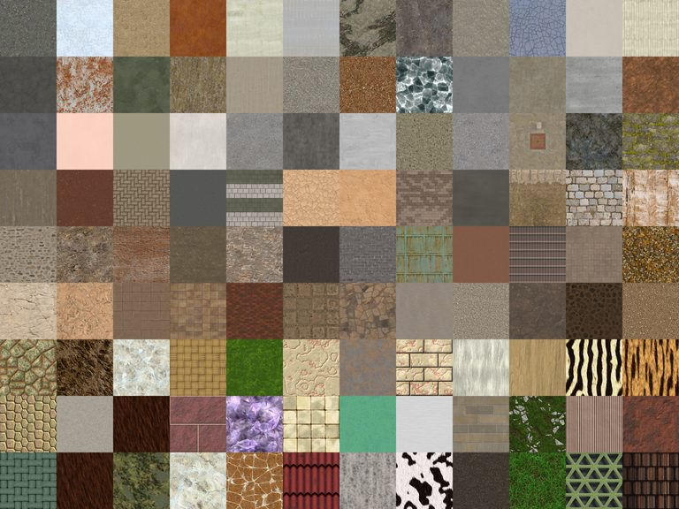
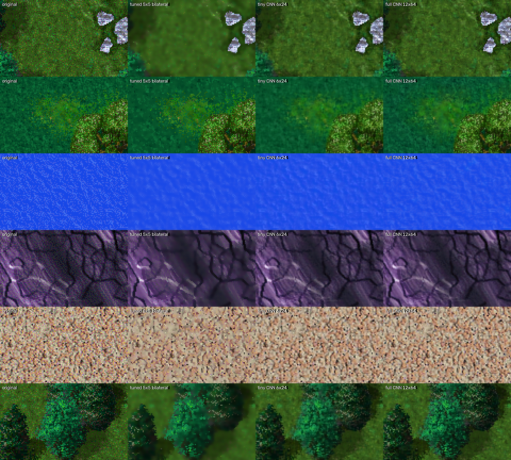

<link rel="stylesheet" href="assets/undither/undither.css?v=__ASSETV__">

# Undithering the 8bpp frame

*What Total Annihilation's own frame buffer looks like once the 256-colour dither is
resolved back into the colours it was standing in for. Fifteen 1920×1080 engine
screenshots — one per map environment in TA and The Core Contingency — captured
2026-09-01 with `tools/tacli`, measured with `tools/undither/restore.py`, and replayed
here through a GPU port of the same three stages so each can be switched on and off and
the undither kernel tuned live.*

## Summary

TA composes every frame into an 8bpp surface, so the picture that reaches the screen is
palette-limited no matter what resolution it runs at. Where the artists wanted a colour
the palette could not hold they dithered: neighbouring pixels alternate between two
palette entries and the eye averages them. That average is *recoverable* — an
edge-preserving filter whose colour tolerance sits just above the dither amplitude and
well below real edge contrast reconstructs the intended colour exactly, without inventing
anything. On these fifteen captures it turns visibly speckled sand, water and rock into
smooth surfaces while keeping unit silhouettes and terrain edges intact (edge retention
0.98–1.00 across the set). [VERIFIED]

Four findings worth carrying forward, the last one being the result: **a small learned
restorer — 373 k parameters, trained in an hour on an RTX 4070 from pairs synthesised
with the game's own palette — beats the tuned bilateral by 3.4 dB on synthetic data and
dithers back into the original frames more faithfully than the bilateral on every frame
tested.** It is the viewer's Learned CNN preset. Getting it to stop shifting colours on
saturated water took a loss term that says what error diffusion does: preserve the local
mean. Before that, in the order they were found: first, **a single TA frame uses only 119–200
distinct colours** — a third of the palette is unused in any one scene, which is why the
banding is as coarse as it is. Second, **the restoration spec's kernel is too wide for
TA's ground art.** Its σ<sub>s</sub> = 1.8 bilateral runs on a 7×7 disc, twice; a
period-2 dither needs nothing like that reach, and on painted single-pixel speckle —
green-planet grass, desert grit, the Urban tileset — the disc outvotes every fleck and
leaves flat mud. A 5×5 disc (σ<sub>s</sub> = 1.2) resolves the dither just as completely
on the water and rock frames and keeps the grass looking like grass; it is now the
viewer's default, with the spec kernel one click away for comparison. Third, and a
correction to the first draft of this page: **the spec's dither detector was right to
stay silent on ten of the fifteen frames.** Its lag-1 autocorrelation test does not fire
where the high-frequency content is authored texture rather than dither, and those are
exactly the frames the spec kernel damages. The detector is a texture-versus-dither
classifier working as designed; what was wrong was forcing a texture-sized kernel through
it. [VERIFIED]

## Try it

Drag the seam to wipe between the original and the restored frame; drag anywhere else to
pan; the wheel zooms. **Zoom to 2:1 or 4:1 — at fit-to-window the dither is smaller than a
screen pixel and there is nothing to see.** The second row of controls is the undither
kernel: five presets (the spec's 7×7, the tuned 5×5 default, a 3×3 cross, the 5×5 with
a luma/chroma-split colour metric, and **Learned CNN**, which swaps in the trained
model's baked output), then the individual knobs behind the bilateral ones — kernel
size, metric, σ<sub>r</sub> as a multiple of q, pass count, and a strength blend back
toward the original. Green planet at 4:1 with **Spec 7×7**, **Tuned 5×5** and
**Learned CNN** in turn is the whole argument of this page in three wipes.

*The Learned CNN images are baked by the model, not computed in the browser, and the
21 MB of bakes are not kept in git. `research/build_wiki.py` generates them on the first
build and whenever the model changes (it needs the `unditherer` environment, see
`unditherer/README.md`). If the preset shows "no bake for …", build the wiki.*

<div id="undither-viewer"></div>

The same viewer runs standalone as `tools/undither/app/index.html`, which is the
prototype this page was built from.

## How the captures were made

`tools/undither/capture.py` drives one `tacli` instance per environment. The front-end
menus drop keys, so it does not fire a canned sequence: it screenshots, classifies the
screen against reference fingerprints of the three menus, sends the key that screen needs
and repeats. Settings that matter:

| Setting | Value | Why |
|---|---|---|
| `--res 1920x1080` | registry `DisplaymodeWidth/Height` | the front end always runs 640×480; the desired mode is applied on game entry (see [Resolution](resolution.html)) |
| `--mapping 0` | "Mapped" | 1 and 2 both read "Unmapped"; without this the frame is mostly fog-black and there is no terrain to look at |
| `--los 0` | "Permanent" | unit visibility only; terrain is already revealed by Mapped |
| camera | untouched | the engine opens centred on the local commander, and nothing scrolls it while no input is sent |

Each run waits for `alive=[1-9]` in `tagpu.log`, lets the game run 20 s at speed +3, then
takes the engine surface shot — TA's own 8bpp buffer, saved as an indexed PNG, which is
exactly the input `restore.py` expects. The skirmish "Current Map" field is cropped from
the setup screen on the way past and kept next to each capture, so the registry map name
can be shown to have taken; all fifteen match. [VERIFIED]

## The three stages

Ordered deliberately: the two that *recover* information the image already encodes run
first, the one that *invents* it is last and optional.

**1 — Undither** (`undither_bilateral`, `undither_split`). Two passes of a bilateral
filter, σ<sub>r</sub> = 1.3 q, where q is the measured dither amplitude. The colour
tolerance is the constant the method lives on: below q the filter treats the dither
checkerboard as an edge and preserves it (the "it does nothing" failure); above real edge
contrast it melts silhouettes. At 1.3 q a dither difference gets weight ≈0.7 and a
three-step edge ≈0.07. Palette-limited art almost always has multi-step real edges, which
is why the gap exists. The *spatial* extent is the constant the spec got wrong for this
material: it asks for σ<sub>s</sub> = 1.8, which OpenCV turns into a 7×7 disc, and the
section below shows why that is twice what a period-2 dither needs. `restore.py` now
carries the kernel as named presets (`--preset spec|tuned|tight|split`, each field
overridable) and the viewer defaults to `tuned`.

**2 — Deband** (`deband`). Where the artist did not dither, a gradient became a staircase
of one-palette-step contours. Blurring across them with σ = 6 px reconstructs the ramp;
anything stronger than 1.5 × step is protected as a real edge and dilated 5×5 so the blur
cannot leak into it. Note the step is measured *after* undithering — on ten of the fifteen
frames it drops below the 8-unit floor once the dither is resolved, and deband correctly
becomes a no-op.

**3 — Enhance** (`enhance_procedural`). Local contrast plus saturation-aware vibrance. It
is the deterministic stand-in for a learned restoration model, and it keeps the two parts
of one that are reproducible while omitting the third — invented tonal drift — which is
exactly what would make two tiles of the same wall stop matching. Expect a 3–5 unit mean
colour shift; that is the vibrance working, not a bug. **No generative or diffusion model
belongs in this pipeline.**

## Why the spec kernel muddies TA grass

The first cut of this page ran the spec kernel on all fifteen frames and called the result
good. Green planet was not good: at 1:1 the grass had gone from speckled to a flat green
smear, and Urban, Desert and Metal had lost their grit the same way, while Crystal and
Water World looked excellent. The difference is what the high-frequency content *is*.

<a href="assets/undither/figs/kernels.png"></a>

*Green planet, Urban and Water World at 4:1: original, spec 7×7, tuned 5×5, and the 5×5
with the luma/chroma-split metric. Rendered by `restore.py` itself, not the viewer.*

Counting palette indices in every 3×3 window of the terrain says it directly. A true
two-tone dither — the thing the spec is built for — shows up as windows holding exactly
two indices; painted speckle shows up as windows holding four or more:

| Frame | 2-index windows | 4+-index windows | Result with the spec kernel |
|---|---|---|---|
| Water World | 41 % | 1 % | excellent — real dither, fully resolved |
| Lush | 21 % | 46 % | good |
| Wet Desert | 19 % | 59 % | good |
| Archipelago | 14 % | 66 % | water good, rock faces smeared |
| Acid | 12 % | 58 % | good |
| Crystal | 1 % | 95 % | excellent — streaks are coherent, cracks are high-contrast |
| Urban | 2 % | 87 % | grass flattened |
| Green planet | 1 % | 90 % | grass flattened |
| Metal | 1 % | 94 % | panel grain flattened |
| Desert | 0.5 % | 97 % | grit flattened |

Strict checkerboards are below 0.3 % everywhere: TA's dither is error-diffusion-like, not
ordered. So the population splits into frames where the noise is two colours alternating
(dither — average them and the intended colour comes back) and frames where it is many
colours in single-pixel flecks (texture — average them and the texture is gone). Crystal
sits in the second group and still looks good because its texture is *coherent*: streaks
several pixels long keep each other alive under the bilateral, and the cracks are far above
σ<sub>r</sub>. Isotropic speckle has no such protection.

The mechanism is spatial reach, not colour tolerance. σ<sub>s</sub> = 1.8 gives OpenCV a
disc of radius 3, and two passes reach ~6 px. A single orange fleck in green sits at
weight 0.26 against ~28 green neighbours, so it is outvoted no matter what σ<sub>r</sub>
says. A period-2 dither, on the other hand, is fully resolved by any kernel that spans
one period. Measured on the terrain area, Nyquist-band energy (the checkerboard component)
and how much of the 3–8 px band survives:

| Frame | original | spec 7×7 | tuned 5×5 | tight 3×3 | luma ÷ chroma 5×5 |
|---|---|---|---|---|---|
| Green planet | 60 | 7 · keeps 53 % | 10 · keeps 72 % | 14 · keeps 87 % | 28 · keeps 83 % |
| Urban | 59 | 10 · 56 % | 12 · 74 % | 17 · 88 % | 25 · 83 % |
| Desert | 205 | 107 · 78 % | 125 · 89 % | 146 · 96 % | 161 · 93 % |
| Crystal | 63 | 17 · 83 % | 22 · 91 % | 27 · 96 % | 45 · 93 % |
| Water World | 53 | 1.4 · 38 % | 2.5 · 66 % | 4.7 · 88 % | 17 · 89 % |

The 5×5 disc removes 80–95 % of the Nyquist energy that the 7×7 does, and keeps 20–30
points more of the mid band. Edge retention is 0.98–1.00 under every kernel (table below).
That is the trade the tuned preset makes; the 3×3 cross keeps still more texture but
leaves visible grain on the water frames, and is offered as a preset rather than the
default for that reason. The split metric is the other end of the same trade: it keeps
the most texture and removes the least dither — on Water World a third of the Nyquist
energy is still there — so it is the preset for textured frames, not a general default.

Approaches that were tried and did not earn a preset: lowering σ<sub>r</sub> to 0.8 q
(barely filters — the fleck contrast is well above q anyway), non-local means (plastic
mush, worse than the spec), a texture gate on distinct-index count (correctly leaves the
grass alone, which means it does nothing to it), and a per-pixel σ<sub>r</sub> from the
nearest-neighbour colour distance (converges to the tuned kernel). One did: **splitting
the range weight into luma and chroma** (`undither_split`) — luma tolerance 0.31 σ<sub>r</sub>,
chroma tolerance 1.15 σ<sub>r</sub>. Off-hue dither flecks are mostly chroma; light/dark
grass structure is mostly luma. It keeps the most texture of any 5×5 variant and is the
"Luma ÷ chroma" preset. Its caveat: it leaves a band step of 8–17 on the textured frames,
which trips the deband gate, and deband's σ = 6 blur then takes some of that texture back.
Toggle Deband off to see the kernel alone. The gate is measuring texture contrast as if it
were a palette staircase; a deband gate that looked at run length rather than neighbour
distance would not fire there. [LEAD]

Everything above is a heuristic. The next section is the thing the heuristics stand in
for: a small learned restorer, which the spec allows (section 5.3, deterministic, 1×) and
which is the only approach that can learn what TA-palette dither looks like as opposed
to what texture looks like.

## A learned restorer

The **Learned CNN** preset in the viewer is a 373,443-parameter residual convolutional
network that was trained to invert exactly what a 1997 art pipeline did: reduce
true-colour source art to the game's single 256-entry palette with error-diffusion
dither. It replaces the undither and deband stages together; the enhance stage still
applies after it. Its output is baked per frame by `unditherer/infer.py`
(0.17 s per 1080p frame on an RTX 4070), so in the viewer it is a texture swap, and the
kernel knobs grey out.

**Training data is synthesised, so ground truth is exact.** 1,548 CC0 true-colour
textures were fetched by `unditherer/fetch_data.py`: 496 ambientCG materials
in the twelve categories that map onto TA's tilesets (ground, rock, grass, snow, ice,
lava, gravel, moss, metal, rust, concrete, asphalt), 527 Poly Haven textures (terrain,
rock, sand, the moon collection, brick, cobblestone, road, metal), and 525 hand-painted
512×512 tiles from Screaming Brain Studios' Tiny Texture Packs on OpenGameArt, which are
the closest thing to TA's own art style in the set. The corpus lives outside git in
`.data/undither-train/` with a manifest recording source, licence and URL per image.
All three sources are CC0 1.0; `unditherer/CREDITS.md` has the verified terms, links
and the names of the people who made the textures.

<a href="assets/undither/figs/corpus.jpg"></a>

*Three rows each from ambientCG, Poly Haven and the painted Tiny Texture Packs.*

Each training pair is made by `unditherer/synth.py`: a random crop, downscaled by a random 1–6× so
photographic detail lands at TA's 32-texel tile scale, then quantised to the game palette
(`ta-palette.json`, read from the captures — all fifteen share it, 242 distinct entries)
with a dither drawn at random per sample: Floyd–Steinberg half the time (PIL's C
implementation, run on a margin-padded crop so error diffusion has warmed up before the
patch), Bayer 4×4 or 8×8 ordered dither, or plain nearest-colour with no dither at all.
That last mode *is* banding, which is why one model covers the deband stage too. Nobody
knows which quantiser Cavedog used; mixing them is the hedge.

**The model** is DnCNN-shaped: twelve 3×3 convolutions, 64 channels, batch norm, a
25-pixel receptive field, predicting the residual so it starts as the identity. L1 loss,
AdamW, one-cycle schedule peaking at 10⁻³, batch 64 of 96×96 patches, fp16 autocast:
40,000 steps is 2.56 million fresh patches and 62 minutes on the 4070 (plus 13 for the
fine-tune described below), at ~800 patches per second with ten CPU workers
synthesising. A second, tiny model — six layers, 24 channels, 22,251 parameters, ~90
GFLOPs per 1080p frame, 57 ms in unoptimised PyTorch — was trained the same way to see
how much of the result survives at a size that could live in a fragment shader inside
the renderer. Both ship in `unditherer/models/` as PyTorch checkpoints and single-file
ONNX exports, with their provenance in `models.json`; `python -m unditherer restore
<frame> --preset learned` runs either one on any image.

**Numbers.** PSNR against the clean target on one fixed set of 512 held-out synthetic
patches (`unditherer/evaluate.py`; higher is better):

| | dithered input | tuned bilateral | tiny CNN 6×24 | full CNN 12×64 |
|---|---|---|---|---|
| plain L1 training | 24.4 dB | 27.0 dB | 30.6 dB | 31.7 dB |
| + block-mean consistency (the shipped models) | | | 29.8 dB | 30.5 dB |

The second row gives up about a decibel of synthetic score and is the one that ships,
for the reason given below. On the game frames there is no ground truth, so the evidence
is the viewer, the figure, and two measurements. First, the QA numbers `prep.py` computes
for the Learned preset, which the readout shows per frame: edge retention 0.99–1.00
and mean colour shift 0.05–1.4 levels across the fifteen frames (the tuned bilateral:
0.07–1.9). Second, a
**dither-consistency test**: re-quantise a candidate output to the palette with
Floyd–Steinberg and ask how well the result reproduces the original frame's palette
pattern — histogram overlap over the terrain area, and the fraction of pixels landing on
exactly the original index. A restoration that cannot be dithered back into the frame it
came from is not a restoration of that frame.

| Frame | tuned bilateral, overlap / exact | full CNN, overlap / exact |
|---|---|---|
| Water World | 0.952 / 0.714 | 0.995 / 0.882 |
| Green planet | 0.798 / 0.330 | 0.865 / 0.529 |
| Lava | 0.847 / 0.630 | 0.911 / 0.817 |
| Crystal | 0.783 / 0.420 | 0.775 / 0.438 |

<a href="assets/undither/figs/learned.png"></a>

*Original, tuned 5×5 bilateral, and the learned restorer at 4:1. Rendered offline from
the baked frames, not by the viewer.*

**What the training taught, in three iterations.** The first 6,000-step run on a
half-fetched corpus already scored 33.9 dB on its own validation set against 28.7 for
the bilateral, and looked right on grass, rock, sand and metal — but it shifted Lush's
saturated jungle green by 14 levels toward a duller, redder colour and left Water World's
dither half-resolved with a hue drift. Both frames sit in regions of the palette that a
corpus of browns and greys never visits. Rotating the hue of half the training crops
through the full circle fixed Lush (3.8 levels) and resolved the water — but the water
still drifted: the full 40,000-step model, at 31.7 dB, rendered it 12 levels brighter
and greener than the frame, and pushing saturation harder in augmentation did nothing
for it. The re-quantisation test explained why. The bilateral's water dithers back into
the frame with 0.95 overlap and the model's with 0.56 — but under *nearest-colour*
quantisation the model's output scores 0.80. It was reading a 66/22/11 % interleave of
three blues as banding rather than dither, and applying the colour prior it had learned
for banded regions. That is a training-signal problem, not a data problem, and the fix is
one term in the loss: on dithered samples the 8×8 block means of the output must match
the block means of the *input*, because error diffusion preserves the local mean by
construction and nothing in a per-pixel loss says so. An 8,000-step fine-tune with that
term took Water World's shift from 12.3 to 0.5 levels and its consistency to 0.995, put
the model above the bilateral on the consistency test for every frame tried, and cost
1.2 dB of synthetic score — the score honestly reporting that a few synthetic targets
are gamut-clipped cases where mean preservation is the wrong answer. Two lessons, both
general: **a palette-inverse model has to be shown the whole palette, not just the
colours its training subject has; and it has to be told that dither is mean-preserving.**
[VERIFIED]

**Caveats.** The model is deterministic and 1×, as the spec requires, and it does not
invent detail in the generative sense — but it does decide, per fleck, whether it is
looking at dither or at painted texture, and that decision comes from the corpus, not
from Cavedog. Green planet's orange flecks are treated mostly as dither of a warmer green;
that is a statistical guess with nothing to check it against — though the consistency
test says the guess dithers back into the frame better than the bilateral's does. The
bakes are lossless WebP, 21 MB that stay out of git and are regenerated by the wiki
build; the two models add 3.2 MB to the repository under `unditherer/models/`. And this is trained on ground textures: unit
sprites, which are rendered at run time through lighting tables rather than dithered,
are outside what it has seen, though nearest-colour banding is in the training mix.

## What the frames measure

Per-frame analysis from `tools/undither/prep.py`, which calls `restore.py`'s own
`analyze()` and `band_step()`. `q` is the dither amplitude in RGB distance (0–441 scale);
`ac1` is the lag-1 autocorrelation of the high-frequency residual in flat regions; the step
columns are the median non-zero neighbour distance before undithering and after each
kernel preset (that number gates deband). Edge retention is the worst case across presets.

| Environment | Map | Set | Colours | q | ac1 | step | after spec | after tuned | after split | detector | edge ret. |
|---|---|---|---|---|---|---|---|---|---|---|---|
| Green planet | Plains and Passes | CC | 176 | 35.8 | −0.18 | 46.1 | 4.1 | 6.0 | 11.9 | no | 0.98 |
| Desert | Painted Desert | TA | 189 | 39.8 | −0.07 | 67.5 | 17.5 | 22.1 | 28.6 | no | 0.99 |
| Archipelago | East Indeez | CC | 200 | 31.2 | −0.15 | 49.5 | 6.4 | 7.7 | 10.8 | no | 1.00 |
| Lava | Red Hot Lava | TA | 171 | 17.1 | −0.09 | 23.0 | 4.1 | 4.9 | 5.8 | no | 1.00 |
| Metal | Core Prime Industrial Area | CC | 197 | 18.1 | +0.02 | 39.8 | 22.0 | 22.5 | 24.9 | no | 1.00 |
| Lunar | Moon Quartet | CC | 154 | 21.2 | −0.06 | 27.7 | 15.6 | 13.9 | 15.6 | no | 1.00 |
| Ice | Polar Range | CC | 161 | 19.6 | −0.01 | 21.5 | 2.8 | 3.6 | 5.0 | no | 0.99 |
| Red Planet | Red River | CC | 178 | 35.8 | −0.32 | 54.0 | 5.4 | 5.8 | 16.4 | **yes** | 0.99 |
| Slate | Temblorian Mist | CC | 169 | 41.2 | −0.24 | 46.3 | 2.2 | 3.6 | 4.6 | **yes** | 0.99 |
| Lush | Lusch Puppy | CC | 200 | 12.8 | −0.05 | 21.5 | 5.4 | 6.0 | 9.6 | no | 1.00 |
| Crystal | Crystal Maze | CC | 167 | 28.6 | −0.19 | 46.3 | 9.5 | 11.5 | 17.4 | no | 0.99 |
| Acid | Acid Pools | CC | 173 | 17.9 | −0.37 | 26.5 | 3.3 | 4.2 | 4.6 | **yes** | 0.99 |
| Water World | Brain Coral | CC | 119 | 33.3 | −0.26 | 44.9 | 2.8 | 3.6 | 7.1 | **yes** | 0.99 |
| Wet Desert | Lake Shore | CC | 183 | 20.4 | −0.09 | 47.3 | 20.4 | 14.5 | 19.7 | no | 1.00 |
| Urban | Assault on Suburbia | CC | 178 | 38.1 | −0.21 | 46.1 | 3.2 | 5.0 | 8.4 | **yes** | 0.98 |

Readings from those numbers:

- **q clusters at 13–41**, i.e. the dither spans a third to a tenth of the palette's
  dynamic range. σ<sub>r</sub> = 1.3 q therefore lands between 17 and 54 — comfortably
  under the contrast of a unit silhouette against terrain, which is what the 0.98–1.00
  edge retention confirms under every kernel.
- **`step` before undithering is 21–68; after the tuned kernel it is 4–23.** On ten frames
  the dither *was* the step: resolve it and there is no staircase left to deband. Desert,
  Metal, Lunar, Crystal and Wet Desert keep a real one under the spec and tuned kernels;
  the split kernel adds Green planet, Archipelago, Lush, Red Planet and Urban to the list,
  and on those it is texture contrast being mistaken for a band (see above).
- **The detector's `ac1 < −0.2` gate is a texture-versus-dither test, and it agrees with
  the index counts.** The five frames it passes are five of the six with the most two-index
  windows; Lush is the miss. What it cannot do is say that a smaller kernel would be safe
  on the frames it rejects — that is what the tuned preset adds. A gate on `q` and the
  fraction of two-index windows would make the same call more directly, and could pick the
  kernel size as well as the on/off decision. [LEAD]
- **No frame is tileable** (opposite borders differ), so padding is `reflect` throughout —
  correct for screenshots, and the reason none of the wrap-mode machinery is exercised
  here. It matters for textures, not for frames.

## The environments

Fifteen captures, one per environment type: eight from the base game's tilesets and seven
introduced or dominated by The Core Contingency. Click for full size.

<div id="undither-gallery"></div>

## Reproducing

```bash
pip install opencv-contrib-python pillow numpy          # cv2 is not a repo dependency

python3 tools/undither/capture.py                       # 15 instances, ~1 min each
python3 tools/undither/prep.py                          # measure -> shots.json + thumbs
python3 -m http.server 8777                             # then open
#   http://127.0.0.1:8777/tools/undither/app/index.html

# the reference pipeline on its own, with sidecars and QA per image
python3 tools/undither/restore.py --in research/notes/assets/undither/shots \
                                  --out /tmp/restored --enhance procedural

# what the viewer shows by default: the tuned kernel, forced on every frame
python3 tools/undither/restore.py --in research/notes/assets/undither/shots \
                                  --out /tmp/restored --preset tuned --force-undither
# any preset field can be overridden: --sigma-s 1.2 --passes 3 --k 1.0 --metric split

# the same stages, any preset or the learned models, on one image (unditherer/README.md)
python3 -m unditherer restore frame.png --preset tuned --kernel 5x5 --passes 2 --report
python3 -m unditherer restore frame.png --preset learned          # models/full.*, torch or onnxruntime

# the learned restorer end to end: corpus (CC0, ~1.4 GB kept, ~4.6 GB transferred),
# 40k-step training, mean-consistency fine-tune, fixed-set eval, export, bake
pip install torch onnx onnxscript onnxruntime            # CUDA wheel, ~2.5 GB
python3 -m unditherer.pipeline --config shipped --stages fetch
python3 -m unditherer.pipeline --config shipped          # train, eval, export, report (~2.5 h on a 4070)
python3 -m unditherer.pipeline --config shipped --stages bake
#   -> assets/undither/learned/*.webp + model.json, shots.json re-measured, site rebuilt;
#      the viewer's "Learned CNN" preset appears once the bakes exist.
# unditherer/LEARNINGS.md is the experiment log: what was tried, what failed, what shipped.
```

`restore.py` is the reference implementation and the source of truth for every parameter
(its stages now live in `unditherer/classical.py`, which it re-exports); its defaults are
still the spec's, and the kernel presets are opt-in there. `assets/undither/undither.js`
is a stage-for-stage WebGL2 port of it, run on the GPU so the toggles are instant; it
reproduces OpenCV's L1 colour metric in the bilateral filter, its `radius = round(1.5σ)`
disc, its `ksize = round(σ·8+1)|1` gaussian radii and its `BORDER_REFLECT_101` edges, and
it carries 8-bit render targets between stages because `restore.py` hands `uint8` from one
stage to the next. Every filter parameter is measured by `prep.py` on the CPU and handed
to the shader; the only thing JavaScript decides is which preset's measurements apply to a
custom kernel (nearest kernel size), and the readout says when it is doing that.

The port is checked numerically, not by eye: the GPU framebuffer is read back in Chrome
and compared with `restore.py`'s output on 32×24 crops of Green planet, Water World and
Crystal under the tuned, tight and split presets. Undither alone differs by a mean of
0.04–0.08 levels (max 2); undither plus deband by 0.19–0.38 (max 2). The spec kernel was
checked the same way when the page was first built (mean 0.06, max 1). [VERIFIED]

## Where this fits

This is not part of the renderer. It is the evidence for one line of the
[GPU renderer roadmap](roadmap.html): the 8bpp composite path is palette-locked, and these
frames show how much colour that ceiling is costing — a third of the palette unused per
scene, gradients quantised to 20–70 unit steps, and the difference resolved out of the
dither being large enough to see at a glance. The same three stages are directly useful
for the [3DO/GAF texture](file-formats.html) work, where the input really is 256-colour
tiling texture art and the wrap-padding, colourkey and BC7 parts of the spec all come into
play.

**Two tools drive the CLI rather than importing it**, both through
`ta3do.undither_frames()` (indexed PNG in, restored RGBA out, one process per batch
because loading the CNN costs far more than running it on a 32×32 texture):

- `tools/ta3do --undither` restores a unit's GAF textures before atlasing them.
- `tools/tascene build --undither` restores a whole **map's tile set** for the browser
  lab's exploration lane ([tascene](tascene-design.html)). Per tile, with no neighbour
  context — a tile restored in isolation differs from the same tile restored inside a 3×3
  patch of its real map neighbours by **2.03/255 on the edge ring, 0.45/255 interior, max
  7**. Two Continents' 5 062 tiles plus its sprite and unit textures are 5 154 frames in
  **55 s**, cached by frame content so a rebuild is free.

<script src="assets/undither/undither.js?v=__ASSETV__"></script>
<script src="assets/undither/undither-ui.js?v=__ASSETV__"></script>
<script src="assets/undither/undither-page.js?v=__ASSETV__"></script>
